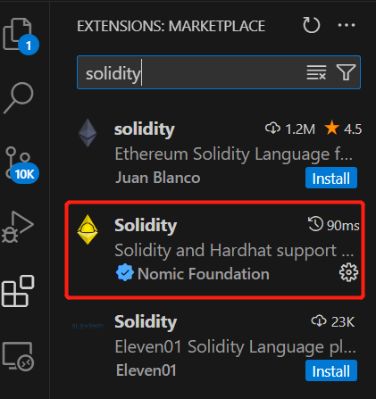

开发环境搭建
===========

以下基于本地Win+远程Centos搭建Solidity开发测试环境

## Step1：安装套件

1.1 vscode安装

[vscode官网](https://code.visualstudio.com/download) 下载vscode安装包，下载windows版本：


1.2 Centos虚拟机安装

安装VMWare虚拟机或者申请一个云Centos服务器...

1.3 在windows电脑上打开ssh功能

在windows的开始->设置->更新和安全->开发者选项内，把开发人员模式的开关调到开


开始->设置->应用->可选功能，确保已经装好OpenSSH服务器，一般来说默认安装OpenSSH客户端。如果没有安装，则需要在“添加功能”里搜到并安装：


1.4 使能免密登录

打开cmd，输入命令ssh-keygen，然后一直回车，直到结束

找到对应位置ssh-key公钥，如（`C:\Users\duyanghao/.ssh/id_rsa.pub`），复制内容

登录Centos服务器，将上述复制内容填加到`~/.ssh/authorized_keys`

## Step2：vscode远程登录

vscode本地安装remote development插件：


安装完成后点击左边新的菜单栏，点即SSH右边的加号，按格式输入用户名，服务器地址（如果端口不是默认的22，需要添加参数-p xxx（端口号），如ssh -p xxx xxx@172.16.xxx.xxx）


选择第一个config保存ssh配置，在右下角弹出的弹框内点击Connet按钮，即可连上远端服务器 

## Step3：远程安装Solidity插件和nodejs

3.1 vscode solidity插件安装 

vscode远程免密登录Centos后，点击插件菜单，搜索solidity，然后点击Install即可远程在服务器上安装Solidity插件：



安装完成后，通过Windows本地的vscode即可解析Centos服务器上的Solidity代码

3.2 安装nodejs

yum安装设置Node.js v16版本：

```sh
$ curl --silent --location https://rpm.nodesource.com/setup_16.x | sudo bash
$ yum -y install nodejs
```

安装完成后即可结合Hardhat工具对Solidity代码进行编译、测试和部署了

## Step4：hardhat安装&使用

```sh
# 安装hardhat
$ mkdir hardhat-tutorial && cd hardhat-tutorial
$ npm init -y
$ npm install --save-dev hardhat
# 初始化hardhat项目
$ npx hardhat init
# 编译solidity
$ npx hardhat compile
# 测试solidity
$ npx hardhat test
$ npx hardhat test test/my-tests.ts
```


