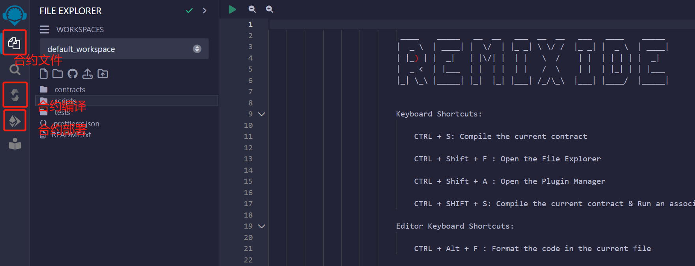
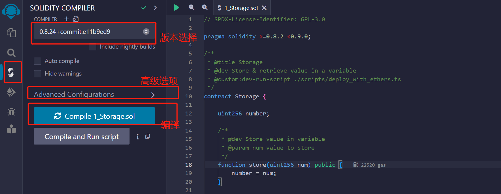
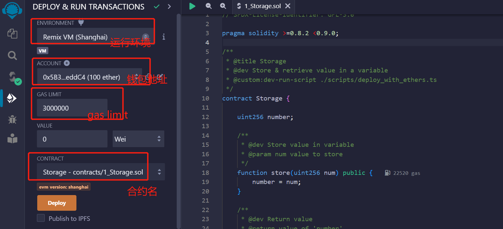
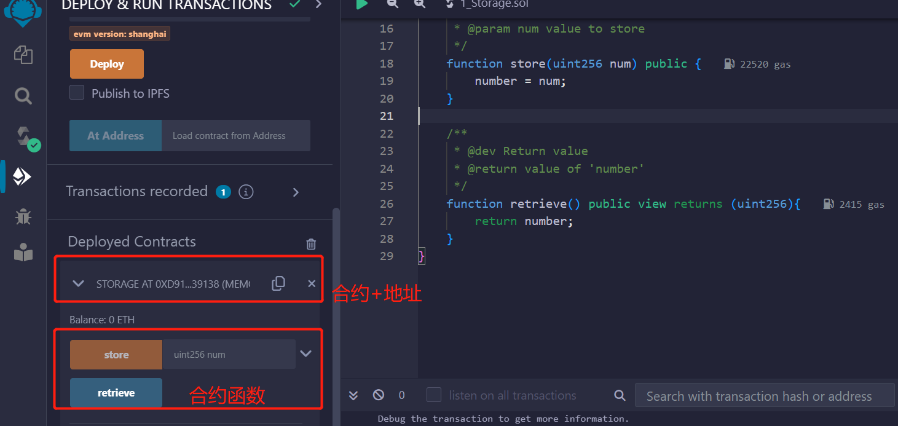
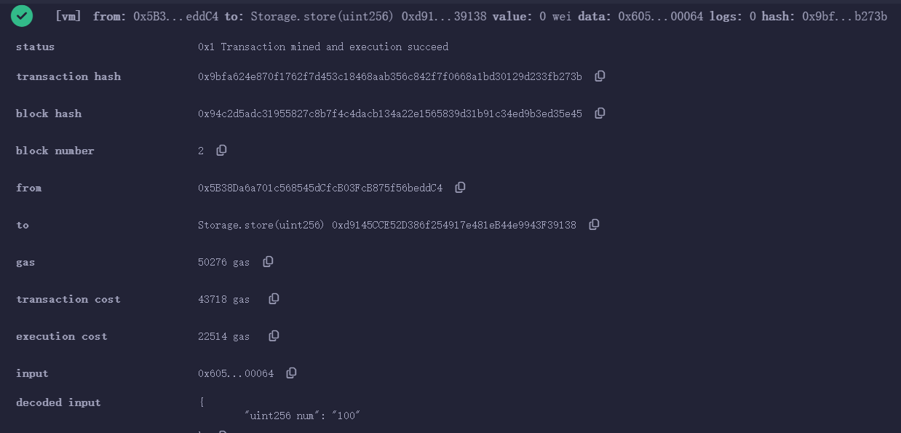
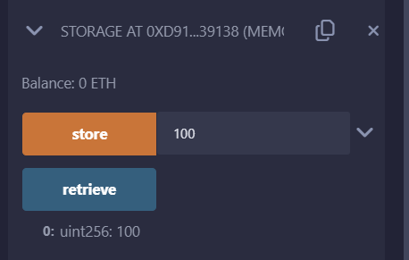
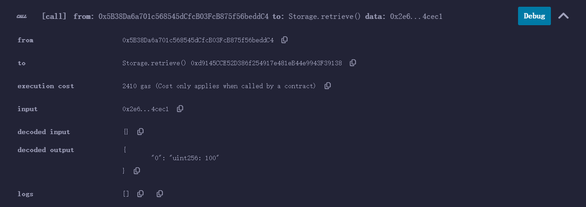

Remix简易入门
============

Remix是以太坊官方推荐的智能合约开发IDE，支持在浏览器中部署测试智能合约，以下为使用简记：

## 面板介绍

打开[官网](https://remix.ethereum.org/)进入Remix（注意Remix只支持在线IDE，不支持客户端版本）

面板默认有若干个图标，其中文件选择，合约编译，部署是最常用的，接下来逐一展开

## 合约编译

打开文件浏览器，可以看到remix自带的三个合约：1_Storage.sol、2_Owner.sol和3_Ballot.sol。1_Storage.sol这个合约实现了对number变量的赋值和读取操作，下面以该例子进行后续说明

点击编译图标，从上到下会显示几个关键功能：solidity版本选择、高级选项、编译等：

点击编译按钮，在合约成功编译后，编译图标上会显示绿色对勾

## 合约部署

下面将编译好的合约部署到本地虚拟机或真实链上。首先点击部署，进入部署界面：

在ENVIRONMENT中，我们可以选择我们部署的环境，默认的是Remix VM，所有交易都在本地浏览器的沙盒区块链中执行，使用的是它给你的虚拟钱包地址；你也可以选择Injected Web3，即连接你的MetaMask钱包，所有交易会在真实的区块链中执行。

下面有几个参数分别介绍一下：

* Account: 钱包地址（the list of accounts associated with the current environment (and their associated balances). On the Remix VM, you have a choice of 5 accounts. If using Injected Web3 with MetaMask, you need to change the account in MetaMask.）
* Gas Limit：合约Gas Limit（This sets the maximum amount of gas that will be allowed for all the transactions created in Remix.）
* Value：给合约发送的以太币（This sets the amount of ETH, WEI, GWEI etc that is sent to a contract or a payable function.）

在CONTRACT栏中选择要部署的合约Storage。1_Storage.sol文件中只有一个合约，因此默认就是部署它；但当文件包含多个合约时，我们需要手动选择要部署的合约，点击DEPLOY键，部署完毕。

注意：如果我们选择的是Injected Web3来部署合约，每一笔交易都将上链，需要钱包确认交易并支付gas

## 合约调用

在合约部署成功后，我们可以在Deployed Contracts中找到我们部署的合约Storage。展开它，我们看到合约中的外部函数：store和retrieve：

store函数文本框中输入100，并点击函数名调用。调用成功后，我们可以在终端上看到log信息，点击Debug按钮可以查看交易详情：

之后，我们调用retrieve函数，显示number变量被更新为100了

终端上看到log信息，点击Debug按钮可以查看交易详情：

## Refs

* [Solidity极简入门-工具篇1：Remix](https://mirror.xyz/wtfacademy.eth/dSYXG9zF_Vclw58Bgcvsv6HSA0SU6pmBoYLFwLAgVbU)