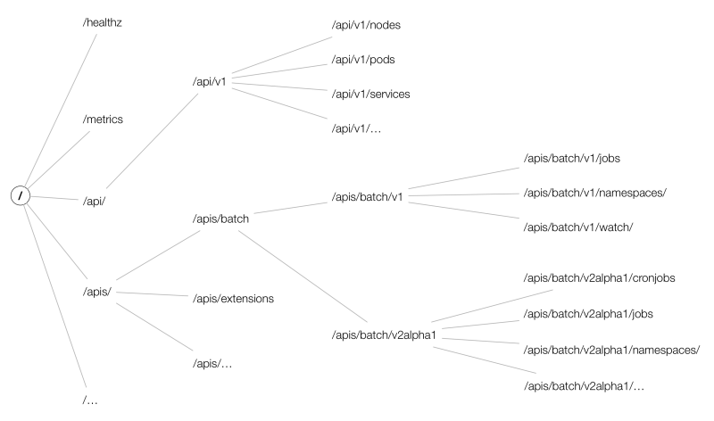

kube-apiserver
==============

Table of Contents
=================

* [概念梳理](#概念梳理)
  * [AggregatorServer](#aggregatorserver)
  * [KubeAPIServer](#kubeapiserver)
  * [APIExtensionServer](#apiextensionserver)
* [启动流程](#启动流程)
  * [CreateServerChain](#createserverchain)
  * [APIExtensionsServer创建](#apiextensionsserver创建)
  * [KubeAPIServer创建](#kubeapiserver创建)
  * [AggregatorServer创建](#aggregatorserver创建)
  * [server.PrepareRun](#serverpreparerun)
  * [prepared.Run](#preparedrun)
  * [storageFactory构建](#storagefactory构建)
    * [NewLegacyRESTStorage](#newlegacyreststorage)
    * [podstore.NewStorage](#podstorenewstorage)
    * [store.CompleteWithOptions](#storecompletewithoptions)
    * [newETCD3Storage](#newetcd3storage)
    * [路由注册](#路由注册)
* [调用链分析](#调用链分析)
* [调用拓扑](#调用拓扑)
* [etcd交互细节](#etcd交互细节)
* [kube-apiserver代码模块整理](#kube-apiserver代码模块整理)
* [Refs](#Refs)       
## 概念梳理

kube-apiserver作为整个Kubernetes集群操作etcd的唯一入口，负责Kubernetes各资源的认证&鉴权，校验以及CRUD等操作。Kubernetes提供RESTful APIs，供其它组件调用，本文将对kube-apiserver整体架构进行源码分析(后续分章节展开各部分细节)


kube-apiserver包含三个APIServer：

* aggregatorServer：暴露的功能类似于一个七层负载均衡，将来自用户的请求拦截转发给其他服务器
* kubeAPIServer：负责对请求的一些通用处理，包括：认证、鉴权以及各个内建资源的 REST 服务等
* apiExtensionsServer：主要处理 CustomResourceDefinition（CRD）和 CustomResource（CR）的 REST 请求，也是 Delegation 的最后一环，如果对应 CR 不能被处理的话则会返回 404

AggregatorServer 和 APIExtensionsServer 对应两种主要扩展 APIServer 资源的方式，也即分别是 AA 和 CRD

### AggregatorServer

其中，Aggregator 通过 APIServices 对象关联到某个 Service 来进行请求的转发，其关联的 Service 类型进一步决定了请求转发形式。Aggregator 包括一个 `GenericAPIServer` 和维护自身状态的 Controller。其中 `GenericAPIServer` 主要处理 `apiregistration.k8s.io` 组下的 APIService 资源请求，controller包括：

- `apiserviceRegistrationController`：负责 APIServices 中资源的注册与删除；
- `availableConditionController`：维护 APIServices 的可用状态，包括其引用 Service 是否可用等；
- `autoRegistrationController`：用于保持 API 中存在的一组特定的 APIServices；
- `crdRegistrationController`：负责将 CRD GroupVersions 自动注册到 APIServices 中；
- `openAPIAggregationController`：将 APIServices 资源的变化同步至提供的 OpenAPI 文档；

Kubernetes 中的一些附加组件，比如 metrics-server 就是通过 Aggregator 的方式进行扩展的，实际环境中可以通过使用 [apiserver-builder](https://github.com/kubernetes-sigs/apiserver-builder-alpha) 工具轻松以 Aggregator 的扩展方式创建自定义资源

### KubeAPIServer

KubeAPIServer 主要是提供对 API Resource 的操作请求，为 Kubernetes 中众多 API 注册路由信息，暴露 RESTful API 并且对外提供 Kubernetes service，使集群中以及集群外的服务都可以通过 RESTful API 操作 kubernetes 中的资源

### APIExtensionServer

APIExtensionServer 作为 Delegation 链的最后一层，是处理所有用户通过 Custom Resource Definition 定义的资源服务器

其中包含的 controller 以及功能如下所示：

- `openapiController`：将 crd 资源的变化同步至提供的 OpenAPI 文档，可通过访问 `/openapi/v2` 进行查看；
- `crdController`：负责将 crd 信息注册到 apiVersions 和 apiResources 中，两者的信息可通过 `$ kubectl api-versions` 和 `$ kubectl api-resources` 查看；
- `namingController`：检查 crd obj 中是否有命名冲突，可在 crd `.status.conditions` 中查看；
- `establishingController`：检查 crd 是否处于正常状态，可在 crd `.status.conditions` 中查看；
- `nonStructuralSchemaController`：检查 crd obj 结构是否正常，可在 crd `.status.conditions` 中查看；
- `apiApprovalController`：检查 crd 是否遵循 Kubernetes API 声明策略，可在 crd `.status.conditions` 中查看；
- `finalizingController`：类似于 finalizes 的功能，与 CRs 的删除有关；

## 启动流程

kube-apiserver启动主体函数为Run：

```go
// Run runs the specified APIServer.  This should never exit.
func Run(completeOptions completedServerRunOptions, stopCh <-chan struct{}) error {
	// To help debugging, immediately log version
	klog.Infof("Version: %+v", version.Get())

	server, err := CreateServerChain(completeOptions, stopCh)
	if err != nil {
		return err
	}

	prepared, err := server.PrepareRun()
	if err != nil {
		return err
	}

	return prepared.Run(stopCh)
}
```

`Run` 方法的主要逻辑为：

- 1、调用 `CreateServerChain` 构建服务调用链并判断是否启动非安全的 http server，http server 链中包含 apiserver 要启动的三个 server，以及为每个 server 注册对应资源的路由；
- 2、调用 `server.PrepareRun` 进行服务运行前的准备，该方法主要完成了健康检查、存活检查和`OpenAPI`路由的注册工作；
- 3、调用 `prepared.Run` 启动 https server；

server 的初始化使用委托模式，通过 DelegationTarget 接口，把基本的 API Server、CustomResource、Aggregator 这三种服务采用链式结构串联起来，对外提供服务：

```go
// DelegationTarget is an interface which allows for composition of API servers with top level handling that works
// as expected.
type DelegationTarget interface {
	// UnprotectedHandler returns a handler that is NOT protected by a normal chain
	UnprotectedHandler() http.Handler

	// PostStartHooks returns the post-start hooks that need to be combined
	PostStartHooks() map[string]postStartHookEntry

	// PreShutdownHooks returns the pre-stop hooks that need to be combined
	PreShutdownHooks() map[string]preShutdownHookEntry

	// HealthzChecks returns the healthz checks that need to be combined
	HealthzChecks() []healthz.HealthChecker

	// ListedPaths returns the paths for supporting an index
	ListedPaths() []string

	// NextDelegate returns the next delegationTarget in the chain of delegations
	NextDelegate() DelegationTarget

	// PrepareRun does post API installation setup steps. It calls recursively the same function of the delegates.
	PrepareRun() preparedGenericAPIServer
}
```

### CreateServerChain

`CreateServerChain` 是完成 server 初始化的方法，里面包含 `APIExtensionsServer`、`KubeAPIServer`、`AggregatorServer` 初始化的所有流程，最终返回 `aggregatorapiserver.APIAggregator` 实例，初始化流程主要有：http filter chain 的配置、API Group 的注册、http path 与 handler 的关联以及 handler 后端存储 etcd 的配置。其主要逻辑为：

- 1、调用 `CreateKubeAPIServerConfig` 创建 KubeAPIServer 所需要的配置，主要是创建 `master.Config`，其中会调用 `buildGenericConfig` 生成 genericConfig，genericConfig 中包含 apiserver 的核心配置；
- 2、判断是否启用了扩展的 API server 并调用 `createAPIExtensionsConfig` 为其创建配置；
- 3、调用 `createAPIExtensionsServer` 创建 apiExtensionsServer 实例；
- 4、调用 `CreateKubeAPIServer `初始化 kubeAPIServer；
- 5、调用 `createAggregatorConfig` 为 aggregatorServer 创建配置并调用 `createAggregatorServer` 初始化 aggregatorServer；
- 6、配置并判断是否启动非安全的 http server；

```go
// CreateServerChain creates the apiservers connected via delegation.
func CreateServerChain(completedOptions completedServerRunOptions, stopCh <-chan struct{}) (*aggregatorapiserver.APIAggregator, error) {
	nodeTunneler, proxyTransport, err := CreateNodeDialer(completedOptions)
	if err != nil {
		return nil, err
	}

	kubeAPIServerConfig, insecureServingInfo, serviceResolver, pluginInitializer, err := CreateKubeAPIServerConfig(completedOptions, nodeTunneler, proxyTransport)
	if err != nil {
		return nil, err
	}

	// If additional API servers are added, they should be gated.
	apiExtensionsConfig, err := createAPIExtensionsConfig(*kubeAPIServerConfig.GenericConfig, kubeAPIServerConfig.ExtraConfig.VersionedInformers, pluginInitializer, completedOptions.ServerRunOptions, completedOptions.MasterCount,
		serviceResolver, webhook.NewDefaultAuthenticationInfoResolverWrapper(proxyTransport, kubeAPIServerConfig.GenericConfig.EgressSelector, kubeAPIServerConfig.GenericConfig.LoopbackClientConfig))
	if err != nil {
		return nil, err
	}
	apiExtensionsServer, err := createAPIExtensionsServer(apiExtensionsConfig, genericapiserver.NewEmptyDelegate())
	if err != nil {
		return nil, err
	}

	kubeAPIServer, err := CreateKubeAPIServer(kubeAPIServerConfig, apiExtensionsServer.GenericAPIServer)
	if err != nil {
		return nil, err
	}

	// aggregator comes last in the chain
	aggregatorConfig, err := createAggregatorConfig(*kubeAPIServerConfig.GenericConfig, completedOptions.ServerRunOptions, kubeAPIServerConfig.ExtraConfig.VersionedInformers, serviceResolver, proxyTransport, pluginInitializer)
	if err != nil {
		return nil, err
	}
	aggregatorServer, err := createAggregatorServer(aggregatorConfig, kubeAPIServer.GenericAPIServer, apiExtensionsServer.Informers)
	if err != nil {
		// we don't need special handling for innerStopCh because the aggregator server doesn't create any go routines
		return nil, err
	}

	if insecureServingInfo != nil {
		insecureHandlerChain := kubeserver.BuildInsecureHandlerChain(aggregatorServer.GenericAPIServer.UnprotectedHandler(), kubeAPIServerConfig.GenericConfig)
		if err := insecureServingInfo.Serve(insecureHandlerChain, kubeAPIServerConfig.GenericConfig.RequestTimeout, stopCh); err != nil {
			return nil, err
		}
	}

	return aggregatorServer, nil
}
```

先看CreateKubeAPIServerConfig，在 `CreateKubeAPIServerConfig` 中主要是调用 `buildGenericConfig` 创建 genericConfig 以及构建 master.Config 对象：

```go
// CreateKubeAPIServerConfig creates all the resources for running the API server, but runs none of them
func CreateKubeAPIServerConfig(
	s completedServerRunOptions,
	nodeTunneler tunneler.Tunneler,
	proxyTransport *http.Transport,
) (
	*master.Config,
	*genericapiserver.DeprecatedInsecureServingInfo,
	aggregatorapiserver.ServiceResolver,
	[]admission.PluginInitializer,
	error,
) {
	// 1、构建 genericConfig
	genericConfig, versionedInformers, insecureServingInfo, serviceResolver, pluginInitializers, admissionPostStartHook, storageFactory, err := buildGenericConfig(s.ServerRunOptions, proxyTransport)
	if err != nil {
		return nil, nil, nil, nil, err
	}
	
	... 
	// 2、初始化所支持的 capabilities
	capabilities.Initialize(capabilities.Capabilities{
		AllowPrivileged: s.AllowPrivileged,
		// TODO(vmarmol): Implement support for HostNetworkSources.
		PrivilegedSources: capabilities.PrivilegedSources{
			HostNetworkSources: []string{},
			HostPIDSources:     []string{},
			HostIPCSources:     []string{},
		},
		PerConnectionBandwidthLimitBytesPerSec: s.MaxConnectionBytesPerSec,
	})

	if len(s.ShowHiddenMetricsForVersion) > 0 {
		metrics.SetShowHidden()
	}
  
	// 3、获取 service ip range 以及 api server service IP
	serviceIPRange, apiServerServiceIP, err := master.ServiceIPRange(s.PrimaryServiceClusterIPRange)
	if err != nil {
		return nil, nil, nil, nil, err
	}

	...
	// 4、构建 master.Config 对象
	config := &master.Config{
		GenericConfig: genericConfig,
		ExtraConfig: master.ExtraConfig{
			APIResourceConfigSource: storageFactory.APIResourceConfigSource,
			StorageFactory:          storageFactory,
			EventTTL:                s.EventTTL,
			KubeletClientConfig:     s.KubeletConfig,
			EnableLogsSupport:       s.EnableLogsHandler,
			ProxyTransport:          proxyTransport,

			Tunneler: nodeTunneler,

			ServiceIPRange:          serviceIPRange,
			APIServerServiceIP:      apiServerServiceIP,
			SecondaryServiceIPRange: secondaryServiceIPRange,

			APIServerServicePort: 443,

			ServiceNodePortRange:      s.ServiceNodePortRange,
			KubernetesServiceNodePort: s.KubernetesServiceNodePort,

			EndpointReconcilerType: reconcilers.Type(s.EndpointReconcilerType),
			MasterCount:            s.MasterCount,

			ServiceAccountIssuer:        s.ServiceAccountIssuer,
			ServiceAccountMaxExpiration: s.ServiceAccountTokenMaxExpiration,

			VersionedInformers: versionedInformers,
		},
	}

	...

	return config, insecureServingInfo, serviceResolver, pluginInitializers, nil
}
```

展开buildGenericConfig：

```go
// BuildGenericConfig takes the master server options and produces the genericapiserver.Config associated with it
func buildGenericConfig(
	s *options.ServerRunOptions,
	proxyTransport *http.Transport,
) (
	genericConfig *genericapiserver.Config,
	versionedInformers clientgoinformers.SharedInformerFactory,
	insecureServingInfo *genericapiserver.DeprecatedInsecureServingInfo,
	serviceResolver aggregatorapiserver.ServiceResolver,
	pluginInitializers []admission.PluginInitializer,
	admissionPostStartHook genericapiserver.PostStartHookFunc,
	storageFactory *serverstorage.DefaultStorageFactory,
	lastErr error,
) {
	// 1、为 genericConfig 设置默认值
	genericConfig = genericapiserver.NewConfig(legacyscheme.Codecs)
	genericConfig.MergedResourceConfig = master.DefaultAPIResourceConfigSource()

	...

	genericConfig.OpenAPIConfig = genericapiserver.DefaultOpenAPIConfig(generatedopenapi.GetOpenAPIDefinitions, openapinamer.NewDefinitionNamer(legacyscheme.Scheme, extensionsapiserver.Scheme, aggregatorscheme.Scheme))
	genericConfig.OpenAPIConfig.Info.Title = "Kubernetes"
	genericConfig.LongRunningFunc = filters.BasicLongRunningRequestCheck(
		sets.NewString("watch", "proxy"),
		sets.NewString("attach", "exec", "proxy", "log", "portforward"),
	)

	kubeVersion := version.Get()
	genericConfig.Version = &kubeVersion

	storageFactoryConfig := kubeapiserver.NewStorageFactoryConfig()
	storageFactoryConfig.APIResourceConfig = genericConfig.MergedResourceConfig
	completedStorageFactoryConfig, err := storageFactoryConfig.Complete(s.Etcd)
	if err != nil {
		lastErr = err
		return
	}
	// 初始化 storageFactory
	storageFactory, lastErr = completedStorageFactoryConfig.New()
	if lastErr != nil {
		return
	}
	if genericConfig.EgressSelector != nil {
		storageFactory.StorageConfig.Transport.EgressLookup = genericConfig.EgressSelector.Lookup
	}
	// 2、初始化 RESTOptionsGetter，后期根据其获取操作 Etcd 的句柄，同时添加 etcd 的健康检查方法
	if lastErr = s.Etcd.ApplyWithStorageFactoryTo(storageFactory, genericConfig); lastErr != nil {
		return
	}

	// 3、设置使用 protobufs 用来内部交互，并且禁用压缩功能
	// Use protobufs for self-communication.
	// Since not every generic apiserver has to support protobufs, we
	// cannot default to it in generic apiserver and need to explicitly
	// set it in kube-apiserver.
	genericConfig.LoopbackClientConfig.ContentConfig.ContentType = "application/vnd.kubernetes.protobuf"
	// Disable compression for self-communication, since we are going to be
	// on a fast local network
	genericConfig.LoopbackClientConfig.DisableCompression = true

	// 4、创建 clientset
	kubeClientConfig := genericConfig.LoopbackClientConfig
	clientgoExternalClient, err := clientgoclientset.NewForConfig(kubeClientConfig)
	if err != nil {
		lastErr = fmt.Errorf("failed to create real external clientset: %v", err)
		return
	}
	versionedInformers = clientgoinformers.NewSharedInformerFactory(clientgoExternalClient, 10*time.Minute)

	// 5、创建认证实例，支持多种认证方式：请求 Header 认证、Auth 文件认证、CA 证书认证、Bearer token 认证、
	// ServiceAccount 认证、BootstrapToken 认证、WebhookToken 认证等
	genericConfig.Authentication.Authenticator, genericConfig.OpenAPIConfig.SecurityDefinitions, err = BuildAuthenticator(s, genericConfig.EgressSelector, clientgoExternalClient, versionedInformers)
	if err != nil {
		lastErr = fmt.Errorf("invalid authentication config: %v", err)
		return
	}

	// 6、创建鉴权实例，包含：Node、RBAC、Webhook、ABAC、AlwaysAllow、AlwaysDeny
	genericConfig.Authorization.Authorizer, genericConfig.RuleResolver, err = BuildAuthorizer(s, genericConfig.EgressSelector, versionedInformers)
	if err != nil {
		lastErr = fmt.Errorf("invalid authorization config: %v", err)
		return
	}
	if !sets.NewString(s.Authorization.Modes...).Has(modes.ModeRBAC) {
		genericConfig.DisabledPostStartHooks.Insert(rbacrest.PostStartHookName)
	}

	admissionConfig := &kubeapiserveradmission.Config{
		ExternalInformers:    versionedInformers,
		LoopbackClientConfig: genericConfig.LoopbackClientConfig,
		CloudConfigFile:      s.CloudProvider.CloudConfigFile,
	}
	serviceResolver = buildServiceResolver(s.EnableAggregatorRouting, genericConfig.LoopbackClientConfig.Host, versionedInformers)

	authInfoResolverWrapper := webhook.NewDefaultAuthenticationInfoResolverWrapper(proxyTransport, genericConfig.EgressSelector, genericConfig.LoopbackClientConfig)

	// 7、审计插件的初始化
	lastErr = s.Audit.ApplyTo(
		genericConfig,
		genericConfig.LoopbackClientConfig,
		versionedInformers,
		serveroptions.NewProcessInfo("kube-apiserver", "kube-system"),
		&serveroptions.WebhookOptions{
			AuthInfoResolverWrapper: authInfoResolverWrapper,
			ServiceResolver:         serviceResolver,
		},
	)
	if lastErr != nil {
		return
	}

	// 8、准入插件的初始化
	pluginInitializers, admissionPostStartHook, err = admissionConfig.New(proxyTransport, genericConfig.EgressSelector, serviceResolver)
	if err != nil {
		lastErr = fmt.Errorf("failed to create admission plugin initializer: %v", err)
		return
	}

	err = s.Admission.ApplyTo(
		genericConfig,
		versionedInformers,
		kubeClientConfig,
		feature.DefaultFeatureGate,
		pluginInitializers...)
	if err != nil {
		lastErr = fmt.Errorf("failed to initialize admission: %v", err)
	}

	return
}

func DefaultBuildHandlerChain(apiHandler http.Handler, c *Config) http.Handler {
	handler := genericapifilters.WithAuthorization(apiHandler, c.Authorization.Authorizer, c.Serializer)
	if c.FlowControl != nil {
		handler = genericfilters.WithPriorityAndFairness(handler, c.LongRunningFunc, c.FlowControl)
	} else {
		handler = genericfilters.WithMaxInFlightLimit(handler, c.MaxRequestsInFlight, c.MaxMutatingRequestsInFlight, c.LongRunningFunc)
	}
	handler = genericapifilters.WithImpersonation(handler, c.Authorization.Authorizer, c.Serializer)
	handler = genericapifilters.WithAudit(handler, c.AuditBackend, c.AuditPolicyChecker, c.LongRunningFunc)
	failedHandler := genericapifilters.Unauthorized(c.Serializer, c.Authentication.SupportsBasicAuth)
	failedHandler = genericapifilters.WithFailedAuthenticationAudit(failedHandler, c.AuditBackend, c.AuditPolicyChecker)
	handler = genericapifilters.WithAuthentication(handler, c.Authentication.Authenticator, failedHandler, c.Authentication.APIAudiences)
	handler = genericfilters.WithCORS(handler, c.CorsAllowedOriginList, nil, nil, nil, "true")
	handler = genericfilters.WithTimeoutForNonLongRunningRequests(handler, c.LongRunningFunc, c.RequestTimeout)
	handler = genericfilters.WithWaitGroup(handler, c.LongRunningFunc, c.HandlerChainWaitGroup)
	handler = genericapifilters.WithRequestInfo(handler, c.RequestInfoResolver)
	if c.SecureServing != nil && !c.SecureServing.DisableHTTP2 && c.GoawayChance > 0 {
		handler = genericfilters.WithProbabilisticGoaway(handler, c.GoawayChance)
	}
	handler = genericapifilters.WithCacheControl(handler)
	handler = genericfilters.WithPanicRecovery(handler)
	return handler
}
```

主要逻辑为：

- 1、调用 `genericapiserver.NewConfig` 生成默认的 genericConfig，genericConfig 中主要配置了 `DefaultBuildHandlerChain`，`DefaultBuildHandlerChain` 中包含了认证、鉴权等一系列 http filter chain；
- 2、调用 `master.DefaultAPIResourceConfigSource` 加载需要启用的 API Resource，集群中所有的 API Resource 可以在代码的 `k8s.io/api` 目录中看到，随着版本的迭代也会不断变化；
- 3、为 genericConfig 中的部分字段设置默认值；
- 4、调用 `completedStorageFactoryConfig.New` 创建 storageFactory，后面会使用 storageFactory 为每种API Resource 创建对应的 RESTStorage；

以上主要分析 KubeAPIServerConfig 的初始化，其他两个 server config 的初始化暂且不详细分析，下面接着继续分析 server 的初始化

### APIExtensionsServer创建

APIExtensionsServer 是最先被初始化的，在 `createAPIExtensionsServer` 中调用 `apiextensionsConfig.Complete().New` 来完成 server 的初始化，其主要逻辑为：

- 1、首先调用 `c.GenericConfig.New` 按照`go-restful`的模式初始化 Container，在 `c.GenericConfig.New` 中会调用 `NewAPIServerHandler` 初始化 handler，APIServerHandler 包含了 API Server 使用的多种http.Handler 类型，包括 `go-restful` 以及 `non-go-restful`，以及在以上两者之间选择的 Director 对象，`go-restful` 用于处理已经注册的 handler，`non-go-restful` 用来处理不存在的 handler，API URI 处理的选择过程为：`FullHandlerChain-> Director ->{GoRestfulContainer， NonGoRestfulMux}`。在 `c.GenericConfig.New` 中还会调用 `installAPI`来添加包括 `/`、`/debug/*`、`/metrics`、`/version` 等路由信息。三种 server 在初始化时首先都会调用 `c.GenericConfig.New` 来初始化一个 genericServer，然后进行 API 的注册；
- 2、调用 `s.GenericAPIServer.InstallAPIGroup` 在路由中注册 API Resources，此方法的调用链非常深，主要是为了将需要暴露的 API Resource 注册到 server 中，以便能通过 http 接口进行 resource 的 REST 操作，其他几种 server 在初始化时也都会执行对应的 `InstallAPI`；
- 3、初始化 server 中需要使用的 controller，主要有 `openapiController`、`crdController`、`namingController`、`establishingController`、`nonStructuralSchemaController`、`apiApprovalController`、`finalizingControlle`r；
- 4、将需要启动的 controller 以及 informer 添加到 PostStartHook 中；

```go
func createAPIExtensionsServer(apiextensionsConfig *apiextensionsapiserver.Config, delegateAPIServer genericapiserver.DelegationTarget) (*apiextensionsapiserver.CustomResourceDefinitions, error) {
	return apiextensionsConfig.Complete().New(delegateAPIServer)
}

...
// k8s.io/kubernetes/vendor/k8s.io/apiextensions-apiserver/pkg/apiserver/apiserver.go:129
// New returns a new instance of CustomResourceDefinitions from the given config.
func (c completedConfig) New(delegationTarget genericapiserver.DelegationTarget) (*CustomResourceDefinitions, error) {
	// 1、初始化 genericServer
	genericServer, err := c.GenericConfig.New("apiextensions-apiserver", delegationTarget)
	if err != nil {
		return nil, err
	}

	s := &CustomResourceDefinitions{
		GenericAPIServer: genericServer,
	}
	// 2、初始化 APIGroup Info，APIGroup 指该 server 需要暴露的 API
	apiResourceConfig := c.GenericConfig.MergedResourceConfig
	apiGroupInfo := genericapiserver.NewDefaultAPIGroupInfo(apiextensions.GroupName, Scheme, metav1.ParameterCodec, Codecs)
	if apiResourceConfig.VersionEnabled(v1beta1.SchemeGroupVersion) {
		storage := map[string]rest.Storage{}
		// customresourcedefinitions
		customResourceDefintionStorage := customresourcedefinition.NewREST(Scheme, c.GenericConfig.RESTOptionsGetter)
		storage["customresourcedefinitions"] = customResourceDefintionStorage
		storage["customresourcedefinitions/status"] = customresourcedefinition.NewStatusREST(Scheme, customResourceDefintionStorage)

		apiGroupInfo.VersionedResourcesStorageMap[v1beta1.SchemeGroupVersion.Version] = storage
	}
	if apiResourceConfig.VersionEnabled(v1.SchemeGroupVersion) {
		storage := map[string]rest.Storage{}
		// customresourcedefinitions
		customResourceDefintionStorage := customresourcedefinition.NewREST(Scheme, c.GenericConfig.RESTOptionsGetter)
		storage["customresourcedefinitions"] = customResourceDefintionStorage
		storage["customresourcedefinitions/status"] = customresourcedefinition.NewStatusREST(Scheme, customResourceDefintionStorage)

		apiGroupInfo.VersionedResourcesStorageMap[v1.SchemeGroupVersion.Version] = storage
	}
	
	// 3、注册 APIGroup
	if err := s.GenericAPIServer.InstallAPIGroup(&apiGroupInfo); err != nil {
		return nil, err
	}

	// 4、初始化需要使用的 controller
	crdClient, err := clientset.NewForConfig(s.GenericAPIServer.LoopbackClientConfig)
	if err != nil {
		// it's really bad that this is leaking here, but until we can fix the test (which I'm pretty sure isn't even testing what it wants to test),
		// we need to be able to move forward
		return nil, fmt.Errorf("failed to create clientset: %v", err)
	}
	s.Informers = externalinformers.NewSharedInformerFactory(crdClient, 5*time.Minute)
	
	...
	establishingController := establish.NewEstablishingController(s.Informers.Apiextensions().V1().CustomResourceDefinitions(), crdClient.ApiextensionsV1())
	crdHandler, err := NewCustomResourceDefinitionHandler(
		versionDiscoveryHandler,
		groupDiscoveryHandler,
		s.Informers.Apiextensions().V1().CustomResourceDefinitions(),
		delegateHandler,
		c.ExtraConfig.CRDRESTOptionsGetter,
		c.GenericConfig.AdmissionControl,
		establishingController,
		c.ExtraConfig.ServiceResolver,
		c.ExtraConfig.AuthResolverWrapper,
		c.ExtraConfig.MasterCount,
		s.GenericAPIServer.Authorizer,
		c.GenericConfig.RequestTimeout,
		time.Duration(c.GenericConfig.MinRequestTimeout)*time.Second,
		apiGroupInfo.StaticOpenAPISpec,
		c.GenericConfig.MaxRequestBodyBytes,
	)
	if err != nil {
		return nil, err
	}
	s.GenericAPIServer.Handler.NonGoRestfulMux.Handle("/apis", crdHandler)
	s.GenericAPIServer.Handler.NonGoRestfulMux.HandlePrefix("/apis/", crdHandler)

	crdController := NewDiscoveryController(s.Informers.Apiextensions().V1().CustomResourceDefinitions(), versionDiscoveryHandler, groupDiscoveryHandler)
	namingController := status.NewNamingConditionController(s.Informers.Apiextensions().V1().CustomResourceDefinitions(), crdClient.ApiextensionsV1())
	nonStructuralSchemaController := nonstructuralschema.NewConditionController(s.Informers.Apiextensions().V1().CustomResourceDefinitions(), crdClient.ApiextensionsV1())
	apiApprovalController := apiapproval.NewKubernetesAPIApprovalPolicyConformantConditionController(s.Informers.Apiextensions().V1().CustomResourceDefinitions(), crdClient.ApiextensionsV1())
	finalizingController := finalizer.NewCRDFinalizer(
		s.Informers.Apiextensions().V1().CustomResourceDefinitions(),
		crdClient.ApiextensionsV1(),
		crdHandler,
	)
	openapiController := openapicontroller.NewController(s.Informers.Apiextensions().V1().CustomResourceDefinitions())
	
	// 5、将 informer 以及 controller 添加到 PostStartHook 中
	s.GenericAPIServer.AddPostStartHookOrDie("start-apiextensions-informers", func(context genericapiserver.PostStartHookContext) error {
		s.Informers.Start(context.StopCh)
		return nil
	})
	s.GenericAPIServer.AddPostStartHookOrDie("start-apiextensions-controllers", func(context genericapiserver.PostStartHookContext) error {
		// OpenAPIVersionedService and StaticOpenAPISpec are populated in generic apiserver PrepareRun().
		// Together they serve the /openapi/v2 endpoint on a generic apiserver. A generic apiserver may
		// choose to not enable OpenAPI by having null openAPIConfig, and thus OpenAPIVersionedService
		// and StaticOpenAPISpec are both null. In that case we don't run the CRD OpenAPI controller.
		if s.GenericAPIServer.OpenAPIVersionedService != nil && s.GenericAPIServer.StaticOpenAPISpec != nil {
			go openapiController.Run(s.GenericAPIServer.StaticOpenAPISpec, s.GenericAPIServer.OpenAPIVersionedService, context.StopCh)
		}

		go crdController.Run(context.StopCh)
		go namingController.Run(context.StopCh)
		go establishingController.Run(context.StopCh)
		go nonStructuralSchemaController.Run(5, context.StopCh)
		go apiApprovalController.Run(5, context.StopCh)
		go finalizingController.Run(5, context.StopCh)
		return nil
	})
	// we don't want to report healthy until we can handle all CRDs that have already been registered.  Waiting for the informer
	// to sync makes sure that the lister will be valid before we begin.  There may still be races for CRDs added after startup,
	// but we won't go healthy until we can handle the ones already present.
	s.GenericAPIServer.AddPostStartHookOrDie("crd-informer-synced", func(context genericapiserver.PostStartHookContext) error {
		return wait.PollImmediateUntil(100*time.Millisecond, func() (bool, error) {
			return s.Informers.Apiextensions().V1().CustomResourceDefinitions().Informer().HasSynced(), nil
		}, context.StopCh)
	})

	return s, nil
}

// k8s.io/kubernetes/vendor/k8s.io/apiserver/pkg/server/config.go:520
// New creates a new server which logically combines the handling chain with the passed server.
// name is used to differentiate for logging. The handler chain in particular can be difficult as it starts delgating.
// delegationTarget may not be nil.
func (c completedConfig) New(name string, delegationTarget DelegationTarget) (*GenericAPIServer, error) {   
    ...
	handlerChainBuilder := func(handler http.Handler) http.Handler {
		return c.BuildHandlerChainFunc(handler, c.Config)
	}
	apiServerHandler := NewAPIServerHandler(name, c.Serializer, handlerChainBuilder, delegationTarget.UnprotectedHandler())

	s := &GenericAPIServer{
		discoveryAddresses:         c.DiscoveryAddresses,
		LoopbackClientConfig:       c.LoopbackClientConfig,
		legacyAPIGroupPrefixes:     c.LegacyAPIGroupPrefixes,
		admissionControl:           c.AdmissionControl,
		Serializer:                 c.Serializer,
		AuditBackend:               c.AuditBackend,
		Authorizer:                 c.Authorization.Authorizer,
		delegationTarget:           delegationTarget,
		EquivalentResourceRegistry: c.EquivalentResourceRegistry,
		HandlerChainWaitGroup:      c.HandlerChainWaitGroup,

		minRequestTimeout:     time.Duration(c.MinRequestTimeout) * time.Second,
		ShutdownTimeout:       c.RequestTimeout,
		ShutdownDelayDuration: c.ShutdownDelayDuration,
		SecureServingInfo:     c.SecureServing,
		ExternalAddress:       c.ExternalAddress,

		Handler: apiServerHandler,

		listedPathProvider: apiServerHandler,

		openAPIConfig: c.OpenAPIConfig,

		postStartHooks:         map[string]postStartHookEntry{},
		preShutdownHooks:       map[string]preShutdownHookEntry{},
		disabledPostStartHooks: c.DisabledPostStartHooks,

		healthzChecks:    c.HealthzChecks,
		livezChecks:      c.LivezChecks,
		readyzChecks:     c.ReadyzChecks,
		readinessStopCh:  make(chan struct{}),
		livezGracePeriod: c.LivezGracePeriod,

		DiscoveryGroupManager: discovery.NewRootAPIsHandler(c.DiscoveryAddresses, c.Serializer),

		maxRequestBodyBytes: c.MaxRequestBodyBytes,
		livezClock:          clock.RealClock{},
	}

    ...
	s.listedPathProvider = routes.ListedPathProviders{s.listedPathProvider, delegationTarget}

	installAPI(s, c.Config)
    ...

	return s, nil
}

// k8s.io/kubernetes/vendor/k8s.io/apiserver/pkg/server/handler.go:73
func NewAPIServerHandler(name string, s runtime.NegotiatedSerializer, handlerChainBuilder HandlerChainBuilderFn, notFoundHandler http.Handler) *APIServerHandler {
	nonGoRestfulMux := mux.NewPathRecorderMux(name)
	if notFoundHandler != nil {
		nonGoRestfulMux.NotFoundHandler(notFoundHandler)
	}

	gorestfulContainer := restful.NewContainer()
	gorestfulContainer.ServeMux = http.NewServeMux()
	gorestfulContainer.Router(restful.CurlyRouter{}) // e.g. for proxy/{kind}/{name}/{*}
	gorestfulContainer.RecoverHandler(func(panicReason interface{}, httpWriter http.ResponseWriter) {
		logStackOnRecover(s, panicReason, httpWriter)
	})
	gorestfulContainer.ServiceErrorHandler(func(serviceErr restful.ServiceError, request *restful.Request, response *restful.Response) {
		serviceErrorHandler(s, serviceErr, request, response)
	})

	director := director{
		name:               name,
		goRestfulContainer: gorestfulContainer,
		nonGoRestfulMux:    nonGoRestfulMux,
	}

	return &APIServerHandler{
		FullHandlerChain:   handlerChainBuilder(director),
		GoRestfulContainer: gorestfulContainer,
		NonGoRestfulMux:    nonGoRestfulMux,
		Director:           director,
	}
}

// k8s.io/kubernetes/vendor/k8s.io/apiserver/pkg/server/config.go:688
func installAPI(s *GenericAPIServer, c *Config) {
	if c.EnableIndex {
		routes.Index{}.Install(s.listedPathProvider, s.Handler.NonGoRestfulMux)
	}
	if c.EnableProfiling {
		routes.Profiling{}.Install(s.Handler.NonGoRestfulMux)
		if c.EnableContentionProfiling {
			goruntime.SetBlockProfileRate(1)
		}
		// so far, only logging related endpoints are considered valid to add for these debug flags.
		routes.DebugFlags{}.Install(s.Handler.NonGoRestfulMux, "v", routes.StringFlagPutHandler(logs.GlogSetter))
	}
	if c.EnableMetrics {
		if c.EnableProfiling {
			routes.MetricsWithReset{}.Install(s.Handler.NonGoRestfulMux)
		} else {
			routes.DefaultMetrics{}.Install(s.Handler.NonGoRestfulMux)
		}
	}

	routes.Version{Version: c.Version}.Install(s.Handler.GoRestfulContainer)

	if c.EnableDiscovery {
		s.Handler.GoRestfulContainer.Add(s.DiscoveryGroupManager.WebService())
	}
}
```

最终返回CustomResourceDefinitions(k8s.io/kubernetes/vendor/k8s.io/apiextensions-apiserver/pkg/apiserver/apiserver.go:106)：

```go
type CustomResourceDefinitions struct {
   GenericAPIServer *genericapiserver.GenericAPIServer

   // provided for easier embedding
   Informers externalinformers.SharedInformerFactory
}
```

以上是 APIExtensionsServer 的初始化流程，其中最核心方法是 `s.GenericAPIServer.InstallAPIGroup`，也就是 API 的注册过程，三种 server 中 API 的注册过程都是其核心，这个会在后续展开介绍

### KubeAPIServer创建

接下来介绍KubeAPIServer的创建过程：

```go
// k8s.io/kubernetes/cmd/kube-apiserver/app/server.go:168
// CreateServerChain creates the apiservers connected via delegation.
func CreateServerChain(completedOptions completedServerRunOptions, stopCh <-chan struct{}) (*aggregatorapiserver.APIAggregator, error) {
   nodeTunneler, proxyTransport, err := CreateNodeDialer(completedOptions)
   if err != nil {
      return nil, err
   }

   kubeAPIServerConfig, insecureServingInfo, serviceResolver, pluginInitializer, err := CreateKubeAPIServerConfig(completedOptions, nodeTunneler, proxyTransport)
   if err != nil {
      return nil, err
   }

   // If additional API servers are added, they should be gated.
   apiExtensionsConfig, err := createAPIExtensionsConfig(*kubeAPIServerConfig.GenericConfig, kubeAPIServerConfig.ExtraConfig.VersionedInformers, pluginInitializer, completedOptions.ServerRunOptions, completedOptions.MasterCount,
      serviceResolver, webhook.NewDefaultAuthenticationInfoResolverWrapper(proxyTransport, kubeAPIServerConfig.GenericConfig.EgressSelector, kubeAPIServerConfig.GenericConfig.LoopbackClientConfig))
   if err != nil {
      return nil, err
   }
   apiExtensionsServer, err := createAPIExtensionsServer(apiExtensionsConfig, genericapiserver.NewEmptyDelegate())
   if err != nil {
      return nil, err
   }

   kubeAPIServer, err := CreateKubeAPIServer(kubeAPIServerConfig, apiExtensionsServer.GenericAPIServer)
   if err != nil {
      return nil, err
   }
   ...

   return aggregatorServer, nil
}

// CreateKubeAPIServer creates and wires a workable kube-apiserver
func CreateKubeAPIServer(kubeAPIServerConfig *master.Config, delegateAPIServer genericapiserver.DelegationTarget) (*master.Master, error) {
	kubeAPIServer, err := kubeAPIServerConfig.Complete().New(delegateAPIServer)
	if err != nil {
		return nil, err
	}

	return kubeAPIServer, nil
}
```

在`CreateKubeAPIServer` 中调用了 `kubeAPIServerConfig.Complete().New` 来完成相关的初始化操作。主要逻辑为：

- 1、调用 `c.GenericConfig.New` 初始化 GenericAPIServer，其主要实现在上文已经分析过；
- 2、判断是否支持 logs 相关的路由，如果支持，则添加 `/logs` 路由；
- 3、调用 `m.InstallLegacyAPI` 将核心 API Resource 添加到路由中，对应到 apiserver 就是以 `/api` 开头的 resource；
- 4、调用 `m.InstallAPIs` 将扩展的 API Resource 添加到路由中，在 apiserver 中即是以 `/apis` 开头的 resource；

```go
// k8s.io/kubernetes/pkg/master/master.go:332
// New returns a new instance of Master from the given config.
// Certain config fields will be set to a default value if unset.
// Certain config fields must be specified, including:
//   KubeletClientConfig
func (c completedConfig) New(delegationTarget genericapiserver.DelegationTarget) (*Master, error) {
	// 1、初始化 GenericAPIServer
	s, err := c.GenericConfig.New("kube-apiserver", delegationTarget)
	if err != nil {
		return nil, err
	}

	// 2、注册 logs 相关的路由
	if c.ExtraConfig.EnableLogsSupport {
		routes.Logs{}.Install(s.Handler.GoRestfulContainer)
	}
  ...
	m := &Master{
		GenericAPIServer:          s,
		ClusterAuthenticationInfo: c.ExtraConfig.ClusterAuthenticationInfo,
	}

	// 3、安装 LegacyAPI
	// install legacy rest storage
	if c.ExtraConfig.APIResourceConfigSource.VersionEnabled(apiv1.SchemeGroupVersion) {
		legacyRESTStorageProvider := corerest.LegacyRESTStorageProvider{
			StorageFactory:              c.ExtraConfig.StorageFactory,
			ProxyTransport:              c.ExtraConfig.ProxyTransport,
			KubeletClientConfig:         c.ExtraConfig.KubeletClientConfig,
			EventTTL:                    c.ExtraConfig.EventTTL,
			ServiceIPRange:              c.ExtraConfig.ServiceIPRange,
			SecondaryServiceIPRange:     c.ExtraConfig.SecondaryServiceIPRange,
			ServiceNodePortRange:        c.ExtraConfig.ServiceNodePortRange,
			LoopbackClientConfig:        c.GenericConfig.LoopbackClientConfig,
			ServiceAccountIssuer:        c.ExtraConfig.ServiceAccountIssuer,
			ServiceAccountMaxExpiration: c.ExtraConfig.ServiceAccountMaxExpiration,
			APIAudiences:                c.GenericConfig.Authentication.APIAudiences,
		}
		if err := m.InstallLegacyAPI(&c, c.GenericConfig.RESTOptionsGetter, legacyRESTStorageProvider); err != nil {
			return nil, err
		}
	}

	// The order here is preserved in discovery.
	// If resources with identical names exist in more than one of these groups (e.g. "deployments.apps"" and "deployments.extensions"),
	// the order of this list determines which group an unqualified resource name (e.g. "deployments") should prefer.
	// This priority order is used for local discovery, but it ends up aggregated in `k8s.io/kubernetes/cmd/kube-apiserver/app/aggregator.go
	// with specific priorities.
	// TODO: describe the priority all the way down in the RESTStorageProviders and plumb it back through the various discovery
	// handlers that we have.
	restStorageProviders := []RESTStorageProvider{
		auditregistrationrest.RESTStorageProvider{},
		authenticationrest.RESTStorageProvider{Authenticator: c.GenericConfig.Authentication.Authenticator, APIAudiences: c.GenericConfig.Authentication.APIAudiences},
		authorizationrest.RESTStorageProvider{Authorizer: c.GenericConfig.Authorization.Authorizer, RuleResolver: c.GenericConfig.RuleResolver},
		autoscalingrest.RESTStorageProvider{},
		batchrest.RESTStorageProvider{},
		certificatesrest.RESTStorageProvider{},
		coordinationrest.RESTStorageProvider{},
		discoveryrest.StorageProvider{},
		extensionsrest.RESTStorageProvider{},
		networkingrest.RESTStorageProvider{},
		noderest.RESTStorageProvider{},
		policyrest.RESTStorageProvider{},
		rbacrest.RESTStorageProvider{Authorizer: c.GenericConfig.Authorization.Authorizer},
		schedulingrest.RESTStorageProvider{},
		settingsrest.RESTStorageProvider{},
		storagerest.RESTStorageProvider{},
		flowcontrolrest.RESTStorageProvider{},
		// keep apps after extensions so legacy clients resolve the extensions versions of shared resource names.
		// See https://github.com/kubernetes/kubernetes/issues/42392
		appsrest.RESTStorageProvider{},
		admissionregistrationrest.RESTStorageProvider{},
		eventsrest.RESTStorageProvider{TTL: c.ExtraConfig.EventTTL},
	}
	// 4、安装 APIs
	if err := m.InstallAPIs(c.ExtraConfig.APIResourceConfigSource, c.GenericConfig.RESTOptionsGetter, restStorageProviders...); err != nil {
		return nil, err
	}

	if c.ExtraConfig.Tunneler != nil {
		m.installTunneler(c.ExtraConfig.Tunneler, corev1client.NewForConfigOrDie(c.GenericConfig.LoopbackClientConfig).Nodes())
	}

	m.GenericAPIServer.AddPostStartHookOrDie("start-cluster-authentication-info-controller", func(hookContext genericapiserver.PostStartHookContext) error {
		kubeClient, err := kubernetes.NewForConfig(hookContext.LoopbackClientConfig)
		if err != nil {
			return err
		}
		controller := clusterauthenticationtrust.NewClusterAuthenticationTrustController(m.ClusterAuthenticationInfo, kubeClient)

		// prime values and start listeners
		if m.ClusterAuthenticationInfo.ClientCA != nil {
			if notifier, ok := m.ClusterAuthenticationInfo.ClientCA.(dynamiccertificates.Notifier); ok {
				notifier.AddListener(controller)
			}
			if controller, ok := m.ClusterAuthenticationInfo.ClientCA.(dynamiccertificates.ControllerRunner); ok {
				// runonce to be sure that we have a value.
				if err := controller.RunOnce(); err != nil {
					runtime.HandleError(err)
				}
				go controller.Run(1, hookContext.StopCh)
			}
		}
		if m.ClusterAuthenticationInfo.RequestHeaderCA != nil {
			if notifier, ok := m.ClusterAuthenticationInfo.RequestHeaderCA.(dynamiccertificates.Notifier); ok {
				notifier.AddListener(controller)
			}
			if controller, ok := m.ClusterAuthenticationInfo.RequestHeaderCA.(dynamiccertificates.ControllerRunner); ok {
				// runonce to be sure that we have a value.
				if err := controller.RunOnce(); err != nil {
					runtime.HandleError(err)
				}
				go controller.Run(1, hookContext.StopCh)
			}
		}

		go controller.Run(1, hookContext.StopCh)
		return nil
	})

	return m, nil
}

// k8s.io/kubernetes/pkg/master/master.go:487
// InstallLegacyAPI will install the legacy APIs for the restStorageProviders if they are enabled.
func (m *Master) InstallLegacyAPI(c *completedConfig, restOptionsGetter generic.RESTOptionsGetter, legacyRESTStorageProvider corerest.LegacyRESTStorageProvider) error {
	legacyRESTStorage, apiGroupInfo, err := legacyRESTStorageProvider.NewLegacyRESTStorage(restOptionsGetter)
	if err != nil {
		return fmt.Errorf("error building core storage: %v", err)
	}

	controllerName := "bootstrap-controller"
	coreClient := corev1client.NewForConfigOrDie(c.GenericConfig.LoopbackClientConfig)
	bootstrapController := c.NewBootstrapController(legacyRESTStorage, coreClient, coreClient, coreClient, coreClient.RESTClient())
	m.GenericAPIServer.AddPostStartHookOrDie(controllerName, bootstrapController.PostStartHook)
	m.GenericAPIServer.AddPreShutdownHookOrDie(controllerName, bootstrapController.PreShutdownHook)

	if err := m.GenericAPIServer.InstallLegacyAPIGroup(genericapiserver.DefaultLegacyAPIPrefix, &apiGroupInfo); err != nil {
		return fmt.Errorf("error in registering group versions: %v", err)
	}
	return nil
}
```

InstallLegacyAPI的主要功能是将 core API 注册到路由中，是 apiserver 初始化流程中最核心的方法之一，不过其调用链非常深，下面会进行深入分析。将 API 注册到路由其最终的目的就是对外提供 RESTful API 来操作对应 resource，注册 API 主要分为两步，第一步是为 API 中的每个 resource 初始化 RESTStorage 以此操作后端存储中数据的变更，第二步是为每个 resource 根据其 verbs 构建对应的路由。`m.InstallLegacyAPI` 的主要逻辑为：

- 1、调用 `legacyRESTStorageProvider.NewLegacyRESTStorage` 为 LegacyAPI 中各个资源创建 RESTStorage，RESTStorage 的目的是将每种资源的访问路径及其后端存储的操作对应起来；
- 2、初始化 `bootstrap-controller`，并将其加入到 PostStartHook 中，`bootstrap-controller` 是 apiserver 中的一个 controller，主要功能是创建系统所需要的一些 namespace 以及创建 kubernetes service 并定期触发对应的 sync 操作，apiserver 在启动后会通过调用 PostStartHook 来启动 `bootstrap-controller`；
- 3、在为资源创建完 RESTStorage 后，调用 `m.GenericAPIServer.InstallLegacyAPIGroup` 为 APIGroup 注册路由信息，`InstallLegacyAPIGroup`方法的调用链非常深，主要为`InstallLegacyAPIGroup--> installAPIResources --> InstallREST --> Install --> registerResourceHandlers`，最终核心的路由构造在`registerResourceHandlers`方法内，该方法比较复杂，其主要功能是通过上一步骤构造的 REST Storage 判断该资源可以执行哪些操作（如 create、update等），将其对应的操作存入到 action 中，每一个 action 对应一个标准的 REST 操作，如 create 对应的 action 操作为 POST、update 对应的 action 操作为PUT。最终根据 actions 数组依次遍历，对每一个操作添加一个 handler 方法，注册到 route 中去，再将 route 注册到 webservice 中去，webservice 最终会注册到 container 中，遵循 go-restful 的设计模式；

关于 `legacyRESTStorageProvider.NewLegacyRESTStorage` 以及 `m.GenericAPIServer.InstallLegacyAPIGroup` 方法的详细说明在后文中会继续进行讲解。`InstallAPIs` 与 `InstallLegacyAPI` 的主要流程是类似的，限于篇幅此处不再深入分析

### AggregatorServer创建

`AggregatorServer` 主要用于自定义的聚合控制器的，使 CRD 能够自动注册到集群中

主要逻辑为：

- 1、调用 `aggregatorConfig.Complete().NewWithDelegate` 创建 aggregatorServer；
- 2、初始化 `crdRegistrationController` 和 `autoRegistrationController`，`crdRegistrationController` 负责注册 CRD，`autoRegistrationController` 负责将 CRD 对应的 APIServices 自动注册到 apiserver 中，CRD 创建后可通过 `$ kubectl get apiservices` 查看是否注册到 apiservices 中；
- 3、将 `autoRegistrationController` 和 `crdRegistrationController` 加入到 PostStartHook 中；

```go
// k8s.io/kubernetes/cmd/kube-apiserver/app/aggregator.go:129
func createAggregatorServer(aggregatorConfig *aggregatorapiserver.Config, delegateAPIServer genericapiserver.DelegationTarget, apiExtensionInformers apiextensionsinformers.SharedInformerFactory) (*aggregatorapiserver.APIAggregator, error) {
	// 1、初始化 aggregatorServer
	aggregatorServer, err := aggregatorConfig.Complete().NewWithDelegate(delegateAPIServer)
	if err != nil {
		return nil, err
	}

	// 2、初始化 crd controller  
	// create controllers for auto-registration
	apiRegistrationClient, err := apiregistrationclient.NewForConfig(aggregatorConfig.GenericConfig.LoopbackClientConfig)
	if err != nil {
		return nil, err
	}
	autoRegistrationController := autoregister.NewAutoRegisterController(aggregatorServer.APIRegistrationInformers.Apiregistration().V1().APIServices(), apiRegistrationClient)
	apiServices := apiServicesToRegister(delegateAPIServer, autoRegistrationController)
	crdRegistrationController := crdregistration.NewCRDRegistrationController(
		apiExtensionInformers.Apiextensions().V1().CustomResourceDefinitions(),
		autoRegistrationController)

	// 3、将crdRegistrationController以及autoRegistrationController添加到PostStartHook    
	err = aggregatorServer.GenericAPIServer.AddPostStartHook("kube-apiserver-autoregistration", func(context genericapiserver.PostStartHookContext) error {
		go crdRegistrationController.Run(5, context.StopCh)
		go func() {
			// let the CRD controller process the initial set of CRDs before starting the autoregistration controller.
			// this prevents the autoregistration controller's initial sync from deleting APIServices for CRDs that still exist.
			// we only need to do this if CRDs are enabled on this server.  We can't use discovery because we are the source for discovery.
			if aggregatorConfig.GenericConfig.MergedResourceConfig.AnyVersionForGroupEnabled("apiextensions.k8s.io") {
				crdRegistrationController.WaitForInitialSync()
			}
			autoRegistrationController.Run(5, context.StopCh)
		}()
		return nil
	})
	if err != nil {
		return nil, err
	}

	err = aggregatorServer.GenericAPIServer.AddBootSequenceHealthChecks(
		makeAPIServiceAvailableHealthCheck(
			"autoregister-completion",
			apiServices,
			aggregatorServer.APIRegistrationInformers.Apiregistration().V1().APIServices(),
		),
	)
	if err != nil {
		return nil, err
	}

	return aggregatorServer, nil
}
```

`aggregatorConfig.Complete().NewWithDelegate` 是初始化 aggregatorServer 的方法，主要逻辑为：

- 1、调用 `c.GenericConfig.New` 初始化 GenericAPIServer，其内部的主要功能在上文已经分析过；
- 2、调用 `apiservicerest.NewRESTStorage` 为 APIServices 资源创建 RESTStorage，RESTStorage 的目的是将每种资源的访问路径及其后端存储的操作对应起来；
- 3、调用 `s.GenericAPIServer.InstallAPIGroup` 为 APIGroup 注册路由信息； 
- 4、初始化 apiserviceRegistrationController：负责 APIServices 中资源的注册与删除以及availableConditionController：维护 APIServices 的可用状态，包括其引用 Service 是否可用等

```go
// k8s.io/kubernetes/vendor/k8s.io/kube-aggregator/pkg/apiserver/apiserver.go:159
// NewWithDelegate returns a new instance of APIAggregator from the given config.
func (c completedConfig) NewWithDelegate(delegationTarget genericapiserver.DelegationTarget) (*APIAggregator, error) {
	// Prevent generic API server to install OpenAPI handler. Aggregator server
	// has its own customized OpenAPI handler.
	openAPIConfig := c.GenericConfig.OpenAPIConfig
	c.GenericConfig.OpenAPIConfig = nil

	// 1、初始化 genericServer  
	genericServer, err := c.GenericConfig.New("kube-aggregator", delegationTarget)
	if err != nil {
		return nil, err
	}

	apiregistrationClient, err := clientset.NewForConfig(c.GenericConfig.LoopbackClientConfig)
	if err != nil {
		return nil, err
	}
	informerFactory := informers.NewSharedInformerFactory(
		apiregistrationClient,
		5*time.Minute, // this is effectively used as a refresh interval right now.  Might want to do something nicer later on.
	)

	s := &APIAggregator{
		GenericAPIServer:         genericServer,
		delegateHandler:          delegationTarget.UnprotectedHandler(),
		proxyClientCert:          c.ExtraConfig.ProxyClientCert,
		proxyClientKey:           c.ExtraConfig.ProxyClientKey,
		proxyTransport:           c.ExtraConfig.ProxyTransport,
		proxyHandlers:            map[string]*proxyHandler{},
		handledGroups:            sets.String{},
		lister:                   informerFactory.Apiregistration().V1().APIServices().Lister(),
		APIRegistrationInformers: informerFactory,
		serviceResolver:          c.ExtraConfig.ServiceResolver,
		openAPIConfig:            openAPIConfig,
		egressSelector:           c.GenericConfig.EgressSelector,
	}

	// 2、为 API 注册路由  
	apiGroupInfo := apiservicerest.NewRESTStorage(c.GenericConfig.MergedResourceConfig, c.GenericConfig.RESTOptionsGetter)
	if err := s.GenericAPIServer.InstallAPIGroup(&apiGroupInfo); err != nil {
		return nil, err
	}

	...
	apisHandler := &apisHandler{
		codecs:         aggregatorscheme.Codecs,
		lister:         s.lister,
		discoveryGroup: discoveryGroup(enabledVersions),
	}
	s.GenericAPIServer.Handler.NonGoRestfulMux.Handle("/apis", apisHandler)
	s.GenericAPIServer.Handler.NonGoRestfulMux.UnlistedHandle("/apis/", apisHandler)

	// 3、初始化 apiserviceRegistrationController、availableController
	apiserviceRegistrationController := NewAPIServiceRegistrationController(informerFactory.Apiregistration().V1().APIServices(), s)
	availableController, err := statuscontrollers.NewAvailableConditionController(
		informerFactory.Apiregistration().V1().APIServices(),
		c.GenericConfig.SharedInformerFactory.Core().V1().Services(),
		c.GenericConfig.SharedInformerFactory.Core().V1().Endpoints(),
		apiregistrationClient.ApiregistrationV1(),
		c.ExtraConfig.ProxyTransport,
		c.ExtraConfig.ProxyClientCert,
		c.ExtraConfig.ProxyClientKey,
		s.serviceResolver,
		c.GenericConfig.EgressSelector,
	)
	if err != nil {
		return nil, err
	}

	// 4、添加 PostStartHook
	s.GenericAPIServer.AddPostStartHookOrDie("start-kube-aggregator-informers", func(context genericapiserver.PostStartHookContext) error {
		informerFactory.Start(context.StopCh)
		c.GenericConfig.SharedInformerFactory.Start(context.StopCh)
		return nil
	})
	s.GenericAPIServer.AddPostStartHookOrDie("apiservice-registration-controller", func(context genericapiserver.PostStartHookContext) error {
		go apiserviceRegistrationController.Run(context.StopCh)
		return nil
	})
	s.GenericAPIServer.AddPostStartHookOrDie("apiservice-status-available-controller", func(context genericapiserver.PostStartHookContext) error {
		// if we end up blocking for long periods of time, we may need to increase threadiness.
		go availableController.Run(5, context.StopCh)
		return nil
	})

	return s, nil
}
```

以上是对 AggregatorServer 初始化流程的分析，可以看出，在创建 APIExtensionsServer、KubeAPIServer 以及 AggregatorServer 时，其模式都是类似的，首先调用 `c.GenericConfig.New` 按照`go-restful`的模式初始化 Container，然后为 server 中需要注册的资源创建 RESTStorage，最后将 resource 的 APIGroup 信息注册到路由中

至此，CreateServerChain 中流程已经分析完，其中的调用链如下所示：

```
                    |--> CreateNodeDialer
                    |
                    |--> CreateKubeAPIServerConfig
                    |
CreateServerChain --|--> createAPIExtensionsConfig
                    |
                    |                                                                       |--> c.GenericConfig.New
                    |--> createAPIExtensionsServer --> apiextensionsConfig.Complete().New --|
                    |                                                                       |--> s.GenericAPIServer.InstallAPIGroup
                    |
                    |                                                                 |--> c.GenericConfig.New
                    |                                                                 |
                    |--> CreateKubeAPIServer --> kubeAPIServerConfig.Complete().New --|--> m.InstallLegacyAPI --> legacyRESTStorageProvider.NewLegacyRESTStorage --> m.GenericAPIServer.InstallLegacyAPIGroup
                    |                                                                 |
                    |                                                                 |--> m.InstallAPIs --> restStorageBuilder.NewRESTStorage --> m.GenericAPIServer.InstallAPIGroups
                    |
                    |
                    |--> createAggregatorConfig
                    |
                    |                                                                             |--> c.GenericConfig.New
                    |                                                                             |
                    |--> createAggregatorServer --> aggregatorConfig.Complete().NewWithDelegate --|--> apiservicerest.NewRESTStorage
                                                                                                  |
                                                                                                  |--> s.GenericAPIServer.InstallAPIGroup
```

## server.PrepareRun

在 `Run` 方法中首先调用 `CreateServerChain` 完成各 server 的初始化，然后调用 `server.PrepareRun` 完成服务启动前的准备工作，最后调用 `prepared.Run` 方法来启动安全的 http server。`server.PrepareRun` 主要完成了健康检查、存活检查和`OpenAPI`路由的注册工作：

```go
// Run runs the specified APIServer.  This should never exit.
func Run(completeOptions completedServerRunOptions, stopCh <-chan struct{}) error {
	// To help debugging, immediately log version
	klog.Infof("Version: %+v", version.Get())

	server, err := CreateServerChain(completeOptions, stopCh)
	if err != nil {
		return err
	}

	prepared, err := server.PrepareRun()
	if err != nil {
		return err
	}

	return prepared.Run(stopCh)
}

// PrepareRun prepares the aggregator to run, by setting up the OpenAPI spec and calling
// the generic PrepareRun.
func (s *APIAggregator) PrepareRun() (preparedAPIAggregator, error) {
	// add post start hook before generic PrepareRun in order to be before /healthz installation
	if s.openAPIConfig != nil {
		s.GenericAPIServer.AddPostStartHookOrDie("apiservice-openapi-controller", func(context genericapiserver.PostStartHookContext) error {
			go s.openAPIAggregationController.Run(context.StopCh)
			return nil
		})
	}

	prepared := s.GenericAPIServer.PrepareRun()

	// delay OpenAPI setup until the delegate had a chance to setup their OpenAPI handlers
	if s.openAPIConfig != nil {
		specDownloader := openapiaggregator.NewDownloader()
		openAPIAggregator, err := openapiaggregator.BuildAndRegisterAggregator(
			&specDownloader,
			s.GenericAPIServer.NextDelegate(),
			s.GenericAPIServer.Handler.GoRestfulContainer.RegisteredWebServices(),
			s.openAPIConfig,
			s.GenericAPIServer.Handler.NonGoRestfulMux)
		if err != nil {
			return preparedAPIAggregator{}, err
		}
		s.openAPIAggregationController = openapicontroller.NewAggregationController(&specDownloader, openAPIAggregator)
	}

	return preparedAPIAggregator{APIAggregator: s, runnable: prepared}, nil
}

// PrepareRun does post API installation setup steps. It calls recursively the same function of the delegates.
func (s *GenericAPIServer) PrepareRun() preparedGenericAPIServer {
	s.delegationTarget.PrepareRun()

	if s.openAPIConfig != nil {
		s.OpenAPIVersionedService, s.StaticOpenAPISpec = routes.OpenAPI{
			Config: s.openAPIConfig,
		}.Install(s.Handler.GoRestfulContainer, s.Handler.NonGoRestfulMux)
	}

	s.installHealthz()
	s.installLivez()
	err := s.addReadyzShutdownCheck(s.readinessStopCh)
	if err != nil {
		klog.Errorf("Failed to install readyz shutdown check %s", err)
	}
	s.installReadyz()

	// Register audit backend preShutdownHook.
	if s.AuditBackend != nil {
		err := s.AddPreShutdownHook("audit-backend", func() error {
			s.AuditBackend.Shutdown()
			return nil
		})
		if err != nil {
			klog.Errorf("Failed to add pre-shutdown hook for audit-backend %s", err)
		}
	}

	return preparedGenericAPIServer{s}
}
```

## prepared.Run

下面继续分析 `prepared.Run` 的流程，在 `prepared.Run` 中主要调用 `s.NonBlockingRun` 来完成启动工作

```go
func (s preparedAPIAggregator) Run(stopCh <-chan struct{}) error {
	return s.runnable.Run(stopCh)
}

// k8s.io/kubernetes/vendor/k8s.io/apiserver/pkg/server/genericapiserver.go:314
// Run spawns the secure http server. It only returns if stopCh is closed
// or the secure port cannot be listened on initially.
func (s preparedGenericAPIServer) Run(stopCh <-chan struct{}) error {
	delayedStopCh := make(chan struct{})

	...
	// 调用 s.NonBlockingRun 完成启动流程
	// close socket after delayed stopCh
	err := s.NonBlockingRun(delayedStopCh)
	if err != nil {
		return err
	}

	// 当收到退出信号后完成一些收尾工作
	<-stopCh

	// run shutdown hooks directly. This includes deregistering from the kubernetes endpoint in case of kube-apiserver.
	err = s.RunPreShutdownHooks()
	if err != nil {
		return err
	}

	// wait for the delayed stopCh before closing the handler chain (it rejects everything after Wait has been called).
	<-delayedStopCh

	// Wait for all requests to finish, which are bounded by the RequestTimeout variable.
	s.HandlerChainWaitGroup.Wait()

	return nil
}
```

`s.NonBlockingRun` 的主要逻辑为：

- 1、判断是否要启动审计日志服务；
- 2、调用 `s.SecureServingInfo.Serve` 配置并启动 https server；
- 3、执行 postStartHooks；
- 4、向 systemd 发送 ready 信号；

```go
// k8s.io/kubernetes/vendor/k8s.io/apiserver/pkg/server/genericapiserver.go:355
// NonBlockingRun spawns the secure http server. An error is
// returned if the secure port cannot be listened on.
func (s preparedGenericAPIServer) NonBlockingRun(stopCh <-chan struct{}) error {
	// Use an stop channel to allow graceful shutdown without dropping audit events
	// after http server shutdown.
	auditStopCh := make(chan struct{})

	// 1、判断是否要启动审计日志  
	// Start the audit backend before any request comes in. This means we must call Backend.Run
	// before http server start serving. Otherwise the Backend.ProcessEvents call might block.
	if s.AuditBackend != nil {
		if err := s.AuditBackend.Run(auditStopCh); err != nil {
			return fmt.Errorf("failed to run the audit backend: %v", err)
		}
	}

	// 2、启动 https server  
	// Use an internal stop channel to allow cleanup of the listeners on error.
	internalStopCh := make(chan struct{})
	var stoppedCh <-chan struct{}
	if s.SecureServingInfo != nil && s.Handler != nil {
		var err error
		stoppedCh, err = s.SecureServingInfo.Serve(s.Handler, s.ShutdownTimeout, internalStopCh)
		if err != nil {
			close(internalStopCh)
			close(auditStopCh)
			return err
		}
	}

	// 3、执行 postStartHooks
	s.RunPostStartHooks(stopCh)

	// 4、向 systemd 发送 ready 信号  
	if _, err := systemd.SdNotify(true, "READY=1\n"); err != nil {
		klog.Errorf("Unable to send systemd daemon successful start message: %v\n", err)
	}

	return nil
}
```

以上就是 server 的初始化以及启动流程过程的分析，上文已经提到各 server 初始化过程中最重要的就是 API Resource RESTStorage 的初始化以及路由的注册，由于该过程比较复杂，下文会单独进行讲述

## storageFactory构建

上文已经提到过，apiserver 最终实现的 handler 对应的后端数据是以 **Store** 的结构保存的，这里以 `/api` 开头的路由举例，通过`NewLegacyRESTStorage`方法创建各个资源的**RESTStorage**。RESTStorage 是一个结构体，具体的定义在`k8s.io/apiserver/pkg/registry/generic/registry/store.go`下，结构体内主要包含`NewFunc`返回特定资源信息、`NewListFunc`返回特定资源列表、`CreateStrategy`特定资源创建时的策略、`UpdateStrategy`更新时的策略以及`DeleteStrategy`删除时的策略等重要方法。在`NewLegacyRESTStorage`内部，可以看到创建了多种资源的 RESTStorage

`NewLegacyRESTStorage` 的调用链为 `CreateKubeAPIServer --> kubeAPIServerConfig.Complete().New --> m.InstallLegacyAPI --> legacyRESTStorageProvider.NewLegacyRESTStorage`

### NewLegacyRESTStorage

一个 API Group 下的资源都有其 REST 实现，`k8s.io/kubernetes/pkg/registry`下所有的 Group 都有一个rest目录，存储的就是对应资源的 RESTStorage。在`NewLegacyRESTStorage`方法中，通过`NewREST`或者`NewStorage`会生成各种资源对应的 Storage，此处以 pod 为例进行说明

```go
// k8s.io/kubernetes/pkg/registry/core/rest/storage_core.go:102
func (c LegacyRESTStorageProvider) NewLegacyRESTStorage(restOptionsGetter generic.RESTOptionsGetter) (LegacyRESTStorage, genericapiserver.APIGroupInfo, error) {
	apiGroupInfo := genericapiserver.APIGroupInfo{
		PrioritizedVersions:          legacyscheme.Scheme.PrioritizedVersionsForGroup(""),
		VersionedResourcesStorageMap: map[string]map[string]rest.Storage{},
		Scheme:                       legacyscheme.Scheme,
		ParameterCodec:               legacyscheme.ParameterCodec,
		NegotiatedSerializer:         legacyscheme.Codecs,
	}

	...
	// 1、LegacyAPI 下的 resource RESTStorage 的初始化  
	restStorage := LegacyRESTStorage{}

	podTemplateStorage, err := podtemplatestore.NewREST(restOptionsGetter)
	if err != nil {
		return LegacyRESTStorage{}, genericapiserver.APIGroupInfo{}, err
	}

	eventStorage, err := eventstore.NewREST(restOptionsGetter, uint64(c.EventTTL.Seconds()))
	if err != nil {
		return LegacyRESTStorage{}, genericapiserver.APIGroupInfo{}, err
	}
	limitRangeStorage, err := limitrangestore.NewREST(restOptionsGetter)
	if err != nil {
		return LegacyRESTStorage{}, genericapiserver.APIGroupInfo{}, err
	}

	resourceQuotaStorage, resourceQuotaStatusStorage, err := resourcequotastore.NewREST(restOptionsGetter)
	if err != nil {
		return LegacyRESTStorage{}, genericapiserver.APIGroupInfo{}, err
	}
	secretStorage, err := secretstore.NewREST(restOptionsGetter)
	if err != nil {
		return LegacyRESTStorage{}, genericapiserver.APIGroupInfo{}, err
	}
	persistentVolumeStorage, persistentVolumeStatusStorage, err := pvstore.NewREST(restOptionsGetter)
	if err != nil {
		return LegacyRESTStorage{}, genericapiserver.APIGroupInfo{}, err
	}
	persistentVolumeClaimStorage, persistentVolumeClaimStatusStorage, err := pvcstore.NewREST(restOptionsGetter)
	if err != nil {
		return LegacyRESTStorage{}, genericapiserver.APIGroupInfo{}, err
	}
	configMapStorage, err := configmapstore.NewREST(restOptionsGetter)
	if err != nil {
		return LegacyRESTStorage{}, genericapiserver.APIGroupInfo{}, err
	}

	namespaceStorage, namespaceStatusStorage, namespaceFinalizeStorage, err := namespacestore.NewREST(restOptionsGetter)
	if err != nil {
		return LegacyRESTStorage{}, genericapiserver.APIGroupInfo{}, err
	}

	endpointsStorage, err := endpointsstore.NewREST(restOptionsGetter)
	if err != nil {
		return LegacyRESTStorage{}, genericapiserver.APIGroupInfo{}, err
	}

	nodeStorage, err := nodestore.NewStorage(restOptionsGetter, c.KubeletClientConfig, c.ProxyTransport)
	if err != nil {
		return LegacyRESTStorage{}, genericapiserver.APIGroupInfo{}, err
	}

	// 2、pod RESTStorage 的初始化  
	podStorage, err := podstore.NewStorage(
		restOptionsGetter,
		nodeStorage.KubeletConnectionInfo,
		c.ProxyTransport,
		podDisruptionClient,
	)
	if err != nil {
		return LegacyRESTStorage{}, genericapiserver.APIGroupInfo{}, err
	}

	var serviceAccountStorage *serviceaccountstore.REST
	if c.ServiceAccountIssuer != nil && utilfeature.DefaultFeatureGate.Enabled(features.TokenRequest) {
		serviceAccountStorage, err = serviceaccountstore.NewREST(restOptionsGetter, c.ServiceAccountIssuer, c.APIAudiences, c.ServiceAccountMaxExpiration, podStorage.Pod.Store, secretStorage.Store)
	} else {
		serviceAccountStorage, err = serviceaccountstore.NewREST(restOptionsGetter, nil, nil, 0, nil, nil)
	}
	if err != nil {
		return LegacyRESTStorage{}, genericapiserver.APIGroupInfo{}, err
	}

	serviceRESTStorage, serviceStatusStorage, err := servicestore.NewGenericREST(restOptionsGetter)
	if err != nil {
		return LegacyRESTStorage{}, genericapiserver.APIGroupInfo{}, err
	}

	var serviceClusterIPRegistry rangeallocation.RangeRegistry
	serviceClusterIPRange := c.ServiceIPRange
	if serviceClusterIPRange.IP == nil {
		return LegacyRESTStorage{}, genericapiserver.APIGroupInfo{}, fmt.Errorf("service clusterIPRange is missing")
	}

	serviceStorageConfig, err := c.StorageFactory.NewConfig(api.Resource("services"))
	if err != nil {
		return LegacyRESTStorage{}, genericapiserver.APIGroupInfo{}, err
	}

	...

	// 3、restStorageMap 保存 resource http path 与 RESTStorage 对应关系  
	restStorageMap := map[string]rest.Storage{
		"pods":             podStorage.Pod,
		"pods/attach":      podStorage.Attach,
		"pods/status":      podStorage.Status,
		"pods/log":         podStorage.Log,
		"pods/exec":        podStorage.Exec,
		"pods/portforward": podStorage.PortForward,
		"pods/proxy":       podStorage.Proxy,
		"pods/binding":     podStorage.Binding,
		"bindings":         podStorage.LegacyBinding,

		"podTemplates": podTemplateStorage,

		"replicationControllers":        controllerStorage.Controller,
		"replicationControllers/status": controllerStorage.Status,

		"services":        serviceRest,
		"services/proxy":  serviceRestProxy,
		"services/status": serviceStatusStorage,

		"endpoints": endpointsStorage,

		"nodes":        nodeStorage.Node,
		"nodes/status": nodeStorage.Status,
		"nodes/proxy":  nodeStorage.Proxy,

		"events": eventStorage,

		"limitRanges":                   limitRangeStorage,
		"resourceQuotas":                resourceQuotaStorage,
		"resourceQuotas/status":         resourceQuotaStatusStorage,
		"namespaces":                    namespaceStorage,
		"namespaces/status":             namespaceStatusStorage,
		"namespaces/finalize":           namespaceFinalizeStorage,
		"secrets":                       secretStorage,
		"serviceAccounts":               serviceAccountStorage,
		"persistentVolumes":             persistentVolumeStorage,
		"persistentVolumes/status":      persistentVolumeStatusStorage,
		"persistentVolumeClaims":        persistentVolumeClaimStorage,
		"persistentVolumeClaims/status": persistentVolumeClaimStatusStorage,
		"configMaps":                    configMapStorage,

		"componentStatuses": componentstatus.NewStorage(componentStatusStorage{c.StorageFactory}.serversToValidate),
	}
	if legacyscheme.Scheme.IsVersionRegistered(schema.GroupVersion{Group: "autoscaling", Version: "v1"}) {
		restStorageMap["replicationControllers/scale"] = controllerStorage.Scale
	}
	if legacyscheme.Scheme.IsVersionRegistered(schema.GroupVersion{Group: "policy", Version: "v1beta1"}) {
		restStorageMap["pods/eviction"] = podStorage.Eviction
	}
	if serviceAccountStorage.Token != nil {
		restStorageMap["serviceaccounts/token"] = serviceAccountStorage.Token
	}
	if utilfeature.DefaultFeatureGate.Enabled(features.EphemeralContainers) {
		restStorageMap["pods/ephemeralcontainers"] = podStorage.EphemeralContainers
	}
	apiGroupInfo.VersionedResourcesStorageMap["v1"] = restStorageMap

	return restStorage, apiGroupInfo, nil
}
```

### podstore.NewStorage

`podstore.NewStorage` 是为 pod 生成 storage 的方法，该方法主要功能是为 pod 创建后端存储最终返回一个 RESTStorage 对象，其中调用 `store.CompleteWithOptions` 来创建后端存储的

```go
// k8s.io/kubernetes/pkg/registry/core/pod/storage/storage.go:70
// NewStorage returns a RESTStorage object that will work against pods.
func NewStorage(optsGetter generic.RESTOptionsGetter, k client.ConnectionInfoGetter, proxyTransport http.RoundTripper, podDisruptionBudgetClient policyclient.PodDisruptionBudgetsGetter) (PodStorage, error) {

	store := &genericregistry.Store{
		NewFunc:                  func() runtime.Object { return &api.Pod{} },
		NewListFunc:              func() runtime.Object { return &api.PodList{} },
		PredicateFunc:            registrypod.MatchPod,
		DefaultQualifiedResource: api.Resource("pods"),

		CreateStrategy:      registrypod.Strategy,
		UpdateStrategy:      registrypod.Strategy,
		DeleteStrategy:      registrypod.Strategy,
		ReturnDeletedObject: true,

		TableConvertor: printerstorage.TableConvertor{TableGenerator: printers.NewTableGenerator().With(printersinternal.AddHandlers)},
	}
	options := &generic.StoreOptions{
		RESTOptions: optsGetter,
		AttrFunc:    registrypod.GetAttrs,
		TriggerFunc: map[string]storage.IndexerFunc{"spec.nodeName": registrypod.NodeNameTriggerFunc},
		Indexers:    registrypod.Indexers(),
	}
	// 调用 store.CompleteWithOptions  
	if err := store.CompleteWithOptions(options); err != nil {
		return PodStorage{}, err
	}

	statusStore := *store
	statusStore.UpdateStrategy = registrypod.StatusStrategy
	ephemeralContainersStore := *store
	ephemeralContainersStore.UpdateStrategy = registrypod.EphemeralContainersStrategy

	bindingREST := &BindingREST{store: store}
	// PodStorage 对象  
	return PodStorage{
		Pod:                 &REST{store, proxyTransport},
		Binding:             &BindingREST{store: store},
		LegacyBinding:       &LegacyBindingREST{bindingREST},
		Eviction:            newEvictionStorage(store, podDisruptionBudgetClient),
		Status:              &StatusREST{store: &statusStore},
		EphemeralContainers: &EphemeralContainersREST{store: &ephemeralContainersStore},
		Log:                 &podrest.LogREST{Store: store, KubeletConn: k},
		Proxy:               &podrest.ProxyREST{Store: store, ProxyTransport: proxyTransport},
		Exec:                &podrest.ExecREST{Store: store, KubeletConn: k},
		Attach:              &podrest.AttachREST{Store: store, KubeletConn: k},
		PortForward:         &podrest.PortForwardREST{Store: store, KubeletConn: k},
	}, nil
}
```

可以看到最终返回的对象里对 pod 的不同操作都是一个 REST 对象，REST 中自动集成了 `genericregistry.Store` 对象，而 `store.CompleteWithOptions` 方法就是对 `genericregistry.Store` 对象中存储实例就行初始化的

```go
// BindingREST implements the REST endpoint for binding pods to nodes when etcd is in use.
type BindingREST struct {
	store *genericregistry.Store
}

// REST implements a RESTStorage for pods
type REST struct {
	*genericregistry.Store
	proxyTransport http.RoundTripper
}

...
```

### store.CompleteWithOptions

`store.CompleteWithOptions` 主要功能是为 store 中的配置设置一些默认的值以及根据提供的 options 更新 store，其中最主要的就是初始化 store 的后端存储实例

在`CompleteWithOptions`方法内，调用了` options.RESTOptions.GetRESTOptions` 方法，其最终返回`generic.RESTOptions` 对象，`generic.RESTOptions` 对象中包含对 etcd 初始化的一些配置、数据序列化方法以及对 etcd 操作的 storage.Interface 对象。其会依次调用`StorageWithCacher-->NewRawStorage-->Create`方法创建最终依赖的后端存储

```go
// k8s.io/kubernetes/vendor/k8s.io/apiserver/pkg/registry/generic/registry/store.go:1204
// CompleteWithOptions updates the store with the provided options and
// defaults common fields.
func (e *Store) CompleteWithOptions(options *generic.StoreOptions) error {
	...
	// 1、调用 options.RESTOptions.GetRESTOptions 
	opts, err := options.RESTOptions.GetRESTOptions(e.DefaultQualifiedResource)
	if err != nil {
		return err
	}

	// 2、设置 ResourcePrefix   
	// ResourcePrefix must come from the underlying factory
	prefix := opts.ResourcePrefix
	if !strings.HasPrefix(prefix, "/") {
		prefix = "/" + prefix
	}
	if prefix == "/" {
		return fmt.Errorf("store for %s has an invalid prefix %q", e.DefaultQualifiedResource.String(), opts.ResourcePrefix)
	}

	// Set the default behavior for storage key generation
	if e.KeyRootFunc == nil && e.KeyFunc == nil {
		if isNamespaced {
			e.KeyRootFunc = func(ctx context.Context) string {
				return NamespaceKeyRootFunc(ctx, prefix)
			}
			e.KeyFunc = func(ctx context.Context, name string) (string, error) {
				return NamespaceKeyFunc(ctx, prefix, name)
			}
		} else {
			e.KeyRootFunc = func(ctx context.Context) string {
				return prefix
			}
			e.KeyFunc = func(ctx context.Context, name string) (string, error) {
				return NoNamespaceKeyFunc(ctx, prefix, name)
			}
		}
	}

	// We adapt the store's keyFunc so that we can use it with the StorageDecorator
	// without making any assumptions about where objects are stored in etcd
	keyFunc := func(obj runtime.Object) (string, error) {
		accessor, err := meta.Accessor(obj)
		if err != nil {
			return "", err
		}

		if isNamespaced {
			return e.KeyFunc(genericapirequest.WithNamespace(genericapirequest.NewContext(), accessor.GetNamespace()), accessor.GetName())
		}

		return e.KeyFunc(genericapirequest.NewContext(), accessor.GetName())
	}

	// 3、以下操作主要是将 opts 对象中的值赋值到 store 对象中  
	if e.DeleteCollectionWorkers == 0 {
		e.DeleteCollectionWorkers = opts.DeleteCollectionWorkers
	}

	e.EnableGarbageCollection = opts.EnableGarbageCollection

	if e.ObjectNameFunc == nil {
		e.ObjectNameFunc = func(obj runtime.Object) (string, error) {
			accessor, err := meta.Accessor(obj)
			if err != nil {
				return "", err
			}
			return accessor.GetName(), nil
		}
	}

	if e.Storage.Storage == nil {
		e.Storage.Codec = opts.StorageConfig.Codec
		var err error
		e.Storage.Storage, e.DestroyFunc, err = opts.Decorator(
			opts.StorageConfig,
			prefix,
			keyFunc,
			e.NewFunc,
			e.NewListFunc,
			attrFunc,
			options.TriggerFunc,
			options.Indexers,
		)
		if err != nil {
			return err
		}
		e.StorageVersioner = opts.StorageConfig.EncodeVersioner

		if opts.CountMetricPollPeriod > 0 {
			stopFunc := e.startObservingCount(opts.CountMetricPollPeriod)
			previousDestroy := e.DestroyFunc
			e.DestroyFunc = func() {
				stopFunc()
				if previousDestroy != nil {
					previousDestroy()
				}
			}
		}
	}

	return nil
}
```

`options.RESTOptions` 是一个 interface，想要找到其 `GetRESTOptions` 方法的实现必须知道 `options.RESTOptions` 初始化时对应的实例，其初始化是在 `CreateKubeAPIServerConfig --> buildGenericConfig --> s.Etcd.ApplyWithStorageFactoryTo` 方法中进行初始化的，`RESTOptions` 对应的实例为 `StorageFactoryRestOptionsFactory`，所以 PodStorage 初始时构建的 store 对象中`genericserver.Config.RESTOptionsGetter` 实际的对象类型为 `StorageFactoryRestOptionsFactory`，其 `GetRESTOptions` 方法如下所示：

```go
// Implement RESTOptionsGetter so that RESTOptions can directly be used when available (i.e. tests)
func (opts RESTOptions) GetRESTOptions(schema.GroupResource) (RESTOptions, error) {
	return opts, nil
}

type RESTOptionsGetter interface {
	GetRESTOptions(resource schema.GroupResource) (RESTOptions, error)
}

// StoreOptions is set of configuration options used to complete generic registries.
type StoreOptions struct {
	RESTOptions RESTOptionsGetter
	TriggerFunc storage.IndexerFuncs
	AttrFunc    storage.AttrFunc
	Indexers    *cache.Indexers
}

// k8s.io/kubernetes/vendor/k8s.io/apiserver/pkg/server/options/etcd.go:192
func (s *EtcdOptions) ApplyWithStorageFactoryTo(factory serverstorage.StorageFactory, c *server.Config) error {
	if err := s.addEtcdHealthEndpoint(c); err != nil {
		return err
	}
	c.RESTOptionsGetter = &StorageFactoryRestOptionsFactory{Options: *s, StorageFactory: factory}
	return nil
}

type StorageFactoryRestOptionsFactory struct {
	Options        EtcdOptions
	StorageFactory serverstorage.StorageFactory
}

// k8s.io/kubernetes/vendor/k8s.io/apiserver/pkg/server/options/etcd.go:253
func (f *StorageFactoryRestOptionsFactory) GetRESTOptions(resource schema.GroupResource) (generic.RESTOptions, error) {
	storageConfig, err := f.StorageFactory.NewConfig(resource)
	if err != nil {
		return generic.RESTOptions{}, fmt.Errorf("unable to find storage destination for %v, due to %v", resource, err.Error())
	}

	ret := generic.RESTOptions{
		StorageConfig:           storageConfig,
		Decorator:               generic.UndecoratedStorage,
		DeleteCollectionWorkers: f.Options.DeleteCollectionWorkers,
		EnableGarbageCollection: f.Options.EnableGarbageCollection,
		ResourcePrefix:          f.StorageFactory.ResourcePrefix(resource),
		CountMetricPollPeriod:   f.Options.StorageConfig.CountMetricPollPeriod,
	}
	if f.Options.EnableWatchCache {
		sizes, err := ParseWatchCacheSizes(f.Options.WatchCacheSizes)
		if err != nil {
			return generic.RESTOptions{}, err
		}
		cacheSize, ok := sizes[resource]
		if !ok {
			cacheSize = f.Options.DefaultWatchCacheSize
		}
		// depending on cache size this might return an undecorated storage
		ret.Decorator = genericregistry.StorageWithCacher(cacheSize)
	}

	return ret, nil
}
```

在 `genericregistry.StorageWithCacher` 中又调用了不同的方法最终会调用 `factory.Create` 来初始化存储实例，其调用链为：`genericregistry.StorageWithCacher --> generic.NewRawStorage --> factory.Create`

```go
// k8s.io/kubernetes/vendor/k8s.io/apiserver/pkg/registry/generic/registry/storage_factory.go:34
// Creates a cacher based given storageConfig.
func StorageWithCacher(capacity int) generic.StorageDecorator {
	return func(
		storageConfig *storagebackend.Config,
		resourcePrefix string,
		keyFunc func(obj runtime.Object) (string, error),
		newFunc func() runtime.Object,
		newListFunc func() runtime.Object,
		getAttrsFunc storage.AttrFunc,
		triggerFuncs storage.IndexerFuncs,
		indexers *cache.Indexers) (storage.Interface, factory.DestroyFunc, error) {

		s, d, err := generic.NewRawStorage(storageConfig)
		if err != nil {
			return s, d, err
		}
		if capacity <= 0 {
			klog.V(5).Infof("Storage caching is disabled for %T", newFunc())
			return s, d, nil
		}
		if klog.V(5) {
			klog.Infof("Storage caching is enabled for %T with capacity %v", newFunc(), capacity)
		}

		// TODO: we would change this later to make storage always have cacher and hide low level KV layer inside.
		// Currently it has two layers of same storage interface -- cacher and low level kv.
		cacherConfig := cacherstorage.Config{
			CacheCapacity:  capacity,
			Storage:        s,
			Versioner:      etcd3.APIObjectVersioner{},
			ResourcePrefix: resourcePrefix,
			KeyFunc:        keyFunc,
			NewFunc:        newFunc,
			NewListFunc:    newListFunc,
			GetAttrsFunc:   getAttrsFunc,
			IndexerFuncs:   triggerFuncs,
			Indexers:       indexers,
			Codec:          storageConfig.Codec,
		}
		cacher, err := cacherstorage.NewCacherFromConfig(cacherConfig)
		if err != nil {
			return nil, func() {}, err
		}
		destroyFunc := func() {
			cacher.Stop()
			d()
		}

		// TODO : Remove RegisterStorageCleanup below when PR
		// https://github.com/kubernetes/kubernetes/pull/50690
		// merges as that shuts down storage properly
		RegisterStorageCleanup(destroyFunc)

		return cacher, destroyFunc, nil
	}
}

// NewRawStorage creates the low level kv storage. This is a work-around for current
// two layer of same storage interface.
// TODO: Once cacher is enabled on all registries (event registry is special), we will remove this method.
func NewRawStorage(config *storagebackend.Config) (storage.Interface, factory.DestroyFunc, error) {
	return factory.Create(*config)
}

// k8s.io/kubernetes/vendor/k8s.io/apiserver/pkg/storage/storagebackend/factory/factory.go:29
// Create creates a storage backend based on given config.
func Create(c storagebackend.Config) (storage.Interface, DestroyFunc, error) {
	switch c.Type {
	case "etcd2":
		return nil, nil, fmt.Errorf("%v is no longer a supported storage backend", c.Type)
	// 目前 k8s 只支持使用 etcd v3    
	case storagebackend.StorageTypeUnset, storagebackend.StorageTypeETCD3:
		return newETCD3Storage(c)
	default:
		return nil, nil, fmt.Errorf("unknown storage type: %s", c.Type)
	}
}
```

### newETCD3Storage

在 `newETCD3Storage` 中，首先通过调用 `newETCD3Client` 创建 etcd 的 client，client 的创建最终是通过 etcd 官方提供的客户端工具 [clientv3](https://github.com/etcd-io/etcd/tree/master/clientv3) 进行创建的

```go
// k8s.io/kubernetes/vendor/k8s.io/apiserver/pkg/storage/storagebackend/factory/etcd3.go:209
func newETCD3Storage(c storagebackend.Config) (storage.Interface, DestroyFunc, error) {
	stopCompactor, err := startCompactorOnce(c.Transport, c.CompactionInterval)
	if err != nil {
		return nil, nil, err
	}

	client, err := newETCD3Client(c.Transport)
	if err != nil {
		stopCompactor()
		return nil, nil, err
	}

	var once sync.Once
	destroyFunc := func() {
		// we know that storage destroy funcs are called multiple times (due to reuse in subresources).
		// Hence, we only destroy once.
		// TODO: fix duplicated storage destroy calls higher level
		once.Do(func() {
			stopCompactor()
			client.Close()
		})
	}
	transformer := c.Transformer
	if transformer == nil {
		transformer = value.IdentityTransformer
	}
	return etcd3.New(client, c.Codec, c.Prefix, transformer, c.Paging), destroyFunc, nil
}
```

至此对于 pod resource 中 store 的构建基本分析完成，不同 resource 对应一个 REST 对象，其中又引用了 `genericregistry.Store` 对象，最终是对 `genericregistry.Store` 的初始化。在分析完 store 的初始化后还有一个重要的步骤就是路由的注册，路由注册主要的流程是为 resource 根据不同 verbs 构建 http path 以及将 path 与对应 handler 进行绑定

### 路由注册

上文 RESTStorage 的构建对应的是 `InstallLegacyAPI` 中的 `legacyRESTStorageProvider.NewLegacyRESTStorage` 方法，下面继续分析 `InstallLegacyAPI` 中的 `m.GenericAPIServer.InstallLegacyAPIGroup` 方法的实现

```go
// k8s.io/kubernetes/pkg/master/master.go:487
// InstallLegacyAPI will install the legacy APIs for the restStorageProviders if they are enabled.
func (m *Master) InstallLegacyAPI(c *completedConfig, restOptionsGetter generic.RESTOptionsGetter, legacyRESTStorageProvider corerest.LegacyRESTStorageProvider) error {
	legacyRESTStorage, apiGroupInfo, err := legacyRESTStorageProvider.NewLegacyRESTStorage(restOptionsGetter)
	if err != nil {
		return fmt.Errorf("error building core storage: %v", err)
	}

	controllerName := "bootstrap-controller"
	coreClient := corev1client.NewForConfigOrDie(c.GenericConfig.LoopbackClientConfig)
	bootstrapController := c.NewBootstrapController(legacyRESTStorage, coreClient, coreClient, coreClient, coreClient.RESTClient())
	m.GenericAPIServer.AddPostStartHookOrDie(controllerName, bootstrapController.PostStartHook)
	m.GenericAPIServer.AddPreShutdownHookOrDie(controllerName, bootstrapController.PreShutdownHook)

	if err := m.GenericAPIServer.InstallLegacyAPIGroup(genericapiserver.DefaultLegacyAPIPrefix, &apiGroupInfo); err != nil {
		return fmt.Errorf("error in registering group versions: %v", err)
	}
	return nil
}
```

`m.GenericAPIServer.InstallLegacyAPIGroup` 的调用链非常深，最终是为 Group 下每一个 API resources 注册 handler 及路由信息，其调用链为：`m.GenericAPIServer.InstallLegacyAPIGroup --> s.installAPIResources --> apiGroupVersion.InstallREST --> installer.Install --> a.registerResourceHandlers`。其中几个方法的作用如下所示：

- `s.installAPIResources`：为每一个 API resource 调用 `apiGroupVersion.InstallREST` 添加路由；
- `apiGroupVersion.InstallREST`：将 `restful.WebServic` 对象添加到 container 中；
- `installer.Install`：返回最终的 `restful.WebService` 对象

```go
// k8s.io/kubernetes/vendor/k8s.io/apiserver/pkg/server/genericapiserver.go:428
func (s *GenericAPIServer) InstallLegacyAPIGroup(apiPrefix string, apiGroupInfo *APIGroupInfo) error {
	if !s.legacyAPIGroupPrefixes.Has(apiPrefix) {
		return fmt.Errorf("%q is not in the allowed legacy API prefixes: %v", apiPrefix, s.legacyAPIGroupPrefixes.List())
	}

	openAPIModels, err := s.getOpenAPIModels(apiPrefix, apiGroupInfo)
	if err != nil {
		return fmt.Errorf("unable to get openapi models: %v", err)
	}

	if err := s.installAPIResources(apiPrefix, apiGroupInfo, openAPIModels); err != nil {
		return err
	}

	// Install the version handler.
	// Add a handler at /<apiPrefix> to enumerate the supported api versions.
	s.Handler.GoRestfulContainer.Add(discovery.NewLegacyRootAPIHandler(s.discoveryAddresses, s.Serializer, apiPrefix).WebService())

	return nil
}

// installAPIResources is a private method for installing the REST storage backing each api groupversionresource
func (s *GenericAPIServer) installAPIResources(apiPrefix string, apiGroupInfo *APIGroupInfo, openAPIModels openapiproto.Models) error {
	for _, groupVersion := range apiGroupInfo.PrioritizedVersions {
		if len(apiGroupInfo.VersionedResourcesStorageMap[groupVersion.Version]) == 0 {
			klog.Warningf("Skipping API %v because it has no resources.", groupVersion)
			continue
		}

		apiGroupVersion := s.getAPIGroupVersion(apiGroupInfo, groupVersion, apiPrefix)
		if apiGroupInfo.OptionsExternalVersion != nil {
			apiGroupVersion.OptionsExternalVersion = apiGroupInfo.OptionsExternalVersion
		}
		apiGroupVersion.OpenAPIModels = openAPIModels
		apiGroupVersion.MaxRequestBodyBytes = s.maxRequestBodyBytes

		if err := apiGroupVersion.InstallREST(s.Handler.GoRestfulContainer); err != nil {
			return fmt.Errorf("unable to setup API %v: %v", apiGroupInfo, err)
		}
	}

	return nil
}

func (s *GenericAPIServer) getAPIGroupVersion(apiGroupInfo *APIGroupInfo, groupVersion schema.GroupVersion, apiPrefix string) *genericapi.APIGroupVersion {
	storage := make(map[string]rest.Storage)
	for k, v := range apiGroupInfo.VersionedResourcesStorageMap[groupVersion.Version] {
		storage[strings.ToLower(k)] = v
	}
	version := s.newAPIGroupVersion(apiGroupInfo, groupVersion)
	version.Root = apiPrefix
	version.Storage = storage
	return version
}

// k8s.io/kubernetes/vendor/k8s.io/apiserver/pkg/endpoints/groupversion.go:94
// InstallREST registers the REST handlers (storage, watch, proxy and redirect) into a restful Container.
// It is expected that the provided path root prefix will serve all operations. Root MUST NOT end
// in a slash.
func (g *APIGroupVersion) InstallREST(container *restful.Container) error {
	prefix := path.Join(g.Root, g.GroupVersion.Group, g.GroupVersion.Version)
	installer := &APIInstaller{
		group:             g,
		prefix:            prefix,
		minRequestTimeout: g.MinRequestTimeout,
	}

	apiResources, ws, registrationErrors := installer.Install()
	versionDiscoveryHandler := discovery.NewAPIVersionHandler(g.Serializer, g.GroupVersion, staticLister{apiResources})
	versionDiscoveryHandler.AddToWebService(ws)
	container.Add(ws)
	return utilerrors.NewAggregate(registrationErrors)
}

// k8s.io/kubernetes/vendor/k8s.io/apiserver/pkg/endpoints/installer.go:92
// Install handlers for API resources.
func (a *APIInstaller) Install() ([]metav1.APIResource, *restful.WebService, []error) {
	var apiResources []metav1.APIResource
	var errors []error
	ws := a.newWebService()

	// Register the paths in a deterministic (sorted) order to get a deterministic swagger spec.
	paths := make([]string, len(a.group.Storage))
	var i int = 0
	for path := range a.group.Storage {
		paths[i] = path
		i++
	}
	sort.Strings(paths)
	for _, path := range paths {
		apiResource, err := a.registerResourceHandlers(path, a.group.Storage[path], ws)
		if err != nil {
			errors = append(errors, fmt.Errorf("error in registering resource: %s, %v", path, err))
		}
		if apiResource != nil {
			apiResources = append(apiResources, *apiResource)
		}
	}
	return apiResources, ws, errors
}
```

registerResourceHandlers方法实现了 `rest.Storage` 到 `restful.Route` 的转换，其首先会判断 API Resource 所支持的 REST 接口，然后为 REST 接口添加对应的 handler，最后将其注册到路由中

```go
// k8s.io/kubernetes/staging/src/k8s.io/apiserver/pkg/endpoints/installer.go:181
func (a *APIInstaller) registerResourceHandlers(path string, storage rest.Storage, ws *restful.WebService) (*metav1.APIResource, error) {
	...

	// 1、判断该 resource 实现了哪些 REST 操作接口，以此来判断其支持的 verbs 以便为其添加路由
	// what verbs are supported by the storage, used to know what verbs we support per path
	creater, isCreater := storage.(rest.Creater)
	namedCreater, isNamedCreater := storage.(rest.NamedCreater)
	lister, isLister := storage.(rest.Lister)
	getter, isGetter := storage.(rest.Getter)
	getterWithOptions, isGetterWithOptions := storage.(rest.GetterWithOptions)
	gracefulDeleter, isGracefulDeleter := storage.(rest.GracefulDeleter)
	collectionDeleter, isCollectionDeleter := storage.(rest.CollectionDeleter)
	updater, isUpdater := storage.(rest.Updater)
	patcher, isPatcher := storage.(rest.Patcher)
	watcher, isWatcher := storage.(rest.Watcher)
	connecter, isConnecter := storage.(rest.Connecter)
	storageMeta, isMetadata := storage.(rest.StorageMetadata)
	storageVersionProvider, isStorageVersionProvider := storage.(rest.StorageVersionProvider)

	...
	// 2、为 resource 添加对应的 actions(+根据是否支持 namespace)
	// Get the list of actions for the given scope.
	switch {
	case !namespaceScoped:
		// Handle non-namespace scoped resources like nodes.
		resourcePath := resource
		resourceParams := params
		itemPath := resourcePath + "/{name}"
		nameParams := append(params, nameParam)
		proxyParams := append(nameParams, pathParam)
		suffix := ""
		if isSubresource {
			suffix = "/" + subresource
			itemPath = itemPath + suffix
			resourcePath = itemPath
			resourceParams = nameParams
		}
		apiResource.Name = path
		apiResource.Namespaced = false
		apiResource.Kind = resourceKind
		namer := handlers.ContextBasedNaming{
			SelfLinker:         a.group.Linker,
			ClusterScoped:      true,
			SelfLinkPathPrefix: gpath.Join(a.prefix, resource) + "/",
			SelfLinkPathSuffix: suffix,
		}

		// Handler for standard REST verbs (GET, PUT, POST and DELETE).
		// Add actions at the resource path: /api/apiVersion/resource
		actions = appendIf(actions, action{"LIST", resourcePath, resourceParams, namer, false}, isLister)
		actions = appendIf(actions, action{"POST", resourcePath, resourceParams, namer, false}, isCreater)
		actions = appendIf(actions, action{"DELETECOLLECTION", resourcePath, resourceParams, namer, false}, isCollectionDeleter)
		// DEPRECATED in 1.11
		actions = appendIf(actions, action{"WATCHLIST", "watch/" + resourcePath, resourceParams, namer, false}, allowWatchList)

		// Add actions at the item path: /api/apiVersion/resource/{name}
		actions = appendIf(actions, action{"GET", itemPath, nameParams, namer, false}, isGetter)
		if getSubpath {
			actions = appendIf(actions, action{"GET", itemPath + "/{path:*}", proxyParams, namer, false}, isGetter)
		}
		actions = appendIf(actions, action{"PUT", itemPath, nameParams, namer, false}, isUpdater)
		actions = appendIf(actions, action{"PATCH", itemPath, nameParams, namer, false}, isPatcher)
		actions = appendIf(actions, action{"DELETE", itemPath, nameParams, namer, false}, isGracefulDeleter)
		// DEPRECATED in 1.11
		actions = appendIf(actions, action{"WATCH", "watch/" + itemPath, nameParams, namer, false}, isWatcher)
		actions = appendIf(actions, action{"CONNECT", itemPath, nameParams, namer, false}, isConnecter)
		actions = appendIf(actions, action{"CONNECT", itemPath + "/{path:*}", proxyParams, namer, false}, isConnecter && connectSubpath)
	default:
		namespaceParamName := "namespaces"
		// Handler for standard REST verbs (GET, PUT, POST and DELETE).
		namespaceParam := ws.PathParameter("namespace", "object name and auth scope, such as for teams and projects").DataType("string")
		namespacedPath := namespaceParamName + "/{namespace}/" + resource
		namespaceParams := []*restful.Parameter{namespaceParam}

		resourcePath := namespacedPath
		resourceParams := namespaceParams
		itemPath := namespacedPath + "/{name}"
		nameParams := append(namespaceParams, nameParam)
		proxyParams := append(nameParams, pathParam)
		itemPathSuffix := ""
		if isSubresource {
			itemPathSuffix = "/" + subresource
			itemPath = itemPath + itemPathSuffix
			resourcePath = itemPath
			resourceParams = nameParams
		}
		apiResource.Name = path
		apiResource.Namespaced = true
		apiResource.Kind = resourceKind
		namer := handlers.ContextBasedNaming{
			SelfLinker:         a.group.Linker,
			ClusterScoped:      false,
			SelfLinkPathPrefix: gpath.Join(a.prefix, namespaceParamName) + "/",
			SelfLinkPathSuffix: itemPathSuffix,
		}

		actions = appendIf(actions, action{"LIST", resourcePath, resourceParams, namer, false}, isLister)
		actions = appendIf(actions, action{"POST", resourcePath, resourceParams, namer, false}, isCreater)
		actions = appendIf(actions, action{"DELETECOLLECTION", resourcePath, resourceParams, namer, false}, isCollectionDeleter)
		// DEPRECATED in 1.11
		actions = appendIf(actions, action{"WATCHLIST", "watch/" + resourcePath, resourceParams, namer, false}, allowWatchList)

		actions = appendIf(actions, action{"GET", itemPath, nameParams, namer, false}, isGetter)
		if getSubpath {
			actions = appendIf(actions, action{"GET", itemPath + "/{path:*}", proxyParams, namer, false}, isGetter)
		}
		actions = appendIf(actions, action{"PUT", itemPath, nameParams, namer, false}, isUpdater)
		actions = appendIf(actions, action{"PATCH", itemPath, nameParams, namer, false}, isPatcher)
		actions = appendIf(actions, action{"DELETE", itemPath, nameParams, namer, false}, isGracefulDeleter)
		// DEPRECATED in 1.11
		actions = appendIf(actions, action{"WATCH", "watch/" + itemPath, nameParams, namer, false}, isWatcher)
		actions = appendIf(actions, action{"CONNECT", itemPath, nameParams, namer, false}, isConnecter)
		actions = appendIf(actions, action{"CONNECT", itemPath + "/{path:*}", proxyParams, namer, false}, isConnecter && connectSubpath)

		// list or post across namespace.
		// For ex: LIST all pods in all namespaces by sending a LIST request at /api/apiVersion/pods.
		// TODO: more strongly type whether a resource allows these actions on "all namespaces" (bulk delete)
		if !isSubresource {
			actions = appendIf(actions, action{"LIST", resource, params, namer, true}, isLister)
			// DEPRECATED in 1.11
			actions = appendIf(actions, action{"WATCHLIST", "watch/" + resource, params, namer, true}, allowWatchList)
		}
	}

	// Create Routes for the actions.
	// TODO: Add status documentation using Returns()
	// Errors (see api/errors/errors.go as well as go-restful router):
	// http.StatusNotFound, http.StatusMethodNotAllowed,
	// http.StatusUnsupportedMediaType, http.StatusNotAcceptable,
	// http.StatusBadRequest, http.StatusUnauthorized, http.StatusForbidden,
	// http.StatusRequestTimeout, http.StatusConflict, http.StatusPreconditionFailed,
	// http.StatusUnprocessableEntity, http.StatusInternalServerError,
	// http.StatusServiceUnavailable
	// and api error codes
	// Note that if we specify a versioned Status object here, we may need to
	// create one for the tests, also
	// Success:
	// http.StatusOK, http.StatusCreated, http.StatusAccepted, http.StatusNoContent
	//
	// test/integration/auth_test.go is currently the most comprehensive status code test

	for _, s := range a.group.Serializer.SupportedMediaTypes() {
		if len(s.MediaTypeSubType) == 0 || len(s.MediaTypeType) == 0 {
			return nil, fmt.Errorf("all serializers in the group Serializer must have MediaTypeType and MediaTypeSubType set: %s", s.MediaType)
		}
	}
	mediaTypes, streamMediaTypes := negotiation.MediaTypesForSerializer(a.group.Serializer)
	allMediaTypes := append(mediaTypes, streamMediaTypes...)
	ws.Produces(allMediaTypes...)

	// 3、根据 action 创建对应的 route  
	kubeVerbs := map[string]struct{}{}
	reqScope := handlers.RequestScope{
		Serializer:      a.group.Serializer,
		ParameterCodec:  a.group.ParameterCodec,
		Creater:         a.group.Creater,
		Convertor:       a.group.Convertor,
		Defaulter:       a.group.Defaulter,
		Typer:           a.group.Typer,
		UnsafeConvertor: a.group.UnsafeConvertor,
		Authorizer:      a.group.Authorizer,

		EquivalentResourceMapper: a.group.EquivalentResourceRegistry,

		// TODO: Check for the interface on storage
		TableConvertor: tableProvider,

		// TODO: This seems wrong for cross-group subresources. It makes an assumption that a subresource and its parent are in the same group version. Revisit this.
		Resource:    a.group.GroupVersion.WithResource(resource),
		Subresource: subresource,
		Kind:        fqKindToRegister,

		HubGroupVersion: schema.GroupVersion{Group: fqKindToRegister.Group, Version: runtime.APIVersionInternal},

		MetaGroupVersion: metav1.SchemeGroupVersion,

		MaxRequestBodyBytes: a.group.MaxRequestBodyBytes,
	}
	...
	// 4、从 rest.Storage 到 restful.Route 映射
	// 为每个操作添加对应的 handler
	for _, action := range actions {
		...
		switch action.Verb {
		case "GET": // Get a resource.
  	case "LIST": // List all resources of a kind.
		case "PUT": // Update a resource.
		case "PATCH": // Partially update a resource
		case "POST": // Create a resource.
			var handler restful.RouteFunction
			// 5、初始化 handler
			if isNamedCreater {
				handler = restfulCreateNamedResource(namedCreater, reqScope, admit)
			} else {
				handler = restfulCreateResource(creater, reqScope, admit)
			}
			handler = metrics.InstrumentRouteFunc(action.Verb, group, version, resource, subresource, requestScope, metrics.APIServerComponent, handler)
			article := GetArticleForNoun(kind, " ")
			doc := "create" + article + kind
			if isSubresource {
				doc = "create " + subresource + " of" + article + kind
			}
			// 6、route 与 handler 进行绑定    
			route := ws.POST(action.Path).To(handler).
				Doc(doc).
				Param(ws.QueryParameter("pretty", "If 'true', then the output is pretty printed.")).
				Operation("create"+namespaced+kind+strings.Title(subresource)+operationSuffix).
				Produces(append(storageMeta.ProducesMIMETypes(action.Verb), mediaTypes...)...).
				Returns(http.StatusOK, "OK", producedObject).
				// TODO: in some cases, the API may return a v1.Status instead of the versioned object
				// but currently go-restful can't handle multiple different objects being returned.
				Returns(http.StatusCreated, "Created", producedObject).
				Returns(http.StatusAccepted, "Accepted", producedObject).
				Reads(defaultVersionedObject).
				Writes(producedObject)
			if err := AddObjectParams(ws, route, versionedCreateOptions); err != nil {
				return nil, err
			}
			addParams(route, action.Params)
			// 7、添加到路由中    
			routes = append(routes, route)
		case "DELETE": // Delete a resource.
		...
		default:
			return nil, fmt.Errorf("unrecognized action verb: %s", action.Verb)
		}
		for _, route := range routes {
			route.Metadata(ROUTE_META_GVK, metav1.GroupVersionKind{
				Group:   reqScope.Kind.Group,
				Version: reqScope.Kind.Version,
				Kind:    reqScope.Kind.Kind,
			})
			route.Metadata(ROUTE_META_ACTION, strings.ToLower(action.Verb))
			ws.Route(route)
		}
		// Note: update GetAuthorizerAttributes() when adding a custom handler.
	}

	apiResource.Verbs = make([]string, 0, len(kubeVerbs))
	for kubeVerb := range kubeVerbs {
		apiResource.Verbs = append(apiResource.Verbs, kubeVerb)
	}
	sort.Strings(apiResource.Verbs)

	if shortNamesProvider, ok := storage.(rest.ShortNamesProvider); ok {
		apiResource.ShortNames = shortNamesProvider.ShortNames()
	}
	if categoriesProvider, ok := storage.(rest.CategoriesProvider); ok {
		apiResource.Categories = categoriesProvider.Categories()
	}
	if gvkProvider, ok := storage.(rest.GroupVersionKindProvider); ok {
		gvk := gvkProvider.GroupVersionKind(a.group.GroupVersion)
		apiResource.Group = gvk.Group
		apiResource.Version = gvk.Version
		apiResource.Kind = gvk.Kind
	}

	// Record the existence of the GVR and the corresponding GVK
	a.group.EquivalentResourceRegistry.RegisterKindFor(reqScope.Resource, reqScope.Subresource, fqKindToRegister)

	return &apiResource, nil
}
```

`restfulCreateNamedResource` 是 POST 操作对应的 handler，最终会调用 `createHandler` 方法完成：

```go
func restfulCreateNamedResource(r rest.NamedCreater, scope handlers.RequestScope, admit admission.Interface) restful.RouteFunction {
	return func(req *restful.Request, res *restful.Response) {
		handlers.CreateNamedResource(r, &scope, admit)(res.ResponseWriter, req.Request)
	}
}

// CreateNamedResource returns a function that will handle a resource creation with name.
func CreateNamedResource(r rest.NamedCreater, scope *RequestScope, admission admission.Interface) http.HandlerFunc {
	return createHandler(r, scope, admission, true)
}
```

`createHandler` 是将数据写入到后端存储的方法，对于资源的操作都有相关的权限控制，在 `createHandler` 中首先会执行 `decoder` 和 `admission` 操作，然后调用 `create` 方法完成 resource 的创建，在 `create` 方法中会进行 `validate` 以及最终将数据保存到后端存储中。`admit` 操作即执行 kube-apiserver 中的 admission-plugins，admission-plugins 在 `CreateKubeAPIServerConfig` 中被初始化为了 admissionChain，其初始化的调用链为 `CreateKubeAPIServerConfig --> buildGenericConfig --> s.Admission.ApplyTo --> a.GenericAdmission.ApplyTo --> a.Plugins.NewFromPlugins`，最终在 `a.Plugins.NewFromPlugins` 中将所有已启用的 plugins 封装为 admissionChain，此处要执行的 admit 操作即执行 admission-plugins 中的 admit 操作。

`createHandler` 中调用的 create 方法是` genericregistry.Store` 对象的方法，在每个 resource 初始化 RESTStorage 都会引入 `genericregistry.Store` 对象。

`createHandler` 中所有的操作就是本文开头提到的请求流程，如下所示：

```
v1beta1 ⇒ internal ⇒    |    ⇒       |    ⇒  v1  ⇒ json/yaml ⇒ etcd
                     admission    validation
```

```go
// k8s.io/kubernetes/vendor/k8s.io/apiserver/pkg/endpoints/handlers/create.go:47
func createHandler(r rest.NamedCreater, scope *RequestScope, admit admission.Interface, includeName bool) http.HandlerFunc {
	return func(w http.ResponseWriter, req *http.Request) {
		...
		gv := scope.Kind.GroupVersion()
		// 1、得到合适的SerializerInfo    
		s, err := negotiation.NegotiateInputSerializer(req, false, scope.Serializer)
		if err != nil {
			scope.err(err, w, req)
			return
		}
		// 2、找到合适的 decoder
		decoder := scope.Serializer.DecoderToVersion(s.Serializer, scope.HubGroupVersion)

		body, err := limitedReadBody(req, scope.MaxRequestBodyBytes)
		if err != nil {
			scope.err(err, w, req)
			return
		}

		...

		defaultGVK := scope.Kind
		original := r.New()
		trace.Step("About to convert to expected version")
		// 3、decoder 解码    
		obj, gvk, err := decoder.Decode(body, &defaultGVK, original)
		if err != nil {
			err = transformDecodeError(scope.Typer, err, original, gvk, body)
			scope.err(err, w, req)
			return
		}
		if gvk.GroupVersion() != gv {
			err = errors.NewBadRequest(fmt.Sprintf("the API version in the data (%s) does not match the expected API version (%v)", gvk.GroupVersion().String(), gv.String()))
			scope.err(err, w, req)
			return
		}
		trace.Step("Conversion done")

		ae := request.AuditEventFrom(ctx)
		admit = admission.WithAudit(admit, ae)
		audit.LogRequestObject(ae, obj, scope.Resource, scope.Subresource, scope.Serializer)

		userInfo, _ := request.UserFrom(ctx)

		// On create, get name from new object if unset
		if len(name) == 0 {
			_, name, _ = scope.Namer.ObjectName(obj)
		}

		// 4、执行 admit 操作，即执行 kube-apiserver 启动时加载的 admission-plugins    
		trace.Step("About to store object in database")
		admissionAttributes := admission.NewAttributesRecord(obj, nil, scope.Kind, namespace, name, scope.Resource, scope.Subresource, admission.Create, options, dryrun.IsDryRun(options.DryRun), userInfo)
		requestFunc := func() (runtime.Object, error) {
			return r.Create(
				ctx,
				name,
				obj,
				rest.AdmissionToValidateObjectFunc(admit, admissionAttributes, scope),
				options,
			)
		}
		// 5、执行 create 操作
		result, err := finishRequest(timeout, func() (runtime.Object, error) {
			if scope.FieldManager != nil {
				liveObj, err := scope.Creater.New(scope.Kind)
				if err != nil {
					return nil, fmt.Errorf("failed to create new object (Create for %v): %v", scope.Kind, err)
				}
				obj, err = scope.FieldManager.Update(liveObj, obj, managerOrUserAgent(options.FieldManager, req.UserAgent()))
				if err != nil {
					return nil, fmt.Errorf("failed to update object (Create for %v) managed fields: %v", scope.Kind, err)
				}
			}
			if mutatingAdmission, ok := admit.(admission.MutationInterface); ok && mutatingAdmission.Handles(admission.Create) {
				if err := mutatingAdmission.Admit(ctx, admissionAttributes, scope); err != nil {
					return nil, err
				}
			}
			result, err := requestFunc()
			// If the object wasn't committed to storage because it's serialized size was too large,
			// it is safe to remove managedFields (which can be large) and try again.
			if isTooLargeError(err) {
				if accessor, accessorErr := meta.Accessor(obj); accessorErr == nil {
					accessor.SetManagedFields(nil)
					result, err = requestFunc()
				}
			}
			return result, err
		})
		if err != nil {
			scope.err(err, w, req)
			return
		}
		trace.Step("Object stored in database")

		code := http.StatusCreated
		status, ok := result.(*metav1.Status)
		if ok && err == nil && status.Code == 0 {
			status.Code = int32(code)
		}

		transformResponseObject(ctx, scope, trace, req, w, code, outputMediaType, result)
	}
}
```

## 调用链分析

回过头来看InstallLegacyAPI整个调用链：InstallLegacyAPI => NewLegacyRESTStorage => InstallLegacyAPIGroup => installAPIResources => getAPIGroupVersion => InstallREST => installer.Install

可以看到NewLegacyRESTStorage返回了apiGroupInfo，apiGroupInfo.VersionedResourcesStorageMap["v1"] = restStorageMap，而restStorageMap为rest.Storage Map，如下：

```go
	nodeStorage, err := nodestore.NewStorage(restOptionsGetter, c.KubeletClientConfig, c.ProxyTransport)
	if err != nil {
		return LegacyRESTStorage{}, genericapiserver.APIGroupInfo{}, err
	}

	podStorage, err := podstore.NewStorage(
		restOptionsGetter,
		nodeStorage.KubeletConnectionInfo,
		c.ProxyTransport,
		podDisruptionClient,
	)
	...
	restStorageMap := map[string]rest.Storage{
		"pods":             podStorage.Pod,
		"pods/attach":      podStorage.Attach,
		"pods/status":      podStorage.Status,
		"pods/log":         podStorage.Log,
		"pods/exec":        podStorage.Exec,
		"pods/portforward": podStorage.PortForward,
		"pods/proxy":       podStorage.Proxy,
		"pods/binding":     podStorage.Binding,
		"bindings":         podStorage.LegacyBinding,

		"podTemplates": podTemplateStorage,

		"replicationControllers":        controllerStorage.Controller,
		"replicationControllers/status": controllerStorage.Status,

		"services":        serviceRest,
		"services/proxy":  serviceRestProxy,
		"services/status": serviceStatusStorage,

		"endpoints": endpointsStorage,

		"nodes":        nodeStorage.Node,
		"nodes/status": nodeStorage.Status,
		"nodes/proxy":  nodeStorage.Proxy,

		"events": eventStorage,

		"limitRanges":                   limitRangeStorage,
		"resourceQuotas":                resourceQuotaStorage,
		"resourceQuotas/status":         resourceQuotaStatusStorage,
		"namespaces":                    namespaceStorage,
		"namespaces/status":             namespaceStatusStorage,
		"namespaces/finalize":           namespaceFinalizeStorage,
		"secrets":                       secretStorage,
		"serviceAccounts":               serviceAccountStorage,
		"persistentVolumes":             persistentVolumeStorage,
		"persistentVolumes/status":      persistentVolumeStatusStorage,
		"persistentVolumeClaims":        persistentVolumeClaimStorage,
		"persistentVolumeClaims/status": persistentVolumeClaimStatusStorage,
		"configMaps":                    configMapStorage,

		"componentStatuses": componentstatus.NewStorage(componentStatusStorage{c.StorageFactory}.serversToValidate),
	}
```

在installAPIResources中，会遍历apiGroupInfo.PrioritizedVersions，然后生成apiGroupVersion，接着后掉用apiGroupVersion.InstallREST执行具体某个group版本的Install操作(installer.Install())：

```go
// Install handlers for API resources.
func (a *APIInstaller) Install() ([]metav1.APIResource, *restful.WebService, []error) {
	var apiResources []metav1.APIResource
	var errors []error
	ws := a.newWebService()

	// Register the paths in a deterministic (sorted) order to get a deterministic swagger spec.
	paths := make([]string, len(a.group.Storage))
	var i int = 0
	for path := range a.group.Storage {
		paths[i] = path
		i++
	}
	sort.Strings(paths)
	for _, path := range paths {
		apiResource, err := a.registerResourceHandlers(path, a.group.Storage[path], ws)
		if err != nil {
			errors = append(errors, fmt.Errorf("error in registering resource: %s, %v", path, err))
		}
		if apiResource != nil {
			apiResources = append(apiResources, *apiResource)
		}
	}
	return apiResources, ws, errors
}
```

在Install函数中，会构建paths slice，然后将a.group.Storage中的key添加到该slice中。而APIInstaller.group.Storage是APIGroupVersion.Storage，并在getAPIGroupVersion函数中构建：

```go
func (s *GenericAPIServer) getAPIGroupVersion(apiGroupInfo *APIGroupInfo, groupVersion schema.GroupVersion, apiPrefix string) *genericapi.APIGroupVersion {
	storage := make(map[string]rest.Storage)
	for k, v := range apiGroupInfo.VersionedResourcesStorageMap[groupVersion.Version] {
		storage[strings.ToLower(k)] = v
	}
	version := s.newAPIGroupVersion(apiGroupInfo, groupVersion)
	version.Root = apiPrefix
	version.Storage = storage
	return version
}
```

可以看到storage(map[string]rest.Storage)是由apiGroupInfo.VersionedResourcesStorageMap[v1]构建的：

```go
	restStorageMap := map[string]rest.Storage{
		"pods":             podStorage.Pod,
		"pods/attach":      podStorage.Attach,
		"pods/status":      podStorage.Status,
		"pods/log":         podStorage.Log,
		"pods/exec":        podStorage.Exec,
		"pods/portforward": podStorage.PortForward,
		"pods/proxy":       podStorage.Proxy,
		"pods/binding":     podStorage.Binding,
		"bindings":         podStorage.LegacyBinding,

		"podTemplates": podTemplateStorage,

		"replicationControllers":        controllerStorage.Controller,
		"replicationControllers/status": controllerStorage.Status,

		"services":        serviceRest,
		"services/proxy":  serviceRestProxy,
		"services/status": serviceStatusStorage,

		"endpoints": endpointsStorage,

		"nodes":        nodeStorage.Node,
		"nodes/status": nodeStorage.Status,
		"nodes/proxy":  nodeStorage.Proxy,

		"events": eventStorage,

		"limitRanges":                   limitRangeStorage,
		"resourceQuotas":                resourceQuotaStorage,
		"resourceQuotas/status":         resourceQuotaStatusStorage,
		"namespaces":                    namespaceStorage,
		"namespaces/status":             namespaceStatusStorage,
		"namespaces/finalize":           namespaceFinalizeStorage,
		"secrets":                       secretStorage,
		"serviceAccounts":               serviceAccountStorage,
		"persistentVolumes":             persistentVolumeStorage,
		"persistentVolumes/status":      persistentVolumeStatusStorage,
		"persistentVolumeClaims":        persistentVolumeClaimStorage,
		"persistentVolumeClaims/status": persistentVolumeClaimStatusStorage,
		"configMaps":                    configMapStorage,

		"componentStatuses": componentstatus.NewStorage(componentStatusStorage{c.StorageFactory}.serversToValidate),
	}
	...
	apiGroupInfo.VersionedResourcesStorageMap["v1"] = restStorageMap
```

这里最终构建的storage除了key为小写外，其它和restStorageMap一样。因此最终paths如下：

```
paths[0] -> pods
paths[1] -> pods/attach
...
paths[x] -> componentStatuses
```

而传递给APIInstaller.registerResourceHandlers函数的也即是资源和资源对应的rest.Storage，例如’pods‘如下：

```go
apiResource, err := a.registerResourceHandlers("pods", podStorage.Pod, ws)
```

而最终落地到APIInstaller.registerResourceHandlers，该函数会根据资源rest.Storage是否实现了相关接口来判断该资源对HTTP Methods到支持情况，比如对HTTP GET Method的判断如下：

```go
getter, isGetter := storage.(rest.Getter)
```

显然，如果实现了该接口，则认为该资源支持HTTP GET操作，并会根据是否支持namespace来构造相应的action，而action包括Path(路径)以及Verb(行为)：

```go
// Struct capturing information about an action ("GET", "POST", "WATCH", "PROXY", etc).
type action struct {
	Verb          string               // Verb identifying the action ("GET", "POST", "WATCH", "PROXY", etc).
	Path          string               // The path of the action
	Params        []*restful.Parameter // List of parameters associated with the action.
	Namer         handlers.ScopeNamer
	AllNamespaces bool // true iff the action is namespaced but works on aggregate result for all namespaces
}
```

比如pods的GET操作，如下：

```go
actions = appendIf(actions, action{"GET", "/api/apiVersion/namespaces/{namespace}/pods/{name}", nameParams, namer, false}, isGetter)
```

在构建完actions列表后，会遍历该列表，对每一个action创建其对应的handler(处理函数)，然后通过将HTTP Method和action.Path以及对应handler添加到route中形成路由：

```go
		case "GET": // Get a resource.
			var handler restful.RouteFunction
			if isGetterWithOptions {
				handler = restfulGetResourceWithOptions(getterWithOptions, reqScope, isSubresource)
			} else {
				handler = restfulGetResource(getter, exporter, reqScope)
			}

			if needOverride {
				// need change the reported verb
				handler = metrics.InstrumentRouteFunc(verbOverrider.OverrideMetricsVerb(action.Verb), group, version, resource, subresource, requestScope, metrics.APIServerComponent, handler)
			} else {
				handler = metrics.InstrumentRouteFunc(action.Verb, group, version, resource, subresource, requestScope, metrics.APIServerComponent, handler)
			}

			doc := "read the specified " + kind
			if isSubresource {
				doc = "read " + subresource + " of the specified " + kind
			}
			route := ws.GET(action.Path).To(handler).
				Doc(doc).
				Param(ws.QueryParameter("pretty", "If 'true', then the output is pretty printed.")).
				Operation("read"+namespaced+kind+strings.Title(subresource)+operationSuffix).
				Produces(append(storageMeta.ProducesMIMETypes(action.Verb), mediaTypes...)...).
				Returns(http.StatusOK, "OK", producedObject).
				Writes(producedObject)
			if isGetterWithOptions {
				if err := AddObjectParams(ws, route, versionedGetOptions); err != nil {
					return nil, err
				}
			}
			if isExporter {
				if err := AddObjectParams(ws, route, versionedExportOptions); err != nil {
					return nil, err
				}
			}
			addParams(route, action.Params)
			routes = append(routes, route)


// GetResource returns a function that handles retrieving a single resource from a rest.Storage object.
func GetResource(r rest.Getter, e rest.Exporter, scope *RequestScope) http.HandlerFunc {
	return getResourceHandler(scope,
		func(ctx context.Context, name string, req *http.Request, trace *utiltrace.Trace) (runtime.Object, error) {
			// check for export
			options := metav1.GetOptions{}
			if values := req.URL.Query(); len(values) > 0 {
				exports := metav1.ExportOptions{}
				if err := metainternalversionscheme.ParameterCodec.DecodeParameters(values, scope.MetaGroupVersion, &exports); err != nil {
					err = errors.NewBadRequest(err.Error())
					return nil, err
				}
				if exports.Export {
					if e == nil {
						return nil, errors.NewBadRequest(fmt.Sprintf("export of %q is not supported", scope.Resource.Resource))
					}
					return e.Export(ctx, name, exports)
				}
				if err := metainternalversionscheme.ParameterCodec.DecodeParameters(values, scope.MetaGroupVersion, &options); err != nil {
					err = errors.NewBadRequest(err.Error())
					return nil, err
				}
			}
			if trace != nil {
				trace.Step("About to Get from storage")
			}
			return r.Get(ctx, name, &options)
		})
}
```

这里最终会调用podStorage.Pod的Get函数，而podStorage.Pod也即REST{store, proxyTransport}：

```go
// REST implements a RESTStorage for pods
type REST struct {
	*genericregistry.Store
	proxyTransport http.RoundTripper
}

// NewStorage returns a RESTStorage object that will work against pods.
func NewStorage(optsGetter generic.RESTOptionsGetter, k client.ConnectionInfoGetter, proxyTransport http.RoundTripper, podDisruptionBudgetClient policyclient.PodDisruptionBudgetsGetter) (PodStorage, error) {

	store := &genericregistry.Store{
		NewFunc:                  func() runtime.Object { return &api.Pod{} },
		NewListFunc:              func() runtime.Object { return &api.PodList{} },
		PredicateFunc:            registrypod.MatchPod,
		DefaultQualifiedResource: api.Resource("pods"),

		CreateStrategy:      registrypod.Strategy,
		UpdateStrategy:      registrypod.Strategy,
		DeleteStrategy:      registrypod.Strategy,
		ReturnDeletedObject: true,

		TableConvertor: printerstorage.TableConvertor{TableGenerator: printers.NewTableGenerator().With(printersinternal.AddHandlers)},
	}
	options := &generic.StoreOptions{
		RESTOptions: optsGetter,
		AttrFunc:    registrypod.GetAttrs,
		TriggerFunc: map[string]storage.IndexerFunc{"spec.nodeName": registrypod.NodeNameTriggerFunc},
		Indexers:    registrypod.Indexers(),
	}
	if err := store.CompleteWithOptions(options); err != nil {
		return PodStorage{}, err
	}

	statusStore := *store
	statusStore.UpdateStrategy = registrypod.StatusStrategy
	ephemeralContainersStore := *store
	ephemeralContainersStore.UpdateStrategy = registrypod.EphemeralContainersStrategy

	bindingREST := &BindingREST{store: store}
	return PodStorage{
		Pod:                 &REST{store, proxyTransport},
		Binding:             &BindingREST{store: store},
		LegacyBinding:       &LegacyBindingREST{bindingREST},
		Eviction:            newEvictionStorage(store, podDisruptionBudgetClient),
		Status:              &StatusREST{store: &statusStore},
		EphemeralContainers: &EphemeralContainersREST{store: &ephemeralContainersStore},
		Log:                 &podrest.LogREST{Store: store, KubeletConn: k},
		Proxy:               &podrest.ProxyREST{Store: store, ProxyTransport: proxyTransport},
		Exec:                &podrest.ExecREST{Store: store, KubeletConn: k},
		Attach:              &podrest.AttachREST{Store: store, KubeletConn: k},
		PortForward:         &podrest.PortForwardREST{Store: store, KubeletConn: k},
	}, nil
}
```

该结构继承了genericregistry.Store，并最终掉用该结构体对应的Get函数，如下：

```go
// Get retrieves the item from storage.
func (e *Store) Get(ctx context.Context, name string, options *metav1.GetOptions) (runtime.Object, error) {
	obj := e.NewFunc()
	key, err := e.KeyFunc(ctx, name)
	if err != nil {
		return nil, err
	}
	if err := e.Storage.Get(ctx, key, options.ResourceVersion, obj, false); err != nil {
		return nil, storeerr.InterpretGetError(err, e.qualifiedResourceFromContext(ctx), name)
	}
	if e.Decorator != nil {
		if err := e.Decorator(obj); err != nil {
			return nil, err
		}
	}
	return obj, nil
}
```

该函数会从etcd中读取相应的key并返回

从上述分析可以总结如下：

* (NewRESTStorage)通过创建rest.Storage并实现k8s.io/apiserver/pkg/registry/rest/rest.go中的相关接口来实现与存储后端(etcd)的CRUD操作
* (InstallAPIGroup)通过判断rest.Storage实现的接口类型来构建路由信息，包括：HTTP Method，路径以及相应的处理函数

## 调用拓扑

调用 `genericapiserver.NewConfig` 生成默认的 genericConfig，genericConfig 中主要配置了 `DefaultBuildHandlerChain`，`DefaultBuildHandlerChain` 中包含了认证、鉴权等一系列 http filter chain；

```go
// CreateServerChain creates the apiservers connected via delegation.
func CreateServerChain(completedOptions completedServerRunOptions, stopCh <-chan struct{}) (*aggregatorapiserver.APIAggregator, error) {
	...
	kubeAPIServerConfig, insecureServingInfo, serviceResolver, pluginInitializer, err := CreateKubeAPIServerConfig(completedOptions, nodeTunneler, proxyTransport)
	if err != nil {
		return nil, err
	}

	...
	kubeAPIServer, err := CreateKubeAPIServer(kubeAPIServerConfig, apiExtensionsServer.GenericAPIServer)
	if err != nil {
		return nil, err
	}
	...

	return aggregatorServer, nil
}

// CreateKubeAPIServerConfig creates all the resources for running the API server, but runs none of them
func CreateKubeAPIServerConfig(
	s completedServerRunOptions,
	nodeTunneler tunneler.Tunneler,
	proxyTransport *http.Transport,
) (
	*master.Config,
	*genericapiserver.DeprecatedInsecureServingInfo,
	aggregatorapiserver.ServiceResolver,
	[]admission.PluginInitializer,
	error,
) {
	genericConfig, versionedInformers, insecureServingInfo, serviceResolver, pluginInitializers, admissionPostStartHook, storageFactory, err := buildGenericConfig(s.ServerRunOptions, proxyTransport)
	if err != nil {
		return nil, nil, nil, nil, err
	}

	...

	return config, insecureServingInfo, serviceResolver, pluginInitializers, nil
}

// BuildGenericConfig takes the master server options and produces the genericapiserver.Config associated with it
func buildGenericConfig(
	s *options.ServerRunOptions,
	proxyTransport *http.Transport,
) (
	genericConfig *genericapiserver.Config,
	versionedInformers clientgoinformers.SharedInformerFactory,
	insecureServingInfo *genericapiserver.DeprecatedInsecureServingInfo,
	serviceResolver aggregatorapiserver.ServiceResolver,
	pluginInitializers []admission.PluginInitializer,
	admissionPostStartHook genericapiserver.PostStartHookFunc,
	storageFactory *serverstorage.DefaultStorageFactory,
	lastErr error,
) {
	// 1、为 genericConfig 设置默认值
	genericConfig = genericapiserver.NewConfig(legacyscheme.Codecs)
	genericConfig.MergedResourceConfig = master.DefaultAPIResourceConfigSource()

	...

	genericConfig.OpenAPIConfig = genericapiserver.DefaultOpenAPIConfig(generatedopenapi.GetOpenAPIDefinitions, openapinamer.NewDefinitionNamer(legacyscheme.Scheme, extensionsapiserver.Scheme, aggregatorscheme.Scheme))
	genericConfig.OpenAPIConfig.Info.Title = "Kubernetes"
	genericConfig.LongRunningFunc = filters.BasicLongRunningRequestCheck(
		sets.NewString("watch", "proxy"),
		sets.NewString("attach", "exec", "proxy", "log", "portforward"),
	)

	kubeVersion := version.Get()
	genericConfig.Version = &kubeVersion

	storageFactoryConfig := kubeapiserver.NewStorageFactoryConfig()
	storageFactoryConfig.APIResourceConfig = genericConfig.MergedResourceConfig
	completedStorageFactoryConfig, err := storageFactoryConfig.Complete(s.Etcd)
	if err != nil {
		lastErr = err
		return
	}
	// 初始化 storageFactory
	storageFactory, lastErr = completedStorageFactoryConfig.New()
	if lastErr != nil {
		return
	}
	if genericConfig.EgressSelector != nil {
		storageFactory.StorageConfig.Transport.EgressLookup = genericConfig.EgressSelector.Lookup
	}
	// 2、初始化 RESTOptionsGetter，后期根据其获取操作 Etcd 的句柄，同时添加 etcd 的健康检查方法
	if lastErr = s.Etcd.ApplyWithStorageFactoryTo(storageFactory, genericConfig); lastErr != nil {
		return
	}

	// 3、设置使用 protobufs 用来内部交互，并且禁用压缩功能
	// Use protobufs for self-communication.
	// Since not every generic apiserver has to support protobufs, we
	// cannot default to it in generic apiserver and need to explicitly
	// set it in kube-apiserver.
	genericConfig.LoopbackClientConfig.ContentConfig.ContentType = "application/vnd.kubernetes.protobuf"
	// Disable compression for self-communication, since we are going to be
	// on a fast local network
	genericConfig.LoopbackClientConfig.DisableCompression = true

	// 4、创建 clientset
	kubeClientConfig := genericConfig.LoopbackClientConfig
	clientgoExternalClient, err := clientgoclientset.NewForConfig(kubeClientConfig)
	if err != nil {
		lastErr = fmt.Errorf("failed to create real external clientset: %v", err)
		return
	}
	versionedInformers = clientgoinformers.NewSharedInformerFactory(clientgoExternalClient, 10*time.Minute)

	// 5、创建认证实例，支持多种认证方式：请求 Header 认证、Auth 文件认证、CA 证书认证、Bearer token 认证、
	// ServiceAccount 认证、BootstrapToken 认证、WebhookToken 认证等
	genericConfig.Authentication.Authenticator, genericConfig.OpenAPIConfig.SecurityDefinitions, err = BuildAuthenticator(s, genericConfig.EgressSelector, clientgoExternalClient, versionedInformers)
	if err != nil {
		lastErr = fmt.Errorf("invalid authentication config: %v", err)
		return
	}

	// 6、创建鉴权实例，包含：Node、RBAC、Webhook、ABAC、AlwaysAllow、AlwaysDeny
	genericConfig.Authorization.Authorizer, genericConfig.RuleResolver, err = BuildAuthorizer(s, genericConfig.EgressSelector, versionedInformers)
	if err != nil {
		lastErr = fmt.Errorf("invalid authorization config: %v", err)
		return
	}
	if !sets.NewString(s.Authorization.Modes...).Has(modes.ModeRBAC) {
		genericConfig.DisabledPostStartHooks.Insert(rbacrest.PostStartHookName)
	}

	admissionConfig := &kubeapiserveradmission.Config{
		ExternalInformers:    versionedInformers,
		LoopbackClientConfig: genericConfig.LoopbackClientConfig,
		CloudConfigFile:      s.CloudProvider.CloudConfigFile,
	}
	serviceResolver = buildServiceResolver(s.EnableAggregatorRouting, genericConfig.LoopbackClientConfig.Host, versionedInformers)

	authInfoResolverWrapper := webhook.NewDefaultAuthenticationInfoResolverWrapper(proxyTransport, genericConfig.EgressSelector, genericConfig.LoopbackClientConfig)

	// 7、审计插件的初始化
	lastErr = s.Audit.ApplyTo(
		genericConfig,
		genericConfig.LoopbackClientConfig,
		versionedInformers,
		serveroptions.NewProcessInfo("kube-apiserver", "kube-system"),
		&serveroptions.WebhookOptions{
			AuthInfoResolverWrapper: authInfoResolverWrapper,
			ServiceResolver:         serviceResolver,
		},
	)
	if lastErr != nil {
		return
	}

	// 8、准入插件的初始化
	pluginInitializers, admissionPostStartHook, err = admissionConfig.New(proxyTransport, genericConfig.EgressSelector, serviceResolver)
	if err != nil {
		lastErr = fmt.Errorf("failed to create admission plugin initializer: %v", err)
		return
	}

	err = s.Admission.ApplyTo(
		genericConfig,
		versionedInformers,
		kubeClientConfig,
		feature.DefaultFeatureGate,
		pluginInitializers...)
	if err != nil {
		lastErr = fmt.Errorf("failed to initialize admission: %v", err)
	}

	return
}

// NewConfig returns a Config struct with the default values
func NewConfig(codecs serializer.CodecFactory) *Config {
	defaultHealthChecks := []healthz.HealthChecker{healthz.PingHealthz, healthz.LogHealthz}
	return &Config{
		Serializer:                  codecs,
		BuildHandlerChainFunc:       DefaultBuildHandlerChain,
		HandlerChainWaitGroup:       new(utilwaitgroup.SafeWaitGroup),
		LegacyAPIGroupPrefixes:      sets.NewString(DefaultLegacyAPIPrefix),
		DisabledPostStartHooks:      sets.NewString(),
		PostStartHooks:              map[string]PostStartHookConfigEntry{},
		HealthzChecks:               append([]healthz.HealthChecker{}, defaultHealthChecks...),
		ReadyzChecks:                append([]healthz.HealthChecker{}, defaultHealthChecks...),
		LivezChecks:                 append([]healthz.HealthChecker{}, defaultHealthChecks...),
		EnableIndex:                 true,
		EnableDiscovery:             true,
		EnableProfiling:             true,
		EnableMetrics:               true,
		MaxRequestsInFlight:         400,
		MaxMutatingRequestsInFlight: 200,
		RequestTimeout:              time.Duration(60) * time.Second,
		MinRequestTimeout:           1800,
		LivezGracePeriod:            time.Duration(0),
		ShutdownDelayDuration:       time.Duration(0),
		// 1.5MB is the default client request size in bytes
		// the etcd server should accept. See
		// https://github.com/etcd-io/etcd/blob/release-3.4/embed/config.go#L56.
		// A request body might be encoded in json, and is converted to
		// proto when persisted in etcd, so we allow 2x as the largest size
		// increase the "copy" operations in a json patch may cause.
		JSONPatchMaxCopyBytes: int64(3 * 1024 * 1024),
		// 1.5MB is the recommended client request size in byte
		// the etcd server should accept. See
		// https://github.com/etcd-io/etcd/blob/release-3.4/embed/config.go#L56.
		// A request body might be encoded in json, and is converted to
		// proto when persisted in etcd, so we allow 2x as the largest request
		// body size to be accepted and decoded in a write request.
		MaxRequestBodyBytes: int64(3 * 1024 * 1024),

		// Default to treating watch as a long-running operation
		// Generic API servers have no inherent long-running subresources
		LongRunningFunc: genericfilters.BasicLongRunningRequestCheck(sets.NewString("watch"), sets.NewString()),
	}
}

// k8s.io/kubernetes/vendor/k8s.io/apiserver/pkg/server/config.go:664
func DefaultBuildHandlerChain(apiHandler http.Handler, c *Config) http.Handler {
	handler := genericapifilters.WithAuthorization(apiHandler, c.Authorization.Authorizer, c.Serializer)
	if c.FlowControl != nil {
		handler = genericfilters.WithPriorityAndFairness(handler, c.LongRunningFunc, c.FlowControl)
	} else {
		handler = genericfilters.WithMaxInFlightLimit(handler, c.MaxRequestsInFlight, c.MaxMutatingRequestsInFlight, c.LongRunningFunc)
	}
	handler = genericapifilters.WithImpersonation(handler, c.Authorization.Authorizer, c.Serializer)
	handler = genericapifilters.WithAudit(handler, c.AuditBackend, c.AuditPolicyChecker, c.LongRunningFunc)
	failedHandler := genericapifilters.Unauthorized(c.Serializer, c.Authentication.SupportsBasicAuth)
	failedHandler = genericapifilters.WithFailedAuthenticationAudit(failedHandler, c.AuditBackend, c.AuditPolicyChecker)
	handler = genericapifilters.WithAuthentication(handler, c.Authentication.Authenticator, failedHandler, c.Authentication.APIAudiences)
	handler = genericfilters.WithCORS(handler, c.CorsAllowedOriginList, nil, nil, nil, "true")
	handler = genericfilters.WithTimeoutForNonLongRunningRequests(handler, c.LongRunningFunc, c.RequestTimeout)
	handler = genericfilters.WithWaitGroup(handler, c.LongRunningFunc, c.HandlerChainWaitGroup)
	handler = genericapifilters.WithRequestInfo(handler, c.RequestInfoResolver)
	if c.SecureServing != nil && !c.SecureServing.DisableHTTP2 && c.GoawayChance > 0 {
		handler = genericfilters.WithProbabilisticGoaway(handler, c.GoawayChance)
	}
	handler = genericapifilters.WithCacheControl(handler)
	handler = genericfilters.WithPanicRecovery(handler)
	return handler
}

// DefaultAPIResourceConfigSource returns default configuration for an APIResource.
func DefaultAPIResourceConfigSource() *serverstorage.ResourceConfig {
	ret := serverstorage.NewResourceConfig()
	// NOTE: GroupVersions listed here will be enabled by default. Don't put alpha versions in the list.
	ret.EnableVersions(
		admissionregistrationv1.SchemeGroupVersion,
		admissionregistrationv1beta1.SchemeGroupVersion,
		apiv1.SchemeGroupVersion,
		appsv1.SchemeGroupVersion,
		authenticationv1.SchemeGroupVersion,
		authenticationv1beta1.SchemeGroupVersion,
		authorizationapiv1.SchemeGroupVersion,
		authorizationapiv1beta1.SchemeGroupVersion,
		autoscalingapiv1.SchemeGroupVersion,
		autoscalingapiv2beta1.SchemeGroupVersion,
		autoscalingapiv2beta2.SchemeGroupVersion,
		batchapiv1.SchemeGroupVersion,
		batchapiv1beta1.SchemeGroupVersion,
		certificatesapiv1beta1.SchemeGroupVersion,
		coordinationapiv1.SchemeGroupVersion,
		coordinationapiv1beta1.SchemeGroupVersion,
		discoveryv1beta1.SchemeGroupVersion,
		eventsv1beta1.SchemeGroupVersion,
		extensionsapiv1beta1.SchemeGroupVersion,
		networkingapiv1.SchemeGroupVersion,
		networkingapiv1beta1.SchemeGroupVersion,
		nodev1beta1.SchemeGroupVersion,
		policyapiv1beta1.SchemeGroupVersion,
		rbacv1.SchemeGroupVersion,
		rbacv1beta1.SchemeGroupVersion,
		storageapiv1.SchemeGroupVersion,
		storageapiv1beta1.SchemeGroupVersion,
		schedulingapiv1beta1.SchemeGroupVersion,
		schedulingapiv1.SchemeGroupVersion,
	)
	// enable non-deprecated beta resources in extensions/v1beta1 explicitly so we have a full list of what's possible to serve
	ret.EnableResources(
		extensionsapiv1beta1.SchemeGroupVersion.WithResource("ingresses"),
	)
	// disable alpha versions explicitly so we have a full list of what's possible to serve
	ret.DisableVersions(
		auditregistrationv1alpha1.SchemeGroupVersion,
		batchapiv2alpha1.SchemeGroupVersion,
		nodev1alpha1.SchemeGroupVersion,
		rbacv1alpha1.SchemeGroupVersion,
		schedulingv1alpha1.SchemeGroupVersion,
		settingsv1alpha1.SchemeGroupVersion,
		storageapiv1alpha1.SchemeGroupVersion,
		flowcontrolv1alpha1.SchemeGroupVersion,
	)

	return ret
}
```

这里通过`genericapiserver.NewConfig`设置了Config.BuildHandlerChainFunc并在返回之后设置了Config.MergedResourceConfig，如下：

```go
// BuildGenericConfig takes the master server options and produces the genericapiserver.Config associated with it
func buildGenericConfig(
	s *options.ServerRunOptions,
	proxyTransport *http.Transport,
) (
	genericConfig *genericapiserver.Config,
	versionedInformers clientgoinformers.SharedInformerFactory,
	insecureServingInfo *genericapiserver.DeprecatedInsecureServingInfo,
	serviceResolver aggregatorapiserver.ServiceResolver,
	pluginInitializers []admission.PluginInitializer,
	admissionPostStartHook genericapiserver.PostStartHookFunc,
	storageFactory *serverstorage.DefaultStorageFactory,
	lastErr error,
) {
	genericConfig = genericapiserver.NewConfig(legacyscheme.Codecs)
	genericConfig.MergedResourceConfig = master.DefaultAPIResourceConfigSource()
	...
}

// NewConfig returns a Config struct with the default values
func NewConfig(codecs serializer.CodecFactory) *Config {
	defaultHealthChecks := []healthz.HealthChecker{healthz.PingHealthz, healthz.LogHealthz}
	return &Config{
		Serializer:                  codecs,
		BuildHandlerChainFunc:       DefaultBuildHandlerChain,
		...    
	}
}
```

其中DefaultBuildHandlerChain为一些filter处理函数，而在创建apiserver过程中会使用这个config.BuildHandlerChainFunc：

CreateKubeAPIServer => kubeAPIServerConfig.Complete().New => c.GenericConfig.New：

```go
// APIServerHandlers holds the different http.Handlers used by the API server.
// This includes the full handler chain, the director (which chooses between gorestful and nonGoRestful,
// the gorestful handler (used for the API) which falls through to the nonGoRestful handler on unregistered paths,
// and the nonGoRestful handler (which can contain a fallthrough of its own)
// FullHandlerChain -> Director -> {GoRestfulContainer,NonGoRestfulMux} based on inspection of registered web services
type APIServerHandler struct {
	// FullHandlerChain is the one that is eventually served with.  It should include the full filter
	// chain and then call the Director.
	FullHandlerChain http.Handler
	// The registered APIs.  InstallAPIs uses this.  Other servers probably shouldn't access this directly.
	GoRestfulContainer *restful.Container
	// NonGoRestfulMux is the final HTTP handler in the chain.
	// It comes after all filters and the API handling
	// This is where other servers can attach handler to various parts of the chain.
	NonGoRestfulMux *mux.PathRecorderMux

	// Director is here so that we can properly handle fall through and proxy cases.
	// This looks a bit bonkers, but here's what's happening.  We need to have /apis handling registered in gorestful in order to have
	// swagger generated for compatibility.  Doing that with `/apis` as a webservice, means that it forcibly 404s (no defaulting allowed)
	// all requests which are not /apis or /apis/.  We need those calls to fall through behind goresful for proper delegation.  Trying to
	// register for a pattern which includes everything behind it doesn't work because gorestful negotiates for verbs and content encoding
	// and all those things go crazy when gorestful really just needs to pass through.  In addition, openapi enforces unique verb constraints
	// which we don't fit into and it still muddies up swagger.  Trying to switch the webservices into a route doesn't work because the
	//  containing webservice faces all the same problems listed above.
	// This leads to the crazy thing done here.  Our mux does what we need, so we'll place it in front of gorestful.  It will introspect to
	// decide if the route is likely to be handled by goresful and route there if needed.  Otherwise, it goes to PostGoRestful mux in
	// order to handle "normal" paths and delegation. Hopefully no API consumers will ever have to deal with this level of detail.  I think
	// we should consider completely removing gorestful.
	// Other servers should only use this opaquely to delegate to an API server.
	Director http.Handler
}

// New creates a new server which logically combines the handling chain with the passed server.
// name is used to differentiate for logging. The handler chain in particular can be difficult as it starts delgating.
// delegationTarget may not be nil.
func (c completedConfig) New(name string, delegationTarget DelegationTarget) (*GenericAPIServer, error) {
	...
	handlerChainBuilder := func(handler http.Handler) http.Handler {
		return c.BuildHandlerChainFunc(handler, c.Config)
	}
	apiServerHandler := NewAPIServerHandler(name, c.Serializer, handlerChainBuilder, delegationTarget.UnprotectedHandler())

	s := &GenericAPIServer{
		discoveryAddresses:         c.DiscoveryAddresses,
		LoopbackClientConfig:       c.LoopbackClientConfig,
		legacyAPIGroupPrefixes:     c.LegacyAPIGroupPrefixes,
		admissionControl:           c.AdmissionControl,
		Serializer:                 c.Serializer,
		AuditBackend:               c.AuditBackend,
		Authorizer:                 c.Authorization.Authorizer,
		delegationTarget:           delegationTarget,
		EquivalentResourceRegistry: c.EquivalentResourceRegistry,
		HandlerChainWaitGroup:      c.HandlerChainWaitGroup,

		minRequestTimeout:     time.Duration(c.MinRequestTimeout) * time.Second,
		ShutdownTimeout:       c.RequestTimeout,
		ShutdownDelayDuration: c.ShutdownDelayDuration,
		SecureServingInfo:     c.SecureServing,
		ExternalAddress:       c.ExternalAddress,

		Handler: apiServerHandler,

		listedPathProvider: apiServerHandler,

		openAPIConfig: c.OpenAPIConfig,

		postStartHooks:         map[string]postStartHookEntry{},
		preShutdownHooks:       map[string]preShutdownHookEntry{},
		disabledPostStartHooks: c.DisabledPostStartHooks,

		healthzChecks:    c.HealthzChecks,
		livezChecks:      c.LivezChecks,
		readyzChecks:     c.ReadyzChecks,
		readinessStopCh:  make(chan struct{}),
		livezGracePeriod: c.LivezGracePeriod,

		DiscoveryGroupManager: discovery.NewRootAPIsHandler(c.DiscoveryAddresses, c.Serializer),

		maxRequestBodyBytes: c.MaxRequestBodyBytes,
		livezClock:          clock.RealClock{},
	}
	...

	installAPI(s, c.Config)

	return s, nil
}

// FullHandlerChain -> Director -> {GoRestfulContainer,NonGoRestfulMux} based on inspection of registered web services
func NewAPIServerHandler(name string, s runtime.NegotiatedSerializer, handlerChainBuilder HandlerChainBuilderFn, notFoundHandler http.Handler) *APIServerHandler {
	nonGoRestfulMux := mux.NewPathRecorderMux(name)
	if notFoundHandler != nil {
		nonGoRestfulMux.NotFoundHandler(notFoundHandler)
	}

	gorestfulContainer := restful.NewContainer()
	gorestfulContainer.ServeMux = http.NewServeMux()
	gorestfulContainer.Router(restful.CurlyRouter{}) // e.g. for proxy/{kind}/{name}/{*}
	gorestfulContainer.RecoverHandler(func(panicReason interface{}, httpWriter http.ResponseWriter) {
		logStackOnRecover(s, panicReason, httpWriter)
	})
	gorestfulContainer.ServiceErrorHandler(func(serviceErr restful.ServiceError, request *restful.Request, response *restful.Response) {
		serviceErrorHandler(s, serviceErr, request, response)
	})

	director := director{
		name:               name,
		goRestfulContainer: gorestfulContainer,
		nonGoRestfulMux:    nonGoRestfulMux,
	}

	return &APIServerHandler{
		FullHandlerChain:   handlerChainBuilder(director),
		GoRestfulContainer: gorestfulContainer,
		NonGoRestfulMux:    nonGoRestfulMux,
		Director:           director,
	}
}

func installAPI(s *GenericAPIServer, c *Config) {
	if c.EnableIndex {
		routes.Index{}.Install(s.listedPathProvider, s.Handler.NonGoRestfulMux)
	}
	if c.EnableProfiling {
		routes.Profiling{}.Install(s.Handler.NonGoRestfulMux)
		if c.EnableContentionProfiling {
			goruntime.SetBlockProfileRate(1)
		}
		// so far, only logging related endpoints are considered valid to add for these debug flags.
		routes.DebugFlags{}.Install(s.Handler.NonGoRestfulMux, "v", routes.StringFlagPutHandler(logs.GlogSetter))
	}
	if c.EnableMetrics {
		if c.EnableProfiling {
			routes.MetricsWithReset{}.Install(s.Handler.NonGoRestfulMux)
		} else {
			routes.DefaultMetrics{}.Install(s.Handler.NonGoRestfulMux)
		}
	}

	routes.Version{Version: c.Version}.Install(s.Handler.GoRestfulContainer)

	if c.EnableDiscovery {
		s.Handler.GoRestfulContainer.Add(s.DiscoveryGroupManager.WebService())
	}
}
```

首先调用 `c.GenericConfig.New` 按照`go-restful`的模式初始化 Container，在 `c.GenericConfig.New` 中会调用NewAPIServerHandler 初始化 handler，APIServerHandler 包含了 API Server 使用的多种http.Handler 类型，包括 go-restful 以及 non-go-restful，以及在以上两者之间选择的 Director 对象，go-restful 用于处理已经注册的 handler，non-go-restful 用来处理不存在的 handler，API URI 处理的选择过程为：FullHandlerChain-> Director ->{GoRestfulContainer， NonGoRestfulMux}。在 c.GenericConfig.New 中还会调用 installAPI来添加包括 /、/debug/*、/metrics、/version 等路由信息。三种 server 在初始化时首先都会调用 c.GenericConfig.New 来初始化一个 GenericAPIServer，然后进行 API 的注册；

而在后续InstallLegacyAPI => NewLegacyRESTStorage => InstallLegacyAPIGroup => installAPIResources => getAPIGroupVersion => InstallREST => installer.Install调用链中会进行更多API资源的注册，例如：pods，nodes, and configMaps etc.

```go
// installAPIResources is a private method for installing the REST storage backing each api groupversionresource
func (s *GenericAPIServer) installAPIResources(apiPrefix string, apiGroupInfo *APIGroupInfo, openAPIModels openapiproto.Models) error {
	for _, groupVersion := range apiGroupInfo.PrioritizedVersions {
		if len(apiGroupInfo.VersionedResourcesStorageMap[groupVersion.Version]) == 0 {
			klog.Warningf("Skipping API %v because it has no resources.", groupVersion)
			continue
		}

		apiGroupVersion := s.getAPIGroupVersion(apiGroupInfo, groupVersion, apiPrefix)
		if apiGroupInfo.OptionsExternalVersion != nil {
			apiGroupVersion.OptionsExternalVersion = apiGroupInfo.OptionsExternalVersion
		}
		apiGroupVersion.OpenAPIModels = openAPIModels
		apiGroupVersion.MaxRequestBodyBytes = s.maxRequestBodyBytes

		if err := apiGroupVersion.InstallREST(s.Handler.GoRestfulContainer); err != nil {
			return fmt.Errorf("unable to setup API %v: %v", apiGroupInfo, err)
		}
	}

	return nil
}

func (s *GenericAPIServer) getAPIGroupVersion(apiGroupInfo *APIGroupInfo, groupVersion schema.GroupVersion, apiPrefix string) *genericapi.APIGroupVersion {
	storage := make(map[string]rest.Storage)
	for k, v := range apiGroupInfo.VersionedResourcesStorageMap[groupVersion.Version] {
		storage[strings.ToLower(k)] = v
	}
	version := s.newAPIGroupVersion(apiGroupInfo, groupVersion)
	version.Root = apiPrefix
	version.Storage = storage
	return version
}

// k8s.io/kubernetes/vendor/k8s.io/apiserver/pkg/endpoints/groupversion.go:94
// InstallREST registers the REST handlers (storage, watch, proxy and redirect) into a restful Container.
// It is expected that the provided path root prefix will serve all operations. Root MUST NOT end
// in a slash.
func (g *APIGroupVersion) InstallREST(container *restful.Container) error {
	prefix := path.Join(g.Root, g.GroupVersion.Group, g.GroupVersion.Version)
	installer := &APIInstaller{
		group:             g,
		prefix:            prefix,
		minRequestTimeout: g.MinRequestTimeout,
	}

	apiResources, ws, registrationErrors := installer.Install()
	versionDiscoveryHandler := discovery.NewAPIVersionHandler(g.Serializer, g.GroupVersion, staticLister{apiResources})
	versionDiscoveryHandler.AddToWebService(ws)
	container.Add(ws)
	return utilerrors.NewAggregate(registrationErrors)
}

// k8s.io/kubernetes/vendor/k8s.io/apiserver/pkg/endpoints/installer.go:92
// Install handlers for API resources.
func (a *APIInstaller) Install() ([]metav1.APIResource, *restful.WebService, []error) {
	var apiResources []metav1.APIResource
	var errors []error
	ws := a.newWebService()

	// Register the paths in a deterministic (sorted) order to get a deterministic swagger spec.
	paths := make([]string, len(a.group.Storage))
	var i int = 0
	for path := range a.group.Storage {
		paths[i] = path
		i++
	}
	sort.Strings(paths)
	for _, path := range paths {
		apiResource, err := a.registerResourceHandlers(path, a.group.Storage[path], ws)
		if err != nil {
			errors = append(errors, fmt.Errorf("error in registering resource: %s, %v", path, err))
		}
		if apiResource != nil {
			apiResources = append(apiResources, *apiResource)
		}
	}
	return apiResources, ws, errors
}
```

通过上述c.GenericConfig.New以及installer.Install就构成了一个请求链路，当一个请求过来时整个apiserver的请求链路如下：

```
filters(DefaultBuildHandlerChain) => installAPI(/|/metrics|/debug|/version) | GenericAPIServer.installAPIResources(/api/v1) => APIGroupVersion.InstallREST(/api/v1/namespaces/{namespace}/pods/{name})
```

可以归纳如下：

* 创建apiserver config中，调用c.GenericConfig.New，通过DefaultBuildHandlerChain设置一些filter handler，通常包括：认证&鉴权以及admission等操作；然后通过installAPI设置暴露系统状态的API路由，例如：/metrics，/debug，/version等
* 创建apiserver中，调用InstallLegacyAPIGroup，通过installAPIResources设置一些核心API资源handler，包括core group资源以及named groups资源

这样整个kube-apiserver就提供了三类API资源接口：

- core group：主要在 `/api/v1` 下；
- named groups：其 path 为 `/apis/$GROUP/$VERSION`；
- 暴露系统状态的一些 API：如`/metrics` 、`/version` 等；

而API 的 URL 大致以 `/apis/group/version/namespaces/{namespace}/resource/{name}` 组成，结构大致如下图所示：



## etcd交互细节

在分析完上述调用拓扑之后，我们再回过头来分析一下kube-apiserver与etcd之间的交互细节：


这里，我们参考一下上述图示，通过前面的分析我们知道POST请求对应的处理handler为restfulCreateResource：

```go
// k8s.io/kubernetes/staging/src/k8s.io/apiserver/pkg/endpoints/installer.go:181
func (a *APIInstaller) registerResourceHandlers(path string, storage rest.Storage, ws *restful.WebService) (*metav1.APIResource, error) {
	...

	// 1、判断该 resource 实现了哪些 REST 操作接口，以此来判断其支持的 verbs 以便为其添加路由
	// what verbs are supported by the storage, used to know what verbs we support per path
	creater, isCreater := storage.(rest.Creater)
	namedCreater, isNamedCreater := storage.(rest.NamedCreater)
	lister, isLister := storage.(rest.Lister)
	getter, isGetter := storage.(rest.Getter)
	getterWithOptions, isGetterWithOptions := storage.(rest.GetterWithOptions)
	gracefulDeleter, isGracefulDeleter := storage.(rest.GracefulDeleter)
	collectionDeleter, isCollectionDeleter := storage.(rest.CollectionDeleter)
	updater, isUpdater := storage.(rest.Updater)
	patcher, isPatcher := storage.(rest.Patcher)
	watcher, isWatcher := storage.(rest.Watcher)
	connecter, isConnecter := storage.(rest.Connecter)
	storageMeta, isMetadata := storage.(rest.StorageMetadata)
	storageVersionProvider, isStorageVersionProvider := storage.(rest.StorageVersionProvider)

	...
	// 2、为 resource 添加对应的 actions(+根据是否支持 namespace)
	// Get the list of actions for the given scope.
	switch {
	case !namespaceScoped:
		// Handle non-namespace scoped resources like nodes.
		resourcePath := resource
		resourceParams := params
		itemPath := resourcePath + "/{name}"
		nameParams := append(params, nameParam)
		proxyParams := append(nameParams, pathParam)
		suffix := ""
		if isSubresource {
			suffix = "/" + subresource
			itemPath = itemPath + suffix
			resourcePath = itemPath
			resourceParams = nameParams
		}
		apiResource.Name = path
		apiResource.Namespaced = false
		apiResource.Kind = resourceKind
		namer := handlers.ContextBasedNaming{
			SelfLinker:         a.group.Linker,
			ClusterScoped:      true,
			SelfLinkPathPrefix: gpath.Join(a.prefix, resource) + "/",
			SelfLinkPathSuffix: suffix,
		}

		// Handler for standard REST verbs (GET, PUT, POST and DELETE).
		// Add actions at the resource path: /api/apiVersion/resource
		actions = appendIf(actions, action{"LIST", resourcePath, resourceParams, namer, false}, isLister)
		actions = appendIf(actions, action{"POST", resourcePath, resourceParams, namer, false}, isCreater)
		actions = appendIf(actions, action{"DELETECOLLECTION", resourcePath, resourceParams, namer, false}, isCollectionDeleter)
		// DEPRECATED in 1.11
		actions = appendIf(actions, action{"WATCHLIST", "watch/" + resourcePath, resourceParams, namer, false}, allowWatchList)

		// Add actions at the item path: /api/apiVersion/resource/{name}
		actions = appendIf(actions, action{"GET", itemPath, nameParams, namer, false}, isGetter)
		if getSubpath {
			actions = appendIf(actions, action{"GET", itemPath + "/{path:*}", proxyParams, namer, false}, isGetter)
		}
		actions = appendIf(actions, action{"PUT", itemPath, nameParams, namer, false}, isUpdater)
		actions = appendIf(actions, action{"PATCH", itemPath, nameParams, namer, false}, isPatcher)
		actions = appendIf(actions, action{"DELETE", itemPath, nameParams, namer, false}, isGracefulDeleter)
		// DEPRECATED in 1.11
		actions = appendIf(actions, action{"WATCH", "watch/" + itemPath, nameParams, namer, false}, isWatcher)
		actions = appendIf(actions, action{"CONNECT", itemPath, nameParams, namer, false}, isConnecter)
		actions = appendIf(actions, action{"CONNECT", itemPath + "/{path:*}", proxyParams, namer, false}, isConnecter && connectSubpath)
	default:
		namespaceParamName := "namespaces"
		// Handler for standard REST verbs (GET, PUT, POST and DELETE).
		namespaceParam := ws.PathParameter("namespace", "object name and auth scope, such as for teams and projects").DataType("string")
		namespacedPath := namespaceParamName + "/{namespace}/" + resource
		namespaceParams := []*restful.Parameter{namespaceParam}

		resourcePath := namespacedPath
		resourceParams := namespaceParams
		itemPath := namespacedPath + "/{name}"
		nameParams := append(namespaceParams, nameParam)
		proxyParams := append(nameParams, pathParam)
		itemPathSuffix := ""
		if isSubresource {
			itemPathSuffix = "/" + subresource
			itemPath = itemPath + itemPathSuffix
			resourcePath = itemPath
			resourceParams = nameParams
		}
		apiResource.Name = path
		apiResource.Namespaced = true
		apiResource.Kind = resourceKind
		namer := handlers.ContextBasedNaming{
			SelfLinker:         a.group.Linker,
			ClusterScoped:      false,
			SelfLinkPathPrefix: gpath.Join(a.prefix, namespaceParamName) + "/",
			SelfLinkPathSuffix: itemPathSuffix,
		}

		actions = appendIf(actions, action{"LIST", resourcePath, resourceParams, namer, false}, isLister)
		actions = appendIf(actions, action{"POST", resourcePath, resourceParams, namer, false}, isCreater)
		actions = appendIf(actions, action{"DELETECOLLECTION", resourcePath, resourceParams, namer, false}, isCollectionDeleter)
		// DEPRECATED in 1.11
		actions = appendIf(actions, action{"WATCHLIST", "watch/" + resourcePath, resourceParams, namer, false}, allowWatchList)

		actions = appendIf(actions, action{"GET", itemPath, nameParams, namer, false}, isGetter)
		if getSubpath {
			actions = appendIf(actions, action{"GET", itemPath + "/{path:*}", proxyParams, namer, false}, isGetter)
		}
		actions = appendIf(actions, action{"PUT", itemPath, nameParams, namer, false}, isUpdater)
		actions = appendIf(actions, action{"PATCH", itemPath, nameParams, namer, false}, isPatcher)
		actions = appendIf(actions, action{"DELETE", itemPath, nameParams, namer, false}, isGracefulDeleter)
		// DEPRECATED in 1.11
		actions = appendIf(actions, action{"WATCH", "watch/" + itemPath, nameParams, namer, false}, isWatcher)
		actions = appendIf(actions, action{"CONNECT", itemPath, nameParams, namer, false}, isConnecter)
		actions = appendIf(actions, action{"CONNECT", itemPath + "/{path:*}", proxyParams, namer, false}, isConnecter && connectSubpath)

		// list or post across namespace.
		// For ex: LIST all pods in all namespaces by sending a LIST request at /api/apiVersion/pods.
		// TODO: more strongly type whether a resource allows these actions on "all namespaces" (bulk delete)
		if !isSubresource {
			actions = appendIf(actions, action{"LIST", resource, params, namer, true}, isLister)
			// DEPRECATED in 1.11
			actions = appendIf(actions, action{"WATCHLIST", "watch/" + resource, params, namer, true}, allowWatchList)
		}
	}

	// Create Routes for the actions.
	// TODO: Add status documentation using Returns()
	// Errors (see api/errors/errors.go as well as go-restful router):
	// http.StatusNotFound, http.StatusMethodNotAllowed,
	// http.StatusUnsupportedMediaType, http.StatusNotAcceptable,
	// http.StatusBadRequest, http.StatusUnauthorized, http.StatusForbidden,
	// http.StatusRequestTimeout, http.StatusConflict, http.StatusPreconditionFailed,
	// http.StatusUnprocessableEntity, http.StatusInternalServerError,
	// http.StatusServiceUnavailable
	// and api error codes
	// Note that if we specify a versioned Status object here, we may need to
	// create one for the tests, also
	// Success:
	// http.StatusOK, http.StatusCreated, http.StatusAccepted, http.StatusNoContent
	//
	// test/integration/auth_test.go is currently the most comprehensive status code test

	for _, s := range a.group.Serializer.SupportedMediaTypes() {
		if len(s.MediaTypeSubType) == 0 || len(s.MediaTypeType) == 0 {
			return nil, fmt.Errorf("all serializers in the group Serializer must have MediaTypeType and MediaTypeSubType set: %s", s.MediaType)
		}
	}
	mediaTypes, streamMediaTypes := negotiation.MediaTypesForSerializer(a.group.Serializer)
	allMediaTypes := append(mediaTypes, streamMediaTypes...)
	ws.Produces(allMediaTypes...)

	// 3、根据 action 创建对应的 route  
	kubeVerbs := map[string]struct{}{}
	reqScope := handlers.RequestScope{
		Serializer:      a.group.Serializer,
		ParameterCodec:  a.group.ParameterCodec,
		Creater:         a.group.Creater,
		Convertor:       a.group.Convertor,
		Defaulter:       a.group.Defaulter,
		Typer:           a.group.Typer,
		UnsafeConvertor: a.group.UnsafeConvertor,
		Authorizer:      a.group.Authorizer,

		EquivalentResourceMapper: a.group.EquivalentResourceRegistry,

		// TODO: Check for the interface on storage
		TableConvertor: tableProvider,

		// TODO: This seems wrong for cross-group subresources. It makes an assumption that a subresource and its parent are in the same group version. Revisit this.
		Resource:    a.group.GroupVersion.WithResource(resource),
		Subresource: subresource,
		Kind:        fqKindToRegister,

		HubGroupVersion: schema.GroupVersion{Group: fqKindToRegister.Group, Version: runtime.APIVersionInternal},

		MetaGroupVersion: metav1.SchemeGroupVersion,

		MaxRequestBodyBytes: a.group.MaxRequestBodyBytes,
	}
	...
	// 4、从 rest.Storage 到 restful.Route 映射
	// 为每个操作添加对应的 handler
	for _, action := range actions {
		...
		switch action.Verb {
		case "GET": // Get a resource.
  	case "LIST": // List all resources of a kind.
		case "PUT": // Update a resource.
		case "PATCH": // Partially update a resource
		case "POST": // Create a resource.
			var handler restful.RouteFunction
			// 5、初始化 handler
			if isNamedCreater {
				handler = restfulCreateNamedResource(namedCreater, reqScope, admit)
			} else {
				handler = restfulCreateResource(creater, reqScope, admit)
			}
			handler = metrics.InstrumentRouteFunc(action.Verb, group, version, resource, subresource, requestScope, metrics.APIServerComponent, handler)
			article := GetArticleForNoun(kind, " ")
			doc := "create" + article + kind
			if isSubresource {
				doc = "create " + subresource + " of" + article + kind
			}
			// 6、route 与 handler 进行绑定    
			route := ws.POST(action.Path).To(handler).
				Doc(doc).
				Param(ws.QueryParameter("pretty", "If 'true', then the output is pretty printed.")).
				Operation("create"+namespaced+kind+strings.Title(subresource)+operationSuffix).
				Produces(append(storageMeta.ProducesMIMETypes(action.Verb), mediaTypes...)...).
				Returns(http.StatusOK, "OK", producedObject).
				// TODO: in some cases, the API may return a v1.Status instead of the versioned object
				// but currently go-restful can't handle multiple different objects being returned.
				Returns(http.StatusCreated, "Created", producedObject).
				Returns(http.StatusAccepted, "Accepted", producedObject).
				Reads(defaultVersionedObject).
				Writes(producedObject)
			if err := AddObjectParams(ws, route, versionedCreateOptions); err != nil {
				return nil, err
			}
			addParams(route, action.Params)
			// 7、添加到路由中    
			routes = append(routes, route)
		case "DELETE": // Delete a resource.
		...
		default:
			return nil, fmt.Errorf("unrecognized action verb: %s", action.Verb)
		}
		for _, route := range routes {
			route.Metadata(ROUTE_META_GVK, metav1.GroupVersionKind{
				Group:   reqScope.Kind.Group,
				Version: reqScope.Kind.Version,
				Kind:    reqScope.Kind.Kind,
			})
			route.Metadata(ROUTE_META_ACTION, strings.ToLower(action.Verb))
			ws.Route(route)
		}
		// Note: update GetAuthorizerAttributes() when adding a custom handler.
	}

	apiResource.Verbs = make([]string, 0, len(kubeVerbs))
	for kubeVerb := range kubeVerbs {
		apiResource.Verbs = append(apiResource.Verbs, kubeVerb)
	}
	sort.Strings(apiResource.Verbs)

	if shortNamesProvider, ok := storage.(rest.ShortNamesProvider); ok {
		apiResource.ShortNames = shortNamesProvider.ShortNames()
	}
	if categoriesProvider, ok := storage.(rest.CategoriesProvider); ok {
		apiResource.Categories = categoriesProvider.Categories()
	}
	if gvkProvider, ok := storage.(rest.GroupVersionKindProvider); ok {
		gvk := gvkProvider.GroupVersionKind(a.group.GroupVersion)
		apiResource.Group = gvk.Group
		apiResource.Version = gvk.Version
		apiResource.Kind = gvk.Kind
	}

	// Record the existence of the GVR and the corresponding GVK
	a.group.EquivalentResourceRegistry.RegisterKindFor(reqScope.Resource, reqScope.Subresource, fqKindToRegister)

	return &apiResource, nil
}

func restfulCreateResource(r rest.Creater, scope handlers.RequestScope, admit admission.Interface) restful.RouteFunction {
	return func(req *restful.Request, res *restful.Response) {
		handlers.CreateResource(r, &scope, admit)(res.ResponseWriter, req.Request)
	}
}

// CreateResource returns a function that will handle a resource creation.
func CreateResource(r rest.Creater, scope *RequestScope, admission admission.Interface) http.HandlerFunc {
	return createHandler(&namedCreaterAdapter{r}, scope, admission, false)
}
```

重点分析createHandler函数，该函数包装了对etcd的交互细节：

```go
func createHandler(r rest.NamedCreater, scope *RequestScope, admit admission.Interface, includeName bool) http.HandlerFunc {
	return func(w http.ResponseWriter, req *http.Request) {
		// For performance tracking purposes.
		trace := utiltrace.New("Create", utiltrace.Field{Key: "url", Value: req.URL.Path}, utiltrace.Field{Key: "user-agent", Value: &lazyTruncatedUserAgent{req}}, utiltrace.Field{Key: "client", Value: &lazyClientIP{req}})
		defer trace.LogIfLong(500 * time.Millisecond)

		if isDryRun(req.URL) && !utilfeature.DefaultFeatureGate.Enabled(features.DryRun) {
			scope.err(errors.NewBadRequest("the dryRun feature is disabled"), w, req)
			return
		}

		// TODO: we either want to remove timeout or document it (if we document, move timeout out of this function and declare it in api_installer)
		timeout := parseTimeout(req.URL.Query().Get("timeout"))

		namespace, name, err := scope.Namer.Name(req)
		if err != nil {
			if includeName {
				// name was required, return
				scope.err(err, w, req)
				return
			}

			// otherwise attempt to look up the namespace
			namespace, err = scope.Namer.Namespace(req)
			if err != nil {
				scope.err(err, w, req)
				return
			}
		}

		ctx, cancel := context.WithTimeout(req.Context(), timeout)
		defer cancel()
		ctx = request.WithNamespace(ctx, namespace)
		outputMediaType, _, err := negotiation.NegotiateOutputMediaType(req, scope.Serializer, scope)
		if err != nil {
			scope.err(err, w, req)
			return
		}

		gv := scope.Kind.GroupVersion()
		s, err := negotiation.NegotiateInputSerializer(req, false, scope.Serializer)
		if err != nil {
			scope.err(err, w, req)
			return
		}

		decoder := scope.Serializer.DecoderToVersion(s.Serializer, scope.HubGroupVersion)

		body, err := limitedReadBody(req, scope.MaxRequestBodyBytes)
		if err != nil {
			scope.err(err, w, req)
			return
		}

		options := &metav1.CreateOptions{}
		values := req.URL.Query()
		if err := metainternalversionscheme.ParameterCodec.DecodeParameters(values, scope.MetaGroupVersion, options); err != nil {
			err = errors.NewBadRequest(err.Error())
			scope.err(err, w, req)
			return
		}
		if errs := validation.ValidateCreateOptions(options); len(errs) > 0 {
			err := errors.NewInvalid(schema.GroupKind{Group: metav1.GroupName, Kind: "CreateOptions"}, "", errs)
			scope.err(err, w, req)
			return
		}
		options.TypeMeta.SetGroupVersionKind(metav1.SchemeGroupVersion.WithKind("CreateOptions"))

		defaultGVK := scope.Kind
		original := r.New()
		trace.Step("About to convert to expected version")
		obj, gvk, err := decoder.Decode(body, &defaultGVK, original)
		if err != nil {
			err = transformDecodeError(scope.Typer, err, original, gvk, body)
			scope.err(err, w, req)
			return
		}
		if gvk.GroupVersion() != gv {
			err = errors.NewBadRequest(fmt.Sprintf("the API version in the data (%s) does not match the expected API version (%v)", gvk.GroupVersion().String(), gv.String()))
			scope.err(err, w, req)
			return
		}
		trace.Step("Conversion done")

		ae := request.AuditEventFrom(ctx)
		admit = admission.WithAudit(admit, ae)
		audit.LogRequestObject(ae, obj, scope.Resource, scope.Subresource, scope.Serializer)

		userInfo, _ := request.UserFrom(ctx)

		// On create, get name from new object if unset
		if len(name) == 0 {
			_, name, _ = scope.Namer.ObjectName(obj)
		}

		trace.Step("About to store object in database")
		admissionAttributes := admission.NewAttributesRecord(obj, nil, scope.Kind, namespace, name, scope.Resource, scope.Subresource, admission.Create, options, dryrun.IsDryRun(options.DryRun), userInfo)
		requestFunc := func() (runtime.Object, error) {
			return r.Create(
				ctx,
				name,
				obj,
				rest.AdmissionToValidateObjectFunc(admit, admissionAttributes, scope),
				options,
			)
		}
		result, err := finishRequest(timeout, func() (runtime.Object, error) {
			if scope.FieldManager != nil {
				liveObj, err := scope.Creater.New(scope.Kind)
				if err != nil {
					return nil, fmt.Errorf("failed to create new object (Create for %v): %v", scope.Kind, err)
				}
				obj, err = scope.FieldManager.Update(liveObj, obj, managerOrUserAgent(options.FieldManager, req.UserAgent()))
				if err != nil {
					return nil, fmt.Errorf("failed to update object (Create for %v) managed fields: %v", scope.Kind, err)
				}
			}
			if mutatingAdmission, ok := admit.(admission.MutationInterface); ok && mutatingAdmission.Handles(admission.Create) {
				if err := mutatingAdmission.Admit(ctx, admissionAttributes, scope); err != nil {
					return nil, err
				}
			}
			result, err := requestFunc()
			// If the object wasn't committed to storage because it's serialized size was too large,
			// it is safe to remove managedFields (which can be large) and try again.
			if isTooLargeError(err) {
				if accessor, accessorErr := meta.Accessor(obj); accessorErr == nil {
					accessor.SetManagedFields(nil)
					result, err = requestFunc()
				}
			}
			return result, err
		})
		if err != nil {
			scope.err(err, w, req)
			return
		}
		trace.Step("Object stored in database")

		code := http.StatusCreated
		status, ok := result.(*metav1.Status)
		if ok && err == nil && status.Code == 0 {
			status.Code = int32(code)
		}

		transformResponseObject(ctx, scope, trace, req, w, code, outputMediaType, result)
	}
}

type namedCreaterAdapter struct {
	rest.Creater
}

func (c *namedCreaterAdapter) Create(ctx context.Context, name string, obj runtime.Object, createValidatingAdmission rest.ValidateObjectFunc, options *metav1.CreateOptions) (runtime.Object, error) {
	return c.Creater.Create(ctx, obj, createValidatingAdmission, options)
}

// Create inserts a new item according to the unique key from the object.
func (e *Store) Create(ctx context.Context, obj runtime.Object, createValidation rest.ValidateObjectFunc, options *metav1.CreateOptions) (runtime.Object, error) {
	if err := rest.BeforeCreate(e.CreateStrategy, ctx, obj); err != nil {
		return nil, err
	}
	// at this point we have a fully formed object.  It is time to call the validators that the apiserver
	// handling chain wants to enforce.
	if createValidation != nil {
		if err := createValidation(ctx, obj.DeepCopyObject()); err != nil {
			return nil, err
		}
	}

	name, err := e.ObjectNameFunc(obj)
	if err != nil {
		return nil, err
	}
	key, err := e.KeyFunc(ctx, name)
	if err != nil {
		return nil, err
	}
	qualifiedResource := e.qualifiedResourceFromContext(ctx)
	ttl, err := e.calculateTTL(obj, 0, false)
	if err != nil {
		return nil, err
	}
	out := e.NewFunc()
	if err := e.Storage.Create(ctx, key, obj, out, ttl, dryrun.IsDryRun(options.DryRun)); err != nil {
		err = storeerr.InterpretCreateError(err, qualifiedResource, name)
		err = rest.CheckGeneratedNameError(e.CreateStrategy, err, obj)
		if !apierrors.IsAlreadyExists(err) {
			return nil, err
		}
		if errGet := e.Storage.Get(ctx, key, "", out, false); errGet != nil {
			return nil, err
		}
		accessor, errGetAcc := meta.Accessor(out)
		if errGetAcc != nil {
			return nil, err
		}
		if accessor.GetDeletionTimestamp() != nil {
			msg := &err.(*apierrors.StatusError).ErrStatus.Message
			*msg = fmt.Sprintf("object is being deleted: %s", *msg)
		}
		return nil, err
	}
	if e.AfterCreate != nil {
		if err := e.AfterCreate(out); err != nil {
			return nil, err
		}
	}
	if e.Decorator != nil {
		if err := e.Decorator(out); err != nil {
			return nil, err
		}
	}
	return out, nil
}

// AdmissionToValidateObjectFunc converts validating admission to a rest validate object func
func AdmissionToValidateObjectFunc(admit admission.Interface, staticAttributes admission.Attributes, o admission.ObjectInterfaces) ValidateObjectFunc {
	validatingAdmission, ok := admit.(admission.ValidationInterface)
	if !ok {
		return func(ctx context.Context, obj runtime.Object) error { return nil }
	}
	return func(ctx context.Context, obj runtime.Object) error {
		name := staticAttributes.GetName()
		// in case the generated name is populated
		if len(name) == 0 {
			if metadata, err := meta.Accessor(obj); err == nil {
				name = metadata.GetName()
			}
		}

		finalAttributes := admission.NewAttributesRecord(
			obj,
			staticAttributes.GetOldObject(),
			staticAttributes.GetKind(),
			staticAttributes.GetNamespace(),
			name,
			staticAttributes.GetResource(),
			staticAttributes.GetSubresource(),
			staticAttributes.GetOperation(),
			staticAttributes.GetOperationOptions(),
			staticAttributes.IsDryRun(),
			staticAttributes.GetUserInfo(),
		)
		if !validatingAdmission.Handles(finalAttributes.GetOperation()) {
			return nil
		}
		return validatingAdmission.Validate(ctx, finalAttributes, o)
	}
}
```

流程如下：

* 读取请求内容：body, err := limitedReadBody(req, scope.MaxRequestBodyBytes)
* 对内容进行decode：obj, gvk, err := decoder.Decode(body, &defaultGVK, original)
* 对decode后的body obj进行admit操作
* 执行requestFunc，也即r.Create函数，也即Store.Create，该函数会对obj进行有效性检查
* 最后在Store.Create中调用e.Storage.Create函数执行e.Storage.Create操作

在上述分析NewStorage中会执行store.CompleteWithOptions操作，对genericregistry.Store进行配置，如下：

```go
// NewStorage returns a RESTStorage object that will work against pods.
func NewStorage(optsGetter generic.RESTOptionsGetter, k client.ConnectionInfoGetter, proxyTransport http.RoundTripper, podDisruptionBudgetClient policyclient.PodDisruptionBudgetsGetter) (PodStorage, error) {

	store := &genericregistry.Store{
		NewFunc:                  func() runtime.Object { return &api.Pod{} },
		NewListFunc:              func() runtime.Object { return &api.PodList{} },
		PredicateFunc:            registrypod.MatchPod,
		DefaultQualifiedResource: api.Resource("pods"),

		CreateStrategy:      registrypod.Strategy,
		UpdateStrategy:      registrypod.Strategy,
		DeleteStrategy:      registrypod.Strategy,
		ReturnDeletedObject: true,

		TableConvertor: printerstorage.TableConvertor{TableGenerator: printers.NewTableGenerator().With(printersinternal.AddHandlers)},
	}
	options := &generic.StoreOptions{
		RESTOptions: optsGetter,
		AttrFunc:    registrypod.GetAttrs,
		TriggerFunc: map[string]storage.IndexerFunc{"spec.nodeName": registrypod.NodeNameTriggerFunc},
		Indexers:    registrypod.Indexers(),
	}
	if err := store.CompleteWithOptions(options); err != nil {
		return PodStorage{}, err
	}

	statusStore := *store
	statusStore.UpdateStrategy = registrypod.StatusStrategy
	ephemeralContainersStore := *store
	ephemeralContainersStore.UpdateStrategy = registrypod.EphemeralContainersStrategy

	bindingREST := &BindingREST{store: store}
	return PodStorage{
		Pod:                 &REST{store, proxyTransport},
		Binding:             &BindingREST{store: store},
		LegacyBinding:       &LegacyBindingREST{bindingREST},
		Eviction:            newEvictionStorage(store, podDisruptionBudgetClient),
		Status:              &StatusREST{store: &statusStore},
		EphemeralContainers: &EphemeralContainersREST{store: &ephemeralContainersStore},
		Log:                 &podrest.LogREST{Store: store, KubeletConn: k},
		Proxy:               &podrest.ProxyREST{Store: store, ProxyTransport: proxyTransport},
		Exec:                &podrest.ExecREST{Store: store, KubeletConn: k},
		Attach:              &podrest.AttachREST{Store: store, KubeletConn: k},
		PortForward:         &podrest.PortForwardREST{Store: store, KubeletConn: k},
	}, nil
}

...
// k8s.io/kubernetes/vendor/k8s.io/apiserver/pkg/storage/storagebackend/factory/etcd3.go:209
func newETCD3Storage(c storagebackend.Config) (storage.Interface, DestroyFunc, error) {
	stopCompactor, err := startCompactorOnce(c.Transport, c.CompactionInterval)
	if err != nil {
		return nil, nil, err
	}

	client, err := newETCD3Client(c.Transport)
	if err != nil {
		stopCompactor()
		return nil, nil, err
	}

	var once sync.Once
	destroyFunc := func() {
		// we know that storage destroy funcs are called multiple times (due to reuse in subresources).
		// Hence, we only destroy once.
		// TODO: fix duplicated storage destroy calls higher level
		once.Do(func() {
			stopCompactor()
			client.Close()
		})
	}
	transformer := c.Transformer
	if transformer == nil {
		transformer = value.IdentityTransformer
	}
	return etcd3.New(client, c.Codec, c.Prefix, transformer, c.Paging), destroyFunc, nil
}

// k8s.io/kubernetes/vendor/k8s.io/apiserver/pkg/storage/etcd3/store.go:143
// Create implements storage.Interface.Create.
func (s *store) Create(ctx context.Context, key string, obj, out runtime.Object, ttl uint64) error {
	if version, err := s.versioner.ObjectResourceVersion(obj); err == nil && version != 0 {
		return errors.New("resourceVersion should not be set on objects to be created")
	}
	if err := s.versioner.PrepareObjectForStorage(obj); err != nil {
		return fmt.Errorf("PrepareObjectForStorage failed: %v", err)
	}
	data, err := runtime.Encode(s.codec, obj)
	if err != nil {
		return err
	}
	key = path.Join(s.pathPrefix, key)

	opts, err := s.ttlOpts(ctx, int64(ttl))
	if err != nil {
		return err
	}

	newData, err := s.transformer.TransformToStorage(data, authenticatedDataString(key))
	if err != nil {
		return storage.NewInternalError(err.Error())
	}

	startTime := time.Now()
	txnResp, err := s.client.KV.Txn(ctx).If(
		notFound(key),
	).Then(
		clientv3.OpPut(key, string(newData), opts...),
	).Commit()
	metrics.RecordEtcdRequestLatency("create", getTypeName(obj), startTime)
	if err != nil {
		return err
	}
	if !txnResp.Succeeded {
		return storage.NewKeyExistsError(key, 0)
	}

	if out != nil {
		putResp := txnResp.Responses[0].GetResponsePut()
		return decode(s.codec, s.versioner, data, out, putResp.Header.Revision)
	}
	return nil
}
```

在Create中会对obj进行runtime.Encode以及s.transformer.TransformToStorage，最终调用clientv3写etcd

**Decoder**

kubernetes 中的多数 resource 都会有一个 `internal version`，因为在整个开发过程中一个 resource 可能会对应多个 version，比如 deployment 会有 `extensions/v1beta1`，`apps/v1`。 为了避免出现问题，kube-apiserver 必须要知道如何在每一对版本之间进行转换（例如，v1⇔v1alpha1，v1⇔v1beta1，v1beta1⇔v1alpha1），因此其使用了一个特殊的`internal version`，`internal version` 作为一个通用的 version 会包含所有 version 的字段，它具有所有 version 的功能。 Decoder 会首先把 creater object 转换到 `internal version`。

在解码时，首先从 HTTP path 中获取期待的 version，然后使用 scheme 以正确的 version 创建一个与之匹配的空对象，并使用 JSON 或 protobuf 解码器进行转换，在转换的第一步中，如果用户省略了某些字段，Decoder 会把其设置为默认值。

**Admission**

在解码完成后，需要通过验证集群的全局约束来检查是否可以创建或更新对象，并根据集群配置设置默认值。在 `k8s.io/kubernetes/plugin/pkg/admission` 目录下可以看到 kube-apiserver 可以使用的所有全局约束插件，kube-apiserver 在启动时通过设置 `--enable-admission-plugins` 参数来开启需要使用的插件，通过 `ValidatingAdmissionWebhook` 或 `MutatingAdmissionWebhook` 添加的插件也都会在此处进行工作。

**Validation**

主要检查 object 中字段的合法性

**Encode**

Encode完成与Decoder相反的操作，将internal version object转化为storage version object，`storage version` 是在 etcd 中存储时的另一个 version

POST 操作会将数据写入到 etcd 中，以上在 handler 中的主要处理流程如下所示：

```
v1beta1 ⇒ internal ⇒    |    ⇒       |    ⇒  v1  ⇒ json/yaml ⇒ etcd
                     admission    validation
```

## kube-apiserver代码模块整理

整个kube-apiserver代码看起来很混乱，读起来很费劲，这里稍微整理一下各个目录模块功能：

```
kube-apiserver启动入口 k8s.io/kubernetes/cmd/kube-apiserver/app/server.go:151
buildGenericConfig => genericapiserver.NewConfig apiserver配置构建 k8s.io/kubernetes/vendor/k8s.io/apiserver/pkg/server/config.go:287
InstallLegacyAPI注册API Resource路由以及处理函数 k8s.io/kubernetes/pkg/master/master.go:487
createAggregatorServer k8s.io/kubernetes/cmd/kube-apiserver/app/aggregator.go:129
初始化 aggregatorServer 的方法(NewWithDelegate) k8s.io/kubernetes/vendor/k8s.io/kube-aggregator/pkg/apiserver/apiserver.go:159
运行apiserver(Run) k8s.io/kubernetes/vendor/k8s.io/apiserver/pkg/server/genericapiserver.go:314
APIExtensionsServer创建(apiextensionsConfig.Complete().New(delegateAPIServer)) k8s.io/kubernetes/vendor/k8s.io/apiextensions-apiserver/pkg/apiserver/apiserver.go:129
NewLegacyRESTStorage创建 k8s.io/kubernetes/pkg/registry/core/rest/storage_core.go:102
pod创建后端RESTStorage对象(podstore.NewStorage) k8s.io/kubernetes/pkg/registry/core/pod/storage/storage.go:70
genericregistry.Store.CompleteWithOptions k8s.io/kubernetes/vendor/k8s.io/apiserver/pkg/registry/generic/registry/store.go:1204
genericregistry.Store.Storage初始化 k8s.io/kubernetes/vendor/k8s.io/apiserver/pkg/server/options/etcd.go:253
创建存储后端storage k8s.io/kubernetes/vendor/k8s.io/apiserver/pkg/storage/storagebackend/factory/factory.go:29
InstallREST k8s.io/kubernetes/vendor/k8s.io/apiserver/pkg/endpoints/groupversion.go:94
Install k8s.io/kubernetes/vendor/k8s.io/apiserver/pkg/endpoints/installer.go:92
registerResourceHandlers k8s.io/kubernetes/staging/src/k8s.io/apiserver/pkg/endpoints/installer.go:181
etcdv3 client pkg：k8s.io/kubernetes/vendor/k8s.io/apiserver/pkg/storage/etcd3/store.go
```

## Refs

* [Serialization of State Flow in Detail](https://www.openshift.com/blog/kubernetes-deep-dive-api-server-part-2)
* [kube_apiserver.md](https://github.com/gosoon/source-code-reading-notes/blob/master/kubernetes/kube_apiserver.md)