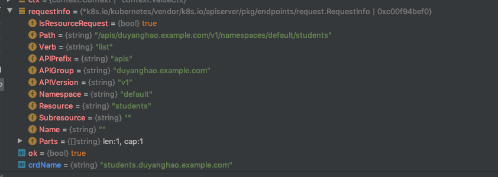
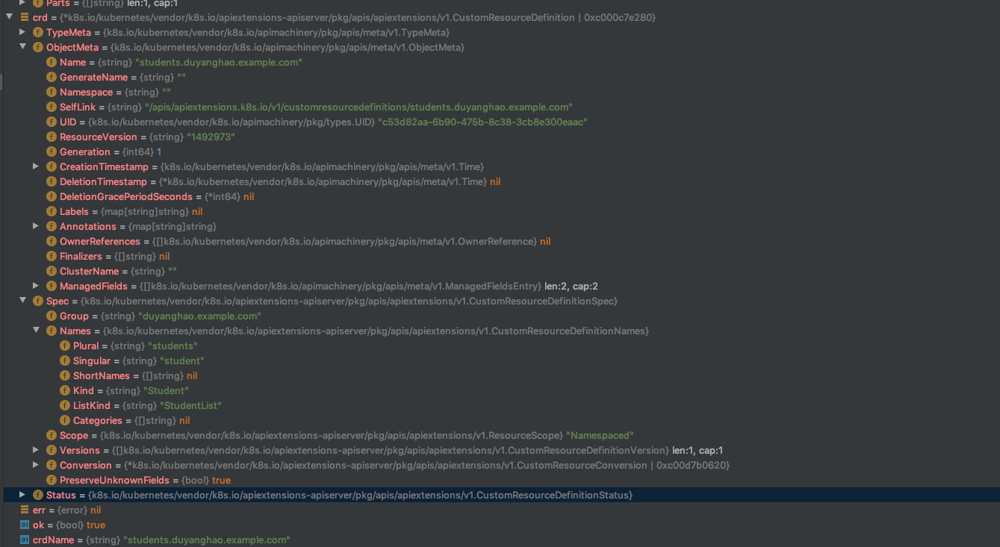
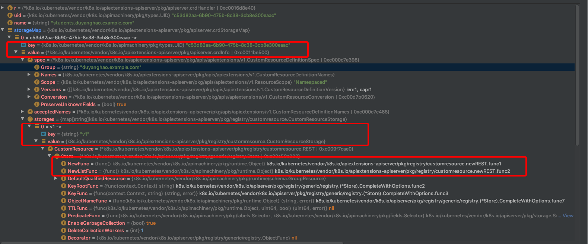
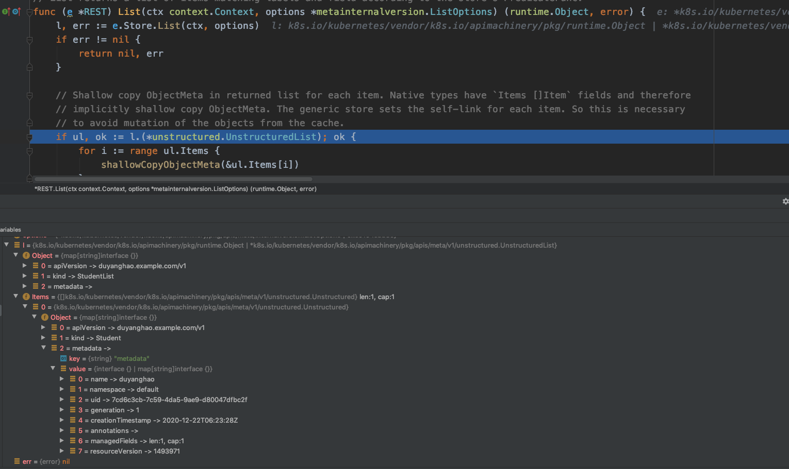
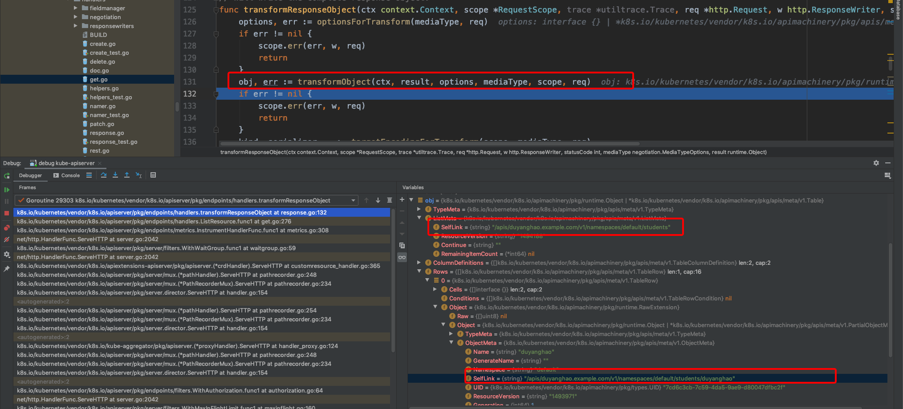
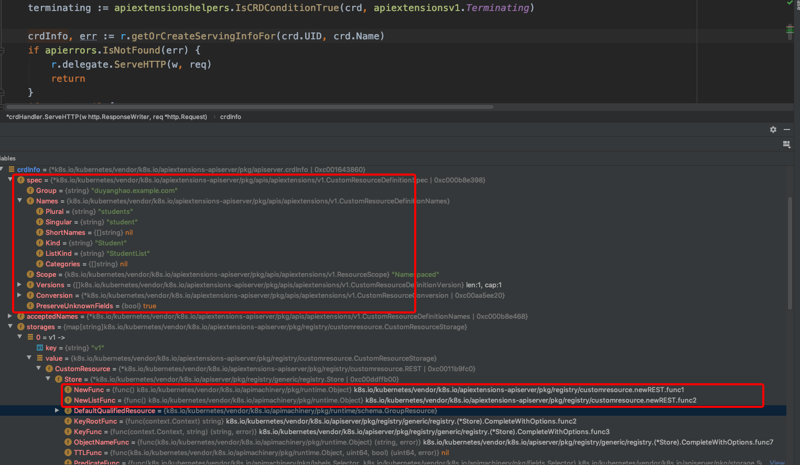

CRD apiserver
=============

本文分析apiserver的最后一部分：CRD apiserver，在此之前先介绍CR，并展开CRD以及CRD apiserver

Table of Contents
=================

* [Custom Resource](#Custom%20Resource)
* [CRD](#CRD)
  * [CRD CRUD API server](#CRD%20CRUD%20API%20server)
  * [crdRegistrationController](#crdRegistrationController)
  * [Custom Resource的CRUD API server](#Custom%20Resource的CRUD%20API%20server)
  * [CRD相关controller功能](#CRD相关controller功能)
* [总结](#总结)

## Custom Resource

> > A resource is an endpoint in the Kubernetes API that stores a collection of API objects of a certain kind. For example, the built-in pods resource contains a collection of Pod objects.

> > A custom resource is an extension of the Kubernetes API that is not necessarily available in a default Kubernetes installation. It represents a customization of a particular Kubernetes installation. However, many core Kubernetes functions are now built using custom resources, making Kubernetes more modular.

> > Custom resources can appear and disappear in a running cluster through dynamic registration, and cluster admins can update custom resources independently of the cluster itself. Once a custom resource is installed, users can create and access its objects using kubectl, just as they do for built-in resources like Pods.

Custom Resource，简称CR，是Kubernetes自定义资源类型，与之相对应的就是Kubernetes内置的各种资源类型，例如Pod、Service等。利用CR我们可以定义任何想要的资源类型，例如这里TKE的`Project`等

而对于如何使用CR，官方也给出了两种方式：

> > Kubernetes provides two ways to add custom resources to your cluster:

> > CRDs are simple and can be created without any programming. API Aggregation requires programming, but allows more control over API behaviors like how data is stored and conversion between API versions. Kubernetes provides these two options to meet the needs of different users, so that neither ease of use nor flexibility is compromised.

> > Aggregated APIs are subordinate APIServers that sit behind the primary API server, which acts as a proxy. This arrangement is called API Aggregation (AA). To users, it simply appears that the Kubernetes API is extended.

> > CRDs allow users to create new types of resources without adding another APIserver. You do not need to understand API Aggregation to use CRDs.

> > Regardless of how they are installed, the new resources are referred to as Custom Resources to distinguish them from built-in Kubernetes resources (like pods).

也即Aggregated APIServer和CRDs，这两种方式各有优缺点，适用场景也不相同，如下：

- CRD更简单，不需要programming，更加轻量级；相比AA则需要专门programming并维护
- Aggregated APIServer更加灵活，可以完成很多CRD不具备的事情，例如：对存储层的CRUD定制化操作

详细比较可以参考[这里](https://github.com/kubernetes-sigs/apiserver-builder-alpha/blob/master/docs/compare_with_kubebuilder.md)

## CRD

CRD是第二种扩展Kubernetes API资源的方式，也是普遍使用的一种。这里我们将从源码角度剖析CRD的内部原理

首先我们会创建一个CRD，例子如下：

```go
apiVersion: apiextensions.k8s.io/v1beta1
kind: CustomResourceDefinition
metadata:
  name: projects.duyanghao.example.com
spec:
  group: duyanghao.example.com
  names:
    kind: Project
    listKind: ProjectList
    plural: projects
  scope: Namespaced
  version: v1
```

这个例子中创建了$GROUP=duyanghao.example.com，$VERSION=v1，资源名为Project的自定义资源

### CRD CRUD API server

通过kubectl apply上述yaml后，即创建了Project资源：

```bash
$ kubectl apply -f project.yaml   
customresourcedefinition.apiextensions.k8s.io/projects.duyanghao.example.com created
```

那么谁负责CRD资源的CRUD API接口呢？带着这个疑问我们分析代码：

```go
// CreateServerChain creates the apiservers connected via delegation.
func CreateServerChain(completedOptions completedServerRunOptions, stopCh <-chan struct{}) (*aggregatorapiserver.APIAggregator, error) {
	...
	kubeAPIServerConfig, insecureServingInfo, serviceResolver, pluginInitializer, err := CreateKubeAPIServerConfig(completedOptions, nodeTunneler, proxyTransport)
	if err != nil {
		return nil, err
	}

	// If additional API servers are added, they should be gated.
	apiExtensionsConfig, err := createAPIExtensionsConfig(*kubeAPIServerConfig.GenericConfig, kubeAPIServerConfig.ExtraConfig.VersionedInformers, pluginInitializer, completedOptions.ServerRunOptions, completedOptions.MasterCount,
		serviceResolver, webhook.NewDefaultAuthenticationInfoResolverWrapper(proxyTransport, kubeAPIServerConfig.GenericConfig.EgressSelector, kubeAPIServerConfig.GenericConfig.LoopbackClientConfig))
	if err != nil {
		return nil, err
	}
	apiExtensionsServer, err := createAPIExtensionsServer(apiExtensionsConfig, genericapiserver.NewEmptyDelegate())
	if err != nil {
		return nil, err
	}

	kubeAPIServer, err := CreateKubeAPIServer(kubeAPIServerConfig, apiExtensionsServer.GenericAPIServer)
	if err != nil {
		return nil, err
	}

	...

	return aggregatorServer, nil
}

func createAPIExtensionsServer(apiextensionsConfig *apiextensionsapiserver.Config, delegateAPIServer genericapiserver.DelegationTarget) (*apiextensionsapiserver.CustomResourceDefinitions, error) {
	return apiextensionsConfig.Complete().New(delegateAPIServer)
}

// k8s.io/kubernetes/staging/src/k8s.io/apiextensions-apiserver/pkg/apis/apiextensions/register.go:24
const GroupName = "apiextensions.k8s.io"

...
// k8s.io/kubernetes/staging/src/k8s.io/apiextensions-apiserver/pkg/apiserver/apiserver.go:129
// New returns a new instance of CustomResourceDefinitions from the given config.
func (c completedConfig) New(delegationTarget genericapiserver.DelegationTarget) (*CustomResourceDefinitions, error) {
	genericServer, err := c.GenericConfig.New("apiextensions-apiserver", delegationTarget)
	if err != nil {
		return nil, err
	}

	s := &CustomResourceDefinitions{
		GenericAPIServer: genericServer,
	}

	apiResourceConfig := c.GenericConfig.MergedResourceConfig
	apiGroupInfo := genericapiserver.NewDefaultAPIGroupInfo(apiextensions.GroupName, Scheme, metav1.ParameterCodec, Codecs)
	if apiResourceConfig.VersionEnabled(v1beta1.SchemeGroupVersion) {
		storage := map[string]rest.Storage{}
		// customresourcedefinitions
		customResourceDefintionStorage := customresourcedefinition.NewREST(Scheme, c.GenericConfig.RESTOptionsGetter)
		storage["customresourcedefinitions"] = customResourceDefintionStorage
		storage["customresourcedefinitions/status"] = customresourcedefinition.NewStatusREST(Scheme, customResourceDefintionStorage)

		apiGroupInfo.VersionedResourcesStorageMap[v1beta1.SchemeGroupVersion.Version] = storage
	}
	if apiResourceConfig.VersionEnabled(v1.SchemeGroupVersion) {
		storage := map[string]rest.Storage{}
		// customresourcedefinitions
		customResourceDefintionStorage := customresourcedefinition.NewREST(Scheme, c.GenericConfig.RESTOptionsGetter)
		storage["customresourcedefinitions"] = customResourceDefintionStorage
		storage["customresourcedefinitions/status"] = customresourcedefinition.NewStatusREST(Scheme, customResourceDefintionStorage)

		apiGroupInfo.VersionedResourcesStorageMap[v1.SchemeGroupVersion.Version] = storage
	}

	if err := s.GenericAPIServer.InstallAPIGroup(&apiGroupInfo); err != nil {
		return nil, err
	}

	crdClient, err := clientset.NewForConfig(s.GenericAPIServer.LoopbackClientConfig)
	if err != nil {
		// it's really bad that this is leaking here, but until we can fix the test (which I'm pretty sure isn't even testing what it wants to test),
		// we need to be able to move forward
		return nil, fmt.Errorf("failed to create clientset: %v", err)
	}
	s.Informers = externalinformers.NewSharedInformerFactory(crdClient, 5*time.Minute)

	delegateHandler := delegationTarget.UnprotectedHandler()
	if delegateHandler == nil {
		delegateHandler = http.NotFoundHandler()
	}

	versionDiscoveryHandler := &versionDiscoveryHandler{
		discovery: map[schema.GroupVersion]*discovery.APIVersionHandler{},
		delegate:  delegateHandler,
	}
	groupDiscoveryHandler := &groupDiscoveryHandler{
		discovery: map[string]*discovery.APIGroupHandler{},
		delegate:  delegateHandler,
	}
	establishingController := establish.NewEstablishingController(s.Informers.Apiextensions().V1().CustomResourceDefinitions(), crdClient.ApiextensionsV1())
	crdHandler, err := NewCustomResourceDefinitionHandler(
		versionDiscoveryHandler,
		groupDiscoveryHandler,
		s.Informers.Apiextensions().V1().CustomResourceDefinitions(),
		delegateHandler,
		c.ExtraConfig.CRDRESTOptionsGetter,
		c.GenericConfig.AdmissionControl,
		establishingController,
		c.ExtraConfig.ServiceResolver,
		c.ExtraConfig.AuthResolverWrapper,
		c.ExtraConfig.MasterCount,
		s.GenericAPIServer.Authorizer,
		c.GenericConfig.RequestTimeout,
		time.Duration(c.GenericConfig.MinRequestTimeout)*time.Second,
		apiGroupInfo.StaticOpenAPISpec,
		c.GenericConfig.MaxRequestBodyBytes,
	)
	if err != nil {
		return nil, err
	}
	s.GenericAPIServer.Handler.NonGoRestfulMux.Handle("/apis", crdHandler)
	s.GenericAPIServer.Handler.NonGoRestfulMux.HandlePrefix("/apis/", crdHandler)

	crdController := NewDiscoveryController(s.Informers.Apiextensions().V1().CustomResourceDefinitions(), versionDiscoveryHandler, groupDiscoveryHandler)
	namingController := status.NewNamingConditionController(s.Informers.Apiextensions().V1().CustomResourceDefinitions(), crdClient.ApiextensionsV1())
	nonStructuralSchemaController := nonstructuralschema.NewConditionController(s.Informers.Apiextensions().V1().CustomResourceDefinitions(), crdClient.ApiextensionsV1())
	apiApprovalController := apiapproval.NewKubernetesAPIApprovalPolicyConformantConditionController(s.Informers.Apiextensions().V1().CustomResourceDefinitions(), crdClient.ApiextensionsV1())
	finalizingController := finalizer.NewCRDFinalizer(
		s.Informers.Apiextensions().V1().CustomResourceDefinitions(),
		crdClient.ApiextensionsV1(),
		crdHandler,
	)
	openapiController := openapicontroller.NewController(s.Informers.Apiextensions().V1().CustomResourceDefinitions())

	s.GenericAPIServer.AddPostStartHookOrDie("start-apiextensions-informers", func(context genericapiserver.PostStartHookContext) error {
		s.Informers.Start(context.StopCh)
		return nil
	})
	s.GenericAPIServer.AddPostStartHookOrDie("start-apiextensions-controllers", func(context genericapiserver.PostStartHookContext) error {
		// OpenAPIVersionedService and StaticOpenAPISpec are populated in generic apiserver PrepareRun().
		// Together they serve the /openapi/v2 endpoint on a generic apiserver. A generic apiserver may
		// choose to not enable OpenAPI by having null openAPIConfig, and thus OpenAPIVersionedService
		// and StaticOpenAPISpec are both null. In that case we don't run the CRD OpenAPI controller.
		if s.GenericAPIServer.OpenAPIVersionedService != nil && s.GenericAPIServer.StaticOpenAPISpec != nil {
			go openapiController.Run(s.GenericAPIServer.StaticOpenAPISpec, s.GenericAPIServer.OpenAPIVersionedService, context.StopCh)
		}

		go crdController.Run(context.StopCh)
		go namingController.Run(context.StopCh)
		go establishingController.Run(context.StopCh)
		go nonStructuralSchemaController.Run(5, context.StopCh)
		go apiApprovalController.Run(5, context.StopCh)
		go finalizingController.Run(5, context.StopCh)
		return nil
	})
	// we don't want to report healthy until we can handle all CRDs that have already been registered.  Waiting for the informer
	// to sync makes sure that the lister will be valid before we begin.  There may still be races for CRDs added after startup,
	// but we won't go healthy until we can handle the ones already present.
	s.GenericAPIServer.AddPostStartHookOrDie("crd-informer-synced", func(context genericapiserver.PostStartHookContext) error {
		return wait.PollImmediateUntil(100*time.Millisecond, func() (bool, error) {
			return s.Informers.Apiextensions().V1().CustomResourceDefinitions().Informer().HasSynced(), nil
		}, context.StopCh)
	})

	return s, nil
}
```

APIExtensionServer 作为 Delegation 链的最后一层，是处理所有用户通过 Custom Resource Definition 定义的资源服务器。核心代码是：

```go
...
	s := &CustomResourceDefinitions{
		GenericAPIServer: genericServer,
	}

	apiResourceConfig := c.GenericConfig.MergedResourceConfig
	apiGroupInfo := genericapiserver.NewDefaultAPIGroupInfo(apiextensions.GroupName, Scheme, metav1.ParameterCodec, Codecs)
	if apiResourceConfig.VersionEnabled(v1beta1.SchemeGroupVersion) {
		storage := map[string]rest.Storage{}
		// customresourcedefinitions
		customResourceDefintionStorage := customresourcedefinition.NewREST(Scheme, c.GenericConfig.RESTOptionsGetter)
		storage["customresourcedefinitions"] = customResourceDefintionStorage
		storage["customresourcedefinitions/status"] = customresourcedefinition.NewStatusREST(Scheme, customResourceDefintionStorage)

		apiGroupInfo.VersionedResourcesStorageMap[v1beta1.SchemeGroupVersion.Version] = storage
	}
	if apiResourceConfig.VersionEnabled(v1.SchemeGroupVersion) {
		storage := map[string]rest.Storage{}
		// customresourcedefinitions
		customResourceDefintionStorage := customresourcedefinition.NewREST(Scheme, c.GenericConfig.RESTOptionsGetter)
		storage["customresourcedefinitions"] = customResourceDefintionStorage
		storage["customresourcedefinitions/status"] = customresourcedefinition.NewStatusREST(Scheme, customResourceDefintionStorage)

		apiGroupInfo.VersionedResourcesStorageMap[v1.SchemeGroupVersion.Version] = storage
	}

	if err := s.GenericAPIServer.InstallAPIGroup(&apiGroupInfo); err != nil {
		return nil, err
	}
...

// k8s.io/kubernetes/staging/src/k8s.io/apiextensions-apiserver/pkg/registry/customresourcedefinition/etcd.go:40
// NewREST returns a RESTStorage object that will work against API services.
func NewREST(scheme *runtime.Scheme, optsGetter generic.RESTOptionsGetter) *REST {
	strategy := NewStrategy(scheme)

	store := &genericregistry.Store{
		NewFunc:                  func() runtime.Object { return &apiextensions.CustomResourceDefinition{} },
		NewListFunc:              func() runtime.Object { return &apiextensions.CustomResourceDefinitionList{} },
		PredicateFunc:            MatchCustomResourceDefinition,
		DefaultQualifiedResource: apiextensions.Resource("customresourcedefinitions"),

		CreateStrategy: strategy,
		UpdateStrategy: strategy,
		DeleteStrategy: strategy,
	}
	options := &generic.StoreOptions{RESTOptions: optsGetter, AttrFunc: GetAttrs}
	if err := store.CompleteWithOptions(options); err != nil {
		panic(err) // TODO: Propagate error up
	}
	return &REST{store}
}

// NewStatusREST makes a RESTStorage for status that has more limited options.
// It is based on the original REST so that we can share the same underlying store
func NewStatusREST(scheme *runtime.Scheme, rest *REST) *StatusREST {
	statusStore := *rest.Store
	statusStore.CreateStrategy = nil
	statusStore.DeleteStrategy = nil
	statusStore.UpdateStrategy = NewStatusStrategy(scheme)
	return &StatusREST{store: &statusStore}
}

type StatusREST struct {
	store *genericregistry.Store
}
```

可以看到APIExtensionServer会处理对CRD的CRUD API操作

### crdRegistrationController

在创建了CRD后，我们会发现相应的APIService资源也会随之产生：

```bash
$ kubectl get crds
NAME                                       CREATED AT
projects.duyanghao.example.com             2020-12-10T09:51:29Z

$ kubectl get APIService
NAME                                   SERVICE                      AVAILABLE   AGE
...
v1.duyanghao.example.com               Local                        True        2m2s

$ kubectl get -o yaml APIService/v1.duyanghao.example.com  
apiVersion: apiregistration.k8s.io/v1
kind: APIService
metadata:
  creationTimestamp: "2020-12-10T09:51:32Z"
  labels:
    kube-aggregator.kubernetes.io/automanaged: "true"
  name: v1.duyanghao.example.com
  resourceVersion: "39790960"
  selfLink: /apis/apiregistration.k8s.io/v1/apiservices/v1.duyanghao.example.com
  uid: 40bca9e9-4c37-49e0-98d1-d279a5c88bac
spec:
  group: duyanghao.example.com
  groupPriorityMinimum: 1000
  version: v1
  versionPriority: 100
status:
  conditions:
  - lastTransitionTime: "2020-12-10T09:51:32Z"
    message: Local APIServices are always available
    reason: Local
    status: "True"
    type: Available
```

`crdRegistrationController`：负责将 CRD GroupVersions 自动注册到 APIServices 中，下面我们进行分析：

```go
func createAggregatorServer(aggregatorConfig *aggregatorapiserver.Config, delegateAPIServer genericapiserver.DelegationTarget, apiExtensionInformers apiextensionsinformers.SharedInformerFactory) (*aggregatorapiserver.APIAggregator, error) {
	...
	autoRegistrationController := autoregister.NewAutoRegisterController(aggregatorServer.APIRegistrationInformers.Apiregistration().V1().APIServices(), apiRegistrationClient)
	apiServices := apiServicesToRegister(delegateAPIServer, autoRegistrationController)
	crdRegistrationController := crdregistration.NewCRDRegistrationController(
		apiExtensionInformers.Apiextensions().V1().CustomResourceDefinitions(),
		autoRegistrationController)

	err = aggregatorServer.GenericAPIServer.AddPostStartHook("kube-apiserver-autoregistration", func(context genericapiserver.PostStartHookContext) error {
		go crdRegistrationController.Run(5, context.StopCh)
		go func() {
			// let the CRD controller process the initial set of CRDs before starting the autoregistration controller.
			// this prevents the autoregistration controller's initial sync from deleting APIServices for CRDs that still exist.
			// we only need to do this if CRDs are enabled on this server.  We can't use discovery because we are the source for discovery.
			if aggregatorConfig.GenericConfig.MergedResourceConfig.AnyVersionForGroupEnabled("apiextensions.k8s.io") {
				crdRegistrationController.WaitForInitialSync()
			}
			autoRegistrationController.Run(5, context.StopCh)
		}()
		return nil
	})
	...
	return aggregatorServer, nil
}

type crdRegistrationController struct {
	crdLister crdlisters.CustomResourceDefinitionLister
	crdSynced cache.InformerSynced

	apiServiceRegistration AutoAPIServiceRegistration

	syncHandler func(groupVersion schema.GroupVersion) error

	syncedInitialSet chan struct{}

	// queue is where incoming work is placed to de-dup and to allow "easy" rate limited requeues on errors
	// this is actually keyed by a groupVersion
	queue workqueue.RateLimitingInterface
}

// k8s.io/kubernetes/pkg/master/controller/crdregistration/crdregistration_controller.go:62
// NewCRDRegistrationController returns a controller which will register CRD GroupVersions with the auto APIService registration
// controller so they automatically stay in sync.
func NewCRDRegistrationController(crdinformer crdinformers.CustomResourceDefinitionInformer, apiServiceRegistration AutoAPIServiceRegistration) *crdRegistrationController {
	c := &crdRegistrationController{
		crdLister:              crdinformer.Lister(),
		crdSynced:              crdinformer.Informer().HasSynced,
		apiServiceRegistration: apiServiceRegistration,
		syncedInitialSet:       make(chan struct{}),
		queue:                  workqueue.NewNamedRateLimitingQueue(workqueue.DefaultControllerRateLimiter(), "crd_autoregistration_controller"),
	}
	c.syncHandler = c.handleVersionUpdate

	crdinformer.Informer().AddEventHandler(cache.ResourceEventHandlerFuncs{
		AddFunc: func(obj interface{}) {
			cast := obj.(*apiextensionsv1.CustomResourceDefinition)
			c.enqueueCRD(cast)
		},
		UpdateFunc: func(oldObj, newObj interface{}) {
			// Enqueue both old and new object to make sure we remove and add appropriate API services.
			// The working queue will resolve any duplicates and only changes will stay in the queue.
			c.enqueueCRD(oldObj.(*apiextensionsv1.CustomResourceDefinition))
			c.enqueueCRD(newObj.(*apiextensionsv1.CustomResourceDefinition))
		},
		DeleteFunc: func(obj interface{}) {
			cast, ok := obj.(*apiextensionsv1.CustomResourceDefinition)
			if !ok {
				tombstone, ok := obj.(cache.DeletedFinalStateUnknown)
				if !ok {
					klog.V(2).Infof("Couldn't get object from tombstone %#v", obj)
					return
				}
				cast, ok = tombstone.Obj.(*apiextensionsv1.CustomResourceDefinition)
				if !ok {
					klog.V(2).Infof("Tombstone contained unexpected object: %#v", obj)
					return
				}
			}
			c.enqueueCRD(cast)
		},
	})

	return c
}
```

下面是crdRegistrationController的核心逻辑：

```go
func (c *crdRegistrationController) Run(threadiness int, stopCh <-chan struct{}) {
	defer utilruntime.HandleCrash()
	// make sure the work queue is shutdown which will trigger workers to end
	defer c.queue.ShutDown()

	klog.Infof("Starting crd-autoregister controller")
	defer klog.Infof("Shutting down crd-autoregister controller")

	// wait for your secondary caches to fill before starting your work
	if !cache.WaitForNamedCacheSync("crd-autoregister", stopCh, c.crdSynced) {
		return
	}

	// process each item in the list once
	if crds, err := c.crdLister.List(labels.Everything()); err != nil {
		utilruntime.HandleError(err)
	} else {
		for _, crd := range crds {
			for _, version := range crd.Spec.Versions {
				if err := c.syncHandler(schema.GroupVersion{Group: crd.Spec.Group, Version: version.Name}); err != nil {
					utilruntime.HandleError(err)
				}
			}
		}
	}
	close(c.syncedInitialSet)

	// start up your worker threads based on threadiness.  Some controllers have multiple kinds of workers
	for i := 0; i < threadiness; i++ {
		// runWorker will loop until "something bad" happens.  The .Until will then rekick the worker
		// after one second
		go wait.Until(c.runWorker, time.Second, stopCh)
	}

	// wait until we're told to stop
	<-stopCh
}

func (c *crdRegistrationController) runWorker() {
	// hot loop until we're told to stop.  processNextWorkItem will automatically wait until there's work
	// available, so we don't worry about secondary waits
	for c.processNextWorkItem() {
	}
}

// processNextWorkItem deals with one key off the queue.  It returns false when it's time to quit.
func (c *crdRegistrationController) processNextWorkItem() bool {
	// pull the next work item from queue.  It should be a key we use to lookup something in a cache
	key, quit := c.queue.Get()
	if quit {
		return false
	}
	// you always have to indicate to the queue that you've completed a piece of work
	defer c.queue.Done(key)

	// do your work on the key.  This method will contains your "do stuff" logic
	err := c.syncHandler(key.(schema.GroupVersion))
	if err == nil {
		// if you had no error, tell the queue to stop tracking history for your key.  This will
		// reset things like failure counts for per-item rate limiting
		c.queue.Forget(key)
		return true
	}

	// there was a failure so be sure to report it.  This method allows for pluggable error handling
	// which can be used for things like cluster-monitoring
	utilruntime.HandleError(fmt.Errorf("%v failed with : %v", key, err))
	// since we failed, we should requeue the item to work on later.  This method will add a backoff
	// to avoid hotlooping on particular items (they're probably still not going to work right away)
	// and overall controller protection (everything I've done is broken, this controller needs to
	// calm down or it can starve other useful work) cases.
	c.queue.AddRateLimited(key)

	return true
}

func (c *crdRegistrationController) enqueueCRD(crd *apiextensionsv1.CustomResourceDefinition) {
	for _, version := range crd.Spec.Versions {
		c.queue.Add(schema.GroupVersion{Group: crd.Spec.Group, Version: version.Name})
	}
}
```

重点看syncHandler，如下：

```go
func (c *crdRegistrationController) handleVersionUpdate(groupVersion schema.GroupVersion) error {
	apiServiceName := groupVersion.Version + "." + groupVersion.Group

	// check all CRDs.  There shouldn't that many, but if we have problems later we can index them
	crds, err := c.crdLister.List(labels.Everything())
	if err != nil {
		return err
	}
	for _, crd := range crds {
		if crd.Spec.Group != groupVersion.Group {
			continue
		}
		for _, version := range crd.Spec.Versions {
			if version.Name != groupVersion.Version || !version.Served {
				continue
			}

			c.apiServiceRegistration.AddAPIServiceToSync(&v1.APIService{
				ObjectMeta: metav1.ObjectMeta{Name: apiServiceName},
				Spec: v1.APIServiceSpec{
					Group:                groupVersion.Group,
					Version:              groupVersion.Version,
					GroupPriorityMinimum: 1000, // CRDs should have relatively low priority
					VersionPriority:      100,  // CRDs will be sorted by kube-like versions like any other APIService with the same VersionPriority
				},
			})
			return nil
		}
	}

	c.apiServiceRegistration.RemoveAPIServiceToSync(apiServiceName)
	return nil
}

// AddAPIServiceToSyncOnStart registers an API service to sync only when the controller starts.
func (c *autoRegisterController) AddAPIServiceToSyncOnStart(in *v1.APIService) {
	c.addAPIServiceToSync(in, manageOnStart)
}

// RemoveAPIServiceToSync deletes a registered APIService.
func (c *autoRegisterController) RemoveAPIServiceToSync(name string) {
	c.apiServicesToSyncLock.Lock()
	defer c.apiServicesToSyncLock.Unlock()

	delete(c.apiServicesToSync, name)
	c.queue.Add(name)
}
```

这里会枚举所有CRDs，然后根据CRD定义的crd.Spec.Group以及crd.Spec.Versions字段构建APIService，并添加到autoRegisterController.apiServicesToSync中，由autoRegisterController进行创建以及维护操作。这也是为什么创建完CRD后，后产生对应的APIService对象

### CRD相关controller功能

APIExtensionServer 作为 Delegation 链的最后一层，是处理所有用户通过 Custom Resource Definition 定义的资源服务器

其中包含的 controller 以及功能如下所示：

- `openapiController`：将 crd 资源的变化同步至提供的 OpenAPI 文档，可通过访问 `/openapi/v2` 进行查看；
- `crdController`：负责将 crd 信息注册到 apiVersions 和 apiResources 中，两者的信息可通过 `$ kubectl api-versions` 和 `$ kubectl api-resources` 查看；
- `namingController`：检查 crd obj 中是否有命名冲突，可在 crd `.status.conditions` 中查看；
- `establishingController`：检查 crd 是否处于正常状态，可在 crd `.status.conditions` 中查看；
- `nonStructuralSchemaController`：检查 crd obj 结构是否正常，可在 crd `.status.conditions` 中查看；
- `apiApprovalController`：检查 crd 是否遵循 Kubernetes API 声明策略，可在 crd `.status.conditions` 中查看；
- `finalizingController`：类似于 finalizes 的功能，与 CRs 的删除有关；

这里我们对核心controller功能做解析：

#### crdController

```go
// New returns a new instance of CustomResourceDefinitions from the given config.
func (c completedConfig) New(delegationTarget genericapiserver.DelegationTarget) (*CustomResourceDefinitions, error) {
	genericServer, err := c.GenericConfig.New("apiextensions-apiserver", delegationTarget)
	if err != nil {
		return nil, err
	}

	s := &CustomResourceDefinitions{
		GenericAPIServer: genericServer,
	}

	apiResourceConfig := c.GenericConfig.MergedResourceConfig
	apiGroupInfo := genericapiserver.NewDefaultAPIGroupInfo(apiextensions.GroupName, Scheme, metav1.ParameterCodec, Codecs)
	if apiResourceConfig.VersionEnabled(v1beta1.SchemeGroupVersion) {
		storage := map[string]rest.Storage{}
		// customresourcedefinitions
		customResourceDefintionStorage := customresourcedefinition.NewREST(Scheme, c.GenericConfig.RESTOptionsGetter)
		storage["customresourcedefinitions"] = customResourceDefintionStorage
		storage["customresourcedefinitions/status"] = customresourcedefinition.NewStatusREST(Scheme, customResourceDefintionStorage)

		apiGroupInfo.VersionedResourcesStorageMap[v1beta1.SchemeGroupVersion.Version] = storage
	}
	if apiResourceConfig.VersionEnabled(v1.SchemeGroupVersion) {
		storage := map[string]rest.Storage{}
		// customresourcedefinitions
		customResourceDefintionStorage := customresourcedefinition.NewREST(Scheme, c.GenericConfig.RESTOptionsGetter)
		storage["customresourcedefinitions"] = customResourceDefintionStorage
		storage["customresourcedefinitions/status"] = customresourcedefinition.NewStatusREST(Scheme, customResourceDefintionStorage)

		apiGroupInfo.VersionedResourcesStorageMap[v1.SchemeGroupVersion.Version] = storage
	}

	if err := s.GenericAPIServer.InstallAPIGroup(&apiGroupInfo); err != nil {
		return nil, err
	}

	crdClient, err := clientset.NewForConfig(s.GenericAPIServer.LoopbackClientConfig)
	if err != nil {
		// it's really bad that this is leaking here, but until we can fix the test (which I'm pretty sure isn't even testing what it wants to test),
		// we need to be able to move forward
		return nil, fmt.Errorf("failed to create clientset: %v", err)
	}
	s.Informers = externalinformers.NewSharedInformerFactory(crdClient, 5*time.Minute)

	delegateHandler := delegationTarget.UnprotectedHandler()
	if delegateHandler == nil {
		delegateHandler = http.NotFoundHandler()
	}

	versionDiscoveryHandler := &versionDiscoveryHandler{
		discovery: map[schema.GroupVersion]*discovery.APIVersionHandler{},
		delegate:  delegateHandler,
	}
	groupDiscoveryHandler := &groupDiscoveryHandler{
		discovery: map[string]*discovery.APIGroupHandler{},
		delegate:  delegateHandler,
	}
	establishingController := establish.NewEstablishingController(s.Informers.Apiextensions().V1().CustomResourceDefinitions(), crdClient.ApiextensionsV1())
	crdHandler, err := NewCustomResourceDefinitionHandler(
		versionDiscoveryHandler,
		groupDiscoveryHandler,
		s.Informers.Apiextensions().V1().CustomResourceDefinitions(),
		delegateHandler,
		c.ExtraConfig.CRDRESTOptionsGetter,
		c.GenericConfig.AdmissionControl,
		establishingController,
		c.ExtraConfig.ServiceResolver,
		c.ExtraConfig.AuthResolverWrapper,
		c.ExtraConfig.MasterCount,
		s.GenericAPIServer.Authorizer,
		c.GenericConfig.RequestTimeout,
		time.Duration(c.GenericConfig.MinRequestTimeout)*time.Second,
		apiGroupInfo.StaticOpenAPISpec,
		c.GenericConfig.MaxRequestBodyBytes,
	)
	if err != nil {
		return nil, err
	}
	s.GenericAPIServer.Handler.NonGoRestfulMux.Handle("/apis", crdHandler)
	s.GenericAPIServer.Handler.NonGoRestfulMux.HandlePrefix("/apis/", crdHandler)

	crdController := NewDiscoveryController(s.Informers.Apiextensions().V1().CustomResourceDefinitions(), versionDiscoveryHandler, groupDiscoveryHandler)
	namingController := status.NewNamingConditionController(s.Informers.Apiextensions().V1().CustomResourceDefinitions(), crdClient.ApiextensionsV1())
	nonStructuralSchemaController := nonstructuralschema.NewConditionController(s.Informers.Apiextensions().V1().CustomResourceDefinitions(), crdClient.ApiextensionsV1())
	apiApprovalController := apiapproval.NewKubernetesAPIApprovalPolicyConformantConditionController(s.Informers.Apiextensions().V1().CustomResourceDefinitions(), crdClient.ApiextensionsV1())
	finalizingController := finalizer.NewCRDFinalizer(
		s.Informers.Apiextensions().V1().CustomResourceDefinitions(),
		crdClient.ApiextensionsV1(),
		crdHandler,
	)
	openapiController := openapicontroller.NewController(s.Informers.Apiextensions().V1().CustomResourceDefinitions())

	s.GenericAPIServer.AddPostStartHookOrDie("start-apiextensions-informers", func(context genericapiserver.PostStartHookContext) error {
		s.Informers.Start(context.StopCh)
		return nil
	})
	s.GenericAPIServer.AddPostStartHookOrDie("start-apiextensions-controllers", func(context genericapiserver.PostStartHookContext) error {
		// OpenAPIVersionedService and StaticOpenAPISpec are populated in generic apiserver PrepareRun().
		// Together they serve the /openapi/v2 endpoint on a generic apiserver. A generic apiserver may
		// choose to not enable OpenAPI by having null openAPIConfig, and thus OpenAPIVersionedService
		// and StaticOpenAPISpec are both null. In that case we don't run the CRD OpenAPI controller.
		if s.GenericAPIServer.OpenAPIVersionedService != nil && s.GenericAPIServer.StaticOpenAPISpec != nil {
			go openapiController.Run(s.GenericAPIServer.StaticOpenAPISpec, s.GenericAPIServer.OpenAPIVersionedService, context.StopCh)
		}

		go crdController.Run(context.StopCh)
		go namingController.Run(context.StopCh)
		go establishingController.Run(context.StopCh)
		go nonStructuralSchemaController.Run(5, context.StopCh)
		go apiApprovalController.Run(5, context.StopCh)
		go finalizingController.Run(5, context.StopCh)
		return nil
	})
	// we don't want to report healthy until we can handle all CRDs that have already been registered.  Waiting for the informer
	// to sync makes sure that the lister will be valid before we begin.  There may still be races for CRDs added after startup,
	// but we won't go healthy until we can handle the ones already present.
	s.GenericAPIServer.AddPostStartHookOrDie("crd-informer-synced", func(context genericapiserver.PostStartHookContext) error {
		return wait.PollImmediateUntil(100*time.Millisecond, func() (bool, error) {
			return s.Informers.Apiextensions().V1().CustomResourceDefinitions().Informer().HasSynced(), nil
		}, context.StopCh)
	})

	return s, nil
}
```

负责将 crd 信息注册到 apiVersions 和 apiResources 中，两者的信息可通过 `$ kubectl api-versions` 和 `$ kubectl api-resources` 查看：

```go
crdController := NewDiscoveryController(s.Informers.Apiextensions().V1().CustomResourceDefinitions(), versionDiscoveryHandler, groupDiscoveryHandler)

func NewDiscoveryController(crdInformer informers.CustomResourceDefinitionInformer, versionHandler *versionDiscoveryHandler, groupHandler *groupDiscoveryHandler) *DiscoveryController {
	c := &DiscoveryController{
		versionHandler: versionHandler,
		groupHandler:   groupHandler,
		crdLister:      crdInformer.Lister(),
		crdsSynced:     crdInformer.Informer().HasSynced,

		queue: workqueue.NewNamedRateLimitingQueue(workqueue.DefaultControllerRateLimiter(), "DiscoveryController"),
	}

	crdInformer.Informer().AddEventHandler(cache.ResourceEventHandlerFuncs{
		AddFunc:    c.addCustomResourceDefinition,
		UpdateFunc: c.updateCustomResourceDefinition,
		DeleteFunc: c.deleteCustomResourceDefinition,
	})

	c.syncFn = c.sync

	return c
}

func (c *DiscoveryController) addCustomResourceDefinition(obj interface{}) {
	castObj := obj.(*apiextensionsv1.CustomResourceDefinition)
	klog.V(4).Infof("Adding customresourcedefinition %s", castObj.Name)
	c.enqueue(castObj)
}

func (c *DiscoveryController) updateCustomResourceDefinition(oldObj, newObj interface{}) {
	castNewObj := newObj.(*apiextensionsv1.CustomResourceDefinition)
	castOldObj := oldObj.(*apiextensionsv1.CustomResourceDefinition)
	klog.V(4).Infof("Updating customresourcedefinition %s", castOldObj.Name)
	// Enqueue both old and new object to make sure we remove and add appropriate Versions.
	// The working queue will resolve any duplicates and only changes will stay in the queue.
	c.enqueue(castNewObj)
	c.enqueue(castOldObj)
}

func (c *DiscoveryController) deleteCustomResourceDefinition(obj interface{}) {
	castObj, ok := obj.(*apiextensionsv1.CustomResourceDefinition)
	if !ok {
		tombstone, ok := obj.(cache.DeletedFinalStateUnknown)
		if !ok {
			klog.Errorf("Couldn't get object from tombstone %#v", obj)
			return
		}
		castObj, ok = tombstone.Obj.(*apiextensionsv1.CustomResourceDefinition)
		if !ok {
			klog.Errorf("Tombstone contained object that is not expected %#v", obj)
			return
		}
	}
	klog.V(4).Infof("Deleting customresourcedefinition %q", castObj.Name)
	c.enqueue(castObj)
}

func (c *DiscoveryController) Run(stopCh <-chan struct{}) {
	defer utilruntime.HandleCrash()
	defer c.queue.ShutDown()
	defer klog.Infof("Shutting down DiscoveryController")

	klog.Infof("Starting DiscoveryController")

	if !cache.WaitForCacheSync(stopCh, c.crdsSynced) {
		utilruntime.HandleError(fmt.Errorf("timed out waiting for caches to sync"))
		return
	}

	// only start one worker thread since its a slow moving API
	go wait.Until(c.runWorker, time.Second, stopCh)

	<-stopCh
}

func (c *DiscoveryController) runWorker() {
	for c.processNextWorkItem() {
	}
}

// processNextWorkItem deals with one key off the queue.  It returns false when it's time to quit.
func (c *DiscoveryController) processNextWorkItem() bool {
	key, quit := c.queue.Get()
	if quit {
		return false
	}
	defer c.queue.Done(key)

	err := c.syncFn(key.(schema.GroupVersion))
	if err == nil {
		c.queue.Forget(key)
		return true
	}

	utilruntime.HandleError(fmt.Errorf("%v failed with: %v", key, err))
	c.queue.AddRateLimited(key)

	return true
}

func (c *DiscoveryController) enqueue(obj *apiextensionsv1.CustomResourceDefinition) {
	for _, v := range obj.Spec.Versions {
		c.queue.Add(schema.GroupVersion{Group: obj.Spec.Group, Version: v.Name})
	}
}
```

这里看核心逻辑：

```go
// k8s.io/kubernetes/staging/src/k8s.io/apiextensions-apiserver/pkg/apiserver/customresource_discovery_controller.go:77
func (c *DiscoveryController) sync(version schema.GroupVersion) error {

	apiVersionsForDiscovery := []metav1.GroupVersionForDiscovery{}
	apiResourcesForDiscovery := []metav1.APIResource{}
	versionsForDiscoveryMap := map[metav1.GroupVersion]bool{}

	// 获取所有CRDs  
	crds, err := c.crdLister.List(labels.Everything())
	if err != nil {
		return err
	}
	foundVersion := false
	foundGroup := false
	// 枚举CRD  
	for _, crd := range crds {
		if !apiextensionshelpers.IsCRDConditionTrue(crd, apiextensionsv1.Established) {
			continue
		}

		if crd.Spec.Group != version.Group {
			continue
		}

		foundThisVersion := false
		var storageVersionHash string
		// 枚举CRD对应Version    
		for _, v := range crd.Spec.Versions {
			if !v.Served {
				continue
			}
			// If there is any Served version, that means the group should show up in discovery
			foundGroup = true

			gv := metav1.GroupVersion{Group: crd.Spec.Group, Version: v.Name}
			if !versionsForDiscoveryMap[gv] {
				versionsForDiscoveryMap[gv] = true
				apiVersionsForDiscovery = append(apiVersionsForDiscovery, metav1.GroupVersionForDiscovery{
					GroupVersion: crd.Spec.Group + "/" + v.Name,
					Version:      v.Name,
				})
			}
			if v.Name == version.Version {
				foundThisVersion = true
			}
			if v.Storage {
				storageVersionHash = discovery.StorageVersionHash(gv.Group, gv.Version, crd.Spec.Names.Kind)
			}
		}

		if !foundThisVersion {
			continue
		}
		foundVersion = true

		// 设置可被允许的操作    
		verbs := metav1.Verbs([]string{"delete", "deletecollection", "get", "list", "patch", "create", "update", "watch"})
		// if we're terminating we don't allow some verbs
		if apiextensionshelpers.IsCRDConditionTrue(crd, apiextensionsv1.Terminating) {
			verbs = metav1.Verbs([]string{"delete", "deletecollection", "get", "list", "watch"})
		}
		// 根据CRD.Status field构建APIResource，并添加到apiResourcesForDiscovery中
		apiResourcesForDiscovery = append(apiResourcesForDiscovery, metav1.APIResource{
			Name:               crd.Status.AcceptedNames.Plural,
			SingularName:       crd.Status.AcceptedNames.Singular,
			Namespaced:         crd.Spec.Scope == apiextensionsv1.NamespaceScoped,
			Kind:               crd.Status.AcceptedNames.Kind,
			Verbs:              verbs,
			ShortNames:         crd.Status.AcceptedNames.ShortNames,
			Categories:         crd.Status.AcceptedNames.Categories,
			StorageVersionHash: storageVersionHash,
		})
		// 获取子资源
		subresources, err := apiextensionshelpers.GetSubresourcesForVersion(crd, version.Version)
		if err != nil {
			return err
		}
		if subresources != nil && subresources.Status != nil {
			apiResourcesForDiscovery = append(apiResourcesForDiscovery, metav1.APIResource{
				Name:       crd.Status.AcceptedNames.Plural + "/status",
				Namespaced: crd.Spec.Scope == apiextensionsv1.NamespaceScoped,
				Kind:       crd.Status.AcceptedNames.Kind,
				Verbs:      metav1.Verbs([]string{"get", "patch", "update"}),
			})
		}

		if subresources != nil && subresources.Scale != nil {
			apiResourcesForDiscovery = append(apiResourcesForDiscovery, metav1.APIResource{
				Group:      autoscaling.GroupName,
				Version:    "v1",
				Kind:       "Scale",
				Name:       crd.Status.AcceptedNames.Plural + "/scale",
				Namespaced: crd.Spec.Scope == apiextensionsv1.NamespaceScoped,
				Verbs:      metav1.Verbs([]string{"get", "patch", "update"}),
			})
		}
	}

	if !foundGroup {
		c.groupHandler.unsetDiscovery(version.Group)
		c.versionHandler.unsetDiscovery(version)
		return nil
	}

	sortGroupDiscoveryByKubeAwareVersion(apiVersionsForDiscovery)

	apiGroup := metav1.APIGroup{
		Name:     version.Group,
		Versions: apiVersionsForDiscovery,
		// the preferred versions for a group is the first item in
		// apiVersionsForDiscovery after it put in the right ordered
		PreferredVersion: apiVersionsForDiscovery[0],
	}
	c.groupHandler.setDiscovery(version.Group, discovery.NewAPIGroupHandler(Codecs, apiGroup))

	if !foundVersion {
		c.versionHandler.unsetDiscovery(version)
		return nil
	}
	c.versionHandler.setDiscovery(version, discovery.NewAPIVersionHandler(Codecs, version, discovery.APIResourceListerFunc(func() []metav1.APIResource {
		return apiResourcesForDiscovery
	})))

	return nil
}
```

这里对CRD构造了apiGroup和APIResource列表，并注册了apiGroup和apiVersion的路由：

```go
// k8s.io/kubernetes/staging/src/k8s.io/apiserver/pkg/endpoints/discovery/group.go:38
func NewAPIGroupHandler(serializer runtime.NegotiatedSerializer, group metav1.APIGroup) *APIGroupHandler {
	if keepUnversioned(group.Name) {
		// Because in release 1.1, /apis/extensions returns response with empty
		// APIVersion, we use stripVersionNegotiatedSerializer to keep the
		// response backwards compatible.
		serializer = stripVersionNegotiatedSerializer{serializer}
	}

	return &APIGroupHandler{
		serializer: serializer,
		group:      group,
	}
}

func (r *groupDiscoveryHandler) setDiscovery(group string, discovery *discovery.APIGroupHandler) {
	r.discoveryLock.Lock()
	defer r.discoveryLock.Unlock()

	r.discovery[group] = discovery
}

const APIGroupPrefix = "/apis"

func (s *APIGroupHandler) WebService() *restful.WebService {
	mediaTypes, _ := negotiation.MediaTypesForSerializer(s.serializer)
	ws := new(restful.WebService)
	ws.Path(APIGroupPrefix + "/" + s.group.Name)
	ws.Doc("get information of a group")
	ws.Route(ws.GET("/").To(s.handle).
		Doc("get information of a group").
		Operation("getAPIGroup").
		Produces(mediaTypes...).
		Consumes(mediaTypes...).
		Writes(metav1.APIGroup{}))
	return ws
}

// handle returns a handler which will return the api.GroupAndVersion of the group.
func (s *APIGroupHandler) handle(req *restful.Request, resp *restful.Response) {
	s.ServeHTTP(resp.ResponseWriter, req.Request)
}

func (s *APIGroupHandler) ServeHTTP(w http.ResponseWriter, req *http.Request) {
	responsewriters.WriteObjectNegotiated(s.serializer, negotiation.DefaultEndpointRestrictions, schema.GroupVersion{}, w, req, http.StatusOK, &s.group)
}
```

1、**上述代码注册了apiGroup的路由，返回某个api group下所有版本信息**，如下：

```go
apiGroup := metav1.APIGroup{
		Name:     version.Group,
		Versions: apiVersionsForDiscovery,
		// the preferred versions for a group is the first item in
		// apiVersionsForDiscovery after it put in the right ordered
		PreferredVersion: apiVersionsForDiscovery[0],
	}
```

返回如下：

```bash
$ curl http://localhost:8080/apis/apiextensions.k8s.io     
{
  "kind": "APIGroup",
  "apiVersion": "v1",
  "name": "apiextensions.k8s.io",
  "versions": [
    {
      "groupVersion": "apiextensions.k8s.io/v1",
      "version": "v1"
    },
    {
      "groupVersion": "apiextensions.k8s.io/v1beta1",
      "version": "v1beta1"
    }
  ],
  "preferredVersion": {
    "groupVersion": "apiextensions.k8s.io/v1",
    "version": "v1"
  }
}
```

2、**而如果要返回所有Kubernetes集群资源的版本信息**，则可以使用kubectl api-versions命令，对应代码如下：

```go
// New creates a new server which logically combines the handling chain with the passed server.
// name is used to differentiate for logging. The handler chain in particular can be difficult as it starts delgating.
// delegationTarget may not be nil.
func (c completedConfig) New(name string, delegationTarget DelegationTarget) (*GenericAPIServer, error) {
	if c.Serializer == nil {
		return nil, fmt.Errorf("Genericapiserver.New() called with config.Serializer == nil")
	}
	if c.LoopbackClientConfig == nil {
		return nil, fmt.Errorf("Genericapiserver.New() called with config.LoopbackClientConfig == nil")
	}
	if c.EquivalentResourceRegistry == nil {
		return nil, fmt.Errorf("Genericapiserver.New() called with config.EquivalentResourceRegistry == nil")
	}

	handlerChainBuilder := func(handler http.Handler) http.Handler {
		return c.BuildHandlerChainFunc(handler, c.Config)
	}
	apiServerHandler := NewAPIServerHandler(name, c.Serializer, handlerChainBuilder, delegationTarget.UnprotectedHandler())

	s := &GenericAPIServer{
		discoveryAddresses:         c.DiscoveryAddresses,
		LoopbackClientConfig:       c.LoopbackClientConfig,
		legacyAPIGroupPrefixes:     c.LegacyAPIGroupPrefixes,
		admissionControl:           c.AdmissionControl,
		Serializer:                 c.Serializer,
		AuditBackend:               c.AuditBackend,
		Authorizer:                 c.Authorization.Authorizer,
		delegationTarget:           delegationTarget,
		EquivalentResourceRegistry: c.EquivalentResourceRegistry,
		HandlerChainWaitGroup:      c.HandlerChainWaitGroup,

		minRequestTimeout:     time.Duration(c.MinRequestTimeout) * time.Second,
		ShutdownTimeout:       c.RequestTimeout,
		ShutdownDelayDuration: c.ShutdownDelayDuration,
		SecureServingInfo:     c.SecureServing,
		ExternalAddress:       c.ExternalAddress,

		Handler: apiServerHandler,

		listedPathProvider: apiServerHandler,

		openAPIConfig: c.OpenAPIConfig,

		postStartHooks:         map[string]postStartHookEntry{},
		preShutdownHooks:       map[string]preShutdownHookEntry{},
		disabledPostStartHooks: c.DisabledPostStartHooks,

		healthzChecks:    c.HealthzChecks,
		livezChecks:      c.LivezChecks,
		readyzChecks:     c.ReadyzChecks,
		readinessStopCh:  make(chan struct{}),
		livezGracePeriod: c.LivezGracePeriod,

		DiscoveryGroupManager: discovery.NewRootAPIsHandler(c.DiscoveryAddresses, c.Serializer),

		maxRequestBodyBytes: c.MaxRequestBodyBytes,
		livezClock:          clock.RealClock{},
	}

	...  
	return s, nil
}

func installAPI(s *GenericAPIServer, c *Config) {
	...
	if c.EnableDiscovery {
		s.Handler.GoRestfulContainer.Add(s.DiscoveryGroupManager.WebService())
	}
}

// k8s.io/kubernetes/staging/src/k8s.io/apiserver/pkg/endpoints/discovery/root.go:59
func NewRootAPIsHandler(addresses Addresses, serializer runtime.NegotiatedSerializer) *rootAPIsHandler {
	// Because in release 1.1, /apis returns response with empty APIVersion, we
	// use stripVersionNegotiatedSerializer to keep the response backwards
	// compatible.
	serializer = stripVersionNegotiatedSerializer{serializer}

	return &rootAPIsHandler{
		addresses:  addresses,
		serializer: serializer,
		apiGroups:  map[string]metav1.APIGroup{},
	}
}

// named groups(/apis)
// k8s.io/kubernetes/staging/src/k8s.io/apiserver/pkg/server/genericapiserver.go:449
// Exposes given api groups in the API.
func (s *GenericAPIServer) InstallAPIGroups(apiGroupInfos ...*APIGroupInfo) error {
	for _, apiGroupInfo := range apiGroupInfos {
		// Do not register empty group or empty version.  Doing so claims /apis/ for the wrong entity to be returned.
		// Catching these here places the error  much closer to its origin
		if len(apiGroupInfo.PrioritizedVersions[0].Group) == 0 {
			return fmt.Errorf("cannot register handler with an empty group for %#v", *apiGroupInfo)
		}
		if len(apiGroupInfo.PrioritizedVersions[0].Version) == 0 {
			return fmt.Errorf("cannot register handler with an empty version for %#v", *apiGroupInfo)
		}
	}

	openAPIModels, err := s.getOpenAPIModels(APIGroupPrefix, apiGroupInfos...)
	if err != nil {
		return fmt.Errorf("unable to get openapi models: %v", err)
	}

	for _, apiGroupInfo := range apiGroupInfos {
		if err := s.installAPIResources(APIGroupPrefix, apiGroupInfo, openAPIModels); err != nil {
			return fmt.Errorf("unable to install api resources: %v", err)
		}

		// setup discovery
		// Install the version handler.
		// Add a handler at /apis/<groupName> to enumerate all versions supported by this group.
		apiVersionsForDiscovery := []metav1.GroupVersionForDiscovery{}
		for _, groupVersion := range apiGroupInfo.PrioritizedVersions {
			// Check the config to make sure that we elide versions that don't have any resources
			if len(apiGroupInfo.VersionedResourcesStorageMap[groupVersion.Version]) == 0 {
				continue
			}
			apiVersionsForDiscovery = append(apiVersionsForDiscovery, metav1.GroupVersionForDiscovery{
				GroupVersion: groupVersion.String(),
				Version:      groupVersion.Version,
			})
		}
		preferredVersionForDiscovery := metav1.GroupVersionForDiscovery{
			GroupVersion: apiGroupInfo.PrioritizedVersions[0].String(),
			Version:      apiGroupInfo.PrioritizedVersions[0].Version,
		}
		apiGroup := metav1.APIGroup{
			Name:             apiGroupInfo.PrioritizedVersions[0].Group,
			Versions:         apiVersionsForDiscovery,
			PreferredVersion: preferredVersionForDiscovery,
		}

		s.DiscoveryGroupManager.AddGroup(apiGroup)
		s.Handler.GoRestfulContainer.Add(discovery.NewAPIGroupHandler(s.Serializer, apiGroup).WebService())
	}
	return nil
}

func (s *rootAPIsHandler) AddGroup(apiGroup metav1.APIGroup) {
	s.lock.Lock()
	defer s.lock.Unlock()

	_, alreadyExists := s.apiGroups[apiGroup.Name]

	s.apiGroups[apiGroup.Name] = apiGroup
	if !alreadyExists {
		s.apiGroupNames = append(s.apiGroupNames, apiGroup.Name)
	}
}

// WebService returns a webservice serving api group discovery.
// Note: during the server runtime apiGroups might change.
func (s *rootAPIsHandler) WebService() *restful.WebService {
	mediaTypes, _ := negotiation.MediaTypesForSerializer(s.serializer)
	ws := new(restful.WebService)
	ws.Path(APIGroupPrefix)
	ws.Doc("get available API versions")
	ws.Route(ws.GET("/").To(s.restfulHandle).
		Doc("get available API versions").
		Operation("getAPIVersions").
		Produces(mediaTypes...).
		Consumes(mediaTypes...).
		Writes(metav1.APIGroupList{}))
	return ws
}

func (s *rootAPIsHandler) restfulHandle(req *restful.Request, resp *restful.Response) {
	s.ServeHTTP(resp.ResponseWriter, req.Request)
}

func (s *rootAPIsHandler) ServeHTTP(resp http.ResponseWriter, req *http.Request) {
	s.lock.RLock()
	defer s.lock.RUnlock()

	orderedGroups := []metav1.APIGroup{}
	for _, groupName := range s.apiGroupNames {
		orderedGroups = append(orderedGroups, s.apiGroups[groupName])
	}

	clientIP := utilnet.GetClientIP(req)
	serverCIDR := s.addresses.ServerAddressByClientCIDRs(clientIP)
	groups := make([]metav1.APIGroup, len(orderedGroups))
	for i := range orderedGroups {
		groups[i] = orderedGroups[i]
		groups[i].ServerAddressByClientCIDRs = serverCIDR
	}

	responsewriters.WriteObjectNegotiated(s.serializer, negotiation.DefaultEndpointRestrictions, schema.GroupVersion{}, resp, req, http.StatusOK, &metav1.APIGroupList{Groups: groups})
}

// core groups(/api)
func (s *GenericAPIServer) InstallLegacyAPIGroup(apiPrefix string, apiGroupInfo *APIGroupInfo) error {
	if !s.legacyAPIGroupPrefixes.Has(apiPrefix) {
		return fmt.Errorf("%q is not in the allowed legacy API prefixes: %v", apiPrefix, s.legacyAPIGroupPrefixes.List())
	}

	openAPIModels, err := s.getOpenAPIModels(apiPrefix, apiGroupInfo)
	if err != nil {
		return fmt.Errorf("unable to get openapi models: %v", err)
	}

	if err := s.installAPIResources(apiPrefix, apiGroupInfo, openAPIModels); err != nil {
		return err
	}

	// Install the version handler.
	// Add a handler at /<apiPrefix> to enumerate the supported api versions.
	s.Handler.GoRestfulContainer.Add(discovery.NewLegacyRootAPIHandler(s.discoveryAddresses, s.Serializer, apiPrefix).WebService())

	return nil
}

func NewLegacyRootAPIHandler(addresses Addresses, serializer runtime.NegotiatedSerializer, apiPrefix string) *legacyRootAPIHandler {
	// Because in release 1.1, /apis returns response with empty APIVersion, we
	// use stripVersionNegotiatedSerializer to keep the response backwards
	// compatible.
	serializer = stripVersionNegotiatedSerializer{serializer}

	return &legacyRootAPIHandler{
		addresses:  addresses,
		apiPrefix:  apiPrefix,
		serializer: serializer,
	}
}

// AddApiWebService adds a service to return the supported api versions at the legacy /api.
func (s *legacyRootAPIHandler) WebService() *restful.WebService {
	mediaTypes, _ := negotiation.MediaTypesForSerializer(s.serializer)
	ws := new(restful.WebService)
	ws.Path(s.apiPrefix)
	ws.Doc("get available API versions")
	ws.Route(ws.GET("/").To(s.handle).
		Doc("get available API versions").
		Operation("getAPIVersions").
		Produces(mediaTypes...).
		Consumes(mediaTypes...).
		Writes(metav1.APIVersions{}))
	return ws
}

func (s *legacyRootAPIHandler) handle(req *restful.Request, resp *restful.Response) {
	clientIP := utilnet.GetClientIP(req.Request)
	apiVersions := &metav1.APIVersions{
		ServerAddressByClientCIDRs: s.addresses.ServerAddressByClientCIDRs(clientIP),
		Versions:                   []string{"v1"},
	}

	responsewriters.WriteObjectNegotiated(s.serializer, negotiation.DefaultEndpointRestrictions, schema.GroupVersion{}, resp.ResponseWriter, req.Request, http.StatusOK, apiVersions)
}
```

注意这里会注册两种api versions路径路由：core group(/api)以及named groups(/apis)，如下：

```go
# kubectl -v=8 api-versions 
I1211 11:44:50.276446   22493 loader.go:375] Config loaded from file:  /root/.kube/config
I1211 11:44:50.277005   22493 round_trippers.go:420] GET https://127.0.0.1:6443/api?timeout=32s
I1211 11:44:50.277026   22493 round_trippers.go:427] Request Headers:
I1211 11:44:50.277045   22493 round_trippers.go:431]     User-Agent: kubectl/v1.18.3 (linux/amd64) kubernetes/2e7996e
I1211 11:44:50.277055   22493 round_trippers.go:431]     Authorization: Bearer <masked>
I1211 11:44:50.277064   22493 round_trippers.go:431]     Accept: application/json, */*
I1211 11:44:50.281865   22493 round_trippers.go:446] Response Status: 200 OK in 4 milliseconds
I1211 11:44:50.281918   22493 round_trippers.go:449] Response Headers:
I1211 11:44:50.281931   22493 round_trippers.go:452]     Cache-Control: no-cache, private
I1211 11:44:50.281950   22493 round_trippers.go:452]     Content-Type: application/json
I1211 11:44:50.281961   22493 round_trippers.go:452]     Content-Length: 135
I1211 11:44:50.281977   22493 round_trippers.go:452]     Date: Fri, 11 Dec 2020 03:44:50 GMT
I1211 11:44:50.290265   22493 request.go:1068] Response Body: {"kind":"APIVersions","versions":["v1"],"serverAddressByClientCIDRs":[{"clientCIDR":"0.0.0.0/0","serverAddress":"x.x.x.x:6443"}]}
I1211 11:44:50.293673   22493 round_trippers.go:420] GET https://127.0.0.1:6443/apis?timeout=32s
I1211 11:44:50.293695   22493 round_trippers.go:427] Request Headers:
I1211 11:44:50.293722   22493 round_trippers.go:431]     Accept: application/json, */*
I1211 11:44:50.293730   22493 round_trippers.go:431]     User-Agent: kubectl/v1.18.3 (linux/amd64) kubernetes/2e7996e
I1211 11:44:50.293750   22493 round_trippers.go:431]     Authorization: Bearer <masked>
I1211 11:44:50.294415   22493 round_trippers.go:446] Response Status: 200 OK in 0 milliseconds
I1211 11:44:50.294436   22493 round_trippers.go:449] Response Headers:
I1211 11:44:50.294443   22493 round_trippers.go:452]     Cache-Control: no-cache, private
I1211 11:44:50.294452   22493 round_trippers.go:452]     Content-Type: application/json
I1211 11:44:50.294459   22493 round_trippers.go:452]     Date: Fri, 11 Dec 2020 03:44:50 GMT
I1211 11:44:50.298360   22493 request.go:1068] Response Body: {"kind":"APIGroupList","apiVersion":"v1","groups":[{"name":"apiregistration.k8s.io","versions":[{"groupVersion":"apiregistration.k8s.io/v1","version":"v1"},{"groupVersion":"apiregistration.k8s.io/v1beta1","version":"v1beta1"}],"preferredVersion":{"groupVersion":"apiregistration.k8s.io/v1","version":"v1"}},{"name":"extensions","versions":[{"groupVersion":"extensions/v1beta1","version":"v1beta1"}],"preferredVersion":{"groupVersion":"extensions/v1beta1","version":"v1beta1"}},{"name":"apps","versions":[{"groupVersion":"apps/v1","version":"v1"}],"preferredVersion":{"groupVersion":"apps/v1","version":"v1"}},{"name":"events.k8s.io","versions":[{"groupVersion":"events.k8s.io/v1beta1","version":"v1beta1"}],"preferredVersion":{"groupVersion":"events.k8s.io/v1beta1","version":"v1beta1"}},{"name":"authentication.k8s.io","versions":[{"groupVersion":"authentication.k8s.io/v1","version":"v1"},{"groupVersion":"authentication.k8s.io/v1beta1","version":"v1beta1"}],"preferredVersion":{"groupVersion":"authentication.k8s.io/v1"," [truncated 4985 chars]
admissionregistration.k8s.io/v1
admissionregistration.k8s.io/v1beta1
apiextensions.k8s.io/v1
apiextensions.k8s.io/v1beta1
apiregistration.k8s.io/v1
apiregistration.k8s.io/v1beta1
apps/v1
auth.tkestack.io/v1
authentication.k8s.io/v1
authentication.k8s.io/v1beta1
...
storage.k8s.io/v1
storage.k8s.io/v1beta1
v1
```

可以看到对于kubectl api-versions命令，这里发出了两个请求，分别是https://127.0.0.1:6443/api以及https://127.0.0.1:6443/apis，并在最后将两个请求的返回结果进行了合并，如下：

```bash
$ kubectl api-versions
admissionregistration.k8s.io/v1
admissionregistration.k8s.io/v1beta1
apiextensions.k8s.io/v1
apiextensions.k8s.io/v1beta1
apiregistration.k8s.io/v1
apiregistration.k8s.io/v1beta1
apps/v1
...
v1
```

注意v1是/api接口的返回(metav1.APIVersions)；其它则是/apis的返回(metav1.APIGroup)

```go
// APIGroup contains the name, the supported versions, and the preferred version
// of a group.
type APIGroup struct {
	TypeMeta `json:",inline"`
	// name is the name of the group.
	Name string `json:"name" protobuf:"bytes,1,opt,name=name"`
	// versions are the versions supported in this group.
	Versions []GroupVersionForDiscovery `json:"versions" protobuf:"bytes,2,rep,name=versions"`
	// preferredVersion is the version preferred by the API server, which
	// probably is the storage version.
	// +optional
	PreferredVersion GroupVersionForDiscovery `json:"preferredVersion,omitempty" protobuf:"bytes,3,opt,name=preferredVersion"`
	// a map of client CIDR to server address that is serving this group.
	// This is to help clients reach servers in the most network-efficient way possible.
	// Clients can use the appropriate server address as per the CIDR that they match.
	// In case of multiple matches, clients should use the longest matching CIDR.
	// The server returns only those CIDRs that it thinks that the client can match.
	// For example: the master will return an internal IP CIDR only, if the client reaches the server using an internal IP.
	// Server looks at X-Forwarded-For header or X-Real-Ip header or request.RemoteAddr (in that order) to get the client IP.
	// +optional
	ServerAddressByClientCIDRs []ServerAddressByClientCIDR `json:"serverAddressByClientCIDRs,omitempty" protobuf:"bytes,4,rep,name=serverAddressByClientCIDRs"`
}

// APIVersions lists the versions that are available, to allow clients to
// discover the API at /api, which is the root path of the legacy v1 API.
//
// +protobuf.options.(gogoproto.goproto_stringer)=false
// +k8s:deepcopy-gen:interfaces=k8s.io/apimachinery/pkg/runtime.Object
type APIVersions struct {
	TypeMeta `json:",inline"`
	// versions are the api versions that are available.
	Versions []string `json:"versions" protobuf:"bytes,1,rep,name=versions"`
	// a map of client CIDR to server address that is serving this group.
	// This is to help clients reach servers in the most network-efficient way possible.
	// Clients can use the appropriate server address as per the CIDR that they match.
	// In case of multiple matches, clients should use the longest matching CIDR.
	// The server returns only those CIDRs that it thinks that the client can match.
	// For example: the master will return an internal IP CIDR only, if the client reaches the server using an internal IP.
	// Server looks at X-Forwarded-For header or X-Real-Ip header or request.RemoteAddr (in that order) to get the client IP.
	ServerAddressByClientCIDRs []ServerAddressByClientCIDR `json:"serverAddressByClientCIDRs" protobuf:"bytes,2,rep,name=serverAddressByClientCIDRs"`
}
```

3、**如果要查询某个版本下的所有资源类型**，则需要看apiVersion的注册代码：

```go
// k8s.io/kubernetes/staging/src/k8s.io/apiserver/pkg/endpoints/discovery/version.go:50
func NewAPIVersionHandler(serializer runtime.NegotiatedSerializer, groupVersion schema.GroupVersion, apiResourceLister APIResourceLister) *APIVersionHandler {
	if keepUnversioned(groupVersion.Group) {
		// Because in release 1.1, /apis/extensions returns response with empty
		// APIVersion, we use stripVersionNegotiatedSerializer to keep the
		// response backwards compatible.
		serializer = stripVersionNegotiatedSerializer{serializer}
	}

	return &APIVersionHandler{
		serializer:        serializer,
		groupVersion:      groupVersion,
		apiResourceLister: apiResourceLister,
	}
}

func (s *APIVersionHandler) AddToWebService(ws *restful.WebService) {
	mediaTypes, _ := negotiation.MediaTypesForSerializer(s.serializer)
	ws.Route(ws.GET("/").To(s.handle).
		Doc("get available resources").
		Operation("getAPIResources").
		Produces(mediaTypes...).
		Consumes(mediaTypes...).
		Writes(metav1.APIResourceList{}))
}

// handle returns a handler which will return the api.VersionAndVersion of the group.
func (s *APIVersionHandler) handle(req *restful.Request, resp *restful.Response) {
	s.ServeHTTP(resp.ResponseWriter, req.Request)
}

func (s *APIVersionHandler) ServeHTTP(w http.ResponseWriter, req *http.Request) {
	responsewriters.WriteObjectNegotiated(s.serializer, negotiation.DefaultEndpointRestrictions, schema.GroupVersion{}, w, req, http.StatusOK,
		&metav1.APIResourceList{GroupVersion: s.groupVersion.String(), APIResources: s.apiResourceLister.ListAPIResources()})
}

func (f APIResourceListerFunc) ListAPIResources() []metav1.APIResource {
	return f()
}

func() []metav1.APIResource {
		return apiResourcesForDiscovery
}

...
// k8s.io/kubernetes/staging/src/k8s.io/apiserver/pkg/endpoints/groupversion.go:94
// InstallREST registers the REST handlers (storage, watch, proxy and redirect) into a restful Container.
// It is expected that the provided path root prefix will serve all operations. Root MUST NOT end
// in a slash.
func (g *APIGroupVersion) InstallREST(container *restful.Container) error {
	prefix := path.Join(g.Root, g.GroupVersion.Group, g.GroupVersion.Version)
	installer := &APIInstaller{
		group:             g,
		prefix:            prefix,
		minRequestTimeout: g.MinRequestTimeout,
	}

	apiResources, ws, registrationErrors := installer.Install()
	versionDiscoveryHandler := discovery.NewAPIVersionHandler(g.Serializer, g.GroupVersion, staticLister{apiResources})
	versionDiscoveryHandler.AddToWebService(ws)
	container.Add(ws)
	return utilerrors.NewAggregate(registrationErrors)
}

// staticLister implements the APIResourceLister interface
type staticLister struct {
	list []metav1.APIResource
}

func (s staticLister) ListAPIResources() []metav1.APIResource {
	return s.list
}
```

获取某个version下的所有apiResources：

```go
$ GET http://127.0.0.1:8080/apis/apps/v1|python -m json.tool
{
    "apiVersion": "v1",
    "groupVersion": "apps/v1",
    "kind": "APIResourceList",
    "resources": [
        {
            "kind": "ControllerRevision",
            "name": "controllerrevisions",
            "namespaced": true,
            "singularName": "",
            "storageVersionHash": "85nkx63pcBU=",
            "verbs": [
                "create",
                "delete",
                "deletecollection",
                "get",
                "list",
                "patch",
                "update",
                "watch"
            ]
        },
        {
            "categories": [
                "all"
            ],
            "kind": "DaemonSet",
            "name": "daemonsets",
            "namespaced": true,
            "shortNames": [
                "ds"
            ],
            "singularName": "",
            "storageVersionHash": "dd7pWHUlMKQ=",
            "verbs": [
                "create",
                "delete",
                "deletecollection",
                "get",
                "list",
                "patch",
                "update",
                "watch"
            ]
        },
        {
            "kind": "DaemonSet",
            "name": "daemonsets/status",
            "namespaced": true,
            "singularName": "",
            "verbs": [
                "get",
                "patch",
                "update"
            ]
        },
        {
            "categories": [
                "all"
            ],
            "kind": "Deployment",
            "name": "deployments",
            "namespaced": true,
            "shortNames": [
                "deploy"
            ],
            "singularName": "",
            "storageVersionHash": "8aSe+NMegvE=",
            "verbs": [
                "create",
                "delete",
                "deletecollection",
                "get",
                "list",
                "patch",
                "update",
                "watch"
            ]
        },
        {
            "group": "autoscaling",
            "kind": "Scale",
            "name": "deployments/scale",
            "namespaced": true,
            "singularName": "",
            "verbs": [
                "get",
                "patch",
                "update"
            ],
            "version": "v1"
        },
        {
            "kind": "Deployment",
            "name": "deployments/status",
            "namespaced": true,
            "singularName": "",
            "verbs": [
                "get",
                "patch",
                "update"
            ]
        },
        {
            "categories": [
                "all"
            ],
            "kind": "ReplicaSet",
            "name": "replicasets",
            "namespaced": true,
            "shortNames": [
                "rs"
            ],
            "singularName": "",
            "storageVersionHash": "P1RzHs8/mWQ=",
            "verbs": [
                "create",
                "delete",
                "deletecollection",
                "get",
                "list",
                "patch",
                "update",
                "watch"
            ]
        },
        {
            "group": "autoscaling",
            "kind": "Scale",
            "name": "replicasets/scale",
            "namespaced": true,
            "singularName": "",
            "verbs": [
                "get",
                "patch",
                "update"
            ],
            "version": "v1"
        },
        {
            "kind": "ReplicaSet",
            "name": "replicasets/status",
            "namespaced": true,
            "singularName": "",
            "verbs": [
                "get",
                "patch",
                "update"
            ]
        },
        {
            "categories": [
                "all"
            ],
            "kind": "StatefulSet",
            "name": "statefulsets",
            "namespaced": true,
            "shortNames": [
                "sts"
            ],
            "singularName": "",
            "storageVersionHash": "H+vl74LkKdo=",
            "verbs": [
                "create",
                "delete",
                "deletecollection",
                "get",
                "list",
                "patch",
                "update",
                "watch"
            ]
        },
        {
            "group": "autoscaling",
            "kind": "Scale",
            "name": "statefulsets/scale",
            "namespaced": true,
            "singularName": "",
            "verbs": [
                "get",
                "patch",
                "update"
            ],
            "version": "v1"
        },
        {
            "kind": "StatefulSet",
            "name": "statefulsets/status",
            "namespaced": true,
            "singularName": "",
            "verbs": [
                "get",
                "patch",
                "update"
            ]
        }
    ]
}

$ GET http://127.0.0.1:8080/apis/apiextensions.k8s.io/v1|python -m json.tool
{
    "apiVersion": "v1",
    "groupVersion": "apiextensions.k8s.io/v1",
    "kind": "APIResourceList",
    "resources": [
        {
            "kind": "CustomResourceDefinition",
            "name": "customresourcedefinitions",
            "namespaced": false,
            "shortNames": [
                "crd",
                "crds"
            ],
            "singularName": "",
            "storageVersionHash": "jfWCUB31mvA=",
            "verbs": [
                "create",
                "delete",
                "deletecollection",
                "get",
                "list",
                "patch",
                "update",
                "watch"
            ]
        },
        {
            "kind": "CustomResourceDefinition",
            "name": "customresourcedefinitions/status",
            "namespaced": false,
            "singularName": "",
            "verbs": [
                "get",
                "patch",
                "update"
            ]
        }
    ]
}

$ GET http://127.0.0.1:8080/apis/duyanghao.example.com/v1|python -m json.tool
{
    "apiVersion": "v1",
    "groupVersion": "duyanghao.example.com/v1",
    "kind": "APIResourceList",
    "resources": [
        {
            "kind": "Project",
            "name": "projects",
            "namespaced": true,
            "singularName": "project",
            "storageVersionHash": "V5qrM7hF17Y=",
            "verbs": [
                "delete",
                "deletecollection",
                "get",
                "list",
                "patch",
                "create",
                "update",
                "watch"
            ]
        }
    ]
}

$ curl http://127.0.0.1:8080/api/v1?timeout=32  
{
  "kind": "APIResourceList",
  "groupVersion": "v1",
  "resources": [
    {
      "name": "bindings",
      "singularName": "",
      "namespaced": true,
      "kind": "Binding",
      "verbs": [
        "create"
      ]
    },
    {
      "name": "componentstatuses",
      "singularName": "",
      "namespaced": false,
      "kind": "ComponentStatus",
      "verbs": [
        "get",
        "list"
      ],
      "shortNames": [
        "cs"
      ]
    },
    {
      "name": "configmaps",
      "singularName": "",
      "namespaced": true,
      "kind": "ConfigMap",
      "verbs": [
        "create",
        "delete",
        "deletecollection",
        "get",
        "list",
        "patch",
        "update",
        "watch"
      ],
      "shortNames": [
        "cm"
      ],
      "storageVersionHash": "qFsyl6wFWjQ="
    },
    {
      "name": "endpoints",
      "singularName": "",
      "namespaced": true,
      "kind": "Endpoints",
      "verbs": [
        "create",
        "delete",
        "deletecollection",
        "get",
        "list",
        "patch",
        "update",
        "watch"
      ],
      "shortNames": [
        "ep"
      ],
      "storageVersionHash": "fWeeMqaN/OA="
    },
    ...
  }
```

4、**kubectl api-resources命令就是先获取所有API版本信息，然后对每一个版本调用上述接口获取该版本下的所有API资源类型**

```bash
5077 loader.go:375] Config loaded from file:  /root/.kube/config
I1211 15:19:47.593450   15077 round_trippers.go:420] GET https://127.0.0.1:6443/api?timeout=32s
I1211 15:19:47.593470   15077 round_trippers.go:427] Request Headers:
I1211 15:19:47.593480   15077 round_trippers.go:431]     Accept: application/json, */*
I1211 15:19:47.593489   15077 round_trippers.go:431]     User-Agent: kubectl/v1.18.3 (linux/amd64) kubernetes/2e7996e
I1211 15:19:47.593522   15077 round_trippers.go:431]     Authorization: Bearer <masked>
I1211 15:19:47.598055   15077 round_trippers.go:446] Response Status: 200 OK in 4 milliseconds
I1211 15:19:47.598077   15077 round_trippers.go:449] Response Headers:
I1211 15:19:47.598088   15077 round_trippers.go:452]     Cache-Control: no-cache, private
I1211 15:19:47.598120   15077 round_trippers.go:452]     Content-Type: application/json
I1211 15:19:47.598131   15077 round_trippers.go:452]     Content-Length: 135
I1211 15:19:47.598147   15077 round_trippers.go:452]     Date: Fri, 11 Dec 2020 07:19:47 GMT
I1211 15:19:47.602273   15077 request.go:1068] Response Body: {"kind":"APIVersions","versions":["v1"],"serverAddressByClientCIDRs":[{"clientCIDR":"0.0.0.0/0","serverAddress":"x.x.x.x:6443"}]}
I1211 15:19:47.606279   15077 round_trippers.go:420] GET https://127.0.0.1:6443/apis?timeout=32s
I1211 15:19:47.606299   15077 round_trippers.go:427] Request Headers:
I1211 15:19:47.606334   15077 round_trippers.go:431]     Accept: application/json, */*
I1211 15:19:47.606343   15077 round_trippers.go:431]     User-Agent: kubectl/v1.18.3 (linux/amd64) kubernetes/2e7996e
I1211 15:19:47.606362   15077 round_trippers.go:431]     Authorization: Bearer <masked>
I1211 15:19:47.607007   15077 round_trippers.go:446] Response Status: 200 OK in 0 milliseconds
I1211 15:19:47.607028   15077 round_trippers.go:449] Response Headers:
I1211 15:19:47.607058   15077 round_trippers.go:452]     Date: Fri, 11 Dec 2020 07:19:47 GMT
I1211 15:19:47.607070   15077 round_trippers.go:452]     Cache-Control: no-cache, private
I1211 15:19:47.607089   15077 round_trippers.go:452]     Content-Type: application/json
I1211 15:19:47.610333   15077 request.go:1068] Response Body: {"kind":"APIGroupList","apiVersion":"v1","groups":[{"name":"apiregistration.k8s.io","versions":[{"groupVersion":"apiregistration.k8s.io/v1","version":"v1"},{"groupVersion":"apiregistration.k8s.io/v1beta1","version":"v1beta1"}],"preferredVersion":{"groupVersion":"apiregistration.k8s.io/v1","version":"v1"}},{"name":"extensions","versions":[{"groupVersion":"extensions/v1beta1","version":"v1beta1"}],"preferredVersion":{"groupVersion":"extensions/v1beta1","version":"v1beta1"}},{"name":"apps","versions":[{"groupVersion":"apps/v1","version":"v1"}],"preferredVersion":{"groupVersion":"apps/v1","version":"v1"}},{"name":"events.k8s.io","versions":[{"groupVersion":"events.k8s.io/v1beta1","version":"v1beta1"}],"preferredVersion":{"groupVersion":"events.k8s.io/v1beta1","version":"v1beta1"}},{"name":"authentication.k8s.io","versions":[{"groupVersion":"authentication.k8s.io/v1","version":"v1"},{"groupVersion":"authentication.k8s.io/v1beta1","version":"v1beta1"}],"preferredVersion":{"groupVersion":"authentication.k8s.io/v1"," [truncated 4985 chars]
I1211 15:19:47.614700   15077 round_trippers.go:420] GET https://127.0.0.1:6443/apis/batch/v1?timeout=32s
I1211 15:19:47.614804   15077 round_trippers.go:420] GET https://127.0.0.1:6443/apis/authentication.k8s.io/v1?timeout=32s
I1211 15:19:47.615687   15077 round_trippers.go:420] GET https://127.0.0.1:6443/apis/auth.tkestack.io/v1?timeout=32s
https://127.0.0.1:6443/apis/authentication.k8s.io/v1beta1?timeout=32s
I1211 15:19:47.616794   15077 round_trippers.go:420] GET https://127.0.0.1:6443/apis/coordination.k8s.io/v1?timeout=32s
I1211 15:19:47.616863   15077 round_trippers.go:420] GET https://127.0.0.1:6443/apis/apps/v1?timeout=32s
I1211 15:19:47.616877   15077 round_trippers.go:420] GET https://127.0.0.1:6443/apis/scheduling.k8s.io/v1beta1?timeout=32s
I1211 15:19:47.617128   15077 round_trippers.go:420] GET https://127.0.0.1:6443/apis/networking.k8s.io/v1beta1?timeout=32s
...
I1211 15:19:47.617555   15077 round_trippers.go:420] GET https://127.0.0.1:6443/apis/monitor.tkestack.io/v1?timeout=32s
I1211 15:19:47.616542   15077 round_trippers.go:420] GET https://127.0.0.1:6443/apis/networking.k8s.io/v1?timeout=32s
I1211 15:19:47.617327   15077 round_trippers.go:420] GET https://127.0.0.1:6443/apis/coordination.k8s.io/v1beta1?timeout=32s
I1211 15:19:47.617412   15077 round_trippers.go:420] GET https://127.0.0.1:6443/apis/monitoring.coreos.com/v1?timeout=32s
I1211 15:19:47.617385   15077 round_trippers.go:420] GET https://127.0.0.1:6443/apis/autoscaling/v2beta2?timeout=32s
I1211 15:19:47.617852   15077 round_trippers.go:420] GET https://127.0.0.1:6443/apis/discovery.k8s.io/v1beta1?timeout=32s
I1211 15:19:47.618032   15077 round_trippers.go:420] GET https://127.0.0.1:6443/apis/admissionregistration.k8s.io/v1?timeout=32s
I1211 15:19:47.618125   15077 round_trippers.go:420] GET https://127.0.0.1:6443/apis/apiregistration.k8s.io/v1?timeout=32s
I1211 15:19:47.618317   15077 round_trippers.go:420] GET https://127.0.0.1:6443/apis/authorization.k8s.io/v1beta1?timeout=32s
I1211 15:19:47.616968   15077 round_trippers.go:420] GET https://127.0.0.1:6443/apis/policy/v1beta1?timeout=32s
I1211 15:19:47.617138   15077 round_trippers.go:420] GET https://127.0.0.1:6443/apis/configuration.konghq.com/v1?timeout=32s
I1211 15:19:47.616526   15077 round_trippers.go:420] GET https://127.0.0.1:6443/apis/metrics.k8s.io/v1beta1?timeout=32s
I1211 15:19:47.616789   15077 round_trippers.go:420] GET https://127.0.0.1:6443/apis/events.k8s.io/v1beta1?timeout=32s
I1211 15:19:47.618075   15077 round_trippers.go:420] GET https://127.0.0.1:6443/apis/storage.k8s.io/v1beta1?timeout=32s
I1211 15:19:47.618612   15077 round_trippers.go:420] GET https://127.0.0.1:6443/api/v1?timeout=32s
I1211 15:19:47.618268   15077 round_trippers.go:420] GET https://127.0.0.1:6443/apis/notify.tkestack.io/v1?timeout=32s
I1211 15:19:47.618631   15077 round_trippers.go:420] GET https://127.0.0.1:6443/apis/apiextensions.k8s.io/v1beta1?timeout=32s
I1211 15:19:47.616594   15077 round_trippers.go:420] GET https://127.0.0.1:6443/apis/node.k8s.io/v1beta1?timeout=32s
I1211 15:19:47.616595   15077 round_trippers.go:420] GET https://127.0.0.1:6443/apis/storage.k8s.io/v1?timeout=32s
I1211 15:19:47.619458   15077 round_trippers.go:420] GET https://127.0.0.1:6443/apis/apiregistration.k8s.io/v1beta1?timeout=32s
I1211 15:19:47.619586   15077 round_trippers.go:420] GET https://127.0.0.1:6443/apis/platform.tkestack.io/v1?timeout=32s
I1211 15:19:47.616973   15077 round_trippers.go:420] GET https://127.0.0.1:6443/apis/authorization.k8s.io/v1?timeout=32s
...
I1211 15:19:47.617240   15077 round_trippers.go:420] GET https://127.0.0.1:6443/apis/duyanghao.example.com/v1?timeout=32s
I1211 15:19:47.617305   15077 round_trippers.go:420] GET https://127.0.0.1:6443/apis/autoscaling/v2beta1?timeout=32s
I1211 15:19:47.617321   15077 round_trippers.go:420] GET https://127.0.0.1:6443/apis/rbac.authorization.k8s.io/v1beta1?timeout=32s
I1211 15:19:47.617428   15077 round_trippers.go:420] GET https://127.0.0.1:6443/apis/admissionregistration.k8s.io/v1beta1?timeout=32s
I1211 15:19:47.617362   15077 round_trippers.go:420] GET https://127.0.0.1:6443/apis/extensions/v1beta1?timeout=32s
I1211 15:19:47.616554   15077 round_trippers.go:420] GET https://127.0.0.1:6443/apis/scheduling.k8s.io/v1?timeout=32s
I1211 15:19:47.618275   15077 round_trippers.go:420] GET https://127.0.0.1:6443/apis/rbac.authorization.k8s.io/v1?timeout=32s
I1211 15:19:47.618349   15077 round_trippers.go:420] GET https://127.0.0.1:6443/apis/batch/v1beta1?timeout=32s
I1211 15:19:47.618724   15077 round_trippers.go:420] GET https://127.0.0.1:6443/apis/apiextensions.k8s.io/v1?timeout=32s
I1211 15:19:47.618903   15077 round_trippers.go:420] GET https://127.0.0.1:6443/apis/certificates.k8s.io/v1beta1?timeout=32s
I1211 15:19:47.616721   15077 round_trippers.go:420] GET https://127.0.0.1:6443/apis/autoscaling/v1?timeout=32s
...
NAME                              SHORTNAMES   APIGROUP                       NAMESPACED   KIND
bindings                                                                      true         Binding
componentstatuses                 cs                                          false        ComponentStatus
configmaps                        cm                                          true         ConfigMap
endpoints                         ep                                          true         Endpoints
events                            ev                                          true         Event
limitranges                       limits                                      true         LimitRange
namespaces                        ns                                          false        Namespace
nodes                             no                                          false        Node
persistentvolumeclaims            pvc                                         true         PersistentVolumeClaim
persistentvolumes                 pv                                          false        PersistentVolume
pods                              po                                          true         Pod
podtemplates                                                                  true         PodTemplate
replicationcontrollers            rc                                          true         ReplicationController
resourcequotas                    quota                                       true         ResourceQuota
secrets                                                                       true         Secret
serviceaccounts                   sa                                          true         ServiceAccount
services                          svc                                         true         Service
customresourcedefinitions         crd,crds     apiextensions.k8s.io           false        CustomResourceDefinition
apiservices                                    apiregistration.k8s.io         false        APIService
controllerrevisions                            apps                           true         ControllerRevision
daemonsets                        ds           apps                           true         DaemonSet
deployments                       deploy       apps                           true         Deployment
replicasets                       rs           apps                           true         ReplicaSet
statefulsets                      sts          apps                           true         StatefulSet
HorizontalPodAutoscaler
cronjobs                          cj           batch                          true         CronJob
jobs                                           batch                          true         Job
leases                                         coordination.k8s.io            true         Lease
endpointslices                                 discovery.k8s.io               true         EndpointSlice
projects                                       duyanghao.example.com          true         Project
...
csinodes                                       storage.k8s.io                 false        CSINode
storageclasses                    sc           storage.k8s.io                 false        StorageClass
volumeattachments                              storage.k8s.io                 false        VolumeAttachment
```

#### establishingController

`establishingController`：检查 crd 是否处于正常状态，可在 crd `.status.conditions` 中查看：

```go
// New returns a new instance of CustomResourceDefinitions from the given config.
func (c completedConfig) New(delegationTarget genericapiserver.DelegationTarget) (*CustomResourceDefinitions, error) {
	genericServer, err := c.GenericConfig.New("apiextensions-apiserver", delegationTarget)
	if err != nil {
		return nil, err
	}

	...

	if err := s.GenericAPIServer.InstallAPIGroup(&apiGroupInfo); err != nil {
		return nil, err
	}

	crdClient, err := clientset.NewForConfig(s.GenericAPIServer.LoopbackClientConfig)
	if err != nil {
		// it's really bad that this is leaking here, but until we can fix the test (which I'm pretty sure isn't even testing what it wants to test),
		// we need to be able to move forward
		return nil, fmt.Errorf("failed to create clientset: %v", err)
	}
	s.Informers = externalinformers.NewSharedInformerFactory(crdClient, 5*time.Minute)

	...
	establishingController := establish.NewEstablishingController(s.Informers.Apiextensions().V1().CustomResourceDefinitions(), crdClient.ApiextensionsV1())
		
	...
	s.GenericAPIServer.AddPostStartHookOrDie("start-apiextensions-controllers", func(context genericapiserver.PostStartHookContext) error {
		// OpenAPIVersionedService and StaticOpenAPISpec are populated in generic apiserver PrepareRun().
		// Together they serve the /openapi/v2 endpoint on a generic apiserver. A generic apiserver may
		// choose to not enable OpenAPI by having null openAPIConfig, and thus OpenAPIVersionedService
		// and StaticOpenAPISpec are both null. In that case we don't run the CRD OpenAPI controller.
		if s.GenericAPIServer.OpenAPIVersionedService != nil && s.GenericAPIServer.StaticOpenAPISpec != nil {
			go openapiController.Run(s.GenericAPIServer.StaticOpenAPISpec, s.GenericAPIServer.OpenAPIVersionedService, context.StopCh)
		}

		go crdController.Run(context.StopCh)
		go namingController.Run(context.StopCh)
		go establishingController.Run(context.StopCh)
		go nonStructuralSchemaController.Run(5, context.StopCh)
		go apiApprovalController.Run(5, context.StopCh)
		go finalizingController.Run(5, context.StopCh)
		return nil
	})  
	...

	return s, nil
}

// sync is used to turn CRDs into the Established state.
func (ec *EstablishingController) sync(key string) error {
	cachedCRD, err := ec.crdLister.Get(key)
	if apierrors.IsNotFound(err) {
		return nil
	}
	if err != nil {
		return err
	}

	if !apiextensionshelpers.IsCRDConditionTrue(cachedCRD, apiextensionsv1.NamesAccepted) ||
		apiextensionshelpers.IsCRDConditionTrue(cachedCRD, apiextensionsv1.Established) {
		return nil
	}

	crd := cachedCRD.DeepCopy()
	establishedCondition := apiextensionsv1.CustomResourceDefinitionCondition{
		Type:    apiextensionsv1.Established,
		Status:  apiextensionsv1.ConditionTrue,
		Reason:  "InitialNamesAccepted",
		Message: "the initial names have been accepted",
	}
	apiextensionshelpers.SetCRDCondition(crd, establishedCondition)

	// Update server with new CRD condition.
	_, err = ec.crdClient.CustomResourceDefinitions().UpdateStatus(context.TODO(), crd, metav1.UpdateOptions{})
	if apierrors.IsNotFound(err) || apierrors.IsConflict(err) {
		// deleted or changed in the meantime, we'll get called again
		return nil
	}
	if err != nil {
		return err
	}

	return nil
}
```

设置CRD status.Conditions，如下：

```yaml
apiVersion: apiextensions.k8s.io/v1
kind: CustomResourceDefinition
metadata:
  name: projects.duyanghao.example.com
  resourceVersion: "39790944"
  selfLink: /apis/apiextensions.k8s.io/v1/customresourcedefinitions/projects.duyanghao.example.com
  uid: c8f9bf2e-00ac-4ddd-8243-b95b810c8d6e
spec:
  conversion:
    strategy: None
  group: duyanghao.example.com
  names:
    kind: Project
    listKind: ProjectList
    plural: projects
    singular: project
  preserveUnknownFields: true
  scope: Namespaced
  versions:
  - name: v1
    served: true
    storage: true
status:
  acceptedNames:
    kind: Project
    listKind: ProjectList
    plural: projects
    singular: project
  conditions:
  - lastTransitionTime: "2020-12-10T09:51:29Z"
    message: no conflicts found
    reason: NoConflicts
    status: "True"
    type: NamesAccepted
  - lastTransitionTime: "2020-12-10T09:51:29Z"
    message: the initial names have been accepted
    reason: InitialNamesAccepted
    status: "True"
    type: Established
  storedVersions:
  - v1
```

### Custom Resource的CRUD API server

在创建完CRD后，也即给kubernetes扩展了一种资源类型，这里为Student，就可以对Student进行CRUD操作了，如下：

```bash
$ cat << EOF > student.yaml
apiVersion: apiextensions.k8s.io/v1beta1
kind: CustomResourceDefinition
metadata:
  name: students.duyanghao.example.com
spec:
  group: duyanghao.example.com
  names:
    kind: Student
    listKind: StudentList
    plural: students
  scope: Namespaced
  version: v1
EOF
$ kubectl apply -f student.yaml
customresourcedefinition.apiextensions.k8s.io/students.duyanghao.example.com created
$ kubectl get student -v=8
I1211 16:46:39.602389   32666 loader.go:375] Config loaded from file:  /root/.kube/config
I1211 16:46:39.609763   32666 round_trippers.go:420] GET https://127.0.0.1:6443/apis/duyanghao.example.com/v1/namespaces/default/students?limit=500
I1211 16:46:39.609791   32666 round_trippers.go:427] Request Headers:
I1211 16:46:39.609802   32666 round_trippers.go:431]     User-Agent: kubectl/v1.18.3 (linux/amd64) kubernetes/2e7996e
I1211 16:46:39.609812   32666 round_trippers.go:431]     Accept: application/json;as=Table;v=v1;g=meta.k8s.io,application/json;as=Table;v=v1beta1;g=meta.k8s.io,application/json
...
No resources found in default namespace.
```

对应CR的CRUD API server在哪里呢？比如这里，哪个apiserver处理Student CR资源的请求呢？



```go
// CreateServerChain creates the apiservers connected via delegation.
func CreateServerChain(completedOptions completedServerRunOptions, stopCh <-chan struct{}) (*aggregatorapiserver.APIAggregator, error) {
	...
	apiExtensionsServer, err := createAPIExtensionsServer(apiExtensionsConfig, genericapiserver.NewEmptyDelegate())
	if err != nil {
		return nil, err
	}
	...
}

// New returns a new instance of CustomResourceDefinitions from the given config.
func (c completedConfig) New(delegationTarget genericapiserver.DelegationTarget) (*CustomResourceDefinitions, error) {
	...
	crdHandler, err := NewCustomResourceDefinitionHandler(
		versionDiscoveryHandler,
		groupDiscoveryHandler,
		s.Informers.Apiextensions().V1().CustomResourceDefinitions(),
		delegateHandler,
		c.ExtraConfig.CRDRESTOptionsGetter,
		c.GenericConfig.AdmissionControl,
		establishingController,
		c.ExtraConfig.ServiceResolver,
		c.ExtraConfig.AuthResolverWrapper,
		c.ExtraConfig.MasterCount,
		s.GenericAPIServer.Authorizer,
		c.GenericConfig.RequestTimeout,
		time.Duration(c.GenericConfig.MinRequestTimeout)*time.Second,
		apiGroupInfo.StaticOpenAPISpec,
		c.GenericConfig.MaxRequestBodyBytes,
	)
	if err != nil {
		return nil, err
	}
	s.GenericAPIServer.Handler.NonGoRestfulMux.Handle("/apis", crdHandler)
	s.GenericAPIServer.Handler.NonGoRestfulMux.HandlePrefix("/apis/", crdHandler)
	...
	return s, nil
}

func NewCustomResourceDefinitionHandler(
	versionDiscoveryHandler *versionDiscoveryHandler,
	groupDiscoveryHandler *groupDiscoveryHandler,
	crdInformer informers.CustomResourceDefinitionInformer,
	delegate http.Handler,
	restOptionsGetter generic.RESTOptionsGetter,
	admission admission.Interface,
	establishingController *establish.EstablishingController,
	serviceResolver webhook.ServiceResolver,
	authResolverWrapper webhook.AuthenticationInfoResolverWrapper,
	masterCount int,
	authorizer authorizer.Authorizer,
	requestTimeout time.Duration,
	minRequestTimeout time.Duration,
	staticOpenAPISpec *spec.Swagger,
	maxRequestBodyBytes int64) (*crdHandler, error) {
	ret := &crdHandler{
		versionDiscoveryHandler: versionDiscoveryHandler,
		groupDiscoveryHandler:   groupDiscoveryHandler,
		customStorage:           atomic.Value{},
		crdLister:               crdInformer.Lister(),
		hasSynced:               crdInformer.Informer().HasSynced,
		delegate:                delegate,
		restOptionsGetter:       restOptionsGetter,
		admission:               admission,
		establishingController:  establishingController,
		masterCount:             masterCount,
		authorizer:              authorizer,
		requestTimeout:          requestTimeout,
		minRequestTimeout:       minRequestTimeout,
		staticOpenAPISpec:       staticOpenAPISpec,
		maxRequestBodyBytes:     maxRequestBodyBytes,
	}
	crdInformer.Informer().AddEventHandler(cache.ResourceEventHandlerFuncs{
		AddFunc:    ret.createCustomResourceDefinition,
		UpdateFunc: ret.updateCustomResourceDefinition,
		DeleteFunc: func(obj interface{}) {
			ret.removeDeadStorage()
		},
	})
	crConverterFactory, err := conversion.NewCRConverterFactory(serviceResolver, authResolverWrapper)
	if err != nil {
		return nil, err
	}
	ret.converterFactory = crConverterFactory

	ret.customStorage.Store(crdStorageMap{})

	return ret, nil
}


```

这里看crdHandler的ServeHTTP处理逻辑：

```go
func (r *crdHandler) ServeHTTP(w http.ResponseWriter, req *http.Request) {
	ctx := req.Context()
	requestInfo, ok := apirequest.RequestInfoFrom(ctx)
	if !ok {
		responsewriters.ErrorNegotiated(
			apierrors.NewInternalError(fmt.Errorf("no RequestInfo found in the context")),
			Codecs, schema.GroupVersion{Group: requestInfo.APIGroup, Version: requestInfo.APIVersion}, w, req,
		)
		return
	}
	if !requestInfo.IsResourceRequest {
		pathParts := splitPath(requestInfo.Path)
		// only match /apis/<group>/<version>
		// only registered under /apis
		if len(pathParts) == 3 {
			if !r.hasSynced() {
				responsewriters.ErrorNegotiated(serverStartingError(), Codecs, schema.GroupVersion{Group: requestInfo.APIGroup, Version: requestInfo.APIVersion}, w, req)
				return
			}
			r.versionDiscoveryHandler.ServeHTTP(w, req)
			return
		}
		// only match /apis/<group>
		if len(pathParts) == 2 {
			if !r.hasSynced() {
				responsewriters.ErrorNegotiated(serverStartingError(), Codecs, schema.GroupVersion{Group: requestInfo.APIGroup, Version: requestInfo.APIVersion}, w, req)
				return
			}
			r.groupDiscoveryHandler.ServeHTTP(w, req)
			return
		}

		r.delegate.ServeHTTP(w, req)
		return
	}

	crdName := requestInfo.Resource + "." + requestInfo.APIGroup
	crd, err := r.crdLister.Get(crdName)
	if apierrors.IsNotFound(err) {
		if !r.hasSynced() {
			responsewriters.ErrorNegotiated(serverStartingError(), Codecs, schema.GroupVersion{Group: requestInfo.APIGroup, Version: requestInfo.APIVersion}, w, req)
			return
		}

		r.delegate.ServeHTTP(w, req)
		return
	}
	if err != nil {
		utilruntime.HandleError(err)
		responsewriters.ErrorNegotiated(
			apierrors.NewInternalError(fmt.Errorf("error resolving resource")),
			Codecs, schema.GroupVersion{Group: requestInfo.APIGroup, Version: requestInfo.APIVersion}, w, req,
		)
		return
	}

	// if the scope in the CRD and the scope in request differ (with exception of the verbs in possiblyAcrossAllNamespacesVerbs
	// for namespaced resources), pass request to the delegate, which is supposed to lead to a 404.
	namespacedCRD, namespacedReq := crd.Spec.Scope == apiextensionsv1.NamespaceScoped, len(requestInfo.Namespace) > 0
	if !namespacedCRD && namespacedReq {
		r.delegate.ServeHTTP(w, req)
		return
	}
	if namespacedCRD && !namespacedReq && !possiblyAcrossAllNamespacesVerbs.Has(requestInfo.Verb) {
		r.delegate.ServeHTTP(w, req)
		return
	}

	if !apiextensionshelpers.HasServedCRDVersion(crd, requestInfo.APIVersion) {
		r.delegate.ServeHTTP(w, req)
		return
	}

	// There is a small chance that a CRD is being served because NamesAccepted condition is true,
	// but it becomes "unserved" because another names update leads to a conflict
	// and EstablishingController wasn't fast enough to put the CRD into the Established condition.
	// We accept this as the problem is small and self-healing.
	if !apiextensionshelpers.IsCRDConditionTrue(crd, apiextensionsv1.NamesAccepted) &&
		!apiextensionshelpers.IsCRDConditionTrue(crd, apiextensionsv1.Established) {
		r.delegate.ServeHTTP(w, req)
		return
	}

	terminating := apiextensionshelpers.IsCRDConditionTrue(crd, apiextensionsv1.Terminating)

	crdInfo, err := r.getOrCreateServingInfoFor(crd.UID, crd.Name)
	if apierrors.IsNotFound(err) {
		r.delegate.ServeHTTP(w, req)
		return
	}
	if err != nil {
		utilruntime.HandleError(err)
		responsewriters.ErrorNegotiated(
			apierrors.NewInternalError(fmt.Errorf("error resolving resource")),
			Codecs, schema.GroupVersion{Group: requestInfo.APIGroup, Version: requestInfo.APIVersion}, w, req,
		)
		return
	}
	if !hasServedCRDVersion(crdInfo.spec, requestInfo.APIVersion) {
		r.delegate.ServeHTTP(w, req)
		return
	}

	verb := strings.ToUpper(requestInfo.Verb)
	resource := requestInfo.Resource
	subresource := requestInfo.Subresource
	scope := metrics.CleanScope(requestInfo)
	supportedTypes := []string{
		string(types.JSONPatchType),
		string(types.MergePatchType),
	}
	if utilfeature.DefaultFeatureGate.Enabled(features.ServerSideApply) {
		supportedTypes = append(supportedTypes, string(types.ApplyPatchType))
	}

	var handlerFunc http.HandlerFunc
	subresources, err := apiextensionshelpers.GetSubresourcesForVersion(crd, requestInfo.APIVersion)
	if err != nil {
		utilruntime.HandleError(err)
		responsewriters.ErrorNegotiated(
			apierrors.NewInternalError(fmt.Errorf("could not properly serve the subresource")),
			Codecs, schema.GroupVersion{Group: requestInfo.APIGroup, Version: requestInfo.APIVersion}, w, req,
		)
		return
	}
	switch {
	case subresource == "status" && subresources != nil && subresources.Status != nil:
		handlerFunc = r.serveStatus(w, req, requestInfo, crdInfo, terminating, supportedTypes)
	case subresource == "scale" && subresources != nil && subresources.Scale != nil:
		handlerFunc = r.serveScale(w, req, requestInfo, crdInfo, terminating, supportedTypes)
	case len(subresource) == 0:
		handlerFunc = r.serveResource(w, req, requestInfo, crdInfo, terminating, supportedTypes)
	default:
		responsewriters.ErrorNegotiated(
			apierrors.NewNotFound(schema.GroupResource{Group: requestInfo.APIGroup, Resource: requestInfo.Resource}, requestInfo.Name),
			Codecs, schema.GroupVersion{Group: requestInfo.APIGroup, Version: requestInfo.APIVersion}, w, req,
		)
	}

	if handlerFunc != nil {
		handlerFunc = metrics.InstrumentHandlerFunc(verb, requestInfo.APIGroup, requestInfo.APIVersion, resource, subresource, scope, metrics.APIServerComponent, handlerFunc)
		handler := genericfilters.WithWaitGroup(handlerFunc, longRunningFilter, crdInfo.waitGroup)
		handler.ServeHTTP(w, req)
		return
	}
}
```

首先会根据Req获取CRD定义：



然后根据crd获取对应的crdInfo，如下：

```go
...	
crdInfo, err := r.getOrCreateServingInfoFor(crd.UID, crd.Name)
...
```



之后会进入到serveResource进行具体的List请求处理：

```go
func (r *crdHandler) serveResource(w http.ResponseWriter, req *http.Request, requestInfo *apirequest.RequestInfo, crdInfo *crdInfo, terminating bool, supportedTypes []string) http.HandlerFunc {
	requestScope := crdInfo.requestScopes[requestInfo.APIVersion]
	storage := crdInfo.storages[requestInfo.APIVersion].CustomResource

	switch requestInfo.Verb {
	case "get":
		return handlers.GetResource(storage, storage, requestScope)
	case "list":
		forceWatch := false
		return handlers.ListResource(storage, storage, requestScope, forceWatch, r.minRequestTimeout)
	case "watch":
		forceWatch := true
		return handlers.ListResource(storage, storage, requestScope, forceWatch, r.minRequestTimeout)
	case "create":
		if terminating {
			err := apierrors.NewMethodNotSupported(schema.GroupResource{Group: requestInfo.APIGroup, Resource: requestInfo.Resource}, requestInfo.Verb)
			err.ErrStatus.Message = fmt.Sprintf("%v not allowed while custom resource definition is terminating", requestInfo.Verb)
			responsewriters.ErrorNegotiated(err, Codecs, schema.GroupVersion{Group: requestInfo.APIGroup, Version: requestInfo.APIVersion}, w, req)
			return nil
		}
		return handlers.CreateResource(storage, requestScope, r.admission)
	case "update":
		return handlers.UpdateResource(storage, requestScope, r.admission)
	case "patch":
		return handlers.PatchResource(storage, requestScope, r.admission, supportedTypes)
	case "delete":
		allowsOptions := true
		return handlers.DeleteResource(storage, allowsOptions, requestScope, r.admission)
	case "deletecollection":
		checkBody := true
		return handlers.DeleteCollection(storage, checkBody, requestScope, r.admission)
	default:
		responsewriters.ErrorNegotiated(
			apierrors.NewMethodNotSupported(schema.GroupResource{Group: requestInfo.APIGroup, Resource: requestInfo.Resource}, requestInfo.Verb),
			Codecs, schema.GroupVersion{Group: requestInfo.APIGroup, Version: requestInfo.APIVersion}, w, req,
		)
		return nil
	}
}
```

这里会进入到List case，并返回handlerFunc，执行如下：

```go
	if handlerFunc != nil {
		handlerFunc = metrics.InstrumentHandlerFunc(verb, requestInfo.APIGroup, requestInfo.APIVersion, resource, subresource, scope, metrics.APIServerComponent, handlerFunc)
		handler := genericfilters.WithWaitGroup(handlerFunc, longRunningFilter, crdInfo.waitGroup)
		handler.ServeHTTP(w, req)
		return
	}
```

最终执行ListResource如下：

```go
// k8s.io/kubernetes/vendor/k8s.io/apiserver/pkg/endpoints/handlers/get.go:166
func ListResource(r rest.Lister, rw rest.Watcher, scope *RequestScope, forceWatch bool, minRequestTimeout time.Duration) http.HandlerFunc {
	return func(w http.ResponseWriter, req *http.Request) {
		// For performance tracking purposes.
		trace := utiltrace.New("List", utiltrace.Field{Key: "url", Value: req.URL.Path}, utiltrace.Field{Key: "user-agent", Value: &lazyTruncatedUserAgent{req}}, utiltrace.Field{Key: "client", Value: &lazyClientIP{req}})

		namespace, err := scope.Namer.Namespace(req)
		if err != nil {
			scope.err(err, w, req)
			return
		}

		// Watches for single objects are routed to this function.
		// Treat a name parameter the same as a field selector entry.
		hasName := true
		_, name, err := scope.Namer.Name(req)
		if err != nil {
			hasName = false
		}

		ctx := req.Context()
		ctx = request.WithNamespace(ctx, namespace)

		outputMediaType, _, err := negotiation.NegotiateOutputMediaType(req, scope.Serializer, scope)
		if err != nil {
			scope.err(err, w, req)
			return
		}

		opts := metainternalversion.ListOptions{}
		if err := metainternalversionscheme.ParameterCodec.DecodeParameters(req.URL.Query(), scope.MetaGroupVersion, &opts); err != nil {
			err = errors.NewBadRequest(err.Error())
			scope.err(err, w, req)
			return
		}

		// transform fields
		// TODO: DecodeParametersInto should do this.
		if opts.FieldSelector != nil {
			fn := func(label, value string) (newLabel, newValue string, err error) {
				return scope.Convertor.ConvertFieldLabel(scope.Kind, label, value)
			}
			if opts.FieldSelector, err = opts.FieldSelector.Transform(fn); err != nil {
				// TODO: allow bad request to set field causes based on query parameters
				err = errors.NewBadRequest(err.Error())
				scope.err(err, w, req)
				return
			}
		}

		if hasName {
			// metadata.name is the canonical internal name.
			// SelectionPredicate will notice that this is a request for
			// a single object and optimize the storage query accordingly.
			nameSelector := fields.OneTermEqualSelector("metadata.name", name)

			// Note that fieldSelector setting explicitly the "metadata.name"
			// will result in reaching this branch (as the value of that field
			// is propagated to requestInfo as the name parameter.
			// That said, the allowed field selectors in this branch are:
			// nil, fields.Everything and field selector matching metadata.name
			// for our name.
			if opts.FieldSelector != nil && !opts.FieldSelector.Empty() {
				selectedName, ok := opts.FieldSelector.RequiresExactMatch("metadata.name")
				if !ok || name != selectedName {
					scope.err(errors.NewBadRequest("fieldSelector metadata.name doesn't match requested name"), w, req)
					return
				}
			} else {
				opts.FieldSelector = nameSelector
			}
		}

		if opts.Watch || forceWatch {
			if rw == nil {
				scope.err(errors.NewMethodNotSupported(scope.Resource.GroupResource(), "watch"), w, req)
				return
			}
			// TODO: Currently we explicitly ignore ?timeout= and use only ?timeoutSeconds=.
			timeout := time.Duration(0)
			if opts.TimeoutSeconds != nil {
				timeout = time.Duration(*opts.TimeoutSeconds) * time.Second
			}
			if timeout == 0 && minRequestTimeout > 0 {
				timeout = time.Duration(float64(minRequestTimeout) * (rand.Float64() + 1.0))
			}
			klog.V(3).Infof("Starting watch for %s, rv=%s labels=%s fields=%s timeout=%s", req.URL.Path, opts.ResourceVersion, opts.LabelSelector, opts.FieldSelector, timeout)
			ctx, cancel := context.WithTimeout(ctx, timeout)
			defer cancel()
			watcher, err := rw.Watch(ctx, &opts)
			if err != nil {
				scope.err(err, w, req)
				return
			}
			requestInfo, _ := request.RequestInfoFrom(ctx)
			metrics.RecordLongRunning(req, requestInfo, metrics.APIServerComponent, func() {
				serveWatch(watcher, scope, outputMediaType, req, w, timeout)
			})
			return
		}

		// Log only long List requests (ignore Watch).
		defer trace.LogIfLong(500 * time.Millisecond)
		trace.Step("About to List from storage")
		result, err := r.List(ctx, &opts)
		if err != nil {
			scope.err(err, w, req)
			return
		}
		trace.Step("Listing from storage done")

		transformResponseObject(ctx, scope, trace, req, w, http.StatusOK, outputMediaType, result)
		trace.Step("Writing http response done", utiltrace.Field{"count", meta.LenList(result)})
	}
}
```

该函数会调用List，如下：

```go
// k8s.io/kubernetes/staging/src/k8s.io/apiextensions-apiserver/pkg/registry/customresource/etcd.go:114
// List returns a list of items matching labels and field according to the store's PredicateFunc.
func (e *REST) List(ctx context.Context, options *metainternalversion.ListOptions) (runtime.Object, error) {
   l, err := e.Store.List(ctx, options)
   if err != nil {
      return nil, err
   }

   // Shallow copy ObjectMeta in returned list for each item. Native types have `Items []Item` fields and therefore
   // implicitly shallow copy ObjectMeta. The generic store sets the self-link for each item. So this is necessary
   // to avoid mutation of the objects from the cache.
   if ul, ok := l.(*unstructured.UnstructuredList); ok {
      for i := range ul.Items {
         shallowCopyObjectMeta(&ul.Items[i])
      }
   }

   return l, nil
}

// k8s.io/kubernetes/staging/src/k8s.io/apiserver/pkg/registry/generic/registry/store.go:291
// List returns a list of items matching labels and field according to the
// store's PredicateFunc.
func (e *Store) List(ctx context.Context, options *metainternalversion.ListOptions) (runtime.Object, error) {
	label := labels.Everything()
	if options != nil && options.LabelSelector != nil {
		label = options.LabelSelector
	}
	field := fields.Everything()
	if options != nil && options.FieldSelector != nil {
		field = options.FieldSelector
	}
	out, err := e.ListPredicate(ctx, e.PredicateFunc(label, field), options)
	if err != nil {
		return nil, err
	}
	if e.Decorator != nil {
		if err := e.Decorator(out); err != nil {
			return nil, err
		}
	}
	return out, nil
}
```



之后会执行transformResponseObject，如下：

```go
// transformResponseObject takes an object loaded from storage and performs any necessary transformations.
// Will write the complete response object.
func transformResponseObject(ctx context.Context, scope *RequestScope, trace *utiltrace.Trace, req *http.Request, w http.ResponseWriter, statusCode int, mediaType negotiation.MediaTypeOptions, result runtime.Object) {
	options, err := optionsForTransform(mediaType, req)
	if err != nil {
		scope.err(err, w, req)
		return
	}
	obj, err := transformObject(ctx, result, options, mediaType, scope, req)
	if err != nil {
		scope.err(err, w, req)
		return
	}
	kind, serializer, _ := targetEncodingForTransform(scope, mediaType, req)
	responsewriters.WriteObjectNegotiated(serializer, scope, kind.GroupVersion(), w, req, statusCode, obj)
}
```



这里我们再重点分析一下`crdInfo, err := r.getOrCreateServingInfoFor(crd.UID, crd.Name)`：

```go
// crdInfo stores enough information to serve the storage for the custom resource
type crdInfo struct {
	// spec and acceptedNames are used to compare against if a change is made on a CRD. We only update
	// the storage if one of these changes.
	spec          *apiextensionsv1.CustomResourceDefinitionSpec
	acceptedNames *apiextensionsv1.CustomResourceDefinitionNames

	// Storage per version
	storages map[string]customresource.CustomResourceStorage

	// Request scope per version
	requestScopes map[string]*handlers.RequestScope

	// Scale scope per version
	scaleRequestScopes map[string]*handlers.RequestScope

	// Status scope per version
	statusRequestScopes map[string]*handlers.RequestScope

	// storageVersion is the CRD version used when storing the object in etcd.
	storageVersion string

	waitGroup *utilwaitgroup.SafeWaitGroup
}

crdInfo, err := r.getOrCreateServingInfoFor(crd.UID, crd.Name)

// CustomResourceStorage includes dummy storage for CustomResources, and their Status and Scale subresources.
type CustomResourceStorage struct {
	CustomResource *REST
	Status         *StatusREST
	Scale          *ScaleREST
}
```

其中spec是CRD定义内容，storages存放该CRD对应CR的后端存储处理函数，如下：



这里也即对student CR进行处理的后端为customresource.REST：

```go
// getOrCreateServingInfoFor gets the CRD serving info for the given CRD UID if the key exists in the storage map.
// Otherwise the function fetches the up-to-date CRD using the given CRD name and creates CRD serving info.
func (r *crdHandler) getOrCreateServingInfoFor(uid types.UID, name string) (*crdInfo, error) {
	storageMap := r.customStorage.Load().(crdStorageMap)
	if ret, ok := storageMap[uid]; ok {
		return ret, nil
	}

	r.customStorageLock.Lock()
	defer r.customStorageLock.Unlock()

	// Get the up-to-date CRD when we have the lock, to avoid racing with updateCustomResourceDefinition.
	// If updateCustomResourceDefinition sees an update and happens later, the storage will be deleted and
	// we will re-create the updated storage on demand. If updateCustomResourceDefinition happens before,
	// we make sure that we observe the same up-to-date CRD.
	crd, err := r.crdLister.Get(name)
	if err != nil {
		return nil, err
	}
	storageMap = r.customStorage.Load().(crdStorageMap)
	if ret, ok := storageMap[crd.UID]; ok {
		return ret, nil
	}

	storageVersion, err := apiextensionshelpers.GetCRDStorageVersion(crd)
	if err != nil {
		return nil, err
	}

	// Scope/Storages per version.
	requestScopes := map[string]*handlers.RequestScope{}
	storages := map[string]customresource.CustomResourceStorage{}
	...
	for _, v := range crd.Spec.Versions {
		...
		storages[v.Name] = customresource.NewStorage(
			resource.GroupResource(),
			kind,
			schema.GroupVersionKind{Group: crd.Spec.Group, Version: v.Name, Kind: crd.Status.AcceptedNames.ListKind},
			customresource.NewStrategy(
				typer,
				crd.Spec.Scope == apiextensionsv1.NamespaceScoped,
				kind,
				validator,
				statusValidator,
				structuralSchemas,
				statusSpec,
				scaleSpec,
			),
			crdConversionRESTOptionsGetter{
				RESTOptionsGetter:     r.restOptionsGetter,
				converter:             safeConverter,
				decoderVersion:        schema.GroupVersion{Group: crd.Spec.Group, Version: v.Name},
				encoderVersion:        schema.GroupVersion{Group: crd.Spec.Group, Version: storageVersion},
				structuralSchemas:     structuralSchemas,
				structuralSchemaGK:    kind.GroupKind(),
				preserveUnknownFields: crd.Spec.PreserveUnknownFields,
			},
			crd.Status.AcceptedNames.Categories,
			table,
		)
	...
  }    

	ret := &crdInfo{
		spec:                &crd.Spec,
		acceptedNames:       &crd.Status.AcceptedNames,
		storages:            storages,
		requestScopes:       requestScopes,
		scaleRequestScopes:  scaleScopes,
		statusRequestScopes: statusScopes,
		storageVersion:      storageVersion,
		waitGroup:           &utilwaitgroup.SafeWaitGroup{},
	}
	...

	// Copy because we cannot write to storageMap without a race
	// as it is used without locking elsewhere.
	storageMap2 := storageMap.clone()

	storageMap2[crd.UID] = ret
	r.customStorage.Store(storageMap2)
  
	return ret, nil
}
```

这里会先获取crd，然后遍历crd.Spec.Version为该CR的每个版本设置storages，而具体kind如下：

Group：duyanghao.example.com

Version：v1

Kind：Student

具体resource如下：

Group：duyanghao.example.com

Version：v1

Resource：students

回到newREST，创建CR存储的地方，如下：

```go
// k8s.io/kubernetes/vendor/k8s.io/apiextensions-apiserver/pkg/registry/customresource/etcd.go:77
// newREST returns a RESTStorage object that will work against API services.
func newREST(resource schema.GroupResource, kind, listKind schema.GroupVersionKind, strategy customResourceStrategy, optsGetter generic.RESTOptionsGetter, categories []string, tableConvertor rest.TableConvertor) (*REST, *StatusREST) {
	store := &genericregistry.Store{
		NewFunc: func() runtime.Object {
			// set the expected group/version/kind in the new object as a signal to the versioning decoder
			ret := &unstructured.Unstructured{}
			ret.SetGroupVersionKind(kind)
			return ret
		},
		NewListFunc: func() runtime.Object {
			// lists are never stored, only manufactured, so stomp in the right kind
			ret := &unstructured.UnstructuredList{}
			ret.SetGroupVersionKind(listKind)
			return ret
		},
		PredicateFunc:            strategy.MatchCustomResourceDefinitionStorage,
		DefaultQualifiedResource: resource,

		CreateStrategy: strategy,
		UpdateStrategy: strategy,
		DeleteStrategy: strategy,

		TableConvertor: tableConvertor,
	}
	options := &generic.StoreOptions{RESTOptions: optsGetter, AttrFunc: strategy.GetAttrs}
	if err := store.CompleteWithOptions(options); err != nil {
		panic(err) // TODO: Propagate error up
	}

	statusStore := *store
	statusStore.UpdateStrategy = NewStatusStrategy(strategy)
	return &REST{store, categories}, &StatusREST{store: &statusStore}
}
```

重点看NewFunc以及NewListFunc函数，如下：

```go
// Unstructured allows objects that do not have Golang structs registered to be manipulated
// generically. This can be used to deal with the API objects from a plug-in. Unstructured
// objects still have functioning TypeMeta features-- kind, version, etc.
//
// WARNING: This object has accessors for the v1 standard metadata. You *MUST NOT* use this
// type if you are dealing with objects that are not in the server meta v1 schema.
//
// TODO: make the serialization part of this type distinct from the field accessors.
// +k8s:deepcopy-gen:interfaces=k8s.io/apimachinery/pkg/runtime.Object
// +k8s:deepcopy-gen=true
type Unstructured struct {
	// Object is a JSON compatible map with string, float, int, bool, []interface{}, or
	// map[string]interface{}
	// children.
	Object map[string]interface{}
}
```

对与NewFunc函数来说，该函数功能是返回CR实例，由于CR在Kubernetes代码中并没有具体结构体定义，所以这里会先初始化一个范型结构体Unstructured，并对该结构题进行SetGroupVersionKind操作，如下：

```go
func (u *Unstructured) SetGroupVersionKind(gvk schema.GroupVersionKind) {
	u.SetAPIVersion(gvk.GroupVersion().String())
	u.SetKind(gvk.Kind)
}

func (gvk GroupVersionKind) GroupVersion() GroupVersion {
	return GroupVersion{Group: gvk.Group, Version: gvk.Version}
}

// String puts "group" and "version" into a single "group/version" string. For the legacy v1
// it returns "v1".
func (gv GroupVersion) String() string {
	// special case the internal apiVersion for the legacy kube types
	if gv.Empty() {
		return ""
	}

	// special case of "v1" for backward compatibility
	if len(gv.Group) == 0 && gv.Version == "v1" {
		return gv.Version
	}
	if len(gv.Group) > 0 {
		return gv.Group + "/" + gv.Version
	}
	return gv.Version
}

func (u *Unstructured) SetAPIVersion(version string) {
	u.setNestedField(version, "apiVersion")
}

func (u *Unstructured) SetKind(kind string) {
	u.setNestedField(kind, "kind")
}

func (u *Unstructured) setNestedField(value interface{}, fields ...string) {
	if u.Object == nil {
		u.Object = make(map[string]interface{})
	}
	SetNestedField(u.Object, value, fields...)
}

// SetNestedField sets the value of a nested field to a deep copy of the value provided.
// Returns an error if value cannot be set because one of the nesting levels is not a map[string]interface{}.
func SetNestedField(obj map[string]interface{}, value interface{}, fields ...string) error {
	return setNestedFieldNoCopy(obj, runtime.DeepCopyJSONValue(value), fields...)
}

func setNestedFieldNoCopy(obj map[string]interface{}, value interface{}, fields ...string) error {
	m := obj

	for i, field := range fields[:len(fields)-1] {
		if val, ok := m[field]; ok {
			if valMap, ok := val.(map[string]interface{}); ok {
				m = valMap
			} else {
				return fmt.Errorf("value cannot be set because %v is not a map[string]interface{}", jsonPath(fields[:i+1]))
			}
		} else {
			newVal := make(map[string]interface{})
			m[field] = newVal
			m = newVal
		}
	}
	m[fields[len(fields)-1]] = value
	return nil
}
```

总结CR CRUD APIServer处理逻辑如下：

* createAPIExtensionsServer=>NewCustomResourceDefinitionHandler=>crdHandler=>注册CR CRUD API接口：

  ```go
  // New returns a new instance of CustomResourceDefinitions from the given config.
  func (c completedConfig) New(delegationTarget genericapiserver.DelegationTarget) (*CustomResourceDefinitions, error) {
  	...
  	crdHandler, err := NewCustomResourceDefinitionHandler(
  		versionDiscoveryHandler,
  		groupDiscoveryHandler,
  		s.Informers.Apiextensions().V1().CustomResourceDefinitions(),
  		delegateHandler,
  		c.ExtraConfig.CRDRESTOptionsGetter,
  		c.GenericConfig.AdmissionControl,
  		establishingController,
  		c.ExtraConfig.ServiceResolver,
  		c.ExtraConfig.AuthResolverWrapper,
  		c.ExtraConfig.MasterCount,
  		s.GenericAPIServer.Authorizer,
  		c.GenericConfig.RequestTimeout,
  		time.Duration(c.GenericConfig.MinRequestTimeout)*time.Second,
  		apiGroupInfo.StaticOpenAPISpec,
  		c.GenericConfig.MaxRequestBodyBytes,
  	)
  	if err != nil {
  		return nil, err
  	}
  	s.GenericAPIServer.Handler.NonGoRestfulMux.Handle("/apis", crdHandler)
  	s.GenericAPIServer.Handler.NonGoRestfulMux.HandlePrefix("/apis/", crdHandler)
  	...
  	return s, nil
  }
  ```

* crdHandler处理逻辑如下：
  * 解析req(GET /apis/duyanghao.example.com/v1/namespaces/default/students)，根据请求路径中的group(duyanghao.example.com)，version(v1)，以及resource字段(students)获取对应CRD内容(crd, err := r.crdLister.Get(crdName))
  * 通过crd.UID以及crd.Name获取crdInfo，若不存在则创建对应的crdInfo(crdInfo, err := r.getOrCreateServingInfoFor(crd.UID, crd.Name))。crdInfo中包含了CRD定义以及该CRD对应Custom Resource的customresource.REST storage
  * customresource.REST storage由CR对应的Group(duyanghao.example.com)，Version(v1)，Kind(Student)，Resource(students)等创建完成，由于CR在Kubernetes代码中并没有具体结构体定义，所以这里会先初始化一个范型结构体Unstructured(用户保存所有类型的Custom Resource)，并对该结构题进行SetGroupVersionKind操作(设置具体Custom Resource Type)
  * 从customresource.REST storage获取Unstructured后会对该结构体进行转换然后返回 

## 总结

