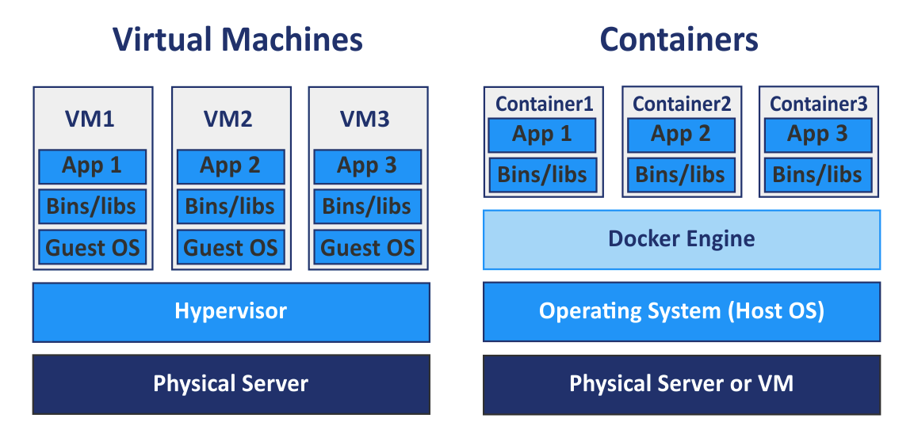
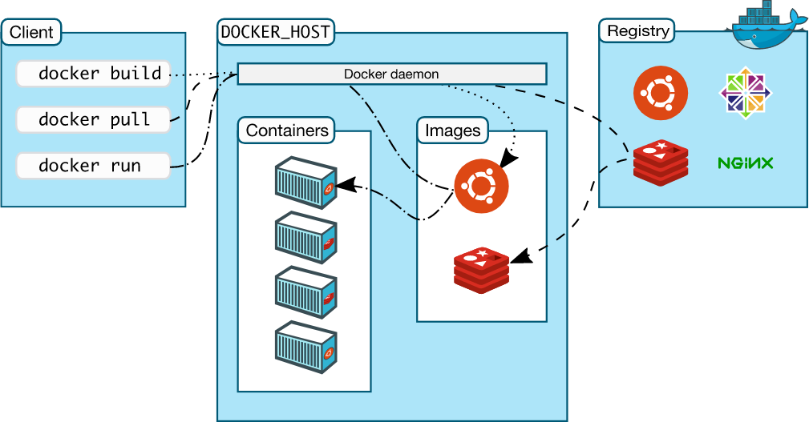
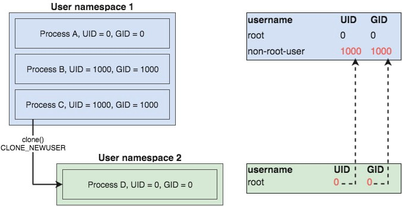
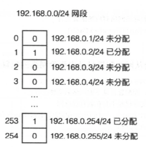
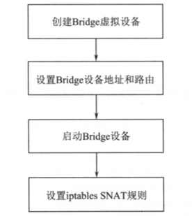
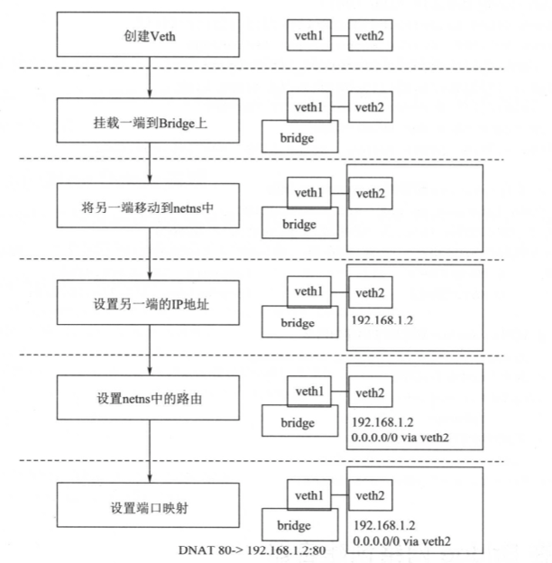
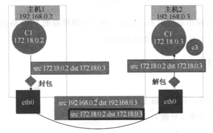
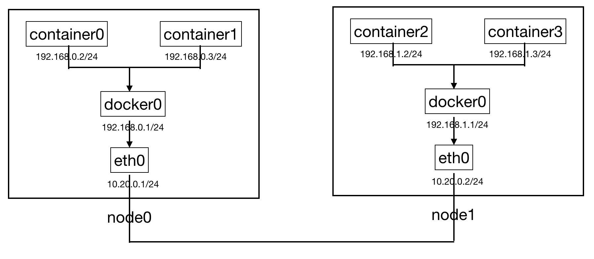

Table of Contents
=================

* [前言](#前言)
* [联合文件系统(UnionFS)](#联合文件系统(UnionFS))
* [<a href="https://lwn.net/Articles/531114/" rel="nofollow">namespace隔离</a>](#namespace\xE9\x9A\x94\xE7\xA6\xBB)
   * [UTS namespaces](#uts-namespaces)
   * [IPC namespaces](#ipc-namespaces)
* [<a href="https://medium.com/@teddyking/namespaces-in-go-user-a54ef9476f2a" rel="nofollow">USER namespaces</a>](#user-namespaces)
* [Mount namespaces](#mount-namespaces)
   * [PID namespaces](#pid-namespaces)
   * [Network namespaces](#network-namespaces)
* [cgroups控制](#cgroups控制)
* [容器进阶](#容器进阶)
   * [sample-container-runtime ps](#sample-container-runtime-ps)
   * [sample-container-runtime logs](#sample-container-runtime-logs)
   * [sample-container-runtime exec](#sample-container-runtime-exec)
   * [sample-container-runtime stop](#sample-container-runtime-stop)
   * [sample-container-runtime start](#sample-container-runtime-start)
   * [sample-container-runtime rm](#sample-container-runtime-rm)
   * [sample-container-runtime commit](#sample-container-runtime-commit)
   * [sample-container-runtime env](#sample-container-runtime-env)
* [容器网络](#容器网络)
   * [IPAM](#ipam)
   * [Bridge网络管理](#Bridge网络管理)
   * [管理容器网络端点](#管理容器网络端点)
   * [容器跨主机网络](#容器跨主机网络)
* [Roadmap](#roadmap)
* [Conclusion](#conclusion)
* [Refs](#refs)
      
## 前言

无论是虚拟化技术还是容器技术都是为了最大程度解决母机资源利用率的问题。虚拟化技术利用Hypervisor(运行在宿主机OS上)将底层硬件进行了虚拟，使得在每台VM看来，硬件都是独占的，并且由VM Guest OS直接操作(具备最高操作权限)；而容器共享母机OS，每个容器只包含应用以及应用所依赖的库和二进制文件；Linux内核的namespace隔离特性，cgroups(资源控制)，以及联合文件系统使得多个容器之间相互隔离，同时资源受到限制。总的来说：容器技术相比虚拟机更加轻量，同时也具备更高的执行效率



对于容器来说，最具有代表性的项目就是Docker。Docker自2013年由DotCloud开源后，便席卷整个容器技术圈。它通过设计和封装用户友好的操作接口，使得整个容器技术使用门槛大大降低；同时它也系统地构建了应用打包(Docker build)，分发(Docker pull&push)标准和工具，使得整个容器生命周期管理更加容易和可实施。对于Docker来说，可以简单的认为它并没有创造新的技术，而是将内核的namespace(进程隔离)，cgroups(进程资源控制)，Capabilities，Apparmro以及seccomp(安全防护)，以及联合文件系统进行了组合，并最终呈现给用户一个可操作和管理的容器引擎



这里为了研究容器技术，我在参考了阿里云三位同学编写的《自己动手写Docker》这本书后，基于[mydocker](https://github.com/xianlubird/mydocker/tree/code-6.5)项目开始编写自己的容器运行时，希望能更加贴近容器本质，并计划补充mydocker没有涉及的OCI，CRI等部分以及一些高级命令

下面我将依次介绍[sample-container-runtime](https://github.com/duyanghao/sample-container-runtime)实现过程中的一些核心细节

## 联合文件系统(UnionFS)

在深入介绍namespace以及cgroups之前，我们先介绍联合文件系统。联合文件系统(UnionFS)用于将不同文件系统的文件和目录联合挂载到同一个文件系统。它使用branch把不同文件系统的文件和目录进行覆盖，形成一个单一一致的文件系统(对于同一路径，上层覆盖下层)视图，这些branch具备不同的读写权限，read-only or read-write；同时利用了写时拷贝(copy on write)技术将对只读层的写操作复制到了读写层。Cow是一种对可修改资源实现高效复制的资源管理技术，当一个资源是重复的且没有发生任何修改时，并不需要创建新的资源，该资源可被多个实例共享；只有当第一次写操作发生时，才会创建新的资源。通过CoW，可以显著减少未修改资源复制带来的消耗，但另一方面也增加了资源修改时的开销

AUFS重写了早期的UnionFS，并引入了一些新的功能，增加了可靠性和性能，同时也是Docker选用的第一个storage driver。sample-container-runtime采用AUFS作为联合文件系统实现，将容器镜像的多层内容呈现为统一的rootfs(根文件系统)

AUFS具备如下特性：

* 上层覆盖下层
* 新增文件存放在可写层
* 写时拷贝(CoW)
* 通过whiteout标识删除文件


这里，我们将容器使用的镜像分为三个目录(参考Docker)，如下：

* 只读目录存放容器基础镜像，不可修改(/var/lib/sample-container-runtime/imageXXX)
* 读写目录存放容器运行时修改的内容(/var/lib/sample-container-runtime/writeLayer/containerXXX)
* 挂载目录存放容器aufs联合挂载点(/var/lib/sample-container-runtime/mnt/containerXXX)

```bash
$ make build
$ ./build/pkg/cmd/sample-container-runtime/sample-container-runtime run -ti --name container1 -v /root/tmp/from1:/to1 busybox sh
# on node
$ ls /var/lib/sample-container-runtime/  
busybox  busybox.tar  mnt  writeLayer
$ mount|grep aufs
none on /var/lib/sample-container-runtime/mnt/container1 type aufs (rw,relatime,si=b7a28d49e64d71ad)
$ cat /sys/fs/aufs/si_b7a28d49e64d71ad/*
/var/lib/sample-container-runtime/writeLayer/container1=rw
/var/lib/sample-container-runtime/busybox=ro
64
65
/var/lib/sample-container-runtime/writeLayer/container1/.aufs.xino
# container1
/ # mount
none on / type aufs (rw,relatime,si=b7a28d49e87289ad)
proc on /proc type proc (rw,nosuid,nodev,noexec,relatime)
tmpfs on /dev type tmpfs (rw,nosuid,mode=755)
/ # echo "hello, world" > tmpfile
/ # ls
bin      dev      etc      home     proc     root     sys      tmp      tmpfile  usr      var
# switch to node
$ ls -al /var/lib/sample-container-runtime/writeLayer/container1/
drwxr-xr-x 5 root root 4096 Nov  2 19:52 .
drwxr-xr-x 5 root root 4096 Nov  2 19:52 ..
-r--r--r-- 1 root root    0 Nov  2 19:52 .wh..wh.aufs
drwx------ 2 root root 4096 Nov  2 19:52 .wh..wh.orph
drwx------ 2 root root 4096 Nov  2 19:52 .wh..wh.plnk
drwx------ 2 root root 4096 Nov  2 19:52 root
-rw-r--r-- 1 root root   13 Nov  2 19:52 tmpfile
# container1
/ # echo "testline" >> tmp/work_dir_onion/install_exec.sh
# switch to node
$ ls -al /var/lib/sample-container-runtime/writeLayer/container1/
total 36
drwxr-xr-x 8 root root 4096 Nov  2 20:18 .
drwxr-xr-x 5 root root 4096 Nov  2 19:52 ..
-r--r--r-- 1 root root    0 Nov  2 19:52 .wh..wh.aufs
drwx------ 2 root root 4096 Nov  2 19:52 .wh..wh.orph
drwx------ 2 root root 4096 Nov  2 19:52 .wh..wh.plnk
drwxr-xr-x 2 root root 4096 Nov  2 20:03 bin
drwx------ 2 root root 4096 Nov  2 19:52 root
drwxrwxrwt 3 root root 4096 Nov  2 20:18 tmp
-rw-r--r-- 1 root root   13 Nov  2 19:52 tmpfile
drwxr-xr-x 3 root root 4096 Nov  2 20:01 usr
# ls -al /var/lib/sample-container-runtime/writeLayer/container1/
tmp
`-- work_dir_onion
    `-- install_exec.sh
```

从运行可以看到添加文件到aufs mnt，文件实际添加到可写层；另外，修改可读层的文件会复制该文件到可写层，同时只读层该文件并没有修改

这里我们看一下实现：

```go
// Create a AUFS filesystem as container root workspace
func NewWorkSpace(volume, imageName, containerName string) {
	CreateReadOnlyLayer(imageName)
	CreateWriteLayer(containerName)
	CreateMountPoint(containerName, imageName)
	if volume != "" {
		volumeURLs := strings.Split(volume, ":")
		length := len(volumeURLs)
		if length == 2 && volumeURLs[0] != "" && volumeURLs[1] != "" {
			MountVolume(volumeURLs, containerName)
			log.Infof("NewWorkSpace volume urls %q", volumeURLs)
		} else {
			log.Infof("Volume parameter input is not correct.")
		}
	}
}

// Decompression tar image
func CreateReadOnlyLayer(imageName string) error {
	unTarFolderUrl := RootUrl + "/" + imageName + "/"
	imageUrl := RootUrl + "/" + imageName + ".tar"
	exist, err := PathExists(unTarFolderUrl)
	if err != nil {
		log.Infof("Fail to judge whether dir %s exists. %v", unTarFolderUrl, err)
		return err
	}
	if !exist {
		if err := os.MkdirAll(unTarFolderUrl, 0622); err != nil {
			log.Errorf("Mkdir %s error %v", unTarFolderUrl, err)
			return err
		}

		if _, err := exec.Command("tar", "-xvf", imageUrl, "-C", unTarFolderUrl).CombinedOutput(); err != nil {
			log.Errorf("Untar dir %s error %v", unTarFolderUrl, err)
			return err
		}
	}
	return nil
}

// Create read-write layer
func CreateWriteLayer(containerName string) {
	writeURL := fmt.Sprintf(WriteLayerUrl, containerName)
	if err := os.MkdirAll(writeURL, 0777); err != nil {
		log.Infof("Mkdir write layer dir %s error. %v", writeURL, err)
	}
}

// Create aufs mount point
func CreateMountPoint(containerName, imageName string) error {
	mntUrl := fmt.Sprintf(MntUrl, containerName)
	if err := os.MkdirAll(mntUrl, 0777); err != nil {
		log.Errorf("Mkdir mountpoint dir %s error. %v", mntUrl, err)
		return err
	}
	tmpWriteLayer := fmt.Sprintf(WriteLayerUrl, containerName)
	tmpImageLocation := RootUrl + "/" + imageName
	mntURL := fmt.Sprintf(MntUrl, containerName)
	dirs := "dirs=" + tmpWriteLayer + ":" + tmpImageLocation
	_, err := exec.Command("mount", "-t", "aufs", "-o", dirs, "none", mntURL).CombinedOutput()
	if err != nil {
		log.Errorf("Run command for creating mount point failed %v", err)
		return err
	}
	return nil
}
```

核心命令如下：

```bash
mount -t aufs -o dirs=/var/lib/sample-container-runtime/writeLayer/container1:/var/lib/sample-container-runtime/busybox none . /var/lib/sample-container-runtime/mnt/container1
```

上述的aufs联合挂载点作为容器rootfs，这里利用了mount namespace，会在接下来的namespace章节-Mount namespaces介绍

通过上述操作，我们实现了容器重复利用只读层，并构建可写层运行容器的方法，而这实际上也是目前Docker采用的原理。通过联合文件系统可以使Docker镜像最大程度利用磁盘空间，同时也提高了Docker容器启动的效率

## [namespace隔离](https://lwn.net/Articles/531114/)

namespace提供了一种内核级别资源隔离的方法：

>> The purpose of each namespace is to wrap a particular global system resource in an abstraction that makes it appear to the processes within the namespace that they have their own isolated instance of the global resource. 

Linux目前提供了6种namespace类型，每种namespace用途各不相同：

* Mount namespaces (CLONE_NEWNS, Linux 2.4.19) isolate the set of filesystem mount points seen by a group of processes
* UTS namespaces (CLONE_NEWUTS, Linux 2.6.19) UTS namespaces provide isolation of two system identifiers: the hostname and the NIS domain name.
* IPC namespaces (CLONE_NEWIPC, Linux 2.6.19) isolate certain interprocess communication (IPC) resources, namely, System V IPC objects and (since Linux 2.6.30) POSIX message queues.
* PID namespaces (CLONE_NEWPID, Linux 2.6.24) isolate the process ID number space. In other words, processes in different PID namespaces can have the same PID. 
* Network namespaces (CLONE_NEWNET, started in Linux 2.4.19 2.6.24 and largely completed by about Linux 2.6.29) provide isolation of the system resources associated with networking. Thus, each network namespace has its own network devices, IP addresses, IP routing tables, /proc/net directory, port numbers, and so on.
* User namespaces (CLONE_NEWUSER, started in Linux 2.6.23 and completed in Linux 3.8) isolate the user and group ID number spaces. In other words, a process's user and group IDs can be different inside and outside a user namespace.

下面我将依次介绍各个namespace的应用实现(由易到难)：

### UTS namespaces

UTS namespace实现了进程hostname以及domain name的隔离，它允许我们给容器设置与母机不同的hostname以及domainname。通过给Cloneflags设置CLONE_NEWUTS来实现隔离，并在容器内部使用syscall.Sethostname()函数设置hostname，如下：

```go
func NewParentProcess(tty bool, containerName, volume, imageName string, envSlice []string) (*exec.Cmd, *os.File) {
	readPipe, writePipe, err := NewPipe()
	if err != nil {
		log.Errorf("New pipe error %v", err)
		return nil, nil
	}
	initCmd, err := os.Readlink("/proc/self/exe")
	if err != nil {
		log.Errorf("get init process error %v", err)
		return nil, nil
	}

	cmd := exec.Command(initCmd, "init")
	cmd.SysProcAttr = &syscall.SysProcAttr{
		Cloneflags: syscall.CLONE_NEWUTS | syscall.CLONE_NEWPID | syscall.CLONE_NEWNS |
			syscall.CLONE_NEWNET | syscall.CLONE_NEWIPC,
	}

	if tty {
		cmd.Stdin = os.Stdin
		cmd.Stdout = os.Stdout
		cmd.Stderr = os.Stderr
	} else {
		dirURL := fmt.Sprintf(DefaultInfoLocation, containerName)
		if err := os.MkdirAll(dirURL, 0622); err != nil {
			log.Errorf("NewParentProcess mkdir %s error %v", dirURL, err)
			return nil, nil
		}
		stdLogFilePath := dirURL + ContainerLogFile
		stdLogFile, err := os.Create(stdLogFilePath)
		if err != nil {
			log.Errorf("NewParentProcess create file %s error %v", stdLogFilePath, err)
			return nil, nil
		}
		cmd.Stdout = stdLogFile
	}

	cmd.ExtraFiles = []*os.File{readPipe}
	cmd.Env = append(os.Environ(), envSlice...)
	NewWorkSpace(volume, imageName, containerName)
	cmd.Dir = fmt.Sprintf(MntUrl, containerName)
	return cmd, writePipe
}

...
var InitCommand = cli.Command{
	Name:  "init",
	Usage: "Init container process run user's process in container. Do not call it outside",
	Action: func(context *cli.Context) error {
		log.Infof("init come on")
		err := container.RunContainerInitProcess()
		return err
	},
}

func RunContainerInitProcess() error {
	cmdArray := readUserCommand()
	if cmdArray == nil || len(cmdArray) == 0 {
		return fmt.Errorf("Run container get user command error, cmdArray is nil")
	}

	hostname := util.RandomSeq(10)

	if err := syscall.Sethostname([]byte(hostname)); err != nil {
		log.Errorf("set hostname error: %v", err)
		return err
	}
	setUpMount()

	path, err := exec.LookPath(cmdArray[0])
	if err != nil {
		log.Errorf("Exec loop path error %v", err)
		return err
	}
	log.Infof("Find path %s", path)
	if err := syscall.Exec(path, cmdArray[0:], append(os.Environ(), fmt.Sprintf("PS1=%s # ", hostname))); err != nil {
		log.Errorf(err.Error())
	}
	return nil
}
```

运行如下：

```bash
# on container
$ ./build/pkg/cmd/sample-container-runtime/sample-container-runtime run -ti --name container1 busybox sh
{"level":"info","msg":"createTty true","time":"2020-11-03T11:20:56+08:00"}
{"level":"info","msg":"init come on","time":"2020-11-03T11:20:56+08:00"}
{"level":"info","msg":"command all is sh","time":"2020-11-03T11:20:56+08:00"}
{"level":"info","msg":"Current location is /var/lib/sample-container-runtime/mnt/container1","time":"2020-11-03T11:20:56+08:00"}
{"level":"info","msg":"Find path /bin/sh","time":"2020-11-03T11:20:56+08:00"}
MbNtIFraOd # hostname
MbNtIFraOd
# on node
$ hostname
VM-xxx-centos
```

可以看到容器中hostname为MbNtIFraOd，而母机为VM-xxx-centos

### IPC namespaces

IPC用于隔离进程某些IPC(进程间通信)资源，具体来说就是：System V IPC objects and (since Linux 2.6.30) POSIX message queues。其中System V IPC objects又包括：Shared Memory(共享内存), Semaphore(信号量) and Message Queues(消息队列)

这里我们通过给Cloneflags设置CLONE_NEWIPC来实现隔离，如下：

```go
func NewParentProcess(tty bool, containerName, volume, imageName string, envSlice []string) (*exec.Cmd, *os.File) {
	readPipe, writePipe, err := NewPipe()
	if err != nil {
		log.Errorf("New pipe error %v", err)
		return nil, nil
	}
	initCmd, err := os.Readlink("/proc/self/exe")
	if err != nil {
		log.Errorf("get init process error %v", err)
		return nil, nil
	}

	cmd := exec.Command(initCmd, "init")
	cmd.SysProcAttr = &syscall.SysProcAttr{
		Cloneflags: syscall.CLONE_NEWUTS | syscall.CLONE_NEWPID | syscall.CLONE_NEWNS |
			syscall.CLONE_NEWNET | syscall.CLONE_NEWIPC,
	}

	if tty {
		cmd.Stdin = os.Stdin
		cmd.Stdout = os.Stdout
		cmd.Stderr = os.Stderr
	} else {
		dirURL := fmt.Sprintf(DefaultInfoLocation, containerName)
		if err := os.MkdirAll(dirURL, 0622); err != nil {
			log.Errorf("NewParentProcess mkdir %s error %v", dirURL, err)
			return nil, nil
		}
		stdLogFilePath := dirURL + ContainerLogFile
		stdLogFile, err := os.Create(stdLogFilePath)
		if err != nil {
			log.Errorf("NewParentProcess create file %s error %v", stdLogFilePath, err)
			return nil, nil
		}
		cmd.Stdout = stdLogFile
	}

	cmd.ExtraFiles = []*os.File{readPipe}
	cmd.Env = append(os.Environ(), envSlice...)
	NewWorkSpace(volume, imageName, containerName)
	cmd.Dir = fmt.Sprintf(MntUrl, containerName)
	return cmd, writePipe
}
```

验证如下：

```bash
# inside of container
gyZQRmcHMr # ipcs -a

------ Shared Memory Segments --------
key        shmid      owner      perms      bytes      nattch     status      

------ Semaphore Arrays --------
key        semid      owner      perms      nsems     

------ Message Queues --------
key        msqid      owner      perms      used-bytes   messages
gyZQRmcHMr # readlink /proc/$$/ns/ipc
ipc:[4026532515]

# outside of container
$ ipcmk -Q
Message queue id: 0
$ ipcs -a

------ Message Queues --------
key        msqid      owner      perms      used-bytes   messages    
0x11df483b 0          root       644        0            0                    

------ Shared Memory Segments --------
key        shmid      owner      perms      bytes      nattch     status      
0x00005feb 0          root       666        12000      3                                            
...                     

------ Semaphore Arrays --------
key        semid      owner      perms      nsems     
0x00008708 0          root       666        1                
...

$ readlink /proc/$$/ns/ipc
ipc:[4026531839]
```

可以看到母机和容器中的IPC资源不同了，两者处于不同的ipc namespace

## [USER namespaces](https://medium.com/@teddyking/namespaces-in-go-user-a54ef9476f2a)

USER namespace用于隔离进程用户ID以及组ID资源，它允许我们设置进程在容器和母机中的用户和组ID映射，也就是说一个进程在容器中可以具有root最高权限，但是在母机上该进程实际上并不具备root用户权限，而只具备普通用户权限



每个进程通过如下文件路径存储映射关系(inside a USER namespace to a corresponding set of user IDs and group IDs outside the namespace)：

* /proc/PID/uid_map：uid的映射文件
* /proc/PID/gid_map：gid的映射文件

这里，我们通过给[syscall.SysProcAttr](https://golang.org/pkg/syscall/#SysProcAttr)分别设置UidMappings(uid映射)以及GidMappings(gid映射)来实现容器进程USER namespace隔离：

```go
func NewParentProcess(tty bool, containerName, volume, imageName string, envSlice []string) (*exec.Cmd, *os.File) {
	readPipe, writePipe, err := NewPipe()
	if err != nil {
		log.Errorf("New pipe error %v", err)
		return nil, nil
	}
	initCmd, err := os.Readlink("/proc/self/exe")
	if err != nil {
		log.Errorf("get init process error %v", err)
		return nil, nil
	}

	cmd := exec.Command(initCmd, "init")
	cmd.SysProcAttr = &syscall.SysProcAttr{
		Cloneflags: syscall.CLONE_NEWUTS | syscall.CLONE_NEWPID | syscall.CLONE_NEWNS |
			syscall.CLONE_NEWNET | syscall.CLONE_NEWIPC | syscall.CLONE_NEWUSER,
		UidMappings: []syscall.SysProcIDMap{
			{
				ContainerID: 0,
				HostID:      os.Getuid(),
				Size:        1,
			},
		},
		GidMappings: []syscall.SysProcIDMap{
			{
				ContainerID: 0,
				HostID:      os.Getgid(),
				Size:        1,
			},
		},
	}

	if tty {
		cmd.Stdin = os.Stdin
		cmd.Stdout = os.Stdout
		cmd.Stderr = os.Stderr
	} else {
		dirURL := fmt.Sprintf(DefaultInfoLocation, containerName)
		if err := os.MkdirAll(dirURL, 0622); err != nil {
			log.Errorf("NewParentProcess mkdir %s error %v", dirURL, err)
			return nil, nil
		}
		stdLogFilePath := dirURL + ContainerLogFile
		stdLogFile, err := os.Create(stdLogFilePath)
		if err != nil {
			log.Errorf("NewParentProcess create file %s error %v", stdLogFilePath, err)
			return nil, nil
		}
		cmd.Stdout = stdLogFile
	}

	cmd.ExtraFiles = []*os.File{readPipe}
	cmd.Env = append(os.Environ(), envSlice...)
	NewWorkSpace(volume, imageName, containerName)
	cmd.Dir = fmt.Sprintf(MntUrl, containerName)
	return cmd, writePipe
}
```

这里将容器init进程(1号进程)的uid和gid设置为0(root)，且分别映射为母机当前的用户ID和组ID(非root)

## Mount namespaces

Mount namespace用于隔离进程文件系统的挂载点视图，在不同namespace的进程中，看到的文件系统层次是不一样的，同时，在 Mount Namespace 中调用 mount()和 umount()仅仅只会影响当前Namespace内的文件系统，而对全局的文件系统是没有影响的（Mount Namespace是Linux第一个实现的Namespace类型，因此，它的系统调用参数是NEWNS ( New Namespace的缩写））

这里我将主要探讨如何实现使用mount namespace实现容器挂载联合文件系统作为它的rootfs，这也是上述讲解aufs时遗留的一个问题

通常来说我们需要在容器中按照如下步骤进行挂载：

* remounts current root filesystem with MS_PRIVATE(This mount point is private; it does not have a peer group. Mount and unmount events do not propagate into or out of this mount point.)
* Bind mount newRoot to itself - this is a slight hack needed to satisfy the pivot_root requirement that newRoot and putold must not be on the same filesystem as the current root
* creates temporary directory, where the old root will be stored
* [pivots root (swaps the mount at `/` with another (the `rootfs-dir` in this case).](https://lwn.net/Articles/689856/)
  pivot_root() changes the root directory and the current working directory of each process or thread in the same mount namespace to new_root if they point to the old root directory. (See also NOTES.) On the other hand, pivot_root() does not change the caller's current working directory (unless it is on the old root directory), and thus it should be followed by a chdir("/") call.
  The following restrictions apply:
  - new_root and put_old must be directories.
  - new_root and put_old must not be on the same mount as the current root.
  - put_old must be at or underneath new_root; that is, adding some nonnegative number of "/.." prefixes to the pathname pointed to by put_old must yield the same directory as new_root.
  - new_root must be a path to a mount point, but can't be "/". A path that is not already a mount point can be converted into one by bind mounting the path onto itself.
  - The propagation type of the parent mount of new_root and the parent mount of the current root directory must not be MS_SHARED; similarly, if put_old is an existing mount point, its propagation type must not be MS_SHARED. These restrictions ensure that pivot_root() never propagates any changes to another mount namespace.
  - The current root directory must be a mount point.
* ensures current working directory is set to new root(os.Chdir("/"))
* umounts and removes the old root

另外，需要给Cloneflags设置syscall.CLONE_NEWNS实现mnt namespace隔离。核心代码如下：

```go
func NewParentProcess(tty bool, containerName, volume, imageName string, envSlice []string) (*exec.Cmd, *os.File) {
	readPipe, writePipe, err := NewPipe()
	if err != nil {
		log.Errorf("New pipe error %v", err)
		return nil, nil
	}
	initCmd, err := os.Readlink("/proc/self/exe")
	if err != nil {
		log.Errorf("get init process error %v", err)
		return nil, nil
	}

	cmd := exec.Command(initCmd, "init")
	cmd.SysProcAttr = &syscall.SysProcAttr{
		Cloneflags: syscall.CLONE_NEWUTS | syscall.CLONE_NEWPID | syscall.CLONE_NEWNS |
			syscall.CLONE_NEWNET | syscall.CLONE_NEWIPC,
	}
  
	...
	return cmd, writePipe
}

...
func RunContainerInitProcess() error {
    ...
	setUpMount()
    ...
	return nil
}

/**
Init 挂载点
*/
func setUpMount() {
	pwd, err := os.Getwd()
	if err != nil {
		log.Errorf("Get current location error %v", err)
		return
	}
	log.Infof("Current location is %s", pwd)
	pivotRoot(pwd)
    ...
}

func pivotRoot(root string) error {
	// Remounts current root filesystem with MS_PRIVATE
	if err := syscall.Mount("", "/", "", syscall.MS_REC|syscall.MS_PRIVATE, ""); err != nil {
		return fmt.Errorf("syscall Mount current root failure: %v", err)
	}
	/**
	  为了使当前root的老 root 和新 root 不在同一个文件系统下，我们把root重新mount了一次
	  bind mount是把相同的内容换了一个挂载点的挂载方法
	*/
	if err := syscall.Mount(root, root, "bind", syscall.MS_BIND|syscall.MS_REC, ""); err != nil {
		return fmt.Errorf("Mount rootfs to itself error: %v", err)
	}
	// 创建 rootfs/.pivot_root 存储 old_root
	pivotDir := filepath.Join(root, ".pivot_root")
	if err := os.Mkdir(pivotDir, 0777); err != nil {
		return err
	}
	// pivot_root 到新的rootfs, 现在老的 old_root 是挂载在rootfs/.pivot_root
	// 挂载点现在依然可以在mount命令中看到
	if err := syscall.PivotRoot(root, pivotDir); err != nil {
		return fmt.Errorf("pivot_root %v", err)
	}
	// 修改当前的工作目录到根目录
	if err := syscall.Chdir("/"); err != nil {
		return fmt.Errorf("chdir / %v", err)
	}

	pivotDir = filepath.Join("/", ".pivot_root")
	// umount rootfs/.pivot_root
	if err := syscall.Unmount(pivotDir, syscall.MNT_DETACH); err != nil {
		return fmt.Errorf("unmount pivot_root dir %v", err)
	}
	// 删除临时文件夹
	return os.Remove(pivotDir)
}
```

通过上述步骤，我们可以成功做到将容器的rootfs设置为aufs联合文件系统，如下：

```bash
# inside of container
JJMhAjPfRh # mount
none on / type aufs (rw,relatime,si=b7a28d49e33081ad)
JJMhAjPfRh # ls
bin   dev   etc   home  proc  root  sys   tmp   usr   var
# outside of container
$ cat /sys/fs/aufs/si_b7a28d49e33081ad/*
/var/lib/sample-container-runtime/writeLayer/container1=rw
/var/lib/sample-container-runtime/busybox=ro
64
65
/var/lib/sample-container-runtime/writeLayer/container1/.aufs.xino
```

### PID namespaces

PID namespace用于隔离进程的PID，它会导致容器进程只能看到属于该namespace空间下的进程，同时不同PID namespace下的进程可以拥有相同的PID。当我们通过上述mnt namespace将联合文件系统作为容器的根文件系统后，由于没有/proc目录，我们通过ps命令看到的会是空返回(linux通过/proc目录存储操作系统所有进程的信息)。因此我们必须在运行容器指定进程前设置proc文件系统

具体来说我们需要给Cloneflags设置syscall.CLONE_NEWPID实现PID namespace隔离，同时在容器中设置proc文件系统(mount -t proc proc /proc)，核心代码如下：

```go
func NewParentProcess(tty bool, containerName, volume, imageName string, envSlice []string) (*exec.Cmd, *os.File) {
	readPipe, writePipe, err := NewPipe()
	if err != nil {
		log.Errorf("New pipe error %v", err)
		return nil, nil
	}
	initCmd, err := os.Readlink("/proc/self/exe")
	if err != nil {
		log.Errorf("get init process error %v", err)
		return nil, nil
	}

	cmd := exec.Command(initCmd, "init")
	cmd.SysProcAttr = &syscall.SysProcAttr{
		Cloneflags: syscall.CLONE_NEWUTS | syscall.CLONE_NEWPID | syscall.CLONE_NEWNS |
			syscall.CLONE_NEWNET | syscall.CLONE_NEWIPC,
	}

  ...
	return cmd, writePipe
}

/**
Init 挂载点
*/
func setUpMount() {
	pwd, err := os.Getwd()
	if err != nil {
		log.Errorf("Get current location error %v", err)
		return
	}
	log.Infof("Current location is %s", pwd)
	pivotRoot(pwd)

	// mount proc
	defaultMountFlags := syscall.MS_NOEXEC | syscall.MS_NOSUID | syscall.MS_NODEV
	syscall.Mount("proc", "/proc", "proc", uintptr(defaultMountFlags), "")

	syscall.Mount("tmpfs", "/dev", "tmpfs", syscall.MS_NOSUID|syscall.MS_STRICTATIME, "mode=755")
}
```

运行容器如下：

```bash
JJMhAjPfRh # ps -ef
PID   USER     TIME  COMMAND
    1 root      0:00 sh
   11 root      0:00 ps -ef
JJMhAjPfRh # mount
none on / type aufs (rw,relatime,si=b7a28d49e33081ad)
proc on /proc type proc (rw,nosuid,nodev,noexec,relatime)
```

可以看到这里多了proc文件系统，同时ps命令可以正常输出，且显示为容器进程PID namespace可以看到的进程(PID=1为容器进程)

另外在容器外，我们可以发现该进程实际对应PID为`19879`，如下：

```bash
xxx     14180 14177  0 Nov02 pts/0    00:00:00 -bash
xxx     19872 14180  0 12:45 pts/0    00:00:00 ./build/pkg/cmd/sample-container-runtime/sample-container-runtime run -ti --name container1 busybox sh
xxx     19879 19872  0 12:45 pts/0    00:00:00 sh
```

### Network namespaces

network namespace用于隔离进程网络资源，每个network namespace都有属于它自己的网络设备，IP地址，IP路由表，端口信息，以及/proc/net目录等。通过network namespace可以使每个容器拥有自己独立的(虚拟的)网络设备，而且容器内的应用可以绑定到自己的端口，并且不会产生冲突。通过一定的网络方法就可以实现容器与容器，容器与宿主机，以及容器与容器跨主机通信，而容器网络将会在后续章节进行介绍，这里不展开

下面我们将展示network namespace隔离的最直观现象，如下：

```bash
JJMhAjPfRh # ifconfig
```

可以看到容器中执行ifconfig命令显示为空，表明容器中没有任何网络设备；而宿主机是存在网络设备的，从这一点可以看出容器网络命名空间确实隔离了，而实现这一现象的操作只需要给Cloneflags设置syscall.CLONE_NEWNET即可：

```go
func NewParentProcess(tty bool, containerName, volume, imageName string, envSlice []string) (*exec.Cmd, *os.File) {
	readPipe, writePipe, err := NewPipe()
	if err != nil {
		log.Errorf("New pipe error %v", err)
		return nil, nil
	}
	initCmd, err := os.Readlink("/proc/self/exe")
	if err != nil {
		log.Errorf("get init process error %v", err)
		return nil, nil
	}

	cmd := exec.Command(initCmd, "init")
	cmd.SysProcAttr = &syscall.SysProcAttr{
		Cloneflags: syscall.CLONE_NEWUTS | syscall.CLONE_NEWPID | syscall.CLONE_NEWNS |
			syscall.CLONE_NEWNET | syscall.CLONE_NEWIPC,
	}

  ...
	return cmd, writePipe
}
```

## cgroups控制

cgroups提供了对一组进程以及子进程资源限制，控制以及统计的能力，包括：CPU，内存，I/O，网络等。通过cgroups，我们可以实现对容器资源的限制和统计，下面介绍cgroups的几个组件：

* cgroup是对进程分组管理的一种机制， 一个cgroup包含一组进程，并可以在这个cgroup上增加Linux subsystem的各种参数配置，将一组进程和一组subsystem的系统参数关联起来
* subsystem是一组资源控制的模块，包括：blkio(块设备(比如硬盘)输入输出的访问控制)，cpu(进程CPU调度策略)，cpuacct(进程CPU占用)，cpuset(在多核机器上设置cgroup中进程可以使用的CPU)，memory(进程内存占用)，net_cls(用于将cgroup中进程产生的网络包分类)。每个subsystem会关联到定义了相应限制的cgroup上，并对该cgroup中的进程做资源控制
* hierarchy的功能是把一组cgroup串成一个树状的结构，一个这样的树便是一个hierarchy，通过这种树状结构，cgroups可以做到继承

cgroups是通过这三个组件之间相互协作实现的，它们之间的关系可以归纳如下：

* 一个hierarchy可以附加多个subsystem
* 一个subsystem只能附加到一个hierarchy上面 
* 一个进程可以作为多个cgroup的成员，但是这些cgroup必须在不同的hierarchy中
* 一个进程fork出子进程时，子进程是和父进程在同一个cgroup中的，也可以根据需要将其移动到其它cgroup中

Kernel通过层级的目录虚拟出cgroups树，使得cgroups的配置更加直观。系统默认已经为每个subsystem创建了一个hierarchy，如下：

```bash
cgroup on /sys/fs/cgroup/systemd type cgroup (rw,nosuid,nodev,noexec,relatime,xattr,release_agent=/usr/lib/systemd/systemd-cgroups-agent,name=systemd)
cgroup on /sys/fs/cgroup/devices type cgroup (rw,nosuid,nodev,noexec,relatime,devices)
cgroup on /sys/fs/cgroup/freezer type cgroup (rw,nosuid,nodev,noexec,relatime,freezer)
cgroup on /sys/fs/cgroup/pids type cgroup (rw,nosuid,nodev,noexec,relatime,pids)
cgroup on /sys/fs/cgroup/cpu,cpuacct type cgroup (rw,nosuid,nodev,noexec,relatime,cpu,cpuacct)
cgroup on /sys/fs/cgroup/net_cls,net_prio type cgroup (rw,nosuid,nodev,noexec,relatime,net_cls,net_prio)
cgroup on /sys/fs/cgroup/perf_event type cgroup (rw,nosuid,nodev,noexec,relatime,perf_event)
cgroup on /sys/fs/cgroup/blkio type cgroup (rw,nosuid,nodev,noexec,relatime,blkio)
cgroup on /sys/fs/cgroup/cpuset type cgroup (rw,nosuid,nodev,noexec,relatime,cpuset)
cgroup on /sys/fs/cgroup/hugetlb type cgroup (rw,nosuid,nodev,noexec,relatime,hugetlb)
cgroup on /sys/fs/cgroup/memory type cgroup (rw,nosuid,nodev,noexec,relatime,memory)
```

可以看到，/sys/fs/cgroup/memory目录便是挂在了memory subsystem的hierarchy上

接下来将详细讲解`sample-container-runtime`对cgroups的使用细节：

```go
type CgroupManager struct {
	// cgroup在hierarchy中的路径 相当于创建的cgroup目录相对于root cgroup目录的路径
	Path string
	// 资源配置
	Resource *subsystems.ResourceConfig
}
```

这里首先封装了一层CgroupManager，表示对cgroups的管理，同时设置了相应的操作接口：

```go
// 将进程pid加入到这个cgroup中
func (c *CgroupManager) Apply(pid int) error {
	for _, subSysIns := range subsystems.SubsystemsIns {
		subSysIns.Apply(c.Path, pid)
	}
	return nil
}

// 设置cgroup资源限制
func (c *CgroupManager) Set(res *subsystems.ResourceConfig) error {
	for _, subSysIns := range subsystems.SubsystemsIns {
		subSysIns.Set(c.Path, res)
	}
	return nil
}

// 释放cgroup
func (c *CgroupManager) Destroy() error {
	for _, subSysIns := range subsystems.SubsystemsIns {
		if err := subSysIns.Remove(c.Path); err != nil {
			log.Warnf("remove cgroup fail %v", err)
		}
	}
	return nil
}
```

上述接口含义如下：

* Apply：调用subsystem.Apply接口将进程PID添加到相应的cgroup tasks文件中(such as /sys/fs/cgroup/memory/ContainerID/tasks)
* Set：调用subsystem.Set接口设置cgroup资源配额(such as /sys/fs/cgroup/memory/ContainerID/memory.limit_in_bytes)
* Destory：调用subsystem.Remove接口删除cgroup(such as /sys/fs/cgroup/memory/ContainerID)

下面展开介绍一下subsystem接口(目前只实现了三种subsystem cgroup)：

```go
package subsystems

type ResourceConfig struct {
	MemoryLimit string
	CpuShare    string
	CpuSet      string
}

type Subsystem interface {
	Name() string
	Set(path string, res *ResourceConfig) error
	Apply(path string, pid int) error
	Remove(path string) error
}

var (
	SubsystemsIns = []Subsystem{
		&CpusetSubSystem{},
		&MemorySubSystem{},
		&CpuSubSystem{},
	}
)
```

这里举例说明memory subsystem实现：

```go
func (s *MemorySubSystem) Set(cgroupPath string, res *ResourceConfig) error {
	if subsysCgroupPath, err := GetCgroupPath(s.Name(), cgroupPath, true); err == nil {
		if res.MemoryLimit != "" {
			if err := ioutil.WriteFile(path.Join(subsysCgroupPath, "memory.limit_in_bytes"), []byte(res.MemoryLimit), 0644); err != nil {
				return fmt.Errorf("set cgroup memory fail %v", err)
			}
		}
		return nil
	} else {
		return err
	}

}

func (s *MemorySubSystem) Remove(cgroupPath string) error {
	if subsysCgroupPath, err := GetCgroupPath(s.Name(), cgroupPath, false); err == nil {
		return os.RemoveAll(subsysCgroupPath)
	} else {
		return err
	}
}

func (s *MemorySubSystem) Apply(cgroupPath string, pid int) error {
	if subsysCgroupPath, err := GetCgroupPath(s.Name(), cgroupPath, false); err == nil {
		if err := ioutil.WriteFile(path.Join(subsysCgroupPath, "tasks"), []byte(strconv.Itoa(pid)), 0644); err != nil {
			return fmt.Errorf("set cgroup proc fail %v", err)
		}
		return nil
	} else {
		return fmt.Errorf("get cgroup %s error: %v", cgroupPath, err)
	}
}

func (s *MemorySubSystem) Name() string {
	return "memory"
}
```

可以看到MemorySubSystem.Set将res.MemoryLimit限制写入到了`/sys/fs/cgroup/memory/ContainerID/memory.limit_in_bytes`文件，对ContainerID命名的cgroup进行了内存限制；同时Apply函数将进程PID写入到`/sys/fs/cgroup/memory/ContainerID/tasks`文件中，使得容器进程被添加到该cgroup中；最后Remove函数删除`/sys/fs/cgroup/memory/ContainerID`目录，也即删除该cgroup。其它subsystem原理依此类推

运行程序如下：

```bash
$ ./build/pkg/cmd/sample-container-runtime/sample-container-runtime run -ti -m 100m -cpuset 1 -cpushare 512 -name container1 busybox sh
{"level":"info","msg":"createTty true","time":"2020-11-03T16:34:16+08:00"}
{"level":"info","msg":"init come on","time":"2020-11-03T16:34:16+08:00"}
{"level":"info","msg":"command all is sh","time":"2020-11-03T16:34:16+08:00"}
{"level":"info","msg":"Current location is /var/lib/sample-container-runtime/mnt/container1","time":"2020-11-03T16:34:16+08:00"}
{"level":"info","msg":"Find path /bin/sh","time":"2020-11-03T16:34:16+08:00"}
IkIucFXIzM # 

# outside of container
$ ./build/pkg/cmd/sample-container-runtime/sample-container-runtime ps
ID           NAME         PID         STATUS      COMMAND     CREATED
6123430628   container1   23965       running     sh          2020-11-03 16:34:16
$ ls /sys/fs/cgroup/memory/6123430628/
cgroup.clone_children       memory.kmem.max_usage_in_bytes      memory.limit_in_bytes            memory.numa_stat            memory.use_hierarchy
cgroup.event_control        memory.kmem.slabinfo                memory.max_usage_in_bytes        memory.oom_control          notify_on_release
cgroup.procs                memory.kmem.tcp.failcnt             memory.memsw.failcnt             memory.pressure_level       tasks
memory.failcnt              memory.kmem.tcp.limit_in_bytes      memory.memsw.limit_in_bytes      memory.soft_limit_in_bytes
memory.force_empty          memory.kmem.tcp.max_usage_in_bytes  memory.memsw.max_usage_in_bytes  memory.stat
memory.kmem.failcnt         memory.kmem.tcp.usage_in_bytes      memory.memsw.usage_in_bytes      memory.swappiness
memory.kmem.limit_in_bytes  memory.kmem.usage_in_bytes          memory.move_charge_at_immigrate  memory.usage_in_bytes
$ cat /sys/fs/cgroup/memory/6123430628/tasks 
23965
$ cat /sys/fs/cgroup/memory/6123430628/memory.limit_in_bytes 
104857600
$ ps -ef|grep 23958
xxx     23958 14180  0 16:34 pts/0    00:00:00 ./build/pkg/cmd/sample-container-runtime/sample-container-runtime run -ti -m 100m -cpuset 1 -cpushare 512 -name container1 busybox sh
xxx     23965 23958  0 16:34 pts/0    00:00:00 sh
```

通过将容器init进程PID添加到对应subsystem的cgroup.tasks文件中，我们就可以实现对容器资源的限制(一个进程fork出子进程时，子进程是和父进程在同一个cgroup中)

## 容器进阶

在介绍完容器的底层核心技术(aufs，namespace隔离以及cgroups资源控制)之后，我们将进行更加高阶的操作，构建实际可用的容器命令行工具。包括：ps(容器列表)，logs(容器日志查看)，exec(进入容器命名空间)，stop(停止容器)，start(启动容器)，rm(删除容器)，commit(通过容器创建镜像)，env(容器指定环境变量运行)等

### sample-container-runtime ps

sample-container-runtime ps用于查看容器信息列表。这里我们使用/var/run/sample-container-runtime/containerName/config.json文件存储每个容器相关信息，包括：容器ID，容器名称，容器PID(init process PID)，容器运行状态，容器启动命令，容器创建时间等。如下：

```bash
# outside of container
$ ./build/pkg/cmd/sample-container-runtime/sample-container-runtime ps
ID           NAME         PID         STATUS      COMMAND     CREATED
6123430628   container1   23965       running     sh          2020-11-03 16:34:16
$ cat /var/run/sample-container-runtime/container1/config.json 
{"pid":"23965","id":"6123430628","name":"container1","command":"sh","createTime":"2020-11-03 16:34:16","status":"running","volume":"","portmapping":null}
```

核心代码实现参考：

```go
type ContainerInfo struct {
	Pid         string                     `json:"pid"`         // 容器的init进程在宿主机上的PID
	Id          string                     `json:"id"`          // 容器Id
	Name        string                     `json:"name"`        // 容器名
	Command     []string                   `json:"command"`     // 容器内init运行命令
	CreatedTime string                     `json:"createTime"`  // 创建时间
	Status      string                     `json:"status"`      // 容器的状态
	Volume      string                     `json:"volume"`      // 容器的数据卷
	PortMapping []string                   `json:"portmapping"` // 端口映射
	ImageName   string                     `json:"imageName"`   // 镜像名
	Detached    bool                       `json:"detached"`    // 是否后端执行
	ResConf     *subsystems.ResourceConfig `json:"resConf"`     // cgroup限制
	Env         []string                   `json:"env"`         // 容器环境变量
	Network     string                     `json:"network"`     // 容器网络
}

func recordContainerInfo(containerPID int, commandArray []string, containerName, id, volume string) (string, error) {
	createTime := time.Now().Format("2006-01-02 15:04:05")
	command := strings.Join(commandArray, "")
	containerInfo := &container.ContainerInfo{
		Id:          id,
		Pid:         strconv.Itoa(containerPID),
		Command:     command,
		CreatedTime: createTime,
		Status:      container.RUNNING,
		Name:        containerName,
		Volume:      volume,
	}

	jsonBytes, err := json.Marshal(containerInfo)
	if err != nil {
		log.Errorf("Record container info error %v", err)
		return "", err
	}
	jsonStr := string(jsonBytes)

	dirUrl := fmt.Sprintf(container.DefaultInfoLocation, containerName)
	if err := os.MkdirAll(dirUrl, 0622); err != nil {
		log.Errorf("Mkdir error %s error %v", dirUrl, err)
		return "", err
	}
	fileName := dirUrl + "/" + container.ConfigName
	file, err := os.Create(fileName)
	defer file.Close()
	if err != nil {
		log.Errorf("Create file %s error %v", fileName, err)
		return "", err
	}
	if _, err := file.WriteString(jsonStr); err != nil {
		log.Errorf("File write string error %v", err)
		return "", err
	}

	return containerName, nil
}

func Run(tty bool, comArray []string, res *subsystems.ResourceConfig, containerName, volume, imageName string,
	envSlice []string, nw string, portmapping []string) {
	containerID := randStringBytes(10)
	if containerName == "" {
		containerName = containerID
	}

	parent, writePipe := container.NewParentProcess(tty, containerName, volume, imageName, envSlice)
	if parent == nil {
		log.Errorf("New parent process error")
		return
	}

	if err := parent.Start(); err != nil {
		log.Error(err)
	}

	//record container info
	containerName, err := recordContainerInfo(parent.Process.Pid, comArray, containerName, containerID, volume)
	if err != nil {
		log.Errorf("Record container info error %v", err)
		return
	}

	// use containerID as cgroup name
	cgroupManager := cgroups.NewCgroupManager(containerID)
	defer cgroupManager.Destroy()
	cgroupManager.Set(res)
	cgroupManager.Apply(parent.Process.Pid)

	if nw != "" {
		// config container network
		network.Init()
		containerInfo := &container.ContainerInfo{
			Id:          containerID,
			Pid:         strconv.Itoa(parent.Process.Pid),
			Name:        containerName,
			PortMapping: portmapping,
		}
		if err := network.Connect(nw, containerInfo); err != nil {
			log.Errorf("Error Connect Network %v", err)
			return
		}
	}

	sendInitCommand(comArray, writePipe)

	if tty {
		parent.Wait()
		deleteContainerInfo(containerName)
		container.DeleteWorkSpace(volume, containerName)
	}

}
```

从上述代码可以看出当容器创建时，父进程会设置容器进程的相关信息到指定文件中，而sample-container-runtime ps命令其实也就是简单地读取这些文件(/var/run/sample-container-runtime/containerName/config.json)，并进行排列输出，如下：

```go
var ListCommand = cli.Command{
	Name:  "ps",
	Usage: "list all the containers",
	Action: func(context *cli.Context) error {
		ListContainers()
		return nil
	},
}

func ListContainers() {
	dirURL := fmt.Sprintf(container.DefaultInfoLocation, "")
	dirURL = dirURL[:len(dirURL)-1]
	files, err := ioutil.ReadDir(dirURL)
	if err != nil {
		log.Errorf("Read dir %s error %v", dirURL, err)
		return
	}

	var containers []*container.ContainerInfo
	for _, file := range files {
		if file.Name() == "network" {
			continue
		}
		tmpContainer, err := getContainerInfo(file)
		if err != nil {
			log.Errorf("Get container info error %v", err)
			continue
		}
		containers = append(containers, tmpContainer)
	}

	w := tabwriter.NewWriter(os.Stdout, 12, 1, 3, ' ', 0)
	fmt.Fprint(w, "ID\tNAME\tPID\tSTATUS\tCOMMAND\tCREATED\n")
	for _, item := range containers {
		fmt.Fprintf(w, "%s\t%s\t%s\t%s\t%s\t%s\n",
			item.Id,
			item.Name,
			item.Pid,
			item.Status,
			item.Command,
			item.CreatedTime)
	}
	if err := w.Flush(); err != nil {
		log.Errorf("Flush error %v", err)
		return
	}
}

func getContainerInfo(file os.FileInfo) (*container.ContainerInfo, error) {
	containerName := file.Name()
	configFileDir := fmt.Sprintf(container.DefaultInfoLocation, containerName)
	configFileDir = configFileDir + container.ConfigName
	content, err := ioutil.ReadFile(configFileDir)
	if err != nil {
		log.Errorf("Read file %s error %v", configFileDir, err)
		return nil, err
	}
	var containerInfo container.ContainerInfo
	if err := json.Unmarshal(content, &containerInfo); err != nil {
		log.Errorf("Json unmarshal error %v", err)
		return nil, err
	}

	return &containerInfo, nil
}
```

**注意：该实现只是在容器创建时设置了容器的状态为RUNNING，但没有对该容器进行监控，当容器状态发生改变时，通过ps命令查看到的会是错误的状态，这个可以在后续改进**

### sample-container-runtime logs

sample-container-runtime logs用于查看容器日志，这里我们将容器的标准输出重定向到文件中(/var/run/sample-container-runtime/containerName/container.log )，在调用logs命令时读取相应容器的container.log即可：

```go
func NewParentProcess(tty bool, containerName, volume, imageName string, envSlice []string) (*exec.Cmd, *os.File) {
	readPipe, writePipe, err := NewPipe()
	if err != nil {
		log.Errorf("New pipe error %v", err)
		return nil, nil
	}
	initCmd, err := os.Readlink("/proc/self/exe")
	if err != nil {
		log.Errorf("get init process error %v", err)
		return nil, nil
	}

	cmd := exec.Command(initCmd, "init")
	cmd.SysProcAttr = &syscall.SysProcAttr{
		Cloneflags: syscall.CLONE_NEWUTS | syscall.CLONE_NEWPID | syscall.CLONE_NEWNS |
			syscall.CLONE_NEWNET | syscall.CLONE_NEWIPC,
	}

	if tty {
		cmd.Stdin = os.Stdin
		cmd.Stdout = os.Stdout
		cmd.Stderr = os.Stderr
	} else {
		dirURL := fmt.Sprintf(DefaultInfoLocation, containerName)
		if err := os.MkdirAll(dirURL, 0622); err != nil {
			log.Errorf("NewParentProcess mkdir %s error %v", dirURL, err)
			return nil, nil
		}
		stdLogFilePath := dirURL + ContainerLogFile
		stdLogFile, err := os.Create(stdLogFilePath)
		if err != nil {
			log.Errorf("NewParentProcess create file %s error %v", stdLogFilePath, err)
			return nil, nil
		}
		cmd.Stdout = stdLogFile
	}

	cmd.ExtraFiles = []*os.File{readPipe}
	cmd.Env = append(os.Environ(), envSlice...)
	NewWorkSpace(volume, imageName, containerName)
	cmd.Dir = fmt.Sprintf(MntUrl, containerName)
	return cmd, writePipe
}

...
var LogCommand = cli.Command{
	Name:  "logs",
	Usage: "print logs of a container",
	Action: func(context *cli.Context) error {
		if len(context.Args()) < 1 {
			return fmt.Errorf("Please input your container name")
		}
		containerName := context.Args().Get(0)
		logContainer(containerName)
		return nil
	},
}

func logContainer(containerName string) {
	dirURL := fmt.Sprintf(container.DefaultInfoLocation, containerName)
	logFileLocation := dirURL + container.ContainerLogFile
	file, err := os.Open(logFileLocation)
	defer file.Close()
	if err != nil {
		log.Errorf("Log container open file %s error %v", logFileLocation, err)
		return
	}
	content, err := ioutil.ReadAll(file)
	if err != nil {
		log.Errorf("Log container read file %s error %v", logFileLocation, err)
		return
	}
	fmt.Fprint(os.Stdout, string(content))
}
```

执行如下：

```bash
$ ./build/pkg/cmd/sample-container-runtime/sample-container-runtime run -d -name container4 busybox top  
{"level":"info","msg":"createTty false","time":"2020-11-03T18:01:39+08:00"}
{"level":"info","msg":"command all is top","time":"2020-11-03T18:01:39+08:00"}
$ ./build/pkg/cmd/sample-container-runtime/sample-container-runtime logs container4
Mem: 264484K used, 237248K free, 1256K shrd, 19616K buff, 115258K cached
CPU:  0.0% usr  0.0% sys  0.0% nic 99.8% idle  0.0% io  0.0% irq  0.0% sirq
Load average: 0.05 0.05 0.01 1/303 9
  PID  PPID USER     STAT   VSZ %VSZ CPU %CPU COMMAND
```

### sample-container-runtime exec

sample-container-runtime exec可以进入到容器命名空间中。由于对Mount Namespace来说，一个具有多线程的进程是无法使用setns调用进入到对应命名空间的，而Go每启动一个程序就会进入多线程状态(单进程多线程模型)，因此无法简单地在Go里面直接调用setns，使当前的进程进入容器对应的Mount Namespace

这里我们采用借助Cgo来实现这个功能。Cgo允许Go程序以一种特殊的方式调用C函数与标准库，Cgo会将C源码文件和Go文件整合成一个包，如下是使用C根据指定PID进入其对应namespace的函数：

```c
package nsenter

/*
#include <errno.h>
#include <sched.h>
#include <stdio.h>
#include <stdlib.h>
#include <string.h>
#include <fcntl.h>

__attribute__((constructor)) void enter_namespace(void) {
	char *scr_pid;
	scr_pid = getenv("scr_pid");
	if (scr_pid) {
		//fprintf(stdout, "got scr_pid=%s\n", scr_pid);
	} else {
		//fprintf(stdout, "missing scr_pid env skip nsenter");
		return;
	}
	char *scr_cmd;
	scr_cmd = getenv("scr_cmd");
	if (scr_cmd) {
		//fprintf(stdout, "got scr_cmd=%s\n", scr_cmd);
	} else {
		//fprintf(stdout, "missing scr_cmd env skip nsenter");
		return;
	}
	int i;
	char nspath[1024];
	char *namespaces[] = { "ipc", "uts", "net", "pid", "mnt" };

	for (i=0; i<5; i++) {
		sprintf(nspath, "/proc/%s/ns/%s", scr_pid, namespaces[i]);
		int fd = open(nspath, O_RDONLY);

		if (setns(fd, 0) == -1) {
			//fprintf(stderr, "setns on %s namespace failed: %s\n", namespaces[i], strerror(errno));
		} else {
			//fprintf(stdout, "setns on %s namespace succeeded\n", namespaces[i]);
		}
		close(fd);
	}
	int res = system(scr_cmd);
	exit(0);
	return;
}
*/
import "C"
```

可以看到，这里使用了构造函数，然后导入了C模块，一旦这个包(nsenter)被引入，它就会在所有Go运行的环境启动之前执行，这段程序执行完毕后，Go程序才会执行。这样就避免了Go多线程导致的无法进入mnt Namespace的问题，同时通过在enter_namespace中设置开关避免了sample-container-runtime run启动容器时也会执行该函数，如下：

```c
__attribute__((constructor)) void enter_namespace(void) {
	char *scr_pid;
	scr_pid = getenv("scr_pid");
	if (scr_pid) {
		//fprintf(stdout, "got scr_pid=%s\n", scr_pid);
	} else {
		//fprintf(stdout, "missing scr_pid env skip nsenter");
		return;
	}
	char *scr_cmd;
	scr_cmd = getenv("scr_cmd");
	if (scr_cmd) {
		//fprintf(stdout, "got scr_cmd=%s\n", scr_cmd);
	} else {
		//fprintf(stdout, "missing scr_cmd env skip nsenter");
		return;
	}
  ...
}    
```

setns可以让进程加入已经存在的namespace：int setns(int fd, int nstype)；

* fd参数是一个文件描述符，可通打开namespace文件获取
* 调用这个函数的进程就会被加入到fd所代表的namesapce

通过enter_namespace可以实现成功进入指定PID的5种namespace(ipc, uts, network, pid, mount)，接下来我们再来看一下sample-container-runtime是如何使用enter_namespace的：

```go
var ExecCommand = cli.Command{
	Name:  "exec",
	Usage: "exec a command into container",
	Action: func(context *cli.Context) error {
		//This is for callback
		if os.Getenv(ENV_EXEC_PID) != "" {
			log.Infof("pid callback pid %s", os.Getgid())
			return nil
		}

		if len(context.Args()) < 2 {
			return fmt.Errorf("Missing container name or command")
		}
		containerName := context.Args().Get(0)
		var commandArray []string
		for _, arg := range context.Args().Tail() {
			commandArray = append(commandArray, arg)
		}
		ExecContainer(containerName, commandArray)
		return nil
	},
}

const ENV_EXEC_PID = "scr_pid"
const ENV_EXEC_CMD = "scr_cmd"

func ExecContainer(containerName string, comArray []string) {
	pid, err := GetContainerPidByName(containerName)
	if err != nil {
		log.Errorf("Exec container getContainerPidByName %s error %v", containerName, err)
		return
	}

	cmdStr := strings.Join(comArray, " ")
	log.Infof("container pid %s", pid)
	log.Infof("command %s", cmdStr)

	cmd := exec.Command("/proc/self/exe", "exec")
	cmd.Stdin = os.Stdin
	cmd.Stdout = os.Stdout
	cmd.Stderr = os.Stderr

	os.Setenv(ENV_EXEC_PID, pid)
	os.Setenv(ENV_EXEC_CMD, cmdStr)
	containerEnvs := getEnvsByPid(pid)
	cmd.Env = append(os.Environ(), containerEnvs...)

	if err := cmd.Run(); err != nil {
		log.Errorf("Exec container %s error %v", containerName, err)
	}
}

func GetContainerPidByName(containerName string) (string, error) {
	dirURL := fmt.Sprintf(container.DefaultInfoLocation, containerName)
	configFilePath := dirURL + container.ConfigName
	contentBytes, err := ioutil.ReadFile(configFilePath)
	if err != nil {
		return "", err
	}
	var containerInfo container.ContainerInfo
	if err := json.Unmarshal(contentBytes, &containerInfo); err != nil {
		return "", err
	}
	return containerInfo.Pid, nil
}

func getEnvsByPid(pid string) []string {
	path := fmt.Sprintf("/proc/%s/environ", pid)
	contentBytes, err := ioutil.ReadFile(path)
	if err != nil {
		log.Errorf("Read file %s error %v", path, err)
		return nil
	}
	//env split by \u0000
	envs := strings.Split(string(contentBytes), "\u0000")
	return envs
}
```

通过如上代码，我们知道当执行exec命令时，会执行ExecContainer函数，而ExecContainer会先设置子进程的ENV_EXEC_PID(容器PID)以及ENV_EXEC_CMD(exec执行的shell命令)环境变量，之后clone出子进程(/proc/self/exe)，并一直等待

子进程(/proc/self/exe)会先执行enter_namespace函数，进入到容器namespace，然后执行system函数，该函数会fork出一个子进程(孙)，并在该子进程(孙)中执行shell命令(**The system() library function uses fork(2) to create a child process that executes the shell command specified in command using execl(3) as follows: execl("/bin/sh", "sh", "-c", command, (char *) NULL);**)，在子进程(孙)执行完shell命令后，子进程(/proc/self/exe)会回到ExecCommand，并由于ENV_EXEC_PID设置并不为空而直接退出，如下：

```go
var ExecCommand = cli.Command{
	Name:  "exec",
	Usage: "exec a command into container",
	Action: func(context *cli.Context) error {
		//This is for callback
		if os.Getenv(ENV_EXEC_PID) != "" {
			log.Infof("pid callback pid %s", os.Getgid())
			return nil
		}

		if len(context.Args()) < 2 {
			return fmt.Errorf("Missing container name or command")
		}
		containerName := context.Args().Get(0)
		var commandArray []string
		for _, arg := range context.Args().Tail() {
			commandArray = append(commandArray, arg)
		}
		ExecContainer(containerName, commandArray)
		return nil
	},
}
```

通过如上的调用流程，很巧妙地解决了在不影响启动容器功能的前提下，如何在Go运行的环境启动之前进入到容器命名空间的问题，如下是执行结果：

```bash
# outside of container
$ ./build/pkg/cmd/sample-container-runtime/sample-container-runtime ps
ID           NAME         PID         STATUS      COMMAND     CREATED
2845654752   container4   5571        running     top         2020-11-03 18:01:39
$ ./build/pkg/cmd/sample-container-runtime/sample-container-runtime exec container4 sh
{"level":"info","msg":"container pid 5571","time":"2020-11-03T19:05:53+08:00"}
{"level":"info","msg":"command sh","time":"2020-11-03T19:05:53+08:00"}
OHdBBchsCx # ps -ef
PID   USER     TIME  COMMAND
    1 root      0:00 top
   12 root      0:00 sh
   13 root      0:00 ps -ef
$ pstree 8812
bash---sample-containe-+-exe---sh
                       `-5*[{sample-containe}]   
# ps -ef|grep 8812
xxx      8812 14177  0 11:33 pts/1    00:00:00 -bash
xxx     15555  8812  0 19:05 pts/1    00:00:00 ./build/pkg/cmd/sample-container-runtime/sample-container-runtime exec container4 sh
xxx     15561 15555  0 19:05 pts/1    00:00:00 /proc/self/exe exec
xxx     15562 15561  0 19:05 pts/1    00:00:00 sh
```

可以看到调用链：bash---sample-containe-+-exe---sh。在容器中看到了top以及sh进程，说明exec成功进入到了容器命名空间

这里有一个小疑问：为什么子进程(proc/self/exec)没有显示出来？

答案就是：**CLONE_NEWPID和其他namespace不同，把进程加入到PID namespace并不会修改该进程的PID namespace，而只修改它所有子进程的PID namespace**

```bash
# PID namespace diffs between proc/self/exec and sh
$ readlink /proc/15555/ns/pid
pid:[4026531836]
$ readlink /proc/15561/ns/pid 
pid:[4026531836]
$ readlink /proc/15562/ns/pid
pid:[4026532322]
# other namespaces are same as below
$ readlink /proc/15555/ns/ipc
ipc:[4026531839]
$ readlink /proc/15561/ns/ipc
ipc:[4026532321]
$ readlink /proc/15562/ns/ipc
ipc:[4026532321]
```

### sample-container-runtime stop

stop命令用于停止容器执行，具体来说就是向容器主进程(init process)发送SIGKILL信号，实现流程如下：

* 获取容器PID
* 对该PID发送kill信号(SIGKILL)
* 修改容器相关信息(STATUS&PID)
* 将信息重新写入相应文件(/var/run/sample-container-runtime/containerName/config.json)

核心代码如下：

```go
var StopCommand = cli.Command{
	Name:  "stop",
	Usage: "stop a container",
	Action: func(context *cli.Context) error {
		if len(context.Args()) < 1 {
			return fmt.Errorf("Missing container name")
		}
		containerName := context.Args().Get(0)
		stopContainer(containerName)
		return nil
	},
}

func stopContainer(containerName string) {
	pid, err := GetContainerPidByName(containerName)
	if err != nil {
		log.Errorf("Get contaienr pid by name %s error %v", containerName, err)
		return
	}
	pidInt, err := strconv.Atoi(pid)
	if err != nil {
		log.Errorf("Conver pid from string to int error %v", err)
		return
	}
	if err := syscall.Kill(pidInt, syscall.SIGKILL); err != nil {
		log.Errorf("Stop container %s error %v", containerName, err)
		return
	}
	containerInfo, err := getContainerInfoByName(containerName)
	if err != nil {
		log.Errorf("Get container %s info error %v", containerName, err)
		return
	}
	containerInfo.Status = container.STOP
	containerInfo.Pid = " "
	newContentBytes, err := json.Marshal(containerInfo)
	if err != nil {
		log.Errorf("Json marshal %s error %v", containerName, err)
		return
	}
	dirURL := fmt.Sprintf(container.DefaultInfoLocation, containerName)
	configFilePath := dirURL + container.ConfigName
	if err := ioutil.WriteFile(configFilePath, newContentBytes, 0622); err != nil {
		log.Errorf("Write file %s error", configFilePath, err)
	}
}

func getContainerInfoByName(containerName string) (*container.ContainerInfo, error) {
	dirURL := fmt.Sprintf(container.DefaultInfoLocation, containerName)
	configFilePath := dirURL + container.ConfigName
	contentBytes, err := ioutil.ReadFile(configFilePath)
	if err != nil {
		log.Errorf("Read file %s error %v", configFilePath, err)
		return nil, err
	}
	var containerInfo container.ContainerInfo
	if err := json.Unmarshal(contentBytes, &containerInfo); err != nil {
		log.Errorf("GetContainerInfoByName unmarshal error %v", err)
		return nil, err
	}
	return &containerInfo, nil
}
```

运行如下：

```bash
$ ./build/pkg/cmd/sample-container-runtime/sample-container-runtime run -d -name container5 busybox top
{"level":"info","msg":"createTty false","time":"2020-11-03T20:10:40+08:00"}
{"level":"info","msg":"command all is top","time":"2020-11-03T20:10:40+08:00"}
$ ./build/pkg/cmd/sample-container-runtime/sample-container-runtime ps
ID           NAME         PID         STATUS      COMMAND     CREATED
2845654752   container4   5571        running     top         2020-11-03 18:01:39
7060111258   container5   26338       running     top         2020-11-03 20:10:40
$ ps -ef|grep 26338
xxx     26338     1  0 20:10 pts/0    00:00:00 top
xxx     26451  8812  0 20:11 pts/1    00:00:00 grep --color=auto 26338
$ ./build/pkg/cmd/sample-container-runtime/sample-container-runtime stop container5
$ ./build/pkg/cmd/sample-container-runtime/sample-container-runtime ps
ID           NAME         PID         STATUS      COMMAND     CREATED
2845654752   container4   5571        running     top         2020-11-03 18:01:39
7060111258   container5               stopped     top         2020-11-03 20:10:40
# ps -ef|grep 26338
xxx     26634  8812  0 20:12 pts/1    00:00:00 grep --color=auto 26338
```

**注意：如果容器主进程(init process)存在子进程，那么子进程也会一起被kill掉**

### sample-container-runtime start

sample-container-runtime用于启动停止的容器：重新运行容器进程(容器ID不变)，并构建新的容器namespace，同时将新的容器进程PID放到原有的cgroup目录中，aufs目录也沿用之前的配置，核心代码如下：

```go
var StartCommand = cli.Command{
	Name:  "start",
	Usage: "start a container",
	Action: func(context *cli.Context) error {
		if len(context.Args()) < 1 {
			return fmt.Errorf("Missing container name")
		}
		containerName := context.Args().Get(0)
		startContainer(containerName)
		return nil
	},
}

func startContainer(containerName string) {
	containerInfo, err := getContainerInfoByName(containerName)
	if err != nil {
		log.Errorf("Get contaienr info by name %s error %v", containerName, err)
		return
	}
	Run(containerInfo.Detached, containerInfo.Id, containerInfo.Command, containerInfo.ResConf, containerName, containerInfo.Volume, containerInfo.ImageName, containerInfo.Env, containerInfo.Network, containerInfo.PortMapping)
}

func Run(tty bool, containerID string, comArray []string, res *subsystems.ResourceConfig, containerName, volume, imageName string,
	envSlice []string, nw string, portmapping []string) {
	if containerName == "" {
		containerName = containerID
	}

	parent, writePipe := container.NewParentProcess(tty, containerName, volume, imageName, envSlice)
	if parent == nil {
		log.Errorf("New parent process error")
		return
	}

	if err := parent.Start(); err != nil {
		log.Error(err)
	}

	//record container info
	containerName, err := recordContainerInfo(tty, parent.Process.Pid, comArray, containerName, containerID, imageName, volume, res, envSlice, nw, portmapping)
	if err != nil {
		log.Errorf("Record container info error %v", err)
		return
	}

	// use containerID as cgroup name
	cgroupManager := cgroups.NewCgroupManager(containerID)
	cgroupManager.Set(res)
	cgroupManager.Apply(parent.Process.Pid)

	if nw != "" {
		// config container network
		network.Init()
		containerInfo := &container.ContainerInfo{
			Id:          containerID,
			Pid:         strconv.Itoa(parent.Process.Pid),
			Name:        containerName,
			PortMapping: portmapping,
		}
		if err := network.Connect(nw, containerInfo); err != nil {
			log.Errorf("Error Connect Network %v", err)
			return
		}
	}

	sendInitCommand(comArray, writePipe)

	if tty {
		parent.Wait()
		deleteContainerInfo(containerName)
		container.DeleteWorkSpace(volume, containerName)
		cgroupManager.Destroy()
	}

}
```

从上述代码看出，这里start函数复用了run函数(Run command对应func)，关键在于之前保留了容器的所有运行信息：

```go
	//record container info
	containerName, err := recordContainerInfo(tty, parent.Process.Pid, comArray, containerName, containerID, imageName, volume, res, envSlice, nw, portmapping)
	if err != nil {
		log.Errorf("Record container info error %v", err)
		return
	}

func recordContainerInfo(tty bool, containerPID int, commandArray []string, containerName, id, imageName, volume string, res *subsystems.ResourceConfig, envSlice []string, nw string, portmapping []string) (string, error) {
	createTime := time.Now().Format("2006-01-02 15:04:05")
	containerInfo := &container.ContainerInfo{
		Id:          id,
		Pid:         strconv.Itoa(containerPID),
		Command:     commandArray,
		CreatedTime: createTime,
		Status:      container.RUNNING,
		Name:        containerName,
		Volume:      volume,
		ResConf:     res,
		Env:         envSlice,
		Network:     nw,
		PortMapping: portmapping,
		Detached:    tty,
		ImageName:   imageName,
	}

	jsonBytes, err := json.Marshal(containerInfo)
	if err != nil {
		log.Errorf("Record container info error %v", err)
		return "", err
	}
	jsonStr := string(jsonBytes)

	dirUrl := fmt.Sprintf(container.DefaultInfoLocation, containerName)
	if err := os.MkdirAll(dirUrl, 0622); err != nil {
		log.Errorf("Mkdir error %s error %v", dirUrl, err)
		return "", err
	}
	fileName := dirUrl + "/" + container.ConfigName
	file, err := os.Create(fileName)
	defer file.Close()
	if err != nil {
		log.Errorf("Create file %s error %v", fileName, err)
		return "", err
	}
	if _, err := file.WriteString(jsonStr); err != nil {
		log.Errorf("File write string error %v", err)
		return "", err
	}

	return containerName, nil
}

type ContainerInfo struct {
	Pid         string                     `json:"pid"`         // 容器的init进程在宿主机上的 PID
	Id          string                     `json:"id"`          // 容器Id
	Name        string                     `json:"name"`        // 容器名
	Command     []string                   `json:"command"`     // 容器内init运行命令
	CreatedTime string                     `json:"createTime"`  // 创建时间
	Status      string                     `json:"status"`      // 容器的状态
	Volume      string                     `json:"volume"`      // 容器的数据卷
	PortMapping []string                   `json:"portmapping"` // 端口映射
	ImageName   string                     `json:"imageName"`   // 镜像名
	Detached    bool                       `json:"detached"`    // 是否后端执行
	ResConf     *subsystems.ResourceConfig `json:"resConf"`     // cgroup限制
	Env         []string                   `json:"env"`         // 容器环境变量
	Network     string                     `json:"network"`     // 容器网络
}
```

通过读取容器的配置文件(/var/run/sample-container-runtime/containerName/config.json)获取容器相关信息，然后重新执行容器启动流程(Run)。这里需要注意的是：在重新运行容器时，只有容器进程和namespace发生改变，容器的ID保持不变，且cgroups和volume保持不变，因此需要做特殊处理

```go
// 保持ID不变
func startContainer(containerName string) {
	containerInfo, err := getContainerInfoByName(containerName)
	if err != nil {
		log.Errorf("Get contaienr info by name %s error %v", containerName, err)
		return
	}
	Run(containerInfo.Detached, containerInfo.Id, containerInfo.Command, containerInfo.ResConf, containerName, containerInfo.Volume, containerInfo.ImageName, containerInfo.Env, containerInfo.Network, containerInfo.PortMapping)
}

// Create a AUFS filesystem as container root workspace
func NewWorkSpace(volume, imageName, containerName string) {
	CreateReadOnlyLayer(imageName)
	CreateWriteLayer(containerName)
	CreateMountPoint(containerName, imageName)
	if volume != "" {
		volumeURLs := strings.Split(volume, ":")
		length := len(volumeURLs)
		if length == 2 && volumeURLs[0] != "" && volumeURLs[1] != "" {
			MountVolume(volumeURLs, containerName)
			log.Infof("NewWorkSpace volume urls %q", volumeURLs)
		} else {
			log.Infof("Volume parameter input is not correct.")
		}
	}
}

// Create read-write layer
func CreateWriteLayer(containerName string) {
	writeURL := fmt.Sprintf(WriteLayerUrl, containerName)
	if _, err := os.Stat(writeURL); os.IsNotExist(err) {
		if err := os.MkdirAll(writeURL, 0777); err != nil {
			log.Infof("Mkdir write layer dir %s error. %v", writeURL, err)
		}
	}
}

func MountVolume(volumeURLs []string, containerName string) error {
	containerUrl := volumeURLs[1]
	mntURL := fmt.Sprintf(MntUrl, containerName)
	containerVolumeURL := mntURL + "/" + containerUrl
	if _, err := os.Stat(containerVolumeURL); os.IsNotExist(err) {
		if err := os.Mkdir(containerVolumeURL, 0777); err != nil {
			log.Infof("Mkdir container dir %s error. %v", containerVolumeURL, err)
		}
		parentUrl := volumeURLs[0]
		if err := os.Mkdir(parentUrl, 0777); err != nil {
			log.Infof("Mkdir parent dir %s error. %v", parentUrl, err)
		}
		dirs := "dirs=" + parentUrl
		_, err := exec.Command("mount", "-t", "aufs", "-o", dirs, "none", containerVolumeURL).CombinedOutput()
		if err != nil {
			log.Errorf("Mount volume failed. %v", err)
			return err
		}
	}
	return nil
}

// Create aufs mount point
func CreateMountPoint(containerName, imageName string) error {
	mntUrl := fmt.Sprintf(MntUrl, containerName)
	if _, err := os.Stat(mntUrl); os.IsNotExist(err) {
		if err := os.MkdirAll(mntUrl, 0777); err != nil {
			log.Errorf("Mkdir mountpoint dir %s error. %v", mntUrl, err)
			return err
		}

		tmpWriteLayer := fmt.Sprintf(WriteLayerUrl, containerName)
		tmpImageLocation := RootUrl + "/" + imageName
		mntURL := fmt.Sprintf(MntUrl, containerName)
		dirs := "dirs=" + tmpWriteLayer + ":" + tmpImageLocation
		_, err := exec.Command("mount", "-t", "aufs", "-o", dirs, "none", mntURL).CombinedOutput()
		if err != nil {
			log.Errorf("Run command for creating mount point failed %v", err)
			return err
		}
	}
	return nil
}
```

运行如下：

```bash
$ ./build/pkg/cmd/sample-container-runtime/sample-container-runtime run -d -m 100m -cpuset 1 -cpushare 512 -name container1 -e bird=l23 -e luck=bird -v /root/tmp/from1:/to1 busybox top
{"level":"info","msg":"createTty false","time":"2020-11-05T12:03:50+08:00"}
{"level":"info","msg":"NewWorkSpace volume urls [\"/root/tmp/from1\" \"/to1\"]","time":"2020-11-05T12:03:50+08:00"}
{"level":"info","msg":"command all is top","time":"2020-11-05T12:03:50+08:00"}
$ ./build/pkg/cmd/sample-container-runtime/sample-container-runtime ps
ID           IMAGE       NAME         PID         STATUS      COMMAND     CREATED
7186029418   busybox     container1   13481       running     top         2020-11-05 12:03:50
$ ./build/pkg/cmd/sample-container-runtime/sample-container-runtime exec container1 sh
{"level":"info","msg":"container pid 13481","time":"2020-11-05T12:04:59+08:00"}
{"level":"info","msg":"command sh","time":"2020-11-05T12:04:59+08:00"}
IGgzGHLSWs # ps -ef
PID   USER     TIME  COMMAND
    1 root      0:00 top
    7 root      0:00 sh
    8 root      0:00 ps -ef
IGgzGHLSWs # mount 
none on / type aufs (rw,relatime,si=b7a28d49ff1499ad)
none on /to1 type aufs (rw,relatime,si=b7a28d48ccccd9ad)
proc on /proc type proc (rw,nosuid,nodev,noexec,relatime)
tmpfs on /dev type tmpfs (rw,nosuid,mode=755)
IGgzGHLSWs # env|grep bird
luck=bird
bird=l23
$ cat /sys/fs/cgroup/memory/7186029418/tasks 
13481

$ ./build/pkg/cmd/sample-container-runtime/sample-container-runtime stop container1
$ ./build/pkg/cmd/sample-container-runtime/sample-container-runtime ps
ID           IMAGE       NAME         PID         STATUS      COMMAND     CREATED
7186029418   busybox     container1               stopped     top         2020-11-05 12:03:50
$ ./build/pkg/cmd/sample-container-runtime/sample-container-runtime start container1  
{"level":"info","msg":"NewWorkSpace volume urls [\"/root/tmp/from1\" \"/to1\"]","time":"2020-11-05T12:05:46+08:00"}
{"level":"info","msg":"command all is top","time":"2020-11-05T12:05:46+08:00"}
$ ./build/pkg/cmd/sample-container-runtime/sample-container-runtime ps
ID           IMAGE       NAME         PID         STATUS      COMMAND     CREATED
7186029418   busybox     container1   13829       running     top         2020-11-05 12:05:46
$ ./build/pkg/cmd/sample-container-runtime/sample-container-runtime exec container1 sh  
{"level":"info","msg":"container pid 13829","time":"2020-11-05T12:06:45+08:00"}
{"level":"info","msg":"command sh","time":"2020-11-05T12:06:45+08:00"}
HxNPTMOCSh # ps -ef
PID   USER     TIME  COMMAND
    1 root      0:00 top
    7 root      0:00 sh
    8 root      0:00 ps -ef
HxNPTMOCSh # 
HxNPTMOCSh # mount
none on / type aufs (rw,relatime,si=b7a28d49ff1499ad)
none on /to1 type aufs (rw,relatime,si=b7a28d48ccccd9ad)
proc on /proc type proc (rw,nosuid,nodev,noexec,relatime)
tmpfs on /dev type tmpfs (rw,nosuid,mode=755)
HxNPTMOCSh # 
HxNPTMOCSh # env|grep bird
luck=bird
bird=l23
$ cat /sys/fs/cgroup/memory/7186029418/tasks 
13829
```

可以看到当容器重启时，PID有改变，容器ID以及cgroup，volume目录没有发生改变

### sample-container-runtime rm

rm命令用于删除已经停止的容器，删除内容包括：容器存储信息，容器日志，容器aufs文件系统以及容器cgroup。步骤如下：

* 根据容器名查找容器信息(getContainerInfoByName)
* 判断容器是否处于停止状态(containerInfo.Status)
* 删除容器数据存储目录(容器信息+日志)
* 删除容器对应的aufs文件系统(包括aufs挂载点，读写层；不包括只读层)
* 删除容器对应的各subsystem cgroup

核心代码如下：

```go
var RemoveCommand = cli.Command{
	Name:  "rm",
	Usage: "remove unused containers",
	Action: func(context *cli.Context) error {
		if len(context.Args()) < 1 {
			return fmt.Errorf("Missing container name")
		}
		containerName := context.Args().Get(0)
		removeContainer(containerName)
		return nil
	},
}

func removeContainer(containerName string) {
	containerInfo, err := getContainerInfoByName(containerName)
	if err != nil {
		log.Errorf("Get container %s info error %v", containerName, err)
		return
	}
	if containerInfo.Status != container.STOP {
		log.Errorf("Couldn't remove running container")
		return
	}
	dirURL := fmt.Sprintf(container.DefaultInfoLocation, containerName)
	if err := os.RemoveAll(dirURL); err != nil {
		log.Errorf("Remove file %s error %v", dirURL, err)
		return
	}
	container.DeleteWorkSpace(containerInfo.Volume, containerName)
	// clear cgroup
	cgroupManager := cgroups.NewCgroupManager(containerInfo.Id)
	cgroupManager.Destroy()
}

// Delete the AUFS filesystem while container exit
func DeleteWorkSpace(volume, containerName string) {
	if volume != "" {
		volumeURLs := strings.Split(volume, ":")
		length := len(volumeURLs)
		if length == 2 && volumeURLs[0] != "" && volumeURLs[1] != "" {
			DeleteMountPointWithVolume(volumeURLs, containerName)
		} else {
			DeleteMountPoint(containerName)
		}
	} else {
		DeleteMountPoint(containerName)
	}
	DeleteWriteLayer(containerName)
}

func DeleteMountPoint(containerName string) error {
	mntURL := fmt.Sprintf(MntUrl, containerName)
	_, err := exec.Command("umount", mntURL).CombinedOutput()
	if err != nil {
		log.Errorf("Unmount %s error %v", mntURL, err)
		return err
	}
	if err := os.RemoveAll(mntURL); err != nil {
		log.Errorf("Remove mountpoint dir %s error %v", mntURL, err)
		return err
	}
	return nil
}

func DeleteWriteLayer(containerName string) {
	writeURL := fmt.Sprintf(WriteLayerUrl, containerName)
	if err := os.RemoveAll(writeURL); err != nil {
		log.Infof("Remove writeLayer dir %s error %v", writeURL, err)
	}
}
```

运行如下：

```bash
$ ./build/pkg/cmd/sample-container-runtime/sample-container-runtime run -d -m 100m -cpuset 1 -cpushare 512 -name container6 busybox top
{"level":"info","msg":"createTty false","time":"2020-11-03T20:38:00+08:00"}
{"level":"info","msg":"command all is top","time":"2020-11-03T20:38:00+08:00"}
$ ./build/pkg/cmd/sample-container-runtime/sample-container-runtime ps
ID           NAME         PID         STATUS      COMMAND     CREATED
9373732263   container6   31067       running     top         2020-11-03 20:38:00
$ ./build/pkg/cmd/sample-container-runtime/sample-container-runtime stop container6
$ ./build/pkg/cmd/sample-container-runtime/sample-container-runtime ps
ID           NAME         PID         STATUS      COMMAND     CREATED
9373732263   container6               stopped     top         2020-11-03 20:38:00
$ ./build/pkg/cmd/sample-container-runtime/sample-container-runtime rm container6
$ ./build/pkg/cmd/sample-container-runtime/sample-container-runtime ps
ID           NAME         PID         STATUS      COMMAND     CREATED
empty
```

### sample-container-runtime commit

commit命令用于将容器打包成镜像，实现如下：

```go
var CommitCommand = cli.Command{
	Name:  "commit",
	Usage: "commit a container into image",
	Action: func(context *cli.Context) error {
		if len(context.Args()) < 2 {
			return fmt.Errorf("Missing container name and image name")
		}
		containerName := context.Args().Get(0)
		imageName := context.Args().Get(1)
		commitContainer(containerName, imageName)
		return nil
	},
}

func commitContainer(containerName, imageName string) {
	mntURL := fmt.Sprintf(container.MntUrl, containerName)
	mntURL += "/"

	imageTar := container.RootUrl + "/" + imageName + ".tar"

	if _, err := exec.Command("tar", "-czf", imageTar, "-C", mntURL, ".").CombinedOutput(); err != nil {
		log.Errorf("Tar folder %s error %v", mntURL, err)
	}
}
```

可以看到实现非常简单，就是将容器对应的aufs文件系统(/var/lib/sample-container-runtime/mnt/containerName)进行打包，命名为指定imageName.tar，并放置在/var/lib/sample-container-runtime目录，如下：

```bash
$ ./build/pkg/cmd/sample-container-runtime/sample-container-runtime ps
ID           NAME         PID         STATUS      COMMAND     CREATED
2845654752   container4   5571        running     top         2020-11-03 18:01:39
$ ./build/pkg/cmd/sample-container-runtime/sample-container-runtime commit container4 test
$ ls /var/lib/sample-container-runtime/
busybox  busybox.tar  mnt  test.tar  writeLayer
```

### sample-container-runtime env

env命令用于实现容器指定环境变量运行，实现也很简单，如下：

```go
var RunCommand = cli.Command{
	Name:  "run",
	Usage: `Create a container with namespace and cgroups limit ie: sample-container-runtime run -ti [image] [command]`,
	Flags: []cli.Flag{
		cli.BoolFlag{
			Name:  "ti",
			Usage: "enable tty",
		},
		cli.BoolFlag{
			Name:  "d",
			Usage: "detach container",
		},
		cli.StringFlag{
			Name:  "m",
			Usage: "memory limit",
		},
		cli.StringFlag{
			Name:  "cpushare",
			Usage: "cpushare limit",
		},
		cli.StringFlag{
			Name:  "cpuset",
			Usage: "cpuset limit",
		},
		cli.StringFlag{
			Name:  "name",
			Usage: "container name",
		},
		cli.StringFlag{
			Name:  "v",
			Usage: "volume",
		},
		cli.StringSliceFlag{
			Name:  "e",
			Usage: "set environment",
		},
		cli.StringFlag{
			Name:  "net",
			Usage: "container network",
		},
		cli.StringSliceFlag{
			Name:  "p",
			Usage: "port mapping",
		},
	},
	Action: func(context *cli.Context) error {
		...
		envSlice := context.StringSlice("e")
		portmapping := context.StringSlice("p")

		Run(createTty, cmdArray, resConf, containerName, volume, imageName, envSlice, network, portmapping)
		return nil
	},
}

...
func NewParentProcess(tty bool, containerName, volume, imageName string, envSlice []string) (*exec.Cmd, *os.File) {
	readPipe, writePipe, err := NewPipe()
	if err != nil {
		log.Errorf("New pipe error %v", err)
		return nil, nil
	}
	initCmd, err := os.Readlink("/proc/self/exe")
	if err != nil {
		log.Errorf("get init process error %v", err)
		return nil, nil
	}

	cmd := exec.Command(initCmd, "init")
	cmd.SysProcAttr = &syscall.SysProcAttr{
		Cloneflags: syscall.CLONE_NEWUTS | syscall.CLONE_NEWPID | syscall.CLONE_NEWNS |
			syscall.CLONE_NEWNET | syscall.CLONE_NEWIPC,
	}

	if tty {
		cmd.Stdin = os.Stdin
		cmd.Stdout = os.Stdout
		cmd.Stderr = os.Stderr
	} else {
		dirURL := fmt.Sprintf(DefaultInfoLocation, containerName)
		if err := os.MkdirAll(dirURL, 0622); err != nil {
			log.Errorf("NewParentProcess mkdir %s error %v", dirURL, err)
			return nil, nil
		}
		stdLogFilePath := dirURL + ContainerLogFile
		stdLogFile, err := os.Create(stdLogFilePath)
		if err != nil {
			log.Errorf("NewParentProcess create file %s error %v", stdLogFilePath, err)
			return nil, nil
		}
		cmd.Stdout = stdLogFile
	}

	cmd.ExtraFiles = []*os.File{readPipe}
	cmd.Env = append(os.Environ(), envSlice...)
	NewWorkSpace(volume, imageName, containerName)
	cmd.Dir = fmt.Sprintf(MntUrl, containerName)
	return cmd, writePipe
}
```

通过解析`-e`参数获取容器环境变量，并由`cmd.Env = append(os.Environ(), envSlice...)`实现环境变量的传递

而对于exec命令来说，由于sample-container-runtime exec是单独的进程，会继承母机的环境变量，这样就会导致exec执行的shell命令会缺失容器添加的环境变量。为了解决这个问题，这里通过读取容器PID的`/proc/PID/environ`文件，并添加到cmd.Env中进行补充：

```go
func ExecContainer(containerName string, comArray []string) {
	pid, err := GetContainerPidByName(containerName)
	if err != nil {
		log.Errorf("Exec container getContainerPidByName %s error %v", containerName, err)
		return
	}

	cmdStr := strings.Join(comArray, " ")
	log.Infof("container pid %s", pid)
	log.Infof("command %s", cmdStr)

	cmd := exec.Command("/proc/self/exe", "exec")
	cmd.Stdin = os.Stdin
	cmd.Stdout = os.Stdout
	cmd.Stderr = os.Stderr

	os.Setenv(ENV_EXEC_PID, pid)
	os.Setenv(ENV_EXEC_CMD, cmdStr)
	containerEnvs := getEnvsByPid(pid)
	cmd.Env = append(os.Environ(), containerEnvs...)

	if err := cmd.Run(); err != nil {
		log.Errorf("Exec container %s error %v", containerName, err)
	}
}

func getEnvsByPid(pid string) []string {
	path := fmt.Sprintf("/proc/%s/environ", pid)
	contentBytes, err := ioutil.ReadFile(path)
	if err != nil {
		log.Errorf("Read file %s error %v", path, err)
		return nil
	}
	//env split by \u0000
	envs := strings.Split(string(contentBytes), "\u0000")
	return envs
}
```

如下是运行结果：

```bash
$ ./build/pkg/cmd/sample-container-runtime/sample-container-runtime run -d -m 100m -cpuset 1 -cpushare 512 -name container6 -e bird=l23 -e luck=bird busybox top
{"level":"info","msg":"createTty false","time":"2020-11-03T21:15:27+08:00"}
{"level":"info","msg":"command all is top","time":"2020-11-03T21:15:27+08:00"}
$ ./build/pkg/cmd/sample-container-runtime/sample-container-runtime ps
ID           NAME         PID         STATUS      COMMAND     CREATED
1024448633   container6   4560        running     top         2020-11-03 21:15:27
$ ./build/pkg/cmd/sample-container-runtime/sample-container-runtime exec container6 sh
{"level":"info","msg":"container pid 4560","time":"2020-11-03T21:16:18+08:00"}
{"level":"info","msg":"command sh","time":"2020-11-03T21:16:18+08:00"}
CHSeESDLAp # env|grep bird
luck=bird
bird=l23
```

## 容器网络

在上述容器namespace章节中，介绍了network namespace，通过network namespace给容器配置了独立的网络命名空间，但是却没有任何网络设备，这样容器是无法与外部进行通信的，而本章节就是要解决容器与外部通信的问题

在详细代码之前，我们先介绍Linux网络的一些基础知识：

* Linux Veth：Veth是成对出现的虚拟网络设备，发送到Veth一端虚拟设备的请求会从另一端的虚拟设备中发出。在容器的虚拟化场景中，经常会使用Veth连接不同的网络Namespace
* Linux Bridge：Bridge虚拟设备是用来桥接的网络设备，它相当于交换机，可以连接不同的网络设备，当请求到达Bridge设备时，可以通过报文中的Mac地址进行广播或转发
* Linux路由表：路由表用于定义某个网络namespace中包的流向，通过route可以查看路由信息，几个核心字段含义如下：
  * Destination：The destination network or destination host(目标网段或者主机)
  * Gateway：The gateway address or * if none set(网关地址，*表示目标是本主机所属的网络，不需要路由)
  * Genmask：The netmask for the destination net; '255.255.255.255' for a host destination and '0.0.0.0' for the default route(目标网络掩码)
  * Flags：Possible flags，U — 路由是活动的，H — 目标是一个主机，G — 路由指向网关
  * Iface：Interface to which packets for this route will be sent(该路由表项对应的输出接口)
* Linux iptables：iptables是对Linux内核netfilter模块进行操作和展示的工具，用来管理包的流动和转送。iptables定义了一套链式处理的结构，在网络包传输的各个阶段可以使用不同的策略对包进行加工、传送或丢弃。在容器虚拟化的技术中，经常会用到两种策略：MASQUERADE(可以将请求包中的源地址转换成一个网络设备的地址)和DNAT(DNAT策略也是做网络地址的转换，不过它是更换目标地址，经常用于将内部网络地址的端口映射到外部去)，用于容器和宿主机外部的网络通信

在介绍完上述基础网络知识后，我们开始描述sample-container-runtime的网络模型，如下：


* 网络是容器的一个集合，在一个网络中的容器可以通过这个网络通信，就像挂载到同一个Linux Bridge设备上的网络设备一样，可以直接通过Bridge实现网络互连。网络中会包括该网络相关的配置，比如：网络的容器地址段、网络操作所调用的网络驱动等信息
* 网络端点：网络端点用于连接容器与网络，保证容器内部与网络的通信。如同Veth设备，一端挂载到容器内部，另一端挂载到Bridge上，就能保证容器和网络的通信。网络端点中会包括连接到网络的一些信息，比如地址、Veth设备、端口映射、连接的容器和网络等信息
* 网络驱动：网络驱动 (Network Driver) 是一个网络功能中的组件，不同的驱动对网络的创建、连接、销毁的策略不同，通过在创建网络时指定不同的网络驱动来定义使用哪种驱动做网络的配置(例如Bridge)
* IPAM：IPAM也是网络功能中的一个组件，用于网络IP地址的分配和释放，包括容器的IP地址和网络网关的IP地址

下面我们分别介绍上述模型的具体实现细节：

### IPAM

对于IP地址的管理。我们可以使用bitmap(位图，在大规模连续且少状态的数据处理中有很高的效率)来存储地址分配信息，在网段中，某个IP地址有两种状态，1表示己经被分配了，0表示还未被分配，那么一个IP地址的状态就可以用一位来表示 ，并且通过相对偏移也能够迅速定位到数据所在的位：

 

数据结构如下：

```go
const ipamDefaultAllocatorPath = "/var/run/sample-container-runtime/network/ipam/subnet.json"

type IPAM struct {
	SubnetAllocatorPath string
	Subnets             *map[string]string
}

var ipAllocator = &IPAM{
	SubnetAllocatorPath: ipamDefaultAllocatorPath,
}

func (ipam *IPAM) load() error {
	if _, err := os.Stat(ipam.SubnetAllocatorPath); err != nil {
		if os.IsNotExist(err) {
			return nil
		} else {
			return err
		}
	}
	subnetConfigFile, err := os.Open(ipam.SubnetAllocatorPath)
	defer subnetConfigFile.Close()
	if err != nil {
		return err
	}
	subnetJson := make([]byte, 2000)
	n, err := subnetConfigFile.Read(subnetJson)
	if err != nil {
		return err
	}

	err = json.Unmarshal(subnetJson[:n], ipam.Subnets)
	if err != nil {
		log.Errorf("Error dump allocation info, %v", err)
		return err
	}
	return nil
}

func (ipam *IPAM) dump() error {
	ipamConfigFileDir, _ := path.Split(ipam.SubnetAllocatorPath)
	if _, err := os.Stat(ipamConfigFileDir); err != nil {
		if os.IsNotExist(err) {
			os.MkdirAll(ipamConfigFileDir, 0644)
		} else {
			return err
		}
	}
	subnetConfigFile, err := os.OpenFile(ipam.SubnetAllocatorPath, os.O_TRUNC|os.O_WRONLY|os.O_CREATE, 0644)
	defer subnetConfigFile.Close()
	if err != nil {
		return err
	}

	ipamConfigJson, err := json.Marshal(ipam.Subnets)
	if err != nil {
		return err
	}

	_, err = subnetConfigFile.Write(ipamConfigJson)
	if err != nil {
		return err
	}

	return nil
}

func (ipam *IPAM) Allocate(subnet *net.IPNet) (ip net.IP, err error) {
	// 存放网段中地址分配信息的数组
	ipam.Subnets = &map[string]string{}

	// 从文件中加载已经分配的网段信息
	err = ipam.load()
	if err != nil {
		log.Errorf("Error dump allocation info, %v", err)
	}

	_, subnet, _ = net.ParseCIDR(subnet.String())

	one, size := subnet.Mask.Size()

	if _, exist := (*ipam.Subnets)[subnet.String()]; !exist {
		(*ipam.Subnets)[subnet.String()] = strings.Repeat("0", 1<<uint8(size-one))
	}

	for c := range (*ipam.Subnets)[subnet.String()] {
		if (*ipam.Subnets)[subnet.String()][c] == '0' {
			ipalloc := []byte((*ipam.Subnets)[subnet.String()])
			ipalloc[c] = '1'
			(*ipam.Subnets)[subnet.String()] = string(ipalloc)
			ip = subnet.IP
			for t := uint(4); t > 0; t -= 1 {
				[]byte(ip)[4-t] += uint8(c >> ((t - 1) * 8))
			}
			ip[3] += 1
			break
		}
	}

	ipam.dump()
	return
}

func (ipam *IPAM) Release(subnet *net.IPNet, ipaddr *net.IP) error {
	ipam.Subnets = &map[string]string{}

	_, subnet, _ = net.ParseCIDR(subnet.String())

	err := ipam.load()
	if err != nil {
		log.Errorf("Error dump allocation info, %v", err)
	}

	c := 0
	releaseIP := ipaddr.To4()
	releaseIP[3] -= 1
	for t := uint(4); t > 0; t -= 1 {
		c += int(releaseIP[t-1]-subnet.IP[t-1]) << ((4 - t) * 8)
	}

	ipalloc := []byte((*ipam.Subnets)[subnet.String()])
	ipalloc[c] = '0'
	(*ipam.Subnets)[subnet.String()] = string(ipalloc)

	ipam.dump()
	return nil
}
```

从上面代码可以看出，这里为了使代码实现简单和易于阅读，使用string中的一个字符表示一个状态位(实际上可以采用一位表示一个是否分配的状态位，这样资源会有更低的消耗)。其中，load函数用于从指定文件路径(/var/run/sample-container-runtime/network/ipam/subnet.json)加载网络地址信息；而dump函数则相反，将网络地址信息写入到该文件中。Allocate与Release功能相反，前者用于从某个网络中分配一个IP地址，后者释放网络中的某个IP地址

### Bridge网络管理

这里我们直接基于Bridge网络驱动管理容器网络，如下是初始化Linux Bridge的4个流程：



```go
type BridgeNetworkDriver struct {
}

func (d *BridgeNetworkDriver) Name() string {
	return "bridge"
}

...
type Network struct {
	Name    string
	IpRange *net.IPNet
	Driver  string
}

func (d *BridgeNetworkDriver) Create(subnet string, name string) (*Network, error) {
	ip, ipRange, _ := net.ParseCIDR(subnet)
	ipRange.IP = ip
	n := &Network{
		Name:    name,
		IpRange: ipRange,
		Driver:  d.Name(),
	}
	err := d.initBridge(n)
	if err != nil {
		log.Errorf("error init bridge: %v", err)
	}

	return n, err
}

func (d *BridgeNetworkDriver) initBridge(n *Network) error {
	// try to get bridge by name, if it already exists then just exit
	bridgeName := n.Name
	if err := createBridgeInterface(bridgeName); err != nil {
		return fmt.Errorf("Error add bridge： %s, Error: %v", bridgeName, err)
	}

	// Set bridge IP
	gatewayIP := *n.IpRange
	gatewayIP.IP = n.IpRange.IP

	if err := setInterfaceIP(bridgeName, gatewayIP.String()); err != nil {
		return fmt.Errorf("Error assigning address: %s on bridge: %s with an error of: %v", gatewayIP, bridgeName, err)
	}

	if err := setInterfaceUP(bridgeName); err != nil {
		return fmt.Errorf("Error set bridge up: %s, Error: %v", bridgeName, err)
	}

	// Setup iptables
	if err := setupIPTables(bridgeName, n.IpRange); err != nil {
		return fmt.Errorf("Error setting iptables for %s: %v", bridgeName, err)
	}

	return nil
}
```

首先是创建Bridge虚拟设备：

```go
func createBridgeInterface(bridgeName string) error {
	// 先检查是否己经存在了这个同名的Bridge设备
	_, err := net.InterfaceByName(bridgeName)
	// 如果已经存在或者报错则返回创建错误
	if err == nil || !strings.Contains(err.Error(), "no such network interface") {
		return err
	}

	// create *netlink.Bridge object
	// 初始化一个netlink的Link基础对象， Link的名字即Bridge虚拟设备的名字
	la := netlink.NewLinkAttrs()
	la.Name = bridgeName

	// 使用刚才创建的Link属性创建netlink的Bridge对象
	br := &netlink.Bridge{la}
	// 调用netlink的Linkadd方法，创建Bridge虚拟网络设备
	// Linkadd方法用来创建虚拟网络设备，相当于ip link add xxx
	if err := netlink.LinkAdd(br); err != nil {
		return fmt.Errorf("Bridge creation failed for bridge %s: %v", bridgeName, err)
	}
	return nil
}
```

通过netlink的LinkAdd方法，创建出了LinuxBridge的虚拟设备

接着，设置Bridge设备的地址和路由：

```go
	// Set bridge IP
	gatewayIP := *n.IpRange
	gatewayIP.IP = n.IpRange.IP

	if err := setInterfaceIP(bridgeName, gatewayIP.String()); err != nil {
		return fmt.Errorf("Error assigning address: %s on bridge: %s with an error of: %v", gatewayIP, bridgeName, err)
	}

	if err := setInterfaceUP(bridgeName); err != nil {
		return fmt.Errorf("Error set bridge up: %s, Error: %v", bridgeName, err)
	}

...
// Set the IP addr of a netlink interface
// 设置一个网络接口的IP地址，例如setinterfaceIP(”testbridge”，”192.168.0.1/24”)
func setInterfaceIP(name string, rawIP string) error {
	retries := 2
	var iface netlink.Link
	var err error
	for i := 0; i < retries; i++ {
		// 通过netlink的LinkByName方法找到需要设置的网络接口
		iface, err = netlink.LinkByName(name)
		if err == nil {
			break
		}
		log.Debugf("error retrieving new bridge netlink link [ %s ]... retrying", name)
		time.Sleep(2 * time.Second)
	}
	if err != nil {
		return fmt.Errorf("Abandoning retrieving the new bridge link from netlink, Run [ ip link ] to troubleshoot the error: %v", err)
	}
	// 返回值中的ipNet既包含了网段的信息：192.168.0.0/24，也包含了原始的IP: 192.168.0.1
	ipNet, err := netlink.ParseIPNet(rawIP)
	if err != nil {
		return err
	}
	// 通过netlink.AddrAdd给网络接口配置地址，相当于ip addr add xxx的命令
	// 同时如果配置了地址所在网段的信息，例如 192.168.0.0/24
	// 还会配置路由表192.168.0.0/24转发到这个testbridge的网络接口上
	addr := &netlink.Addr{ipNet, "", 0, 0, nil}
	return netlink.AddrAdd(iface, addr)
}

// 设置网络接口为UP状态
func setInterfaceUP(interfaceName string) error {
	iface, err := netlink.LinkByName(interfaceName)
	if err != nil {
		return fmt.Errorf("Error retrieving a link named [ %s ]: %v", iface.Attrs().Name, err)
	}

	// 等价于 ip link set xxx up命令
	if err := netlink.LinkSetUp(iface); err != nil {
		return fmt.Errorf("Error enabling interface for %s: %v", interfaceName, err)
	}
	return nil
}
```

Linux的网络设备只有设置成UP状态后才能处理和转发请求

最后设置iptabels Linux Bridge SNAT规则：

```go
// 设置iptables对应bridge的MASQUERADE规则
func setupIPTables(bridgeName string, subnet *net.IPNet) error {
	// 创建iptables命令
	// iptables -t nat -A POSTROUTING -s <subNet> ! -o <bridgeName> -j MASQUERADE
	iptablesCmd := fmt.Sprintf("-t nat -A POSTROUTING -s %s ! -o %s -j MASQUERADE", subnet.String(), bridgeName)
	cmd := exec.Command("iptables", strings.Split(iptablesCmd, " ")...)
	//err := cmd.Run()
	output, err := cmd.Output()
	if err != nil {
		log.Errorf("iptables Output, %v", output)
	}
	return err
}
```

通过直接执行iptables命令，创建SNAT规则，只要是从这个网桥上出来的包，都会对其做源IP地址转换，保证了容器经过宿主机访问外部网络请求的包都转换成宿主机的IP，从而能正确的送达和接收

### 管理容器网络端点

最后，我们介绍如何配置容器网络端点，使容器最终实现通信。创建容器网络端点流程如下：



从上述流程可以看到，在容器的Net Namespace中，可以通过容器的Veth直接与挂载在同一个 Bridge上的容器通信，以及通过Bridge上创建的iptables MASQUERADE规则访问外部网络，同时，外部也可以通过宿主机的端口经过iptables DNAT转发访问容器内部。也即实现了：**容器与容器通信，容器与宿主机通信，容器与外部宿主机通信**

下面我们看具体实现：

```go
func Run(tty bool, containerID string, comArray []string, res *subsystems.ResourceConfig, containerName, volume, imageName string,
	envSlice []string, nw string, portmapping []string) {
	if containerName == "" {
		containerName = containerID
	}

	parent, writePipe := container.NewParentProcess(tty, containerName, volume, imageName, envSlice)
	if parent == nil {
		log.Errorf("New parent process error")
		return
	}

	if err := parent.Start(); err != nil {
		log.Error(err)
	}

  ...

	if nw != "" {
		// config container network
		network.Init()
		containerInfo := &container.ContainerInfo{
			Id:          containerID,
			Pid:         strconv.Itoa(parent.Process.Pid),
			Name:        containerName,
			PortMapping: portmapping,
		}
		if err := network.Connect(nw, containerInfo); err != nil {
			log.Errorf("Error Connect Network %v", err)
			return
		}
	}

	sendInitCommand(comArray, writePipe)

	if tty {
		parent.Wait()
		deleteContainerInfo(containerName)
		container.DeleteWorkSpace(volume, containerName)
		cgroupManager.Destroy()
	}

}

func Connect(networkName string, cinfo *container.ContainerInfo) error {
	network, ok := networks[networkName]
	if !ok {
		return fmt.Errorf("No Such Network: %s", networkName)
	}

	// 分配容器IP地址
	ip, err := ipAllocator.Allocate(network.IpRange)
	if err != nil {
		return err
	}

	// 创建网络端点
	ep := &Endpoint{
		ID:          fmt.Sprintf("%s-%s", cinfo.Id, networkName),
		IPAddress:   ip,
		Network:     network,
		PortMapping: cinfo.PortMapping,
	}
	// 调用网络驱动挂载和配置网络端点
	if err = drivers[network.Driver].Connect(network, ep); err != nil {
		return err
	}
	// 到容器的namespace配置容器网络设备IP地址
	if err = configEndpointIpAddressAndRoute(ep, cinfo); err != nil {
		return err
	}

	return configPortMapping(ep, cinfo)
}
```

我们看一下如何实现连接容器网络端点到Linux Bridge：

```go
// 连接一个网络和网络端点
func (d *BridgeNetworkDriver) Connect(network *Network, endpoint *Endpoint) error {
	// 获取网络名 ，即Linux Bridge的接口名
	bridgeName := network.Name
	// 通过接口名获取到Linux Bridge接口的对象和接口属性
	br, err := netlink.LinkByName(bridgeName)
	if err != nil {
		return err
	}

	// 创建Veth接口的配置
	la := netlink.NewLinkAttrs()
	// 由于Linux接口名的限制，名字取endpoint ID的前5位
	la.Name = endpoint.ID[:5]
	// 通过设置Veth接口的master属性，设置这个Veth的一端挂载到网络对应的Linux Bridge上
	la.MasterIndex = br.Attrs().Index

	// 创建Veth对象，通过PeerName配置Veth另外一端的接口名
	endpoint.Device = netlink.Veth{
		LinkAttrs: la,
		PeerName:  "cif-" + endpoint.ID[:5],
	}

	// 调用netlink的LinkAdd方法创建出这个Veth接口
	// 因为上面指定了link的MasterIndex是网络对应的Linux Bridge
	// 所以Veth的一端就己经挂载到了网络对应的Linux Bridge上了
	if err = netlink.LinkAdd(&endpoint.Device); err != nil {
		return fmt.Errorf("Error Add Endpoint Device: %v", err)
	}

	// 调用netlink的LinkSetUp方法，设置Veth启动
	// 相当于 ip link set xxx up命令
	if err = netlink.LinkSetUp(&endpoint.Device); err != nil {
		return fmt.Errorf("Error Add Endpoint Device: %v", err)
	}
	return nil
}
```

通过调用Bridge驱动中的Connect方法，容器的网络端点己经挂载到了Bridge网络上。下一步就是配置网络端点的另外一端，即容器的network namespace那一端(容器有自己独立的network Namespace，需要将网络端点Veth设备的另外一端移到这个network namespace中并配置，才能给这个容器“插上网线”）：

```go
// 配置容器网络端点的地址和路由
func configEndpointIpAddressAndRoute(ep *Endpoint, cinfo *container.ContainerInfo) error {
	// 通过网络端点中“Veth”的另一端
	peerLink, err := netlink.LinkByName(ep.Device.PeerName)
	if err != nil {
		return fmt.Errorf("fail config endpoint: %v", err)
	}

	// 将网络端点加入到容器的网络空间中
	// 并使这个函数下面的操作都在这个网络空间中进行
	// 执行完函数后，恢复为默认的网络空间，具体实现下面再做介绍
	defer enterContainerNetns(&peerLink, cinfo)()

	// 获取到容器的IP地址及网段，用于配置容器内部接口地址
	// 比如容器IP是192.168.1.2，而网络的网段是192.168.1.0/24
	// 那么这里产出的IP字符串就是192.168.1.2/24，用于容器内Veth端点配置
	interfaceIP := *ep.Network.IpRange
	interfaceIP.IP = ep.IPAddress

	// 调用setinterfaceIP函数设置容器内Veth端点的IP
	if err = setInterfaceIP(ep.Device.PeerName, interfaceIP.String()); err != nil {
		return fmt.Errorf("%v,%s", ep.Network, err)
	}

	// 启动容器内的Veth端点
	if err = setInterfaceUP(ep.Device.PeerName); err != nil {
		return err
	}

	// Net Namespace中默认本地地址127.0.0.1的"lo"网卡是关闭状态的
	// 启动它以保证容器访问自己的请求
	if err = setInterfaceUP("lo"); err != nil {
		return err
	}

	// 设置容器内的外部请求都通过容器内的Veth端点访问
	// 0.0.0.0/0的网段，表示所有的IP地址段
	_, cidr, _ := net.ParseCIDR("0.0.0.0/0")

	// 构建要添加的路由数据，包括网络设备、网关IP及目的网段
	// 相当于route add -net 0.0.0.0/0 gw {Bridge网桥地址} dev {容器内的Veth端点设备}
	defaultRoute := &netlink.Route{
		LinkIndex: peerLink.Attrs().Index,
		Gw:        ep.Network.IpRange.IP,
		Dst:       cidr,
	}

	// 调用netlink的RouteAdd，添加路由到容器的网络空间
	// RouteAdd函数相当于route add命令
	if err = netlink.RouteAdd(defaultRoute); err != nil {
		return err
	}

	return nil
}

// 将网络端点加入到容器的网络空间中
// 并锁定当前程序所执行的线程，使当前线程进入到容器的网络空间
// 返回值是一个函数指针，执行这个返回函数才会退出容器的网络空间，回归到宿主机的网络空间
func enterContainerNetns(enLink *netlink.Link, cinfo *container.ContainerInfo) func() {
	// 找到容器的Net Namespace
	// /proc/{pid}/ns/net打开这个文件的文件描述符就可以来操作Net Namespace
	// 而Conta工nerinfo中的PID，即容器在宿主机上映射的进程ID
	// 它对应的/proc/{pid}/ns/net就是容器内部的Net Namespace
	f, err := os.OpenFile(fmt.Sprintf("/proc/%s/ns/net", cinfo.Pid), os.O_RDONLY, 0)
	if err != nil {
		log.Errorf("error get container net namespace, %v", err)
	}

	// 锁定当前程序所执行的线程，如果不锁定操作系统线程的话
	// Go语言的goroutine可能会被调度到别的线程上去
	// 就不能保证一直在所需要的网络空间中了
	// 所以调用runtime.LockOSThread时要先锁定当前程序执行的线程
	runtime.LockOSThread()

	// 取到文件描述符
	nsFD := f.Fd()
	// 修改veth peer 另外一端移到容器的namespace中
	if err = netlink.LinkSetNsFd(*enLink, int(nsFD)); err != nil {
		log.Errorf("error set link netns , %v", err)
	}

	// 获取当前的网络namespace
	origns, err := netns.Get()
	if err != nil {
		log.Errorf("error get current netns, %v", err)
	}

	// 设置当前进程到新的网络namespace，并在函数执行完成之后再恢复到之前的namespace
	if err = netns.Set(netns.NsHandle(nsFD)); err != nil {
		log.Errorf("error set netns, %v", err)
	}
	return func() {
		// 恢复到上面获取到的之前的Net Namespace
		netns.Set(origns)
		// 关闭Namespace文件
		origns.Close()
		// 取消对当附程序的线程锁定
		runtime.UnlockOSThread()
		// 关闭Namespace文件
		f.Close()
	}
}
```

在调用enterContainerNetns(&peerLink, cinfo)()时会使当前执行的函数进入容器的Net Namespace，配置容器网络端点的地址和路由，而用了defer关键字后会在函数体结束时执行返回的恢复函数指针，恢复到之前宿主机所在的网络空间

现在的容器己经有了自己的网络空间和地址，但是这个地址宿主机外部是访问不到的，所以需要配置宿主机到容器的端口映射，通过iptables的DNAT规则来实现宿主机上的请求转发到容器中：

```go
func configPortMapping(ep *Endpoint, cinfo *container.ContainerInfo) error {
	for _, pm := range ep.PortMapping {
		// 分割成宿主机的端口和容器的端口
		portMapping := strings.Split(pm, ":")
		if len(portMapping) != 2 {
			log.Errorf("port mapping format error, %v", pm)
			continue
		}
		// 由于 iptables没有Go语言版本的实现，所以采用exec.Command的方式直接调用命令配置
		// 在iptables的PREROUTING中添加DNAT规则
		// 将宿主机的端口请求转发到容器的地址和端口上
		iptablesCmd := fmt.Sprintf("-t nat -A PREROUTING -p tcp -m tcp --dport %s -j DNAT --to-destination %s:%s",
			portMapping[0], ep.IPAddress.String(), portMapping[1])
		cmd := exec.Command("iptables", strings.Split(iptablesCmd, " ")...)
		//err := cmd.Run()
		output, err := cmd.Output()
		if err != nil {
			log.Errorf("iptables Output, %v", output)
			continue
		}
	}
	return nil
}
```

最后，我们实际运行测试：

```bash
# 打开IP转发
$ sysctl -w net.ipv4.conf.all.forwarding=1
$ ./build/pkg/cmd/sample-container-runtime/sample-container-runtime network create --driver bridge --subnet 194.172.10.1/24 testbridge
$ route -n
Kernel IP routing table
Destination     Gateway         Genmask         Flags Metric Ref    Use Iface
...
194.172.10.0    0.0.0.0         255.255.255.0   U     0      0        0 testbridge
$ ./build/pkg/cmd/sample-container-runtime/sample-container-runtime run -ti -net testbridge busybox sh
{"level":"info","msg":"createTty true","time":"2020-11-05T17:40:01+08:00"}
{"level":"info","msg":"init come on","time":"2020-11-05T17:40:01+08:00"}
{"level":"info","msg":"command all is sh","time":"2020-11-05T17:40:01+08:00"}
{"level":"info","msg":"Current location is /var/lib/sample-container-runtime/mnt/3126272807","time":"2020-11-05T17:40:01+08:00"}
{"level":"info","msg":"Find path /bin/sh","time":"2020-11-05T17:40:01+08:00"}
RscfSjrHMv # 
RscfSjrHMv # ifconfig 
cif-31262 Link encap:Ethernet  HWaddr 2A:11:11:DC:1B:BD  
          inet addr:194.172.10.2  Bcast:0.0.0.0  Mask:255.255.255.0
          inet6 addr: fe80::2811:11ff:fedc:1bbd/64 Scope:Link
          UP BROADCAST RUNNING MULTICAST  MTU:1500  Metric:1
          RX packets:0 errors:0 dropped:0 overruns:0 frame:0
          TX packets:6 errors:0 dropped:0 overruns:0 carrier:0
          collisions:0 txqueuelen:1000 
          RX bytes:0 (0.0 B)  TX bytes:516 (516.0 B)

lo        Link encap:Local Loopback  
          inet addr:127.0.0.1  Mask:255.0.0.0
          inet6 addr: ::1/128 Scope:Host
          UP LOOPBACK RUNNING  MTU:65536  Metric:1
          RX packets:0 errors:0 dropped:0 overruns:0 frame:0
          TX packets:0 errors:0 dropped:0 overruns:0 carrier:0
          collisions:0 txqueuelen:1000 
          RX bytes:0 (0.0 B)  TX bytes:0 (0.0 B)
RscfSjrHMv # route
Kernel IP routing table
Destination     Gateway         Genmask         Flags Metric Ref    Use Iface
default         194.172.10.1    0.0.0.0         UG    0      0        0 cif-31262
194.172.10.0    *               255.255.255.0   U     0      0        0 cif-31262
RscfSjrHMv # ping -c 3 194.172.10.3
PING 194.172.10.3 (194.172.10.3): 56 data bytes
64 bytes from 194.172.10.3: seq=0 ttl=64 time=0.053 ms
64 bytes from 194.172.10.3: seq=1 ttl=64 time=0.054 ms
64 bytes from 194.172.10.3: seq=2 ttl=64 time=0.055 ms

--- 194.172.10.3 ping statistics ---
3 packets transmitted, 3 packets received, 0% packet loss
round-trip min/avg/max = 0.053/0.054/0.055 ms
RscfSjrHMv # ping -c 3 x.x.x.x
PING x.x.x.x (x.x.x.x): 56 data bytes
64 bytes from x.x.x.x: seq=0 ttl=63 time=0.302 ms
64 bytes from x.x.x.x: seq=1 ttl=63 time=0.255 ms
64 bytes from x.x.x.x: seq=2 ttl=63 time=0.249 ms

--- x.x.x.x ping statistics ---
3 packets transmitted, 3 packets received, 0% packet loss
round-trip min/avg/max = 0.249/0.268/0.302 ms

$ ./build/pkg/cmd/sample-container-runtime/sample-container-runtime run -ti -net testbridge busybox sh
{"level":"info","msg":"createTty true","time":"2020-11-05T17:40:17+08:00"}
{"level":"info","msg":"init come on","time":"2020-11-05T17:40:17+08:00"}
{"level":"info","msg":"command all is sh","time":"2020-11-05T17:40:17+08:00"}
{"level":"info","msg":"Current location is /var/lib/sample-container-runtime/mnt/0549304775","time":"2020-11-05T17:40:17+08:00"}
{"level":"info","msg":"Find path /bin/sh","time":"2020-11-05T17:40:17+08:00"}
sNTHMBOKJJ # 
sNTHMBOKJJ # ifconfig 
cif-05493 Link encap:Ethernet  HWaddr B6:C0:8B:03:1B:96  
          inet addr:194.172.10.3  Bcast:0.0.0.0  Mask:255.255.255.0
          inet6 addr: fe80::b4c0:8bff:fe03:1b96/64 Scope:Link
          UP BROADCAST RUNNING MULTICAST  MTU:1500  Metric:1
          RX packets:0 errors:0 dropped:0 overruns:0 frame:0
          TX packets:5 errors:0 dropped:0 overruns:0 carrier:0
          collisions:0 txqueuelen:1000 
          RX bytes:0 (0.0 B)  TX bytes:426 (426.0 B)

lo        Link encap:Local Loopback  
          inet addr:127.0.0.1  Mask:255.0.0.0
          inet6 addr: ::1/128 Scope:Host
          UP LOOPBACK RUNNING  MTU:65536  Metric:1
          RX packets:0 errors:0 dropped:0 overruns:0 frame:0
          TX packets:0 errors:0 dropped:0 overruns:0 carrier:0
          collisions:0 txqueuelen:1000 
          RX bytes:0 (0.0 B)  TX bytes:0 (0.0 B)
sNTHMBOKJJ # route -n
Kernel IP routing table
Destination     Gateway         Genmask         Flags Metric Ref    Use Iface
0.0.0.0         194.172.10.1    0.0.0.0         UG    0      0        0 cif-05493
194.172.10.0    0.0.0.0         255.255.255.0   U     0      0        0 cif-05493
sNTHMBOKJJ # ping -c 3 194.172.10.2
PING 194.172.10.2 (194.172.10.2): 56 data bytes
64 bytes from 194.172.10.2: seq=0 ttl=64 time=0.049 ms
64 bytes from 194.172.10.2: seq=1 ttl=64 time=0.057 ms
64 bytes from 194.172.10.2: seq=2 ttl=64 time=0.055 ms

--- 194.172.10.2 ping statistics ---
3 packets transmitted, 3 packets received, 0% packet loss
round-trip min/avg/max = 0.049/0.053/0.057 ms
       
# outside of container
$ ip a 
...
3: testbridge: <BROADCAST,MULTICAST,UP,LOWER_UP> mtu 1500 qdisc noqueue state UP qlen 1000
    link/ether b6:f7:a4:aa:a5:25 brd ff:ff:ff:ff:ff:ff
    inet 194.172.10.1/24 scope global testbridge
       valid_lft forever preferred_lft forever
5: 31262@if4: <BROADCAST,MULTICAST,UP,LOWER_UP> mtu 1500 qdisc noqueue master testbridge state UP qlen 1000
    link/ether b6:f7:a4:aa:a5:25 brd ff:ff:ff:ff:ff:ff link-netnsid 0
7: 05493@if6: <BROADCAST,MULTICAST,UP,LOWER_UP> mtu 1500 qdisc noqueue master testbridge state UP qlen 1000
    link/ether e2:49:c2:80:25:06 brd ff:ff:ff:ff:ff:ff link-netnsid 1
    
$ route -n
Kernel IP routing table
Destination     Gateway         Genmask         Flags Metric Ref    Use Iface
...
194.172.10.0    0.0.0.0         255.255.255.0   U     0      0        0 testbridge 

$ iptables -t nat -v -L POSTROUTING -n --line-number
Chain POSTROUTING (policy ACCEPT 21 packets, 1990 bytes)
num   pkts bytes target     prot opt in     out     source               destination         
1        2   168 MASQUERADE  all  --  *      !testbridge  194.172.10.0/24      0.0.0.0/0
```

从上面的例子可以看出，容器之间可以互相访问，容器可以访问宿主机外部IP，接下来我们测试宿主机外访问容器：

```bash
$ ./build/pkg/cmd/sample-container-runtime/sample-container-runtime run -ti -p 80:80 -net testbridge busybox sh
{"level":"info","msg":"createTty true","time":"2020-11-05T18:50:40+08:00"}
{"level":"info","msg":"init come on","time":"2020-11-05T18:50:40+08:00"}
{"level":"info","msg":"command all is sh","time":"2020-11-05T18:50:40+08:00"}
{"level":"info","msg":"Current location is /var/lib/sample-container-runtime/mnt/8941010042","time":"2020-11-05T18:50:40+08:00"}
{"level":"info","msg":"Find path /bin/sh","time":"2020-11-05T18:50:40+08:00"}
PqDLDjvFyB # ifconfig 
cif-89410 Link encap:Ethernet  HWaddr C6:27:36:61:F3:3E  
          inet addr:194.172.10.4  Bcast:0.0.0.0  Mask:255.255.255.0
          inet6 addr: fe80::c427:36ff:fe61:f33e/64 Scope:Link
          UP BROADCAST RUNNING MULTICAST  MTU:1500  Metric:1
          RX packets:0 errors:0 dropped:0 overruns:0 frame:0
          TX packets:6 errors:0 dropped:0 overruns:0 carrier:0
          collisions:0 txqueuelen:1000 
          RX bytes:0 (0.0 B)  TX bytes:516 (516.0 B)

lo        Link encap:Local Loopback  
          inet addr:127.0.0.1  Mask:255.0.0.0
          inet6 addr: ::1/128 Scope:Host
          UP LOOPBACK RUNNING  MTU:65536  Metric:1
          RX packets:0 errors:0 dropped:0 overruns:0 frame:0
          TX packets:0 errors:0 dropped:0 overruns:0 carrier:0
          collisions:0 txqueuelen:1000 
          RX bytes:0 (0.0 B)  TX bytes:0 (0.0 B)

PqDLDjvFyB # nc -lp 80
hello world

$ iptables -t nat -v -L PREROUTING -n --line-number
Chain PREROUTING (policy ACCEPT 108 packets, 3024 bytes)
num   pkts bytes target     prot opt in     out     source               destination         
1        1    60 DNAT       tcp  --  *      *       0.0.0.0/0            0.0.0.0/0            tcp dpt:80 to:194.172.10.4:80

# other nodes
$ telnet x.x.x.x(container node) 80
Trying x.x.x.x...
Connected to x.x.x.x.
Escape character is '^]'.
hello world
```

可以看到通过iptables DNAT规则，外部宿主机也可以访问容器了：


### 容器跨主机网络

通过上述代码实现了单个宿主机上容器网络的互联互通，以及容器与外部网络的互通。但是不同宿主机Bridge上的容器还是得通过映射到端口的方式来实现互相访问，同时访问的地址也不是容器自身的IP地址而是母机地址。这样做既不方便也不安全，这里我们介绍容器跨主机网络的核心知识点：

* 跨主机容器网络的IPAM：上述介绍的单机版本IPAM是通过将IP地址分配信息的位图存放在文件中，实现了容器和网关的IP地址分配。但通常情况下，没办法在多个宿主机上使用同一个文件来做IP地址分配，如果每个机器只负责容器网络在自己宿主机上的IP地址分配，那么就可能会造成不同机器上分配到的容器IP地址重复的问题。如果同一个容器网络中的地址重复了，就会导致不可预期的访问问题。因此必须采用分布式存储来记录IP地址的分配(比如etcd)，避免IP地址分配重复
* 跨主机容器网络通信的常见实现方式：封包(性能损耗大；基础设施要求低，只需要宿主机之间能联通即可) VS 路由(无封包，性能好；对基础网络设施有要求，需要支持一些路由的配置)
  * 封包：通过在容器请求外包装上宿主机的地址，使得跨主机容器通信转换成了宿主机之间的通信。到达另外一个容器所在的宿主机后再解开外面的包装，拿到真正的容器请求(常见的封包技术有：Vxlan、ipip-tunnel、GRE，或者自己的封包格式等)
  
  * 路由：这种方式的原理是让宿主机的网络“知道”容器的地址要怎么路由以及路由到哪台机器上。这种方式一般需要网络设备的支持，比如修改路由表规则，将容器IP地址的下一跳修改到这个容器所在的宿主机上，来送达跨主机容器间的请求(常见的路由技术有host-gw(静态路由)以及BGP(动态路由))
  

这里不展开介绍这两种方案的具体实现，感兴趣的读者可自行研究

## Roadmap

到目前为止我们已经实现了一个具备基础功能的可操作和管理的容器，但是要想使sample-container-runtime更具可用性，还必须要解决如下问题：

* OCI image spec&runtime spec support：支持OCI协议
* Kubernetes CRI support：支持Kubernetes CRI协议，我计划创建duyanghao/cri-scr项目进行开发
* Kubernetes internation：与Kubernetes结合，让sample-container-runtime真正作为Kubernetes容器运行时运行Kubernetes集群

在完成了上述工作后，整个sample-container-runtime才算真正意义上云原生时代的容器运行时

## Conclusion

[sample-container-runtime](https://github.com/duyanghao/sample-container-runtime)是基于《自己动手写Docker》项目二次定制，试图构建云原生时代的容器运行时，目前已经完成基础版本。本文依次介绍了sample-container-runtime对Linux UnionFS，namespace以及cgroups的具体使用细节。之后，详细讲解了容器命令行的各种高级操作实现原理。最后讲解了容器网络，使得容器之间可以通信，容器与外部也可以通信

虽然sample-containre-runtime目前可以完成基础的容器管理和容器通信，但是在可用性上还远远不够，必须要解决与Kubernetes融合的问题才能称得上云原生时代的容器运行时，这里面就会涉及对Kubernetes CRI以及OCI的支持

最后，希望通过本文可以将读者带入到容器世界中，真正理解容器底层核心技术实现细节

## Refs

* [sample-container-runtime](https://github.com/duyanghao/sample-container-runtime)
