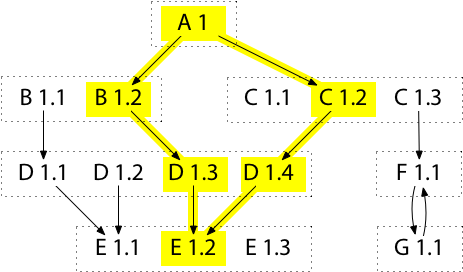

Golang module概述
================

## 前言

>> In the world of software management there exists a dreaded place called “dependency hell.” The bigger your system grows and the more packages you integrate into your software, the more likely you are to find yourself, one day, in this pit of despair.

依赖管理是一个语言必须要解决的问题，而且随着项目依赖量以及复杂程度不断增加会显得更加重要。golang依赖管理发展历史可以归纳如下：

* goinstall(2010.02)：将依赖的代码库下载到本地，并通过import引用这些库
* go get(2011.12)：go get代替goinstall
* godep(2013.09)：godep提供了一个依赖文件，记录所有依赖具体的版本和路径，编译时将依赖下载到workspace中，然后切换到指定版本，并设置GOPATH访问(解决go get没有版本管理的缺陷)
* [gopkg.in](https://labix.org/gopkg.in)(2014.03)：通过import路径中添加版本号来标示不同版本，而实际代码存放于github中，go通过redirect获取代码。例如(import gopkg.in/yaml.v1，实际代码地址为：https://github.com/go-yaml/yaml)
* vendor(2015.06)；Go 1.5版本引入vendor(类似godep)，存放于项目根目录，编译时优先使用vendor目录，之后再去GOPATH，GOROOT目录查找(解决GOPATH无法管控依赖变更和丢失的问题)
* [dep](https://github.com/golang/dep)(2016.08)：dep期望统一Golang依赖管理，虽然提供了兼容其它依赖管理工具的功能，但是本质上还是利用GOPATH和vendor解决依赖管理
* [go module](https://research.swtch.com/vgo-principles)(2018.08)：Go 1.11发布的官方依赖管理解决方案，并最终统一了Go依赖管理(by Russ Cox)。go module以semantic version(语义版本控制)和Minimal Version Selection, MVS(最小版本选择)为核心，相比dep更具稳定性；同时也解决了vendor代码库依赖过于庞大，造成存储浪费的问题

通过如上历史，我们可以看出：go依赖管理的发展历史，其实就是go去google的历史(google内部没有强烈的版本管理需求)，也是典型的社区驱动开发的例子

接下来，我将详细探讨go module的两大核心概念：semantic version(语义化版本)和Minimal Version Selection, MVS(最小版本选择)

## [semantic version](https://semver.org/)

golang使用semantic version来标识package的版本。具体来说：

* MAJOR version when you make incompatible API changes(不兼容的修改)
* MINOR version when you add functionality in a backwards compatible manner(特性添加，版本兼容)
* PATCH version when you make backwards compatible bug fixes(bug修复，版本兼容)


这里，只要模块的主版本号(MAJOR)不变，次版本号(MINOR)以及修订号(PATCH)的变更都不会引起破坏性的变更(breaking change)。这就要求开发人员尽可能按照semantic version发布和管理模块(实际是否遵守以及遵守的程度不能保证，参考Hyrum's Law)

## [Minimal Version Selection](https://research.swtch.com/vgo-mvs)

>> A [versioned Go command](https://research.swtch.com/vgo-intro) must decide which module versions to use in each build. I call this list of modules and versions for use in a given build the *build list*. For stable development, today's build list must also be tomorrow's build list. But then developers must also be allowed to change the build list: to upgrade all modules, to upgrade one module, or to downgrade one module.

>> The version selection problem therefore is to define the meaning of, and to give algorithms implementing, these four operations on build lists:
> 1.Construct the current build list.
> 2.Upgrade all modules to their latest versions.
> 3.Upgrade one module to a specific newer version.
> 4.Downgrade one module to a specific older version.

这里将一次构建(go build)中所依赖模块及其版本列表称为build list，对于一个稳定发展的项目，build list应该尽可能保持不变，同时也允许开发人员修改build list，比如升级或者降级依赖。而依赖管理因此也可以归纳为如下四个操作：

* 构建项目当前build list
* 升级所有依赖模块到它们的最新版本
* 升级某个依赖模块到指定版本
* 将某个依赖模块降级到固定版本

在Minimal version selection之前，Go的选择算法很简单，且提供了 2 种不同的版本选择算法，但都不正确：

第 1 种算法是 `go get` 的默认行为：若你本地有一个版本，则使用此版本，或者下载使用最新的版本。这种模式使用的版本太老：若你已安装了 B 1.1，并执行 `go get` 下载，`go get` 不会更新到 B 1.2，从而可能因为 B 1.1 太老而导致构建失败或有 bug。

第 2 种算法是 `go get -u` 的行为：下载并使用所有模块的最新版本。这种模式可能会因为版本都太新而失败：若你运行 `go get -u` 来下载 A，会正确地更新到 B 1.2。同时也会更新到 C 1.3 和 E 1.3，但这可能不是 A 想要的，因为这些版本可能未经测试，所以可能难以正常工作

这 2 种算法的构建是低保真构建（Low-Fidelity Builds）：虽然都想复现模块 A 的作者所使用的构建，但这些构建都因某些不明确的原因而变得有些偏差。在详细介绍最小版本选择算法后，我们将一探究竟为何最小版本选择算法可以产生高保真的构建：

>> Minimal version selection assumes that each module declares its own dependency requirements: a list of minimum versions of other modules. Modules are assumed to follow the import compatibility rule—packages in any newer version should work as well as older ones—so a dependency requirement gives only a minimum version, never a maximum version or a list of incompatible later versions.

>> Then the definitions of the four operations are:
> 1.To construct the build list for a given target: start the list with the target itself, and then append each requirement's own build list. If a module appears in the list multiple times, keep only the newest version.
> 2.To upgrade all modules to their latest versions: construct the build list, but read each requirement as if it requested the latest module version.
> 3.To upgrade one module to a specific newer version: construct the non-upgraded build list and then append the new module's build list. If a module appears in the list multiple times, keep only the newest version.
> 4.To downgrade one module to a specific older version: rewind the required version of each top-level requirement until that requirement's build list no longer refers to newer versions of the downgraded module.

Minimal version selection也即最小版本选择，如果光看下面的操作可能会很迷惑(或者矛盾)：明明是选择最新的版本(keep only the newest version)，为什么叫最小版本选择？

我对最小版本选择算法中'最小'的理解如下：

* 最小的修改操作
* 最小的需求列表

* 最小的模块版本。这里比较的对象是该模块的最新版本：如果项目需要依赖的模块版本是v1.2，而该模块实际最新的版本是v1.3，那么最小版本选择算法会选取v1.2版本而非v1.3(为了尽可能提高构建的稳定性和重复性)。也即'最小版本'表示项目所需要依赖模块的最小版本号(v1.2)，而不是该模块实际的最小版本号(v1.1)，也并非该模块实际的最大版本号(v1.3)

这里，我们举例子依次对golang module最小版本选择的算法细节进行阐述：

### [Algorithm 1: Construct Build List](https://research.swtch.com/vgo-mvs#algorithm_1)


> > There are two useful (and equivalent) ways to define build list construction: as a recursive process and as a graph traversal.
> >
> > The recursive definition of build list construction is as follows. Construct the rough build list for M by starting an empty list, adding M, and then appending the build list for each of M's requirements. Simplify the rough build list to produce the final build list, by keeping only the newest version of any listed module.

简单来说可以通过图遍历以及递归算法(图递归遍历)来构建依赖列表。从根节点出发依次遍历直接依赖B1.2以及C1.2，然后递归遍历。这样根据初始的依赖关系(指定版本：A1->B1.2，A1->C1.2)，会按照如下路径选取依赖：



首先构建empty build list，然后从根节点出发递归遍历依赖模块获取rough build list，这样rough build list中可能会存在同一个依赖模块的不同版本(如D1.3与D1.4)，通过选取最新版本构建final build list(最终的构建列表一个模块只取一个版本，即这些版本中的最新版)，如下：


### [Algorithm 2. Upgrade All Modules](https://research.swtch.com/vgo-mvs#algorithm_2)

一次性升级所有模块(直接&间接)可能是对构建列表最常见的修改，`go get -u` 就实现了这样的功能。当执行完这个命令后，所有依赖包都将升级为最新版本，如下(Algorithm 1例子基础上进行升级)：


这里面添加了新的模块：E1.3，G1.1，F1.1以及C1.3。新rough list会将新引入的依赖模块和旧的rough模块(黄色模块)进行合并，并从中选取最大版本，最终构建final list(上图红线标识模块)。为了得到上述结果，需添加一些东西到 A 的需求列表中，因为按照正常的构建流程，依赖包不应该包括D1.4和E1.3，而是D1.3和E1.2。这里面就会涉及[Algorithm R. Compute a Minimal Requirement List](https://research.swtch.com/vgo-mvs#algorithm_r)，该算法核心是创建一个能重复构建模块依赖的最小需求列表，也即只保留必须的依赖模块信息(比如直接依赖以及特殊依赖)，并存放于go.mod文件中。比如上述例子中A1的go.mod文件会构建如下：

```bash
module A1
go 1.14
require (
	B1.2
  C1.3
  D1.4 // indirect
  E1.3 // indirect
)
```

可以看到上述go.mod文件中，没有出现F1.1以及G1.1，这是因为F1.1存在于C1.3的go.mod文件中，而G1.1存在于F1.1的go.mod文件中，因此没有必要将这两个模块填写到A1的go.mod文件中；而D1.4和E1.3后面添加了indirect标记，这是因为D1.4和E1.3都不会出现在B1.2，C1.3以及它们的依赖模块对应的go.mod文件中，因此必须添加到模块A1的需求列表中(go需要依据这个列表中提供的依赖以及相应版本信息重复构建这个模块，反过来，如果不将D1.4和E1.3添加到go.mod，那么最终模块A1的依赖构建结果就会是D1.3和E1.2)

另外，这里也可以总结出现indirect标记的情况：

* A1的某个模块没有使用go module(也即该模块没有go.mod文件)，那么必须将该模块的间接依赖记录在A1的需求列表中
* A1对某个间接依赖模块有特殊的版本要求，必须显示指明版本信息(例如上述的D1.4和E1.3)，以便go可以正确构建依赖模块

### [Algorithm 3. Upgrade One Module](https://research.swtch.com/vgo-mvs#algorithm_3)

相比起一次性升级所有模块，比较好的方式是只升级其中一个模块，并尽量少修改构建列表。例如，当我们想升级到C1.3时，我们并不想造成不必要的修改，如升级到E1.3以及D1.4。这个时候我们可以选择只升级某个模块，并执行go get命令如下(Algorithm 1例子基础上进行升级)：

```bash
go get C@1.3
```


当我们升级某个模块时，会在构建图中将指向这个模块的箭头挪向新版本(A1->C1.2挪向A1->C1.3)并递归引入新的依赖模块。例如在升级C1.2->C1.3时，会新引入F1.1以及G1.1模块(对一个模块的升级或者降级可能会引入其他依赖模块)，而新的build rough list(红线)将由旧build rough list(黄色部分)与新模块(C1.3，F1.1以及G1.1)构成，并最终选取其中最大版本合成新的build final list(A1，B1.2，C1.3，D1.4，E1.2，F1.1以及G1.1)

注意最终构建列表中模块D为D1.4而非D1.3，这是因为当升级某个模块时，只会添加箭头，引入新模块，而不会减少箭头，从而删除或者降级某些模块。比如若从 A 至 C 1.3 的新箭头替换了从 A 至 C 1.2 的旧箭头，升级后的构建列表将会丢掉 D 1.4。也即是这种对 C 的升级将导致 D 的降级(降级为D1.3)，这明显是预料之外的，且不是最小修改

一旦我们完成了构建列表的升级，就可运行前面的算法 R 来决定如何升级需求列表(go.mod)。这种情况下，我们最终将以C1.3替换C 1.2，但同时也会添加一个对D1.4的新需求，以避免D的意外降级(因为按照算法1，D1.3才会出现在最终构建列表中)。如下：

```bash
module A1
go 1.14
require (
	B1.2
  C1.3
  D1.4 // indirect
)
```

### [Algorithm 4. Downgrade One Module](https://research.swtch.com/vgo-mvs#algorithm_4)

在升级某个模块后，可能会发现bug并需要降级到某个旧版本。当降级某个模块时，会在构建图中将这个模块的高版本删除，同时回溯删除依赖这些高版本的模块，直到查找到不依赖这些高版本的最新模块版本为止。比如这里我们将D降级到D1.2版本，如下(Algorithm 1例子基础上进行降级)：

```bash
go get D@1.2
```

这里将D降级为D1.2，会先删除D1.3以及D1.4模块，然后回溯删除B1.2以及C1.2模块，最终确定到B1.1以及C1.1版本(它们分别是B和C不依赖>=D1.3模块的最新版本了)，如下：


在确定直接依赖是B1.1以及C1.1之后，会递归将其依赖模块引入，并添加指定版本D1.2，那么按照算法1可以很容易得出构建列表为A1，B1.1，D1.2(D1.1 vs D1.2)，E1.1以及C1.1。同时，为了保证最小修改，其它不需要降级的包我们需要尽可能保留，比如：E1.2。这样，build final list为A1，B1.1，D1.2(D1.1 vs D1.2)，E1.2(E1.1 vs E1.2)以及C1.1

另外，根据算法R，降级操作之后A1模块的需求列表如下：

```bash
module A1
go 1.14
require (
	B1.1
  C1.1
  D1.2 // indirect
  E1.2 // indirect
)
```

这里，如果A1最开始依赖的模块是C1.3而非C1.2，那么C1.3将会在构建图中保留下来(因为C1.3并没有依赖D模块)

## go mod&sum格式

go.mod以及go.sum成对出现在项目根目录中，go.mod负责记录需求列表(用于构建依赖模块)，而go.sum用于记录安全性以及完整性校验，下面依次介绍两种文件格式：

1. go.mod

   * module：代表go模块名，也即被其它模块引用的名称，位于文件第一行
   * require：最小需求列表(依赖模块及其版本信息)
   * replace：通过replace将一个模块的地址转换为其它地址，用于解决某些依赖模块地址发生改变的场景。同时import命令可以无需改变(无侵入)
   * exclude：明确排除一些依赖包中不想导入或者有问题的版本

   ```bash
   module tkestack.io/tke
   
   go 1.12
   
   replace (
           // wait https://github.com/chartmuseum/storage/pull/34 to be merged
           github.com/chartmuseum/storage => github.com/choujimmy/storage v0.5.1-0.20191225102245-210f7683d0a6
           github.com/deislabs/oras => github.com/deislabs/oras v0.8.0
           // wait https://github.com/dexidp/dex/pull/1607 to be merged
           github.com/dexidp/dex => github.com/choujimmy/dex v0.0.0-20191225100859-b1cb4b898bb7
           k8s.io/client-go => k8s.io/client-go v0.17.0
   )
   
   require (
           github.com/AlekSi/pointer v1.1.0
           github.com/Azure/go-autorest v13.3.1+incompatible // indirect
           github.com/Masterminds/semver v1.4.2 // indirect
           github.com/NYTimes/gziphandler v1.1.1 // indirect
           github.com/Nvveen/Gotty v0.0.0-20120604004816-cd527374f1e5 // indirect
           github.com/aws/aws-sdk-go v1.25.7
           github.com/bitly/go-simplejson v0.5.0
           github.com/blang/semver v3.5.1+incompatible
           github.com/casbin/casbin/v2 v2.1.2
           github.com/chartmuseum/storage v0.5.0
           k8s.io/client-go v12.0.0+incompatible
           ...
   )
   ```

2. go.sum

   ```
   <模块> <版本>[/go.mod] <哈希>
   ```

   * 带有/go.mod代表该版本模块的go.mod文件hash值
   * 不带/go.mod代表该版本模块源代码的hash值

   ```bash
   cloud.google.com/go v0.26.0/go.mod h1:aQUYkXzVsufM+DwF1aE+0xfcU+56JwCaLick0ClmMTw=
   cloud.google.com/go v0.34.0/go.mod h1:aQUYkXzVsufM+DwF1aE+0xfcU+56JwCaLick0ClmMTw=
   cloud.google.com/go v0.38.0 h1:ROfEUZz+Gh5pa62DJWXSaonyu3StP6EA6lPEXPI6mCo=
   cloud.google.com/go v0.38.0/go.mod h1:990N+gfupTy94rShfmMCWGDn0LpTmnzTp2qbd1dvSRU=
   cloud.google.com/go v0.41.0 h1:NFvqUTDnSNYPX5oReekmB+D+90jrJIcVImxQ3qrBVgM=
   cloud.google.com/go v0.41.0/go.mod h1:OauMR7DV8fzvZIl2qg6rkaIhD/vmgk4iwEw/h6ercmg=
   contrib.go.opencensus.io/exporter/ocagent v0.4.12/go.mod h1:450APlNTSR6FrvC3CTRqYosuDstRB9un7SOx2k/9ckA=
   github.com/AlekSi/pointer v1.1.0 h1:SSDMPcXD9jSl8FPy9cRzoRaMJtm9g9ggGTxecRUbQoI=
   github.com/AlekSi/pointer v1.1.0/go.mod h1:y7BvfRI3wXPWKXEBhU71nbnIEEZX0QTSB2Bj48UJIZE=
   github.com/Azure/azure-sdk-for-go v16.2.1+incompatible/go.mod h1:9XXNKU+eRnpl9moKnB4QOLf1HestfXbmab5FXxiDBjc=
   github.com/Azure/azure-sdk-for-go v31.1.0+incompatible h1:5SzgnfAvUBdBwNTN23WLfZoCt/rGhLvd7QdCAaFXgY4=
   github.com/Azure/azure-sdk-for-go v31.1.0+incompatible/go.mod h1:9XXNKU+eRnpl9moKnB4QOLf1HestfXbmab5FXxiDBjc=
   github.com/Azure/azure-sdk-for-go v35.0.0+incompatible h1:PkmdmQUmeSdQQ5258f4SyCf2Zcz0w67qztEg37cOR7U=
   github.com/Azure/azure-sdk-for-go v35.0.0+incompatible/go.mod h1:9XXNKU+eRnpl9moKnB4QOLf1HestfXbmab5FXxiDBjc=
   ```

   go.sum文件可以不存在，当go.sum文件不存在时默认会到远程校验数据库进行校验(通过GOSUMDB设置地址)，当然也可以设置为不校验(GONOSUMDB)

## 总结

* 对单个模块的修改可能会连带影响其它模块
* go module构建列表受当前模块构建状态影响
* go build会查找直接依赖模块最新版本进行构建(例如这里的B1.2以及C1.3)
* 最小构建算法中的'最小'代表：最小修改&最小需求列表&依赖模块的最小版本
* 升级某个模块不会引起其它模块的降级或者删除
* 降级某个模块会在构建图中将这个模块的高版本删除，同时回溯删除依赖这些高版本的模块，直到查找到不依赖这些高版本的最新模块版本为止，同时会保留其它不需要降级的包
* go.mod文件出现indirect标记的情况有如下两种：
  * A1的某个模块没有使用go module(也即该模块没有go.mod文件)，那么必须将该模块的间接依赖记录在A1的需求列表中
  * A1对某个间接依赖模块有特殊的版本要求，必须显示指明版本信息(例如上述的D1.4和E1.3)，以便go可以正确构建依赖模块

## 最佳实践

* 尽量不要手动修改go.mod文件，通过go命令来操作go.mod文件
* 尽量遵守semantic version(语义化版本)发布和管理模块
* 通过go build编译项目时，如果在go.mod文件中指定了直接依赖模块版本，则根据最小版本选择算法会下载对应版本；否则go build会默认自动下载直接依赖模块的最新semantic version，若没有semantic version则自动生成标签：`(v0.0.0)-(提交UTC时间戳)-(commit id前12位)`作为版本标识，例如：`github.com/docker/libtrust v0.0.0-20160708172513-aabc10ec26b7`
* 利用go mod tidy进行自动整理操作。该模块会清理需求列表：删除不需要的需求项，添加需要的需求项
* 利用go get升级或者降级某个依赖模块；go get -u升级所有依赖模块(直接以及间接)
* 本地调试：如果本地有依赖模块还未发布，则可以利用如下方法进行调试：
  * replace：将依赖模块修改成本地依赖包地址，这样就可以在本地修改依赖包的同时进行编译调试了(需要注意go.mod文件内容发生修改，注意不要提交)：`replace k8s.io/client-go => ~/go/src/k8s.io/client-go v0.17.0-dirty-fix`
  * vendor：默认情况下go build会忽略vendor目录；当添加-mod=vendor选项，go build会优先查找vendor目录下的依赖模块。因此可以将本地开发的依赖包放置在vendor目录，并将vendor通过.gitignore文件设置在版本控制之外，这样可以满足本地调试的同时不影响版本提交
* 当需要列举本项目所有依赖模块时(包括间接依赖)使用：`go list -m all`；而列举某个依赖模块的所有版本使用：`go list -m -versions xxx`，例如：`go list -m -versions k8s.io/client-go`
* 当一些依赖存在问题时，可以通过`go clean -modcache`清理已下载的依赖文件
* GO111MODULE值含义如下(建议强制开启)：
  * off：强制关闭go module，使用GOPATH
  * on：强制开启go module(建议)
  * auto：如果当前模块在$GOPATH/src中，则不使用go module；如果不存在$GOPATH/src，且存在go.mod文件则使用go module

* 设置GOPROXY为`GOPROXY=https://goproxy.cn,direct`，代表先从代理服务器https://goproxy.cn下载依赖，如果失败(such as 404)则直接从原地址(such as github)下载

## Refs

* [Minimal Version Selection](https://research.swtch.com/vgo-mvs)
* [The Principles of Versioning in Go](https://research.swtch.com/vgo-principles#sat-example)
* [Golang 版本管理系列 翻译 11 篇全](https://github.com/vikyd/note/tree/master/go_and_versioning)

