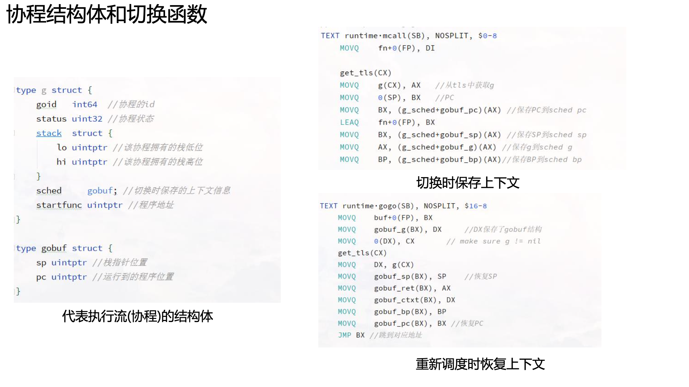
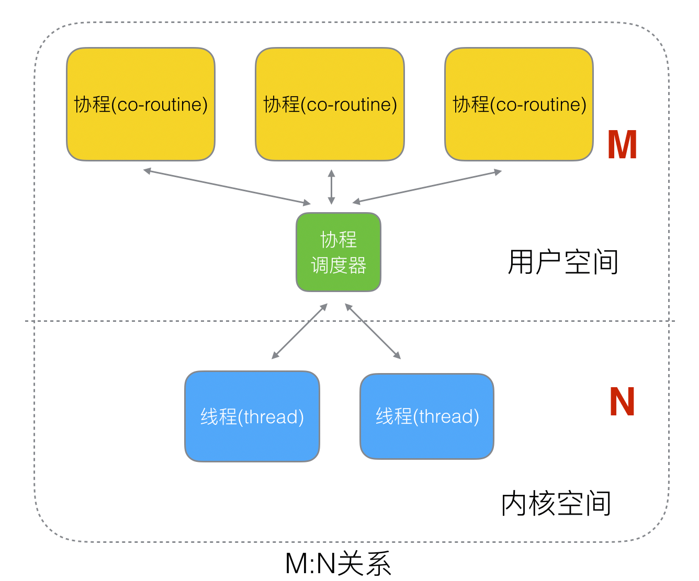
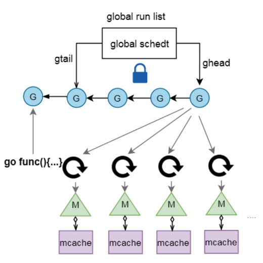
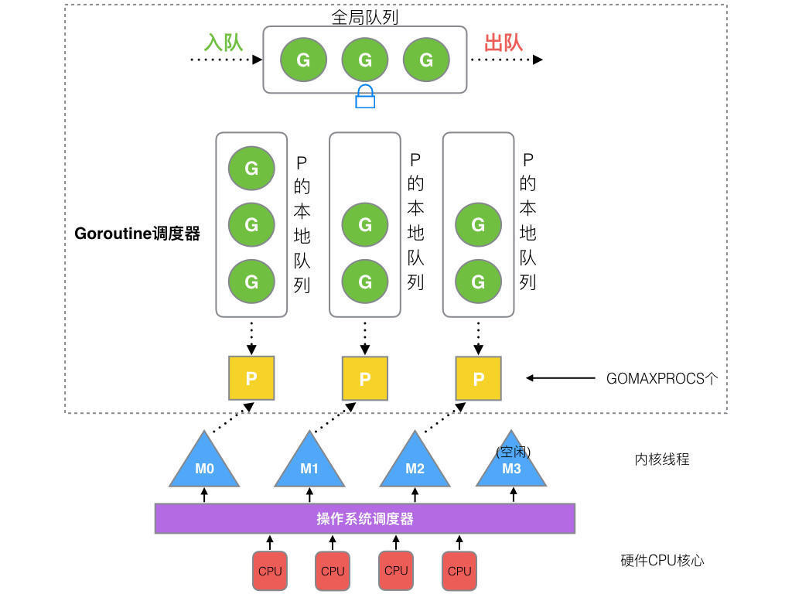

Go GMP调度模型
============

## 前言

这里先介绍一下进程，线程：

* 进程：进程是操作系统分配资源的最小单位，拥有独立的地址空间和系统资源
* 线程：线程是进程的一个实体，是CPU调度和分派的基本单位。一个进程拥有多个线程，各线程拥有属于自己的程序计数器(PC)，一组寄存器，以及堆栈，并共享进程系统资源。虽然线程以及进程调度都会进行系统调用，进行用户态以及内核态切换，但是由于线程资源占用少，因此切换成本小很多

这里给出两者的优劣对比：

* 进程之间的通信需要以通信的方式（Inter Process Communication，IPC)进行；而线程之间的通信更方便，因为同一进程下的线程共享资源(如何处理好线程同步与互斥是编写多线程程序的难点)
* 线程的调度与切换比进程快很多，同时创建一个线程的开销也比进程要小很多
* 多进程程序更健壮，多线程程序只要有一个线程死掉，整个进程也死掉了；而一个进程死掉并不会对另外一个进程造成影响，因为进程之间相互独立

而为了进一步增加共享以及减少切换成本，衍生出了协程。协程实际上是用户态的线程，是比线程更小的执行单元，代表了一个执行流，拥有需要执行的函数地址，以及上下文(程序计数器(PC)以及栈帧(SP)等)

协程与线程之间的对应关系为`M:N`，如下：

协程相比线程，区别如下：

* 协程与线程之间调度是有区别的：线程由CPU调度，是抢占式的；而协程由用户态调度，是协作式的，且一个协程让出CPU后，才执行下一个协程
* 协程切换无需进行系统调用，在内核态与用户态之间来回切换。只需要在用户态保存协程上下文，并加载需要执行的协程上下文即可。因此执行效率高很多，尤其在数量庞大的时候该优势更加明显
* 协程更加轻量级，初始栈KB级，而线程则是MB级

下面将详细分析Go GMP调度模型

## Go GMP调度模型

Go 1.0实现的协程调度模型为GM模型：

注：G代表Go协程Goroutine；而M代表线程

如上所示，该模型中所有待运行的协程都放在一个全局的队列中，多线程从该全局队列中访问协程需要加线程级别的锁，因此该模型也具有如下缺点：

* 调度队列schedt是全局的, 对该队列的操作均需要竞争同一把锁, 导致伸缩性不好
* 新产生的协程会放到全局队列被其它线程运行，局部性差
* 每个线程都有一个memory cache，只有运行Go代码的协程才需要这些cache，阻塞在系统调用上的线程并不需要。而这两者的比例可能高达`1:100`，会造成了很大的内存消耗

针对如上GM调度模型的问题，Go 1.1推出了GMP模型，如下：

## Refs

* [深入浅出Golang Runtime](https://github.com/yifhao/share/blob/master/gopher%20meetup-%E6%B7%B1%E5%85%A5%E6%B5%85%E5%87%BAGolang%20Runtime-yifhao-%E5%88%86%E4%BA%AB%E7%B2%BE%E7%AE%80%E7%89%88.pdf)

