Table of Contents
=================

* [前言](#前言)
* [harbor介绍](#harbor介绍)
* [harbor API无侵入改造](#API无侵入改造)
* [harbor认证&鉴权无侵入改造](#认证鉴权无侵入改造)
* [harbor高可用方案落地](#harbor高可用方案落地)
* [harbor存储方案](#harbor存储方案)
* [harbor高并发压测](#harbor高并发压测)
* [harbor备份还原方案](#harbor备份还原方案)
* [harbor迁移](#harbor迁移)
* [harbor展望](#harbor展望)
* [Refs](#refs)
      
## 前言

腾讯企业云中心使用Harbor作为统一的镜像仓库管理组件，本文主要分享企业云中心在Harbor上的一些实践经验总结……

## harbor介绍

Harbor是目前最流行的开源企业级镜像仓库解决方案。除了原生支持镜像仓库，chart仓库；还支持一些企业用户所迫切需要的一些功能，例如：图形用户界面、完善的认证和鉴权机制、镜像复制、镜像病毒扫描、镜像删除与垃圾回收机制以及RESTFUL API接口等。另外，它也易于部署，目前支持两种部署方式：`Docker-Compose`以及`Helm Chart`

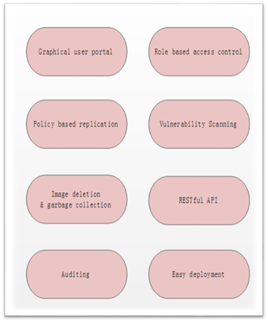

## API无侵入改造

Harbor支持丰富的RESTFUL API接口。企业平台可以调用这些API完成绝大多数的需求，但是随着需求复杂度的增加，这些API就不能完全满足企业的需求了。比如：Harbor只提供`获取指定Project对应的Repository查询接口`，但是企业可能需要`在不指定Project的情况下获取相应查询字段的Repository接口`，类似这种情况下，Harbor API接口就显得不够用了，那么如何适应业务的这些需求？

这里有两种方式进行适配：

* Internal：通过修改Harbor内部代码，修改和添加Harbor API接口，实现API适配
* External：Harbor外部添加一个适配器，所有适配操作通过Adapter来进行，无需修改Harbor

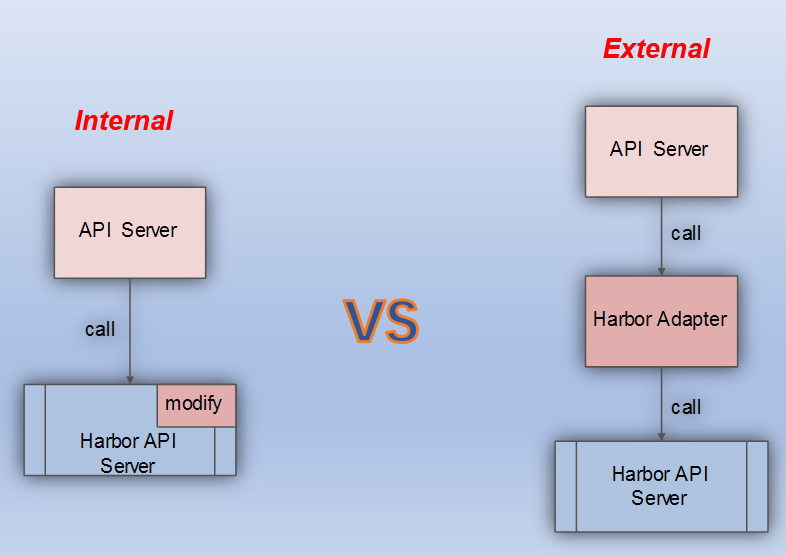

这两种方式各有优缺点：

* Internal
  * 优点：直接，效率高
  * 缺点：修改了Harbor源码，对于Harbor的升级来说不易维护

* External
  * 优点：对Harbor零侵入，易于Harbor的升级维护
  * 缺点：多了一个中转和拼接，效率差；有些添加、修改Harbor原有表结构并对这些结构操作的API不适合这种方式

在对比了这两种方式的优缺点后，我们选择用第二种方式进行适配，原因很简单：在允许一定效率损失的情况下，通过Harbor Adapter无侵入改造Harbor API，对Harbor更加友好，有利于Harbor的升级与维护

## 认证鉴权无侵入改造

Harbor对认证和鉴权支持得比较完善。Harbor主要支持三种认证方式：

* Database(PostgreSQL)——Users are stored in the local database
* LDAP——Under this authentication mode, users whose credentials are stored in an external LDAP or AD server can log in to Harbor directly.
* OIDC Provider——With this authentication mode, regular user will login to Harbor Portal via SSO flow.

Harbor的鉴权也即`RBAC`是基于`Project`的，用户对`Project`可以有不同的角色并对应不同的权限，例如：

* Guest——读权限，可以下载镜像
* Developer——读写权限，可以下载和上传镜像
* Admin——管理权限，除了下载和上次镜像外，还具有管理该`Project`下用户的权限

虽然Harbor支持完善的认证和鉴权机制，但是企业内部一般都有自己定制的认证和鉴权逻辑，而这些特殊逻辑是无法通过Harbor现有的方式来兼容的，那么问题来了：如何在不修改Harbor的情况下适配企业级的认证&鉴权？

这里我们分两部分对Harbor认证&鉴权无侵入改造方案进行介绍：

* API无侵入认证&鉴权

将`认证&鉴权`逻辑从Harbor内部抽取到外部，由上层完成。也即：产品平台根据`认证中心`进行`认证和鉴权`，权限通过后，通过`admin`账号调用`Harbor API`执行相关操作，执行成功后，将相应的`RBAC`信息写入数据库：
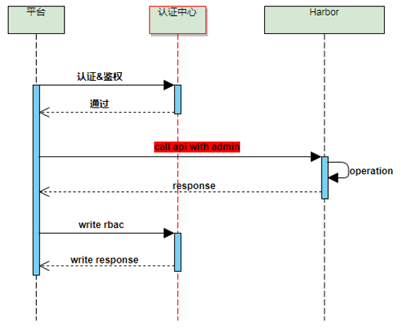

* Docker cmd无侵入认证&鉴权

这里`Docker cmd`的无侵入改造方案利用了`Docker Token`的六次握手协议，如下：
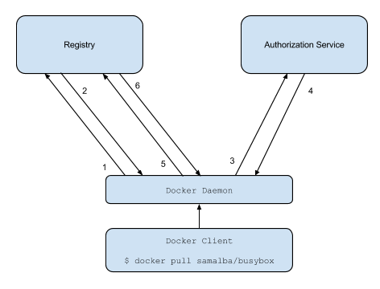
通过配置外部认证服务器`auth server`，走`认证中心`进行统一的`认证和鉴权`，并产生相应的`token`给Docker，最终实现`Docker cmd无侵入认证&鉴权`方案：
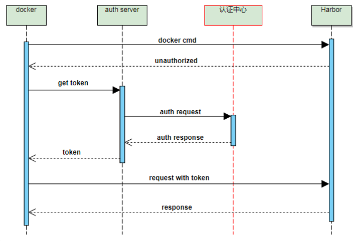

这里在讲完`harbor API无侵入改造`和`harbor认证&鉴权 无侵入改造`的方案后，我们还需要再补充说明一点：虽然上述方案可以满足企业二次定制的一般情况，但是如果遇到无法通过非侵入改造的情况，那么就只能修改Harbor了，这里保留一个原则即可：尽量不改动Harbor内部逻辑，实在不行那也必须对Harbor进行代码定制

## harbor高可用方案落地

我们将Harbor组件按照有无状态分为两部分，针对这两部分分别设计高可用策略：

* 无状态组件：可直接将实例数目设置>1来实现高可用
* 有状态组件：需要专门研究高可用方案

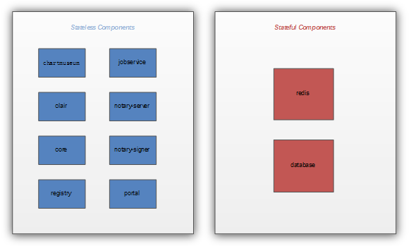

这里我们对有状态组件：`Redis`进行展开说明。由于`Redis`在Harbor中只是起到缓存作用，数据量少，比较合适用`Redis主从模式`，所以我们需要对这种模式进行高可用适配。按照官方推荐的`哨兵方式`，我们部署了`Redis一主两从+三哨兵`的高可用集群：

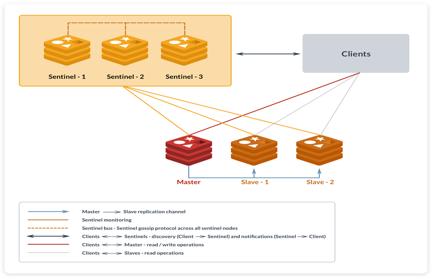

但是这里还存在一个问题：由于Harbor并不支持`Redis哨兵协议`，为了让Harbor更加透明地访问`Redis`，需要部署`Redis`的智能代理服务：

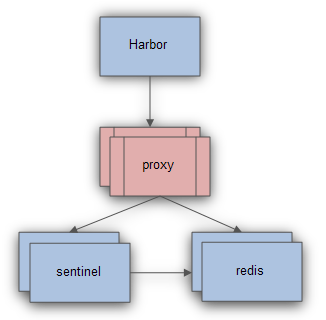

## harbor存储方案

我们使用`Ceph`作为Harbor持久化存储后端，在企业生产环境中Harbor对`Ceph`存储的使用也进行了一次次的演变：`Ceph RBD`->`Ceph FS`->`Ceph FS+RGW`混合存储，如下：

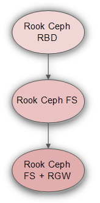

我们先对比一下`Ceph`提供的三种存储服务的优缺点：

* Ceph RBD
  * 优点：I/O带宽高，读写延迟低；稳定性好
  * 缺点：多读单写，不支持多节点挂载

* Ceph FS
  * 优点：多读多写，支持多节点挂载
  * 缺点：I/O带宽较低，读写延迟较高，性能较差；稳定性较差

* Ceph RGW
  * 优点：稳定性和性能均介于`RBD`与`CephFS`之间且支持`多读多写`
  * 缺点：对象存储，需要单独的客户端支持

在对比完优缺点后，我们可以看出：由于`RBD`不支持`多读多写`，无法通过`RBD`实现Harbor高可用，所以这里我们弃用；`Ceph FS`和`Ceph RGW`均支持`多读多写`，这里我们根据Harbor组件对`Ceph RGW`的支持与否进行选择，对存储性能要求比较高而且本身支持`Ceph RGW`存储的组件我们使用对象存储，其它组件我们使用Ceph 文件系统：

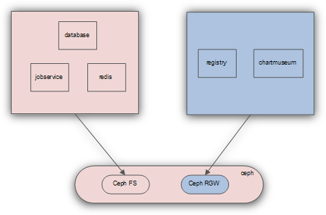

## harbor高并发压测

在企业生产环境中使用Harbor，我们需要对Harbor进行高并发压测，来得出Harbor生产环境的性能数据。这里我们用三台压测机(Docker)，一台被测机(Harbor)进行压测，所有机器均使用万兆网卡且忽略CPU、内存、I/0瓶颈等因素([压测方案](https://github.com/duyanghao/registry-pressure-measurement-tools))：

我们分别针对三种存储：`Ceph FS`，`Rook Ceph FS`以及`Rook Ceph RGW`进行压测对比：

* 1、Ceph FS

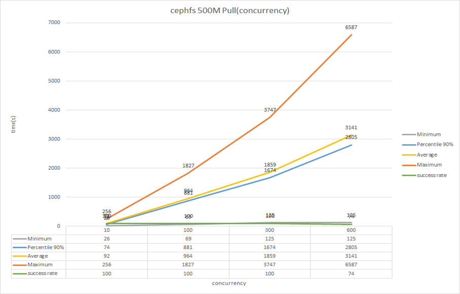

* 2、Rook Ceph FS

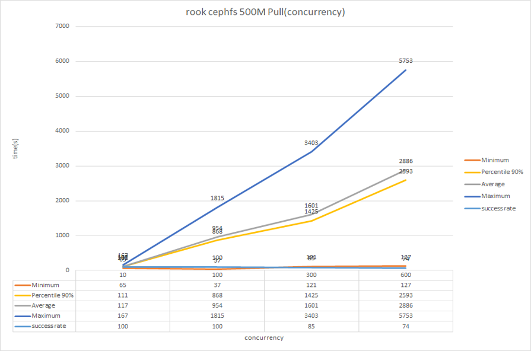

* 3、Rook Ceph RGW

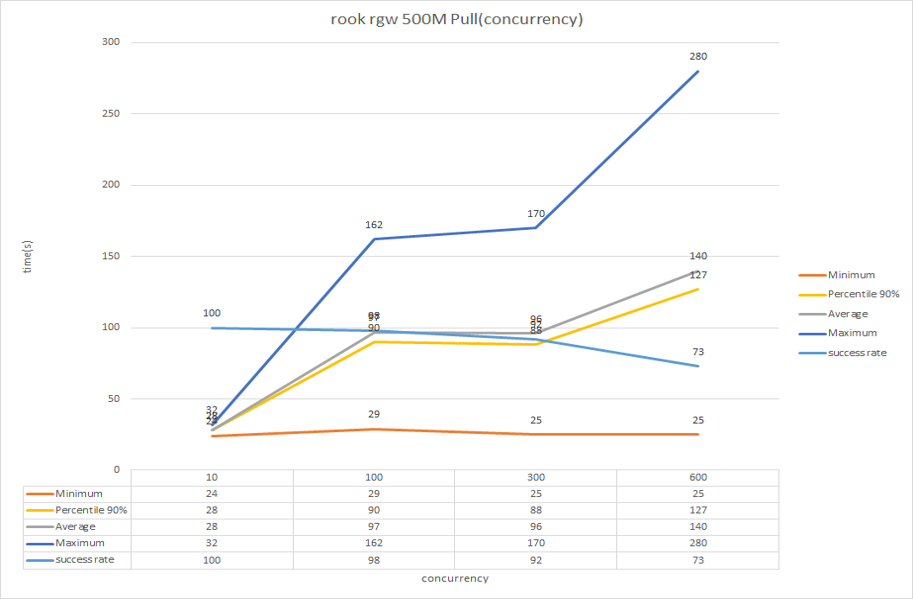

从压测数据可以看出：

* 随着并发量的增加，三种存储平均拉取时间均增加且成功率越来越低
* 拉取性能：Rook RGW>>Rook CephFS~=CephFS

对于Harbor对象存储的显著性能提升这里除了对象存储本身的性能要高于文件系统外，还存在如下两个原因：

* Harbor在切换为对象存储后，采用重定向协议，所以数据不需要在Harbor这里进行中转，节省了中转时间和资源
* 流量和并发瓶颈从Harbor切到Ceph RGW

综合这些原因导致Harbor在切换`Ceph RGW`后性能有了质的飞跃

## harbor备份还原方案

最后我们讨论一下Harbor的备份还原(这里简称为`BUR`)方案。在讨论`BUR`之前，我们先回顾一下Harbor的存储选型：`Ceph FS+RGW`，如下：

这里我们针对该存储选型定制备份还原方案。由于采用的是混合方案，所以我们需要分别对文件系统和对象存储进行备份还原：

* 1、Ceph 文件系统BUR
  * Ceph 文件系统备份——对于CephFS，Harbor中的应用数据保存在`pv`中，而我们的部署场景实际上是落在CephFS路径上。因此要备份Harbor应用数据只需要备份每个`pv`对应的CephFS目录即可
    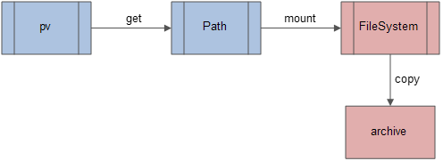
  * Ceph 文件系统还原——还原是备份的逆过程，只需要将备份的应用数据写入到`pv`对应的CephFS路径上即可
    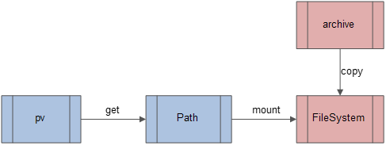

* 2、Ceph 对象存储BUR

对于`Ceph RGW`，Harbor中的应用数据保存在`BUCKET`中，因此要备份Harbor应用数据只需要备份`BUCKET`即可，还原同理（这里我们用`s3cmd`工具进行数据同步）：
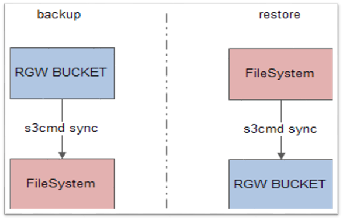
对于`Ceph RGW`的BUR，如果单纯`s3cmd`同步整个应用目录，则比较慢；需要对应用目录进行数据切分，并发同步数据分区（[registry-rgw-BUR-tools](https://github.com/duyanghao/registry-rgw-BUR-tools)）：
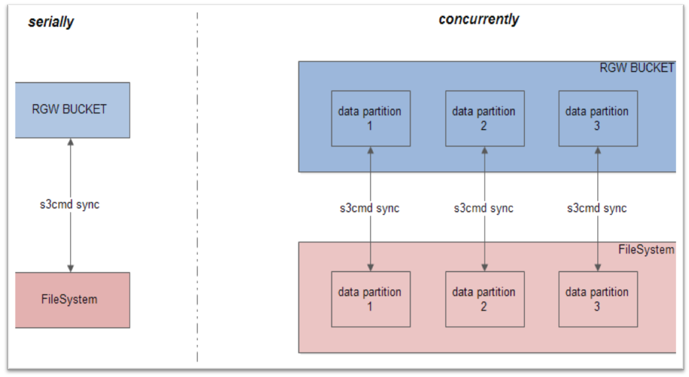

## harbor迁移

由`Harbor备份还原`衍生到一个话题：`Harbor迁移`。可以认为：迁移是一种特殊的还原场景，如下：

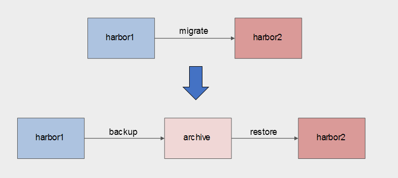

## harbor展望

未来`镜像P2P方案`是`Harbor`的主要工作方向，目前`Harbor`还不支持该方案，希望不久的将来Harbor将支持`镜像P2P`特性来实现更大程度的并发拉取性能。

## Refs

* [K8s&云原生技术开放日-Harbor企业级实践](https://cloud.tencent.com/developer/salon/salon-1151)

