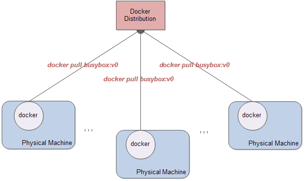
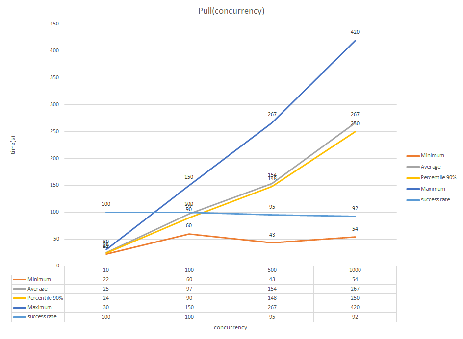

Table of Contents
=================

* [前言](#前言)
* [压测方案](#压测方案)
  * [Multiple Machines](#multiple-machines)
  * [Few Machines](#few-machines)
* [Few Machines压测步骤](#压测步骤)
* [总结](#总结)
* [Refs](#refs)

## 前言

[Docker Distribution](https://github.com/docker/distribution)也即镜像仓库是用于存储、分发、管理镜像的文件服务器。在整个Docker容器生态圈是相对底层的存在，虽然不太引起注意，但是对于Docker来说起着举足轻重的作用。所有Docker的应用发布，测试，部署以及`DevOps CICD`等都需要镜像仓库，而这里面镜像仓库的性能便决定了上层功能的时延，所以需要在生产环境针对镜像仓库进行高并发压测，并针对性的进行性能调优。本文针对镜像仓库的压测方案进行一个探索和总结……

## 压测方案

镜像仓库的压测方案针对不同的场景一般有两种：

### Multiple Machines

传统的压测方案是累机器。简单的说就是：比如要测试500个docker并发拉取镜像的性能，我们就需要500台同样配置的机器（最好是物理机），然后每台机器上面装有docker，利用`expect`或者`ansible`工具在这些机器上同时执行`docker pull`命令拉取镜像。另外，如果想要测试出镜像仓库的渐变性能，可以先将并发数设置为10，然后逐渐增加并发数，最后到500。如图：

这种方案的优缺点如下：

* Pros：具有天然的隔离性，由于底层是物理机，所以各个docker之间不会共享资源（磁盘、网络，CPU以及内存），高并发测试数据更加真实
* Cons：需要大量机器，随着测试需求的增加，机器数量也必须增加，一般中小企业是满足不了这种需求的，而且即便满足也不会允许用这么多机器来干一件事情（空闲率太高）

### Few Machines

更加有效率的测试方案是利用少量的机器（比如3到5台物理机）进行压测，这种方案则更加复杂和具有技巧性一些：首先在三台物理机上装docker，然后每个docker跑100个`docker pull`，三台机器则总的并发数为300，依次类推通过增加每台机器`docker pull`并发来达到总并发量的增加：

这种方案咋看好像没什么问题，但是仔细想想就会发现有如下两个问题：

* 1、由于镜像是分层的，同一台物理机跑多个`docker pull`很有可能会拉取相同的镜像层，怎么解决让docker**重复拉取**镜像层的问题（注意是**重复拉取**）？
* 2、同一台物理机跑多个`docker pull`，那么资源是否会不够，即便忽略CPU、内存、IO的限制，网络带宽也会成为这台机器的瓶颈，那么最后压测数据是否真的能体现出镜像仓库的压测瓶颈（到底是压测机的瓶颈还是镜像仓库的瓶颈）？
  
现在逐一解决这两个问题：

* 1、怎么解决让docker**重复拉取**镜像层的问题（注意是**重复拉取**）？

如果和`Multiple Machines`方案一样，**让所有docker拉取同一个镜像**，则一台物理机上docker实质只会拉取一次镜像，后面的拉取会重复利用第一次拉取的镜像层数据。所以这里我们要利用Dockerfile构建出docker必须重复拉取的不同镜像，如果我们要测试500的并发，则我们必须构建出docker会重复拉取的500个不同镜像。这里可以用同一份Dockerfile构建出任意多个docker必须重复拉取的镜像（不展开介绍方案），这样就解决了重复拉取镜像，实现`docker pull`真正意义上并发的问题
* 2、何解决网路瓶颈问题？

试想一下，如果测试机（docker）是千兆网卡，被测机（docker distribution）是万兆网卡，则三台物理机加起来带宽是3千兆，没有达到被测机的网络瓶颈，所以很可能最终的性能瓶颈是由测试机造成的。那这里我们要解决这个问题其实很简单，就是让测试机和被测机都使用万兆网卡，这样，即便是有网络瓶颈也是被测机造成的，而不是压测机导致的，因为现在每台压测机的带宽都和被测机一样了

这种方案也有其优缺点：
* Pros：只需要少量机器就可以进行压测，节省了资源
* Cons：相对麻烦，而且由于`docker pull`进程需要共享资源，导致该方案与底层物理机的配置强相关，同时docker本身对`docker pull`并发的支持也值得商榷

## Few Machines压测步骤

由于`Multiple Machines`测试方案相对简单，而且容易理解。这里我只对`Few Machines`压测方案步骤进行一个概述，参考[registry-pressure-measurement-tools](https://github.com/duyanghao/registry-pressure-measurement-tools)：

* 1、利用dockerfile构建指定数目的镜像（必须重复拉取）
* 2、将构建好的镜像push到镜像仓库
* 3、删除本地所有镜像
* 4、执行压测：每个docker同时执行指定数目的`docker pull`命令，比如第一个docker拉取：`buxybox:v0`——`buxybox:v99`镜像，第二个docker拉取：`buxybox:v100`——`buxybox:v199`镜像，依次类推
* 5、每次压测完毕，检查5个拉取指标：最小时间、平均时间、前90%的平均时间，最大时间以及成功率

压测图表如下：

## 总结

利用`Few Machines`方案可以在少量机器的情况下达到近似`Multiple Machines`的压测效果，虽然这种方案还存在质疑：由于`docker pull`进程需要共享资源，导致该方案与底层物理机的配置强相关，同时docker本身对`docker pull`并发的支持也值得商榷，但是不失为一种有效且实用的方案

## Refs

* [K8s&云原生技术开放日-Harbor企业级实践](https://cloud.tencent.com/developer/salon/salon-1151)
* [registry-pressure-measurement-tools](https://github.com/duyanghao/registry-pressure-measurement-tools)