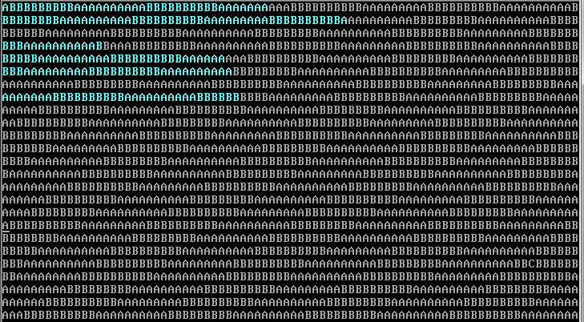

Table of Contents
=================

* [前言](#前言)
* [源码解析](#源码解析)
* [Refs](#refs)

## 前言

内核是一个运维开发人员进阶的必要知识，许多高层应用都利用了内核的一些特性，包括最近几年特别流行的Docker技术，要理解这些高层应用技术，则必须熟悉内核。这里给出一个我在学习内核的过程中遇到的一个很经典的内核demo例子，作为内核的入门，个人认为是非常有用的！

对应项目：[duyanghao/DemoOs](https://github.com/duyanghao/DemoOs)

直接通过git将代码拉下来，下面是该内核代码在Linux 0.12环境下编译后在Bochs下的模拟执行图： 



这个Demo OS主要实现的功能就如大家看到的一样，有两个任务（不能说是进程，因为并没有PCB结构），分别打印字符A和B（利用系统调用中断0x80）。由定时中断（每10ms发生一次）切换两个任务，这样每个任务大约可以打印10个字符，轮流交替（每打印一个字符则循环等待到1ms时间）。

虽说这个OS小，但是X86 CPU体系结构的基本特性都应用到了。其中包括GDT、LDT、IDT、BIOS、描述符（中断门和陷阱门）、选择符、内核态、用户态、实模式、保护模式以及中断等。

## 源码解析

下面根据源码详细说明原理：

项目中主要是三个文件，Makefile、boot.s、head.s。其中boot.s为as86汇编编写的引导启动程序，head.s为GUN as汇编语言编制的内核程序。

boot.s：

```as
!	boot.s
!
! It then loads the system at 0x10000, using BIOS interrupts. Thereafter
! it disables all interrupts, changes to protected mode, and calls the 

BOOTSEG = 0x07c0
SYSSEG  = 0x1000			! system loaded at 0x10000 (65536).
SYSLEN  = 17				! sectors occupied.

entry start
start:
	jmpi	go,#BOOTSEG
go:	mov	ax,cs
	mov	ds,ax
	mov	ss,ax
	mov	sp,#0x400		! arbitrary value >>512

! ok, we've written the message, now
load_system:
	mov	dx,#0x0000
	mov	cx,#0x0002
	mov	ax,#SYSSEG
	mov	es,ax
	xor	bx,bx
	mov	ax,#0x200+SYSLEN
	int 	0x13
	jnc	ok_load
die:	jmp	die

! now we want to move to protected mode ...
ok_load:
	cli			! no interrupts allowed !
	mov	ax, #SYSSEG
	mov	ds, ax
	xor	ax, ax
	mov	es, ax
	mov	cx, #0x2000
	sub	si,si
	sub	di,di
	rep
	movw
	mov	ax, #BOOTSEG
	mov	ds, ax
	lidt	idt_48		! load idt with 0,0
	lgdt	gdt_48		! load gdt with whatever appropriate

! absolute address 0x00000, in 32-bit protected mode.
	mov	ax,#0x0001	! protected mode (PE) bit
	lmsw	ax		! This is it!
	jmpi	0,8		! jmp offset 0 of segment 8 (cs)

gdt:	.word	0,0,0,0		! dummy

	.word	0x07FF		! 8Mb - limit=2047 (2048*4096=8Mb)
	.word	0x0000		! base address=0x00000
	.word	0x9A00		! code read/exec
	.word	0x00C0		! granularity=4096, 386

	.word	0x07FF		! 8Mb - limit=2047 (2048*4096=8Mb)
	.word	0x0000		! base address=0x00000
	.word	0x9200		! data read/write
	.word	0x00C0		! granularity=4096, 386

idt_48: .word	0		! idt limit=0
	.word	0,0		! idt base=0L
gdt_48: .word	0x7ff		! gdt limit=2048, 256 GDT entries
	.word	0x7c00+gdt,0	! gdt base = 07xxx
.org 510
	.word   0xAA55
```

boot.s编译出的代码共512B，刚好一个扇区长度，将被存放于软盘映像文件的第一个扇区。PC加电启动后，ROM BIOS中的程序会把启动盘上第一个扇区加载到物理内存0x7c00（31KB）位置开始处，并把执行权转移到0x7c00处开始运行boot程序代码。

```as
jmpi	go,#BOOTSEG
```

段间跳转至0x7c0:go处，当程序刚开始运行时所有段寄存器值均为0，且CPU处于实模式（使用16位段寄存器）。该跳转语句会把cs寄存器加载到0x7co（原为0），ip寄存器加载为go偏移处（符号绑定）。

```as
go:	mov	ax,cs
	mov	ds,ax
	mov	ss,ax
	mov	sp,#0x400		! arbitrary value >>512
```

让ds、ss都指向0x7c0段（这里并没有用到堆栈，所以不设置ss和sp也是没有问题的！）

```as
! ok, we've written the message, now
load_system:
	mov	dx,#0x0000
	mov	cx,#0x0002
	mov	ax,#SYSSEG
	mov	es,ax
	xor	bx,bx
	mov	ax,#0x200+SYSLEN
	int 	0x13
	jnc	ok_load
die:	jmp	die
```

利用BIOS中断int 0x13功能2从启动盘读取head代码。

DH - 磁头号； DL - 驱动器号； CH - 10位磁盘号低8号；CL - 位7、6是磁盘号高2位，位5~0起始扇区号（从1计）。

ES:BX - 读入缓冲区位置（0x1000:0x0000）

AH - 读扇区功能号，AL - 需读的扇区数（17）内核代码不超过17个扇区长度

```as
	jnc	ok_load
die:	jmp	die
```

若没有发生错误则跳转继续运行，否则死循环！

```as
! now we want to move to protected mode ...
ok_load:
	cli			! no interrupts allowed !
	mov	ax, #SYSSEG
	mov	ds, ax
	xor	ax, ax
	mov	es, ax
	mov	cx, #0x2000
	sub	si,si
	sub	di,di
	rep
	movw
```

把内核代码移动到内存0开始处，共移动8KB（内核长度不超过8KB）

cli为关中断，移动开始位置DS:SI = 0x1000:0，目地位置ES:DI = 0x0:0，设置共移动4K次，每次一个字（word 2Bytes）。

```as
mov	ax, #BOOTSEG
mov	ds, ax
lidt	idt_48		! load idt with 0,0
lgdt	gdt_48		! load gdt with whatever appropriate
```

加载IDTR、GDTR（6字节操作数：2字节表长度，4字节线性基地址）如下：

```as
idt_48: .word	0		! idt limit=0
	.word	0,0		! idt base=0L
gdt_48: .word	0x7ff		! gdt limit=2048, 256 GDT entries
	.word	0x7c00+gdt,0	! gdt base = 07xxx
```

由于这里没有用到IDT，所以长度置为0。同时GDT长度设置为2^11-1，也即0x7ff！线性基地址设置为gdt+0x7c00（为后续切换到保护模式做准备）

```as
! absolute address 0x00000, in 32-bit protected mode.
	mov	ax,#0x0001	! protected mode (PE) bit
	lmsw	ax		! This is it!
	jmpi	0,8		! jmp offset 0 of segment 8 (cs)
```

设置控制寄存器CR0（即机器状态字），进入保护模式（在CR0中设置保护模式标志PE（位0）），然后跳转至段选择符（值为8）指定的段中，偏移0处。其中GDT表如下：

```as
gdt:	.word	0,0,0,0		! dummy

	.word	0x07FF		! 8Mb - limit=2047 (2048*4096=8Mb)
	.word	0x0000		! base address=0x00000
	.word	0x9A00		! code read/exec
	.word	0x00C0		! granularity=4096, 386

	.word	0x07FF		! 8Mb - limit=2047 (2048*4096=8Mb)
	.word	0x0000		! base address=0x00000
	.word	0x9200		! data read/write
	.word	0x00C0		! granularity=4096, 386
```

其中包含3个段描述符。第一个不用，另2个是代码和数据段描述符。每个描述符占用8Bytes。X86采用Little-ending存储模型。其中代码段描述符中数据的含义如下：

段限长值为8M，线性基地址为0x00000，是代码段，可读/执行，段属性颗粒度为4KB 。数据段描述符可依此类推！

```as
.org 510
	.word   0xAA55
```

偏移到510字节处，并设置引导扇区有效标志，必须处于引导扇区最后2字节处！

这样boot.s就分析完了！总结引导代码作用就是将内核代码从软盘或者映像文件中拷贝到内存中去（这里解释一下为什么分两次copy内核代码，由于加载操作需要使用ROM BIOS提供的中断过程，而BIOS使用的中断向量表正处于内存0开始处，并且在内存1KB开始处是BIOS程序使用的数据区，所以若直接把head代码加载到内存0处将使得BIOS中断过程不能正常运行，而将代码拷贝到内存0处也是为了使程序更加简单）

下面分析head.s代码：

```as
#  head.s contains the 32-bit startup code.
#  Two L3 task multitasking. The code of tasks are in kernel area, 
#  just like the Linux. The kernel code is located at 0x10000. 
SCRN_SEL	= 0x18
TSS0_SEL	= 0x20
LDT0_SEL	= 0x28
TSS1_SEL	= 0X30
LDT1_SEL	= 0x38

.text
startup_32:
	movl $0x10,%eax
	mov %ax,%ds
#	mov %ax,%es
	lss init_stack,%esp

# setup base fields of descriptors.
	call setup_idt
	call setup_gdt
	movl $0x10,%eax		# reload all the segment registers
	mov %ax,%ds		# after changing gdt. 
	mov %ax,%es
	mov %ax,%fs
	mov %ax,%gs
	lss init_stack,%esp

# setup up timer 8253 chip.
	movb $0x36, %al
	movl $0x43, %edx
	outb %al, %dx
	movl $11930, %eax        # timer frequency 100 HZ 
	movl $0x40, %edx
	outb %al, %dx
	movb %ah, %al
	outb %al, %dx

# setup timer & system call interrupt descriptors.
	movl $0x00080000, %eax	
	movw $timer_interrupt, %ax
	movw $0x8E00, %dx
	movl $0x08, %ecx              # The PC default timer int.
	lea idt(,%ecx,8), %esi
	movl %eax,(%esi) 
	movl %edx,4(%esi)
	movw $system_interrupt, %ax
	movw $0xef00, %dx
	movl $0x80, %ecx
	lea idt(,%ecx,8), %esi
	movl %eax,(%esi) 
	movl %edx,4(%esi)

# unmask the timer interrupt.
#	movl $0x21, %edx
#	inb %dx, %al
#	andb $0xfe, %al
#	outb %al, %dx

# Move to user mode (task 0)
	pushfl
	andl $0xffffbfff, (%esp)
	popfl
	movl $TSS0_SEL, %eax
	ltr %ax
	movl $LDT0_SEL, %eax
	lldt %ax 
	movl $0, current
	sti
	pushl $0x17
	pushl $init_stack
	pushfl
	pushl $0x0f
	pushl $task0
	iret

/****************************************/
setup_gdt:
	lgdt lgdt_opcode
	ret

setup_idt:
	lea ignore_int,%edx
	movl $0x00080000,%eax
	movw %dx,%ax		/* selector = 0x0008 = cs */
	movw $0x8E00,%dx	/* interrupt gate - dpl=0, present */
	lea idt,%edi
	mov $256,%ecx
rp_sidt:
	movl %eax,(%edi)
	movl %edx,4(%edi)
	addl $8,%edi
	dec %ecx
	jne rp_sidt
	lidt lidt_opcode
	ret

# -----------------------------------
write_char:
	push %gs
	pushl %ebx
#	pushl %eax
	mov $SCRN_SEL, %ebx
	mov %bx, %gs
	movl scr_loc, %bx
	shl $1, %ebx
	movb %al, %gs:(%ebx)
	shr $1, %ebx
	incl %ebx
	cmpl $2000, %ebx
	jb 1f
	movl $0, %ebx
1:	movl %ebx, scr_loc	
#	popl %eax
	popl %ebx
	pop %gs
	ret

/***********************************************/
/* This is the default interrupt "handler" :-) */
.align 2
ignore_int:
	push %ds
	pushl %eax
	movl $0x10, %eax
	mov %ax, %ds
	movl $67, %eax            /* print 'C' */
	call write_char
	popl %eax
	pop %ds
	iret

/* Timer interrupt handler */ 
.align 2
timer_interrupt:
	push %ds
	pushl %eax
	movl $0x10, %eax
	mov %ax, %ds
	movb $0x20, %al
	outb %al, $0x20
	movl $1, %eax
	cmpl %eax, current
	je 1f
	movl %eax, current
	ljmp $TSS1_SEL, $0
	jmp 2f
1:	movl $0, current
	ljmp $TSS0_SEL, $0
2:	popl %eax
	pop %ds
	iret

/* system call handler */
.align 2
system_interrupt:
	push %ds
	pushl %edx
	pushl %ecx
	pushl %ebx
	pushl %eax
	movl $0x10, %edx
	mov %dx, %ds
	call write_char
	popl %eax
	popl %ebx
	popl %ecx
	popl %edx
	pop %ds
	iret

/*********************************************/
current:.long 0
scr_loc:.long 0

.align 2
lidt_opcode:
	.word 256*8-1		# idt contains 256 entries
	.long idt		# This will be rewrite by code. 
lgdt_opcode:
	.word (end_gdt-gdt)-1	# so does gdt 
	.long gdt		# This will be rewrite by code.

	.align 3
idt:	.fill 256,8,0		# idt is uninitialized

gdt:	.quad 0x0000000000000000	/* NULL descriptor */
	.quad 0x00c09a00000007ff	/* 8Mb 0x08, base = 0x00000 */
	.quad 0x00c09200000007ff	/* 8Mb 0x10 */
	.quad 0x00c0920b80000002	/* screen 0x18 - for display */

	.word 0x0068, tss0, 0xe900, 0x0	# TSS0 descr 0x20
	.word 0x0040, ldt0, 0xe200, 0x0	# LDT0 descr 0x28
	.word 0x0068, tss1, 0xe900, 0x0	# TSS1 descr 0x30
	.word 0x0040, ldt1, 0xe200, 0x0	# LDT1 descr 0x38
end_gdt:
	.fill 128,4,0
init_stack:                          # Will be used as user stack for task0.
	.long init_stack
	.word 0x10

/*************************************/
.align 3
ldt0:	.quad 0x0000000000000000
	.quad 0x00c0fa00000003ff	# 0x0f, base = 0x00000
	.quad 0x00c0f200000003ff	# 0x17

tss0:	.long 0 			/* back link */
	.long krn_stk0, 0x10		/* esp0, ss0 */
	.long 0, 0, 0, 0, 0		/* esp1, ss1, esp2, ss2, cr3 */
	.long 0, 0, 0, 0, 0		/* eip, eflags, eax, ecx, edx */
	.long 0, 0, 0, 0, 0		/* ebx esp, ebp, esi, edi */
	.long 0, 0, 0, 0, 0, 0 		/* es, cs, ss, ds, fs, gs */
	.long LDT0_SEL, 0x8000000	/* ldt, trace bitmap */

	.fill 128,4,0
krn_stk0:
#	.long 0

/************************************/
.align 3
ldt1:	.quad 0x0000000000000000
	.quad 0x00c0fa00000003ff	# 0x0f, base = 0x00000
	.quad 0x00c0f200000003ff	# 0x17

tss1:	.long 0 			/* back link */
	.long krn_stk1, 0x10		/* esp0, ss0 */
	.long 0, 0, 0, 0, 0		/* esp1, ss1, esp2, ss2, cr3 */
	.long task1, 0x200		/* eip, eflags */
	.long 0, 0, 0, 0		/* eax, ecx, edx, ebx */
	.long usr_stk1, 0, 0, 0		/* esp, ebp, esi, edi */
	.long 0x17,0x0f,0x17,0x17,0x17,0x17 /* es, cs, ss, ds, fs, gs */
	.long LDT1_SEL, 0x8000000	/* ldt, trace bitmap */

	.fill 128,4,0
krn_stk1:

/************************************/
task0:
	movl $0x17, %eax
	movw %ax, %ds
	movl $65, %al              /* print 'A' */
	int $0x80
	movl $0xfff, %ecx
1:	loop 1b
	jmp task0 

task1:
	movl $0x17, %eax
	movw %ax, %ds
	movl $66, %al              /* print 'B' */
	int $0x80
	movl $0xfff, %ecx
1:	loop 1b
	jmp task1

	.fill 128,4,0 
usr_stk1:
```

head.s是内核代码，包含32位保护模式初始化设置代码、时钟中断代码、系统调用中断代码和两个任务的代码。在初始化完成之后程序移动到任务0开始执行，并在时钟中断控制下进行任务0和1之间的切换操作。

```as
#  head.s contains the 32-bit startup code.
#  Two L3 task multitasking. The code of tasks are in kernel area, 
#  just like the Linux. The kernel code is located at 0x10000. 
SCRN_SEL	= 0x18
TSS0_SEL	= 0x20
LDT0_SEL	= 0x28
TSS1_SEL	= 0X30
LDT1_SEL	= 0x38
```

分别表示屏幕显示内存段选择符，任务0的TSS段选择符，任务0的LDT选择符，任务1的TSS段选择符，任务1的LDT选择符！

```as
.text
startup_32:
	movl $0x10,%eax
	mov %ax,%ds
#	mov %ax,%es
	lss init_stack,%esp
```

设置数据段选择符为0x10，存入ds，并设置堆栈，如下：

```as
	.fill 128,4,0
init_stack:                          # Will be used as user stack for task0.
	.long init_stack
	.word 0x10
```

ss为0x10，esp为init_stack偏移处

```as
# setup base fields of descriptors.
	call setup_idt
	call setup_gdt
	movl $0x10,%eax		# reload all the segment registers
	mov %ax,%ds		# after changing gdt. 
	mov %ax,%es
	mov %ax,%fs
	mov %ax,%gs
	lss init_stack,%esp
```

重新设置IDT和GDT，函数 setup_idt 如下：

```as
setup_idt:
	lea ignore_int,%edx
	movl $0x00080000,%eax
	movw %dx,%ax		/* selector = 0x0008 = cs */
	movw $0x8E00,%dx	/* interrupt gate - dpl=0, present */
	lea idt,%edi
	mov $256,%ecx
rp_sidt:
	movl %eax,(%edi)
	movl %edx,4(%edi)
	addl $8,%edi
	dec %ecx
	jne rp_sidt
	lidt lidt_opcode
	ret
```

暂时设置IDT表中所有256个中断门描述符都为同一默认值，均使用默认的中断处理过程ignore_int，最后用6字节操作数加载IDTR寄存器！如下：

```as
.align 2
lidt_opcode:
	.word 256*8-1		# idt contains 256 entries
	.long idt		# This will be rewrite by code.
```
 
函数setup_gdt函数如下：

```as
setup_gdt:
	lgdt lgdt_opcode
	ret
```

```as
lgdt_opcode:
	.word (end_gdt-gdt)-1	# so does gdt 
	.long gdt		# This will be rewrite by code.
```

```as
gdt:	.quad 0x0000000000000000	/* NULL descriptor */
	.quad 0x00c09a00000007ff	/* 8Mb 0x08, base = 0x00000 */
	.quad 0x00c09200000007ff	/* 8Mb 0x10 */
	.quad 0x00c0920b80000002	/* screen 0x18 - for display */

	.word 0x0068, tss0, 0xe900, 0x0	# TSS0 descr 0x20
	.word 0x0040, ldt0, 0xe200, 0x0	# LDT0 descr 0x28
	.word 0x0068, tss1, 0xe900, 0x0	# TSS1 descr 0x30
	.word 0x0040, ldt1, 0xe200, 0x0	# LDT1 descr 0x38
end_gdt:
```

重新设置了GDT表，并添加了TSS0,LDT0,TSS1,LDT1以及屏幕显示内存段选择符！

```as
# setup up timer 8253 chip.
	movb $0x36, %al
	movl $0x43, %edx
	outb %al, %dx
	movl $11930, %eax        # timer frequency 100 HZ 
	movl $0x40, %edx
	outb %al, %dx
	movb %ah, %al
	outb %al, %dx
```

设置8253定时芯片，把计数器通道0设置成每10ms向中断控制器发送一个中断请求信号

```as
# setup timer & system call interrupt descriptors.
	movl $0x00080000, %eax	
	movw $timer_interrupt, %ax
	movw $0x8E00, %dx
	movl $0x08, %ecx              # The PC default timer int.
	lea idt(,%ecx,8), %esi
	movl %eax,(%esi) 
	movl %edx,4(%esi)
	movw $system_interrupt, %ax
	movw $0xef00, %dx
	movl $0x80, %ecx
	lea idt(,%ecx,8), %esi
	movl %eax,(%esi) 
	movl %edx,4(%esi)
```

在IDT表第8和第128（0x80）项处分别设置定时中断门描述符（特权级为0或者硬件使用）和系统调用陷阱门描述符（特权级为3的程序使用）！

```as
# Move to user mode (task 0)
	pushfl
	andl $0xffffbfff, (%esp)
	popfl
	movl $TSS0_SEL, %eax
	ltr %ax
	movl $LDT0_SEL, %eax
	lldt %ax 
	movl $0, current
	sti
	pushl $0x17
	pushl $init_stack
	pushfl
	pushl $0x0f
	pushl $task0
	iret
```

为移动到任务0（任务A）中执行来操作堆栈内容，在堆栈中人工建立中断返回时的场景。

```as
/*************************************/
.align 3
ldt0:	.quad 0x0000000000000000
	.quad 0x00c0fa00000003ff	# 0x0f, base = 0x00000
	.quad 0x00c0f200000003ff	# 0x17

tss0:	.long 0 			/* back link */
	.long krn_stk0, 0x10		/* esp0, ss0 */
	.long 0, 0, 0, 0, 0		/* esp1, ss1, esp2, ss2, cr3 */
	.long 0, 0, 0, 0, 0		/* eip, eflags, eax, ecx, edx */
	.long 0, 0, 0, 0, 0		/* ebx esp, ebp, esi, edi */
	.long 0, 0, 0, 0, 0, 0 		/* es, cs, ss, ds, fs, gs */
	.long LDT0_SEL, 0x8000000	/* ldt, trace bitmap */

	.fill 128,4,0
krn_stk0:
```

这是任务0的TSS和LDT以及内核态堆栈！

```as
.align 3
ldt1:	.quad 0x0000000000000000
	.quad 0x00c0fa00000003ff	# 0x0f, base = 0x00000
	.quad 0x00c0f200000003ff	# 0x17

tss1:	.long 0 			/* back link */
	.long krn_stk1, 0x10		/* esp0, ss0 */
	.long 0, 0, 0, 0, 0		/* esp1, ss1, esp2, ss2, cr3 */
	.long task1, 0x200		/* eip, eflags */
	.long 0, 0, 0, 0		/* eax, ecx, edx, ebx */
	.long usr_stk1, 0, 0, 0		/* esp, ebp, esi, edi */
	.long 0x17,0x0f,0x17,0x17,0x17,0x17 /* es, cs, ss, ds, fs, gs */
	.long LDT1_SEL, 0x8000000	/* ldt, trace bitmap */

	.fill 128,4,0
krn_stk1:
```

这是任务1的TSS和LDT以及内核态堆栈！

```as
	.fill 128,4,0
init_stack:                          # Will be used as user stack for task0.
```

这是任务0的用户态堆栈！

```as
	.fill 128,4,0 
usr_stk1:
```

这是任务1的用户态堆栈！

```as
task0:
	movl $0x17, %eax
	movw %ax, %ds
	movl $65, %al              /* print 'A' */
	int $0x80
	movl $0xfff, %ecx
1:	loop 1b
	jmp task0
```

这是任务0的代码，很简单，就是执行系统调用，显示字符（将字符A放入AL中）

```as
/* system call handler */
.align 2
system_interrupt:
	push %ds
	pushl %edx
	pushl %ecx
	pushl %ebx
	pushl %eax
	movl $0x10, %edx
	mov %dx, %ds
	call write_char
	popl %eax
	popl %ebx
	popl %ecx
	popl %edx
	pop %ds
	iret
```

系统调用中断int 0x80处理程序，其实就是调用write_char函数

```as
# -----------------------------------
write_char:
	push %gs
	pushl %ebx
#	pushl %eax
	mov $SCRN_SEL, %ebx
	mov %bx, %gs
	movl scr_loc, %bx
	shl $1, %ebx
	movb %al, %gs:(%ebx)
	shr $1, %ebx
	incl %ebx
	cmpl $2000, %ebx
	jb 1f
	movl $0, %ebx
1:	movl %ebx, scr_loc	
#	popl %eax
	popl %ebx
	pop %gs
	ret
```

显示字符子程序。取当前光标位置并把AL中的字符显示在屏幕上。整屏可以显示80*25字符（屏幕上每个字符还有一个属性字节，一个字符实际上占用2Bytes），并重复显示（超过2000个字符则从屏幕左上角开始显示）

```as
/* This is the default interrupt "handler" :-) */
.align 2
ignore_int:
	push %ds
	pushl %eax
	movl $0x10, %eax
	mov %ax, %ds
	movl $67, %eax            /* print 'C' */
	call write_char
	popl %eax
	pop %ds
	iret
```

这是默认中断处理过程，其实就是将字符C放入AL，并调用write_char函数

```as
/* Timer interrupt handler */ 
.align 2
timer_interrupt:
	push %ds
	pushl %eax
	movl $0x10, %eax
	mov %ax, %ds
	movb $0x20, %al
	outb %al, $0x20
	movl $1, %eax
	cmpl %eax, current
	je 1f
	movl %eax, current
	ljmp $TSS1_SEL, $0
	jmp 2f
1:	movl $0, current
	ljmp $TSS0_SEL, $0
2:	popl %eax
	pop %ds
	iret
```

这是定时中断处理子程序，处理逻辑是：根据current值判断是任务0（current值为0）还是任务1（current值为1），并切换到不同的任务中去！

## Refs

* [DemoOs](https://github.com/duyanghao/DemoOs)