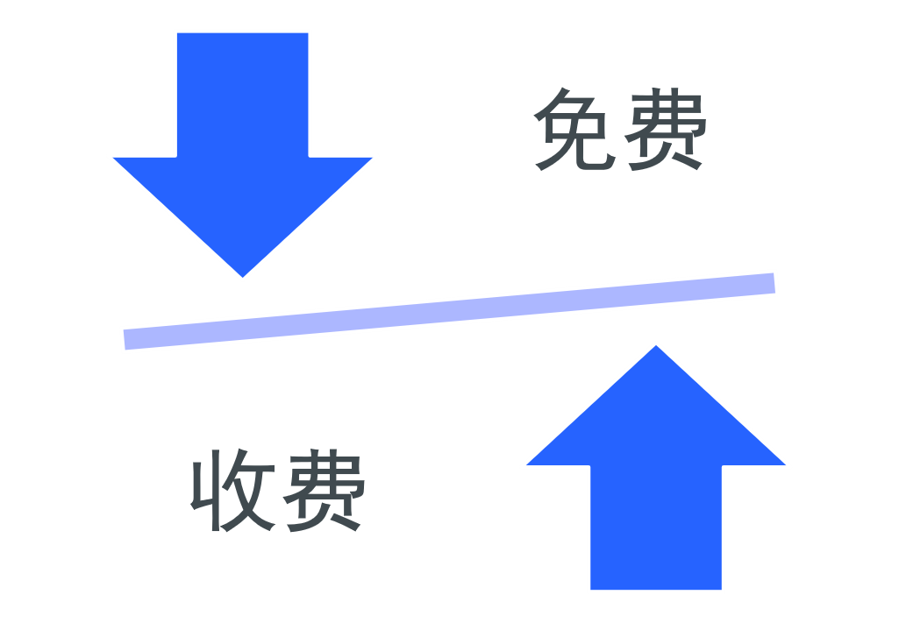
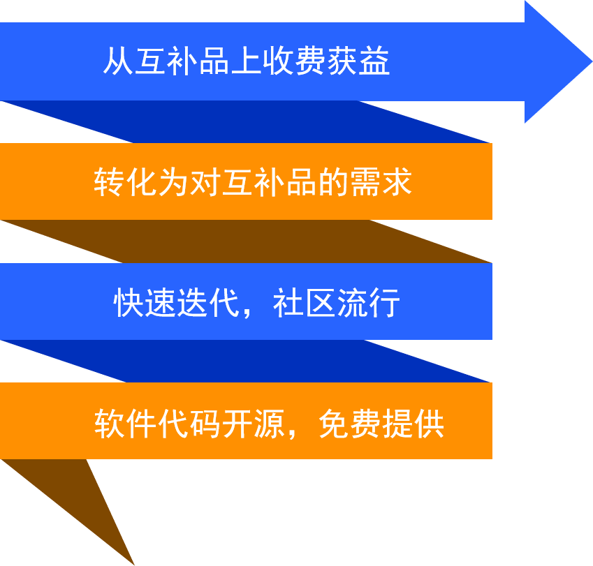
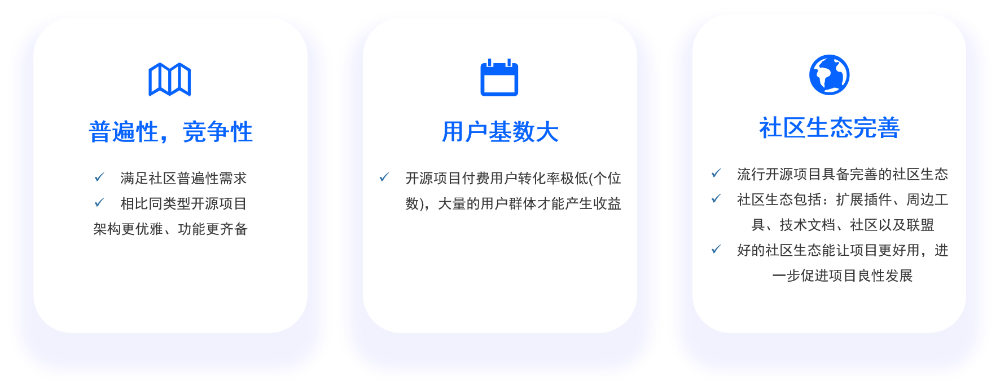
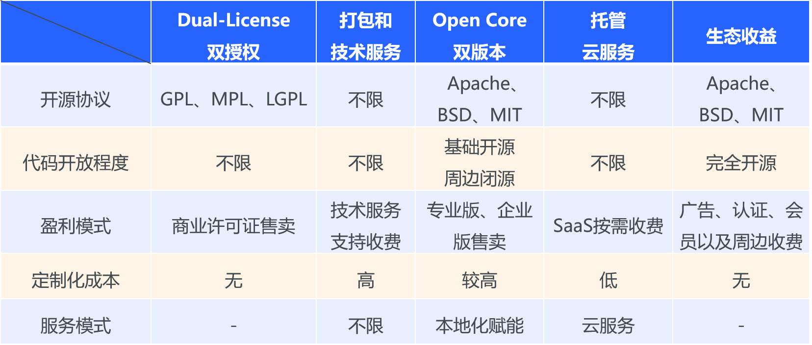
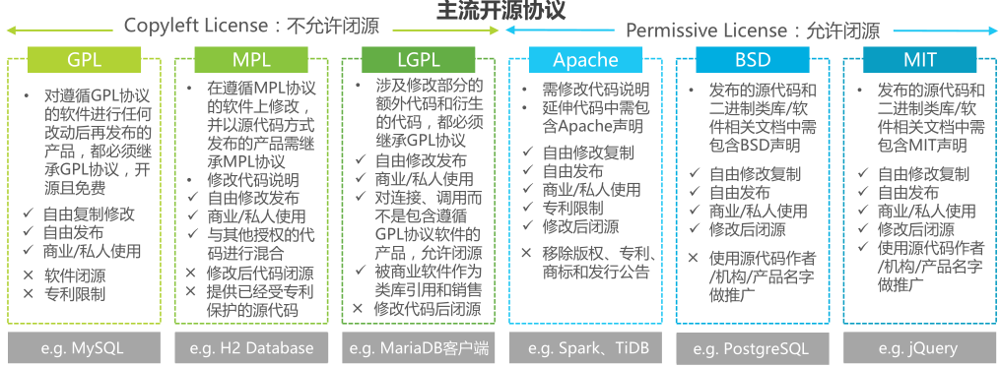
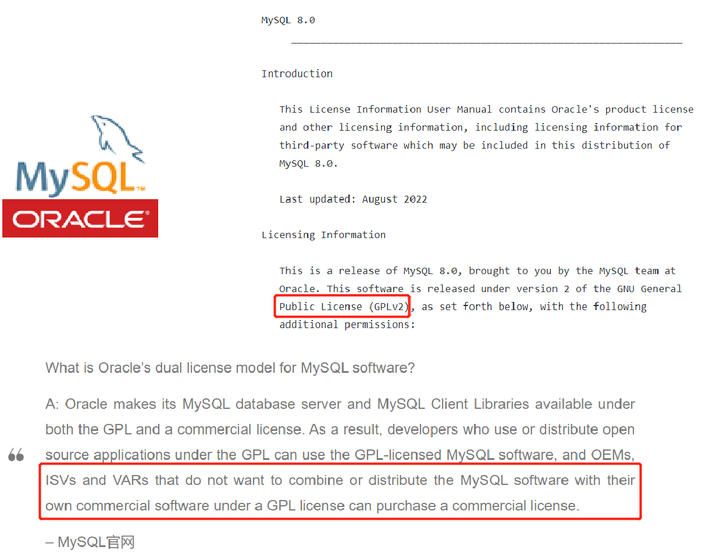

# 开源商业模式研究

本文对开源商业模式做了一个系统的研究，为决策项目是否应该开源、采用何种开源策略以及开源商业化路径提供参考意见

## 开源商业本质

开源商业的本质就是找到边际成本足够低的部分，将价格降到底，以期望用户使用实惠的产品后，倾向于购买其他互补品，后通过互补品实现收益大化。商业化的核心问题就是如何框定这个边际成本为0的范围，如何选择合适的互补品，以及如何对互补品定价

## 开源商业条件

通常来说从一个项目开源到实现收益的整体流程如下：

可以看到从最初的开源到最终取得成功，必须要经过良好的社区运营。而在这个基础上我们也可以分析到一个项目实现开源商业化的前提条件：

* 普遍性以及竞争性
* 用户基数大
* 社区生态完善

## 开源商业模式

在充分调研社区资料后，总结了5种主流的开源商业模式：

* Dual-License双授权：代码具有两套许可证，一套开源许可证，另一套商业许可证
* Open Core双版本：一部分软件开源，另一部分增值功能闭源收费
* 打包和技术服务：基于开源项目提供打包、技术支持、培训或项目咨询服务收费
* 托管云服务：企业用户付费使用云端的开源服务，无需搭建软件使用环境
* 生态收益：通过开源获取生态流量入口，然后利用流量进行变现

并对这五种开源商业模式进行了对比，其中重点关注每种商业模式的盈利区分：

接下来将分别展开介绍各个商业模式并举例说明：

### 1. Dual-License双授权模式

"双授权"模式指的是软件具有两套许可证。一套是传统的开源许可证比如 GPL(免费) ，另一套是商业许可证(收费)。基于开源许可证可自由开发但要求开放源代码；基于商业许可证可实现代码闭源但需收费

像比如MySQL此类软件就是采用Dual-License双授权模式：基于GPLv2商业限制性协议开发，客户再购买商业许可证后可基于开源版本二次定制并进行售卖

### 2. 打包和技术服务模式

### 3. Open Core双版本模式

### 4. 云服务模式

### 5. 生态收益模式

## 开源企业发展阶段

## 开源商业化时长

## 国内外开源情况

## 开源运营成功经验
