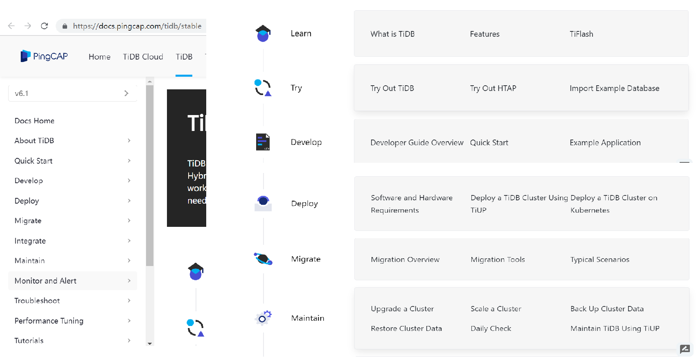
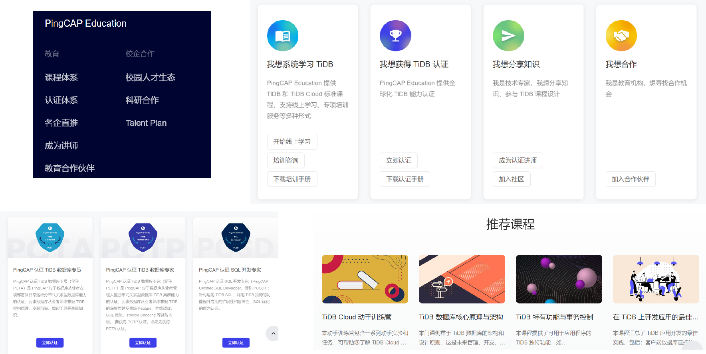

# 开源商业模式研究

开源除了给个人以及公司带来技术影响力之外，更为重要的是通过开源实现商业化价值，而这部分才是很多开源项目成功的实际驱动力。本文对开源商业模式做了一个系统的研究，为决策项目是否应该开源、采用何种开源策略以及开源商业化路径提供参考意见

## 开源商业本质

开源商业的本质就是找到边际成本足够低的部分，将价格降到底，以期望用户使用实惠的产品后，倾向于购买其他互补品，后通过互补品实现收益大化。商业化的核心问题就是如何框定这个边际成本为0的范围，如何选择合适的互补品，以及如何对互补品定价

## 开源商业条件

通常来说从一个项目开源到实现收益的整体流程如下：

可以看到从最初的开源到最终取得成功，必须要经过良好的社区运营。而在这个基础上我们也可以分析到一个项目实现开源商业化的前提条件：

* 普遍性以及竞争性
* 用户基数大
* 社区生态完善

## 开源商业模式

在充分调研社区资料后，总结了5种主流的开源商业模式：

* Dual-License双授权：代码具有两套许可证，一套开源许可证，另一套商业许可证
* Open Core双版本：一部分软件开源，另一部分增值功能闭源收费
* 打包和技术服务：基于开源项目提供打包、技术支持、培训或项目咨询服务收费
* 托管云服务：企业用户付费使用云端的开源服务，无需搭建软件使用环境
* 生态收益：通过开源获取生态流量入口，然后利用流量进行变现

并对这五种开源商业模式进行了对比，其中重点关注每种商业模式的盈利区分：

接下来将分别展开介绍各个商业模式并举例说明：

### 1. Dual-License双授权模式

"双授权"模式指的是软件具有两套许可证。一套是传统的开源许可证比如 GPL(免费) ，另一套是商业许可证(收费)。基于开源许可证可自由开发但要求开放源代码；基于商业许可证可实现代码闭源但需收费

像比如MySQL此类软件就是采用Dual-License双授权模式：基于GPLv2商业限制性协议开发，客户在购买商业许可证后可基于开源版本二次定制并进行售卖

### 2. 打包和技术服务模式

开源软件后面的运维、部署、咨询、升级等，统称为技术服务。企业通过提供开源软件技术服务来获得利润，而软件本身是不收取任何费用的。**该模式的变现价值点主要为企业提供一种服务保障**

通常来说此类公司的运作模式会经过’参与‘、’集成‘、‘稳固’以及‘服务’四个阶段：

而此类模式的代表则是红帽，红帽是第一家靠提供技术支持做到 10 亿美元营收的公司。在其“技术支持”模式存在的 20 年间，没有其他公司能够替代红帽

红帽公司提供多款基于开源软件的产品，包括：基于Linux内核的操作系统稳定发行版、基于Kubernetes的云原生管理平台OpenShift以及基于Ansible的自动化运维平台等；同时提供各类软件的培训以及咨询服务

### 3. Open Core双版本模式

Open Core双版本模式是目前最为普遍的开源商业模式，此种模式只开源核心（core）部分，而一些周边是非开源且需要付费的。简单理解就是提供两套版本：社区版免费，不稳定因素较多；商业版收费，保障生产级别的功能、性能以及稳定性。而这些付费功能包含如下：

HashiCorp是一家典型的从开源到商业化转型成功的基础设施软件服务商，主要提供Cloud和DevOps基础设施自动化工具，集开发、运营和安全性功能于一体，开源了包括：Vagrant、Packer、Terraform、Vault、Nomad以及Consul等六款明星级项目

而HashiCorp从开源到商业化主要经历了三个阶段：

* Community incubating：孵化以及培育社区，迭代项目功能
* 初期商业化产品：提供针对开源项目的企业版收费产品，接触最初的一批客户，进行市场以及商业模式探索，为商业化的过度准备阶段
* 核心成熟产品：经过最初市场探索迭代总结的可规模复制的核心产品，可进行大规模商业化推广

截止到目前为止，HashiCorp的运营概况、社区孵化的商业产品及解决方案如下：

而国内的PingCap TiDB也是此类模式的典型代表。2015年4月PingCap成立，并于同年9月份开源了TiDB分布式关系型数据库，一个月Star数超过 2700，得益于TiDB的商业化，2020年宣布完成2.7亿美元的D轮融资，同时TiDB成为最流行的国产数据库，GitHub 5.3K Forks + 32.8K Stars。并提供基于开源TiDB的企业版以及SaaS服务

### 4. 云服务模式

云服务收费模式指开源厂商将开源软件部署在云上，企业用户付费使用构架在云端的开源服务，无需执行搭建软件使用环境。这种模式的价值点在于云为软件提供很好的分发渠道，用户可更加便捷地购买软件。在选择这一模式后，企业避免本地部署、运维步骤，节省了人力成本，同时让用户以按需付费、即用即付的订阅方式来完成整个过程，为企业使用软件带来了极大便利。这一模式亮点在于边际成本递减，可规模化潜力高，风险在于服务构建于云厂商，而云厂商会利用开源版本与开源公司形成直接竞争关系

此类模式比较典型的代表是Databricks，Databricks开源了Spark、Delta Lake、Redash、MLflow等流行开源项目，并主要基于公有云提供这些开源项目的收费服务

而国内各大云厂商，阿里云、华为云、腾讯云等，均提供主流开源软件的云服务，涵盖操作系统、中间件、数据库等领域。阿里云数据库服务举例如下：

为了规避这种‘薅羊毛’的行为，开源厂商一般会将完全开源的协议(eg：Apache)转化为限制性商业协议(eg：GPL)，这样云厂商必须购买商业许可证方可售卖SaaS服务，很大程度保障了开源企业的利益

### 5. 生态收益模式

企业以开源软件作为流量入口，构建开源软件应用生态，从而获取利益。此类模式的开源主体一般为拥有高价值开源项目的巨头企业或者社区，例如谷歌安卓操作系统以及云原生计算基金会CNCF等

## 开源企业发展阶段

正如上述分析过的HashiCorp公司商业化阶段一样，一般来说一个开源企业的发展会经历孵化器、产品验证器以及价值变现期三个阶段：

而每个阶段的关注点以及衡量指标也各不相同：

这里举例MongoDB来说明一下开源企业发展阶段。MongoDB在2007年成立，2009-2011专注孵化社区，2011-2012开始推出企业版并进行商业化尝试，2012-2016持续进行营收规模扩张

## 开源商业化时长

这里对国内外一些典型的开源公司以及项目进行了开源商业化时长统计：

从上面的数据可以得出如下两个结论：

* 开源~营收时长：1-5年
* 营收~盈利时长：1-3年

因此企业对待开源这件事情必须要有一定的心里预期：大概率短期内无法实现营收或者盈利，同时前期还需要投入一定资源运营社区

## 国内外开源情况

目前国内外比较成功的开源项目大多都是偏基础架构以及工具类，应用类的相对较少，但是也不是说没有，例如Odoo项目

Odoo是全世界最流行的开源ERP项目，采用LGPLv3商业限制性协议，包含了一系列的开源商业apps，企业可单独使用某个app构建CRM、Human Resources以及Project Management等，也可以组合搭建功能齐备的ERP系统。该项目由企业管理开源软件服务商Odoo公司开源并投入商业化运行。截止目前GitHub流行度统计：17.4K Forks + 27.2K Stars + 15.6K Issues + 89.3K PR

工具类以及基础架构类成功的开源项目例子数不胜数，这里就不一一列举了。我们分析上述现象的原因，可以归纳如下：

* 应用类的项目由于普遍是根据公司需求定制化开发，局限性较多，在其它场景下往往无法直接使用，使用成本高，导致社区参与人的动力不够
* 基础架构类以及工具类项目需求较为普遍，应用场景广泛，开发者基数较大，使用成本低，社区运营更容易成功

因此在开源选型时建议优先选择基础架构类或工具类项目，应用类项目只有当普遍性做得足够好，同时用户基数大的情况下才可考虑

## 开源运营成功经验

为了更好的制定开源运营策略，这里研究了TiDB社区运营的一些细节，希望从TiDB学习如何孵化以及运营开源社区，下面分几个方面依次介绍

### 1. 详细的文档

TiDB提供了详细的文档，覆盖了TiDB所有生命周期环境，包括：部署、开发、迁移、监控告警、性能调优、问题定位等。详细的文档有助于开发者更好地使用以及参与项目：

### 2. 齐备的开发者社区

PingCap创建了各类开发者社区，包括：内部社区、Slack Channel、OSS Insight以及社区问答等。齐备的社区有助于构建良好的开发生态：

### 3. 丰富的资料以及资讯

关于TiDB国内外的资料以及资讯很丰富，包括：Twitter、StackOverflow以及Team Blog等。丰富的资料以及资讯有助于让用户全方面了解项目相关内容

### 4. PingCap Education

PingCap具备完善的教育生态，包括：TIDB认证、TIDB课程、企业培训、名企直推以及校企合作等。完善的教育生态一方面可以起到宣传推广的效果；另一方面可以促进校企合作，进一步完善开发者生态：

因此，总结来说一个项目如果要运营的比较成功，需要具备如下几个条件：

* 详细的官方文档：帮助用户快速使用项目，理解架构
* 齐备的开发者社区：帮助用户定位解决问题，深度参与项目
* 丰富的资料以及资讯：帮助用户全方面了解项目相关内容
* 教育生态：校企合作，极大提高项目知名度以及普及率

## 开源商业化总结

最后，从上面的分析我们可以得出一些开源项目的标准及指导思路：

