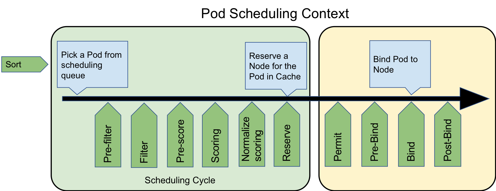
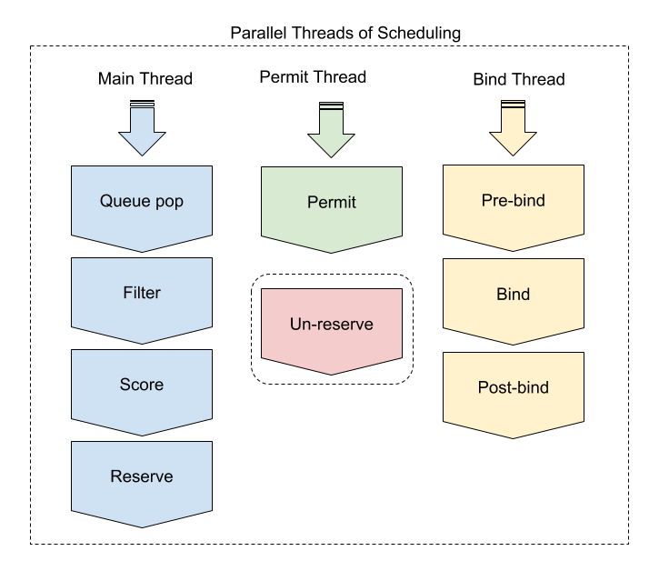

Kubernetes Scheduler Extensibility - Scheduler Framework
========================================================

## Overview

extender提供了非侵入scheduler core的方式扩展scheduler，但是有如下缺点：

* 缺少灵活性：extender提供的接口只能由scheduler core在固定点调用，比如："Filter" extenders只能在默认预选结束后进行调用；而"Prioritize" extenders只能在默认优选执行后调用
* 性能差：相比原生调用func来说，走http/https + 加解JSON包开销较大
* 错误处理困难：scheduler core在调用extender后，如果出现错误，需要中断调用，很难将错误信息传递给extender，终止extender逻辑
* 无法共享cache：extender是webhook，以单独的server形式与scheduler一起运行，如果scheduler core提供的参数无法满足extender处理需求，同时由于无法共享scheduler core cache，那么extender需要自行与kube-apiserver进行通信，并建立cache    

为了解决scheduler extender存在的问题，scheduler framework在scheduler core基础上进行了改造和提取，在scheduler几乎所有关键路径上设置了plugins扩展点，用户可以在不修改scheduler core代码的前提下开发plugins，最后与core一起编译打包成二进制包实现扩展

## Scheduling Cycle & Binding Cycle

scheduler整个调度流程可以分为如下两个阶段：

* scheduling cycle：选择出一个节点以供pod运行，主要包括预选&优选，串行执行
* binding cycle：将scheduling cycle选择的node与pod进行绑定，主要包括bind操作，并发执行

这两个阶段合称为"scheduling context"，每个阶段在调度失败或者发生错误时都可能发生中断并被放入scheduler队列等待重新调度

## Extension points

pod调度流程以及对应的scheduler plugins扩展点如下：



这里按照调用顺序依次介绍各个plugin扩展点：

* Queue sort：用于对scheduelr优先级队列进行排序，需要实现"less(pod1, pod2)"接口，且该插件只会生效一个
* Pre-filter：用于检查集群和pod需要满足的条件，或者对pod进行预选 预处理，需要实现"PreFilter"接口
* Filter：对应scheduler预选算法，用于根据预选策略对节点进行过滤
* Pre-Score：对应"Pre-filter"，主要用于优选 预处理，比如：更新cache，产生logs/metrics等
* Scoring：对应scheduler优选算法，分为"score"(Map)和"normalize scoring"(Reduce)两个阶段
  * score：并发执行node打分；同一个node在打分的时候，并发执行所有插件对该node进行score
  * normalize scoring：并发执行所有插件的normalize scoring；每个插件对所有节点score进行reduce，最终将分数限制在[MinNodeScore, MaxNodeScore]有效范围
* Reserve(aka Assume)：scheduling cycle的最后一步，用于将node相关资源预留(assume)给pod，更新scheduler cache；binding cycle执行失败，则会执行对应的Un-reserve插件，清理掉与pod相关的assume资源，并进行scheduling queue等待重新调度
* Permit：binding cycle的第一个步骤，判断是否允许pod与node执行bind，有如下三种行为：
  * approve：允许，进入Pre-bind流程
  * deny：不允许，执行Un-reserve插件，并进入scheduling queue等待重新调度
  * wait (with a timeout)：pod将一直持续处于Permit阶段，直到approve，进入Pre-bind；如果超时，则会被deny，等待重新被调度
* Pre-bind：执行bind操作之前的准备工作，例如volume相关的操作
* Bind：用于执行pod与node之间的绑定操作，只有在所有pre-bind plugins相关操作都完成的情况下才会被执行；另外，如果一个bind插件选择处理pod，那么其它bind插件都会被忽略 
* Post-bind：binding cycle最后一个步骤，用于在bind操作执行成功后清理相关资源

在介绍完scheduler framework扩展点后，我们开始介绍如何按照framework规范进行plugins开发

## Plugin dev process

#### step1 - Plugin Registration

scheduler framework plugins开发首先需要注册plugin，如下(k8s.io/kubernetes/cmd/kube-scheduler/app/server.go)：

```go
// PluginFactory is a function that builds a plugin.
type PluginFactory = func(configuration *runtime.Unknown, f FrameworkHandle) (Plugin, error)

// Registry is a collection of all available plugins. The framework uses a
// registry to enable and initialize configured plugins.
// All plugins must be in the registry before initializing the framework.
type Registry map[string]PluginFactory

// Register adds a new plugin to the registry. If a plugin with the same name
// exists, it returns an error.
func (r Registry) Register(name string, factory PluginFactory) error {
	if _, ok := r[name]; ok {
		return fmt.Errorf("a plugin named %v already exists", name)
	}
	r[name] = factory
	return nil
}

// WithPlugin creates an Option based on plugin name and factory.
func WithPlugin(name string, factory framework.PluginFactory) Option {
	return func(registry framework.Registry) error {
		return registry.Register(name, factory)
	}
}

func main() {
	rand.Seed(time.Now().UnixNano())
	// Register custom plugins to the scheduler framework.
	// Later they can consist of scheduler profile(s) and hence
	// used by various kinds of workloads.
	command := app.NewSchedulerCommand(
		app.WithPlugin(coscheduling.Name, coscheduling.New),
		app.WithPlugin(qos.Name, qos.New),
	)
	if err := command.Execute(); err != nil {
		os.Exit(1)
	}
}
```

我们需要实现自己的PluginFactory，并返回custom Plugin，例如：

```go
// New initializes a new plugin and returns it.
func New(_ *runtime.Unknown, handle framework.FrameworkHandle) (framework.Plugin, error) {
	podLister := handle.SharedInformerFactory().Core().V1().Pods().Lister()
	return &Coscheduling{frameworkHandle: handle,
		podLister: podLister,
	}, nil
}
```

这里有两个参数：

* PluginConfig：plugin初始化参数
* FrameworkHandle：提供API访问kube-apiserver(例如：client (kubernetes.Interface) and SharedInformerFactory)以及scheduler core内部cache

```go
// FrameworkHandle provides data and some tools that plugins can use. It is
// passed to the plugin factories at the time of plugin initialization. Plugins
// must store and use this handle to call framework functions.
type FrameworkHandle interface {
	// SnapshotSharedLister returns listers from the latest NodeInfo Snapshot. The snapshot
	// is taken at the beginning of a scheduling cycle and remains unchanged until
	// a pod finishes "Reserve" point. There is no guarantee that the information
	// remains unchanged in the binding phase of scheduling, so plugins in the binding
	// cycle(permit/pre-bind/bind/post-bind/un-reserve plugin) should not use it,
	// otherwise a concurrent read/write error might occur, they should use scheduler
	// cache instead.
	SnapshotSharedLister() schedulerlisters.SharedLister

	// IterateOverWaitingPods acquires a read lock and iterates over the WaitingPods map.
	IterateOverWaitingPods(callback func(WaitingPod))

	// GetWaitingPod returns a waiting pod given its UID.
	GetWaitingPod(uid types.UID) WaitingPod

	// RejectWaitingPod rejects a waiting pod given its UID.
	RejectWaitingPod(uid types.UID)

	// ClientSet returns a kubernetes clientSet.
	ClientSet() clientset.Interface

	SharedInformerFactory() informers.SharedInformerFactory
}
```

在注册完plugin后，framework会在初始化时，利用这些参数对plugin进行实例化，如下：

```go
// NewFramework initializes plugins given the configuration and the registry.
func NewFramework(r Registry, plugins *config.Plugins, args []config.PluginConfig, opts ...Option) (Framework, error) {
	options := defaultFrameworkOptions
	for _, opt := range opts {
		opt(&options)
	}

	f := &framework{
		registry:              r,
		snapshotSharedLister:  options.snapshotSharedLister,
		pluginNameToWeightMap: make(map[string]int),
		waitingPods:           newWaitingPodsMap(),
		clientSet:             options.clientSet,
		informerFactory:       options.informerFactory,
		metricsRecorder:       options.metricsRecorder,
	}
	if plugins == nil {
		return f, nil
	}

	// get needed plugins from config
	pg := f.pluginsNeeded(plugins)
	if len(pg) == 0 {
		return f, nil
	}

	pluginConfig := make(map[string]*runtime.Unknown, 0)
	for i := range args {
		pluginConfig[args[i].Name] = &args[i].Args
	}

	pluginsMap := make(map[string]Plugin)
	for name, factory := range r {
		// initialize only needed plugins.
		if _, ok := pg[name]; !ok {
			continue
		}

		p, err := factory(pluginConfig[name], f)
		if err != nil {
			return nil, fmt.Errorf("error initializing plugin %q: %v", name, err)
		}
		pluginsMap[name] = p

		// a weight of zero is not permitted, plugins can be disabled explicitly
		// when configured.
		f.pluginNameToWeightMap[name] = int(pg[name].Weight)
		if f.pluginNameToWeightMap[name] == 0 {
			f.pluginNameToWeightMap[name] = 1
		}
	}

	for _, e := range f.getExtensionPoints(plugins) {
		if err := updatePluginList(e.slicePtr, e.plugins, pluginsMap); err != nil {
			return nil, err
		}
	}

	// Verifying the score weights again since Plugin.Name() could return a different
	// value from the one used in the configuration.
	for _, scorePlugin := range f.scorePlugins {
		if f.pluginNameToWeightMap[scorePlugin.Name()] == 0 {
			return nil, fmt.Errorf("score plugin %q is not configured with weight", scorePlugin.Name())
		}
	}

	if len(f.queueSortPlugins) > 1 {
		return nil, fmt.Errorf("only one queue sort plugin can be enabled")
	}

	return f, nil
}

// Plugins include multiple extension points. When specified, the list of plugins for
// a particular extension point are the only ones enabled. If an extension point is
// omitted from the config, then the default set of plugins is used for that extension point.
// Enabled plugins are called in the order specified here, after default plugins. If they need to
// be invoked before default plugins, default plugins must be disabled and re-enabled here in desired order.
type Plugins struct {
	// QueueSort is a list of plugins that should be invoked when sorting pods in the scheduling queue.
	QueueSort *PluginSet

	// PreFilter is a list of plugins that should be invoked at "PreFilter" extension point of the scheduling framework.
	PreFilter *PluginSet

	// Filter is a list of plugins that should be invoked when filtering out nodes that cannot run the Pod.
	Filter *PluginSet

	// PostFilter is a list of plugins that are invoked after filtering out infeasible nodes.
	PostFilter *PluginSet

	// Score is a list of plugins that should be invoked when ranking nodes that have passed the filtering phase.
	Score *PluginSet

	// Reserve is a list of plugins invoked when reserving a node to run the pod.
	Reserve *PluginSet

	// Permit is a list of plugins that control binding of a Pod. These plugins can prevent or delay binding of a Pod.
	Permit *PluginSet

	// PreBind is a list of plugins that should be invoked before a pod is bound.
	PreBind *PluginSet

	// Bind is a list of plugins that should be invoked at "Bind" extension point of the scheduling framework.
	// The scheduler call these plugins in order. Scheduler skips the rest of these plugins as soon as one returns success.
	Bind *PluginSet

	// PostBind is a list of plugins that should be invoked after a pod is successfully bound.
	PostBind *PluginSet

	// Unreserve is a list of plugins invoked when a pod that was previously reserved is rejected in a later phase.
	Unreserve *PluginSet
}

// PluginSet specifies enabled and disabled plugins for an extension point.
// If an array is empty, missing, or nil, default plugins at that extension point will be used.
type PluginSet struct {
	// Enabled specifies plugins that should be enabled in addition to default plugins.
	// These are called after default plugins and in the same order specified here.
	Enabled []Plugin
	// Disabled specifies default plugins that should be disabled.
	// When all default plugins need to be disabled, an array containing only one "*" should be provided.
	Disabled []Plugin
}

func (f *framework) getExtensionPoints(plugins *config.Plugins) []extensionPoint {
	return []extensionPoint{
		{plugins.PreFilter, &f.preFilterPlugins},
		{plugins.Filter, &f.filterPlugins},
		{plugins.Reserve, &f.reservePlugins},
		{plugins.PostFilter, &f.postFilterPlugins},
		{plugins.Score, &f.scorePlugins},
		{plugins.PreBind, &f.preBindPlugins},
		{plugins.Bind, &f.bindPlugins},
		{plugins.PostBind, &f.postBindPlugins},
		{plugins.Unreserve, &f.unreservePlugins},
		{plugins.Permit, &f.permitPlugins},
		{plugins.QueueSort, &f.queueSortPlugins},
	}
}

func updatePluginList(pluginList interface{}, pluginSet *config.PluginSet, pluginsMap map[string]Plugin) error {
	if pluginSet == nil {
		return nil
	}

	plugins := reflect.ValueOf(pluginList).Elem()
	pluginType := plugins.Type().Elem()
	set := sets.NewString()
	for _, ep := range pluginSet.Enabled {
		pg, ok := pluginsMap[ep.Name]
		if !ok {
			return fmt.Errorf("%s %q does not exist", pluginType.Name(), ep.Name)
		}

		if !reflect.TypeOf(pg).Implements(pluginType) {
			return fmt.Errorf("plugin %q does not extend %s plugin", ep.Name, pluginType.Name())
		}

		if set.Has(ep.Name) {
			return fmt.Errorf("plugin %q already registered as %q", ep.Name, pluginType.Name())
		}

		set.Insert(ep.Name)

		newPlugins := reflect.Append(plugins, reflect.ValueOf(pg))
		plugins.Set(newPlugins)
	}
	return nil
}

// framework is the component responsible for initializing and running scheduler
// plugins.
type framework struct {
	registry              Registry
	snapshotSharedLister  schedulerlisters.SharedLister
	waitingPods           *waitingPodsMap
	pluginNameToWeightMap map[string]int
	queueSortPlugins      []QueueSortPlugin
	preFilterPlugins      []PreFilterPlugin
	filterPlugins         []FilterPlugin
	postFilterPlugins     []PostFilterPlugin
	scorePlugins          []ScorePlugin
	reservePlugins        []ReservePlugin
	preBindPlugins        []PreBindPlugin
	bindPlugins           []BindPlugin
	postBindPlugins       []PostBindPlugin
	unreservePlugins      []UnreservePlugin
	permitPlugins         []PermitPlugin

	clientSet       clientset.Interface
	informerFactory informers.SharedInformerFactory

	metricsRecorder *metricsRecorder
}
```

framework会根据Plugins配置初始化需要的插件，并根据插件类型添加到相应的扩展点plugins列表中

#### step2 - Plugin dev

在注册完plugin后，需要实现plugin相应的接口完成对应的功能，比如Filter(预选)和Scoring(优选)插件接口(k8s.io/kubernetes/pkg/scheduler/framework/v1alpha1/interface.go)：

```go
// Plugin is the parent type for all the scheduling framework plugins.
type Plugin interface {
	Name() string
}

// FilterPlugin is an interface for Filter plugins. These plugins are called at the
// filter extension point for filtering out hosts that cannot run a pod.
// This concept used to be called 'predicate' in the original scheduler.
// These plugins should return "Success", "Unschedulable" or "Error" in Status.code.
// However, the scheduler accepts other valid codes as well.
// Anything other than "Success" will lead to exclusion of the given host from
// running the pod.
type FilterPlugin interface {
	Plugin
	// Filter is called by the scheduling framework.
	// All FilterPlugins should return "Success" to declare that
	// the given node fits the pod. If Filter doesn't return "Success",
	// please refer scheduler/algorithm/predicates/error.go
	// to set error message.
	// For the node being evaluated, Filter plugins should look at the passed
	// nodeInfo reference for this particular node's information (e.g., pods
	// considered to be running on the node) instead of looking it up in the
	// NodeInfoSnapshot because we don't guarantee that they will be the same.
	// For example, during preemption, we may pass a copy of the original
	// nodeInfo object that has some pods removed from it to evaluate the
	// possibility of preempting them to schedule the target pod.
	Filter(ctx context.Context, state *CycleState, pod *v1.Pod, nodeInfo *schedulernodeinfo.NodeInfo) *Status
}

...
// ScorePlugin is an interface that must be implemented by "score" plugins to rank
// nodes that passed the filtering phase.
type ScorePlugin interface {
	Plugin
	// Score is called on each filtered node. It must return success and an integer
	// indicating the rank of the node. All scoring plugins must return success or
	// the pod will be rejected.
	Score(ctx context.Context, state *CycleState, p *v1.Pod, nodeName string) (int64, *Status)

	// ScoreExtensions returns a ScoreExtensions interface if it implements one, or nil if does not.
	ScoreExtensions() ScoreExtensions
}
```

这里一般会传递一个CycleState的参数给plugin，它代表了一个scheduling context(调度上下文)，plugin可以利用CycleState获取本调度周期内的数据，另外也可以通过CycleState提供的API在不同plugin之间传递数据

**需要注意的是：通过CycleState获取的数据只在本次调度周期内生效**

另外，在开发plugin时还需要注意并发的概念，这里面存在两种场景的并发：

* 同一个插件可能在同一个scheduling context中被并发执行
* 同一个插件可能在不同的scheduling context中被并发执行

原因其实也很简单，就是：scheduling cycle是串行工作的(一个pod调度完成后才调度下一个)；binding cycle是并发执行的(可以并行绑定)，而scheduling context由这两部分组成



#### step3 - Configuring Plugins

在开发完framework插件接口后，最后需要配置plugin(k8s.io/kubernetes/pkg/scheduler/apis/config/types.go)，如下：

```go
// KubeSchedulerConfiguration configures a scheduler
type KubeSchedulerConfiguration struct {
    ...
	// Plugins specify the set of plugins that should be enabled or disabled. Enabled plugins are the
	// ones that should be enabled in addition to the default plugins. Disabled plugins are any of the
	// default plugins that should be disabled.
	// When no enabled or disabled plugin is specified for an extension point, default plugins for
	// that extension point will be used if there is any.
	Plugins *Plugins

	// PluginConfig is an optional set of custom plugin arguments for each plugin.
	// Omitting config args for a plugin is equivalent to using the default config for that plugin.
	PluginConfig []PluginConfig
}

// Plugins include multiple extension points. When specified, the list of plugins for
// a particular extension point are the only ones enabled. If an extension point is
// omitted from the config, then the default set of plugins is used for that extension point.
// Enabled plugins are called in the order specified here, after default plugins. If they need to
// be invoked before default plugins, default plugins must be disabled and re-enabled here in desired order.
type Plugins struct {
	// QueueSort is a list of plugins that should be invoked when sorting pods in the scheduling queue.
	QueueSort *PluginSet

	// PreFilter is a list of plugins that should be invoked at "PreFilter" extension point of the scheduling framework.
	PreFilter *PluginSet

	// Filter is a list of plugins that should be invoked when filtering out nodes that cannot run the Pod.
	Filter *PluginSet

	// PostFilter is a list of plugins that are invoked after filtering out infeasible nodes.
	PostFilter *PluginSet

	// Score is a list of plugins that should be invoked when ranking nodes that have passed the filtering phase.
	Score *PluginSet

	// Reserve is a list of plugins invoked when reserving a node to run the pod.
	Reserve *PluginSet

	// Permit is a list of plugins that control binding of a Pod. These plugins can prevent or delay binding of a Pod.
	Permit *PluginSet

	// PreBind is a list of plugins that should be invoked before a pod is bound.
	PreBind *PluginSet

	// Bind is a list of plugins that should be invoked at "Bind" extension point of the scheduling framework.
	// The scheduler call these plugins in order. Scheduler skips the rest of these plugins as soon as one returns success.
	Bind *PluginSet

	// PostBind is a list of plugins that should be invoked after a pod is successfully bound.
	PostBind *PluginSet

	// Unreserve is a list of plugins invoked when a pod that was previously reserved is rejected in a later phase.
	Unreserve *PluginSet
}

// PluginSet specifies enabled and disabled plugins for an extension point.
// If an array is empty, missing, or nil, default plugins at that extension point will be used.
type PluginSet struct {
	// Enabled specifies plugins that should be enabled in addition to default plugins.
	// These are called after default plugins and in the same order specified here.
	Enabled []Plugin
	// Disabled specifies default plugins that should be disabled.
	// When all default plugins need to be disabled, an array containing only one "*" should be provided.
	Disabled []Plugin
}

// Plugin specifies a plugin name and its weight when applicable. Weight is used only for Score plugins.
type Plugin struct {
	// Name defines the name of plugin
	Name string
	// Weight defines the weight of plugin, only used for Score plugins.
	Weight int32
}

// PluginConfig specifies arguments that should be passed to a plugin at the time of initialization.
// A plugin that is invoked at multiple extension points is initialized once. Args can have arbitrary structure.
// It is up to the plugin to process these Args.
type PluginConfig struct {
	// Name defines the name of plugin being configured
	Name string
	// Args defines the arguments passed to the plugins at the time of initialization. Args can have arbitrary structure.
	Args runtime.Unknown
}
```

plugin配置按照作用分为两类：

* 各扩展点的启动 or 禁止插件列表，scheduler会在该扩展点执行完默认插件后，按照列表顺序执行插件，如果该扩展点列表为空，则使用默认插件列表
* 插件的参数列表，如果某个插件对应的参数配置为空，则该插件会使用默认配置

这里要注意插件配置是按照扩展点组织的，如果一个插件同时实现了若干个扩展点功能(比如同时实现了预选&优选接口)，则需要分别填写在preFilter与score列表中，如下(PluginA)：

```
{
  "plugins": {
    "preFilter": [
      {
        "name": "PluginA"
      },
      {
        "name": "PluginB"
      },
      {
        "name": "PluginC"
      }
    ],
    "score": [
      {
        "name": "PluginA",
        "weight": 30
      },
      {
        "name": "PluginX",
        "weight": 50
      },
      {
        "name": "PluginY",
        "weight": 10
      }
    ]
  },
  "pluginConfig": [
    {
      "name": "PluginX",
      "args": {
        "favorite_color": "#326CE5",
        "favorite_number": 7,
        "thanks_to": "thockin"
      }
    }
  ]
}
```

综上，给出了基于scheduler framework扩展scheduler的相关原理分析和操作指引。基于该框架的实现的项目可以参考[coscheduling(aka gang scheduling)](https://github.com/kubernetes-sigs/scheduler-plugins/tree/master/pkg/coscheduling)
                                                                 
## Refs

* [Scheduling Framework](https://kubernetes.io/docs/concepts/scheduling-eviction/scheduling-framework/)
* [Scheduling Profiles](https://kubernetes.io/docs/reference/scheduling/profiles/)
* [design proposal of the scheduling framework](https://github.com/kubernetes/enhancements/blob/master/keps/sig-scheduling/20180409-scheduling-framework.md)
* [scheduler-plugins](https://github.com/kubernetes-sigs/scheduler-plugins)