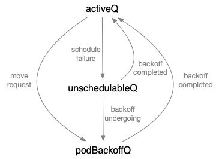

Kubernetes Internal Structure
=============================

在分析完预选和优选过程后，我们对整个scheduler架构有了一个大致的了解，但是对于内部的一些数据结构似乎还不太清晰，于是有必要继续深入研究

在弄清楚内部各个数据结构之间的关系和原理后，我们对scheduler的理解和掌握会更加深刻

## sched.NextPod

前面在分析scheduler整体流程时，我们提到过第一个步骤是`获取待调度的pod`：

```go
// scheduleOne does the entire scheduling workflow for a single pod.  It is serialized on the scheduling algorithm's host fitting.
func (sched *Scheduler) scheduleOne(ctx context.Context) {
	fwk := sched.Framework

	podInfo := sched.NextPod()
	// pod could be nil when schedulerQueue is closed
	if podInfo == nil || podInfo.Pod == nil {
		return
	}
	pod := podInfo.Pod
	if pod.DeletionTimestamp != nil {
		sched.Recorder.Eventf(pod, nil, v1.EventTypeWarning, "FailedScheduling", "Scheduling", "skip schedule deleting pod: %v/%v", pod.Namespace, pod.Name)
		klog.V(3).Infof("Skip schedule deleting pod: %v/%v", pod.Namespace, pod.Name)
		return
	}

	klog.V(3).Infof("Attempting to schedule pod: %v/%v", pod.Namespace, pod.Name)
    ...
}
```

这里我们分析`sched.NextPod`内部结构：

```go
// CreateFromKeys creates a scheduler from a set of registered fit predicate keys and priority keys.
func (c *Configurator) CreateFromKeys(predicateKeys, priorityKeys sets.String, extenders []algorithm.SchedulerExtender) (*Scheduler, error) {
	klog.V(2).Infof("Creating scheduler with fit predicates '%v' and priority functions '%v'", predicateKeys, priorityKeys)

	// Combine all framework configurations. If this results in any duplication, framework
	// instantiation should fail.
	var plugins schedulerapi.Plugins
	plugins.Append(pluginsForPredicates)
	plugins.Append(pluginsForPriorities)
	plugins.Append(c.plugins)
	var pluginConfig []schedulerapi.PluginConfig
	pluginConfig = append(pluginConfig, pluginConfigForPredicates...)
	pluginConfig = append(pluginConfig, pluginConfigForPriorities...)
	pluginConfig = append(pluginConfig, c.pluginConfig...)

	framework, err := framework.NewFramework(
		c.registry,
		&plugins,
		pluginConfig,
		framework.WithClientSet(c.client),
		framework.WithInformerFactory(c.informerFactory),
		framework.WithSnapshotSharedLister(c.nodeInfoSnapshot),
	)
	if err != nil {
		klog.Fatalf("error initializing the scheduling framework: %v", err)
	}

	podQueue := internalqueue.NewSchedulingQueue(
		c.StopEverything,
		framework,
		internalqueue.WithPodInitialBackoffDuration(time.Duration(c.podInitialBackoffSeconds)*time.Second),
		internalqueue.WithPodMaxBackoffDuration(time.Duration(c.podMaxBackoffSeconds)*time.Second),
	)

	go func() {
		<-c.StopEverything
		podQueue.Close()
	}()

	algo := core.NewGenericScheduler(
		c.schedulerCache,
		podQueue,
		predicateFuncs,
		predicateMetaProducer,
		priorityConfigs,
		priorityMetaProducer,
		c.nodeInfoSnapshot,
		framework,
		extenders,
		c.volumeBinder,
		c.informerFactory.Core().V1().PersistentVolumeClaims().Lister(),
		GetPodDisruptionBudgetLister(c.informerFactory),
		c.alwaysCheckAllPredicates,
		c.disablePreemption,
		c.percentageOfNodesToScore,
		c.enableNonPreempting,
	)

	return &Scheduler{
		SchedulerCache:  c.schedulerCache,
		Algorithm:       algo,
		GetBinder:       getBinderFunc(c.client, extenders),
		Framework:       framework,
		NextPod:         internalqueue.MakeNextPodFunc(podQueue),
		Error:           MakeDefaultErrorFunc(c.client, podQueue, c.schedulerCache),
		StopEverything:  c.StopEverything,
		VolumeBinder:    c.volumeBinder,
		SchedulingQueue: podQueue,
		Plugins:         plugins,
		PluginConfig:    pluginConfig,
	}, nil
}
```

注意scheduler.NextPod由internalqueue.MakeNextPodFunc(podQueue)生成：

```go
// MakeNextPodFunc returns a function to retrieve the next pod from a given
// scheduling queue
func MakeNextPodFunc(queue SchedulingQueue) func() *framework.PodInfo {
	return func() *framework.PodInfo {
		podInfo, err := queue.Pop()
		if err == nil {
			klog.V(4).Infof("About to try and schedule pod %v/%v", podInfo.Pod.Namespace, podInfo.Pod.Name)
			return podInfo
		}
		klog.Errorf("Error while retrieving next pod from scheduling queue: %v", err)
		return nil
	}
}
```

该函数从SchedulingQueue队列中获取pod，然后返回

我们看一下`SchedulingQueue`对应结构体：

```go
podQueue := internalqueue.NewSchedulingQueue(
		c.StopEverything,
		framework,
		internalqueue.WithPodInitialBackoffDuration(time.Duration(c.podInitialBackoffSeconds)*time.Second),
		internalqueue.WithPodMaxBackoffDuration(time.Duration(c.podMaxBackoffSeconds)*time.Second),
	)

...
// NewSchedulingQueue initializes a priority queue as a new scheduling queue.
func NewSchedulingQueue(stop <-chan struct{}, fwk framework.Framework, opts ...Option) SchedulingQueue {
	return NewPriorityQueue(stop, fwk, opts...)
}

...
// NewPriorityQueue creates a PriorityQueue object.
func NewPriorityQueue(
	stop <-chan struct{},
	fwk framework.Framework,
	opts ...Option,
) *PriorityQueue {
	options := defaultPriorityQueueOptions
	for _, opt := range opts {
		opt(&options)
	}

	comp := activeQComp
	if fwk != nil {
		if queueSortFunc := fwk.QueueSortFunc(); queueSortFunc != nil {
			comp = func(podInfo1, podInfo2 interface{}) bool {
				pInfo1 := podInfo1.(*framework.PodInfo)
				pInfo2 := podInfo2.(*framework.PodInfo)

				return queueSortFunc(pInfo1, pInfo2)
			}
		}
	}

	pq := &PriorityQueue{
		clock:            options.clock,
		stop:             stop,
		podBackoff:       NewPodBackoffMap(options.podInitialBackoffDuration, options.podMaxBackoffDuration, options.clock),
		activeQ:          heap.NewWithRecorder(podInfoKeyFunc, comp, metrics.NewActivePodsRecorder()),
		unschedulableQ:   newUnschedulablePodsMap(metrics.NewUnschedulablePodsRecorder()),
		nominatedPods:    newNominatedPodMap(),
		moveRequestCycle: -1,
	}
	pq.cond.L = &pq.lock
	pq.podBackoffQ = heap.NewWithRecorder(podInfoKeyFunc, pq.podsCompareBackoffCompleted, metrics.NewBackoffPodsRecorder())

	pq.run()

	return pq
}

...
// PriorityQueue implements a scheduling queue.
// The head of PriorityQueue is the highest priority pending pod. This structure
// has three sub queues. One sub-queue holds pods that are being considered for
// scheduling. This is called activeQ and is a Heap. Another queue holds
// pods that are already tried and are determined to be unschedulable. The latter
// is called unschedulableQ. The third queue holds pods that are moved from
// unschedulable queues and will be moved to active queue when backoff are completed.
type PriorityQueue struct {
	stop  <-chan struct{}
	clock util.Clock
	// podBackoff tracks backoff for pods attempting to be rescheduled
	podBackoff *PodBackoffMap

	lock sync.RWMutex
	cond sync.Cond

	// activeQ is heap structure that scheduler actively looks at to find pods to
	// schedule. Head of heap is the highest priority pod.
	activeQ *heap.Heap
	// podBackoffQ is a heap ordered by backoff expiry. Pods which have completed backoff
	// are popped from this heap before the scheduler looks at activeQ
	podBackoffQ *heap.Heap
	// unschedulableQ holds pods that have been tried and determined unschedulable.
	unschedulableQ *UnschedulablePodsMap
	// nominatedPods is a structures that stores pods which are nominated to run
	// on nodes.
	nominatedPods *nominatedPodMap
	// schedulingCycle represents sequence number of scheduling cycle and is incremented
	// when a pod is popped.
	schedulingCycle int64
	// moveRequestCycle caches the sequence number of scheduling cycle when we
	// received a move request. Unscheduable pods in and before this scheduling
	// cycle will be put back to activeQueue if we were trying to schedule them
	// when we received move request.
	moveRequestCycle int64

	// closed indicates that the queue is closed.
	// It is mainly used to let Pop() exit its control loop while waiting for an item.
	closed bool
}

// Making sure that PriorityQueue implements SchedulingQueue.
var _ SchedulingQueue = &PriorityQueue{}

...
// SchedulingQueue is an interface for a queue to store pods waiting to be scheduled.
// The interface follows a pattern similar to cache.FIFO and cache.Heap and
// makes it easy to use those data structures as a SchedulingQueue.
type SchedulingQueue interface {
	Add(pod *v1.Pod) error
	// AddUnschedulableIfNotPresent adds an unschedulable pod back to scheduling queue.
	// The podSchedulingCycle represents the current scheduling cycle number which can be
	// returned by calling SchedulingCycle().
	AddUnschedulableIfNotPresent(pod *framework.PodInfo, podSchedulingCycle int64) error
	// SchedulingCycle returns the current number of scheduling cycle which is
	// cached by scheduling queue. Normally, incrementing this number whenever
	// a pod is popped (e.g. called Pop()) is enough.
	SchedulingCycle() int64
	// Pop removes the head of the queue and returns it. It blocks if the
	// queue is empty and waits until a new item is added to the queue.
	Pop() (*framework.PodInfo, error)
	Update(oldPod, newPod *v1.Pod) error
	Delete(pod *v1.Pod) error
	MoveAllToActiveOrBackoffQueue(event string)
	AssignedPodAdded(pod *v1.Pod)
	AssignedPodUpdated(pod *v1.Pod)
	NominatedPodsForNode(nodeName string) []*v1.Pod
	PendingPods() []*v1.Pod
	// Close closes the SchedulingQueue so that the goroutine which is
	// waiting to pop items can exit gracefully.
	Close()
	// UpdateNominatedPodForNode adds the given pod to the nominated pod map or
	// updates it if it already exists.
	UpdateNominatedPodForNode(pod *v1.Pod, nodeName string)
	// DeleteNominatedPodIfExists deletes nominatedPod from internal cache
	DeleteNominatedPodIfExists(pod *v1.Pod)
	// NumUnschedulablePods returns the number of unschedulable pods exist in the SchedulingQueue.
	NumUnschedulablePods() int
}
```

PriorityQueue实现了SchedulingQueue，它本身是一个优先级队列，队头pod具有最高调度优先级。并且有3个子队列：

* activeQ(Heap)：这个队列中存放着等待调度的pod，scheduler从这个队列中获取pod进行调度
* unschedulableQ：该队列中存放着已经发起调度算法，但是调度失败(无法调度)的pod
* podBackoffQ(Heap)：该队列中存放着从unschedulableQ中移出的pod，并会在backoff周期后从本队列移到activeQ队列

另外注意：`nominatedPods`，该结构存储着被任命的pod(成功执行调度，分配到某个节点上)

它们之间的关系可以归纳如下：



再回来看`NextPod()`，其实是调用`queue.Pop()`，对应如下：

```go
// Pop removes the head of the active queue and returns it. It blocks if the
// activeQ is empty and waits until a new item is added to the queue. It
// increments scheduling cycle when a pod is popped.
func (p *PriorityQueue) Pop() (*framework.PodInfo, error) {
	p.lock.Lock()
	defer p.lock.Unlock()
	for p.activeQ.Len() == 0 {
		// When the queue is empty, invocation of Pop() is blocked until new item is enqueued.
		// When Close() is called, the p.closed is set and the condition is broadcast,
		// which causes this loop to continue and return from the Pop().
		if p.closed {
			return nil, fmt.Errorf(queueClosed)
		}
		p.cond.Wait()
	}
	obj, err := p.activeQ.Pop()
	if err != nil {
		return nil, err
	}
	pInfo := obj.(*framework.PodInfo)
	pInfo.Attempts++
	p.schedulingCycle++
	return pInfo, err
}

// PodInfo is a wrapper to a Pod with additional information for purposes such as tracking
// the timestamp when it's added to the queue or recording per-pod metrics.
type PodInfo struct {
	Pod *v1.Pod
	// The time pod added to the scheduling queue.
	Timestamp time.Time
	// Number of schedule attempts before successfully scheduled.
	// It's used to record the # attempts metric.
	Attempts int
	// The time when the pod is added to the queue for the first time. The pod may be added
	// back to the queue multiple times before it's successfully scheduled.
	// It shouldn't be updated once initialized. It's used to record the e2e scheduling
	// latency for a pod.
	InitialAttemptTimestamp time.Time
}
```

逻辑很清晰，从activeQ队列中取出队首pod，更新`scheduling cycle`之后，返回`framework.PodInfo`

我们再来看看这个队列是从哪里添加pod信息的：

```go
// New returns a Scheduler
func New(client clientset.Interface,
	informerFactory informers.SharedInformerFactory,
	podInformer coreinformers.PodInformer,
	recorder events.EventRecorder,
	stopCh <-chan struct{},
	opts ...Option) (*Scheduler, error) {

	configurator := &Configurator{
		client:                         client,
		informerFactory:                informerFactory,
		podInformer:                    podInformer,
		volumeBinder:                   volumeBinder,
		schedulerCache:                 schedulerCache,
		StopEverything:                 stopEverything,
		hardPodAffinitySymmetricWeight: options.hardPodAffinitySymmetricWeight,
		disablePreemption:              options.disablePreemption,
		percentageOfNodesToScore:       options.percentageOfNodesToScore,
		bindTimeoutSeconds:             options.bindTimeoutSeconds,
		podInitialBackoffSeconds:       options.podInitialBackoffSeconds,
		podMaxBackoffSeconds:           options.podMaxBackoffSeconds,
		enableNonPreempting:            utilfeature.DefaultFeatureGate.Enabled(kubefeatures.NonPreemptingPriority),
		registry:                       registry,
		plugins:                        options.frameworkPlugins,
		pluginConfig:                   options.frameworkPluginConfig,
		pluginConfigProducerRegistry:   options.frameworkConfigProducerRegistry,
		nodeInfoSnapshot:               snapshot,
		algorithmFactoryArgs: AlgorithmFactoryArgs{
			SharedLister:                   snapshot,
			InformerFactory:                informerFactory,
			VolumeBinder:                   volumeBinder,
			HardPodAffinitySymmetricWeight: options.hardPodAffinitySymmetricWeight,
		},
		configProducerArgs: &frameworkplugins.ConfigProducerArgs{},
	}

	metrics.Register()

	var sched *Scheduler
	source := options.schedulerAlgorithmSource
	switch {
	case source.Provider != nil:
		// Create the config from a named algorithm provider.
		sc, err := configurator.CreateFromProvider(*source.Provider)
		if err != nil {
			return nil, fmt.Errorf("couldn't create scheduler using provider %q: %v", *source.Provider, err)
		}
		sched = sc
	case source.Policy != nil:
		// Create the config from a user specified policy source.
		policy := &schedulerapi.Policy{}
		switch {
		case source.Policy.File != nil:
			if err := initPolicyFromFile(source.Policy.File.Path, policy); err != nil {
				return nil, err
			}
		case source.Policy.ConfigMap != nil:
			if err := initPolicyFromConfigMap(client, source.Policy.ConfigMap, policy); err != nil {
				return nil, err
			}
		}
		sc, err := configurator.CreateFromConfig(*policy)
		if err != nil {
			return nil, fmt.Errorf("couldn't create scheduler from policy: %v", err)
		}
		sched = sc
	default:
		return nil, fmt.Errorf("unsupported algorithm source: %v", source)
	}
	// Additional tweaks to the config produced by the configurator.
	sched.Recorder = recorder
	sched.DisablePreemption = options.disablePreemption
	sched.StopEverything = stopEverything
	sched.podConditionUpdater = &podConditionUpdaterImpl{client}
	sched.podPreemptor = &podPreemptorImpl{client}
	sched.scheduledPodsHasSynced = podInformer.Informer().HasSynced

	AddAllEventHandlers(sched, options.schedulerName, informerFactory, podInformer)
	return sched, nil
}
```

其中`AddAllEventHandlers`函数是关键代码源(pkg/scheduler/eventhandlers.go)，展开：

```go
// AddAllEventHandlers is a helper function used in tests and in Scheduler
// to add event handlers for various informers.
func AddAllEventHandlers(
	sched *Scheduler,
	schedulerName string,
	informerFactory informers.SharedInformerFactory,
	podInformer coreinformers.PodInformer,
) {
	// scheduled pod cache
	podInformer.Informer().AddEventHandler(
		cache.FilteringResourceEventHandler{
			FilterFunc: func(obj interface{}) bool {
				switch t := obj.(type) {
				case *v1.Pod:
					return assignedPod(t)
				case cache.DeletedFinalStateUnknown:
					if pod, ok := t.Obj.(*v1.Pod); ok {
						return assignedPod(pod)
					}
					utilruntime.HandleError(fmt.Errorf("unable to convert object %T to *v1.Pod in %T", obj, sched))
					return false
				default:
					utilruntime.HandleError(fmt.Errorf("unable to handle object in %T: %T", sched, obj))
					return false
				}
			},
			Handler: cache.ResourceEventHandlerFuncs{
				AddFunc:    sched.addPodToCache,
				UpdateFunc: sched.updatePodInCache,
				DeleteFunc: sched.deletePodFromCache,
			},
		},
	)
	// unscheduled pod queue
	podInformer.Informer().AddEventHandler(
		cache.FilteringResourceEventHandler{
			FilterFunc: func(obj interface{}) bool {
				switch t := obj.(type) {
				case *v1.Pod:
					return !assignedPod(t) && responsibleForPod(t, schedulerName)
				case cache.DeletedFinalStateUnknown:
					if pod, ok := t.Obj.(*v1.Pod); ok {
						return !assignedPod(pod) && responsibleForPod(pod, schedulerName)
					}
					utilruntime.HandleError(fmt.Errorf("unable to convert object %T to *v1.Pod in %T", obj, sched))
					return false
				default:
					utilruntime.HandleError(fmt.Errorf("unable to handle object in %T: %T", sched, obj))
					return false
				}
			},
			Handler: cache.ResourceEventHandlerFuncs{
				AddFunc:    sched.addPodToSchedulingQueue,
				UpdateFunc: sched.updatePodInSchedulingQueue,
				DeleteFunc: sched.deletePodFromSchedulingQueue,
			},
		},
	)

	informerFactory.Core().V1().Nodes().Informer().AddEventHandler(
		cache.ResourceEventHandlerFuncs{
			AddFunc:    sched.addNodeToCache,
			UpdateFunc: sched.updateNodeInCache,
			DeleteFunc: sched.deleteNodeFromCache,
		},
	)

	if utilfeature.DefaultFeatureGate.Enabled(features.CSINodeInfo) {
		informerFactory.Storage().V1().CSINodes().Informer().AddEventHandler(
			cache.ResourceEventHandlerFuncs{
				AddFunc:    sched.onCSINodeAdd,
				UpdateFunc: sched.onCSINodeUpdate,
			},
		)
	}

	// On add and delete of PVs, it will affect equivalence cache items
	// related to persistent volume
	informerFactory.Core().V1().PersistentVolumes().Informer().AddEventHandler(
		cache.ResourceEventHandlerFuncs{
			// MaxPDVolumeCountPredicate: since it relies on the counts of PV.
			AddFunc:    sched.onPvAdd,
			UpdateFunc: sched.onPvUpdate,
		},
	)

	// This is for MaxPDVolumeCountPredicate: add/delete PVC will affect counts of PV when it is bound.
	informerFactory.Core().V1().PersistentVolumeClaims().Informer().AddEventHandler(
		cache.ResourceEventHandlerFuncs{
			AddFunc:    sched.onPvcAdd,
			UpdateFunc: sched.onPvcUpdate,
		},
	)

	// This is for ServiceAffinity: affected by the selector of the service is updated.
	// Also, if new service is added, equivalence cache will also become invalid since
	// existing pods may be "captured" by this service and change this predicate result.
	informerFactory.Core().V1().Services().Informer().AddEventHandler(
		cache.ResourceEventHandlerFuncs{
			AddFunc:    sched.onServiceAdd,
			UpdateFunc: sched.onServiceUpdate,
			DeleteFunc: sched.onServiceDelete,
		},
	)

	informerFactory.Storage().V1().StorageClasses().Informer().AddEventHandler(
		cache.ResourceEventHandlerFuncs{
			AddFunc: sched.onStorageClassAdd,
		},
	)
}
```

可以看到`AddAllEventHandlers`用于controller初始化informer逻辑，具体看与`SchedulingQueue`相关的代码逻辑：

```go
// unscheduled pod queue
podInformer.Informer().AddEventHandler(
    cache.FilteringResourceEventHandler{
        FilterFunc: func(obj interface{}) bool {
            switch t := obj.(type) {
            case *v1.Pod:
                return !assignedPod(t) && responsibleForPod(t, schedulerName)
            case cache.DeletedFinalStateUnknown:
                if pod, ok := t.Obj.(*v1.Pod); ok {
                    return !assignedPod(pod) && responsibleForPod(pod, schedulerName)
                }
                utilruntime.HandleError(fmt.Errorf("unable to convert object %T to *v1.Pod in %T", obj, sched))
                return false
            default:
                utilruntime.HandleError(fmt.Errorf("unable to handle object in %T: %T", sched, obj))
                return false
            }
        },
        Handler: cache.ResourceEventHandlerFuncs{
            AddFunc:    sched.addPodToSchedulingQueue,
            UpdateFunc: sched.updatePodInSchedulingQueue,
            DeleteFunc: sched.deletePodFromSchedulingQueue,
        },
    },
)
```

这里给podInformer添加了事件监听处理函数：

* Pod Add：Pod添加事件，对应处理函数为`sched.addPodToSchedulingQueue`
* Pod Update：Pod更新事件，对应处理函数为`sched.updatePodInSchedulingQueue`
* Pod Delete：Pod删除事件，对应处理函数为`sched.deletePodFromSchedulingQueue`

我们依次看一下事件处理函数逻辑，先看`sched.addPodToSchedulingQueue`：

```go
func (sched *Scheduler) addPodToSchedulingQueue(obj interface{}) {
	if err := sched.SchedulingQueue.Add(obj.(*v1.Pod)); err != nil {
		utilruntime.HandleError(fmt.Errorf("unable to queue %T: %v", obj, err))
	}
}
```

调用Add函数添加Pod，对应`PriorityQueue`代码：

```go
// Add adds a pod to the active queue. It should be called only when a new pod
// is added so there is no chance the pod is already in active/unschedulable/backoff queues
func (p *PriorityQueue) Add(pod *v1.Pod) error {
	p.lock.Lock()
	defer p.lock.Unlock()
	pInfo := p.newPodInfo(pod)
	if err := p.activeQ.Add(pInfo); err != nil {
		klog.Errorf("Error adding pod %v/%v to the scheduling queue: %v", pod.Namespace, pod.Name, err)
		return err
	}
	if p.unschedulableQ.get(pod) != nil {
		klog.Errorf("Error: pod %v/%v is already in the unschedulable queue.", pod.Namespace, pod.Name)
		p.unschedulableQ.delete(pod)
	}
	// Delete pod from backoffQ if it is backing off
	if err := p.podBackoffQ.Delete(pInfo); err == nil {
		klog.Errorf("Error: pod %v/%v is already in the podBackoff queue.", pod.Namespace, pod.Name)
	}
	metrics.SchedulerQueueIncomingPods.WithLabelValues("active", PodAdd).Inc()
	p.nominatedPods.add(pod, "")
	p.cond.Broadcast()

	return nil
}
```

这里也就是我们要找的往activeQ中添加pod信息的入口。总结nextPod的流程如下：

```
Pod Add Event => sched.addPodToSchedulingQueue => PriorityQueue.Add => activeQ => PriorityQueue.Pop => sched.NextPod
```

