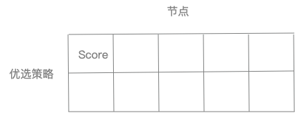

Kubernetes Scheduler Algorithm - Priority
==========================================

上一章分析了预选流程，本章开始研读优选算法

回到调度入口：

```go
// Schedule tries to schedule the given pod to one of the nodes in the node list.
// If it succeeds, it will return the name of the node.
// If it fails, it will return a FitError error with reasons.
func (g *genericScheduler) Schedule(ctx context.Context, state *framework.CycleState, pod *v1.Pod) (result ScheduleResult, err error) {
    ...
	filteredNodes, failedPredicateMap, filteredNodesStatuses, err := g.findNodesThatFit(ctx, state, pod)
	if err != nil {
		return result, err
	}
	trace.Step("Computing predicates done")
    ...
    priorityList, err := g.prioritizeNodes(ctx, state, pod, metaPrioritiesInterface, filteredNodes)
	if err != nil {
		return result, err
	}
    ...
    host, err := g.selectHost(priorityList)
	trace.Step("Prioritizing done")

	return ScheduleResult{
		SuggestedHost:  host,
		EvaluatedNodes: len(filteredNodes) + len(failedPredicateMap) + len(filteredNodesStatuses),
		FeasibleNodes:  len(filteredNodes),
	}, err        
}
```

优选算法主要由两部分组成：

* prioritizeNodes：优选算法，对预选过滤出的节点filteredNodes，根据优选策略分别进行打分，得到priorityList
* selectHost：从优选列表中选择出总分最高的一个节点，最后返回该节点名称和相关信息

1. 给节点打分(prioritizeNodes)

优选核心代码是prioritizeNodes函数：

```go
// prioritizeNodes prioritizes the nodes by running the individual priority functions in parallel.
// Each priority function is expected to set a score of 0-10
// 0 is the lowest priority score (least preferred node) and 10 is the highest
// Each priority function can also have its own weight
// The node scores returned by the priority function are multiplied by the weights to get weighted scores
// All scores are finally combined (added) to get the total weighted scores of all nodes
func (g *genericScheduler) prioritizeNodes(
	ctx context.Context,
	state *framework.CycleState,
	pod *v1.Pod,
	meta interface{},
	nodes []*v1.Node,
) (framework.NodeScoreList, error) {
		...
}
```

prioritizeNodes会并发给node打分。每个优选策略会对应一个`0-10`的分数，0是最低分(最低优先级)，10是最高分(最高优先级)

另外每个优选策略还有一个权重，权重与分数相乘得到该优选策略的分数，而node节点总分则是所有策略分数之和：

```
nodeScores =  prioritize1Scores * weight1 + ... + prioritizeNScores * weightN
```

接下来我们具体看一下执行逻辑：

```go
results := make([]framework.NodeScoreList, len(g.prioritizers))

for i := range g.prioritizers {
    results[i] = make(framework.NodeScoreList, len(nodes))
}

workqueue.ParallelizeUntil(context.TODO(), 16, len(nodes), func(index int) {
    nodeInfo := g.nodeInfoSnapshot.NodeInfoMap[nodes[index].Name]
    for i := range g.prioritizers {
        var err error
        results[i][index], err = g.prioritizers[i].Map(pod, meta, nodeInfo)
        if err != nil {
            appendError(err)
            results[i][index].Name = nodes[index].Name
        }
    }
})
```

首先是初始化results切片，results是一个二维切片，每一行代表一个优选策略，每一列代表一个节点。对应地，results[n][m]则代表了节点m在策略n上的分数



这里看到一个熟悉的函数：`ParallelizeUntil`，在预选算法中介绍过用法，这里不再展开。依然是起了16个goroutine对节点并发执行优选打分，每个节点的打分逻辑也很清晰：依次调用每个优选算法得出相应的Map分数

这里我们简单介绍一下MapReduce概念。Map表示映射，Reduce表示归约。Map接受一个键值对（key-value pair），产生一组中间键值对；而Reduce接受一个键，以及相关的一组值，将这组值进行合并组合产生一组规模更小的值

例如，统计一本书的词频。Map逐个遍历单词，每遇到一个单词w，就产生一个中间键值对<w, "1">；而Reduce则统计键相同（都是单词w）的键值之和，也即出现次数

同样的，在执行完优选Map打分后，需要Reduce进行归约：

```go
for i := range g.prioritizers {
    if g.prioritizers[i].Reduce == nil {
        continue
    }
    wg.Add(1)
    go func(index int) {
        metrics.SchedulerGoroutines.WithLabelValues("prioritizing_mapreduce").Inc()
        defer func() {
            metrics.SchedulerGoroutines.WithLabelValues("prioritizing_mapreduce").Dec()
            wg.Done()
        }()
        if err := g.prioritizers[index].Reduce(pod, meta, g.nodeInfoSnapshot, results[index]); err != nil {
            appendError(err)
        }
        if klog.V(10) {
            for _, hostPriority := range results[index] {
                klog.Infof("%v -> %v: %v, Score: (%d)", util.GetPodFullName(pod), hostPriority.Name, g.prioritizers[index].Name, hostPriority.Score)
            }
        }
    }(i)
}
// Wait for all computations to be finished.
wg.Wait()
```

这里利用wg.Wait并发起goroutine执行Reduce操作。对每一个优选策略(键)进行Reduce归约，得到最终0-10范围的分数

最后，对每个节点的优选打分合并得出总分：

```go
// Summarize all scores.
result := make(framework.NodeScoreList, 0, len(nodes))

for i := range nodes {
    result = append(result, framework.NodeScore{Name: nodes[i].Name, Score: 0})
    for j := range g.prioritizers {
        result[i].Score += results[j][i].Score * g.prioritizers[j].Weight
    }

    for j := range scoresMap {
        result[i].Score += scoresMap[j][i].Score
    }
}
```

可以看到是按照如下公司进行总和的：

```
nodeScores =  prioritize1Scores * weight1 + ... + prioritizeNScores * weightN
```

上面分析中，没有具体到Map和Reduce函数，所以可能会比较懵逼，这里我们举例子进行详细说明：

```go
// PriorityConfig is a config used for a priority function.
type PriorityConfig struct {
	Name   string
	Map    PriorityMapFunction
	Reduce PriorityReduceFunction
	Weight int64
}

...
// CreateFromKeys creates a scheduler from a set of registered fit predicate keys and priority keys.
func (c *Configurator) CreateFromKeys(predicateKeys, priorityKeys sets.String, extenders []algorithm.SchedulerExtender) (*Scheduler, error) {
	klog.V(2).Infof("Creating scheduler with fit predicates '%v' and priority functions '%v'", predicateKeys, priorityKeys)

	predicateFuncs, pluginsForPredicates, pluginConfigForPredicates, err := c.getPredicateConfigs(predicateKeys)
	if err != nil {
		return nil, err
	}

	priorityConfigs, pluginsForPriorities, pluginConfigForPriorities, err := c.getPriorityConfigs(priorityKeys)
	if err != nil {
		return nil, err
	}

	algo := core.NewGenericScheduler(
		c.schedulerCache,
		podQueue,
		predicateFuncs,
		predicateMetaProducer,
		priorityConfigs,
		priorityMetaProducer,
		c.nodeInfoSnapshot,
		framework,
		extenders,
		c.volumeBinder,
		c.informerFactory.Core().V1().PersistentVolumeClaims().Lister(),
		GetPodDisruptionBudgetLister(c.informerFactory),
		c.alwaysCheckAllPredicates,
		c.disablePreemption,
		c.percentageOfNodesToScore,
		c.enableNonPreempting,
	)

	return &Scheduler{
		SchedulerCache:  c.schedulerCache,
		Algorithm:       algo,
		GetBinder:       getBinderFunc(c.client, extenders),
		Framework:       framework,
		NextPod:         internalqueue.MakeNextPodFunc(podQueue),
		Error:           MakeDefaultErrorFunc(c.client, podQueue, c.schedulerCache),
		StopEverything:  c.StopEverything,
		VolumeBinder:    c.volumeBinder,
		SchedulingQueue: podQueue,
		Plugins:         plugins,
		PluginConfig:    pluginConfig,
	}, nil
}

func getPriorityFunctionConfigs(names sets.String, args AlgorithmFactoryArgs) ([]priorities.PriorityConfig, error) {
	schedulerFactoryMutex.RLock()
	defer schedulerFactoryMutex.RUnlock()

	var configs []priorities.PriorityConfig
	for _, name := range names.List() {
		factory, ok := priorityFunctionMap[name]
		if !ok {
			return nil, fmt.Errorf("invalid priority name %s specified - no corresponding function found", name)
		}
		mapFunction, reduceFunction := factory.MapReduceFunction(args)
		configs = append(configs, priorities.PriorityConfig{
			Name:   name,
			Map:    mapFunction,
			Reduce: reduceFunction,
			Weight: factory.Weight,
		})
	}
	if err := validateSelectedConfigs(configs); err != nil {
		return nil, err
	}
	return configs, nil
}

...
// Prioritizes nodes that have labels matching NodeAffinity
scheduler.RegisterPriorityMapReduceFunction(priorities.NodeAffinityPriority, priorities.CalculateNodeAffinityPriorityMap, priorities.CalculateNodeAffinityPriorityReduce, 1)

...
// RegisterPriorityMapReduceFunction registers a priority function with the algorithm registry. Returns the name,
// with which the function was registered.
func RegisterPriorityMapReduceFunction(
	name string,
	mapFunction priorities.PriorityMapFunction,
	reduceFunction priorities.PriorityReduceFunction,
	weight int) string {
	return RegisterPriorityConfigFactory(name, PriorityConfigFactory{
		MapReduceFunction: func(AlgorithmFactoryArgs) (priorities.PriorityMapFunction, priorities.PriorityReduceFunction) {
			return mapFunction, reduceFunction
		},
		Weight: int64(weight),
	})
}
// RegisterPriorityConfigFactory registers a priority config factory with its name.
func RegisterPriorityConfigFactory(name string, pcf PriorityConfigFactory) string {
	schedulerFactoryMutex.Lock()
	defer schedulerFactoryMutex.Unlock()
	validateAlgorithmNameOrDie(name)
	priorityFunctionMap[name] = pcf
	return name
}
```

这里我们以`NodeAffinityPriority`为例子进行分析，从上面代码片段中可以看出该优选算法对应的Map函数为：`CalculateNodeAffinityPriorityMap`；而Reduce函数为：`CalculateNodeAffinityPriorityReduce`，这里我们先看Map函数：

在分析`CalculateNodeAffinityPriorityMap`逻辑前，我们先看看`NodeAffinity`作用：

>> Node affinity is conceptually similar to nodeSelector -- it allows you to constrain which nodes your pod is eligible to be scheduled on, based on labels on the node.

>> There are currently two types of node affinity, called requiredDuringSchedulingIgnoredDuringExecution and preferredDuringSchedulingIgnoredDuringExecution. You can think of them as "hard" and "soft" respectively, in the sense that the former specifies rules that must be met for a pod to be scheduled onto a node (just like nodeSelector but using a more expressive syntax), while the latter specifies preferences that the scheduler will try to enforce but will not guarantee. The "IgnoredDuringExecution" part of the names means that, similar to how nodeSelector works, if labels on a node change at runtime such that the affinity rules on a pod are no longer met, the pod will still continue to run on the node. In the future we plan to offer requiredDuringSchedulingRequiredDuringExecution which will be just like requiredDuringSchedulingIgnoredDuringExecution except that it will evict pods from nodes that cease to satisfy the pods' node affinity requirements.

>> The weight field in preferredDuringSchedulingIgnoredDuringExecution is in the range 1-100. For each node that meets all of the scheduling requirements (resource request, RequiredDuringScheduling affinity expressions, etc.), the scheduler will compute a sum by iterating through the elements of this field and adding "weight" to the sum if the node matches the corresponding MatchExpressions. This score is then combined with the scores of other priority functions for the node. The node(s) with the highest total score are the most preferred.

`NodeAffinity`作用类似于`NodeSelector`，用于根据node labels限制pod运行的节点，有两种类型：`requiredDuringSchedulingIgnoredDuringExecution`(硬限制) 与 `preferredDuringSchedulingIgnoredDuringExecution`(软限制)。

另外，`preferredDuringSchedulingIgnoredDuringExecution`会有一个`weight`域(0-100)，对应node亲和优先权重，用于scheduler优选算法

这里举一个例子进行说明：

```yaml
apiVersion: v1
kind: Pod
metadata:
  name: with-node-affinity
spec:
  affinity:
    nodeAffinity:
      requiredDuringSchedulingIgnoredDuringExecution:
        nodeSelectorTerms:
        - matchExpressions:
          - key: kubernetes.io/e2e-az-name
            operator: In
            values:
            - e2e-az1
            - e2e-az2
      preferredDuringSchedulingIgnoredDuringExecution:
      - weight: 1
        preference:
          matchExpressions:
          - key: another-node-label-key
            operator: In
            values:
            - another-node-label-value
  containers:
  - name: with-node-affinity
    image: k8s.gcr.io/pause:2.0
```

该pod只能被调度到标签key为：`kubernetes.io/e2e-az-name`，且值在`e2e-az1` or `e2e-az2`中的node上。同时具有标签key：`another-node-label-key`，值：`another-node-label-value`的node会优先调度

而`NodeAffinityPriority`主要针对`preferredDuringSchedulingIgnoredDuringExecution`(软限制)进行打分，如下：

```go
// CalculateNodeAffinityPriorityMap prioritizes nodes according to node affinity scheduling preferences
// indicated in PreferredDuringSchedulingIgnoredDuringExecution. Each time a node matches a preferredSchedulingTerm,
// it will get an add of preferredSchedulingTerm.Weight. Thus, the more preferredSchedulingTerms
// the node satisfies and the more the preferredSchedulingTerm that is satisfied weights, the higher
// score the node gets.
func CalculateNodeAffinityPriorityMap(pod *v1.Pod, meta interface{}, nodeInfo *schedulernodeinfo.NodeInfo) (framework.NodeScore, error) {
	node := nodeInfo.Node()
	if node == nil {
		return framework.NodeScore{}, fmt.Errorf("node not found")
	}

	// default is the podspec.
	affinity := pod.Spec.Affinity
	if priorityMeta, ok := meta.(*priorityMetadata); ok {
		// We were able to parse metadata, use affinity from there.
		affinity = priorityMeta.affinity
	}

	var count int32
	// A nil element of PreferredDuringSchedulingIgnoredDuringExecution matches no objects.
	// An element of PreferredDuringSchedulingIgnoredDuringExecution that refers to an
	// empty PreferredSchedulingTerm matches all objects.
	if affinity != nil && affinity.NodeAffinity != nil && affinity.NodeAffinity.PreferredDuringSchedulingIgnoredDuringExecution != nil {
		// Match PreferredDuringSchedulingIgnoredDuringExecution term by term.
		for i := range affinity.NodeAffinity.PreferredDuringSchedulingIgnoredDuringExecution {
			preferredSchedulingTerm := &affinity.NodeAffinity.PreferredDuringSchedulingIgnoredDuringExecution[i]
			if preferredSchedulingTerm.Weight == 0 {
				continue
			}

			// TODO: Avoid computing it for all nodes if this becomes a performance problem.
			nodeSelector, err := v1helper.NodeSelectorRequirementsAsSelector(preferredSchedulingTerm.Preference.MatchExpressions)
			if err != nil {
				return framework.NodeScore{}, err
			}
			if nodeSelector.Matches(labels.Set(node.Labels)) {
				count += preferredSchedulingTerm.Weight
			}
		}
	}

	return framework.NodeScore{
		Name:  node.Name,
		Score: int64(count),
	}, nil
}
```

逻辑很清晰，就是遍历所有`pod.Spec.Affinity.NodeAffinity.PreferredDuringSchedulingIgnoredDuringExecution`，只要node labels匹配对应的`MatchExpressions`，则添加对应亲和权重

接下来分析Reduce函数：

```go
const (
	// MaxNodeScore is the maximum score a Score plugin is expected to return.
	MaxNodeScore int64 = 100

	// MinNodeScore is the minimum score a Score plugin is expected to return.
	MinNodeScore int64 = 0

	// MaxTotalScore is the maximum total score.
	MaxTotalScore int64 = math.MaxInt64
)

// CalculateNodeAffinityPriorityReduce is a reduce function for node affinity priority calculation.
var CalculateNodeAffinityPriorityReduce = NormalizeReduce(framework.MaxNodeScore, false)

// NormalizeReduce generates a PriorityReduceFunction that can normalize the result
// scores to [0, maxPriority]. If reverse is set to true, it reverses the scores by
// subtracting it from maxPriority.
func NormalizeReduce(maxPriority int64, reverse bool) PriorityReduceFunction {
	return func(
		_ *v1.Pod,
		_ interface{},
		_ schedulerlisters.SharedLister,
		result framework.NodeScoreList) error {

		var maxCount int64
		for i := range result {
			if result[i].Score > maxCount {
				maxCount = result[i].Score
			}
		}

		if maxCount == 0 {
			if reverse {
				for i := range result {
					result[i].Score = maxPriority
				}
			}
			return nil
		}

		for i := range result {
			score := result[i].Score

			score = maxPriority * score / maxCount
			if reverse {
				score = maxPriority - score
			}

			result[i].Score = score
		}
		return nil
	}
}

...
g.prioritizers[index].Reduce(pod, meta, g.nodeInfoSnapshot, results[index])
```

Reduce函数逻辑很简单，根据如下公式进行归约：

```
score = maxPriority(100) * score / max{scores}
```

最终会得到一个[0, maxPriority(100)]范围的数目

这里可以看出前面代码注释中`0-10`是一个错误的注释，应该改成`0-100`：

```go
// prioritizeNodes prioritizes the nodes by running the individual priority functions in parallel.
// Each priority function is expected to set a score of 0-10
// 0 is the lowest priority score (least preferred node) and 10 is the highest
// Each priority function can also have its own weight
// The node scores returned by the priority function are multiplied by the weights to get weighted scores
// All scores are finally combined (added) to get the total weighted scores of all nodes
func (g *genericScheduler) prioritizeNodes(
	ctx context.Context,
	state *framework.CycleState,
	pod *v1.Pod,
	meta interface{},
	nodes []*v1.Node,
) (framework.NodeScoreList, error) {
		...
}
```

2. 选取最优节点(selectHost)

```go
// selectHost takes a prioritized list of nodes and then picks one
// in a reservoir sampling manner from the nodes that had the highest score.
func (g *genericScheduler) selectHost(nodeScoreList framework.NodeScoreList) (string, error) {
	if len(nodeScoreList) == 0 {
		return "", fmt.Errorf("empty priorityList")
	}
	maxScore := nodeScoreList[0].Score
	selected := nodeScoreList[0].Name
	cntOfMaxScore := 1
	for _, ns := range nodeScoreList[1:] {
		if ns.Score > maxScore {
			maxScore = ns.Score
			selected = ns.Name
			cntOfMaxScore = 1
		} else if ns.Score == maxScore {
			cntOfMaxScore++
			if rand.Intn(cntOfMaxScore) == 0 {
				// Replace the candidate with probability of 1/cntOfMaxScore
				selected = ns.Name
			}
		}
	}
	return selected, nil
}

// NodeScoreList declares a list of nodes and their scores.
type NodeScoreList []NodeScore

// NodeScore is a struct with node name and score.
type NodeScore struct {
	Name  string
	Score int64
}
```

`selectHost`代码短小精悍，从优选node列表中，选择出分数最高的node，并在有多个最高分同时存在的情况下实现随机选取

至此，优选流程分析结束……

## Refs

* [Node affinity](https://kubernetes.io/docs/concepts/scheduling-eviction/assign-pod-node/#node-affinity)