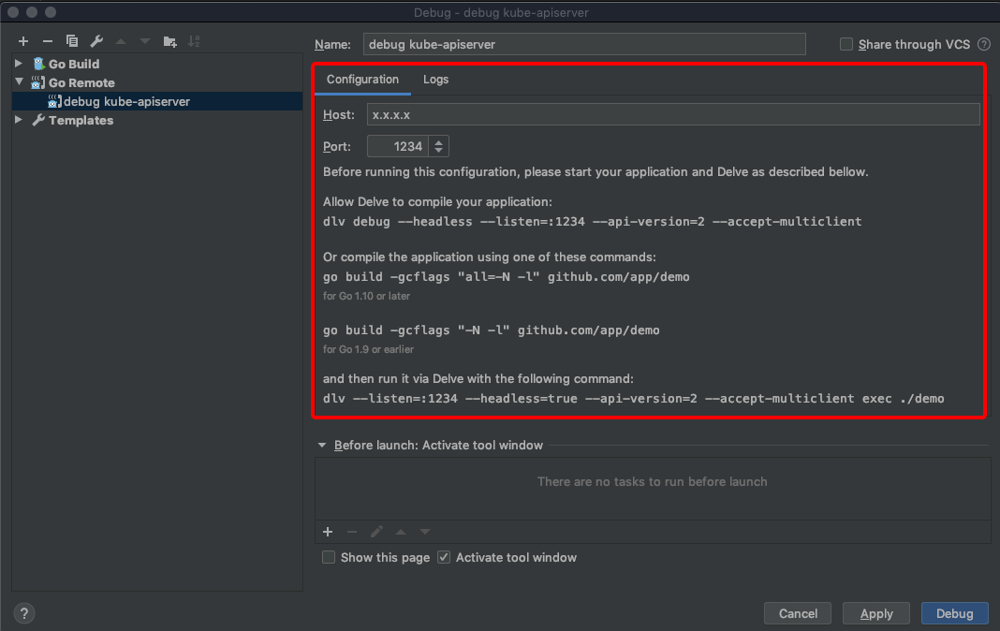
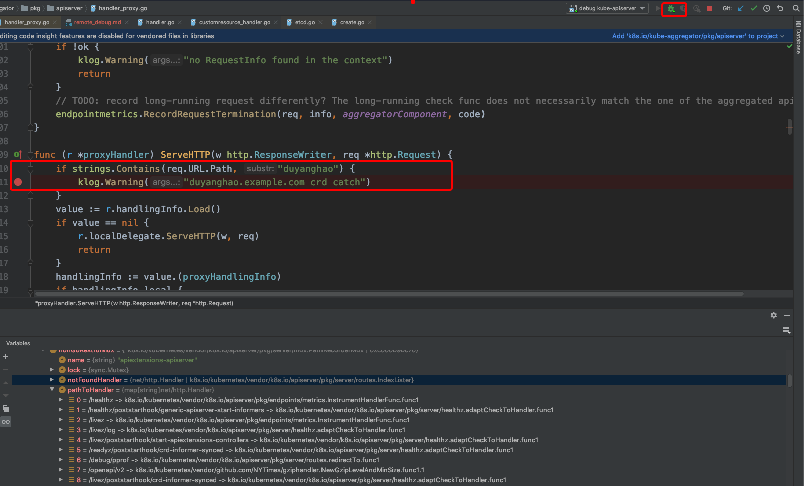

Kubernetes远程调试
=================

对于像Kubernetes这样代码庞大且高度抽象化的项目来说，单独的通过静态源码走读有时候会很累而且事倍功半。当函数以及接口调用链嵌入太深的时候(比如查找Custom Resource对应的CRUD APIServer处理逻辑)，就需要借助代码调试工具来阅读代码

而单纯的利用dlv以及gdb工具来调试Kubernetes不具备实际意义，这里只介绍利用Goland IDE远程debug Kubernetes

## 编译选项

Kubernetes v1.18.3在`k8s.io/kubernetes/hack/lib/golang.sh`中设置了`-s -w`选项来禁用符号表以及debug信息，因此在编译Kubernetes组件进行远程调试时需要去掉这两个限制，如下：

```bash
-    goldflags="${GOLDFLAGS=-s -w} $(kube::version::ldflags)"
+    #goldflags="${GOLDFLAGS=-s -w} $(kube::version::ldflags)"
+    goldflags="${GOLDFLAGS:-} $(kube::version::ldflags)"
```

之后可以对Kubernetes组件进行编译，如下：

```bash
$ GO111MODULE=off KUBE_GIT_TREE_STATE=clean make all GOGCFLAGS="all=-N -l"
```

也可以单独编译某个组件：

```bash
$ GO111MODULE=off KUBE_GIT_TREE_STATE=clean make kube-apiserver GOGCFLAGS="all=-N -l"
```

## Goland IDE远程调试原理

Goland IDE通过连接dlv debug server来对Golang进行远程调试，如下：



这里配置很简单，只需要配置远端的dlv debug server监听地址(Host)以及端口(Port)即可。同时远端通过如下命令启动相应的组件：

```bash
$ dlv --listen=:1234 --headless=true --api-version=2 --accept-multiclient exec ./demo
```

## 调试步骤

下面展开介绍具体Kubernetes核心组件的调试步骤：

* kube-apiserver

  step1：通过Goland IDE界面Run=>Debug=>Edit Configurations新增Go Remote debug条目，同时配置相关Host以及Port

  step2：停止kube-apiserver

  由于kube-apiserver是以static pod类型启动的，因此在debug之前需要先停止服务：

  ```bash
  $ mv /etc/kubernetes/manifests/kube-apiserver.yaml /root/
  ```

  step3：dlv启动kube-apiserver

  查看kube-apiserver启动命令，如下：

  ```bash
  $ cat /etc/kubernetes/manifests/kube-apiserver.yaml 
  ...
    - command:
      - kube-apiserver
      - --advertise-address=x.x.x.x
      - --allow-privileged=true
      - --authorization-mode=Node,RBAC
      - --client-ca-file=/etc/kubernetes/pki/ca.crt
      - --enable-admission-plugins=NodeRestriction
      - --enable-bootstrap-token-auth=true
      - --etcd-cafile=/etc/kubernetes/pki/etcd/ca.crt
      - --etcd-certfile=/etc/kubernetes/pki/apiserver-etcd-client.crt
      - --etcd-keyfile=/etc/kubernetes/pki/apiserver-etcd-client.key
      - --etcd-servers=https://127.0.0.1:2379
      - --insecure-port=0
      - --kubelet-client-certificate=/etc/kubernetes/pki/apiserver-kubelet-client.crt
      - --kubelet-client-key=/etc/kubernetes/pki/apiserver-kubelet-client.key
      - --kubelet-preferred-address-types=InternalIP,ExternalIP,Hostname
      - --proxy-client-cert-file=/etc/kubernetes/pki/front-proxy-client.crt
      - --proxy-client-key-file=/etc/kubernetes/pki/front-proxy-client.key
      - --requestheader-allowed-names=front-proxy-client
      - --requestheader-client-ca-file=/etc/kubernetes/pki/front-proxy-ca.crt
      - --requestheader-extra-headers-prefix=X-Remote-Extra-
      - --requestheader-group-headers=X-Remote-Group
      - --requestheader-username-headers=X-Remote-User
      - --secure-port=6443
      - --service-account-key-file=/etc/kubernetes/pki/sa.pub
      - --service-cluster-ip-range=194.70.255.0/24
      - --service-node-port-range=80-60000
      - --tls-cert-file=/etc/kubernetes/pki/apiserver.crt
      - --tls-private-key-file=/etc/kubernetes/pki/apiserver.key
      - --token-auth-file=/etc/kubernetes/known_tokens.csv
  ...
  ```

  通过dlv启动kube-apiserver，如下：

  ```bash
  $ dlv exec ./kube-apiserver --headless -l x.x.x.x:1234 --api-version=2 --accept-multiclient -- \
      --advertise-address=x.x.x.x \
      --allow-privileged=true \
      --authorization-mode=Node,RBAC \
      --client-ca-file=/etc/kubernetes/pki/ca.crt \
      --enable-admission-plugins=NodeRestriction \
      --enable-bootstrap-token-auth=true \
      --etcd-cafile=/etc/kubernetes/pki/etcd/ca.crt \
      --etcd-certfile=/etc/kubernetes/pki/apiserver-etcd-client.crt \
      --etcd-keyfile=/etc/kubernetes/pki/apiserver-etcd-client.key \
      --etcd-servers=https://127.0.0.1:2379 \
      --insecure-port=0 \
      --kubelet-client-certificate=/etc/kubernetes/pki/apiserver-kubelet-client.crt \
      --kubelet-client-key=/etc/kubernetes/pki/apiserver-kubelet-client.key \
      --kubelet-preferred-address-types=InternalIP,ExternalIP,Hostname \
      --proxy-client-cert-file=/etc/kubernetes/pki/front-proxy-client.crt \
      --proxy-client-key-file=/etc/kubernetes/pki/front-proxy-client.key \
      --requestheader-allowed-names=front-proxy-client \
      --requestheader-client-ca-file=/etc/kubernetes/pki/front-proxy-ca.crt \
      --requestheader-extra-headers-prefix=X-Remote-Extra- \
      --requestheader-group-headers=X-Remote-Group \
      --requestheader-username-headers=X-Remote-User \
      --secure-port=6443 \
      --service-account-key-file=/etc/kubernetes/pki/sa.pub \
      --service-cluster-ip-range=194.70.255.0/24 \
      --service-node-port-range=80-60000 \
      --tls-cert-file=/etc/kubernetes/pki/apiserver.crt \
      --tls-private-key-file=/etc/kubernetes/pki/apiserver.key \
      --token-auth-file=/etc/kubernetes/known_tokens.csv
  API server listening at: x.x.x.x:1234          
  ```

  step4：设置kube-apiserver代码断点并调试

  在Goland IDE中设置kube-apiserver的相关断点，并点击Debug(绿色小瓢虫按钮)进行调试：

  

  具体调试技巧这里不展开介绍

  kube-scheduler以及kube-controller调试步骤和kube-apiserver基本一致，这里不再赘述

  **需要注意的是：由于kube-apiserver一直会有请求过来，所以如果要调试kube-apiserver，则可能需要在代码中嵌入一些条件语句以便触发断点，如上所示**

* kube-proxy

  kube-proxy以daemonset形式启动，先看看daemonset相关启动参数：

  ```yaml
  # daemonset/kube-proxy    
      ...
      spec:
        containers:
        - command:
          - /usr/local/bin/kube-proxy
          - --config=/var/lib/kube-proxy/config.conf
          - --hostname-override=$(NODE_NAME)
          volumeMounts:
          - mountPath: /var/lib/kube-proxy
            name: kube-proxy
          - mountPath: /run/xtables.lock
            name: xtables-lock
          - mountPath: /lib/modules
            name: lib-modules
            readOnly: true
        ...    
        volumes:
        - configMap:
            defaultMode: 420
            name: kube-proxy
          name: kube-proxy
        - hostPath:
            path: /run/xtables.lock
            type: FileOrCreate
          name: xtables-lock
        - hostPath:
            path: /lib/modules
            type: ""
          name: lib-modules
        ...   
  # configmap/kube-proxy
  apiVersion: v1
  data:
    config.conf: |-
      ...
    kubeconfig.conf: |-
      ...
  kind: ConfigMap
  ...
  ```

  kube-proxy configmap中主要包含两部分：config.conf以及kubeconfig.conf，这里可以将config.conf的内容存放到单独的一个文件config.conf中，而kubeconfig.conf的内容则可以直接用$HOME/.kube/config进行替代

  因此debug kube-proxy步骤如下：

  step1：通过Goland IDE界面Run=>Debug=>Edit Configurations新增Go Remote debug条目，同时配置相关Host以及Port

  step2：停止kube-proxy

  这里为了不影响其它母机上的kube-proxy，可以通过设置node标签以及nodeSelector的方式将某一个节点的kube-proxy停止：

  ```bash
  $ kubectl label nodes <node-name> <label-key>=<label-value>
  ```

  step3：dlv启动kube-proxy

  启动命令如下：

  ```bash
  $ dlv exec ./kube-proxy --headless -l x.x.x.x:1234 --api-version=2 --accept-multiclient -- \
  --config=./config.conf \
  --hostname-override=nodeName
  ```

  **注意nodeName替换成实际节点名称**

  step4：设置kube-proxy代码断点并调试

* kubelet

  kubelet与上述组件的启动方式都不同，是通过systemd管理的：

  ```bash
  $ cat /usr/lib/systemd/system/kubelet.service.d/10-kubeadm.conf 
  # Note: This dropin only works with kubeadm and kubelet v1.11+
  [Service]
  Environment="KUBELET_KUBECONFIG_ARGS=--bootstrap-kubeconfig=/etc/kubernetes/bootstrap-kubelet.conf --kubeconfig=/etc/kubernetes/kubelet.conf"
  Environment="KUBELET_CONFIG_ARGS=--config=/var/lib/kubelet/config.yaml"
  # This is a file that "kubeadm init" and "kubeadm join" generates at runtime, populating the KUBELET_KUBEADM_ARGS variable dynamically
  EnvironmentFile=-/var/lib/kubelet/kubeadm-flags.env
  # This is a file that the user can use for overrides of the kubelet args as a last resort. Preferably, the user should use
  # the .NodeRegistration.KubeletExtraArgs object in the configuration files instead. KUBELET_EXTRA_ARGS should be sourced from this file.
  EnvironmentFile=-/etc/sysconfig/kubelet
  ExecStart=
  ExecStart=/usr/bin/kubelet $KUBELET_KUBECONFIG_ARGS $KUBELET_CONFIG_ARGS $KUBELET_KUBEADM_ARGS $KUBELET_EXTRA_ARGS
  ```

  因此debug kubelet步骤如下：

  step1：通过Goland IDE界面Run=>Debug=>Edit Configurations新增Go Remote debug条目，同时配置相关Host以及Port

  step2：停止kubelet

  ```bash
  $ systemctl stop kubelet.service
  ```

  step3：dlv启动kubelet，如下：

  ```bash
  $ dlv exec ./kubelet --headless -l x.x.x.x:1234 --api-version=2 --accept-multiclient -- --bootstrap-kubeconfig=/etc/kubernetes/bootstrap-kubelet.conf --kubeconfig=/etc/kubernetes/kubelet.conf --config=/var/lib/kubelet/config.yaml --cgroup-driver=cgroupfs --hostname-override=x.x.x.x --network-plugin=cni ...
  ```

  其中`--cgroup-driver`后面部分是`/var/lib/kubelet/kubeadm-flags.env`文件内容，而`KUBELET_EXTRA_ARGS`参数在`/etc/sysconfig/kubelet`文件中

  step4：设置kubelet代码断点并调试

* 踩坑

  由于Kubernetes项目`vendor/k8s.io`下各目录是相应`staging/src/k8s.io`下目录的软链，如下：

  ```bash
  $ ls -al vendor/k8s.io/
  total 36
  drwxr-xr-x  9 xxx xxx 4096 Dec 17 12:39 .
  drwxr-xr-x 18 xxx xxx 4096 Dec 17 12:39 ..
  lrwxrwxrwx  1 xxx xxx   28 Dec 17 12:27 api -> ../../staging/src/k8s.io/api
  lrwxrwxrwx  1 xxx xxx   48 Dec 17 12:27 apiextensions-apiserver -> ../../staging/src/k8s.io/apiextensions-apiserver
  lrwxrwxrwx  1 xxx xxx   37 Dec 17 12:27 apimachinery -> ../../staging/src/k8s.io/apimachinery
  lrwxrwxrwx  1 xxx xxx   34 Dec 17 12:27 apiserver -> ../../staging/src/k8s.io/apiserver
  lrwxrwxrwx  1 xxx xxx   36 Dec 17 12:27 cli-runtime -> ../../staging/src/k8s.io/cli-runtime
  lrwxrwxrwx  1 xxx xxx   34 Dec 17 12:27 client-go -> ../../staging/src/k8s.io/client-go
  lrwxrwxrwx  1 xxx xxx   39 Dec 17 12:27 cloud-provider -> ../../staging/src/k8s.io/cloud-provider
  lrwxrwxrwx  1 xxx xxx   42 Dec 17 12:27 cluster-bootstrap -> ../../staging/src/k8s.io/cluster-bootstrap
  lrwxrwxrwx  1 xxx xxx   39 Dec 17 12:27 code-generator -> ../../staging/src/k8s.io/code-generator
  lrwxrwxrwx  1 xxx xxx   39 Dec 17 12:27 component-base -> ../../staging/src/k8s.io/component-base
  lrwxrwxrwx  1 xxx xxx   32 Dec 17 12:27 cri-api -> ../../staging/src/k8s.io/cri-api
  lrwxrwxrwx  1 xxx xxx   44 Dec 17 12:27 csi-translation-lib -> ../../staging/src/k8s.io/csi-translation-lib
  drwxr-xr-x  8 xxx xxx 4096 Dec 17 12:27 gengo
  drwxr-xr-x  3 xxx xxx 4096 Dec 17 12:27 heapster
  drwxr-xr-x  2 xxx xxx 4096 Dec 17 12:39 klog
  lrwxrwxrwx  1 xxx xxx   40 Dec 17 12:27 kube-aggregator -> ../../staging/src/k8s.io/kube-aggregator
  lrwxrwxrwx  1 xxx xxx   48 Dec 17 12:27 kube-controller-manager -> ../../staging/src/k8s.io/kube-controller-manager
  drwxr-xr-x  4 xxx xxx 4096 Dec 17 12:27 kube-openapi
  lrwxrwxrwx  1 xxx xxx   35 Dec 17 12:27 kube-proxy -> ../../staging/src/k8s.io/kube-proxy
  lrwxrwxrwx  1 xxx xxx   39 Dec 17 12:27 kube-scheduler -> ../../staging/src/k8s.io/kube-scheduler
  lrwxrwxrwx  1 xxx xxx   32 Dec 17 12:27 kubectl -> ../../staging/src/k8s.io/kubectl
  lrwxrwxrwx  1 xxx xxx   32 Dec 17 12:27 kubelet -> ../../staging/src/k8s.io/kubelet
  lrwxrwxrwx  1 xxx xxx   47 Dec 17 12:27 legacy-cloud-providers -> ../../staging/src/k8s.io/legacy-cloud-providers
  lrwxrwxrwx  1 xxx xxx   32 Dec 17 12:27 metrics -> ../../staging/src/k8s.io/metrics
  drwxr-xr-x  3 xxx xxx 4096 Dec 17 12:39 repo-infra
  lrwxrwxrwx  1 xxx xxx   41 Dec 17 12:27 sample-apiserver -> ../../staging/src/k8s.io/sample-apiserver
  lrwxrwxrwx  1 xxx xxx   42 Dec 17 12:27 sample-cli-plugin -> ../../staging/src/k8s.io/sample-cli-plugin
  lrwxrwxrwx  1 xxx xxx   42 Dec 17 12:27 sample-controller -> ../../staging/src/k8s.io/sample-controller
  drwxr-xr-x  3 xxx xxx 4096 Dec 17 12:27 system-validators
  drwxr-xr-x 16 xxx xxx 4096 Dec 17 12:27 utils
  ```

  因此本地修改代码可以直接在staging目录执行；但是设置断点要在vendor路径下(因为Golang编译是查找的vendor目录，而不是staging目录)