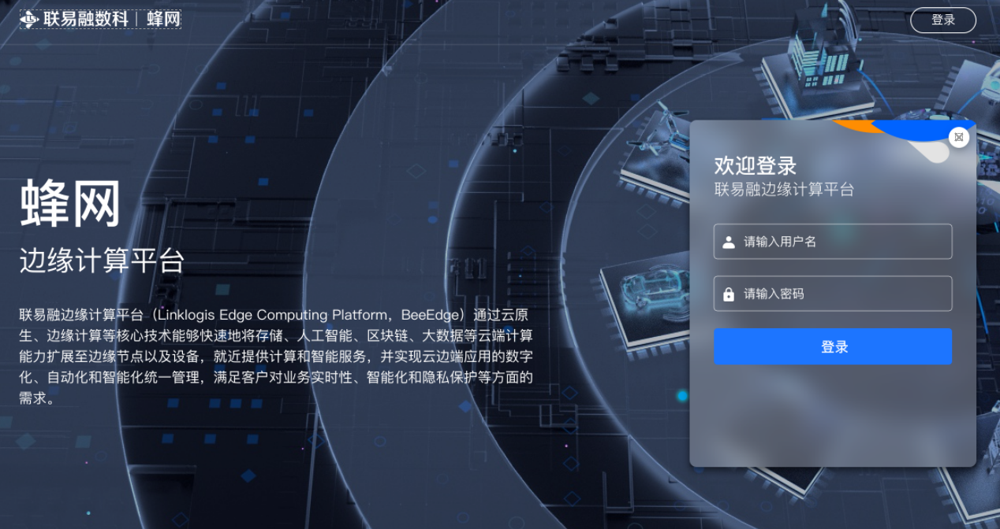
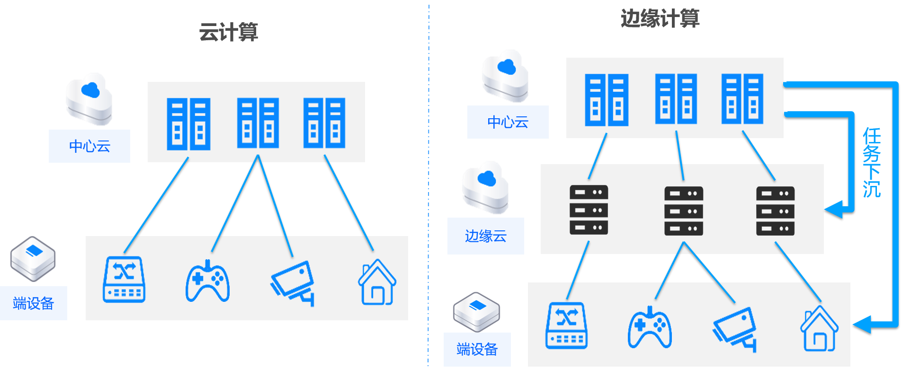
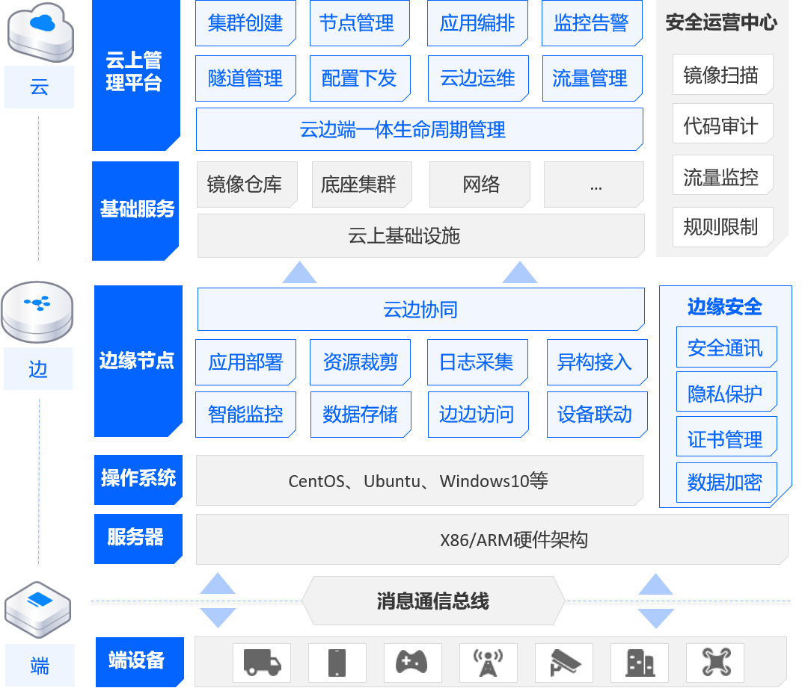
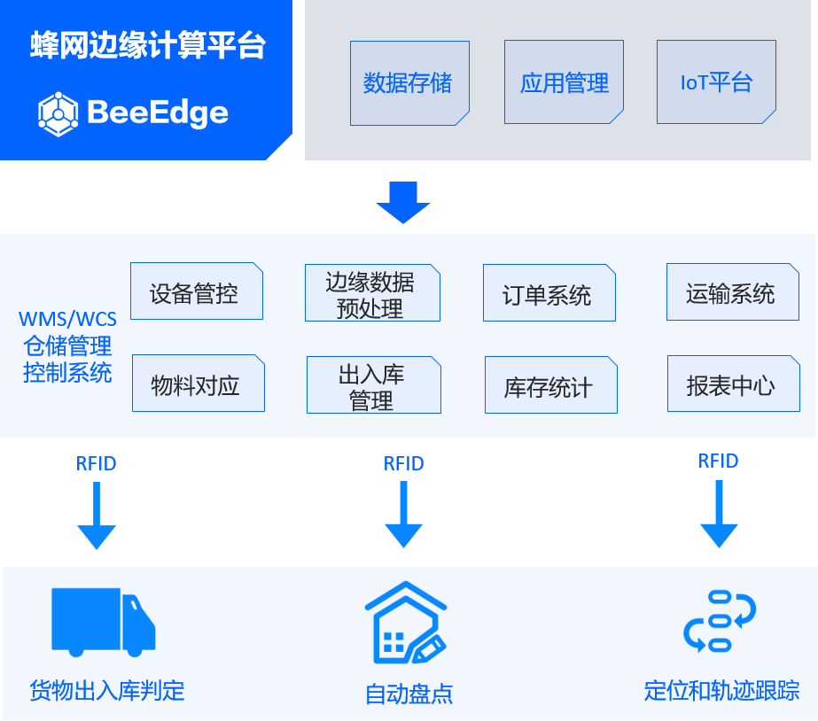
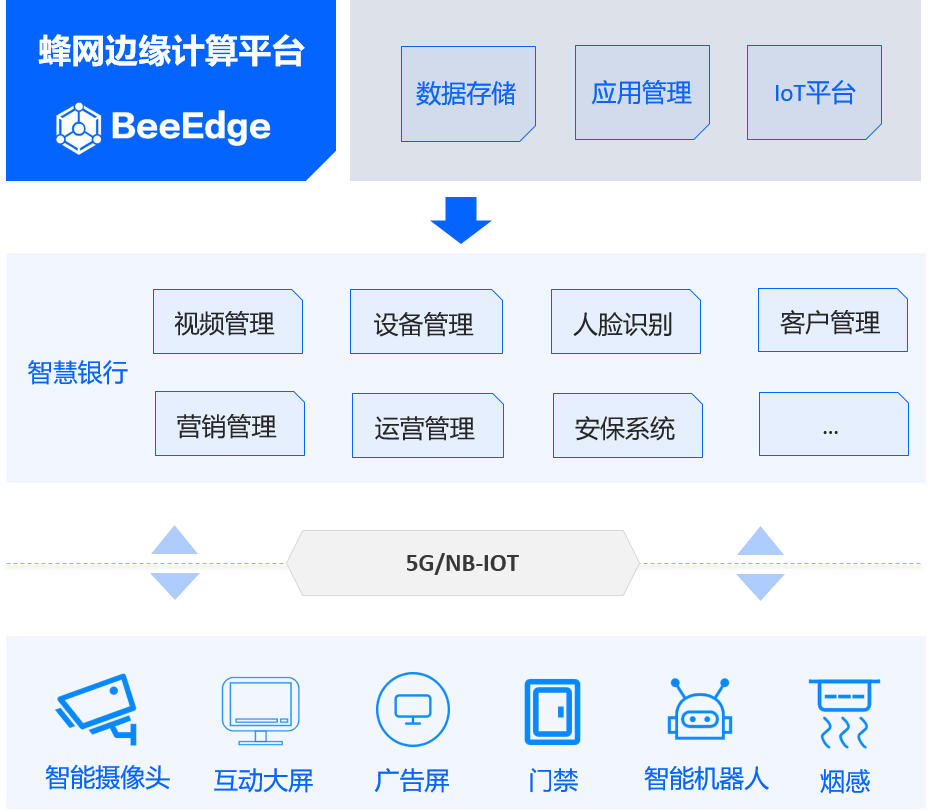
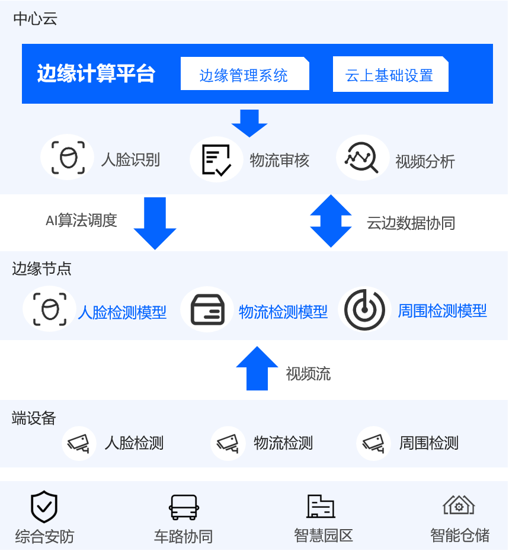
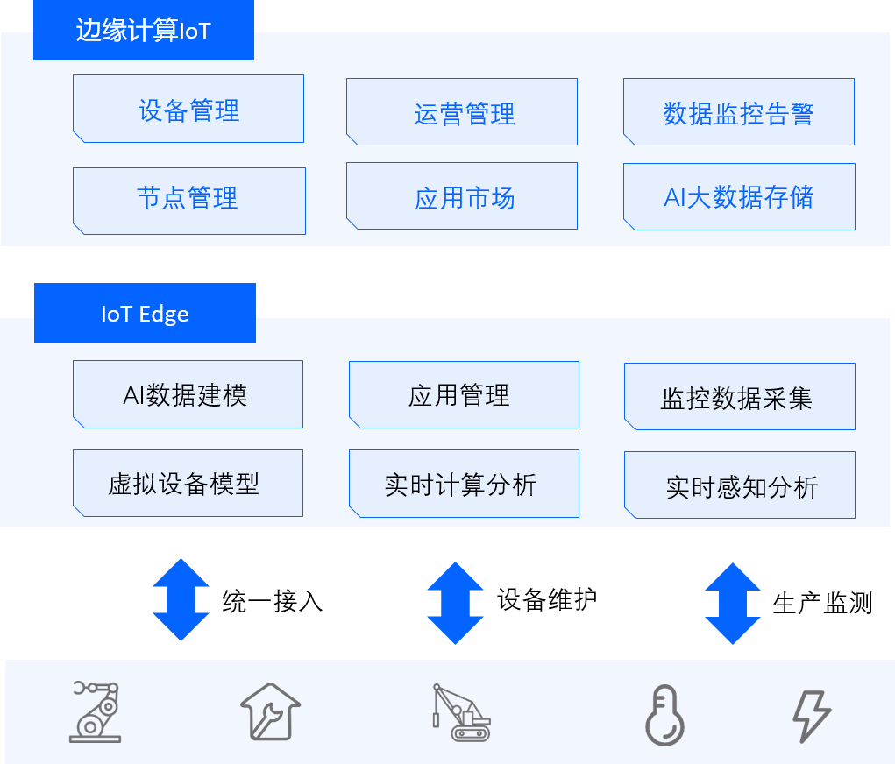
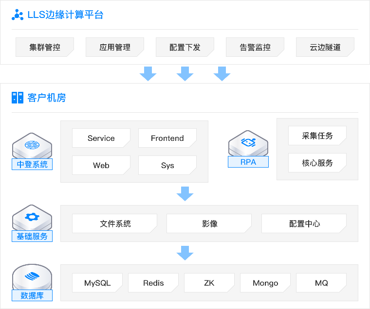
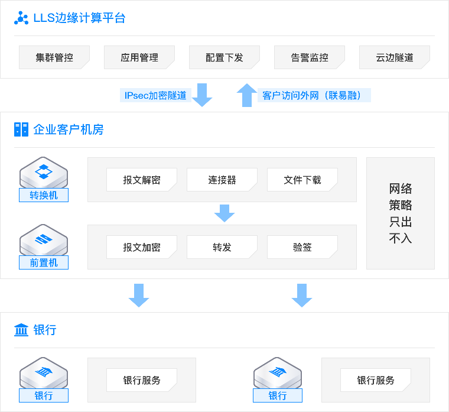

## 蜂网边缘计算平台

联易融蜂网边缘计算平台（Linklogis BeeEdge Computing Platform）是联易融管理边缘节点、设备与应用的技术服务平台。蜂网平台1.0.0版本于9月份上线，旨在通过云原生、边缘计算等核心技术快速地将存储、人工智能、区块链、大数据等云端计算能力扩展至边缘节点以及设备，就近提供计算和智能服务，并实现云边端应用的数字化、自动化和智能化统一管理，满足客户对业务实时性、智能化和隐私保护等方面的需求。

## 边缘计算概念简介

边缘计算的起源可以追溯到上世纪90年代，Akamai公司提出了内容分发网络（Content Delivery Network, CDN）的概念，通过在地理位置上更接近用户的位置引入网络节点，以缓存的方式实现图像、视频等内容的高速传输。2006年亚马逊首次提出“弹性计算云（Elastic Compute Cloud）”的概念，在计算、可视化和存储等方面开启了许多新的机遇。2009年CMU的Satyanarayanan教授引入了cloudlet作为边缘计算的早期示例形式，展示了一种双层架构，第一层称为云（高延迟），第二层称为cloudlet（低延迟），后者即是广泛分散的互联网基础设施组件，其计算周期和存储资源可以被附近的移动设备利用。此后，随着边缘计算模型的深入研究，学业界和工业界相继提出了移动边缘计算或多接入边缘计算（Mobile Edge Computing, Multi-access Edge Computing）。根据 Gartner 发布的年度新兴技术成熟度曲线，边缘计算已经从“触发期”进入“期望膨胀期”，是未来科技发展的一大重要趋势。

总的来说，边缘计算是为应用开发者和服务提供商在网络的边缘侧提供云服务和IT环境服务的一种分布式计算概念，边缘计算着重要解决的问题，是传统云计算（或者说是中央计算）模式下存在的高延迟、网络不稳定、低带宽以及安全隐私问题。对5G和物联网而言，边缘计算技术取得突破，意味着许多控制将通过本地设备实现而无需交由云端，处理过程将在本地完成，将大大提升处理效率，减轻云端的负荷。

## 蜂网边缘计算平台架构

蜂网边缘计算平台采用了业界普遍的云-边-端三层架构体系。位于最上层的边缘云管理平台提供集群创建、节点管理、应用治理、云边隧道等功能，实现边缘应用的全生命周期管控。其中基础云服务依托联易融强大的云原生能力，为边缘云管理平台提供了良好的平台和服务支撑。位于中间层的边缘节点服务旨在实现应用无感知边缘化，以及提供边端云原生、可扩展、易维护、安全可靠的基础设施，目前可兼容X86、ARM架构，同时支持CentOS、Ubuntu及Windows系列操作系统。位于最底层的“端”为设备层，可提供边缘设备的接入以及管理能力，如传感器、执行器以及各种智能设备等。

## 边缘计算典型落地场景

### 智慧仓储

智慧仓储能有效应对制造业复杂的货物进出管理业务，提升货物流转效率和库存周转率，大大降低企业库存积压和资金占用，让仓储管理更加准确、简单以及高效。通过边缘计算可以将智慧仓储解决方案沉降至业务现场，数据模型定期更新并下沉，在线或离线建立资产与人员之间的关系，从而提升企业的精细化管理水平并实现仓库管理的数字化转型。

### 智慧网点

在传统银行网点向智慧网点的转型过程中，边缘计算与5G、云计算、人工智能等技术的深度融合，必将爆发巨大的创新潜力，催生新型的服务模式和金融产品，从而全面提升服务水平。基于边缘计算“终端-边缘节点-云”三层链路，将智能推理从云端下沉到边缘节点。其中包括摄像头、互动大屏等终端设备负责感知和采集用户行为及周围环境的数据，边缘节点基于云端下发的模型对用户和环境变化进行推理、决策，云端则进行复杂的模型训练和持续优化。基于上述闭环，可实现客户身份识别、流量监控、用户行为分析、轨迹跟踪、热点区域分析、网点设备智能管控、抵质押物全流程跟踪、金库智慧化管理等创新应用。例如对于进入网点的客户，可通过智能摄像头识别用户身份，在边缘节点可智能推测用户偏好，实时推送至客户经理，实现智能引导、个性化产品或服务的精准推荐，有效提升服务质量和客户体验。基于上述基础技术框架，可扩展应用到银行风控、运营、营销、安防等方方面面的智能化。

### 智能监控

在园区、住宅、商超等视频监控场景下，通过边缘计算将AI能力下沉，对本地摄像头产生的视频进行预处理，可以实时感知异常事件，实现事前预防预判，事中监控指挥，事后回溯取证等业务优势。

### 智能制造

随着工业制造步入智能化时代，许多企业原有的生产工艺和自动化、智能化水平已经无法匹配下游客户对于产品质量的个性化需求。通过边缘计算可以实现大量不同类型工业生产设备的智能化生命周期管理，同时生产过程自动化、智能化，实现企业节能、降本、增效。

### AIoT

AIoT结合边缘计算和人工智能技术，在边缘侧进行实时、小数据处理、AI模型推理，实现智能检测；数据回传到云端进行长周期、大数据量处理，有效地解决AI在行业应用面临的海量数据处理、实时响应、数据安全等问题，为AI在更多行业应用落地奠定基础。

## 边缘计算与公司业务

边缘计算作为5G+物联网时代的关键技术，在上述的智慧仓储、智慧网点、智能监控、智能制造以及AIoT等场景下都会有广泛的应用。那具体到联易融以及供应链金融科技赛道，边缘计算又将发挥怎样的作用呢？下面介绍一下蜂网边缘计算平台在联易融的一些业务探索和思考。

### 智能中登

在多年的市场打磨下，联易融在供应链金融领域积累了很多轻量化能力，依靠蜂网边缘计算平台可以将这些轻量化能力输出到其它公司，探索更多的合作伙伴，构建供应链金融生态联盟。

智能中登是上述轻量化能力的典型代表。作为联易融的明星科技产品，利用领先的自动化+AI技术，大大提高了资产证券化中必不可少的资产核查和登记环节的自动化效率。对于合规及数据隐私要求较高的客户，蜂网边缘计算平台助力智能中登本地化，提供一键部署、一键更新的优质服务体验，并在保证客户隐私数据不出本地的前提下，也能安全接受SaaS云端推送的指令、模型。通过蜂网边缘计算平台，智能中登产品大大提高了产品竞争力和部署灵活性，同时也减少了客户的部署和运维成本。

### 财资管理

AI-CFO Mini是联易融推出的一款针对中小型企业客户的财务管理SaaS产品，利用自动化+AI技术，助力企业完成财务自动化、线上化转型。对于网络策略为只出不入，安全性要求较高的客户，蜂网边缘计算平台通过云边通信加密隧道帮助AI-CFO Mini打通业务流程，在无需客户改变网络策略的前提下也可进行AI-CFO Mini与银行前置机的通信，单向网络+加密隧道+转换器加解密的组合方案也大大提升了产品的整体技术架构安全等级。

### 边缘计算+区块链

区块链作为一项新型信息处理技术，其在表示价值、传递信任方面具有天然的优势，是“价值互联网”的核心要素。 边缘计算是5G系统针对低时延、高安全性、大带宽、汇聚流量大、海量物联、高可靠特定应用场景的新型解决方案。 5G时代，区块链与边缘计算的结合，将助力联易融面向供应链金融产业开拓to-B新市场。目前探索的合作模式主要会是整合区块链节点作为边缘计算节点进行集中管控，提高整个区块链底层架构的灵活性和管理效率。同时利用边缘计算云边网络方案解决多云跨地域部署模式下区块链节点的通信问题。

### 边缘计算+AI/大数据

通过边缘计算平台可以将联易融在供应链金融领域积累的强大AI/大数据SaaS能力延伸到边缘，通过支持视频智能分析、NLP文字识别、OCR图像识别、大数据流处理等能力，就近提供实时智能边缘服务，最终为供应链金融客户提供完整的云边协同的一体化解决方案。

## 蜂网边缘计算平台未来规划

供应链金融作为实体经济和金融的连接器，一直是国家大力支持的产业。而随着 5G 商用的推进，以及大视频、大数据、物联网等业务的蓬勃发展，边缘计算有望成为补充联易融在ABCD（AI、Blockchain、Cloud Computing、Big Data）科技能力输出上的“E”（Edge Computing）赛道，更好地支撑联易融推动供应链金融的数字化、智能化转型。

目前蜂网边缘计算平台正在参与信通院《基于云边协同的边缘容器技术要求》的认证，同时团队也积累了一些技术创新，已提交一篇软著以及6篇专利。未来也将会更多地参与到边缘社区与协议的建设中，增加联易融边缘计算的科技品牌影响力。值得特别提出的是，经过不懈的努力，目前蜂网团队已成功攻坚Windows系列操作系统兼容性难题，并将大规模应用到财资管理产品中，助力公司SME Tech条线实现百万获客。

在2022年，蜂网业务布局将聚焦在企业数字化转型和“碳中和”两个领域。依靠公司数字仓单抓手，与市场上智能仓储解决方案提供商以及上游设备厂商合作，为大型仓储企业提供整体智能仓储+数字仓单融资平台解决方案；同时，结合AI/大数据做算法层，依托边缘计算下发到设备端以及边缘端，联合上游厂商提供硬件，最终提供营销、运营、风控、安保等方面的银行智慧网点解决方案，助力银行数字化转型；另外，蜂网平台将会大力拓展工业端设备的接入和管理能力，目前也已经与一些物联网企业进行了合作洽谈，通过采集能耗、环保、设备维保等工业数据，与已有的工商大数据、司法大数据结合，上层做应用创新，孵化绿色金融、绿色供应链、智慧物联网等新型业务场景。