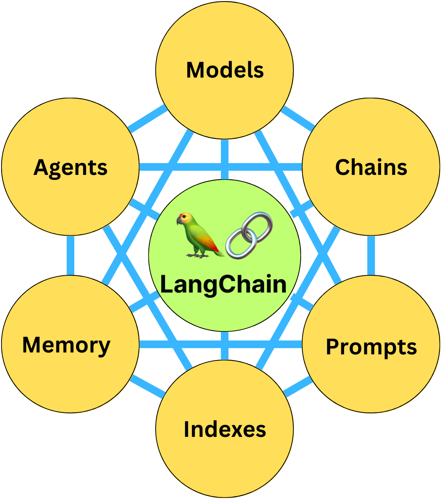
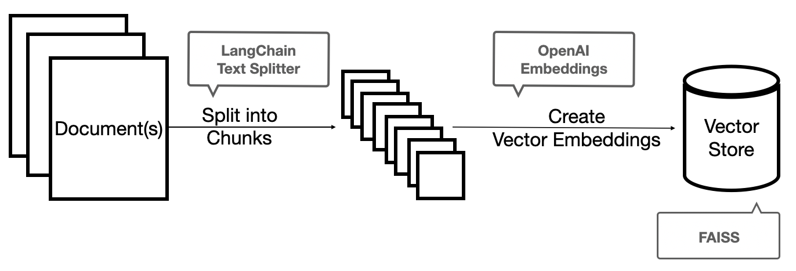
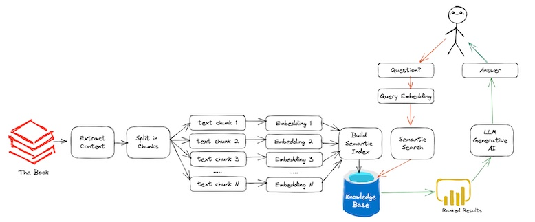

LangChain框架介绍及应用开发技术架构
===============================

## LangChain

### LangChain介绍

LangChain是一个由语言模型LLMs驱动的应用程序框架，它允许用户围绕大型语言模型快速构建应用程序和管道。 可以直接与OpenAI的ChatGPT模型以及Hugging Face集成。通过LangChain可快速构建聊天机器人、生成式问答(GQA)、本文摘要等应用场景。它和Java的Spring框架类似，框架本身提供多个组件，通过组件的拼接，可以快速开发应用

### LangChain功能组件

LangChain根据每个组件的作用，分为6大组件：

* Models：语言模型组件，为模型提供接口。LangChain支持的模型分为3种：
  * LLMs：基本的大语言模型，以文本字符串作为输入，最终返回生成的文本内容
  * 对话类模型：在LLMs的基础上，优化了对话的支持，以聊天消息列表作为输入，最终返回生成的聊天内容
  * 文本嵌入模型(Embedding model)：以文本作为输入，并返回向量，主要配合向量数据库使用
* Prompts：提示词组件，包括提示词模板管理，输出解析器（重构输出内容）等 
* Memory：记忆存储组件，用来保存和模型交互时的上下文状态
* Indexes：索引组件，用来结构化文档，以便和模型交互。索引根据文档解析的步骤可以分为以下工具：
  * 文档加载器：加载指定类型（如markdown，txt，json，pdf等）文档的内容到内置的数据结构内
  * 文档分割器：将文本内容，根据一定规则（如切割大小，是否是完整的句子，是否有上下文关系）分割加载的文件内容
  * 向量存储：通过调用向量数据库接口，将向量化后的数据存储到数据库。目前支持的向量数据库有Milvus，Chroma，FAISS，Pinecone等
  
  下图大致展示了数据导入到向量数据库的流程，通过加载文件，分割文件，文本嵌入模型将数据向量化，最终存储到向量数据库中：
  
* Chains：链组件，通过将上面的组件组合，实现特定功能。功能本身已经由链规定好，但是里面的组件可以变化。如Conversational Retrieval QA组件，通过组合不同的大模型，记忆存储，索引实现带上下文的对话功能
* Agents：代理组件，决定模型采取哪些行动，执行并且观察流程，直到完成为止。代理可以根据模型的选择，调用不同的链或者工具（如谷歌搜索工具，维基百科搜索工具）

### LangChain与CVP架构

LangChain串联了大模型与向量数据库，通过向量数据库集成领域知识库，为大模型提供长短期记忆，构建采用CVP（ChatGPT+Vector Database+Prompt-as-code）架构的大模型应用：

* 向量数据库：负责存储向量数据。如果这些数据是特定数据（如公司规范等），就可以打造特定的知识库（存了特定数据的向量数据库）
* 大语言模型：以ChatGPT为代表的大语言模型，国内开源大模型包括：ChatGLM2-6B（清华大学&智谱AI）、InternLM-7B（上海人工智能实验室&商汤科技）以及Baichuan-13B（百川智能）等
* LangChain：统一的大模型应用开发框架，对接大模型以及向量数据库，同时提供完善的功能组件（提示词组件、记忆存储组件以及链组件等），让用户方便快速搭建基于知识库的大语言模型应用

### LangChain能力分析

#### 优点

* 基于LangChain可快速搭建各种大语言模型相关的应用，如：问答机器人，代码解析生成，信息提取，文档总结等
* 作为统一的应用开发框架对接向量数据库以及大语言模型，规范应用编程框架
* 最流行的开源大语言模型框架，拥有良好的社区生态以及工具链

#### 缺点

* 框架新出不久（2022年11月发布），更新迭代较快，业界落地案例不够多，待实践验证
* 需要一定的学习成本才能较好运用

## 应用开发技术架构

应用开发技术架构分层如下：

* 大语言模型管理：包括对大语言模型的选型，微调，训练等
* LangChain框架开发维护：包括对LangChain各类组件进行定制化开发维护，如接入各类私有大语言模型以及新增Chain组件等
* 向量数据库全生命周期管理：包括对向量数据库的开发、部署、迁移、性能优化以及界面化操作等全生命周期管理
* 大模型应用：包括将LangChain集成到应用中，根据需求构建大模型应用

三、LangChain vs LangChain-ChatGLM

| \ | LangChain | LangChain-ChatGLM |
| :-----| :---- | :----: |
| 优点 | 1、更轻量：没有前端及web服务等内容，纯框架库 2、语言可选择：LangChain提供Python、Java，Go等语言的SDK，可以根据语言选择如何集成 3、灵活：可根据业务需求调用LangChain灵活定制应用  | 已经集成了一些大语言模型，减少一部分开发工作
|
| 缺点 | 有一定集成大语言模型的定制化工作 | 1、比较重。在LangChain基础上包装了很多服务，如果再增加一款新的大模型需要更多的开发量 2、语言约束，目前只能使用Python 3、不够灵活：目前只支持问答场景，其它场景则需要定制，改造成本大|

四、规划与展望

LangChain目前处于快速迭代更新的状态，缺乏成熟的应用经验和成功范例，后续会根据对LangChain的实际使用经验总结出基于LangChain构建大模型应用的最佳实践