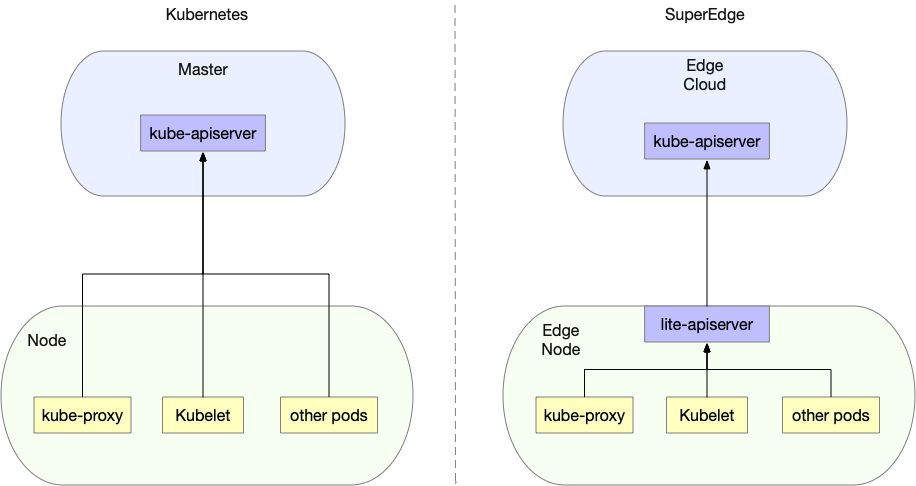
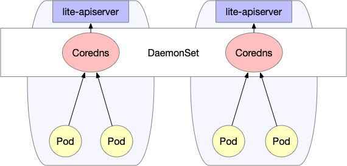

## 前言

[superedge](https://github.com/superedge/superedge)是腾讯推出的Kubernetes-native边缘计算管理框架。相比[openyurt](https://github.com/alibaba/openyurt)以及[kubeedge](https://github.com/kubeedge/kubeedge)，superedge除了具备Kubernetes零侵入以及边缘自治特性，还支持独有的分布式健康检查以及边缘服务访问控制等高级特性，极大地消减了云边网络不稳定对服务的影响，同时也很大程度上方便了边缘集群服务的发布与治理

## 特性

* Kubernetes-native：superedge在原生Kubernetes基础上进行了扩展，增加了边缘计算的某干组件，对Kubernetes完全无侵入；另外通过简单部署superedge核心组件就可以使原生Kubernetes集群开启边缘计算功能；另外零侵入使得可以在边缘集群上部署任何Kubernetes原生工作负载(deployment, statefulset, daemonset, and etc)
* 边缘自治：superedge提供L3级别的边缘自治能力，当边端节点与云端网络不稳定或者断连时，边缘节点依旧可以正常运行，不影响已经部署的边缘服务
* 分布式健康检查：superedge提供边端分布式健康检查能力，每个边缘节点会部署edge-health，同一个边缘集群中的边缘节点会相互进行健康检查，对节点进行状态投票。这样即便云边网络存在问题，只要边缘端节点之间的连接正常，就不会对该节点进行驱逐；另外，分布式健康检查还支持分组，把集群节点分成多个组(同一个机房的节点分到同一个组中)，每个组内的节点之间相互检查，这样做的好处是避免集群规模增大后节点之间的数据交互特别大，难以达成一致；同时也适应边缘节点在网络拓扑上天然就分组的情形。整个设计避免了由于云边网络不稳定造成的大量的pod迁移和重建，保证了服务的稳定
* 服务访问控制：superedge自研了ServiceGroup实现了基于边缘计算的服务访问控制。基于该特性只需构建DeploymentGrid以及ServiceGrid两种Custom Resource，就可以便捷地在共属同一个集群的不同机房或区域中各自部署一组服务，并且使得各个服务间的请求在本机房或本地域内部即可完成(闭环)，避免了服务跨地域访问。利用该特性可以极大地方便边缘集群服务的发布与治理
* 云边隧道：superedge支持自建隧道(目前支持TCP, HTTP and HTTPS)打通不同网络环境下的云边连接问题。实现对无公网IP边缘节点的统一操作和维护

## 整体架构


组件功能总结如下：

### 云端组件

云端除了边缘集群部署的原生Kubernetes master组件(cloud-kube-apiserver，cloud-kube-controller以及cloud-kube-scheduler)外，主要管控组件还包括：

* [**tunnel-cloud**](https://github.com/superedge/superedge/blob/main/docs/components/tunnel.md): 负责维持与边缘节点[**tunnel-edge**](https://github.com/superedge/superedge/blob/main/docs/components/tunnel.md)的网络隧道，目前支持TCP/HTTP/HTTPS协议
* [**application-grid controller**](https://github.com/superedge/superedge/blob/main/docs/components/service-group.md)：服务访问控制ServiceGroup对应的Kubernetes Controller，负责管理DeploymentGrids以及ServiceGrids CRDs，并由这两种CR生成对应的Kubernetes deployment以及service，同时自研实现服务拓扑感知，使得服务闭环访问
* [**edge-admission**](https://github.com/superedge/superedge/blob/main/docs/components/edge-health.md): 通过边端节点分布式健康检查的状态报告决定节点是否健康，并协助cloud-kube-controller执行相关处理动作(打taint)

### 边缘组件

边端除了原生Kubernetes worker节点需要部署的kubelet，kube-proxy外，还添加了如下边缘计算组件：

* [**lite-apiserver**](https://github.com/superedge/superedge/blob/main/docs/components/lite-apiserver.md)：边缘自治的核心组件，是cloud-kube-apiserver的代理服务，缓存了边缘节点组件对apiserver的某些请求，当遇到这些请求而且与cloud-kube-apiserver网络存在问题的时候会直接返回给client端
* [**edge-health**](https://github.com/superedge/superedge/blob/main/docs/components/edge-health.md): 边端分布式健康检查服务，负责执行具体的监控和探测操作，并进行投票选举判断节点是否健康
* [**tunnel-edge**](https://github.com/superedge/superedge/blob/main/docs/components/tunnel.md)：负责建立与云端边缘集群[**tunnel-cloud**](https://github.com/superedge/superedge/blob/main/docs/components/tunnel.md)的网络隧道，并接受API请求，转发给边缘节点组件(kubelet)
* application-grid wrapper：与application-grid controller结合完成ServiceGrid内的闭环服务访问(服务拓扑感知)

## 功能概述

### [应用部署&服务访问控制](https://github.com/superedge/superedge/blob/main/docs/components/service-group.md)

superedge可以支持原生Kubernetes的所有工作负载的应用部署，包括：

* deployment
* statefulset
* daemonset
* job
* cronjob

而对于边缘计算应用来说，具备如下独特点：

- 边缘计算场景中，往往会在同一个集群中管理多个边缘站点，每个边缘站点内有一个或多个计算节点
- 同时希望在每个站点中都运行一组有业务逻辑联系的服务，每个站点内的服务是一套完整的功能，可以为用户提供服务
- 由于受到网络限制，有业务联系的服务之间不希望或者不能跨站点访问

为了解决上述问题，superedge创新性地构建了ServiceGroup概念，方便用户便捷地在共属同一个集群的不同机房或区域中各自部署一组服务，并且使得各个服务间的请求在本机房或本地域内部即可完成(闭环)，避免了服务跨地域访问

ServiceGroup中涉及几个关键概念：


#### NodeUnit

- NodeUnit通常是位于同一边缘站点内的一个或多个计算资源实例，需要保证同一NodeUnit中的节点内网是通的
- ServiceGroup组中的服务运行在一个NodeUnit之内
- ServiceGroup允许用户设置服务在一个NodeUnit中运行的pod(belongs to deployment)数量
- ServiceGroup能够把服务之间的调用限制在本NodeUnit内

#### NodeGroup

- NodeGroup包含一个或者多个 NodeUnit
- 保证在集合中每个NodeUnit上均部署ServiceGroup中的服务
- 当集群中增加NodeUnit时会自动将ServiceGroup中的服务部署到新增NodeUnit

#### ServiceGroup

- ServiceGroup包含一个或者多个业务服务
- 适用场景：
  * 业务需要打包部署；
  * 需要在每一个NodeUnit中均运行起来并且保证pod数量
  * 需要将服务之间的调用控制在同一个 NodeUnit 中，不能将流量转发到其他NodeUnit上
- 注意：ServiceGroup是一种抽象资源概念，一个集群中可以创建多个ServiceGroup

下面以一个具体例子说明ServiceGroup功能：

```bash
# step1: labels edge nodes
$ kubectl  get nodes
NAME    STATUS   ROLES    AGE   VERSION
node0   Ready    <none>   16d   v1.16.7
node1   Ready    <none>   16d   v1.16.7
node2   Ready    <none>   16d   v1.16.7
# nodeunit1(nodegroup and servicegroup zone1)
$ kubectl --kubeconfig config label nodes node0 zone1=nodeunit1  
# nodeunit2(nodegroup and servicegroup zone1)
$ kubectl --kubeconfig config label nodes node1 zone1=nodeunit2
$ kubectl --kubeconfig config label nodes node2 zone1=nodeunit2

# step2: deploy echo DeploymentGrid
$ cat <<EOF | kubectl --kubeconfig config apply -f -
apiVersion: superedge.io/v1
kind: DeploymentGrid
metadata:
  name: deploymentgrid-demo
  namespace: default
spec:
  gridUniqKey: zone1
  template:
    replicas: 2
    selector:
      matchLabels:
        appGrid: echo
    strategy: {}
    template:
      metadata:
        creationTimestamp: null
        labels:
          appGrid: echo
      spec:
        containers:
        - image: gcr.io/kubernetes-e2e-test-images/echoserver:2.2
          name: echo
          ports:
          - containerPort: 8080
            protocol: TCP
          env:
            - name: NODE_NAME
              valueFrom:
                fieldRef:
                  fieldPath: spec.nodeName
            - name: POD_NAME
              valueFrom:
                fieldRef:
                  fieldPath: metadata.name
            - name: POD_NAMESPACE
              valueFrom:
                fieldRef:
                  fieldPath: metadata.namespace
            - name: POD_IP
              valueFrom:
                fieldRef:
                  fieldPath: status.podIP
          resources: {}
EOF
deploymentgrid.superedge.io/deploymentgrid-demo created

# note that there are two deployments generated and deployed into both nodeunit1 and nodeunit2
$ kubectl  get deploy
NAME                            READY   UP-TO-DATE   AVAILABLE   AGE
deploymentgrid-demo-nodeunit1   2/2     2            2           5m50s
deploymentgrid-demo-nodeunit2   2/2     2            2           5m50s
$ kubectl  get pods -o wide
NAME                                             READY   STATUS    RESTARTS   AGE     IP            NODE    NOMINATED NODE   READINESS GATES
deploymentgrid-demo-nodeunit1-65bbb7c6bb-6lcmt   1/1     Running   0          5m34s   172.16.0.16   node0   <none>           <none>
deploymentgrid-demo-nodeunit1-65bbb7c6bb-hvmlg   1/1     Running   0          6m10s   172.16.0.15   node0   <none>           <none>
deploymentgrid-demo-nodeunit2-56dd647d7-fh2bm    1/1     Running   0          5m34s   172.16.1.12   node1   <none>           <none>
deploymentgrid-demo-nodeunit2-56dd647d7-gb2j8    1/1     Running   0          6m10s   172.16.2.9    node2   <none>           <none>

# step3: deploy echo ServiceGrid
$ cat <<EOF | kubectl --kubeconfig config apply -f -
apiVersion: superedge.io/v1
kind: ServiceGrid
metadata:
  name: servicegrid-demo
  namespace: default
spec:
  gridUniqKey: zone1
  template:
    selector:
      appGrid: echo
    ports:
    - protocol: TCP
      port: 80
      targetPort: 8080
EOF
servicegrid.superedge.io/servicegrid-demo created
# note that there is only one relevant service generated
$ kubectl  get svc
NAME                   TYPE        CLUSTER-IP        EXTERNAL-IP   PORT(S)   AGE
kubernetes             ClusterIP   192.168.0.1       <none>        443/TCP   16d
servicegrid-demo-svc   ClusterIP   192.168.6.139     <none>        80/TCP    10m

# step4: access servicegrid-demo-svc(service topology and closed-looped)
# execute on onde0
$ curl 192.168.6.139|grep "node name"
        node name:      node0
# execute on node1 and node2
$ curl 192.168.6.139|grep "node name"
        node name:      node2
$ curl 192.168.6.139|grep "node name"
        node name:      node1        
```

通过上面的例子总结ServiceGroup如下：

- NodeUnit和NodeGroup以及ServiceGroup都是一种概念，具体来说实际使用中对应关系如下：
  - NodeUnit是具有相同label key以及value的一组边缘节点
  - NodeGroup是具有相同label key的一组NodeUnit(不同value)
  - ServiceGroup具体由两种CRD构成：DepolymentGrid以及ServiceGrid，具备相同的gridUniqKey
  - gridUniqKey值与NodeGroup的label key对应，也即ServiceGroup是与NodeGroup一一对应，而NodeGroup对应多个NodeUnit，同时NodeGroup中的每一个NodeUnit都会部署ServiceGroup对应deployment，这些deployment(deploymentgridName-NodeUnit命名)通过nodeSelector亲和性固定某个NodeUnit上，并通过服务拓扑感知限制在该NodeUnit内访问

### 分布式健康检查

边缘计算场景下，边缘节点与云端的网络环境十分复杂，连接并不可靠，在原生Kubernetes集群中，会造成apiserver和节点连接的中断，节点状态的异常，最终导致pod的驱逐和endpoint的缺失，造成服务的中断和波动，具体来说原生Kubernetes处理如下：

- 失联的节点被置为ConditionUnknown状态，并被添加NoSchedule和NoExecute的taints
- 失联的节点上的pod被驱逐，并在其他节点上进行重建
- 失联的节点上的pod从Service的Endpoint列表中移除

因此，边缘计算场景仅仅依赖边端和apiserver的连接情况是不足以判断节点是否异常的，会因为网络的不可靠造成误判，影响正常服务。而相较于云端和边缘端的连接，显然边端节点之间的连接更为稳定，具有一定的参考价值，因此superedge提出了边缘分布式健康检查机制。该机制中节点状态判定除了要考虑apiserver的因素外，还引入了节点的评估因素，进而对节点进行更为全面的状态判断。通过这个功能，能够避免由于云边网络不可靠造成的大量的pod迁移和重建，保证服务的稳定

具体来说，主要通过如下三个层面增强节点状态判断的准确性：

- 每个节点定期探测其他节点健康状态
- 集群内所有节点定期投票决定各节点的状态
- 云端和边端节点共同决定节点状态

而分布式健康检查最终的判断处理如下：

| 节点最终状态 | 云端判定正常 | 云端判定异常 |
|  ----  | ----  | ----  |
| 节点内部判定正常 | 正常 | 不再调度新的pod到该节点(NoSchedule taint) |
| 节点内部判定异常 | 正常 | 驱逐存量pod；从Endpoint列表摘除pod；不再调度新的pod到该节点 |

### 边缘自治

对于边缘计算的用户来说，他们除了想要享受Kubernetes自身带来的管理运维的便捷之外，同时也想具备弱网环境下的容灾能力，具体来说，如下：

- 节点即使和 master 失联，节点上的业务能继续运行
- 保证如果业务容器异常退出或者挂掉，kubelet 能继续拉起
- 还要保证节点**重启**后，业务能继续重新被拉起来
- 用户在厂房内部署的是**微服务**，需要保证节点重启后，同一个厂房内的微服务可以访问

而对于标准的Kubernentes，如果节点断网失联并且发生异常重启的行为后，现象如下：

- 失联的节点状态置为ConditionUnknown状态
- 失联的节点上的业务进程异常退出后，容器可以被拉起
- 失联的节点上的 Pod IP 从 Endpoint 列表中摘除
- 失联的节点发生重启后，容器全部消失不会被拉起

superedge自研的边缘自治就是为了解决上述问题的，具体来说边缘自治能达到如下效果：

- 节点会被置为ConditionUnknown状态，但是服务依旧可用(pod不会被驱逐以及从endpoint列表中剔除)
- 多节点断网情况下，Pod 业务正常运行，微服务能力正常提供
- 多节点断网情况下并重启后，Pod 会被重新拉起并正常运行
- 多节点断网情况下并重启后，所有的微服务可以被正常访问

其中，对于前两点来说可以通过上述介绍的分布式健康检查机制来实现，而后续两点可以通过lite-apiserver，网络快照以及DNS解决方案实现，如下：

#### lite-apiserver机制

superedge通过在边端加了一层镜像lite-apiserver组件，使得所有边端节点对于云端kube-apiserver的请求，都会指向lite-apiserver组件：



而lite-apiserver其实就是个代理，缓存了一些kube-apiserver请求，当遇到这些请求而且与apiserver不通的时候就直接返回给client：


总的来说：对于边缘节点的组件，lite-apiserver提供的功能就是kube-apiserver，但是一方面lite-apiserver只对本节点有效，另一方面资源占用很少。在网络通畅的情况下，lite-apiserver组件对于节点组件来说是透明的；而当网络异常情况，lite-apiserver组件会把本节点需要的数据返回给节点上组件，保证节点组件不会受网络异常情况影响

#### 网络快照

通过lite-apiserver可以实现边缘节点断网情况下重启后pod可以被正常拉起，但是根据原生Kubernetes原理，拉起后的pod ip会发生改变，这在某些情况下是不能允许的，为此superedge设计了网络快照机制保障边缘节点重启，pod拉起后ip保存不变。具体来说就是将节点上组件的网络信息定期快照，并在节点重启后进行恢复

#### 本地DNS解决方案

通过lite-apiserver以及网络快照机制可以保障边缘节点断网情况下重启后，Pod会被重新拉起并正常运行，同时微服务也运行正常。而服务之间相互访问就会涉及一个域名解析的问题：通常来说在集群内部我们使用coredns来做域名解析，且一般部署为Deployment形式，但是在边缘计算情况下，节点之间可能是不在一个局域网，很可能是跨可用区的，这个时候coredns服务就可能访问不通。为了保障dns访问始终正常，superedge设计了专门的本地dns解决方案，如下：



本地dns采用DaemonSet方式部署coredns，保证每个节点都有可用的coredns，同时修改每个节点上kubelet的启动参数`--cluster-dns`，将其指向本机私有IP(每个节点都相同)。这样就保证了即使在断网的情况下也能进行域名解析

#### 总结

总的来说，superedge是以lite-apiserver机制为基础，并结合分布式健康检查机制、网络快照以及本地coredns，保证了边缘容器集群在弱网环境下的网络可靠性。另外随着边缘自治的级别越高，所需要的组件会越来越多

### 云边隧道

最后介绍一下superedge的云边隧道，云边隧道主要用于：**代理云端访问边缘节点组件的请求，解决云端无法直接访问边缘节点的问题（边缘节点没有暴露在公网中）**

架构图如下所示：


实现原理为：

- 边缘节点上tunnel-edge主动连接云端tunnel-cloud service，tunnel-cloud service根据负载均衡策略将请求转到tunnel-cloud的具体pod上
- tunnel-edge与tunnel-cloud建立grpc连接后，tunnel-cloud会把自身的podIp和tunnel-edge所在节点的nodeName的映射写入DNS(tunnel dns)。grpc连接断开之后，tunnel-cloud会删除相关podIp和节点名的映射

而整个请求的代理转发流程如下：

- apiserver或者其它云端的应用访问边缘节点上的kubelet或者其它应用时，tunnel-dns通过DNS劫持(将host中的节点名解析为tunnel-cloud的podIp)把请求转发到tunnel-cloud的pod上
- tunnel-cloud根据节点名把请求信息转发到节点名对应的与tunnel-edge建立的grpc连接上
- tunnel-edge根据接收的请求信息请求边缘节点上的应用

## 总结

本文依次介绍了开源边缘计算框架SuperEdge的特性，整体架构以及主要功能和原理。其中分布式健康检查以及边缘集群服务访问控制ServiceGroup是SuperEdge独有的特性功能。分布式健康检查很大程度避免了由于云边网络不可靠造成的大量pod迁移和重建，保证了服务的稳定；而ServiceGroup则极大地方便了用户在共属同一个集群的不同机房或区域中各自部署一组服务，并且使得各个服务间的请求在本机房或本地域内部即可完成(闭环)，避免了服务跨地域访问。除此之外还有边缘自治以及云边隧道等功能。整体来说，SuperEdge采用无侵入的方式构建边缘集群，在原有Kubernetes组件保留不变的基础上新增了一些组件完成边缘计算的功能，既保留了Kubernetes强大的编排系统，同时也具备完善的边缘计算能力