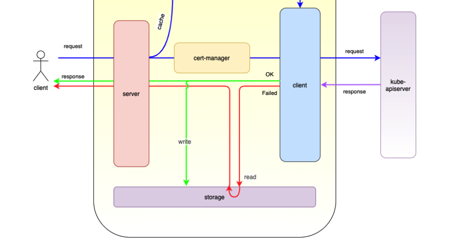

lite-apiserver
==============

## 功能

总的来说，superedge是以lite-apiserver机制为基础，并结合分布式健康检查等机制，保证了边缘容器集群在弱网环境下的网络可靠性。另外随着边缘自治的级别越高，所需要的组件会越来越多。本文分析lite-apiserver源码

superedge通过在边端加了一层镜像lite-apiserver组件，使得所有边端节点对于云端kube-apiserver的请求，都会指向lite-apiserver组件：


而lite-apiserver其实就是个代理，缓存了一些kube-apiserver请求，当遇到这些请求而且与apiserver不通的时候就直接返回给client：


总的来说：对于边缘节点的组件，lite-apiserver提供的功能就是kube-apiserver，但是一方面lite-apiserver只对本节点有效，另一方面资源占用很少。在网络通畅的情况下，lite-apiserver组件对于节点组件来说是透明的；而当网络异常情况，lite-apiserver组件会把本节点需要的数据返回给节点上组件，保证节点组件不会受网络异常情况影响

## 源码分析

下面将从源码角度分析lite-apiserver原理：

首先看一下整体的代码结构(标准的Kubernetes代码结构，cmd负责整体启动逻辑，pkg负责具体的执行逻辑)：

```bash
|-- cmd
...
|   |-- lite-apiserver
|   |   |-- apiserver.go
|   |   `-- app
|   |       |-- options
|   |       |   `-- options.go
|   |       `-- server.go
...
|-- pkg
|   |-- lite-apiserver
|   |   |-- cert
|   |   |   `-- cert_manager.go
|   |   |-- config
|   |   |   `-- config.go
|   |   |-- options
|   |   |   |-- server_options.go
|   |   |   |-- tls_options.go
|   |   |   `-- tls_options_test.go
|   |   |-- proxy
|   |   |   |-- controller.go
|   |   |   |-- handler.go
|   |   |   |-- proxy.go
|   |   |   |-- response.go
|   |   |   |-- transport.go
|   |   |   `-- util.go
|   |   |-- server
|   |   |   `-- server.go
|   |   `-- storage
|   |       |-- file_storage.go
|   |       `-- interface.go
```

入口：

```go
func main() {
	rand.Seed(time.Now().UnixNano())

	command := app.NewServerCommand()

	pflag.CommandLine.SetNormalizeFunc(cliflag.WordSepNormalizeFunc)
	pflag.CommandLine.AddGoFlagSet(goflag.CommandLine)
	logs.InitLogs()
	defer logs.FlushLogs()

	if err := command.Execute(); err != nil {
		os.Exit(1)
	}
}

func NewServerCommand() *cobra.Command {
	o := options.NewServerRunOptions()
	cmd := &cobra.Command{
		Use:  ComponentName,
		Long: `The lite-apiserver is the daemon for node, proxy all request for kube-apiserver. And cache all get request body`,
		// stop printing usage when the command errors
		SilenceUsage: true,
		RunE: func(cmd *cobra.Command, args []string) error {
			verflag.PrintAndExitIfRequested()

			klog.Infof("Versions: %+v\n", version.Get())
			util.PrintFlags(cmd.Flags())

			// complete all default server options
			if err := o.Complete(); err != nil {
				klog.Errorf("complete options error: %v", err)
				return err
			}

			// validate options
			if errs := o.Validate(); len(errs) != 0 {
				klog.Errorf("validate options error: %v", errs)
				return utilerrors.NewAggregate(errs)
			}

			return Run(o, util.SetupSignalHandler())
		},
		Args: func(cmd *cobra.Command, args []string) error {
			for _, arg := range args {
				if len(arg) > 0 {
					return fmt.Errorf("%q does not take any arguments, got %q", cmd.CommandPath(), args)
				}
			}
			return nil
		},
	}
	...

	return cmd
}

// Run runs the specified APIServer.  This should never exit.
func Run(serverOptions *options.ServerRunOptions, stopCh <-chan struct{}) error {

	server, err := server.CreateServer(serverOptions, stopCh)
	if err != nil {
		klog.Errorf("create lite-apiserver error: %v", err)
		return err
	}

	return server.Run()
}

type LiteServer struct {
	ServerConfig *config.LiteServerConfig
	stopCh       <-chan struct{}
}
```

标准的cobra.Command用法，执行逻辑在LiteServer.Run函数，如下：

```go
// github.com/superedge/superedge/pkg/lite-apiserver/server/server.go:52
func (s *LiteServer) Run() error {

	// prepare tls manager
	certManager := edgetls.NewCertManager(s.ServerConfig)
	err := certManager.Init()
	if err != nil {
		klog.Errorf("Init certManager error: %v", err)
		return err
	}

	cacher := proxy.NewRequestCacheController(s.ServerConfig, certManager)
	go cacher.Run(s.stopCh)

	edgeServerHandler, err := proxy.NewEdgeServerHandler(s.ServerConfig, certManager, cacher)
	if err != nil {
		klog.Errorf("Create edgeServerHandler error: %v", err)
		return err
	}

	mux := http.NewServeMux()
	mux.Handle("/", edgeServerHandler)
	mux.HandleFunc("/debug/flags/v", util.UpdateLogLevel)

	caCrt, err := ioutil.ReadFile(s.ServerConfig.CAFile)
	if err != nil {
		klog.Errorf("Read ca file err: %v", err)
		return err
	}
	pool := x509.NewCertPool()
	pool.AppendCertsFromPEM(caCrt)

	ser := &http.Server{
		Addr:    fmt.Sprintf("127.0.0.1:%d", s.ServerConfig.Port),
		Handler: mux,
		TLSConfig: &tls.Config{
			ClientCAs:  pool,
			ClientAuth: tls.VerifyClientCertIfGiven,
		},
	}
	go func() {
		klog.Infof("Listen on %s", ser.Addr)
		klog.Fatal(ser.ListenAndServeTLS(s.ServerConfig.CertFile, s.ServerConfig.KeyFile))
	}()

	//select {
	//case <-s.stopCh:
	//	klog.Info("Received a program exit signal")
	//	return nil
	//}
	<-s.stopCh
	klog.Info("Received a program exit signal")
	return nil
}
```

这里通过`ser.ListenAndServeTLS(s.ServerConfig.CertFile, s.ServerConfig.KeyFile)`启动了lite-apiserver服务，并监听指定端口。而具体的路由为mux。主要分两个路径：

* /debug/flags/v：动态更新lite-apiserver的日志级别，处理函数为UpdateLogLevel

  ```go
  func updateLogLevel(val string) (string, error) {
  	var level klog.Level
  	if err := level.Set(val); err != nil {
  		return "", fmt.Errorf("failed set klog.logging.verbosity %s: %v", val, err)
  	}
  	return "successfully set klog.logging.verbosity to " + val, nil
  }
  ```

* /：lite-apiserver根路径，用于处理边缘节点的所有请求，对应的处理处理函数为edgeServerHandler

接下来将主要针对edgeServerHandler进行跟踪，先看EdgeServerHandler结构体如下：

```go
// EdgeServerHandler is the real handler for each request
type EdgeServerHandler struct {
	timeout int
	// manager is to manager all cert declared in config, and gen correct transport
	manager *cert.CertManager

	// apiserverInfo is used to proxy to.
	apiserverUrl  string
	apiserverPort int

	// storage is to store/load history data
	storage storage.Storage

	// cacher hold request pair (list and watch for same path)
	// and update list data periodically
	cacher *RequestCacheController
}
```

其中apiserverUrl以及apiserverPort分别对应云端kube-apiserver的地址和端口，storage为lite-apiserver本地缓存，而cacher记录了所有边缘节点对lite-apiserver的请求，后续会展开介绍。这里我们看一下proxy.NewEdgeServerHandler具体的返回内容，如下：

```go
func (s *LiteServer) Run() error {
	...
	cacher := proxy.NewRequestCacheController(s.ServerConfig, certManager)
	go cacher.Run(s.stopCh)

	edgeServerHandler, err := proxy.NewEdgeServerHandler(s.ServerConfig, certManager, cacher)
	if err != nil {
		klog.Errorf("Create edgeServerHandler error: %v", err)
		return err
	}

	mux := http.NewServeMux()
	mux.Handle("/", edgeServerHandler)
	mux.HandleFunc("/debug/flags/v", util.UpdateLogLevel)
	...
}

func NewEdgeServerHandler(config *config.LiteServerConfig, manager *cert.CertManager, cacher *RequestCacheController) (http.Handler, error) {
	e := &EdgeServerHandler{
		apiserverUrl:  config.KubeApiserverUrl,
		apiserverPort: config.KubeApiserverPort,
		manager:       manager,
		storage:       storage.NewFileStorage(config),
		cacher:        cacher,
		timeout:       config.BackendTimeout,
	}
	return e.buildHandlerChain(e), nil
}

func (h *EdgeServerHandler) buildHandlerChain(edgeHandler http.Handler) http.Handler {
	cfg := &server.Config{
		LegacyAPIGroupPrefixes: sets.NewString(server.DefaultLegacyAPIPrefix),
	}
	resolver := server.NewRequestInfoResolver(cfg)
	handler := filters.WithRequestInfo(edgeHandler, resolver)
	return handler
}

func (h *EdgeServerHandler) ServeHTTP(w http.ResponseWriter, r *http.Request) {
	reverseProxy := NewEdgeReverseProxy(r, h.manager, h.apiserverUrl, h.apiserverPort, h.timeout, h.storage, h.cacher)
	reverseProxy.backendProxy.ServeHTTP(w, r)
}
```

这里我们关注buildHandlerChain函数：

```go
func (h *EdgeServerHandler) buildHandlerChain(edgeHandler http.Handler) http.Handler {
	cfg := &server.Config{
		LegacyAPIGroupPrefixes: sets.NewString(server.DefaultLegacyAPIPrefix),
	}
	resolver := server.NewRequestInfoResolver(cfg)
	handler := filters.WithRequestInfo(edgeHandler, resolver)
	return handler
}

func NewRequestInfoResolver(c *Config) *apirequest.RequestInfoFactory {
	apiPrefixes := sets.NewString(strings.Trim(APIGroupPrefix, "/")) // all possible API prefixes
	legacyAPIPrefixes := sets.String{}                               // APIPrefixes that won't have groups (legacy)
	for legacyAPIPrefix := range c.LegacyAPIGroupPrefixes {
		apiPrefixes.Insert(strings.Trim(legacyAPIPrefix, "/"))
		legacyAPIPrefixes.Insert(strings.Trim(legacyAPIPrefix, "/"))
	}

	return &apirequest.RequestInfoFactory{
		APIPrefixes:          apiPrefixes,
		GrouplessAPIPrefixes: legacyAPIPrefixes,
	}
}

type RequestInfoFactory struct {
	APIPrefixes          sets.String // without leading and trailing slashes
	GrouplessAPIPrefixes sets.String // without leading and trailing slashes
}

type RequestInfoResolver interface {
	NewRequestInfo(req *http.Request) (*RequestInfo, error)
}

// github.com/superedge/superedge/vendor/k8s.io/apiserver/pkg/endpoints/filters/requestinfo.go:27
// WithRequestInfo attaches a RequestInfo to the context.
func WithRequestInfo(handler http.Handler, resolver request.RequestInfoResolver) http.Handler {
	return http.HandlerFunc(func(w http.ResponseWriter, req *http.Request) {
		ctx := req.Context()
		info, err := resolver.NewRequestInfo(req)
		if err != nil {
			responsewriters.InternalError(w, req, fmt.Errorf("failed to create RequestInfo: %v", err))
			return
		}

		req = req.WithContext(request.WithRequestInfo(ctx, info))

		handler.ServeHTTP(w, req)
	})
}
```

可以看到返回了http.HandlerFunc，而对于边缘节点的Request，其具体处理逻辑如下：

```go
func(w http.ResponseWriter, req *http.Request) {
		ctx := req.Context()
		info, err := resolver.NewRequestInfo(req)
		if err != nil {
			responsewriters.InternalError(w, req, fmt.Errorf("failed to create RequestInfo: %v", err))
			return
		}

		req = req.WithContext(request.WithRequestInfo(ctx, info))

		handler.ServeHTTP(w, req)
}

// TODO write an integration test against the swagger doc to test the RequestInfo and match up behavior to responses
// NewRequestInfo returns the information from the http request.  If error is not nil, RequestInfo holds the information as best it is known before the failure
// It handles both resource and non-resource requests and fills in all the pertinent information for each.
// Valid Inputs:
// Resource paths
// /apis/{api-group}/{version}/namespaces
// /api/{version}/namespaces
// /api/{version}/namespaces/{namespace}
// /api/{version}/namespaces/{namespace}/{resource}
// /api/{version}/namespaces/{namespace}/{resource}/{resourceName}
// /api/{version}/{resource}
// /api/{version}/{resource}/{resourceName}
//
// Special verbs without subresources:
// /api/{version}/proxy/{resource}/{resourceName}
// /api/{version}/proxy/namespaces/{namespace}/{resource}/{resourceName}
//
// Special verbs with subresources:
// /api/{version}/watch/{resource}
// /api/{version}/watch/namespaces/{namespace}/{resource}
//
// NonResource paths
// /apis/{api-group}/{version}
// /apis/{api-group}
// /apis
// /api/{version}
// /api
// /healthz
// /
func (r *RequestInfoFactory) NewRequestInfo(req *http.Request) (*RequestInfo, error) {
	// start with a non-resource request until proven otherwise
	requestInfo := RequestInfo{
		IsResourceRequest: false,
		Path:              req.URL.Path,
		Verb:              strings.ToLower(req.Method),
	}

	currentParts := splitPath(req.URL.Path)
	if len(currentParts) < 3 {
		// return a non-resource request
		return &requestInfo, nil
	}

	if !r.APIPrefixes.Has(currentParts[0]) {
		// return a non-resource request
		return &requestInfo, nil
	}
	requestInfo.APIPrefix = currentParts[0]
	currentParts = currentParts[1:]

	if !r.GrouplessAPIPrefixes.Has(requestInfo.APIPrefix) {
		// one part (APIPrefix) has already been consumed, so this is actually "do we have four parts?"
		if len(currentParts) < 3 {
			// return a non-resource request
			return &requestInfo, nil
		}

		requestInfo.APIGroup = currentParts[0]
		currentParts = currentParts[1:]
	}

	requestInfo.IsResourceRequest = true
	requestInfo.APIVersion = currentParts[0]
	currentParts = currentParts[1:]

	// handle input of form /{specialVerb}/*
	if specialVerbs.Has(currentParts[0]) {
		if len(currentParts) < 2 {
			return &requestInfo, fmt.Errorf("unable to determine kind and namespace from url, %v", req.URL)
		}

		requestInfo.Verb = currentParts[0]
		currentParts = currentParts[1:]

	} else {
		switch req.Method {
		case "POST":
			requestInfo.Verb = "create"
		case "GET", "HEAD":
			requestInfo.Verb = "get"
		case "PUT":
			requestInfo.Verb = "update"
		case "PATCH":
			requestInfo.Verb = "patch"
		case "DELETE":
			requestInfo.Verb = "delete"
		default:
			requestInfo.Verb = ""
		}
	}

	// URL forms: /namespaces/{namespace}/{kind}/*, where parts are adjusted to be relative to kind
	if currentParts[0] == "namespaces" {
		if len(currentParts) > 1 {
			requestInfo.Namespace = currentParts[1]

			// if there is another step after the namespace name and it is not a known namespace subresource
			// move currentParts to include it as a resource in its own right
			if len(currentParts) > 2 && !namespaceSubresources.Has(currentParts[2]) {
				currentParts = currentParts[2:]
			}
		}
	} else {
		requestInfo.Namespace = metav1.NamespaceNone
	}

	// parsing successful, so we now know the proper value for .Parts
	requestInfo.Parts = currentParts

	// parts look like: resource/resourceName/subresource/other/stuff/we/don't/interpret
	switch {
	case len(requestInfo.Parts) >= 3 && !specialVerbsNoSubresources.Has(requestInfo.Verb):
		requestInfo.Subresource = requestInfo.Parts[2]
		fallthrough
	case len(requestInfo.Parts) >= 2:
		requestInfo.Name = requestInfo.Parts[1]
		fallthrough
	case len(requestInfo.Parts) >= 1:
		requestInfo.Resource = requestInfo.Parts[0]
	}

	// if there's no name on the request and we thought it was a get before, then the actual verb is a list or a watch
	if len(requestInfo.Name) == 0 && requestInfo.Verb == "get" {
		opts := metainternalversion.ListOptions{}
		if err := metainternalversionscheme.ParameterCodec.DecodeParameters(req.URL.Query(), metav1.SchemeGroupVersion, &opts); err != nil {
			// An error in parsing request will result in default to "list" and not setting "name" field.
			klog.Errorf("Couldn't parse request %#v: %v", req.URL.Query(), err)
			// Reset opts to not rely on partial results from parsing.
			// However, if watch is set, let's report it.
			opts = metainternalversion.ListOptions{}
			if values := req.URL.Query()["watch"]; len(values) > 0 {
				switch strings.ToLower(values[0]) {
				case "false", "0":
				default:
					opts.Watch = true
				}
			}
		}

		if opts.Watch {
			requestInfo.Verb = "watch"
		} else {
			requestInfo.Verb = "list"
		}

		if opts.FieldSelector != nil {
			if name, ok := opts.FieldSelector.RequiresExactMatch("metadata.name"); ok {
				if len(path.IsValidPathSegmentName(name)) == 0 {
					requestInfo.Name = name
				}
			}
		}
	}
	// if there's no name on the request and we thought it was a delete before, then the actual verb is deletecollection
	if len(requestInfo.Name) == 0 && requestInfo.Verb == "delete" {
		requestInfo.Verb = "deletecollection"
	}

	return &requestInfo, nil
}
```

最终转发给EdgeServerHandler.ServeHTTP处理，如下：

```go
func (h *EdgeServerHandler) ServeHTTP(w http.ResponseWriter, r *http.Request) {
	reverseProxy := NewEdgeReverseProxy(r, h.manager, h.apiserverUrl, h.apiserverPort, h.timeout, h.storage, h.cacher)
	reverseProxy.backendProxy.ServeHTTP(w, r)
}
```

该函数会首先创建reverseProxy，如下：

```go
// EdgeReverseProxy represents a real pair of http request and response
type EdgeReverseProxy struct {
	backendProxy *httputil.ReverseProxy

	userAgent   string
	method      string
	commonName  string
	urlString   string
	backendUrl  string
	backendPort int
	timeout     int

	storage     storage.Storage
	transport   *EdgeTransport
	certManager *cert.CertManager
	cacher      *RequestCacheController

	watch      bool
	list       bool
	needCache  bool
	selfUpdate bool
}

// github.com/superedge/superedge/pkg/lite-apiserver/proxy/proxy.go:71
func NewEdgeReverseProxy(r *http.Request, manager *cert.CertManager, backendUrl string, backendPort int, timeout int, s storage.Storage, cacher *RequestCacheController) *EdgeReverseProxy {
	isList, isWatch, needCache := getRequestProperties(r)
	p := &EdgeReverseProxy{
		certManager: manager,
		backendPort: backendPort,
		backendUrl:  backendUrl,
		timeout:     timeout,
		method:      r.Method,
		urlString:   r.URL.String(),
		storage:     s,
		cacher:      cacher,

		watch:     isWatch,
		list:      isList,
		needCache: needCache,
	}

	h, exist := r.Header[UserAgent]
	if !exist {
		p.userAgent = DefaultUserAgent
	} else {
		p.userAgent = strings.Split(h[0], " ")[0]
	}

	if r.TLS != nil {
		for _, cert := range r.TLS.PeerCertificates {
			if !cert.IsCA {
				p.commonName = cert.Subject.CommonName
				break
			}
		}
	}
	p.transport = p.newTransport()

	// set timeout for request, if overtime, we think request failed, and read cache
	if p.timeout > 0 {
		p.transport.tr.DialContext = (&net.Dialer{
			Timeout: time.Duration(p.timeout) * time.Second,
		}).DialContext
	}

	reverseProxy := &httputil.ReverseProxy{
		Director:       p.makeDirector,
		Transport:      p.transport,
		ModifyResponse: p.modifyResponse,
		ErrorHandler:   p.handlerError,
	}

	reverseProxy.FlushInterval = -1

	p.backendProxy = reverseProxy

	val := r.Header.Get(EdgeUpdateHeader)
	if len(val) != 0 {
		p.selfUpdate = true
		klog.V(4).Infof("Receive self update request, url->%s, time %s", r.URL.String(), val)
		r.Header.Del(EdgeUpdateHeader)
	}

	if (p.list || p.watch) && !p.selfUpdate {
		p.cacher.AddRequest(r, p.userAgent, p.list, p.watch)
	}

	klog.V(2).Infof("Create new reverse proxy, userAgent->%s, method->%s, url->%s", p.userAgent, p.method, p.urlString)
	return p
}

func (p *EdgeReverseProxy) newTransport() *EdgeTransport {
	klog.V(4).Infof("Receive request from %s", p.commonName)

	if len(p.commonName) == 0 {
		return &EdgeTransport{p.certManager.DefaultTransport()}
	}

	tr := p.certManager.Load(p.commonName)
	if tr == nil {
		klog.Warningf("Cannot load transport for %s. Use DefaultTransport", p.commonName)
		return &EdgeTransport{p.certManager.DefaultTransport()}
	}

	return &EdgeTransport{tr}
}

type EdgeTransport struct {
	tr *http.Transport
}

func (t EdgeTransport) RoundTrip(req *http.Request) (*http.Response, error) {
	return t.tr.RoundTrip(req)
}
```

EdgeReverseProxy是lite-apiserver真正的处理核心，逻辑如下：

* 由EdgeServerHandler提供参数创建EdgeReverseProxy
* 初始化EdgeReverseProxy.transport为EdgeTransport
* 设置EdgeReverseProxy.transport请求的超时时间
* 构建httputil.ReverseProxy，并将reverseProxy设置为EdgeReverseProxy.backendProxy
* 返回EdgeReverseProxy

在返回EdgeReverseProxy之后，会执行reverseProxy.backendProxy.ServeHTTP(w, r)对请求进行具体处理

因此重点就在如下代码段：

```go
reverseProxy := &httputil.ReverseProxy{
		Director:       p.makeDirector,
		Transport:      p.transport,
		ModifyResponse: p.modifyResponse,
		ErrorHandler:   p.handlerError,
	}

// ReverseProxy is an HTTP Handler that takes an incoming request and
// sends it to another server, proxying the response back to the
// client.
//
// ReverseProxy by default sets the client IP as the value of the
// X-Forwarded-For header.
//
// If an X-Forwarded-For header already exists, the client IP is
// appended to the existing values. As a special case, if the header
// exists in the Request.Header map but has a nil value (such as when
// set by the Director func), the X-Forwarded-For header is
// not modified.
//
// To prevent IP spoofing, be sure to delete any pre-existing
// X-Forwarded-For header coming from the client or
// an untrusted proxy.
type ReverseProxy struct {
	// Director must be a function which modifies
	// the request into a new request to be sent
	// using Transport. Its response is then copied
	// back to the original client unmodified.
	// Director must not access the provided Request
	// after returning.
	Director func(*http.Request)

	// The transport used to perform proxy requests.
	// If nil, http.DefaultTransport is used.
	Transport http.RoundTripper

	// FlushInterval specifies the flush interval
	// to flush to the client while copying the
	// response body.
	// If zero, no periodic flushing is done.
	// A negative value means to flush immediately
	// after each write to the client.
	// The FlushInterval is ignored when ReverseProxy
	// recognizes a response as a streaming response;
	// for such responses, writes are flushed to the client
	// immediately.
	FlushInterval time.Duration

	// ErrorLog specifies an optional logger for errors
	// that occur when attempting to proxy the request.
	// If nil, logging is done via the log package's standard logger.
	ErrorLog *log.Logger

	// BufferPool optionally specifies a buffer pool to
	// get byte slices for use by io.CopyBuffer when
	// copying HTTP response bodies.
	BufferPool BufferPool

	// ModifyResponse is an optional function that modifies the
	// Response from the backend. It is called if the backend
	// returns a response at all, with any HTTP status code.
	// If the backend is unreachable, the optional ErrorHandler is
	// called without any call to ModifyResponse.
	//
	// If ModifyResponse returns an error, ErrorHandler is called
	// with its error value. If ErrorHandler is nil, its default
	// implementation is used.
	ModifyResponse func(*http.Response) error

	// ErrorHandler is an optional function that handles errors
	// reaching the backend or errors from ModifyResponse.
	//
	// If nil, the default is to log the provided error and return
	// a 502 Status Bad Gateway response.
	ErrorHandler func(http.ResponseWriter, *http.Request, error)
}
```

ReverseProxy用来反向代理请求，将请求发送给其它server，并将回应转发给client，具体字段含义如下：

* Director：用来对原始请求进行修改，对修改后的请求通过ReverseProxy.Transport进行处理

* Transport：对backend server进行实际请求的http.RoundTripper
* FlushInterval：指定了ReverseProxy返回Response的flush周期
* ModifyResponse：ModifyResponse对从backend server返回后的Response进行修改，无论Response status code是什么值；只有当backend server不可访问时(backend is unreachable)，ModifyResponse不会进行调用，转用ErrorHandler进行处理。另外，如果ModifyResponse执行失败，返回错误了，也会调用ErrorHandler对该错误进行处理
* ErrorHandler：用来当backend server不可达以及ModifyResponse执行失败时调用，如果没有设置，默认处理行为是打印error并返回502 Status Bad Gateway response

接下来我们依次看看上述几个字段具体赋值：

```go
func (p *EdgeReverseProxy) makeDirector(req *http.Request) {
	klog.V(6).Infof("Director request is %+v", req)

	req.URL.Scheme = "https"
	req.URL.Host = fmt.Sprintf("%s:%d", p.backendUrl, p.backendPort)

	klog.V(6).Infof("Make new request %+v", req)
}
```

这里makeDirector将原始请求对URL Host以及Scheme替换了，对云端kube-apiserver发出请求

```go
func (p *EdgeReverseProxy) modifyResponse(res *http.Response) error {
   if !p.needCache {
      return nil
   }

   // cache response data
   p.writeCache(NewEdgeResponseDataHolder(res))
   return nil
}
```

这里modifyResponse对从云端kube-apiserver返回的Response进行了cache，具体逻辑后面分析

接下来看ErrorHandler的赋值，这个函数对应云端kube-apiserver不可达情况下的处理逻辑：

```go
func (p *EdgeReverseProxy) handlerError(rw http.ResponseWriter, req *http.Request, err error) {
	klog.Warningf("Request url %s, %s error %v", req.URL.Host, req.URL, err)
	defer func() {
		if p.watch {
			p.cacher.DeleteRequest(req, p.userAgent)
		}
	}()

	// filter error, if not ECONNREFUSED or ETIMEDOUT, not read cache and ignore
	if p.filterErrorToIgnore(err) {
		klog.V(4).Infof("Receive not syscall error %v", err)
		rw.WriteHeader(http.StatusBadGateway)
		_, err := rw.Write([]byte(err.Error()))
		if err != nil {
			klog.Errorf("Write error response err: %v", err)
		}
		return
	}

	klog.V(4).Infof("Request error, need read data from cache")

	// read cache when request error
	data, cacheErr := p.readCache()
	if cacheErr != nil {
		klog.Errorf("Read cache error %v, write though error", cacheErr)
		rw.WriteHeader(http.StatusBadGateway)
		_, err := rw.Write([]byte(err.Error()))
		if err != nil {
			klog.Errorf("Write read cache error: %v", err)
		}
		return
	}

	for k, v := range data.Header {
		for i := range v {
			rw.Header().Set(k, v[i])
		}
	}

	CopyHeader(rw.Header(), data.Header)
	rw.WriteHeader(data.Code)
	_, err = rw.Write(data.Body)
	if err != nil {
		klog.Errorf("Write cache response err: %v", err)
	}
}
```

handlerError对错误进行过滤，如果不是ECONNREFUSED or ETIMEDOUT错误 或者为Watch请求，则直接返回502 Status Bad Gateway response。否则读缓存获取相应的Response并返回

通过上述分析基本把如下流程分析完了：



这里最后我们看一下cache的读写逻辑。首先是modifyResponse中的writeCache：

```go
func (p *EdgeReverseProxy) modifyResponse(res *http.Response) error {
	if !p.needCache {
		return nil
	}

	// cache response data
	p.writeCache(NewEdgeResponseDataHolder(res))
	return nil
}

func NewEdgeResponseDataHolder(res *http.Response) *EdgeResponseDataHolder {
	d := &EdgeResponseDataHolder{}
	d.Body, res.Body = CopyByteFromReader(res.Body)
	d.Code = res.StatusCode
	d.Header = res.Header
	return d
}

// EdgeResponseDataHolder hold all data of a response
type EdgeResponseDataHolder struct {
	Code   int                 `json:"code"`
	Body   []byte              `json:"body"`
	Header map[string][]string `json:"header"`
}

func (holder *EdgeResponseDataHolder) Output() ([]byte, error) {
	res, err := json.Marshal(holder)
	if err != nil {
		return []byte{}, err
	}
	return res, nil
}

func (p *EdgeReverseProxy) writeCache(r *EdgeResponseDataHolder) {
	bodyBytes, err := r.Output()
	if err != nil {
		klog.Errorf("Write cache marshal %s error: %v", p.key(), err)
	}
	err = p.storage.Store(p.key(), bodyBytes)
	if err != nil {
		klog.Errorf("Write cache %s error: %v", p.key(), err)
	}
}

func (fs *FileStorage) Store(key string, data []byte) error {
	return fs.writeFile(key, data)
}

func (p *EdgeReverseProxy) key() string {
	return strings.ReplaceAll(fmt.Sprintf("%s_%s", p.userAgent, p.urlString), "/", "_")
}
```

如果请求云端kube-apiserver成功，则由Response构建EdgeResponseDataHolder(包括Response.Body，Response.StatusCode以及Response.Header），并将EdgeResponseDataHolder转化为json，存放到文件名为：key(由Request.UserAgent以及Request.URL拼接而成，eg：`kubectl_v1.16.7__api_v1_namespaces_default_pods?limit=500`)的文件中

接着分析请求云端kube-apiserver失败后readCache的逻辑，如下：

```go
// github.com/superedge/superedge/pkg/lite-apiserver/proxy/proxy.go:173
func (p *EdgeReverseProxy) handlerError(rw http.ResponseWriter, req *http.Request, err error) {
	...
	klog.V(4).Infof("Request error, need read data from cache")

	// read cache when request error
	data, cacheErr := p.readCache()
	if cacheErr != nil {
		klog.Errorf("Read cache error %v, write though error", cacheErr)
		rw.WriteHeader(http.StatusBadGateway)
		_, err := rw.Write([]byte(err.Error()))
		if err != nil {
			klog.Errorf("Write read cache error: %v", err)
		}
		return
	}

	for k, v := range data.Header {
		for i := range v {
			rw.Header().Set(k, v[i])
		}
	}

	CopyHeader(rw.Header(), data.Header)
	rw.WriteHeader(data.Code)
	_, err = rw.Write(data.Body)
	if err != nil {
		klog.Errorf("Write cache response err: %v", err)
	}
}

func (fs *FileStorage) Load(key string) ([]byte, error) {
	f, err := os.Open(filepath.Join(fs.filePath, key))
	if err != nil {
		klog.Errorf("open cache file %s error: %v", key, err)
		return []byte{}, err
	}
	defer f.Close()

	b, err := ioutil.ReadAll(f)
	if err != nil {
		klog.Errorf("read cache %s error: %v", key, err)
		return []byte{}, err
	}
	return b, nil
}

func (holder *EdgeResponseDataHolder) Input(in []byte) error {
	err := json.Unmarshal(in, holder)
	if err != nil {
		return err
	}
	return nil
}
```

可以看到根据请求从cache对应的文件中读取内容，转化为EdgeResponseDataHolder格式，并将EdgeResponseDataHolder中记录的内容写入http.Response相应字段，也即从cache读取Response并返回给client端

