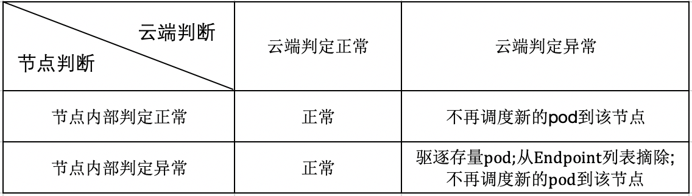
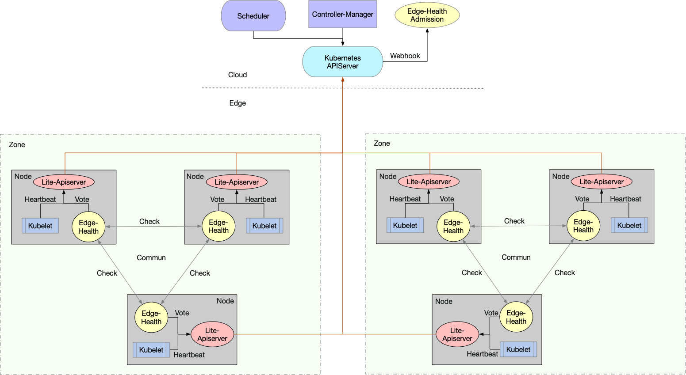

SuperEdge 分布式健康检查edge-health-daemon源码分析
==============================================

## 前言

边缘计算场景下，边缘节点与云端的网络环境十分复杂，连接并不可靠，在原生Kubernetes集群中，会造成apiserver和节点连接的中断，节点状态的异常，最终导致pod的驱逐和endpoint的缺失，造成服务的中断和波动，具体来说原生Kubernetes处理如下：

* 失联的节点被置为ConditionUnknown状态，并被添加NoSchedule和NoExecute的taints
* 失联的节点上的pod被驱逐，并在其他节点上进行重建
* 失联的节点上的pod从Service的Endpoint列表中移除

因此，边缘计算场景仅仅依赖边端和apiserver的连接情况是不足以判断节点是否异常的，会因为网络的不可靠造成误判，影响正常服务。而相较于云端和边缘端的连接，显然边端节点之间的连接更为稳定，具有一定的参考价值，因此superedge提出了边缘分布式健康检查机制。该机制中节点状态判定除了要考虑apiserver的因素外，还引入了节点的评估因素，进而对节点进行更为全面的状态判断。通过这个功能，能够避免由于云边网络不可靠造成的大量的pod迁移和重建，保证服务的稳定

具体来说，主要通过如下三个层面增强节点状态判断的准确性：

* 每个节点定期探测其他节点健康状态
* 集群内所有节点定期投票决定各节点的状态
* 云端和边端节点共同决定节点状态

而分布式健康检查最终的判断处理如下：

## edge-health-daemon源码分析

分布式健康检查架构图如下：

从图中可以看到

## 总结

## 展望

