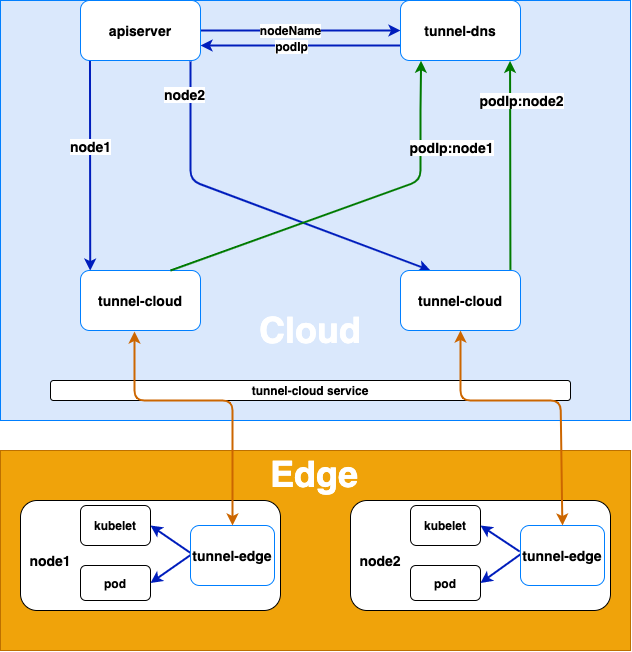
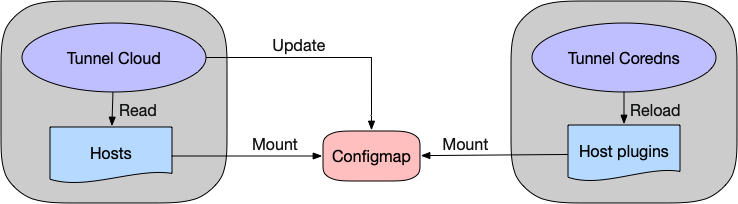
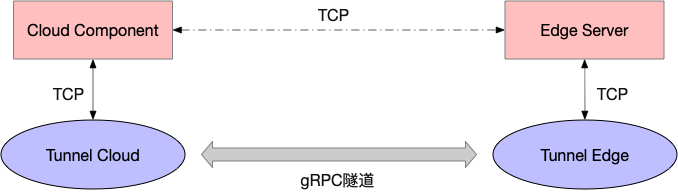
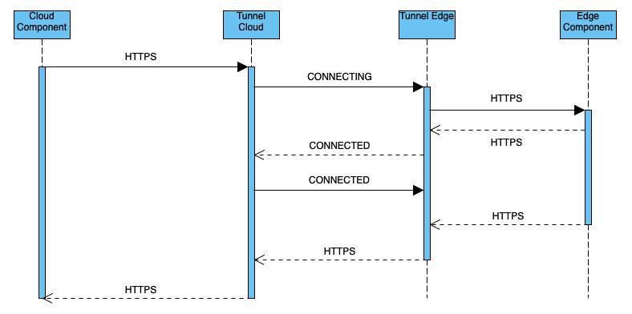
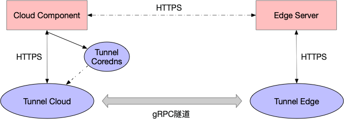

SuperEdge 云边隧道network-tunnel源码分析
=====================================

## 前言

云边隧道主要用于代理云端访问边缘节点组件的请求，解决云端无法直接访问边缘节点的问题（边缘节点没有暴露在公网中）

架构图如下所示：



实现原理为：

* 边缘节点上tunnel-edge主动连接云端tunnel-cloud service，tunnel-cloud service根据负载均衡策略将请求转到tunnel-cloud的具体pod上
* tunnel-edge与tunnel-cloud建立grpc连接后，tunnel-cloud会把自身的podIp和tunnel-edge所在节点的nodeName的映射写入DNS(tunnel dns)。grpc连接断开之后，tunnel-cloud会删除相关podIp和节点名的映射

而整个请求的代理转发流程如下：

* apiserver或者其它云端的应用访问边缘节点上的kubelet或者其它应用时，tunnel-dns通过DNS劫持(将host中的节点名解析为tunnel-cloud的podIp)把请求转发到tunnel-cloud的pod上
* tunnel-cloud根据节点名把请求信息转发到节点名对应的与tunnel-edge建立的grpc连接上
* tunnel-edge根据接收的请求信息请求边缘节点上的应用

## tunnel配置&数据结构

```go
type Tunnel struct {
	TunnlMode *TunnelMode `toml:"mode"`
}

type TunnelMode struct {
	Cloud *TunnelCloud `toml:"cloud"`
	EDGE  *TunnelEdge  `toml:"edge"`
}
```

TunnelCloud代表云端配置而TunnelEdge代表边端配置，下面依次介绍：

```go
type TunnelCloud struct {
	Https  *HttpsServer      `toml:"https"`
	Stream *StreamCloud      `toml:"stream"`
	Tcp    map[string]string `toml:"tcp"`
}

type HttpsServer struct {
	Cert string            `toml:"cert"`
	Key  string            `toml:"key"`
	Addr map[string]string `toml:"addr"`
}

type StreamCloud struct {
	Server *StreamServer `toml:"server"`
	Dns    *Dns          `toml:"dns"`
}

type StreamServer struct {
	TokenFile    string `toml:"tokenfile"`
	Key          string `toml:"key"`
	Cert         string `toml:"cert"`
	GrpcPort     int    `toml:"grpcport"`
	LogPort      int    `toml:"logport"`
	ChannelzAddr string `toml:"channelzaddr"`
}

type Dns struct {
	Configmap string `toml:"configmap"`
	Hosts     string `toml:"hosts"`
	Service   string `toml:"service"`
	Debug     bool   `toml:"debug"`
}

type TunnelEdge struct {
	Https      *HttpsClient `toml:"https"`
	StreamEdge StreamEdge   `toml:"stream"`
}

type HttpsClient struct {
	Cert string `toml:"cert"`
	Key  string `toml:"key"`
}

type StreamEdge struct {
	Client *StreamClient `toml:"client"`
}

type StreamClient struct {
	Token        string `toml:"token"`
	Cert         string `toml:"cert"`
	Dns          string `toml:"dns"`
	ServerName   string `toml:"servername"`
	LogPort      int    `toml:"logport"`
	ChannelzAddr string `toml:"channelzaddr"`
}
```

TunnelCloud包含如下结构：

* HttpsServer：云端tunnel证书，key以及Addr map(key表示云端tunnel https代理监听端口，而value表示边端tunnel需要访问的https服务监听地址(kubelet监听地址：`127.0.0.1:10250`))
* StreamCloud：包括StreamServer以及Dns配置：
  * StreamServer：包括云端tunnel grpc服务证书，key，以及监听端口
  * Dns：包括了云端coredns相关信息：
    * Configmap：云端coredns host plugin使用的挂载configmap，其中存放有云端tunnel ip以及边缘节点名映射列表
    * Hosts：云端tunnel对coredns host plugin使用的configmap的本地挂载文件
    * Service：云端tunnel service名称
* Tcp：包括了云端tunnel tcp监听地址以及边端节点某进程的tcp监听地址

TunnelCloud包含如下结构：

* HttpsClient：包括边缘https进程的证书，key
* StreamEdge：包括了云端tunnel service的dns以及地址ServerName

在介绍完tunnel的配置后，下面介绍tunnel使用的内部数据结构(github.com/superedge/superedge/pkg/tunnel/context)：

1、StreamMsg

StreamMsg为云边grpc隧道传输的消息数据格式：

```
message StreamMsg {
    string node = 1;
    string category = 2;
    string type = 3;
    string topic = 4;
    bytes data = 5;
    string addr = 6;
}
```

* node：表示边缘节点名称
* category：消息范畴
* type：消息类型
* topic：消息含义标示
* data：消息数据内容
* addr：相关地址

2、conn

```go
type conn struct {
	uid string
	ch  chan *proto.StreamMsg
}
```

conn表示tunnel grpc连接隧道上的连接(包括tcp以及https代理)：

* uid：表示conn uid
* ch：StreamMsg消息传递的管道

3、connContext

```go
type connContext struct {
	conns    map[string]*conn
	connLock sync.RWMutex
}
```

connContext表示本tunnel grpc上所有连接，其中conns key为conn uid，value为conn

4、node

```go
type node struct {
	name      string
	ch        chan *proto.StreamMsg
	conns     *[]string
	connsLock sync.RWMutex
}
```

node表示边缘节点相关连接信息：

* name：边缘节点名称
* ch：消息传输的管道
* conns：该边缘节点产生的所有conn uid列表

5、nodeContext

```go
type nodeContext struct {
	nodes    map[string]*node
	nodeLock sync.RWMutex
}
```

nodeContext表示本tunnel上所有相关节点信息，其中nodes key为边缘节点名称，value为node

6、TcpConn

```go
type TcpConn struct {
	Conn     net.Conn
	uid      string
	stopChan chan struct{}
	Type     string
	C        context.Conn
	n        context.Node
	Addr     string
	once     sync.Once
}
```

TcpConn为tcp代理模块封装的数据结构，代表了grpc隧道上的一个tcp代理连接：

* Conn：云端组件与云端tunnel的底层tcp连接
* uid：TcpConn唯一标识
* Type：TcpConn类型
* C：TcpConn使用的context.Conn
* n：TcpConn使用的context.Node
* Addr：边缘服务监听地址及端口

7、HttpsMsg

```go
type HttpsMsg struct {
	StatusCode  int               `json:"status_code"`
	HttpsStatus string            `json:"https_status"`
	HttpBody    []byte            `json:"http_body"`
	Header      map[string]string `json:"header"`
	Method      string            `json:"method"`
}
```

HttpsMsg为https消息传输中转结构：

* StatusCode：http response返回码
* HttpsStatus：https连接状态
* HttpBody：http 请求 or 回应 body
* Header：http请求 or 回应报头
* Method：http请求Method

在介绍完tunnel核心配置和数据结构后，下面开始分析源码

## tunnel源码分析

首先启动函数中会进行若干初始化：

```go
func NewTunnelCommand() *cobra.Command {
	option := options.NewTunnelOption()
	cmd := &cobra.Command{
		Use: "tunnel",
		Run: func(cmd *cobra.Command, args []string) {
			verflag.PrintAndExitIfRequested()

			klog.Infof("Versions: %#v\n", version.Get())
			util.PrintFlags(cmd.Flags())

			err := conf.InitConf(*option.TunnelMode, *option.TunnelConf)
			if err != nil {
				klog.Info("tunnel failed to load configuration file !")
				return
			}
			InitModules(*option.TunnelMode)
			stream.InitStream(*option.TunnelMode)
			tcp.InitTcp()
			https.InitHttps()
			LoadModules(*option.TunnelMode)
			ShutDown()
		},
	}
	fs := cmd.Flags()
	namedFlagSets := option.Addflag()
	for _, f := range namedFlagSets.FlagSets {
		fs.AddFlagSet(f)
	}
	return cmd
}
```

下面分别介绍：

* stream.InitStream

```go
func InitStream(mode string) {
	if mode == util.CLOUD {
		if !conf.TunnelConf.TunnlMode.Cloud.Stream.Dns.Debug {
			err := connect.InitDNS()
			if err != nil {
				klog.Errorf("init client-go fail err = %v", err)
				return
			}
		}
		err := token.InitTokenCache(conf.TunnelConf.TunnlMode.Cloud.Stream.Server.TokenFile)
		if err != nil {
			klog.Error("Error loading token file ！")
		}
	} else {
		err := connect.InitToken(os.Getenv(util.NODE_NAME_ENV), conf.TunnelConf.TunnlMode.EDGE.StreamEdge.Client.Token)
		if err != nil {
			klog.Errorf("initialize the edge node token err = %v", err)
			return
		}
	}
	model.Register(&Stream{})
	klog.Infof("init module: %s success !", util.STREAM)
}
```

InitStream首先判断tunnel是云端还是边缘，对于云端会执行InitDNS初始化coredns host plugins configmap刷新相关配置：

```go
func InitDNS() error {
	coreDns = &CoreDns{
		Update: make(chan struct{}),
	}
	coreDns.PodIp = os.Getenv(util.POD_IP_ENV)
	klog.Infof("endpoint of the proxycloud pod = %s ", coreDns.PodIp)
	config, err := rest.InClusterConfig()
	if err != nil {
		klog.Errorf("client-go get inclusterconfig  fail err = %v", err)
		return err
	}
	clientset, err := kubernetes.NewForConfig(config)
	if err != nil {
		klog.Errorf("get client fail err = %v", err)
		return err
	}
	coreDns.ClientSet = clientset
	coreDns.Namespace = os.Getenv(util.POD_NAMESPACE_ENV)
	return nil
}
```

coreDns.PodIp初始化为云端tunnel pod ip；coredns.Namespace初始化为云端tunnel pod所属namespace；同时根据kubeconfig创建kubeclient(inCluster模式)

而对于边端则会执行InitToken初始化clientToken，包括边缘节点名称以及通信携带的token

```go
// github.com/superedge/superedge/pkg/tunnel/proxy/stream/streammng/connect/streaminterceptor.go
var clientToken string
...
func InitToken(nodeName, tk string) error {
	var err error
	clientToken, err = token.GetTonken(nodeName, tk)
	klog.Infof("stream clinet token nodename = %s token = %s", nodeName, tk)
	if err != nil {
		klog.Error("client get token fail !")
	}
	return err
}
```

最后会注册stream模块(grpc连接隧道)

* tcp.InitTcp：注册了TcpProxy模块(建立在grpc隧道之上)
* https.InitHttps：注册了https模块(建立在grpc隧道之上)
* LoadModules：加载各模块，会执行上述已注册模块的Start函数
```go
func LoadModules(mode string) {
	modules := GetModules()
	for n, m := range modules {
		context.GetContext().AddModule(n)
		klog.Infof("starting module:%s", m.Name())
		m.Start(mode)
		klog.Infof("start module:%s success !", m.Name())
	}

}
```

如下分别介绍stream，tcpProxy以及https模块的Start函数：

1、stream(grpc云边隧道)

```go
func (stream *Stream) Start(mode string) {
	context.GetContext().RegisterHandler(util.STREAM_HEART_BEAT, util.STREAM, streammsg.HeartbeatHandler)
	var channelzAddr string
	if mode == util.CLOUD {
		go connect.StartServer()
		if !conf.TunnelConf.TunnlMode.Cloud.Stream.Dns.Debug {
			go connect.SynCorefile()
		}
		channelzAddr = conf.TunnelConf.TunnlMode.Cloud.Stream.Server.ChannelzAddr
	} else {
		go connect.StartSendClient()
		channelzAddr = conf.TunnelConf.TunnlMode.EDGE.StreamEdge.Client.ChannelzAddr
	}

	go connect.StartLogServer(mode)

	go connect.StartChannelzServer(channelzAddr)
}
```

首先调用RegisterHandler注册心跳消息处理函数HeartbeatHandler，其中util.STREAM以及util.STREAM_HEART_BEAT分别对应StreamMsg的category以及type字段

如果tunnel位于云端，则启动grpc server并监听StreamServer.GrpcPort，如下：

```go
func StartServer() {
	creds, err := credentials.NewServerTLSFromFile(conf.TunnelConf.TunnlMode.Cloud.Stream.Server.Cert, conf.TunnelConf.TunnlMode.Cloud.Stream.Server.Key)
	if err != nil {
		klog.Errorf("failed to create credentials: %v", err)
		return
	}
	opts := []grpc.ServerOption{grpc.KeepaliveEnforcementPolicy(kaep), grpc.KeepaliveParams(kasp), grpc.StreamInterceptor(ServerStreamInterceptor), grpc.Creds(creds)}
	s := grpc.NewServer(opts...)
	proto.RegisterStreamServer(s, &stream.Server{})

	lis, err := net.Listen("tcp", "0.0.0.0:"+strconv.Itoa(conf.TunnelConf.TunnlMode.Cloud.Stream.Server.GrpcPort))
	klog.Infof("the https server of the cloud tunnel  listen on %s", "0.0.0.0:"+strconv.Itoa(conf.TunnelConf.TunnlMode.Cloud.Stream.Server.GrpcPort))
	if err != nil {
		klog.Fatalf("failed to listen: %v", err)
		return
	}
	if err := s.Serve(lis); err != nil {
		klog.Fatalf("failed to serve: %v", err)
		return
	}
}
```

之后会调用SynCorefile执行同步coredns host plugins configmap刷新逻辑，每隔一分钟执行依次一次checkHosts，如下：

```go
func SynCorefile() {
	for {
		klog.V(8).Infof("connected node total = %d nodes = %v", len(context.GetContext().GetNodes()), context.GetContext().GetNodes())
		err := coreDns.checkHosts()
		if err != nil {
			klog.Errorf("failed to synchronize hosts periodically err = %v", err)
		}
		time.Sleep(60 * time.Second)
	}
}
```

而checkHosts负责configmap具体的刷新操作：

```go
func (dns *CoreDns) checkHosts() error {
	nodes, flag := parseHosts()
	if !flag {
		return nil
	}
	var hostsBuffer bytes.Buffer
	for k, v := range nodes {
		hostsBuffer.WriteString(v)
		hostsBuffer.WriteString("    ")
		hostsBuffer.WriteString(k)
		hostsBuffer.WriteString("\n")
	}
	cm, err := dns.ClientSet.CoreV1().ConfigMaps(dns.Namespace).Get(cctx.TODO(), conf.TunnelConf.TunnlMode.Cloud.Stream.Dns.Configmap, metav1.GetOptions{})
	if err != nil {
		klog.Errorf("get configmap fail err = %v", err)
		return err
	}
	if hostsBuffer.Len() != 0 {
		cm.Data[util.COREFILE_HOSTS_FILE] = hostsBuffer.String()
	} else {
		cm.Data[util.COREFILE_HOSTS_FILE] = ""
	}
	_, err = dns.ClientSet.CoreV1().ConfigMaps(dns.Namespace).Update(cctx.TODO(), cm, metav1.UpdateOptions{})
	if err != nil {
		klog.Errorf("update configmap fail err = %v", err)
		return err
	}
	klog.Infof("update configmap success!")
	return nil
}
```

首先调用parseHosts获取所有云端tunnel连接的边缘节点名称以及对应云端tunnel pod ip映射列表，然后写入hostsBuffer(`tunnel pod ip` `nodeName`形式)，如果有变化则将这个内容覆盖写入configmap并更新：



**另外，这里云端tunnel引入本地文件的目的是：优化托管模式下众多集群同时同步coredns时的性能**

而如果tunnel位于边端，则会调用StartSendClient进行隧道的打通：

```go
func StartSendClient() {
	conn, clictx, cancle, err := StartClient()
	if err != nil {
		klog.Error("edge start client error !")
		klog.Flush()
		os.Exit(1)
	}
	streamConn = conn
	defer func() {
		conn.Close()
		cancle()
	}()

	go func(monitor *grpc.ClientConn) {
		mcount := 0
		for {
			if conn.GetState() == connectivity.Ready {
				mcount = 0
			} else {
				mcount += 1
			}
			klog.V(8).Infof("grpc connection status = %s count = %v", conn.GetState(), mcount)
			if mcount >= util.TIMEOUT_EXIT {
				klog.Error("grpc connection rebuild timed out, container exited !")
				klog.Flush()
				os.Exit(1)
			}
			klog.V(8).Infof("grpc connection status of node = %v", conn.GetState())
			time.Sleep(1 * time.Second)
		}
	}(conn)
	running := true
	count := 0
	for running {
		if conn.GetState() == connectivity.Ready {
			cli := proto.NewStreamClient(conn)
			stream.Send(cli, clictx)
			count = 0
		}
		count += 1
		klog.V(8).Infof("node connection status = %s count = %v", conn.GetState(), count)
		time.Sleep(1 * time.Second)
		if count >= util.TIMEOUT_EXIT {
			klog.Error("the streamClient retrying to establish a connection timed out and the container exited !")
			klog.Flush()
			os.Exit(1)
		}
	}
}
```

首先调用StartClient根据云端tunnel域名构建证书，并对云端tunnel服务地址调用grpc.Dial连接grpc连接，并返回grpc.ClientConn

```go
func StartClient() (*grpc.ClientConn, ctx.Context, ctx.CancelFunc, error) {
	creds, err := credentials.NewClientTLSFromFile(conf.TunnelConf.TunnlMode.EDGE.StreamEdge.Client.Cert, conf.TunnelConf.TunnlMode.EDGE.StreamEdge.Client.Dns)
	if err != nil {
		klog.Errorf("failed to load credentials: %v", err)
		return nil, nil, nil, err
	}
	opts := []grpc.DialOption{grpc.WithKeepaliveParams(kacp), grpc.WithStreamInterceptor(ClientStreamInterceptor), grpc.WithTransportCredentials(creds)}
	conn, err := grpc.Dial(conf.TunnelConf.TunnlMode.EDGE.StreamEdge.Client.ServerName, opts...)
	if err != nil {
		klog.Error("edge start client fail !")
		return nil, nil, nil, err
	}
	clictx, cancle := ctx.WithTimeout(ctx.Background(), time.Duration(math.MaxInt64))
	return conn, clictx, cancle, nil
}
```

之后等待grpc连接状态变为Ready(隧道建立好了)，然后调用proto.NewStreamClient在grpc.ClientConn上建立streamClient，并对streamClient执行stream.Send：

```go
func Send(client proto.StreamClient, clictx ctx.Context) {
	stream, err := client.TunnelStreaming(clictx)
	if err != nil {
		klog.Error("EDGE-SEND fetch stream failed !")
		return
	}
	klog.Info("streamClient created successfully")
	errChan := make(chan error, 2)
	go func(send proto.Stream_TunnelStreamingClient, sc chan error) {
		sendErr := send.SendMsg(nil)
		if sendErr != nil {
			klog.Errorf("streamClient failed to send message err = %v", sendErr)
		}
		sc <- sendErr
	}(stream, errChan)

	go func(recv proto.Stream_TunnelStreamingClient, rc chan error) {
		recvErr := recv.RecvMsg(nil)
		if recvErr != nil {
			klog.Errorf("streamClient failed to receive message err = %v", recvErr)
		}
		rc <- recvErr
	}(stream, errChan)

	e := <-errChan
	klog.Errorf("the stream of streamClient is disconnected err = %v", e)
	err = stream.CloseSend()
	if err != nil {
		klog.Errorf("failed to close stream send err: %v", err)
	}
}
```

stream.Send会向grpc连接对端，也即云端tunnel，发送空消息并等待对方回应

相应的，云端tunnel会接受消息并回应，如下：

```go
func StartServer() {
	creds, err := credentials.NewServerTLSFromFile(conf.TunnelConf.TunnlMode.Cloud.Stream.Server.Cert, conf.TunnelConf.TunnlMode.Cloud.Stream.Server.Key)
	if err != nil {
		klog.Errorf("failed to create credentials: %v", err)
		return
	}
	opts := []grpc.ServerOption{grpc.KeepaliveEnforcementPolicy(kaep), grpc.KeepaliveParams(kasp), grpc.StreamInterceptor(ServerStreamInterceptor), grpc.Creds(creds)}
	s := grpc.NewServer(opts...)
	proto.RegisterStreamServer(s, &stream.Server{})

	lis, err := net.Listen("tcp", "0.0.0.0:"+strconv.Itoa(conf.TunnelConf.TunnlMode.Cloud.Stream.Server.GrpcPort))
	klog.Infof("the https server of the cloud tunnel  listen on %s", "0.0.0.0:"+strconv.Itoa(conf.TunnelConf.TunnlMode.Cloud.Stream.Server.GrpcPort))
	if err != nil {
		klog.Fatalf("failed to listen: %v", err)
		return
	}
	if err := s.Serve(lis); err != nil {
		klog.Fatalf("failed to serve: %v", err)
		return
	}
}

type Server struct{}

func (s *Server) TunnelStreaming(stream proto.Stream_TunnelStreamingServer) error {
	errChan := make(chan error, 2)

	go func(sendStream proto.Stream_TunnelStreamingServer, sendChan chan error) {
		sendErr := sendStream.SendMsg(nil)
		if sendErr != nil {
			klog.Errorf("streamServer failed to send message err = %v", sendErr)
		}
		sendChan <- sendErr
	}(stream, errChan)

	go func(recvStream proto.Stream_TunnelStreamingServer, recvChan chan error) {
		recvErr := stream.RecvMsg(nil)
		if recvErr != nil {
			klog.Errorf("streamServer failed to receive message err = %v", recvErr)
		}
		recvChan <- recvErr
	}(stream, errChan)

	e := <-errChan
	klog.Errorf("the stream of streamServer is disconnected err = %v", e)
	return e
}
```

之后StartSendClient会每隔1s发送空消息给云端tunnel，并接受回应，来保持连接一直处于Ready状态

这里重新回到StartClient函数：

```go
func StartClient() (*grpc.ClientConn, ctx.Context, ctx.CancelFunc, error) {
	creds, err := credentials.NewClientTLSFromFile(conf.TunnelConf.TunnlMode.EDGE.StreamEdge.Client.Cert, conf.TunnelConf.TunnlMode.EDGE.StreamEdge.Client.Dns)
	if err != nil {
		klog.Errorf("failed to load credentials: %v", err)
		return nil, nil, nil, err
	}
	opts := []grpc.DialOption{grpc.WithKeepaliveParams(kacp), grpc.WithStreamInterceptor(ClientStreamInterceptor), grpc.WithTransportCredentials(creds)}
	conn, err := grpc.Dial(conf.TunnelConf.TunnlMode.EDGE.StreamEdge.Client.ServerName, opts...)
	if err != nil {
		klog.Error("edge start client fail !")
		return nil, nil, nil, err
	}
	clictx, cancle := ctx.WithTimeout(ctx.Background(), time.Duration(math.MaxInt64))
	return conn, clictx, cancle, nil
}

// WithStreamInterceptor returns a DialOption that specifies the interceptor for
// streaming RPCs.
func WithStreamInterceptor(f StreamClientInterceptor) DialOption {
	return newFuncDialOption(func(o *dialOptions) {
		o.streamInt = f
	})
}
```

在调用grpc.Dial时会传递`grpc.WithStreamInterceptor(ClientStreamInterceptor)` DialOption，将ClientStreamInterceptor作为StreamClientInterceptor传递给grpc连接：

```go
func ClientStreamInterceptor(ctx context.Context, desc *grpc.StreamDesc, cc *grpc.ClientConn, method string, streamer grpc.Streamer, opts ...grpc.CallOption) (grpc.ClientStream, error) {
	var credsConfigured bool
	for _, o := range opts {
		_, ok := o.(*grpc.PerRPCCredsCallOption)
		if ok {
			credsConfigured = true
		}
	}
	if !credsConfigured {
		opts = append(opts, grpc.PerRPCCredentials(oauth.NewOauthAccess(&oauth2.Token{
			AccessToken: clientToken,
		})))
	}
	s, err := streamer(ctx, desc, cc, method, opts...)
	if err != nil {
		return nil, err
	}
	return newClientWrappedStream(s), nil
}

func newClientWrappedStream(s grpc.ClientStream) grpc.ClientStream {
	return &wrappedClientStream{s, false}
}

type wrappedClientStream struct {
	grpc.ClientStream
	restart bool
}
```

ClientStreamInterceptor会将边缘节点名称以及token构造成oauth2.Token.AccessToken进行认证传递，并构建wrappedClientStream，利用SendMsg以及RecvMsg分别进行发送以及接受操作，下面依次进行分析：

```go
func (w *wrappedClientStream) SendMsg(m interface{}) error {
	if m != nil {
		return w.ClientStream.SendMsg(m)
	}
	nodeName := os.Getenv(util.NODE_NAME_ENV)
	node := ctx.GetContext().AddNode(nodeName)
	klog.Infof("node added successfully node = %s", nodeName)
	stopHeartbeat := make(chan struct{}, 1)
	defer func() {
		stopHeartbeat <- struct{}{}
		ctx.GetContext().RemoveNode(nodeName)
		klog.Infof("node removed successfully node = %s", nodeName)
	}()
	go func(hnode ctx.Node, hw *wrappedClientStream, heartbeatStop chan struct{}) {
		count := 0
		for {
			select {
			case <-time.After(60 * time.Second):
				if w.restart {
					klog.Errorf("streamClient failed to receive heartbeat message count:%v", count)
					if count >= 1 {
						klog.Error("streamClient receiving heartbeat timeout, container exits")
						klog.Flush()
						os.Exit(1)
					}
					hnode.Send2Node(&proto.StreamMsg{
						Node:     os.Getenv(util.NODE_NAME_ENV),
						Category: util.STREAM,
						Type:     util.CLOSED,
					})
					count += 1
				} else {
					hnode.Send2Node(&proto.StreamMsg{
						Node:     os.Getenv(util.NODE_NAME_ENV),
						Category: util.STREAM,
						Type:     util.STREAM_HEART_BEAT,
						Topic:    os.Getenv(util.NODE_NAME_ENV) + util.STREAM_HEART_BEAT,
					})
					klog.V(8).Info("streamClient send heartbeat message")
					w.restart = true
					count = 0
				}
			case <-heartbeatStop:
				klog.Error("streamClient exits heartbeat sending")
				return
			}
		}
	}(node, w, stopHeartbeat)
	for {
		msg := <-node.NodeRecv()
		if msg.Category == util.STREAM && msg.Type == util.CLOSED {
			klog.Error("streamClient turns off message sending")
			return fmt.Errorf("streamClient stops sending messages to server node: %s", os.Getenv(util.NODE_NAME_ENV))
		}
		klog.V(8).Infof("streamClinet starts to send messages to the server node: %s uuid: %s", msg.Node, msg.Topic)
		err := w.ClientStream.SendMsg(msg)
		if err != nil {
			klog.Errorf("streamClient failed to send message err = %v", err)
			return err
		}
		klog.V(8).Infof("streamClinet successfully send a message to the server node: %s uuid: %s", msg.Node, msg.Topic)
	}
}
```

SendMsg会起goroutine每隔1分钟会构建心跳StreamMsg，并通过node.ch传递。同时不断从node.ch中获取StreamMsg，并调用ClientStream.SendMsg发送StreamMsg给云端tunnel

而RecvMsg会一直接受云端tunnel的StreamMsg，如果StreamMsg为心跳消息，则重置restart参数，使得边端tunnel继续发送心跳；若为其它类型消息，则调用该消息对应的处理函数进行操作：

```go
func (w *wrappedClientStream) RecvMsg(m interface{}) error {
	if m != nil {
		return w.ClientStream.RecvMsg(m)
	}
	for {
		msg := &proto.StreamMsg{}
		err := w.ClientStream.RecvMsg(msg)
		if err != nil {
			klog.Error("streamClient failed to receive message")
			node := ctx.GetContext().GetNode(os.Getenv(util.NODE_NAME_ENV))
			if node != nil {
				node.Send2Node(&proto.StreamMsg{
					Node:     os.Getenv(util.NODE_NAME_ENV),
					Category: util.STREAM,
					Type:     util.CLOSED,
				})
			}
			return err
		}
		klog.V(8).Infof("streamClient recv msg node: %s uuid: %s", msg.Node, msg.Topic)
		if msg.Category == util.STREAM && msg.Type == util.STREAM_HEART_BEAT {
			klog.V(8).Info("streamClient received heartbeat message")
			w.restart = false
			continue
		}
		ctx.GetContext().Handler(msg, msg.Type, msg.Category)
	}
}
```

相应的，后过头来看云端StartServer：

```go
func StartServer() {
	creds, err := credentials.NewServerTLSFromFile(conf.TunnelConf.TunnlMode.Cloud.Stream.Server.Cert, conf.TunnelConf.TunnlMode.Cloud.Stream.Server.Key)
	if err != nil {
		klog.Errorf("failed to create credentials: %v", err)
		return
	}
	opts := []grpc.ServerOption{grpc.KeepaliveEnforcementPolicy(kaep), grpc.KeepaliveParams(kasp), grpc.StreamInterceptor(ServerStreamInterceptor), grpc.Creds(creds)}
	s := grpc.NewServer(opts...)
	proto.RegisterStreamServer(s, &stream.Server{})

	lis, err := net.Listen("tcp", "0.0.0.0:"+strconv.Itoa(conf.TunnelConf.TunnlMode.Cloud.Stream.Server.GrpcPort))
	klog.Infof("the https server of the cloud tunnel  listen on %s", "0.0.0.0:"+strconv.Itoa(conf.TunnelConf.TunnlMode.Cloud.Stream.Server.GrpcPort))
	if err != nil {
		klog.Fatalf("failed to listen: %v", err)
		return
	}
	if err := s.Serve(lis); err != nil {
		klog.Fatalf("failed to serve: %v", err)
		return
	}
}

// StreamInterceptor returns a ServerOption that sets the StreamServerInterceptor for the
// server. Only one stream interceptor can be installed.
func StreamInterceptor(i StreamServerInterceptor) ServerOption {
	return newFuncServerOption(func(o *serverOptions) {
		if o.streamInt != nil {
			panic("The stream server interceptor was already set and may not be reset.")
		}
		o.streamInt = i
	})
}
```

在初始化云端tunnel时，会将`grpc.StreamInterceptor(ServerStreamInterceptor)`构建成grpc ServerOption，并将ServerStreamInterceptor作为StreamServerInterceptor传递给grpc连接：

```go
func ServerStreamInterceptor(srv interface{}, ss grpc.ServerStream, info *grpc.StreamServerInfo, handler grpc.StreamHandler) error {
	klog.Info("start verifying the token !")
	md, ok := metadata.FromIncomingContext(ss.Context())
	if !ok {
		klog.Error("missing metadata")
		return ErrMissingMetadata
	}
	if len(md["authorization"]) < 1 {
		klog.Errorf("failed to obtain token")
		return fmt.Errorf("failed to obtain token")
	}
	tk := strings.TrimPrefix(md["authorization"][0], "Bearer ")
	auth, err := token.ParseToken(tk)
	if err != nil {
		klog.Error("token deserialization failed !")
		return err
	}
	if auth.Token != token.GetTokenFromCache(auth.NodeName) {
		klog.Errorf("invalid token node = %s", auth.NodeName)
		return ErrInvalidToken
	}
	klog.Infof("token verification successful node = %s", auth.NodeName)
	err = handler(srv, newServerWrappedStream(ss, auth.NodeName))
	if err != nil {
		ctx.GetContext().RemoveNode(auth.NodeName)
		klog.Errorf("node disconnected node = %s err = %v", auth.NodeName, err)
	}
	return err
}

func ParseToken(token string) (*Token, error) {
	rtoken := &Token{}
	err := json.Unmarshal([]byte(token), rtoken)
	if err != nil {
		return rtoken, err
	}
	return rtoken, nil
}
```

ServerStreamInterceptor会从grpc.ServerStream authorization中解析出此grpc连接对应的边缘节点名和token，并对该token进行校验，然后根据节点名构建wrappedServerStream作为与该边缘节点通信的处理对象(每个边缘节点对应一个处理对象)：

```go
func newServerWrappedStream(s grpc.ServerStream, node string) grpc.ServerStream {
	return &wrappedServerStream{s, node}
}

type wrappedServerStream struct {
	grpc.ServerStream
	node string
}
```

wrappedServerStream实现了SendMsg以及RecvMsg分别用于发送与接受处理：

```go
func (w *wrappedServerStream) SendMsg(m interface{}) error {
	if m != nil {
		return w.ServerStream.SendMsg(m)
	}
	node := ctx.GetContext().AddNode(w.node)
	klog.Infof("node added successfully node = %s", node.GetName())
	defer klog.Infof("streamServer no longer sends messages to edge node: %s", w.node)
	for {
		msg := <-node.NodeRecv()
		if msg.Category == util.STREAM && msg.Type == util.CLOSED {
			klog.Error("streamServer turns off message sending")
			return fmt.Errorf("streamServer stops sending messages to node: %s", w.node)
		}
		klog.V(8).Infof("streamServer starts to send messages to the client node: %s uuid: %s", msg.Node, msg.Topic)
		err := w.ServerStream.SendMsg(msg)
		if err != nil {
			klog.Errorf("streamServer failed to send a message to the edge node: %s", w.node)
			return err
		}
		klog.V(8).Infof("StreamServer sends a message to the client successfully node: %s uuid: %s", msg.Node, msg.Topic)
	}
}
```

SendMsg会从wrappedServerStream对应边缘节点中接受StreamMsg，并调用ServerStream.SendMsg发送该消息给边缘tunnel

而RecvMsg会不断接受来自边缘tunnel的StreamMsg，并调用该消息对应的处理函数进行操作，例如心跳消息对应HeartbeatHandler：

```go
func (w *wrappedServerStream) RecvMsg(m interface{}) error {
	if m != nil {
		return w.ServerStream.RecvMsg(m)
	}
	defer klog.V(8).Infof("streamServer no longer receives messages from edge node: %s", w.node)
	for {
		msg := &proto.StreamMsg{}
		err := w.ServerStream.RecvMsg(msg)
		klog.V(8).Infof("streamServer receives messages node: %s ", w.node)
		if err != nil {
			klog.Errorf("streamServer failed to receive a message to the edge node: %s", w.node)
			node := ctx.GetContext().GetNode(w.node)
			if node != nil {
				node.Send2Node(&proto.StreamMsg{
					Node:     w.node,
					Category: util.STREAM,
					Type:     util.CLOSED,
				})
			}
			return err
		}
		klog.V(8).Infof("streamServer received the message successfully node: %s uuid: %s", msg.Node, msg.Topic)
		ctx.GetContext().Handler(msg, msg.Type, msg.Category)
	}
}

...
func HeartbeatHandler(msg *proto.StreamMsg) error {
	node := context.GetContext().GetNode(msg.Node)
	if node == nil {
		klog.Errorf("failed to send heartbeat to edge node node: %s", msg.Node)
		return fmt.Errorf("failed to send heartbeat to edge node node: %s", msg.Node)
	}
	node.Send2Node(msg)
	return nil
}
```

HeartbeatHandler会从msg.Node中获取边缘节点对应node，然后将该StreamMsg传递给node.ch，同时前面分析的wrappedServerStream.SendMsg会从该node.ch接受心跳StreamMsg并发送给边端

总结stream(grpc隧道)如下：

* stream模块负责建立grpc连接以及通信(云边隧道)
* 边缘节点上tunnel-edge主动连接云端tunnel-cloud service，tunnel-cloud service根据负载均衡策略将请求转到tunnel-cloud的具体pod上
* tunnel-edge与tunnel-cloud建立grpc连接后，tunnel-cloud会把自身的podIp和tunnel-edge所在节点的nodeName的映射写入DNS(tunnel dns)。grpc连接断开之后，tunnel-cloud会删除相关podIp和节点名的映射
* 边端tunnel会利用边缘节点名以及token构建grpc连接，而云端tunnel会通过认证信息解析grpc连接对应的边缘节点，并对每个边缘节点分别构建一个wrappedServerStream进行处理(同一个云端tunnel可以处理多个各边缘节点tunnel的连接)
* 云端tunnel每隔一分钟向coredns host plugins对应configmap同步一次边缘节点名以及tunnel pod ip的映射；另外，引入本地文件优化了托管模式下众多集群同时同步coredns时的性能
* 边端tunnel每隔一分钟会向云端tunnel发送代表该节点正常的心跳StreamMsg，而云端tunnel在接受到该心跳后会进行回应，并循环往复这个过程
* 不管是边端还是云端都会通过context.node数据结构在SendMsg以及RecvMsg之间中转StreamMsg，而该StreamMsg包括心跳，tcp代理以及https请求等不同类型消息

2、tcpProxy(tcp代理)

tcpProxy模块负责在多集群管理中建立云端与边缘的一条代理隧道：

```go
func (tcp *TcpProxy) Start(mode string) {
	context.GetContext().RegisterHandler(util.TCP_BACKEND, tcp.Name(), tcpmsg.BackendHandler)
	context.GetContext().RegisterHandler(util.TCP_FRONTEND, tcp.Name(), tcpmsg.FrontendHandler)
	context.GetContext().RegisterHandler(util.TCP_CONTROL, tcp.Name(), tcpmsg.ControlHandler)
	if mode == util.CLOUD {
		for front, backend := range conf.TunnelConf.TunnlMode.Cloud.Tcp {
			go func(front, backend string) {
				ln, err := net.Listen("tcp", front)
				if err != nil {
					klog.Errorf("cloud proxy start %s fail ,error = %s", front, err)
					return
				}
				defer ln.Close()
				klog.Infof("the tcp server of the cloud tunnel listen on %s\n", front)
				for {
					rawConn, err := ln.Accept()
					if err != nil {
						klog.Errorf("cloud proxy accept error!")
						return
					}
					nodes := context.GetContext().GetNodes()
					if len(nodes) == 0 {
						rawConn.Close()
						klog.Errorf("len(nodes)==0")
						continue
					}
					uuid := uuid.NewV4().String()
					node := nodes[0]
					fp := tcpmng.NewTcpConn(uuid, backend, node)
					fp.Conn = rawConn
					fp.Type = util.TCP_FRONTEND
					go fp.Write()
					go fp.Read()
				}
			}(front, backend)
		}
	}
}
```

Start函数首先注册了三种消息的处理函数：

* category为TCP_BACKEND，type为tcp，对应处理函数为tcpmsg.BackendHandler
* category为TCP_FRONTEND，type为tcp，对应处理函数为tcpmsg.FrontendHandler
* category为TCP_CONTROL，type为tcp，对应处理函数为tcpmsg.ControlHandler

然后在云端监听TunnelConf.TunnlMode.Cloud.Tcp参数key端口，并在接受到云端组件的请求后获取边缘节点列表中的第一个节点构建TcpConn：

```go
func NewTcpConn(uuid, addr, node string) *TcpConn {
	tcp := &TcpConn{
		uid:      uuid,
		stopChan: make(chan struct{}, 1),
		C:        context.GetContext().AddConn(uuid),
		Addr:     addr,
		n:        context.GetContext().AddNode(node),
	}
	tcp.n.BindNode(uuid)
	return tcp
}

func (edge *node) BindNode(uuid string) {
	edge.connsLock.Lock()
	if edge.conns == nil {
		edge.conns = &[]string{uuid}
	}
	edge.connsLock.Unlock()
}
```

这里会利用uuid创建context.conn，同时将该conn与node绑定；将TcpConn的type设置为TCP_FRONTEND，同时addr设置为边缘节点服务监听地址以及端口，并异步执行TcpConn Read以及Write函数：

```go
func (tcp *TcpConn) Read() {
	running := true
	for running {
		select {
		case <-tcp.stopChan:
			klog.Info("Disconnect tcp and stop receiving !")
			tcp.Conn.Close()
			running = false
		default:
			size := 32 * 1024
			if l, ok := interface{}(tcp.Conn).(*io.LimitedReader); ok && int64(size) > l.N {
				if l.N < 1 {
					size = 1
				} else {
					size = int(l.N)
				}
			}
			buf := make([]byte, size)
			n, err := tcp.Conn.Read(buf)
			if err != nil {
				klog.Errorf("conn read fail，err = %s ", err)
				tcp.cleanUp()
				break
			}
			tcp.n.Send2Node(&proto.StreamMsg{
				Category: util.TCP,
				Type:     tcp.Type,
				Topic:    tcp.uid,
				Data:     buf[0:n],
				Addr:     tcp.Addr,
				Node:     tcp.n.GetName(),
			})
			if err != nil {
				klog.Errorf("tcp conn failed to send a message to the node err = %v", err)
				running = false
				break
			}
		}
	}
}
```

tcp.Read会从云端组件与云端tunnel建立的tcp连接中不断读取数据，并构造StreamMsg：

* category：util.TCP
* Type：TCP_FRONTEND
* Topic：tcp.uid
* data：云端组件发送给云端tunnel的数据
* addr：边缘节点代理服务监听地址以及端口
* node：边缘节点名称

从前面的分析可以知道在调用Send2Node后，stream SendMsg会从node.ch中获取该StreamMsg，并发送给边端tunnel

边端在接受到该StreamMsg后，会执行对应的处理函数，也即tcpmsg.FrontendHandler：

```go
func FrontendHandler(msg *proto.StreamMsg) error {
	c := context.GetContext().GetConn(msg.Topic)
	if c != nil {
		c.Send2Conn(msg)
		return nil
	}
	tp := tcpmng.NewTcpConn(msg.Topic, msg.Addr, msg.Node)
	tp.Type = util.TCP_BACKEND
	tp.C.Send2Conn(msg)
	tcpAddr, err := net.ResolveTCPAddr("tcp", tp.Addr)
	if err != nil {
		klog.Error("edeg proxy resolve addr fail !")
		return err
	}
	conn, err := net.DialTCP("tcp", nil, tcpAddr)
	if err != nil {
		klog.Error("edge proxy connect fail!")
		return err
	}
	tp.Conn = conn
	go tp.Read()
	go tp.Write()
	return nil
}
```

FrontendHandler首先根据msg.Topic，msg.Addr以及msg.Node构建TcpConn，然后利用msg.Addr与边端的代理服务建立tcp连接，并将该连接赋值给TcpConn.Conn，因此边端tunnel创建出的TcpConn各字段含义如下：

* uid：云端TcpConn对应的uid
* Conn：边端tunnel与边端代理服务建立的tcp连接
* Type：TCP_BACKEND
* C：云端TcpConn对应的uid建立的context.conn
* n：边缘节点名称
* addr：边缘节点代理服务监听地址及端口

之后会异步执行该TcpConn的Read以及Write函数，由于这里对StreamMsg执行了Send2Conn，因此会触发Write操作，如下：

```go
func (tcp *TcpConn) Write() {
	running := true
	for running {
		select {
		case msg := <-tcp.C.ConnRecv():
			if msg.Type == util.TCP_CONTROL {
				tcp.cleanUp()
				break
			}
			_, err := tcp.Conn.Write(msg.Data)
			if err != nil {
				klog.Errorf("write conn fail err = %v", err)
				tcp.cleanUp()
				break
			}
		case <-tcp.stopChan:
			klog.Info("disconnect tcp and stop sending !")
			tcp.Conn.Close()
			tcp.closeOpposite()
			running = false
		}
	}
}
```

Write函数会从conn.ch中接收StreamMsg，并将msg.data利用tcp socket发送给边端代理服务。从而实现云端tunnel tcp代理的功能，数据流如下：

```
云端组件 -> 云端tunnel -> 边端tunnel -> 边端服务 
```

如果边端服务有回应，则Read函数会从tcp连接中读取回应数据并构建StreamMsg发送给云端tunnel

而云端tunnel在接收到回应StreamMsg后，会调用tcpmsg.BackendHandler进行处理：

```go
func BackendHandler(msg *proto.StreamMsg) error {
	conn := context.GetContext().GetConn(msg.Topic)
	if conn == nil {
		klog.Errorf("trace_id = %s the stream module failed to distribute the side message module = %s type = %s", msg.Topic, msg.Category, msg.Type)
		return fmt.Errorf("trace_id = %s the stream module failed to distribute the side message module = %s type = %s ", msg.Topic, msg.Category, msg.Type)
	}
	conn.Send2Conn(msg)
	return nil
}
```

BackendHandler会根据msg.Topic(conn uid)获取conn，并调用conn.Send2Conn发送StreamMsg，而TcpConn.Write会接受该消息，并通过云端tunnel与云端组件建立的tcp连接将msg.data发送给云端组件，数据流如下：

```
边端服务 -> 边端tunnel -> 云端tunnel -> 边端服务 
```

架构如图所示：



总结如下：

* tcp模块负责在多集群管理中建立云端与边端的tcp代理
* 当云端组件与云端tunnel tcp代理建立连接时，云端tunnel会选择它所管理的边缘节点列表中第一个节点以及边端代理服务地址端口 创建代表tcp代理的结构体TcpConn，并从云端组件与云端tunnel建立的tcp连接中接受以及发送数据，之后转发给边端tunnel；边端tunnel在初次接受到云端tunnel发送的消息时，会与边端代理服务建立连接，并传输数据
* 通过context.conn在tunnel grpc隧道与tcp代理之间中转StreamMsg。并区分各tcp代理连接

3、https(https代理)

https模块负责建立云边的https代理，将云端组件(例如：kube-apiserver)的https请求转发给边端服务(例如：kubelet)

```go
func (https *Https) Start(mode string) {
	context.GetContext().RegisterHandler(util.CONNECTING, util.HTTPS, httpsmsg.ConnectingHandler)
	context.GetContext().RegisterHandler(util.CONNECTED, util.HTTPS, httpsmsg.ConnectedAndTransmission)
	context.GetContext().RegisterHandler(util.CLOSED, util.HTTPS, httpsmsg.ConnectedAndTransmission)
	context.GetContext().RegisterHandler(util.TRANSNMISSION, util.HTTPS, httpsmsg.ConnectedAndTransmission)
	if mode == util.CLOUD {
		go httpsmng.StartServer()
	}
}
```

Start函数首先注册了四种消息的处理函数：

* category为https，type为CONNECTING，对应处理函数为httpsmsg.ConnectingHandler
* category为https，type为CONNECTED，对应处理函数为httpsmsg.ConnectedAndTransmission
* category为https，type为TRANSNMISSION，对应处理函数为httpsmsg.ConnectedAndTransmission
* category为https，type为CLOSED，对应处理函数为httpsmsg.ConnectedAndTransmission

并在云端调用StartServer启动服务：

```go
func StartServer() {
	cert, err := tls.LoadX509KeyPair(conf.TunnelConf.TunnlMode.Cloud.Https.Cert, conf.TunnelConf.TunnlMode.Cloud.Https.Key)
	if err != nil {
		klog.Errorf("client load cert fail certpath = %s keypath = %s \n", conf.TunnelConf.TunnlMode.Cloud.Https.Cert, conf.TunnelConf.TunnlMode.Cloud.Https.Key)
		return
	}
	config := &tls.Config{
		Certificates:       []tls.Certificate{cert},
		InsecureSkipVerify: true,
	}
	for k := range conf.TunnelConf.TunnlMode.Cloud.Https.Addr {
		serverHandler := &ServerHandler{
			port: k,
		}
		s := &http.Server{
			Addr:      "0.0.0.0:" + k,
			Handler:   serverHandler,
			TLSConfig: config,
		}
		klog.Infof("the https server of the cloud tunnel listen on %s", s.Addr)
		go func(server *http.Server) {
			err = s.ListenAndServeTLS("", "")
			if err != nil {
				klog.Errorf("server start fail,add = %s err = %v", s.Addr, err)
			}
		}(s)
	}
}
```

这里云端tunnel会将ServerHandler设置为http.Server的handler，并监听TunnelConf.TunnlMode.Cloud.Https.Addr key端口(10250)。ServerHandler处理逻辑如下：

```go
func (serverHandler *ServerHandler) ServeHTTP(writer http.ResponseWriter, request *http.Request) {
	var nodeName string
	nodeinfo := strings.Split(request.Host, ":")
	if context.GetContext().NodeIsExist(nodeinfo[0]) {
		nodeName = nodeinfo[0]
	} else {
		nodeName = request.TLS.ServerName
	}
	node := context.GetContext().GetNode(nodeName)
	if node == nil {
		fmt.Fprintf(writer, "edge node disconnected node = %s", nodeinfo[0])
		return
	}
	uid := uuid.NewV4().String()
	node.BindNode(uid)
	conn := context.GetContext().AddConn(uid)

	requestBody, err := ioutil.ReadAll(request.Body)
	if err != nil {
		klog.Errorf("traceid = %s read request body fail err = %v ", uid, err)
		fmt.Fprintf(writer, "traceid = %s read request body fail err = %v ", uid, err)
		return
	}
	httpmsg := &HttpsMsg{
		HttpsStatus: util.CONNECTING,
		Header:      make(map[string]string),
		Method:      request.Method,
		HttpBody:    requestBody,
	}
	for k, v := range request.Header {
		for _, vv := range v {
			httpmsg.Header[k] = vv
		}
	}
	bmsg := httpmsg.Serialization()
	if len(bmsg) == 0 {
		klog.Errorf("traceid = %s httpsmsg serialization failed err = %v req = %v serverName = %s", uid, err, request, request.TLS.ServerName)
		fmt.Fprintf(writer, "traceid = %s httpsmsg serialization failed err = %v", uid, err)
		return
	}
	node.Send2Node(&proto.StreamMsg{
		Node:     nodeName,
		Category: util.HTTPS,
		Type:     util.CONNECTING,
		Topic:    uid,
		Data:     bmsg,
		Addr:     "https://" + conf.TunnelConf.TunnlMode.Cloud.Https.Addr[serverHandler.port] + request.URL.String(),
	})
	if err != nil {
		klog.Errorf("traceid = %s httpsServer send request msg failed err = %v", uid, err)
		fmt.Fprintf(writer, "traceid = %s httpsServer send request msg failed err = %v", uid, err)
		return
	}
	resp := <-conn.ConnRecv()
	rmsg, err := Deserialization(resp.Data)
	if err != nil {
		klog.Errorf("traceid = %s httpsmag deserialization failed err = %v", uid, err)
		fmt.Fprintf(writer, "traceid = %s httpsmag deserialization failed err = %v", uid, err)
		return
	}
	node.Send2Node(&proto.StreamMsg{
		Node:     nodeName,
		Category: util.HTTPS,
		Type:     util.CONNECTED,
		Topic:    uid,
	})
	if err != nil {
		klog.Errorf("traceid = %s httpsServer send confirm msg failed err = %v", uid, err)
		fmt.Fprintf(writer, "traceid = %s httpsServer send confirm msg failed err = %v", uid, err)
		return
	}
	if rmsg.StatusCode != http.StatusSwitchingProtocols {
		handleServerHttp(rmsg, writer, request, node, conn)
	} else {
		handleServerSwitchingProtocols(writer, node, conn)
	}
}
```

当云端组件向云端tunnel发送https请求时，serverHandler会首先从request.Host字段解析节点名，若不存在则从request.TLS.ServerName解析节点名，这里解释一下这样做的原因：

由于apiserver或者其它组件本来要访问的对象是边端节点上的某个服务，通过coredns DNS劫持后，会将host中的节点名解析为tunnel-cloud的podIp，但是host以及request.TLS.ServerName依旧保持不变，因此可以通过解析这两个字段得出要访问的边缘节点名称

之后读取request.Body以及request.Header构建HttpsMsg结构体，并序列化。之后创建StreamMsg，各字段含义如下：

* Node：边缘节点名
* Category：util.HTTPS
* Type：util.CONNECTING
* Topic：conn uid
* Data：序列化后的HttpsMsg
* Addr：边缘节点https服务访问URL

之后通过Send2Node传递该StreamMsg，而stream SendMsg会接受该消息并发送给对应边缘节点

边缘节点会接受该消息，并执行上述注册的httpsmsg.ConnectingHandler函数：

```go
func ConnectingHandler(msg *proto.StreamMsg) error {
	go httpsmng.Request(msg)
	return nil
}

func Request(msg *proto.StreamMsg) {
	httpConn, err := getHttpConn(msg)
	if err != nil {
		klog.Errorf("traceid = %s failed to get httpclient httpConn err = %v", msg.Topic, err)
		return
	}
	rawResponse := bytes.NewBuffer(make([]byte, 0, util.MaxResponseSize))
	rawResponse.Reset()
	respReader := bufio.NewReader(io.TeeReader(httpConn, rawResponse))
	resp, err := http.ReadResponse(respReader, nil)
	if err != nil {
		klog.Errorf("traceid = %s httpsclient read response failed err = %v", msg.Topic, err)
		return
	}

	bodyMsg := HttpsMsg{
		StatusCode:  resp.StatusCode,
		HttpsStatus: util.CONNECTED,
		Header:      make(map[string]string),
	}
	for k, v := range resp.Header {
		for _, vv := range v {
			bodyMsg.Header[k] = vv
		}
	}
	msgData := bodyMsg.Serialization()
	if len(msgData) == 0 {
		klog.Errorf("traceid = %s httpsclient httpsmsg serialization failed", msg.Topic)
		return
	}
	node := context.GetContext().GetNode(msg.Node)
	if node == nil {
		klog.Errorf("traceid = %s httpClient failed to get node", msg.Topic)
		return
	}
	node.Send2Node(&proto.StreamMsg{
		Node:     msg.Node,
		Category: msg.Category,
		Type:     util.CONNECTED,
		Topic:    msg.Topic,
		Data:     msgData,
	})
	conn := context.GetContext().AddConn(msg.Topic)
	node.BindNode(msg.Topic)
	confirm := true
	for confirm {
		confirmMsg := <-conn.ConnRecv()
		if confirmMsg.Type == util.CONNECTED {
			confirm = false
		}
	}
	if resp.StatusCode != http.StatusSwitchingProtocols {
		handleClientHttp(resp, rawResponse, httpConn, msg, node, conn)
	} else {
		handleClientSwitchingProtocols(httpConn, rawResponse, msg, node, conn)
	}
}

func getHttpConn(msg *proto.StreamMsg) (net.Conn, error) {
	cert, err := tls.LoadX509KeyPair(conf.TunnelConf.TunnlMode.EDGE.Https.Cert, conf.TunnelConf.TunnlMode.EDGE.Https.Key)
	if err != nil {
		klog.Errorf("tranceid = %s httpsclient load cert fail certpath = %s keypath = %s", msg.Topic, conf.TunnelConf.TunnlMode.EDGE.Https.Cert, conf.TunnelConf.TunnlMode.EDGE.Https.Key)
		return nil, err
	}
	requestMsg, err := Deserialization(msg.Data)
	if err != nil {
		klog.Errorf("traceid = %s httpsclient deserialization failed err = %v", msg.Topic, err)
		return nil, err
	}
	request, err := http.NewRequest(requestMsg.Method, msg.Addr, bytes.NewBuffer(requestMsg.HttpBody))
	if err != nil {
		klog.Errorf("traceid = %s httpsclient get request fail err = %v", msg.Topic, err)
		return nil, err
	}
	for k, v := range requestMsg.Header {
		request.Header.Add(k, v)
	}
	conn, err := tls.Dial("tcp", request.Host, &tls.Config{
		Certificates:       []tls.Certificate{cert},
		InsecureSkipVerify: true,
	})
	if err != nil {
		klog.Errorf("traceid = %s httpsclient request failed err = %v", msg.Topic, err)
		return nil, err
	}
	err = request.Write(conn)
	if err != nil {
		klog.Errorf("traceid = %s https clinet request failed to write conn err = %v", msg.Topic, err)
		return nil, err
	}
	return conn, nil
}
```

ConnectingHandler会调用Request对该StreamMsg进行处理。Reqeust首先通过getHttpConn发起对StreamMsg.Addr也即边缘节点https服务的https请求，请求内容复用了云端组件对云端tunnel的请求(method，headler，body等)。并返回了建立的tls连接

之后通过tls连接创建了respReader，并调用http.ReadResponse读取resp.StatusCode以及resp.Header构建出HttpsMsg(HttpsStatus为util.CONNECTED)，序列化后作为StreamMsg的数据部分发送给云端tunnel

云端tunnel在接受到该StreamMsg后，会调用ConnectedAndTransmission进行处理：

```go
func ConnectedAndTransmission(msg *proto.StreamMsg) error {
	conn := context.GetContext().GetConn(msg.Topic)
	if conn == nil {
		klog.Errorf("trace_id = %s the stream module failed to distribute the side message module = %s type = %s", msg.Topic, msg.Category, msg.Type)
		return fmt.Errorf("trace_id = %s the stream module failed to distribute the side message module = %s type = %s", msg.Topic, msg.Category, msg.Type)
	}
	conn.Send2Conn(msg)
	return nil
}
```

通过msg.Topic(conn uid)获取conn，并通过Send2Conn将消息塞到该conn对应的管道中

而ServerHandler之前在发送完CONNECTING的HttpsMsg后就一直处于阻塞等待conn的管道中：

```go
func (serverHandler *ServerHandler) ServeHTTP(writer http.ResponseWriter, request *http.Request) {
    ...
	node.Send2Node(&proto.StreamMsg{
		Node:     nodeName,
		Category: util.HTTPS,
		Type:     util.CONNECTING,
		Topic:    uid,
		Data:     bmsg,
		Addr:     "https://" + conf.TunnelConf.TunnlMode.Cloud.Https.Addr[serverHandler.port] + request.URL.String(),
	})
	if err != nil {
		klog.Errorf("traceid = %s httpsServer send request msg failed err = %v", uid, err)
		fmt.Fprintf(writer, "traceid = %s httpsServer send request msg failed err = %v", uid, err)
		return
	}
	resp := <-conn.ConnRecv()
	rmsg, err := Deserialization(resp.Data)
	if err != nil {
		klog.Errorf("traceid = %s httpsmag deserialization failed err = %v", uid, err)
		fmt.Fprintf(writer, "traceid = %s httpsmag deserialization failed err = %v", uid, err)
		return
	}
	node.Send2Node(&proto.StreamMsg{
		Node:     nodeName,
		Category: util.HTTPS,
		Type:     util.CONNECTED,
		Topic:    uid,
	})
	if err != nil {
		klog.Errorf("traceid = %s httpsServer send confirm msg failed err = %v", uid, err)
		fmt.Fprintf(writer, "traceid = %s httpsServer send confirm msg failed err = %v", uid, err)
		return
	}
    ...
}
```

在接受到来自边端tunnel的CONNECTED回应之后，会继续发送CONNECTED StreamMsg给云端tunnel，而边端tunnel这个时候一直等待接受来自云端tunnel的CONNECTED StreamMsg：

```go
func Request(msg *proto.StreamMsg) {
    ...
	node.Send2Node(&proto.StreamMsg{
		Node:     msg.Node,
		Category: msg.Category,
		Type:     util.CONNECTED,
		Topic:    msg.Topic,
		Data:     msgData,
	})
	conn := context.GetContext().AddConn(msg.Topic)
	node.BindNode(msg.Topic)
	confirm := true
	for confirm {
		confirmMsg := <-conn.ConnRecv()
		if confirmMsg.Type == util.CONNECTED {
			confirm = false
		}
	}
	if resp.StatusCode != http.StatusSwitchingProtocols {
		handleClientHttp(resp, rawResponse, httpConn, msg, node, conn)
	} else {
		handleClientSwitchingProtocols(httpConn, rawResponse, msg, node, conn)
	}
}
```

在接受到云端的CONNECTED消息之后，认为https代理成功建立。并继续执行handleClientHttp or handleClientSwitchingProtocols，这里只分析handleClientHttp，如下：

```go
func handleClientHttp(resp *http.Response, rawResponse *bytes.Buffer, httpConn net.Conn, msg *proto.StreamMsg, node context.Node, conn context.Conn) {
	readCh := make(chan *proto.StreamMsg, util.MSG_CHANNEL_CAP)
	stop := make(chan struct{})
	go func(read chan *proto.StreamMsg, response *http.Response, buf *bytes.Buffer, stopRead chan struct{}) {
		rrunning := true
		for rrunning {
			bbody := make([]byte, util.MaxResponseSize)
			n, err := response.Body.Read(bbody)
			respMsg := &proto.StreamMsg{
				Node:     msg.Node,
				Category: msg.Category,
				Type:     util.CONNECTED,
				Topic:    msg.Topic,
				Data:     bbody[:n],
			}
			if err != nil {
				if err == io.EOF {
					klog.V(4).Infof("traceid = %s httpsclient read fail err = %v", msg.Topic, err)
				} else {
					klog.Errorf("traceid = %s httpsclient read fail err = %v", msg.Topic, err)
				}
				rrunning = false
				respMsg.Type = util.CLOSED
			} else {
				respMsg.Type = util.TRANSNMISSION
				buf.Reset()
			}
			read <- respMsg
		}
		<-stop
		close(read)
	}(readCh, resp, rawResponse, stop)
	running := true
	for running {
		select {
		case cloudMsg := <-conn.ConnRecv():
			if cloudMsg.Type == util.CLOSED {
				klog.Infof("traceid = %s httpsclient receive close msg", msg.Topic)
				httpConn.Close()
				stop <- struct{}{}
			}
		case respMsg := <-readCh:
			if respMsg == nil {
				running = false
				break
			}
			node.Send2Node(respMsg)
			if respMsg.Type == util.CLOSED {
				stop <- struct{}{}
				klog.V(4).Infof("traceid = %s httpsclient read fail !", msg.Topic)
				running = false
			}

		}
	}
	node.UnbindNode(conn.GetUid())
	context.GetContext().RemoveConn(conn.GetUid())
}
```

这里handleClientHttp会一直尝试读取来自边端组件的数据包，并构建成TRANSNMISSION类型的StreamMsg发送给云端tunnel，云端tunnel在接受到该消息后会执行ConnectedAndTransmission，并将该消息塞到代表https代理请求的conn管道中

而云端tunnel在发送完CONNECTED消息之后，会继续执行handleServerHttp处理https数据传输：

```go
func handleServerHttp(rmsg *HttpsMsg, writer http.ResponseWriter, request *http.Request, node context.Node, conn context.Conn) {
	for k, v := range rmsg.Header {
		writer.Header().Add(k, v)
	}
	flusher, ok := writer.(http.Flusher)
	if ok {
		running := true
		for running {
			select {
			case <-request.Context().Done():
				klog.Infof("traceid = %s httpServer context close! ", conn.GetUid())
				node.Send2Node(&proto.StreamMsg{
					Node:     node.GetName(),
					Category: util.HTTPS,
					Type:     util.CLOSED,
					Topic:    conn.GetUid(),
				})
				running = false
			case msg := <-conn.ConnRecv():
				if msg.Data != nil && len(msg.Data) != 0 {
					_, err := writer.Write(msg.Data)
					if err != nil {
						klog.Errorf("traceid = %s httpsServer write data failed err = %v", conn.GetUid(), err)
					}
					flusher.Flush()
				}
				if msg.Type == util.CLOSED {
					running = false
					break
				}
			}
		}
	}
	context.GetContext().RemoveConn(conn.GetUid())
}
```

handleServerHttp在接受到StreamMsg后，会将msg.Data，也即边端组件的数据包，发送给云端组件

整个数据流如下所示：



架构如下所示：



## 总结

* tunnel配置包括云端以及边端配置；tunnel数据结构如下：
  * StreamMsg：云边grpc隧道传输的消息数据格式
  * conn：tunnel grpc连接隧道上的连接(包括tcp以及https代理)
  * connContext：tunnel grpc上所有连接，其中conns key为conn uid，value为conn
  * node：边缘节点相关连接信息
  * nodeContext：tunnel上所有相关节点信息，其中nodes key为边缘节点名称，value为node
  * TcpConn：tcp代理模块封装的数据结构，代表了grpc隧道上的一个tcp代理连接
  * HttpsMsg：https消息传输中转结构
* tunnel首先会执行初始化注册各模块，然后分别执行如下模块：
  * stream(grpc隧道)：stream模块负责建立grpc连接以及通信(云边隧道)
    * 边缘节点上tunnel-edge主动连接云端tunnel-cloud service，tunnel-cloud service根据负载均衡策略将请求转到tunnel-cloud的具体pod上
    * tunnel-edge与tunnel-cloud建立grpc连接后，tunnel-cloud会把自身的podIp和tunnel-edge所在节点的nodeName的映射写入DNS(tunnel dns)。grpc连接断开之后，tunnel-cloud会删除相关podIp和节点名的映射
    * 边端tunnel会利用边缘节点名以及token构建grpc连接，而云端tunnel会通过认证信息解析grpc连接对应的边缘节点，并对每个边缘节点分别构建一个wrappedServerStream进行处理(同一个云端tunnel可以处理多个各边缘节点tunnel的连接)
    * 边端tunnel每隔一分钟会向云端tunnel发送代表该节点正常的心跳StreamMsg，而云端tunnel在接受到该心跳后会进行回应，并循环往复这个过程
    * 云端tunnel每隔一分钟向coredns host plugins对应configmap同步一次边缘节点名以及tunnel pod ip的映射；另外，引入本地文件优化了托管模式下众多集群同时同步coredns时的性能
    * 不管是边端还是云端都会通过context.node数据结构在SendMsg以及RecvMsg之间中转StreamMsg，而该StreamMsg包括心跳，tcp代理以及https请求等不同类型消息
  * tcp(tcp代理)：负责在多集群管理中建立云端与边端的tcp代理
    * 当云端组件与云端tunnel tcp代理建立连接时，云端tunnel会选择它所管理的边缘节点列表中第一个节点以及边端代理服务地址端口，创建代表tcp代理的结构体TcpConn，并从云端组件与云端tunnel建立的tcp连接中接受以及发送数据，之后转发给边端tunnel；边端tunnel在初次接受到云端tunnel发送的消息时，会与边端代理服务建立连接，并传输数据
    * 通过context.conn在tunnel grpc隧道与tcp代理之间中转StreamMsg。并区分各tcp代理连接
  * https(https代理)：负责建立云边https代理(eg：云端kube-apiserver <-> 边端kubelet)，并传输数据
    * 作用与tcp代理类似，不同的是云端tunnel会读取云端组件https请求中携带的边缘节点名，并尝试建立与该边缘节点的https代理；而不是像tcp代理一样随机选择第一个边缘节点
    * 整个请求的代理转发流程如下：
      * apiserver或者其它云端的应用访问边缘节点上的kubelet或者其它应用时，tunnel-dns通过DNS劫持(将host中的节点名解析为tunnel-cloud的podIp)把请求转发到tunnel-cloud的pod上
      * tunnel-cloud根据节点名把请求信息转发到节点名对应的与tunnel-edge建立的grpc连接上
      * tunnel-edge根据接收的请求信息请求边缘节点上的应用
    * 通过context.conn在tunnel grpc隧道与https代理之间中转StreamMsg。并区分各https代理连接
  
## 展望

* 目前tunnel整体代码不易读懂，需要改善
* 支持更多的网络协议
* 支持云端访问边缘节点业务pod server
* 多个边缘节点同时加入集群时，多副本云端tunnel pod对coredns host plguins对应configmap更新冲突解决