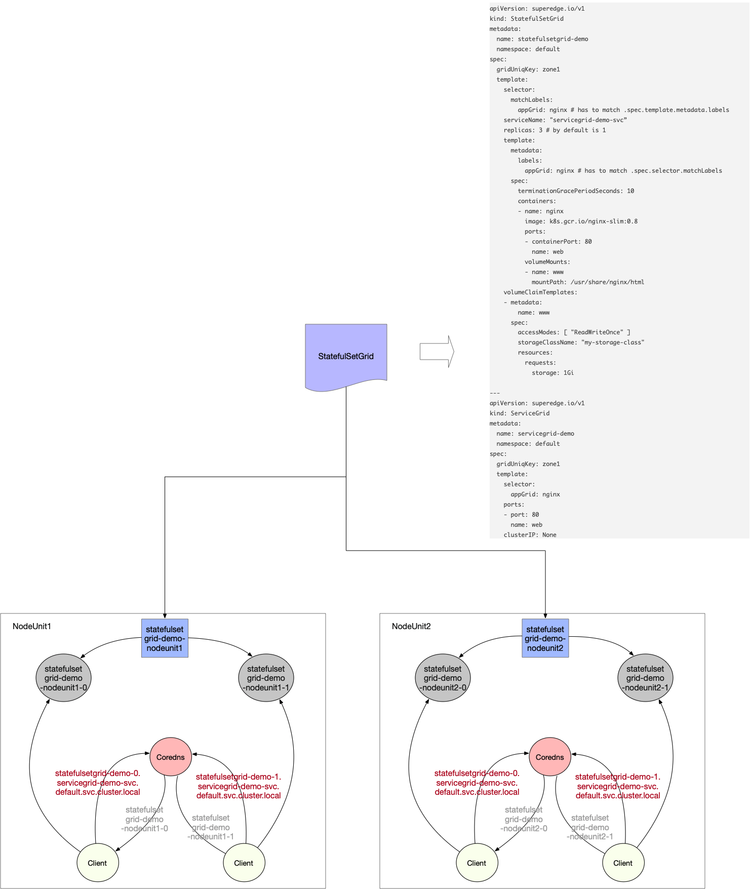
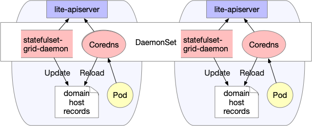

SuperEdge StatefulSetGrid源码分析
===============================

## 前言

SuperEdge StatefulSetGrid由本人在官方提出方案[SEP: ServiceGroup StatefulSetGrid Design Specification](https://github.com/superedge/superedge/issues/26)，最终与[chenkaiyue](https://github.com/chenkaiyue)合作开发完成

初衷是为了补充service group对有状态服务的支持，设计架构图如下：



这里先介绍一下StatefulSetGrid的使用示例，有一个直观的感受：

1、部署StatefulSetGrid

```yaml
apiVersion: superedge.io/v1
kind: StatefulSetGrid
metadata:
  name: statefulsetgrid-demo
  namespace: default
spec:
  gridUniqKey: zone
  template:
    selector:
      matchLabels:
        appGrid: echo
    serviceName: "servicegrid-demo-svc"
    replicas: 3
    template:
      metadata:
        labels:
          appGrid: echo
      spec:
        terminationGracePeriodSeconds: 10
        containers:
        - image: superedge/echoserver:2.2
          name: echo
          ports:
          - containerPort: 8080
            protocol: TCP
          env:
            - name: NODE_NAME
              valueFrom:
                fieldRef:
                  fieldPath: spec.nodeName
            - name: POD_NAME
              valueFrom:
                fieldRef:
                  fieldPath: metadata.name
            - name: POD_NAMESPACE
              valueFrom:
                fieldRef:
                  fieldPath: metadata.namespace
            - name: POD_IP
              valueFrom:
                fieldRef:
                  fieldPath: status.podIP
          resources: {}
```

**注意：template中的serviceName设置成即将创建的service名称**

2、部署StatefulSetGrid

```yaml
apiVersion: superedge.io/v1
kind: StatefulSetGrid
metadata:
  name: servicegrid-demo
  namespace: default
spec:
  gridUniqKey: zone
  template:
    selector:
      appGrid: echo
    ports:
    - protocol: TCP
      port: 80
      targetPort: 8080
```

gridUniqKey字段设置为了zone，所以我们在将节点分组时采用label的key为zone，如果有三组节点，分别为他们添加zone: zone-0, zone: zone-1, zone: zone-2的label即可；这时，每组节点内都有了echo-service的statefulset和对应的pod，在节点内访问统一的service-name也只会将请求发向本组的节点

```
[~]# kubectl get ssg
NAME                   AGE
statefulsetgrid-demo   21h

[~]# kubectl get statefulset
NAME                          READY   AGE
statefulsetgrid-demo-zone-0   3/3     21h
statefulsetgrid-demo-zone-1   3/3     21h
statefulsetgrid-demo-zone-2   3/3     21h

[~]# kubectl get svc
NAME                   TYPE        CLUSTER-IP     EXTERNAL-IP   PORT(S)   AGE
kubernetes             ClusterIP   192.168.0.1     <none>        443/TCP   22h
servicegrid-demo-svc   ClusterIP   192.168.21.99   <none>        80/TCP    21h

# execute on zone-0 nodeunit
[~]# curl 192.168.21.99|grep "node name"
        node name:      node0
...
# execute on zone-1 nodeunit
[~]# curl 192.168.21.99|grep "node name"
        node name:      node1
...
# execute on zone-2 nodeunit
[~]# curl 192.168.21.99|grep "node name"
        node name:      node2
...
```

**注意：在各NodeUnit内通过service访问本组服务时，对应clusterIP不能设置成None，暂不支持此种情况下的闭环访问**

除了采用service访问statefulset负载，StatefulSetGrid还支持使用headless service的方式进行访问，如下所示：


StatefulSetGrid提供屏蔽NodeUnit的统一headless service访问形式，如下：

```
{StatefulSetGrid}-{0..N-1}.{StatefulSetGrid}-svc.ns.svc.cluster.local
```

上述访问会对应实际各个NodeUnit的具体pod：

```
{StatefulSetGrid}-{NodeUnit}-{0..N-1}.{StatefulSetGrid}-svc.ns.svc.cluster.local
```

每个NodeUnit通过相同的headless service只会访问本组内的pod。也即：对于`NodeUnit：zone-1`来说，会访问`statefulsetgrid-demo-zone-1`(statefulset)对应的pod；而对于`NodeUnit：zone-2`来说，会访问`statefulsetgrid-demo-zone-2`(statefulset)对应的pod

```bash
# execute on zone-0 nodeunit
[~]# curl statefulsetgrid-demo-0.servicegrid-demo-svc.default.svc.cluster.local|grep "pod name"
        pod name:       statefulsetgrid-demo-zone-0-0
[~]# curl statefulsetgrid-demo-1.servicegrid-demo-svc.default.svc.cluster.local|grep "pod name"
        pod name:       statefulsetgrid-demo-zone-0-1
[~]# curl statefulsetgrid-demo-2.servicegrid-demo-svc.default.svc.cluster.local|grep "pod name"
        pod name:       statefulsetgrid-demo-zone-0-2
...
# execute on zone-1 nodeunit
[~]# curl statefulsetgrid-demo-0.servicegrid-demo-svc.default.svc.cluster.local|grep "pod name"
        pod name:       statefulsetgrid-demo-zone-1-0
[~]# curl statefulsetgrid-demo-1.servicegrid-demo-svc.default.svc.cluster.local|grep "pod name"
        pod name:       statefulsetgrid-demo-zone-1-1
[~]# curl statefulsetgrid-demo-2.servicegrid-demo-svc.default.svc.cluster.local|grep "pod name"
        pod name:       statefulsetgrid-demo-zone-1-2
...
# execute on zone-2 nodeunit
[~]# curl statefulsetgrid-demo-0.servicegrid-demo-svc.default.svc.cluster.local|grep "pod name"
        pod name:       statefulsetgrid-demo-zone-2-0
[~]# curl statefulsetgrid-demo-1.servicegrid-demo-svc.default.svc.cluster.local|grep "pod name"
        pod name:       statefulsetgrid-demo-zone-2-1
[~]# curl statefulsetgrid-demo-2.servicegrid-demo-svc.default.svc.cluster.local|grep "pod name"
        pod name:       statefulsetgrid-demo-zone-2-2
...
```

在熟悉StatefulSetGrid的基本使用后，我们深入源码分析

## 源码分析

StatefulSetGrid包括两部分组件：

* StatefulSetGrid Controller(云端)：负责根据StatefulSetGrid CR(custom resource) 创建&维护 各nodeunit对应的statefulset
* statefulset-grid-daemon(边缘)：负责生成各nodeunit对应statefulset负载的域名hosts记录((A records))，以便用户屏蔽nodeunit，通过`{StatefulSetGrid}-{0..N-1}.{StatefulSetGrid}-svc.ns.svc.cluster.local`形式访问有状态服务

这里依次对上述组件进行分析：

### StatefulSetGrid Controller

StatefulSetGrid Controller逻辑和DeploymentGrid Controller整体一致，如下：

* 1、创建并维护service group需要的若干CRDs(包括：StatefulSetGrid)
* 2、监听StatefulSetGrid event，并填充StatefulSetGrid到工作队列中；循环从队列中取出StatefulSetGrid进行解析，创建并且维护各nodeunit对应的statefulset
* 3、监听statefulset以及node event，并将相关的StatefulSetGrid塞到工作队列中进行上述处理，协助上述逻辑达到整体reconcile效果

注意各nodeunit创建的statefulset以`{StatefulSetGrid}-{nodeunit}`命名，同时添加了nodeSelector限制(`GridUniqKey: nodeunit`)

```go
func (ssgc *StatefulSetGridController) syncStatefulSetGrid(key string) error {
	startTime := time.Now()
	klog.V(4).Infof("Started syncing statefulset grid %s (%v)", key, startTime)
	defer func() {
		klog.V(4).Infof("Finished syncing statefulset grid %s (%v)", key, time.Since(startTime))
	}()

	namespace, name, err := cache.SplitMetaNamespaceKey(key)
	if err != nil {
		return err
	}

	ssg, err := ssgc.setGridLister.StatefulSetGrids(namespace).Get(name)
	if errors.IsNotFound(err) {
		klog.V(2).Infof("statefulset grid %v has been deleted", key)
		return nil
	}
	if err != nil {
		return err
	}

	if ssg.Spec.GridUniqKey == "" {
		ssgc.eventRecorder.Eventf(ssg, corev1.EventTypeWarning, "Empty", "This statefulset-grid has an empty grid key")
		return nil
	}

	// get statefulset workload list of this grid
	setList, err := ssgc.getStatefulSetForGrid(ssg)
	if err != nil {
		return err
	}

	// get all grid labels in all nodes
	gridValues, err := common.GetGridValuesFromNode(ssgc.nodeLister, ssg.Spec.GridUniqKey)
	if err != nil {
		return err
	}

	// sync statefulset grid workload status
	if ssg.DeletionTimestamp != nil {
		return ssgc.syncStatus(ssg, setList, gridValues)
	}

	// sync statefulset grid status and its relevant statefusets workload
	return ssgc.reconcile(ssg, setList, gridValues)
}

func (ssgc *StatefulSetGridController) getStatefulSetForGrid(ssg *crdv1.StatefulSetGrid) ([]*appsv1.StatefulSet, error) {
	setList, err := ssgc.setLister.StatefulSets(ssg.Namespace).List(labels.Everything())
	if err != nil {
		return nil, err
	}

	labelSelector, err := common.GetDefaultSelector(ssg.Name)
	if err != nil {
		return nil, err
	}
	canAdoptFunc := controller.RecheckDeletionTimestamp(func() (metav1.Object, error) {
		fresh, err := ssgc.crdClient.SuperedgeV1().StatefulSetGrids(ssg.Namespace).Get(context.TODO(), ssg.Name, metav1.GetOptions{})
		if err != nil {
			return nil, err
		}
		if fresh.UID != ssg.UID {
			return nil, fmt.Errorf("orignal statefulset grid %v/%v is gone: got uid %v, wanted %v", ssg.Namespace,
				ssg.Name, fresh.UID, ssg.UID)
		}
		return fresh, nil
	})

	cm := controller.NewStatefulSetControllerRefManager(ssgc.setClient, ssg, labelSelector, util.ControllerKind, canAdoptFunc)
	return cm.ClaimStatefulSet(setList)
}

func (ssgc *StatefulSetGridController) reconcile(ssg *crdv1.StatefulSetGrid, setList []*appsv1.StatefulSet, gridValues []string) error {
	existedSetMap := make(map[string]*appsv1.StatefulSet)

	for _, set := range setList {
		existedSetMap[set.Name] = set
	}

	wanted := sets.NewString()
	for _, v := range gridValues {
		wanted.Insert(util.GetStatefulSetName(ssg, v))
	}

	var (
		adds    []*appsv1.StatefulSet
		updates []*appsv1.StatefulSet
		deletes []*appsv1.StatefulSet
	)

	for _, v := range gridValues {
		name := util.GetStatefulSetName(ssg, v)

		set, found := existedSetMap[name]
		if !found {
			adds = append(adds, util.CreateStatefulSet(ssg, v))
			continue
		}

		template := util.KeepConsistence(ssg, set, v)
		if !apiequality.Semantic.DeepEqual(template, set) {
			updates = append(updates, template)
		}
	}

	// If statefulset's name is not matched with grid value but has the same selector, we remove it.
	for _, set := range setList {
		if !wanted.Has(set.Name) {
			deletes = append(deletes, set)
		}
	}

	if err := ssgc.syncStatefulSet(adds, updates, deletes); err != nil {
		return err
	}

	return ssgc.syncStatus(ssg, setList, gridValues)
}

func CreateStatefulSet(ssg *crdv1.StatefulSetGrid, gridValue string) *appsv1.StatefulSet {
	set := &appsv1.StatefulSet{
		ObjectMeta: metav1.ObjectMeta{
			Name:            GetStatefulSetName(ssg, gridValue),
			Namespace:       ssg.Namespace,
			OwnerReferences: []metav1.OwnerReference{*metav1.NewControllerRef(ssg, ControllerKind)},
			// Append existed StatefulSetGrid labels to statefulset to be created
			Labels: func() map[string]string {
				if ssg.Labels != nil {
					newLabels := ssg.Labels
					newLabels[common.GridSelectorName] = ssg.Name
					newLabels[common.GridSelectorUniqKeyName] = ssg.Spec.GridUniqKey
					return newLabels
				} else {
					return map[string]string{
						common.GridSelectorName:        ssg.Name,
						common.GridSelectorUniqKeyName: ssg.Spec.GridUniqKey,
					}
				}
			}(),
		},
		Spec: ssg.Spec.Template,
	}

	// Append existed StatefulSetGrid NodeSelector to statefulset to be created
	if ssg.Spec.Template.Template.Spec.NodeSelector != nil {
		set.Spec.Template.Spec.NodeSelector = ssg.Spec.Template.Template.Spec.NodeSelector
		set.Spec.Template.Spec.NodeSelector[ssg.Spec.GridUniqKey] = gridValue
	} else {
		set.Spec.Template.Spec.NodeSelector = map[string]string{
			ssg.Spec.GridUniqKey: gridValue,
		}
	}

	return set
}
```

由于逻辑与DeploymentGrid类似，这里不展开细节，重点关注statefulset-grid-daemon部分

### statefulset-grid-daemon

在深入分析statefulset-grid-daemon之前，先介绍一下statefulset-grid-daemon的架构，如下：



这里使用了coredns的hosts plugins，如下：

```yaml
  Corefile: |
    .:53 {
        errors
        health {
           lameduck 5s
        }
        ready
        kubernetes cluster.local in-addr.arpa ip6.arpa {
           pods insecure
           fallthrough in-addr.arpa ip6.arpa
           ttl 30
        }
        hosts /data/edge/hosts {
            reload 300ms
            fallthrough
        }
        cache 30
        loop
        reload
        loadbalance
    }
```

statefulset-grid-daemon会根据statefulset构建对应的`{StatefulSetGrid}-{0..N-1}.{StatefulSetGrid}-svc.ns.svc.cluster.local` dns A record，并更新到本地挂载文件中

而该挂载文件实际上就是coredns host plugins使用的文件。通过这个文件将两者联系起来，使得statefulset-grid-daemon可以添加原来coredns不存在的domain record，并且生效

接下来关注statefulset-grid-daemon刷新StatefulSetGrid域名的细节。statefulset-grid-daemon主体逻辑是监听statefulset资源，并对每个由StatefulSetGrid产生的statefulset执行域名更新操作：

```go
func (ssgdc *StatefulSetGridDaemonController) Run(workers, syncPeriodAsWhole int, stopCh <-chan struct{}) {
	defer utilruntime.HandleCrash()
	defer ssgdc.queue.ShutDown()

	klog.Infof("Starting statefulset grid daemon")
	defer klog.Infof("Shutting down statefulset grid daemon")

	if !cache.WaitForNamedCacheSync("statefulset-grid-daemon", stopCh,
		ssgdc.nodeListerSynced, ssgdc.podListerSynced, ssgdc.setListerSynced, ssgdc.setGridListerSynced, ssgdc.svcListerSynced) {
		return
	}

	for i := 0; i < workers; i++ {
		go wait.Until(ssgdc.worker, time.Second, stopCh)
	}

	// sync dns hosts as a whole
	go wait.Until(ssgdc.syncDnsHostsAsWhole, time.Duration(syncPeriodAsWhole)*time.Second, stopCh)
	<-stopCh
}
```

这里会使用两个函数负责StatefulSetGrid域名刷新逻辑：

* syncDnsHosts(部分更新)：从workqueue中取出statefulset，并对该statefulset执行域名增删改操作
* syncDnsHostsAsWhole(全量更新)：作为syncDnsHosts的补充，全量更新StatefulSetGrid的相关域名，保障域名的最终一致性

下面依次分析：

1、syncDnsHosts

```go
func (ssgdc *StatefulSetGridDaemonController) syncDnsHosts(key string) error {
	startTime := time.Now()
	klog.V(4).Infof("Started syncing dns hosts of statefulset %q (%v)", key, startTime)
	defer func() {
		klog.V(4).Infof("Finished syncing dns hosts of statefulset %q (%v)", key, time.Since(startTime))
	}()

	namespace, name, err := cache.SplitMetaNamespaceKey(key)
	if err != nil {
		return err
	}

	set, err := ssgdc.setLister.StatefulSets(namespace).Get(name)
	if errors.IsNotFound(err) {
		klog.V(2).Infof("StatefulSet %v has been deleted", key)
		return nil
	}
	if err != nil {
		return err
	}

	var PodDomainInfoToHosts = make(map[string]string)
	ControllerRef := metav1.GetControllerOf(set)
	// Check existence of statefulset relevant service and execute delete operations if necessary
	if needClear, err := ssgdc.needClearStatefulSetDomains(set); err != nil {
		return err
	} else if needClear {
		if err := ssgdc.hosts.CheckOrUpdateHosts(PodDomainInfoToHosts, set.Namespace, ControllerRef.Name, set.Spec.ServiceName); err != nil {
			klog.Errorf("Clear statefulset %v dns hosts err %v", key, err)
			return err
		}
		klog.V(4).Infof("Clear statefulset %v dns hosts successfully", key)
		return nil
	}

	// Get pod list of this statefulset
	podList, err := ssgdc.podLister.Pods(set.Namespace).List(labels.Everything())
	if err != nil {
		klog.Errorf("Get podList err %v", err)
		return err
	}

	podToHosts := []*corev1.Pod{}
	for _, pod := range podList {
		if util.IsMemberOf(set, pod) {
			podToHosts = append(podToHosts, pod)
		}
	}
	// Sync dns hosts partly
	// Attention: this sync can not guarantee the absolute correctness of statefulset grid dns hosts records,
	// and should be used combined with syncDnsHostsAsWhole to ensure the eventual consistency
	// Actual statefulset pod FQDN: <controllerRef>-<gridValue>-<ordinal>.<svc>.<ns>.svc.cluster.local
	// (eg: statefulsetgrid-demo-nodeunit1-0.servicegrid-demo-svc.default.svc.cluster.local)
	// Converted statefulset pod FQDN: <controllerRef>-<ordinal>.<svc>.<ns>.svc.cluster.local
	// (eg: statefulsetgrid-demo-0.servicegrid-demo-svc.default.svc.cluster.local)
	if ControllerRef != nil {
		gridValue := set.Name[len(ControllerRef.Name)+1:]
		for _, pod := range podToHosts {
			index := strings.Index(pod.Name, gridValue)
			if index == -1 {
				klog.Errorf("Invalid pod name %s(statefulset %s)", pod.Name, set.Name)
				continue
			}
			podDomainsToHosts := pod.Name[0:index] + pod.Name[index+len(gridValue)+1:] + "." + set.Spec.ServiceName
			if pod.Status.PodIP == "" {
				klog.V(2).Infof("There is currently no ip for pod %s(statefulset %s)", pod.Name, set.Name)
				continue
			}
			PodDomainInfoToHosts[hosts.AppendDomainSuffix(podDomainsToHosts, pod.Namespace)] = pod.Status.PodIP
		}
		if err := ssgdc.hosts.CheckOrUpdateHosts(PodDomainInfoToHosts, set.Namespace, ControllerRef.Name, set.Spec.ServiceName); err != nil {
			klog.Errorf("update dns hosts err %v", err)
			return err
		}
	}
	return nil
}
```

处理逻辑如下：

* 调用needClearStatefulSetDomains判断该statefulset对应域名是否应该删除，满足如下条件则需要删除：
  * 如果statefulset对应service不存在
  * 如果statefulset不存在 `superedge.io/grid-uniq-key` gridUniqKey标签(StatefulSetGrid Controller在创建statefulset时会添加该标签表明StatefulSetGrid的gridUniqKey)或者对应gridUniqKey与service对应gridUniqKey不一致
  ```go
  func (ssgdc *StatefulSetGridDaemonController) needClearStatefulSetDomains(set *appsv1.StatefulSet) (bool, error) {
  	// Check existence of statefulset relevant service
  	svc, err := ssgdc.svcLister.Services(set.Namespace).Get(set.Spec.ServiceName)
  	if errors.IsNotFound(err) {
  		klog.V(2).Infof("StatefulSet %v relevant service %s not found", set.Name, set.Spec.ServiceName)
  		return true, nil
  	}
  	if err != nil {
  		return false, err
  	}
  	// Check GridSelectorUniqKeyName label value equation between service and statefulset
  	gridUniqKey, _ := set.Labels[controllercommon.GridSelectorUniqKeyName]
  	svcGridUniqKey, found := svc.Labels[controllercommon.GridSelectorUniqKeyName]
  	if !found {
  		return true, nil
  	} else if gridUniqKey != svcGridUniqKey {
  		return true, nil
  	}
  	return false, nil
  }
  ``` 
* 如果确认需要删除，则会构建空PodDomainInfoToHosts，调用CheckOrUpdateHosts对hosts文件进行删除操作
* 获取该statefulset namespace下的所有pod列表，并调用IsMemberOf过滤出属于该statefulset的pods
* 获取产生该statefulset的父StatefulSetGrid名称，并根据父StatefulSetGrid.Name(statefulsetgrid-demo)以及statefulset.Name(statefulsetgrid-demo-nodeunit1)解析出该statefulset所对应nodeunit(nodeunit1)
* 将实际的statefulset pod FQDN(`statefulsetgrid-demo-nodeunit1-xxx.servicegrid-demo-svc.default.svc.cluster.local`)转化为service group对应的statefulset pod FQDN(`statefulsetgrid-demo-xxx.servicegrid-demo-svc.default.svc.cluster.local`)，并构建PodDomainInfoToHosts map(key为转化后的FQDN，value为podIp)
* 调用CheckOrUpdateHosts检查并更新hosts文件内容

host package(github.com/superedge/superedge/pkg/statefulset-grid-daemon/hosts)封装了coredns host plugin文件的操作：

```go
type Hosts struct {
	hostPath string
	hostsMap map[string]string
	sync.RWMutex
}

func AppendDomainSuffix(domain, ns string) string {
	return domain + "." + ns + suffix
}

func (h *Hosts) isMatchDomain(domain, ns, ssgName, svcName string) bool {
	match, _ := regexp.MatchString(ssgName+"-"+`[0-9]+`+`\.`+svcName+`\.`+ns+suffix, domain)
	return match
}

func (h *Hosts) CheckOrUpdateHosts(PodDomainInfoToHosts map[string]string, ns, ssgName, svcName string) error {
	h.Lock()
	defer h.Unlock()

	isChanged := false
	for domain, ip := range h.hostsMap {
		// Only cares about those domains that matches statefulset grid headless service pod FQDN records
		if h.isMatchDomain(domain, ns, ssgName, svcName) {
			if curIp, exist := PodDomainInfoToHosts[domain]; !exist {
				// Delete pod relevant domains since it has been deleted
				delete(h.hostsMap, domain)
				klog.V(4).Infof("Deleting dns hosts domain %s and ip %s", domain, ip)
				isChanged = true
			} else if exist && curIp != ip {
				// Update pod relevant domains ip since it has been updated
				h.hostsMap[domain] = curIp
				delete(PodDomainInfoToHosts, domain)
				klog.V(4).Infof("Updating dns hosts domain %s: old ip %s -> ip %s", domain, ip, curIp)
				isChanged = true
			} else if exist && curIp == ip {
				// Stay unchanged
				delete(PodDomainInfoToHosts, domain)
				klog.V(5).Infof("Dns hosts domain %s and ip %s stays unchanged", domain, ip)
			}
		}
	}
	if !isChanged && len(PodDomainInfoToHosts) == 0 {
		// Stay unchanged as a whole
		klog.V(4).Infof("Dns hosts domain stays unchanged as a whole")
		return nil
	}
	// Create new domains records
	if len(PodDomainInfoToHosts) > 0 {
		for domain, ip := range PodDomainInfoToHosts {
			klog.V(4).Infof("Adding dns hosts domain %s and ip %s", domain, ip)
			h.hostsMap[domain] = ip
		}
	}
	// Sync dns hosts since it has changed now
	if err := h.saveHosts(); err != nil {
		return err
	}
	return nil
}
```

其中，Hosts结构体字段含义如下：

* hostPath：本地domain host文件路径(默认：`/data/edge/hosts`)
* hostsMap：本地domain host文件的内存cache

CheckOrUpdateHosts参数含义如下：

* PodDomainInfoToHosts：转化后的domains map(key为转化后的FQDN，value为podIp)
* ns：statefulset namespace
* ssgName：statefulset父StatefulSetGrid.Name
* svcName：statefulset对应service.Name

根据如上参数会进行增删改逻辑如下：

* 如果hostsMap中不存在PodDomainInfoToHosts map中某个pod FQDN，则添加该FQDN记录到hostsMap中
* 如果PodDomainInfoToHosts map中存在某个hostsMap中不存在的pod FQDN，则从hostsMap中删除该FQDN记录(可以解释上述利用空map做记录删除的逻辑)
* 如果两者同时存在，但是ip不一致，则更新hostsMap为PodDomainInfoToHosts map的对应ip

2、syncDnsHostsAsWhole

syncDnsHostsAsWhole作为syncDnsHosts的补充，弥补syncDnsHosts在某些场景下(例如：删除statefulsetgrid)更新逻辑上的缺失，每隔syncPeriodAsWhole(默认30s)运行一次，会全量更新StatefulSetGrid的相关域名，保障域名的最终一致性：

```go
func (ssgdc *StatefulSetGridDaemonController) Run(workers, syncPeriodAsWhole int, stopCh <-chan struct{}) {
	defer utilruntime.HandleCrash()
	defer ssgdc.queue.ShutDown()

	klog.Infof("Starting statefulset grid daemon")
	defer klog.Infof("Shutting down statefulset grid daemon")

	if !cache.WaitForNamedCacheSync("statefulset-grid-daemon", stopCh,
		ssgdc.nodeListerSynced, ssgdc.podListerSynced, ssgdc.setListerSynced, ssgdc.setGridListerSynced, ssgdc.svcListerSynced) {
		return
	}

	for i := 0; i < workers; i++ {
		go wait.Until(ssgdc.worker, time.Second, stopCh)
	}

	// sync dns hosts as a whole
	go wait.Until(ssgdc.syncDnsHostsAsWhole, time.Duration(syncPeriodAsWhole)*time.Second, stopCh)
	<-stopCh
}

func (ssgdc *StatefulSetGridDaemonController) syncDnsHostsAsWhole() {
	startTime := time.Now()
	klog.V(4).Infof("Started syncing dns hosts as a whole (%v)", startTime)
	defer func() {
		klog.V(4).Infof("Finished syncing dns hosts as a whole (%v)", time.Since(startTime))
	}()
	// Get node relevant GridSelectorUniqKeyName labels
	node, err := ssgdc.nodeLister.Get(ssgdc.hostName)
	if err != nil {
		klog.Errorf("Get host node %s err %v", ssgdc.hostName, err)
		return
	}
	gridUniqKeyLabels, err := controllercommon.GetNodesSelector(node)
	if err != nil {
		klog.Errorf("Get node %s GridSelectorUniqKeyName selector err %v", node.Name, err)
		return
	}
	// List all statefulsets by node labels
	setList, err := ssgdc.setLister.List(gridUniqKeyLabels)
	if err != nil {
		klog.Errorf("List statefulsets by labels %v err %v", gridUniqKeyLabels, err)
		return
	}
	hostsMap := make(map[string]string)
	// Filter concerned statefulsets and construct dns hosts
	for _, set := range setList {
		if rel, err := ssgdc.IsConcernedStatefulSet(set); err != nil || !rel {
			continue
		}
		if needClear, err := ssgdc.needClearStatefulSetDomains(set); err != nil || needClear {
			continue
		}
		// Get pod list of this statefulset
		podList, err := ssgdc.podLister.Pods(set.Namespace).List(labels.Everything())
		if err != nil {
			klog.Errorf("Get podList err %v", err)
			return
		}
		ControllerRef := metav1.GetControllerOf(set)
		gridValue := set.Name[len(ControllerRef.Name)+1:]
		for _, pod := range podList {
			if util.IsMemberOf(set, pod) {
				index := strings.Index(pod.Name, gridValue)
				if index == -1 {
					klog.Errorf("Invalid pod name %s(statefulset %s)", pod.Name, set.Name)
					continue
				}
				podDomainsToHosts := pod.Name[0:index] + pod.Name[index+len(gridValue)+1:] + "." + set.Spec.ServiceName
				if pod.Status.PodIP == "" {
					klog.V(2).Infof("There is currently no ip for pod %s(statefulset %s)", pod.Name, set.Name)
					continue
				}
				hostsMap[hosts.AppendDomainSuffix(podDomainsToHosts, pod.Namespace)] = pod.Status.PodIP
			}
		}
	}
	// Set dns hosts as a whole
	if err := ssgdc.hosts.SetHostsByMap(hostsMap); err != nil {
		klog.Errorf("SetHostsByMap err %v", err)
	}
	return
}
```

处理逻辑如下：

* 获取节点名获取本边缘节点node
* 从node中解析出有效labels key列表，并构建labels.Selector gridUniqKeyLabels(`GridSelectorUniqKeyName, selection.In`)
* 根据gridUniqKeyLabels查询statefulset列表，获取本边缘节点上所有可以访问的statefulset
* 利用IsConcernedStatefulSet过滤出实际可以访问的有效statefulset列表
```go
func (ssgdc *StatefulSetGridDaemonController) IsConcernedStatefulSet(set *appsv1.StatefulSet) (bool, error) {
	// Check statefulset controllerRef
	controllerRef := metav1.GetControllerOf(set)
	if controllerRef == nil || controllerRef.Kind != util.ControllerKind.Kind {
		// Never care about statefulset orphans
		return false, nil
	}
	// Check consistency of statefulset and never care about inconsistent ones
	// Check GridSelectorName labels consistency
	if set.ObjectMeta.Labels == nil {
		return false, nil
	}
	controllerName, found := set.ObjectMeta.Labels[common.GridSelectorName]
	if !found || controllerName != controllerRef.Name {
		return false, nil
	}
	// Check GridSelectorUniqKeyName labels consistency
	gridUniqKeyName, found := set.ObjectMeta.Labels[common.GridSelectorUniqKeyName]
	if !found {
		return false, nil
	}
	if ssg, err := ssgdc.setGridLister.StatefulSetGrids(set.Namespace).Get(controllerRef.Name); err == nil {
		if ssg.Spec.GridUniqKey != gridUniqKeyName {
			return false, nil
		}
		if controllerRef.UID != ssg.UID {
			// The controller we found with this Name is not the same one that the
			// ControllerRef points to.
			return false, nil
		}
	} else if errors.IsNotFound(err) {
		klog.V(4).Infof("StatefulSet %s relevant owner statefulset grid %s not found.", set.Name, controllerRef.Name)
	} else {
		klog.Errorf("Get statefulset grid %s err %v", controllerRef.Name, err)
		return false, err
	}

	// Never care about statefulset that does not has service name
	if set.Spec.ServiceName == "" {
		return false, nil
	}

	// Check NodeSelector consistency
	node, err := ssgdc.nodeLister.Get(ssgdc.hostName)
	if err != nil {
		klog.Errorf("Get host node %s err %v", ssgdc.hostName, err)
		return false, err
	}
	nodeGridValue, exist := node.Labels[gridUniqKeyName]
	if !exist {
		return false, nil
	}
	if setGridValue, exist := set.Spec.Template.Spec.NodeSelector[gridUniqKeyName]; !exist || !(setGridValue == nodeGridValue) {
		return false, nil
	}
	return true, nil
}
```
* 遍历上述列表，对每一个statefulset对应pods FQDN进行转化，构建hostsMap
* 利用hostsMap调用SetHostsByMap重置host cache
```go
func (h *Hosts) SetHostsByMap(hostsMap map[string]string) error {
	h.Lock()
	defer h.Unlock()
	if !reflect.DeepEqual(h.hostsMap, hostsMap) {
		originalHostsMap := h.hostsMap
		h.hostsMap = hostsMap
		if err := h.saveHosts(); err != nil {
			h.hostsMap = originalHostsMap
			klog.V(4).Infof("Reset dns hosts domain and ip as a whole err %v", err)
			return err
		}
		klog.V(4).Infof("Reset dns hosts domain and ip as a whole successfully")
	}
	return nil
}

func (h *Hosts) saveHosts() error {
	hostData := []byte(h.parseHostsToFile())
	err := ioutil.WriteFile(h.hostPath, hostData, 0644)
	if err != nil {
		return err
	}
	return nil
}

func (h *Hosts) parseHostsToFile() string {
	hf := ""
	for domain, ip := range h.hostsMap {
		hf = hf + fmt.Sprintln(fmt.Sprintf("%s %s", ip, domain))
	}
	return hf
}
```

## 总结


## 展望 


 


