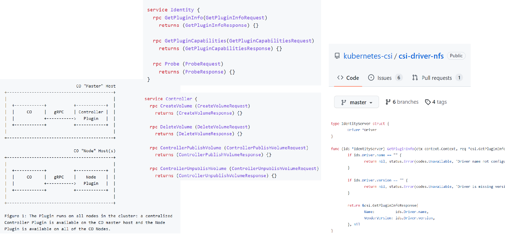
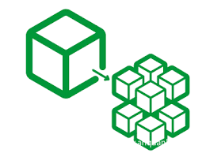

技术成长过程中的一些思考
===================

前段时间在公司内做了一次《技术成长之路》的分享，总结了我个人在职业发展过程中对技术的一些思考，对外版PPT已经放在[kubernetes-reading-notes](https://github.com/duyanghao/kubernetes-reading-notes)首页，本文主要对这次分享做一个文字性的描述，仅供参考

## 自我介绍

本人于2016年毕业以校招生的身份进入腾讯，并在腾讯负责云原生方面的组件以及架构开发，并在去年来到联易融公司负责边缘计算这块的产品设计以及研发工作

由于我个人对开源十分热衷，非常喜欢在社区分享一些自己的技术积累和想法，因此在过去几年的工作时间里我先后参加了几场社区分享以及直播，包括：[K8s&云原生技术开放日（深圳站）- harbor企业级方案设计与落地实践](https://cloud.tencent.com/developer/salon/salon-1151)、[腾讯云十年乘风破浪直播 - Kubernetes集群高可用&备份还原概述](https://mp.weixin.qq.com/s?__biz=MzUxODA5ODA1Nw==&mid=2247488105&idx=1&sn=cfb8e689a251fcbce1ef13d8afa66256&chksm=f98f4f8fcef8c6997de4f4c034e76cb2eb67ce0b8fb717c7ff040152fc21cb2f43f3164d547c&mpshare=1&scene=1&srcid=1022HsY0bRMBKPY5P00mVnjW&sharer_sharetime=1603685681187&sharer_shareid=3b976c5e6fc040f7754b741576df2331&rd2werd=1#wechat_redirect)、[全球边缘计算大会(深圳站) - 联易融边缘计算在供应链金融领域的应用](https://m.inmuu.com/v1/live/albums/3670)等

另外，我也有幸参与了腾讯开源边缘容器框架[SuperEdge](https://github.com/superedge/superedge)的贡献工作。同时为了学习Kubernetes以及后台架构，我开源了[kubernetes-reading-notes](https://github.com/duyanghao/kubernetes-reading-notes)，希望对深入学习云原生以及边缘计算的同学有所帮助

接下来我将从优秀技术人员具备的能力、技术成长中的核心关注点以及技术人员的综合素质等方面展开介绍，并最后给出一些工作的其它思考

## 优秀技术人员具备的能力

我们可以从一个项目出发来讨论一个优秀的技术人员所应该具备的能力

### 快速且合理的技术选型能力

当我们接受到一个新的项目时，首先要做的就是对该项目涉及的技术进行一个快速且合理的选型分析，可以从技术路线以及开源选型两方面进行：

* 技术路线：纯开源 vs 二次定制 vs 纯自研

* 开源选型：针对某一类别或者领域的开源项目进行对比，并选择出功能场景最合适的项目

### 复杂问题的技术拆解能力

在技术选型后，我们下一步需要考虑的就是如何将整个项目可执行化，通俗地讲也就是如何分工，因此需要对项目进行技术拆分，将一个大且复杂的问题拆分成若干个小且简单的问题，再对拆分后的问题以此类推不断拆分，最终形成若干个相对独立且容易解决的技术组件或者功能。这种方法借鉴了二分法的算法思想：

### 优秀的框架设计封装能力

在真正开始编写代码之前需要进行很重要的一个步骤，就是对技术拆分后的组件或者功能进行框架设计，所谓‘代码未动，文档先行’，好的框架以及文档对后续代码开发以及维护将事半功倍

在进行框架设计时，我们需要从可扩展性、可维护性以及稳定性等多个维度进行综合考虑，这样才能设计出比较优雅的架构，而优雅的框架会使得软件开发规范化、效能化以及规模化等

### 高质量的代码编写能力

在设计了一个好的框架后，接下来就是”真刀真枪“的动手写代码了，这部分也是一个程序员能力的最直接体现，好的编程水平体现在如下几个方面：

### 全面周到的技术取舍能力

在项目进展过程中难免会遇到一些技术难题，这些问题不是那么容易解决，或者是需要投入足够的人力、时间比较优雅地解决，或者是通过在性能、一致性等方面的折中妥协上快速解决，“鱼与熊掌不可兼得”，这个时候就需要在开发成本与技术优雅性之间权衡，找到一个平衡点，既可以一定程度解决问题满足需求，又不至于在不必要的场景下’自嗨‘投入过多

### 准确的问题定位和修复能力

软件维护占据整个软件生命周期成本的75%，包括：修复bug、适配、调优、安全防护等。而一个人之所以厉害，很大程度在于他能解决别人不能解决的问题，这也是我进入腾讯时我的导师跟我说的一句话，受益终身

## 技术成长核心关注点

上面我从比较抽象的层面介绍了我认为的一个优秀的技术人员所需要具备的6种能力，缺一不可。下面我将更加具体的介绍技术成长过程中的核心关注点，这些东西都是我们日常可以具体执行的，养成好的技术习惯对职场发展至关重要，同时也是程序员自我修养的直接体现

### 内容修炼：计算机三大核心技术

我非常认同我大学恩师的一句话 ，“纵观计算机整个发展历史，逃脱不了三大核心技术：硬件I/0、编译器以及操作系统“。了解了硬件，你就知道CPU架构是什么样的，什么是寄存器，它又有什么用？实模式与保护模式的区别是什么？CPU是如何执行指令的？；了解了编译器，你就知道一个用高级语言编写的代码如何一步步通过编译、链接(静态链接、动态链接)，然后加载到内存中运行的；了解了操作系统，你就打通了上层代码与下层硬件，知道程序是如何通过操作系统的管理有条不紊地在CPU上运行。而我根据自己的读书经验也推荐了几本比较合适的书籍供大家参考学习

需要特别说明的是，尽管CPU、编译器以及操作系统在我们日常的工作中看起来似乎没有用到，但是在一些关键的问题上还是能发挥决定性的作用；同时也是美国卡脖子的关键所在，“三大核心技术强则国强”，工作除了满足我们的生活需求，我始终认为国内程序员要有理想和抱负，不甘于落后于美国

### 外功修炼：培养良好的编码规范与习惯

内功修炼决定了我们对计算机的理解有多深，而外功修炼决定了我们代码有多‘漂亮’，我总结了三方面的编码规范与习惯：

#### 1、培养规范的命名习惯

变量命名是开发代码中遇到最多的情况，好的命名应该满足如下四方面的要求：驼峰命名(基于Go的规范)、顾名思义、特殊字符以及活用缩写

#### 2、培养结构清晰、可扩展的代码组织习惯

好的代码组织结构应该达到一目了然的效果，功能尽可能清晰，方便扩展。而自从云原生领域以Kubernetes为核心构建生态之后，诸多云原生的项目都参考Kubernetes的目录结构构建（当然Kubernetes本身也因为其极佳的可扩展性广为流行）：

#### 3、培养可读性强的注释以及文档编写习惯

好的文档以及注释有助于理解项目以及代码逻辑，而不管是注释、git commit还是项目README我们都应该写的尽可能详细，这样可读性才会强：

### 进阶修炼：培养良好的编码素养

外功修炼固然重要，但是仅仅如此还是不够的，如果我们想往更高阶发展，还需要更加重视编码素养的培养，下面将从10个方面展开介绍：

#### 1、培养代码测试的习惯，是程序员的基本素养

在交付功能代码或者接口之前我们需要对自己负责的模块进行系统测试，整体来说测试的形式不限，根据情况不同灵活变动，但需遵守几个原则：

* 核心逻辑全覆盖

* 关键路径性能压测

* 交付前接口自测

#### 2、培养抽象封装函数接口的习惯，提高代码可复用性

函数封装是程序员的必备技能，好的函数封装能使代码精简，可读性好，另外也便于复用。函数封装抽象程度不限，但是总体来说需要遵循几个原则：

* 函数功能单一
  do one thing, and do it well.

* 代码超过2/3个地方使用，函数封装

* 公共代码封装

* 函数不超过100行(特殊情况除外)

#### 3、 培养添加代码容错机制的习惯，提高代码可靠性

> Anything that can go wrong will go wrong.
> 
> 任何可能出错的地方都会出错
> 
>                       —Murphy's law

根据墨菲定律，我们需要在代码容易出错的地方添加容错机制，提高代码的可靠性与稳定性。考虑最坏的情况编写代码，这样写出来的代码才会足够健壮：

#### 4、培养扩展接口的设计习惯，提高代码可扩展性

程序的可扩展性取决于接口是否具备可扩展性，不管是存储、计算还是调度。总体来说，无侵入的接口扩展方式可以分为两种：内嵌插件以及独立服务

内嵌插件是编写扩展的插件实现指定的接口，然后与项目一起打包运行，这种方式最终是形成一个二进制文件，运行效率以及部署效率高：

而独立服务通过gRPC等远程调用的方式执行按照指定规范扩展实现的第三方插件，插件与核心项目独立维护迭代，这样扩展的插件不会影响主体项目的发展和合并。相比而言，这种方式保证了核心项目的精简与快速迭代，因此更加优雅。而Kubernetes的存储扩展接口就是由上述内嵌插件模式转变为基于独立服务模式的CSI

#### 5、培养简短精悍的编码风格，提高代码可读性

不好的代码千奇百怪，但好的代码一定是简短精悍，同时具备极高的可读性：

#### 6、培养关键路径多用缓存、算法优化的习惯，提高性能

在程序的某些关键性能环节，我们需要利用算法、缓存以及增量思维来解决。对于算法来说，基本上只有面试的时候会强调重视，工作中很少需要用到，也就是我们常常调侃的“面试造火箭，工作拧螺丝”，但实际上在一些关键的性能环节上，这些经典的算法往往可以发挥举足轻重的作用：

而对于分布式的应用来说，单体的性能优化可能不会起到决定性的作用，这个时候就需要善用缓存以及增量思维来解决问题了：

#### 7、培养多核多线程/协程编码思维，提高并发性

现代服务器的计算资源非常充足，基本都是多核多线程，如何编写程序充分利用这些资源就是一个很大的问题。基于这种前提，我们要培养自己的多线程/协程编码思维，提高程序的并发性：

#### 8、面向云原生编程，适应分布式云计算架构

在上云的大背景下，云原生，DevOps已经不单单是运维人员需要关注的问题，开发以及架构设计人员应该学习熟悉云原生的技术形态和理念，充分拥抱云原生，并基于云原生编码，适应分布式的云计算架构。这里我总结了四种具体执行的思路：

1）面向微服务拆分应用

将应用按照功能模块进行合理拆分，使得拆分后的每一个服务都尽可能独立，这样做的优点有很多：敏捷、弹性、开发效率高、可扩展、易于部署以及开放。但是切记不要为了微服务而微服务，将服务拆分的过于细，这样不仅不能提高开发效率，反而会降低部署以及运维效率：

2）声明式API

尝试使用声明式API来编写程序，系统会更加健壮：

3）横向扩展应用

可以将一个单体的服务分离出无状态的服务以及有状态的服务，无状态的服务可方便水平横向扩展，而有状态的服务可单独维护扩展，通过这样实现状态分离，最大程度提高服务的吞吐率：

4）云原生高可用

Kubernetes本身提供了若干种高可用的实现方式，归类如下：

* 无状态的服务可采用多副本的形式部署，并利用节点亲和性使副本不会部署在同一个工作节点上，从而实现一定程度的高可用，这是最简单且最实用的一种方式

* 有状态的服务则相对较为复杂，可利用Kubernetes内置的分布式锁，采用Leader-候选者模式实现高可用；而对于高可用相对复杂且变化较多的数据库服务，则需要采用不同的数据库高可用原理，例如：Redis的一主二从三哨兵模式 以及 Etcd的Raft算法

#### 9、培养规范的开源项目管理习惯，更好地拥抱世界

闭源的软件写的再天花乱坠却始终无法共享给社区的其他人看，这在我看来就是一种技术浪费。相比而言开源意味着开放，共享，也能更好地激发程序员内心的成就感，简而言之，技术成就感来源于开源认可度

而为了更好地拥抱世界，我们需要了解开源的基本运作模式，这里面就包括：如何贡献代码？开源项目版本如何管理？如何给项目提Bug以及建议？如何维护项目PR？等

#### 10、培养抽象封装框架的能力

最后也是最高阶的能力，就是学会如何抽象封装框架。而要培养这方面的能力，就必须多读优秀的框架，例如：容器编排标准Kubernetes、云原生分布式存储Etcd，边缘容器框架SuperEdge以及分布式计算引擎Spark等；同时在多读优秀项目的基础上，我们要多模仿，在实践中使用，这样久而久之能力就上去了。

**当你努力追赶大牛时，某一时刻你也会变成大牛！！！**

## 技术人员综合素质

除了上述提到的硬实力以外，技术人员还需要培养一些软实力，全面提高自己的综合素质

### 会画架构

所谓’一图胜千言‘，一张好的架构图比大段大段的文字性描述更加直接清晰，且信息量更多，更容易让人理解和接受

**不会画架构的架构师，不是好的架构师**

### 能写文章、材料

能把自己理解的说清楚也是一种能力，包括：

### 拥抱变化、技术开放

尝试抱着开放的心态接纳新的技术，并在实践中不断融入新的技术，学以致用

**主动学习，终生学习**

### 培养指导基层技术人员

在个人成长到一定阶段后就会面临如何培养指导基层技术员工，而针对不同阶段以及级别的工程师指导方式也不尽相同，这里我根据自己的经验进行了总结：

#### 技术影响

**普通人靠平台增加影响，大牛靠成果影响平台乃至世界**

## 其它一些思考

最后，在讲完技术成长的一些思考后，我也想给出一些个人工作的思考和总结：

### 培养好的职场习惯

### 保持好的学习习惯

### 关于技术转型的思考

### 最后一点零散的建议

## 总结

本文从我个人的工作经验出发，思考了优秀技术人员应该具备的能力、技术成长过程中的核心关注点以及技术人员的综合素质，最后给出了一些工作上的思考和建议。希望通过这篇文章能引起读者的思考，对他们的职业发展有所帮助
